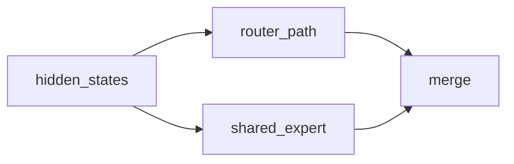
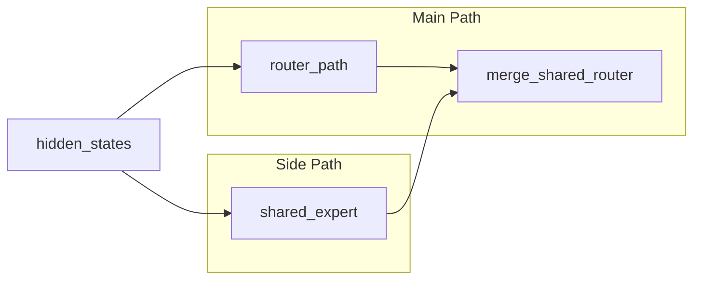
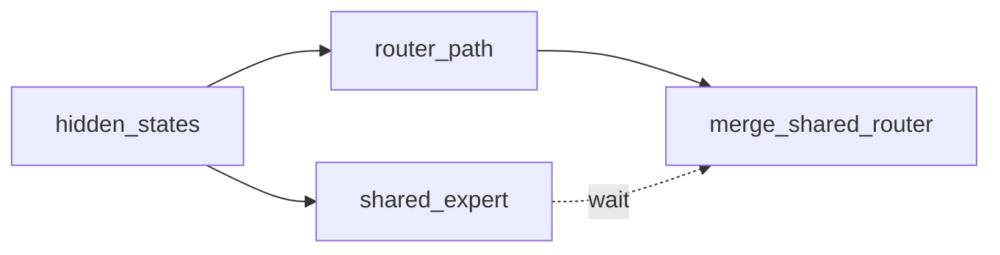

# 整网模块拆解与候选编排派生

多流分析分两个拆解层级和一个派生阶段：先把整网拆成模块、判模块间并行，再把每个候选模块拆成算子、判模块内并行，最后基于两层 DAG 和资源标签为每个并行点派生候选编排。本页只讲技术规则，产出怎么记账（Dashboard / round / 状态）由调用方负责。

## 总目标

- 把整网中每一种 decoder layer 内的模块拆出来，画出单层模块 DAG，识别模块与模块间的候选并行关系。
- 对每个候选模块继续拆成算子，画出模块内算子 DAG，识别模块内候选并行关系。
- 基于模块 DAG、算子 DAG 和资源标签，为每个并行点派生候选编排。

## 一、整网模块拆解规则

### 1. 从一层完整 decoder layer 出发

第一步必须从整网 decoder layer 的执行路径出发，而不是直接抓某个局部热点函数。先看清：整网主路径从哪开始到哪结束、当前分析的是 `prefill` 还是 `decode`、整网里有哪些模块。

### 2. 模块定义

一个模块必须同时满足：

1. **语义完整**：例如 `Attention Main Path`、`Router Path`、`Shared Expert`、`Dispatch`、`Expert Compute`、`Combine`、`KVCache Offload`。
2. **输入输出明确**：能说清它的输入、输出、是否写共享状态。
3. **可独立讨论调度**：能单独判断"是否可能和别的模块并行"。
4. **尺度合适**：不能只是局部 reshape / cast / view 或某个融合算子内部的小步骤，也不能是整个 Decoder Layer——**Decoder Layer 至少要再往下拆一层**。

### 3. 优先沿这些边界拆

- 子网络边界：`Attention` / `MoE` / `MLP` / `LM Head`
- 通信边界：`all_to_all` / `send/recv` / `all_gather` / `reduce_scatter`
- 状态边界：`KVCache update` / `offload` / `reload`
- 同步边界：`record_event / wait_event` / `wait_stream`
- 资源边界：明显偏计算、偏通信、偏搬运的切换点

## 二、整网模块 DAG 规则

### 1. 节点

一个节点对应一个模块，节点名要体现模块语义；汇合点可以单独画成控制节点（如 `merge_shared_router`）。节点不能是 Decoder Layer，要再往下拆至少一到两级。

### 2. 边类型

每条边必须标依赖类型：

- `data`：后继直接消费前驱输出
- `state`：后继依赖前驱写完 cache / buffer / 共享状态
- `event`：后继依赖前驱的事件、同步或 stream wait
- `collective_order`：通信顺序固定，不能随意重排

### 3. 共同输入不是依赖

两个模块都用同一个输入（如 `hidden_states` 同时进 `router_path` 和 `shared_expert`）时，不要在它们之间画依赖边，而是补一个共同上游节点：



### 4. Mermaid 画法

- 统一用 `flowchart LR`。
- 还没决定流归属时用 `Main Path / Side Path / Comm Path`；代码里已明确是 `Stream0 / Stream1` 才用流名做 `subgraph`。
- 边：`-->` 表示 `data` 或 `state`，`-.->` 表示 `event`。

## 三、模块级并行性判断

**判 `serial`**（满足任一即必须串行）：存在 `data` 依赖；存在共享可写状态冲突；通信顺序固定不能插入；其中一个只是另一个的内部步骤。

**判 `parallel_candidate`**（同时满足）：没有 `data` 依赖；没有明确共享写冲突；两者结果到后面的汇合点才相遇；通信顺序没把它们绑成单链条。

**判 `parallel_pending_validation`**：逻辑上可并行，但资源是否冲突、shape 是否太小、图模式 / runtime 是否有限制、是否引入额外 clone / buffer / host 开销这些还没确认。

## 四、算子级拆解规则

- **每个候选模块都要做算子拆解，每个节点必须是单个算子**（或没必要再拆的算子组）。
- 仍优先沿计算 / 通信 / 同步 / 状态边界拆；模块内的共同输入、汇合点、同步点要单独标清。
- 每个模块产出：模块内算子清单、算子级依赖、算子级 DAG。

### resource_hint 填写

`resource_hint` 在生成模块清单和算子清单时同步填写，对每个可并行点从 profiling 的 `kernel_details.csv` 读算子行级资源信息回填。定位某模块 / 节点对应的算子行，靠调用方提供的算子归属信息或源码对照确定；字段查法和命令见 [`kernel-fields-lookup.md`](kernel-fields-lookup.md)。

推荐读取字段：

| 字段 | 用途 |
| --- | --- |
| `Name` | 确认算子身份 |
| `Stream ID` / `Task ID` | 判断落流和下发顺序 |
| `Input Shapes` / `Output Shapes` | 判断跨流 tensor 尺寸和额外搬运风险 |
| `Duration(us)` | 判断主路径窗口和副路径耗时 |
| `Accelerator Core` | 判断 cube / vector / mix 类型 |
| `Block Dim` | 判断实际占用核数，不用算子类型二元推断 |
| `Mix Block Dim` | 判断混合算子的另一侧核数 |
| `aic_mac_ratio` / `aic_mte2_ratio` | 判断 cube 计算 / 搬运占比 |
| `aiv_vec_ratio` / `aiv_mte2_ratio` | 判断 vector 计算 / 搬运占比 |

`resource_hint` 写成可读摘要，不贴 raw 表，例如：

- `cube-heavy, blk=20, dur=35us`
- `vector/mem-heavy, aiv_mte2_ratio high, dur=18us`
- `light cube, blk=1, can overlap with main matmul`

关键约束：

- MatMul 也可能 `Block Dim=1`，Vector 也可能占满核，**不要用算子类型推资源占用**。
- 主路径 dominator 算子 + 同时刻副路径候选算子的 `Block Dim` 加和，要和设备 `ai_core_cnt` / `vector_core_cnt` 比较。
- 设备核数从 `CANN 软件安装目录/<arch>-linux/data/platform_config/<soc_version>.ini` 读取。

## 五、候选编排派生规则

对**每个**可并行点至少给出 2 种不同编排。把共享同一输入、彼此无 `data` 依赖的模块 / 算子看成一个候选集合，优先按集合划分思考分流，而不是只从主流里挑一个"副流子集"。

每个候选要能看出：并行什么、怎么分流、在哪里汇合、为什么可能有收益、主要风险是什么，并配一张方案 DAG。**并行对象、流分组、汇合点、tag 粒度或跨阶段 overlap 不同，就是不同的候选**，不要把它们塞进同一方案。

常见派生维度：

- **算子粒度**：是否需要合并 / 拆分 / 重排算子
- **集合划分**：哪些模块 / 算子同流串行，哪些放到另一条流
- **汇合点**：早汇合还是晚汇合
- **流数量**：双流还是三流
- **tag 粒度**：同一副流串行下发还是多个独立副流
- **跨阶段 overlap**：仅本模块内，还是跨层 / 跨阶段掩盖 dominator

实现强度（C1 最小切流 → C2 + 控核 → C3 + 手动同步）是同一候选的复杂度递进，不算不同候选——见 SKILL 正文"分析"一节。

## 六、方向级分析产物模板（`analysis/<direction>.md`）

本页拆解出的整套结果（模块 / 算子 DAG + 并行性判断）就是多流方向的**方向级分析产物**：一个模型一份，被该方向派生出的所有候选 Plan 共享和引用，不要拷进每个 Plan 的方案细节。它在候选发现阶段产出，从编排报告的「候选发现记录」链接出去（建议落到 `analysis/multi-stream.md`）。

**固定按下面骨架落盘**，保证跨 run、跨 agent 的结构一致：

### 1. 分析范围

- 模型 / 网络：
- 阶段：`prefill` / `decode`
- 分析对象：
- 代码入口：
- 执行模式：`Ascend IR / GE 图模式` 或 `npugraph_ex / aclgraph`

### 2. 整网模块

#### 2.1 模块清单

| module_id | module_name | module_type | inputs | outputs | side_effect | resource_hint |
| --- | --- | --- | --- | --- | --- | --- |

#### 2.2 模块依赖清单

| from | to | dependency_type | reason |
| --- | --- | --- | --- |

#### 2.3 模块 DAG

```mermaid
flowchart LR
```

### 3. 模块内算子

为**每个候选模块**复制一组，不要只写部分模块：

#### 3.x \<module_name\>

- 算子清单：`op_id / op_name / op_type / inputs / outputs / side_effect / resource_hint`
- 算子依赖清单：`from / to / dependency_type / reason`
- 算子 DAG：mermaid

### 4. 候选编排清单

每个可并行点 ≥2 个候选，每个候选给到"描述 + DAG"这一层：

#### 候选-N：\<名\>

- 方案描述：并行什么 / 怎么分流 / 在哪汇合 / 可能收益 / 主要风险
- 方案 DAG：mermaid

候选进入编排报告后各自成为一个 Plan；更细的流分组、GE auto-reorder 风险、overlap_pct 实测在该 Plan 的方案细节里按 [`plan-detail-fragment.md`](plan-detail-fragment.md) 展开，不写在本产物里。

## 七、最小示例

把整网中一段 MoE 路径整理成模块级骨架：

### 模块清单

| module_id | module_name | module_type | inputs | outputs | side_effect | resource_hint |
| --- | --- | --- | --- | --- | --- | --- |
| router_path | Router Path | compute | hidden_states | routed_hidden_states | 无 | compute + comm |
| shared_expert | Shared Expert | compute | hidden_states | shared_hidden_states | 无 | compute |
| merge_shared_router | Merge Shared Router | control | routed_hidden_states, shared_hidden_states | hidden_states | 无 | light compute |

### 依赖清单

| from | to | dependency_type | reason |
| --- | --- | --- | --- |
| router_path | merge_shared_router | data | merge 需要 routed_hidden_states |
| shared_expert | merge_shared_router | data | merge 需要 shared_hidden_states |

### 模块 DAG



### 候选编排：shared_expert 旁路双流

`router_path` 与 `shared_expert` 共享 `hidden_states` 输入，在 `merge_shared_router` 前汇合。该候选把 `shared_expert` 放到 Side Path，用它掩盖 `router_path` 主路径窗口；资源标签从 `kernel_details.csv` 的 `Block Dim` / pipeline ratio 补齐。主要风险是副流过重导致拖尾，或汇合点过早导致主流空洞。


