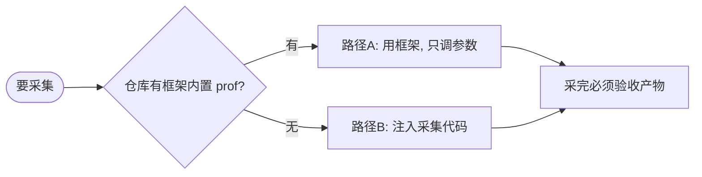

# NPU Profiling 采集技能

本技能帮助你在华为昇腾 NPU 上用 `torch_npu.profiler` 正确采集 PyTorch 模型性能数据，产出与 Ascend 官方 TensorBoard/Profile 插件兼容的 `ASCEND_PROFILER_OUTPUT` 目录。

采集有两条路径：**框架内置**（仓库已经把 profiler 接进推理循环，你只改参数）和**注入采集**（仓库没有 profiler，你自己写采集代码）。**第一步是 Step 0 路由判断用哪条**。

---

## Step 0：路由 —— 框架内置 vs 注入采集（最先做）



**怎么判断"有没有框架内置 prof"** —— 满足任一即视为有：

```bash
# 1) 有没有 profiler 封装（cann-recipes-infer 的标志）
ls executor/utils/profiler_context.py 2>/dev/null

# 2) 推理配置/循环里有没有 enable_profiler 开关
grep -rn "enable_profiler" executor/ models/ 2>/dev/null | head
```

- 命中 → **路径 A**（优先）。本仓库 `cann-recipes-infer` 就属于这种：profiler 已经接进推理引擎，只需开开关 + 调参数。
- 都没命中 → **路径 B**（注入）。

> 通用判据（迁到别的仓库时）：搜 `torch_npu.profiler`、`tensorboard_trace_handler`、`enable_profiler` / `profile` 配置项。已经接进推理循环的就走 A，只有零散 API 的就走 B。

---

## 采集前：确认采集范围（路由后、动手前先问用户）

判定走哪条路径后、真正动手前，先问用户两件事（有 AskUserQuestion 就用它给选项，没有就直接文字提问。默认值见下）：

| 要问的 | 选项 | 默认（用户没特别要求时） |
|---|---|---|
| **采哪个阶段** | `prefill` / `decode` / `both`（两个都采） | **both —— 默认采完整数据** |
| **decode 采几步** | 例如 3 / 10 / 30 / 全程 | **足够覆盖稳态的步数（建议 ≥ 10）；要"完整数据"就把步数设大** |

补充约定（避免采到无效数据）：
- prefill 通常每个 request 只有 1 步，所以 prefill 的 `active` 固定为 1。
- 第一次图编译 / JIT 必须在采集窗口外预热（见路径 B「关键 3」），否则采到的是编译时间不是推理时间。
- "采完整数据" = 两个阶段都采 + decode 步数取大，而不是把 schedule 的 `warmup` 调大。

---

# 路径 A：使用框架内置采集（cann-recipes-infer）

框架已经把 `torch_npu.profiler` 接进推理引擎，**你的工作只是：开开关 → 按用户选择调参数 → 验收产物**，不要再注入新的采集代码。

## A.1 怎么开启

在 YAML 的 `model_config` 下把开关打开：

```yaml
model_config:
  enable_profiler: True   # 默认 False
```

然后照常 `bash executor/scripts/infer.sh --model <model> --yaml <yaml>` 跑。

## A.2 框架默认采了什么（实测）

`enable_profiler: True` 时，框架的 `ProfilerManager`（`executor/utils/profiler_context.py`）在推理引擎里自动干这些事：

| 阶段 | schedule 参数（默认） | 输出目录 |
|---|---|---|
| **prefill** | `active=1, skip_first=0, warmup=0, repeat=1` | `<res_path>/prof/prefill/` |
| **decode** | `active=3, skip_first=3, warmup=0, repeat=1` | `<res_path>/prof/decode/` |

- 配置已经是 **`ExperimentalConfig(Level1 + PipeUtilization)`**（与本 skill 的硬性要求一致，不用动）。
- `<res_path>` = `models/<model>/res/<date>/<case>/`，与日志 `log_0.log` 同级。
- prefill 和 decode **各产一份** `prof/<phase>/.../ASCEND_PROFILER_OUTPUT/`（实测两个目录都会生成）。
- 注意：prefill profiler 是 `active=1`，每 request 只采 1 步 prefill（prefill 本就只有 1 步，设计如此）；实测能产出有效的 47 列 CSV。要更细的 prefill 分析（多步/自定义窗口）用注入路径模式 B。
- 多卡时每个 rank 各采一份（同一个 `enable_profiler` 开关控制）。

> 调用链：`execution_engine.py` 持有 `ProfilerManager`，每个 forward 调 `set_status(is_prefill)` + `step()`。`model_runner.py` 里另有一套 `define_profiler`（prefill `active=1`、decode `active=10/skip_first=10`），但**离线 infer 实际走的是 `ProfilerManager` 这条**，调参数认 `profiler_context.py`。

## A.3 怎么调采集参数（只改这里）

框架的采集参数是**硬编码在 `executor/utils/profiler_context.py`** 的，YAML 只暴露了 `enable_profiler` 总开关。要改"采几步 / 从第几步开始 / 采哪个阶段"，改下面这些调用点的入参：

| 你想改的 | 参数 | 改哪里（`profiler_context.py`） | 语义（实测） |
|---|---|---|---|
| **decode 采几步** | `active` | `create_profiler` 默认参数（decode 分支不传，吃默认 `active=3`） | 真正记录的步数。要"完整数据"就调大，例如 30 |
| **decode 从第几步开始** | `skip_first` | 同上，默认 `skip_first=3` | 跳过最前面 N 个 decode step 不计入采集（跳过启动抖动）。从第 `skip_first+1` 步进入采集周期 |
| **prefill 采几步** | `active` | `set_status` 的 prefill 分支，写死 `active=1` | prefill 每 request 只有 1 步，保持 1 |
| **只采 decode / 只采 prefill** | —— | 在 `set_status` 里把不想采的那个分支的 profiler 换成 `FakeContextManager()`（或加判断跳过） | 框架默认两个阶段都采；要单采就短路掉另一个分支 |
| `warmup` / `repeat` | `warmup` / `repeat` | `create_profiler` | 一般保持 `warmup=0, repeat=1` |

**清窗口规则（改 `active`/`skip_first` 后务必满足）**：decode 的 `prof.step()` 调用次数 ≈ 实际 decode 步数（受 `max_new_tokens` 控制），必须 `≥ skip_first + warmup + active`（精确边界）才能跨出采集窗口，实践再多 1 步收尾更稳。框架 decode 默认需要 ≈ `3 + 0 + 3 = 6` 步，`max_new_tokens=32` 远够；**把 `active`/`skip_first` 调大时，记得把 YAML 的 `scheduler_config.max_new_tokens` 同步调大并留余量**，否则窗口没跨出去、解析会出问题。

改完直接重跑 `infer.sh`，不需要改 YAML 之外的推理代码。

## A.4 采完必须验收产物（关键，不能跳）

**框架开了 `enable_profiler` 不等于拿到了可用数据。** 解析阶段（CANN `msprof` 离线分析）可能失败 —— 产物只剩一个**被截断的 `trace_view.json`**、CSV 全缺。**最常见的原因是 profiling 输出目录所在的文件系统/盘**（详见 A.5），不是框架代码、不是权限、不是版本。所以采完立刻验收：

```bash
RES=models/<model>/res/<date>/<case>          # 与 log_0.log 同级
# 1) 解析有没有报错（最快的信号）
grep -c "run failed" "$RES"/log_0.log          # 期望 0；非 0 => 解析失败
# 2) 你采的每个阶段都要查（默认 both 就两个都查；只采一个就只查那个）
for PHASE in prefill decode; do
  [ -d "$RES/prof/$PHASE" ] || { echo "WARN: prof/$PHASE 没生成（该阶段未落盘 => 视同失败）"; continue; }
  OUT=$(find "$RES/prof/$PHASE" -name ASCEND_PROFILER_OUTPUT -type d | head -1)
  echo "== $PHASE: ${OUT:-无 ASCEND_PROFILER_OUTPUT} =="
  ls "$OUT" 2>/dev/null                         # 期望含 kernel_details.csv op_statistic.csv api_statistic.csv
  if [ -f "$OUT/kernel_details.csv" ]; then
    head -1 "$OUT/kernel_details.csv" | tr ',' '\n' | wc -l   # 期望 ~47；只有 9 => 没开 Level1+PipeUtilization
  else
    echo "  kernel_details.csv 缺失 => 解析失败, 走 A.5"
  fi
  python3 -c "import json;json.load(open('$OUT/trace_view.json'));print('  trace_view VALID')" 2>/dev/null \
    || echo "  trace_view.json 截断/无效 => 解析失败"
done
```

| 验收项 | 期望 | 不符合时 |
|---|---|---|
| `log_0.log` 里 `run failed` 计数 | **0** | 非 0 → 解析阶段失败，见 A.5（先换输出目录）|
| 你采的每个阶段都有 `prof/<phase>/.../ASCEND_PROFILER_OUTPUT/` | 存在 | 缺失（比如默认 both 却没 `prof/prefill`）→ 该阶段没落盘，视同失败、走 A.5 |
| `kernel_details.csv` 列数 | **~47** | 缺失/打印 `1` → 解析失败走 A.5；只有 9 → 配置没带 `Level1+PipeUtilization`（框架默认带，正常不会发生）|
| `op_statistic.csv` / `api_statistic.csv` | 存在 | 缺失 → 同 `run failed`，走 A.5 |
| `trace_view.json` | 合法 JSON、以 `]` 结尾 | 截断/报错 → 解析失败，走 A.5 |

## A.5 验收不过怎么办：先换输出目录，再考虑注入

框架 `enable_profiler` 的离线解析是 CANN 的 `msprof` 工具在跑。当出现**所有 view 解析任务 `run failed` + 没有任何 CSV + `trace_view.json` 被截断**这组症状时：

> **根因（已实测定位）**：最常见的原因**不是**框架代码、**不是**目录权限、**不是** torch_npu/CANN 版本，而是 **profiling 输出目录所在的文件系统/盘**。某些挂载（数据盘 / 网络盘 / 特定 bind-mount）会让 CANN `msprof` 的离线分析产不出 CSV，而把输出换到另一个文件系统（尤其本地盘）就完全正常。实测：**同一份采集数据**，输出在原目录 → 全部 parser run failed、无 CSV、trace_view 截断；只把输出目录换到另一个盘 → 框架原样产出 `kernel_details.csv` 47 列 + 全套 CSV、零 run failed。验证方法：把那份失败的 `*_ascend_pt` 原始数据 `cp` 到另一个盘再 `torch_npu.profiler.profiler.analyse(<dir>)`，能解析出 CSV 就坐实是输出目录的问题。

**修复步骤（按顺序）：**

1. **首选 —— 把 profiling 输出换到另一个目录/文件系统**（优先本地盘），重跑后重新走 A.4 验收。
   profiler 输出路径 = `os.getenv("WORK_DIR")/os.getenv("RES_PATH")/prof/...`（`execution_engine.py:83`）。**注意 `function.sh` 会把 `WORK_DIR` 写成 `models/<model>`，直接 `export WORK_DIR=...` 会被覆盖、不生效**。可靠做法是把 `res` 目录软链到本地盘：
   ```bash
   mkdir -p /tmp/recipes_res
   # 若 models/<model>/res 已是非空真实目录, 先移走/备份再软链
   ln -sfn /tmp/recipes_res models/<model>/res
   bash executor/scripts/infer.sh --model <model> --yaml <enable_profiler:True 的 yaml>
   # 重新跑 A.4：run failed 应为 0、kernel_details.csv 应 ~47 列
   ```
   多换几个盘定位哪个文件系统可用。

2. **换了几个盘都还不行**，再回退到**路径 B 注入采集**（`scripts/profile_template.py`）兜底：把模型加载与单步推理填进去、自己起 profiler。

**一句话判定**：`grep -c "run failed" log_0.log` 非 0 或 `kernel_details.csv` 缺失 → **先把输出目录换到另一个（本地）盘重试**；多个盘都不行才走路径 B。

---

# 路径 B：注入 torch_npu.profiler 采集代码

仓库没有框架内置 profiler（或框架产物验收不过）时，自己写采集代码。下面三条"关键"是注入采集的核心。

## 核心原理

NPU profiler 能不能拿到有用数据，取决于三件事：

1. **`ExperimentalConfig` 决定能采到哪些字段**（最关键）
2. **schedule 决定 profiler 在每一步处于什么状态**
3. **首次图编译 / JIT 必须放窗口外；prefill / decode 按需选择采或不采**

### 关键 1：`ExperimentalConfig` 决定 kernel_details 是 47 列还是 9 列

torch_npu 默认不开详细 AIC/AIV 流水 metric，必须显式传 `ExperimentalConfig`：

```python
experimental_config = torch_npu.profiler._ExperimentalConfig(
    profiler_level=torch_npu.profiler.ProfilerLevel.Level1,
    aic_metrics=torch_npu.profiler.AiCMetrics.PipeUtilization,
)
```

| 产物 | 带 `ExperimentalConfig` | 不带（默认） |
|---|---|---|
| `kernel_details.csv` 列数 | **47** 列（含 `Stream ID`、`Input/Output Shapes`、`aic_mac_ratio`、`aic_mte2_ratio`、`aiv_vec_ratio` …） | **9** 列（基本时间/dur/block_dim） |
| `op_statistic.csv` / `api_statistic.csv` | ✅ 生成 | ❌ 缺失 |
| `operator_details.csv`、`step_trace_time.csv`、`trace_view.json` | 生成 | 生成 |
| `communication*.json` | 仅多卡生成 | 仅多卡生成 |

**不带 `ExperimentalConfig` = 拿不到 pipeline utilization、算子 shape 和 stream 归属。** `kernel_details.csv` 只有 9 列就是这个原因，直接回来补 config。

| 参数 | 可选值 | 说明 |
|---|---|---|
| `profiler_level` | `Level0` / `Level1` / `Level2` | 默认 Level0 只收基本 trace；**Level1 是推荐默认**；Level2 追加更细 SoC 计数、体积更大 |
| `aic_metrics` | `PipeUtilization` / `ArithmeticUtilization` / `Memory` / `MemoryL0` / `MemoryUB` / `ResourceConflictRatio` / `L2Cache` | 只能选一组；**`PipeUtilization` 定位 cube/vector/mte 流水 bound**；关心 HBM/L2 带宽选 `Memory`/`L2Cache` |

绝大多数优化任务用 `Level1 + PipeUtilization` 就够。

### 关键 2：schedule 要让最后一次 `step()` 跨出 active 窗口

```
wait → warmup → active → (下一轮 / NONE)
```

状态在每次 `prof.step()` 时转换。循环结束时若 profiler 还停在 RECORD（没跨出 active），torch_npu 打：

```
[WARNING] Incorrect schedule: Stop profiler while current state is RECORD which may result in incomplete parsed data.
```

**规则：`prof.step()` 总调用次数 ≥ `skip_first + warmup + active + 1`。** 多出的 1 步让 schedule 跨出 active、触发收尾回调，profiler 干净退出。

**写法 A：MAX_STEPS 调够大**

```python
WARMUP, ACTIVE = 2, 30
MAX_STEPS = 33   # ≥ warmup + active + 1
with profiler as prof:
    for step in range(MAX_STEPS):
        run_one_step(); prof.step()
```

**写法 B：循环后补一次 `prof.step()`**（推荐，采样区间正好是你关心的 N 步）

```python
with profiler as prof:
    for step in range(MAX_STEPS):
        run_one_step(); prof.step()
    prof.step()   # ← 收尾：只推进 schedule，不跑推理
```

> 老文档里"`MAX_STEPS < warmup + active`"是误传：那样配 profiler 一定停在 active 中间。新版 CANN 会补 JSON，但 warning 照打。

### 关键 3：首次图编译放窗口外；prefill / decode 按需选择

把**第一次 `torch.compile` / torchair 图构建 / JIT** 放进窗口，trace 大头会变成编译时间。这类 framework overhead 必须在 profiler 启动前预热一遍。

prefill 本身是真实负载（kernel 分布、attention layout、MC2/all-to-all 调度都和 decode 不同），采不采看你想分析什么：

| 想分析 | 采哪些阶段 | 备注 |
|---|---|---|
| decode TPOT、decode kernel 瓶颈 | **只采 decode** | 最常见；prefill 离群步会拉偏统计 |
| prefill TTFT、长序列 prefill kernel | **只采 prefill** | decode 前无需跑 |
| 一条时间线对照 prefill vs decode | **一次采两者** | `trace_view` 清晰展示 prefill 单步 + 后续 decode |
| 分开对照、不混时间线 | **两次采，两个 save_path** | 每个 phase 一个 `ASCEND_PROFILER_OUTPUT` |

四种模式（完整代码在 `scripts/profile_template.py`）：

```python
# 模式 A：只采 decode（默认）
run_prefill(...); warm_one_decode(...)          # 预热，不采
with create_profiler("./prof_decode", warmup=0, active=N) as prof:
    for _ in range(N):
        model.decode(...); torch.npu.synchronize(); prof.step()
    prof.step()                                  # 收尾

# 模式 B：只采 prefill（prefill 通常 1 步，active=1）
warm_compile(...)                                # 预热第一次 prefill+decode 的图构建
with create_profiler("./prof_prefill", warmup=0, active=1) as prof:
    run_prefill(...); torch.npu.synchronize(); prof.step(); prof.step()

# 模式 C：一次采 prefill + decode（同一 timeline）
with create_profiler("./prof_both", warmup=0, active=1+N) as prof:
    run_prefill(...); torch.npu.synchronize(); prof.step()        # step 1: prefill
    for _ in range(N):
        model.decode(...); torch.npu.synchronize(); prof.step()   # steps 2..N+1: decode
    prof.step()                                                   # 收尾

# 模式 D：两次独立采集，两个 save_path（分别对比）
```

## 标准配置模板（注入）

```python
import os, torch, torch_npu

def create_profiler(save_path, warmup=0, active=30):
    """Level1 + PipeUtilization 拿 47 列 kernel_details。
    warmup 推荐 0：图编译/JIT 预热应已在 profiler 外做掉。"""
    os.makedirs(save_path, exist_ok=True)
    experimental_config = torch_npu.profiler._ExperimentalConfig(
        profiler_level=torch_npu.profiler.ProfilerLevel.Level1,
        aic_metrics=torch_npu.profiler.AiCMetrics.PipeUtilization,
    )
    return torch_npu.profiler.profile(
        activities=[torch_npu.profiler.ProfilerActivity.NPU,
                    torch_npu.profiler.ProfilerActivity.CPU],
        with_stack=False, record_shapes=False, profile_memory=False,
        experimental_config=experimental_config,
        schedule=torch_npu.profiler.schedule(
            wait=0, warmup=warmup, active=active, repeat=1, skip_first=0),
        on_trace_ready=torch_npu.profiler.tensorboard_trace_handler(save_path),
    )

# 用法见上面四种模式；完整可运行模板（带 PHASE 开关）见 scripts/profile_template.py
```

完整模板见 `scripts/profile_template.py`（`PHASE = "prefill"|"decode"|"both"|"separate"`，对应上面用户选择）。

---

## 产物自检清单（两条路径通用）

采完立刻对 `ASCEND_PROFILER_OUTPUT/` 自检：

```bash
python3 - <<'PY'
import json, glob, os
prof = glob.glob('./**/ASCEND_PROFILER_OUTPUT', recursive=True)[0]
kd = f'{prof}/kernel_details.csv'
if os.path.exists(kd):
    with open(kd) as f:
        cols = f.readline().strip().split(','); n = sum(1 for _ in f)
    print(f'kernel_details: {n} rows, {len(cols)} cols '
          + ('OK' if len(cols) >= 40 else 'WRONG — missing ExperimentalConfig?'))
else:
    print('kernel_details.csv MISSING — 解析失败(框架路径=>走A.5回退) 或没开 Level1+PipeUtilization')
try:
    json.load(open(f'{prof}/trace_view.json')); print('trace_view: valid JSON')
except Exception as e:
    print(f'trace_view INVALID/截断: {e}')
for fn in ['op_statistic.csv','api_statistic.csv','operator_details.csv','step_trace_time.csv']:
    print(f'{fn}: {"found" if os.path.exists(f"{prof}/{fn}") else "MISSING"}')
PY
```

| 检查项 | 期望 | 不符合 |
|---|---|---|
| `kernel_details.csv` 列数 | 47 | 9 → 没带 `ExperimentalConfig`；缺失 → 解析失败（框架路径走 A.5）|
| `op_statistic.csv` / `api_statistic.csv` | 存在 | 缺失 → 同上 |
| `trace_view.json` | 合法 JSON、以 `]` 结尾 | 截断 → 解析失败 / 收尾 step 漏调 |
| `step_trace_time.csv` 行数 | ≈ active | 明显偏少 → 循环内 `prof.step()` 漏调 |
| `communication*.json` | **仅多卡生成** | 单卡没有是正常的 |

## 输出结构

```
prof/
└── <hostname>_<pid>_<timestamp>_ascend_pt/
    ├── ASCEND_PROFILER_OUTPUT/
    │   ├── trace_view.json         # 时间线（TensorBoard / chrome://tracing）
    │   ├── kernel_details.csv      # 47 列算子执行明细（最重要）
    │   ├── op_statistic.csv        # 按算子类型聚合
    │   ├── api_statistic.csv       # host 侧 API 耗时
    │   ├── operator_details.csv    # 按 PyTorch op 聚合
    │   ├── step_trace_time.csv     # 每步 compute/communication 耗时
    │   ├── *.db                    # DB 版摘要
    │   └── communication*.json     # 仅多卡生成
    ├── FRAMEWORK/  PROF_*/  logs/  profiler_{info,metadata}.json
```

## 查看结果

```bash
tensorboard --logdir=./prof          # 需 pip install torch_tb_profiler，切 PyTorch Profiler tab
# 或 chrome://tracing 加载 trace_view.json
# 或 pandas 读 kernel_details.csv 做定制分析（拆解到模型结构 => 用 perf-breakdown-skill）
```

## 参考文档

- `scripts/profile_template.py` — 路径 B 可直接改用的完整模板
- `references/troubleshooting.md` — 版本差异、框架解析失败、具体报错、排查流程
- [torch_npu Profiler 文档](https://www.hiascend.com/document)
