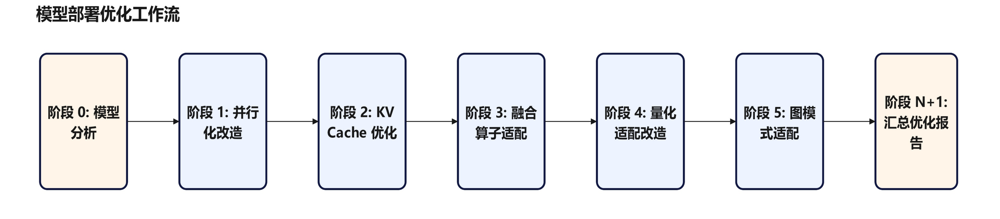
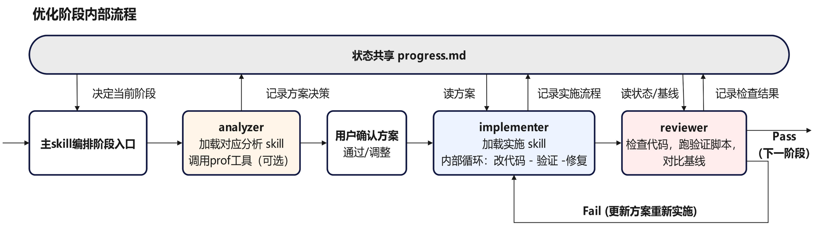

# DeepSeekV4.1-Flash 模型Agent实践

CANN 社区面向开发者提供一系列 Agent 工具链，覆盖多智能体编排、模型部署调优、量化实践、算子开发等端到端链路。DeepSeek-V4.1-Flash 优化实践项目中利用了多种 Agent 能力支持，例如 CANNBot-模型Agent 覆盖模型部署迁移与优化，支持精度问题定位；AMCT-Agent 支持模型的自动量化与部署；CANNBot-DSL 与 CANNBot-Tilelang 实现高性能融合算子的自动生成与性能调优等。

DeepSeek-V4.1-Flash（下文简称 V4.1）为 40 层 MoE 架构，跨层共享压缩 KV Cache，原生支持图文输入与最高 1M token 上下文，模型结构与优化实践见 [DeepSeek-V4.1-Flash CANN 优化实践](../models/deepseek_v4_1/deepseek_v4.1_flash_cann_tech_report.md)。本文展开 Agent 模型部署调优链路，以 V4.1 为例说明各阶段的典型流程。

## 结构与编排

### 分层与阶段

模型Agent 分两层组织。基础部署优化层面向新模型的完整接入，按固定顺序推进六个阶段：模型分析与基线建立、并行化改造、KV Cache 优化、融合算子适配、量化适配改造、图模式适配。这一顺序沿依赖关系排列，例如 KV Cache 布局需在切分方式确定后才能定，图模式需前序改造不再引入动态分支。每阶段以精度验证通过作为进入下一阶段的前置条件。

<p align="center">
  
</p>

进阶性能调优层在已有可运行基线之后进入，多流、SuperKernel、权重预取一类特性在该层接入；与基础层的固定阶段不同，这一层没有预设的优化项，方案的去留由实测收益判定。

### 角色与状态传递

单个 Agent 兼任分析、实施与验证，容易越界改动并漏检自身引入的问题，因此按职责隔离为四个角色：主 Agent 负责阶段编排、用户确认与进度管理；analyzer 只读代码，产出方案与依据；implementer 读写代码，完成改造、调试与自验证；reviewer 只读，产出精度与性能结论。跨角色状态经 `progress.md` 传递，方案、实施记录与验证结论以该文件为准。

<p align="center">
  
</p>

### 约束机制

阶段前置条件、验证门禁与角色权限写在 skill 与 agent 定义中，规定各阶段的推进条件与各角色的可执行范围；脚本在工具调用前后强制检查这些规则，拦截越界修改、状态未落盘与未经验证即提交，并对同一阶段的循环轮次设上限。

## 基础部署优化

### 阶段 0：模型分析与基线建立

V4.1 有两条输入路径：模型由 ViT 视觉编码与 LLM 解码两段构成，图像经视觉编码器映射进 LLM 隐层空间后与文本 token 在同一残差流中参与推理，纯文本与图文需分别验证。长序列下显存是先决约束，序列长度与批大小受单卡容量限制，仓库内按部署形态给出多份配置。

模型Agent 在该阶段可完成模型结构分析、权重加载与转换、配置项对齐、推理入口验证与精度基线采集。对 V4.1 这类多输入路径的结构，按路径分别验证并各采一份基线；部署配置的取舍涉及显存与目标场景，由开发者确认后固定，基线元数据随之落盘，作为后续各阶段的比对基准。

### 阶段 1：并行化改造

V4.1 的 Prefill 与 Decode 资源特征相反：Prefill 算力密集，开销随序列长度线性增长；Decode 带宽密集，每 token 的主要开销是搬运一轮权重。两阶段因此适合不同的切分方式——Prefill 可用 Context Parallel（CP，上下文并行）把单条请求的序列切到各卡，叠加 Expert Parallel（EP，专家并行）承载 MoE；Decode 按 Data Parallel（DP，数据并行）加 EP 执行。面向单请求低时延的场景另有取舍：Attention 采用纯 TP，多张卡共同承担同一批 token 的计算，并通过 MLA 与 LightningIndexer 分卡减少重复计算。

模型Agent 在该阶段从算力、显存、通信三方面权衡，对照仓库内已有部署样例给出策略与依据，据此实施权重切分、建立通信域并完成部署验证，产出可运行且精度对齐的多卡基线。对 V4.1 这类两阶段并行方式不同、并行度又按模块划分的结构，注意力、Dense、MoE、Embedding、LM Head、Engram 等模块各自设定并行度并建立通信域，相邻模块取值不一致时插入分布对齐的通信。策略选型由开发者确认；追求极致性能时，通信方式一类的细节可在基线之上由人机协同继续优化。

### 阶段 2：KV Cache 优化

V4.1 并存三类缓存，精度与布局各不相同：滑窗 KV 为 FP8，压缩 KV 与 index KV 为 FP4，行宽与量化分组也各异。压缩 KV 与 index KV 由四个源层集中产出、组内其余层共享，分页布局随之按源层组织。滑窗 KV 维护固定宽度的环形缓存，仅在本轮推理内有效，前缀命中时向前补算重建。

模型Agent 在该阶段把模型自管的缓存改造为统一的分页缓存管理，构造 block_table 与 slot_mapping，并接入与注意力结构匹配的 FA 融合算子。块表的组织与槽位映射的构造方式，取决于缓存按层私有还是按源层共享，需先从模型结构判定；多类缓存并存时，各自的行宽与量化格式分别建表。改造后与改造前逐层比对输出，确认缓存读写位置与注意力掩码范围一致。

### 阶段 3：融合算子适配

针对 V4.1 的模型结构，CANN 开源了一批融合算子。注意力侧提供支持混合精度的 Window/Sparse/Compress Attention 融合算子，可直接读取 FP8 与 FP4 混合精度的 KV Cache；LightningIndexer 侧提供 top-k 选取与二级召回候选能力，并支持 LI prolog cache 的计算与更新；MoE 侧的 MegaMoE 将量化、token 分发、专家计算与结果聚合融合为单个算子，通过通算流水并发提升 Prefill 性能。

模型Agent 在该阶段按模块识别可融合的计算模式，依计算语义匹配 CANN 已支持的 torch_npu 或 AscendC 融合算子，核对入参形状、数据类型与前置改造要求，分组接入并在每组接入后与替换前对齐输出。融合算子对 KV Cache 布局与量化格式通常有前置要求，接入顺序需与前一阶段的改造结果对齐。融合范围覆盖注意力、MoE 与归一化等模块，逐组替换便于在偏差出现时定位到具体一组。模型结构引入的计算模式若无现成算子，可转由 CANN 社区的算子开发 Agent 工具链承担，如 CANNBot-DSL 与 CANNBot-Tilelang，产出的算子按同一流程接入。

### 阶段 4：量化适配改造

V4.1 采用混合精度：稠密权重为 FP8、MoE 专家权重为 FP4，激活采用 MXFP8 量化，门控输出保持 FP32 以避免精度损失影响专家选择。KV Cache 按类型分精度存储，滑窗为 FP8，压缩与 index 为 FP4。

量化由两条链路衔接完成。AMCT-Agent 覆盖模型接入、能力检查、方案推荐、自动量化、精度验证与权重导出，并将本次经验沉淀为后续可复用的样例；模型Agent 承接其输出的量化方案与权重，先做量化初评估，再核对产物契约、建立 runtime 参数映射、按参数属性加载量化分片，并接入对应的量化算子。混合精度方案下各模块的权重与激活格式不同，映射关系逐模块确认；精度敏感路径保留高精度的决定由方案侧给出，模型侧按方案加载。V4.1 同时支持经 AMCT 离线转换的 HiFloat8 量化路径，其方案推导与主流评测集上的精度对照见 [DeepSeekV4.1-Flash-HiFloat8 量化 Agent 实践](https://gitcode.com/li_ting/amct_dsv41_report/blob/master/examples/models/deepseekv4.1/DeepSeekV4.1-Flash-Quantization-Agent.md)。

### 阶段 5：图模式适配

V4.1 使用 npugraph_ex 后端，它在复用 ACLGraph 调度能力的基础上，借 FX 图叠加昇腾亲和的优化。图模式由 `exe_mode` 按部署配置分别使能，同一模型的不同部署形态可取不同执行模式。

模型Agent 在该阶段先排查并消除图中断点，再按选定后端使能，并确认图模式与 eager 模式的输出一致。图中断点多来自前序阶段引入的动态分支与 host 侧逻辑，排查范围覆盖整条前向路径。图编译缓存可在此基础上接入，把首次编译结果落盘，并以第二次启动的耗时确认缓存生效。

## 进阶性能调优

在已有可运行基线之上，可通过实测定位瓶颈进一步提升性能。V4.1 在这一层的优化分布在多个方向。并行性方向上，Engram 记忆表以 FP8 存储并经灵衢 UB 卸载到 Host 内存，查表与 H2D 传输可与前序层的计算并行；低时延部署下 Separate MLA 的收发与 Compressor 计算也存在编排空间。算子方向上，MoE 门控 TopK 与 mHC Post 改用 TileLang 实现，针对向量计算、寄存器内规约与访存流水优化，两者仅在 Prefill 阶段启用，Decode 沿用原有实现。

进阶性能调优工作流从基线 profiling 拆解入手，产出时间分布与逐算子的实测、理论差距。优化候选由多个来源并行产生：依赖拆解识别可并行点，知识库检索匹配适用的优化手段，性能分析报告按线索给出重点算子。

候选归并后裁定互斥与叠加关系，经开发者确认逐个进入验证循环：每个方案独立实施与复核，按实测收益保留或淘汰，过程中可派生新方案。可叠加的方案不按收益线性相加计算，最终重采一次并与基线同口径对照后收敛。

## 精度问题定位

除按阶段推进的部署优化流程外，CANN 社区还提供若干辅助工具类 agent 能力，覆盖精度问题诊断、运行时错误诊断、profiling 采集与性能拆解，它们不绑定特定阶段，按需调用。V4.1 主要使用其中的精度问题诊断，定位并解决了部署早期出现的精度偏差。

典型的定位流程从构造最小可复现场景开始：固定输入与随机性，缩小批大小与序列长度，让偏差稳定复现。随后按症状分类做快速验证，判断偏差出现在 Prefill 还是 Decode、是否随批次或长度变化、是否伴随 NaN。范围确认后用二分法收敛到模块，再在模块边界插桩，取中间张量与参考实现逐层数值比较，定位首个偏离点。最后对照常见成因——缓存写入位置、算子入参与掩码范围、量化格式与分组——给出修复并回归验证。

## 使用方式

方式一：相关工作流与技能位于本仓 `.agents/` 目录，首次克隆后可按所用 Agent 平台初始化生成对应的目录视图，例如：

```bash
bash scripts/init-agent.sh --opencode
```

方式二：相关工作流与技能同时发布于 [cannbot-skills](https://gitcode.com/cann/cannbot-skills/tree/master/model) 仓，可按所用 Agent 平台以插件安装方式引入。

可按完整工作流编排调用：基础部署优化调用 `model-infer-optimize`，进阶性能调优调用 `model-infer-sota-approach`；也可只处理单个环节，直接调用对应的原子技能，如 `model-infer-parallel-analysis`、`model-infer-kvcache`、`model-infer-precision-debug`。

## 样例与扩展

模型Agent 工具链已在多个开源模型上走完整条链路，各阶段的分析、实施与验证记录随模型样例一并开放，可作为新模型接入时的参照；覆盖的模型与优化特性持续扩展。

- Agent 完整覆盖模型部署优化样例：[hy3](../../models/hy3/agentic)、[gemma_4](../../models/gemma_4/agentic)、[longcat_flash_lite](../../models/longcat_flash_lite/agentic)
- 工作流与技能的设计说明：[model-infer-optimize-design.md](model-infer-optimize-design.md)、[sota-approach-skill-design.md](sota-approach-skill-design.md)
