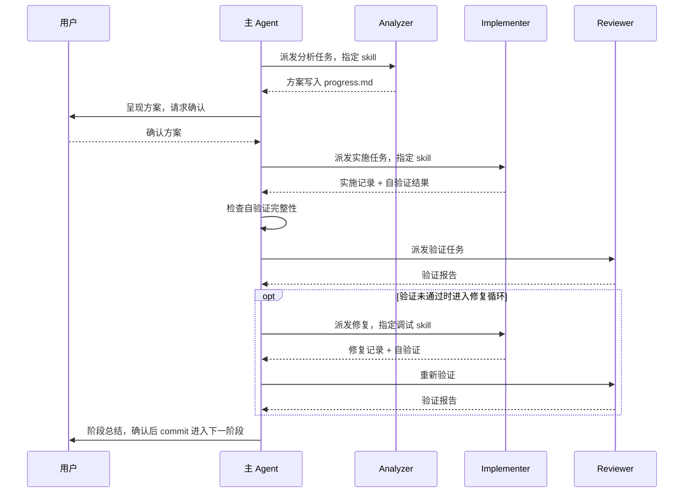

# NPU 模型优化 Agent Skills 设计文档

## 1. 项目概述

### 1.1 项目定位

本项目是 [cann-recipes-infer](https://gitcode.com/cann/cann-recipes-infer) 仓库的 Agent Skills 扩展，基于 CANN 平台能力和仓库已有模型的优化经验，将 NPU 推理优化中的路径知识、阶段依赖和验证流程模块化，支持 Agent 按流程完成端到端推理优化。

### 1.2 核心目标

- 将分散的 NPU 推理优化知识总结组织为可按需加载的 Skill
- 通过阶段化编排和验证驱动，降低优化路径走偏的风险
- 沉淀仓库模型的优化经验为可复用的参考链路
- 建立昇腾社区 NPU 推理优化的 Skill 能力
- 促进 Skill 的协同开发、共享和创新

### 1.3 目标用户

- 使用昇腾 NPU 进行模型推理优化的开发者
- 需要 Agent 辅助完成 NPU 推理适配的团队

## 2. 项目架构设计

### 2.1 整体结构

```
cann-recipes-infer/
├── docs/
│   └── agent/                  # Agent 相关文档
├── AGENTS.md                   # 全局配置（Skill 路由、行为约束）
└── .agent/
    ├── README.md               # 体系总览
    ├── agents/                 # SubAgent 角色定义
    │   ├── model-infer-analyzer.md
    │   ├── model-infer-implementer.md
    │   └── model-infer-reviewer.md
    ├── hooks/                  # Hook 脚本
    ├── settings.json           # Agent 配置
    └── skills/                 # Skills 目录
        ├── model-infer-optimize/
        ├── model-infer-migrator/
        ├── ...
```

### 2.2 Skill 调度架构

Skill 体系采用 **Agent Team** 模式——由一个编排 Agent 协调多个专业 Agent 协作完成复杂任务。每个 Agent 加载不同的 Skill，各自专注于特定阶段的优化工作，通过共享状态文件协同推进。具体实现为"主 Agent + SubAgent"的调度方式：

- **主 Agent**：加载总入口 Skill，负责全局编排、阶段推进和进度管理
- **SubAgent**：由主 Agent 按需启动，加载特定阶段的 Skill 执行具体任务，完成后将结果返回主 Agent

调度流程如下：

```
用户任务
  │
  ▼
主 Agent（加载 model-infer-optimize）
  │
  ├── 阶段 0：模型分析与基线建立
  │   ├── analyzer ──→ 架构分析、环境确认
  │   └── implementer ──→ model-infer-migrator（框架适配、基线采集）
  │
  ├── 阶段 1：并行化改造（多卡部署时）
  │   ├── analyzer ──→ model-infer-parallel-analysis（策略推荐）
  │   └── implementer ──→ model-infer-parallel-impl（代码改造）
  │   └── reviewer ──→ 验证并行正确性
  │
  ├── 阶段 2：KVCache + FA
  │   ├── analyzer ──→ model-infer-kvcache（方案分析）
  │   ├── implementer ──→ model-infer-kvcache（实施改造）
  │   └── reviewer ──→ 精度/性能验证
  │       └── FAIL → implementer ──→ model-infer-precision-debug（精度排查）
  │
  ├── 阶段 3：融合算子
  │   ├── analyzer ──→ model-infer-fusion（模式匹配）
  │   ├── implementer ──→ model-infer-fusion（算子替换）
  │   └── reviewer ──→ 精度/性能验证
  │
  ├── 阶段 4：图模式适配
  │   ├── analyzer ──→ model-infer-graph-mode（方案设计）
  │   ├── implementer ──→ model-infer-graph-mode（适配实施）
  │   └── reviewer ──→ 精度/性能验证
  │
  └── 阶段 5：优化总结 ──→ 输出优化报告
```

全流程中，model-infer-runtime-debug 可在任意阶段按需触发（aicore timeout、OOM、推理卡住等）。

设计考虑：

- **隔离上下文**：每个 SubAgent 只加载对应阶段的 Skill 和 references，避免上下文窗口被无关信息占满
- **阶段间状态传递**：通过 `progress.md` 共享文件传递阶段间的设计决策和验证结果，支持断点接力
- **验证卡点**：主 Agent 在每个阶段之间做验证判断，决定是否进入下一阶段

### 2.3 Skill 分类

| 类别 | Skill | 说明 |
|------|-------|------|
| 编排 | model-infer-optimize | 总入口，阶段 0-5 编排 |
| 主流程 | model-infer-migrator | 框架适配与基线建立 |
| 主流程 | model-infer-parallel-analysis | 并行策略分析 |
| 主流程 | model-infer-parallel-impl | 并行切分实施 |
| 主流程 | model-infer-kvcache | KVCache + FA 替换 |
| 主流程 | model-infer-fusion | 融合算子替换 |
| 主流程 | model-infer-graph-mode | 图模式适配 |
| 调试 | model-infer-precision-debug | 推理精度诊断（当前主要覆盖 KVCache/FA） |
| 调试 | model-infer-runtime-debug | NPU 运行时错误诊断 |
| 独立进阶优化 | model-infer-multi-stream | 多流并行 |
| 独立进阶优化 | model-infer-prefetch | 权重预取 |
| 独立进阶优化 | model-infer-superkernel | SuperKernel 适配 |

## 3. Agent 角色设计

### 3.1 角色分工

通过分析/实施/验证的职责隔离，降低单个 Agent 同时承担多角色导致的越界与漏检问题：

| 角色 | 职责 | 权限 | 挂载 Skills |
|------|------|------|-----------|
| 主 Agent | 阶段编排、用户确认、进度管理 | 不直接修改模型代码 | model-infer-optimize |
| analyzer | 架构分析、方案设计 | 只读代码，只写 progress.md | parallel-analysis、kvcache、fusion、graph-mode |
| implementer | 代码改造、调试修复 | 读写全部文件 | migrator、parallel-impl、kvcache、fusion、graph-mode、precision-debug、runtime-debug |
| reviewer | 精度验证、性能对比 | 禁止修改模型代码 | precision-debug、runtime-debug |

三个角色共享核心原则：禁止编造解释，遇到异常数据必须先用工具调查。

### 3.2 协作信息流



每阶段遵循统一流程：

1. 主 Agent 派发 analyzer 进行方案分析，结果写入 progress.md
2. 主 Agent 将方案呈现给用户确认
3. 确认后派发 implementer 实施改造，implementer 必须完成自验证
4. 主 Agent 检查自验证完整性，缺失则打回重派
5. 派发 reviewer 进行精度和性能验证
6. 验证未通过时，进入修复循环：派发 implementer 修复 → reviewer 重新验证
7. 全部通过后输出阶段总结，用户确认后进入下一阶段

### 3.3 派发规范

主 Agent 的 dispatch prompt 保持简洁：指定工作目录、任务、必须使用的 skill，不附加完整方案或实施步骤。SubAgent 通过读取 progress.md 获取上下文，由 skill 流程指导具体执行，避免 prompt 覆盖 skill 内的流程定义。

## 4. 状态管理设计

### 4.1 共享状态文件

SubAgent 之间通过 `progress.md` 共享阶段结论和任务状态，实现跨 Agent、跨阶段、跨会话的上下文接力：

```
{model_dir}/
├── progress.md              ← 活跃文件，所有 SubAgent 启动时读取
│   ├── 常驻区：阶段 0 模型分析结果，不清除
│   │   └── 进度概览表，主 Agent 每阶段更新一行
│   ├── 分隔标记
│   └── 工作区：当前阶段记录，阶段推进时归档清空
│
├── progress_history.md      ← 历史归档，按需索引
│
└── baseline/
    └── baseline_metadata.json ← 性能基线，reviewer 验证基准
```

### 4.2 读写规则

- **常驻区**由阶段 0 写入，后续只有主 Agent 更新概览表
- **工作区**由各 SubAgent 追加，写入前先读取现有内容
- **阶段推进**：主 Agent 更新概览表 → 调用归档脚本 → 清空工作区
- **历史归档**禁止全文读取，通过关键字索引查找

## 5. Skill 标准化设计

### 5.1 遵循标准

本项目遵循 [Agent Skills 规范](https://agentskills.io/home)，确保 Skill 可被支持该规范的工具（如 OpenCode 等）识别和加载。

### 5.2 Skill 目录结构

每个 Skill 采用自包含结构，所有相关资源集中在 Skill 文件夹内：

```
skill-name/
├── SKILL.md              # 技能定义文件（必需）
├── references/           # 参考文档（可选）
│   ├── domain-doc-1.md   #   领域知识、参考链路等
│   └── domain-doc-2.md
├── templates/            # 模板文件（可选）
│   └── report-template.md
└── scripts/              # 辅助脚本（可选）
    └── utils.py          #   调试工具、验证脚本等
```

| 目录/文件 | 必需 | 说明 |
|-----------|------|------|
| `SKILL.md` | 是 | 技能定义，包含 frontmatter 和工作流程 |
| `references/` | 否 | 领域知识文档，供 Agent 按需读取 |
| `templates/` | 否 | 报告模板、代码模板等 |
| `scripts/` | 否 | 辅助工具脚本（调试、验证等） |

### 5.3 SKILL.md 规范

frontmatter 必需字段：

```yaml
---
name: skill-name          # kebab-case，与文件夹名一致
description: 单行描述      # 触发场景关键词，< 1024 字符
user-invocable: true      # 是否可由用户直接调用
---
```

### 5.4 命名规范

- `SKILL.md` 文件名严格区分大小写
- Skill 文件夹使用 kebab-case（如 `model-infer-kvcache`）
- Skill 文件夹内不放 `README.md`，文档内容在 `SKILL.md` 或 `references/` 中

## 6. 知识组织设计

### 6.1 分层上下文

知识按渐进式披露分三层组织，Agent 用到哪层才加载哪层，避免一次性占满上下文窗口：

| 层级 | 内容 | 加载时机 | 体量控制 |
|------|------|---------|---------|
| AGENTS.md | 项目概述、Skill 路由、行为约束 | 每次对话自动加载 | ~100 行 |
| SKILL.md | 阶段流程、规则、完成标志 | 被匹配或指定时加载 | < 500 行 |
| references/ | 配置索引、代码示例、API 文档 | Skill 流程中指定读取时 | 不限 |

SKILL.md 控制流程，references 提供领域知识，在线文档提供接口细节。

### 6.2 在线文档引用

大型外部文档通过在线链接引用，不包含离线副本：

| 文档来源 | 在线地址 |
|---------|---------|
| torch_npu 算子 API | [op-plugin/docs/context/](https://gitcode.com/Ascend/op-plugin/tree/7.3.0/docs/context/) |
| TorchAir 图模式文档 | [torchair/docs/zh/](https://gitcode.com/Ascend/torchair/tree/master/docs/zh) |

### 6.3 references 设计说明

references 是对仓库内模型实现经验的结构化提炼，而非算子文档的离线副本。每个参考文档从仓库已有模型中提取标准链路和最佳实践，让 Agent 在分析新模型时能快速找到最接近的参考实现。

## 7. 验证设计

### 7.1 Skill 有效性验证

采用"有 Skill / 无 Skill"对比测试方法：

- 相同模型、相同基线、相同硬件、相同 Agent 能力
- 唯一变量：是否加载 Skill
- 对比维度：最终性能、中间阶段质量、优化路径完整性

### 7.2 每阶段验证机制

每个阶段完成后必须通过两项验证：

- **精度验证**：Prefill logits cosine similarity、Decode token match 等
- **性能验证**：Prefill/Decode 耗时、显存占用，与上一阶段对比

未通过精度验证时，触发精度调试 Skill 进行排查。

## 8. Harness 与约束机制

### 8.1 设计思路

Harness 的核心目标是通过约束限制 Agent 的错误行为空间，而非替代 Agent 完成任务。写在 Skill 和 Agent 定义中的规则是"软约束"，Agent 可能不遵守；Hook 脚本提供的是"硬约束"，在工具调用前后自动执行，不依赖 Agent 自觉。

### 8.2 约束分类

| 类型 | 机制 | 示例 |
|------|------|------|
| 角色权限 | Agent 定义中的 skills/tools 限制 | analyzer 禁止写代码、reviewer 禁止修改文件 |
| 流程规则 | Skill 中的阶段前置条件和验证门禁 | 每阶段必须精度验证通过后才能进入下一阶段 |
| Hook 约束 | 工具调用前后的脚本拦截 | 写文件前检查角色权限、commit 前检查是否已验证 |

### 8.3 Hook 机制

Hook 脚本位于 `.agent/hooks/`，在工具调用时自动触发：

- **pre_tool**：工具调用前执行，可拦截违规操作（如 analyzer 尝试写代码）
- **post_tool**：工具调用后执行（如记录操作日志）

当前 Hook：

| Hook | 触发时机 | 作用 |
|------|---------|------|
| 角色越界保护 | Edit/Write 前 | analyzer/reviewer 修改模型代码时阻断 |
| 改代码前必读 progress | Edit/Write 前 | 未读 progress.md 就改代码时阻断 |
| 自验证完整性检查 | implementer 结束时 | progress.md 缺少自验证项则打回 |
| 外循环重试上限 | implementer/reviewer 结束时 | 同一阶段超 5 轮循环则阻断 |
| 长时间任务提醒 | Edit/Write/Bash 前 | 超 60 分钟周期提醒，检查是否偏离 skill 流程 |

## 9. 演进规划

### 9.1 演进方向

- **流程完善与规模扩展**：多卡及更多模型的适配验证；多流、SuperKernel 等高阶特性加入主流程
- **性能分析能力集成**：接入自动 Profiling 分析能力，支持更精准的切分策略评估与性能瓶颈拆解
- **知识库自迭代**：建立反馈知识库，将执行断点及调测经验积累总结，Skill 自动迭代更新
- **新方案设计能力拓展**：新增融合算子设计与开发能力、量化方案及实现；软硬件协同优化迭代

### 9.2 演进原则

- 每个新 Skill 独立开发、独立验证，不影响已有 Skill
- 独立进阶优化 Skill 验证成熟后，纳入 model-infer-optimize 的编排流程
- 持续通过真实模型测试积累经验，迭代 Skill 编排与 references 中的参考链路

## 10. 协作与贡献

### 10.1 贡献流程

1. 在上游仓库提交 RFC（Issue）描述技能方案
2. Fork 仓库，创建特性分支
3. 按照 Skill 标准化规范开发
4. 提交 PR 并关联 RFC Issue
5. 代码审核与合并

### 10.2 审核标准

- SKILL.md frontmatter 格式正确
- 命名规范符合 kebab-case
- references 内容准确，在线链接有效
- 不包含离线副本文档和二进制文件
