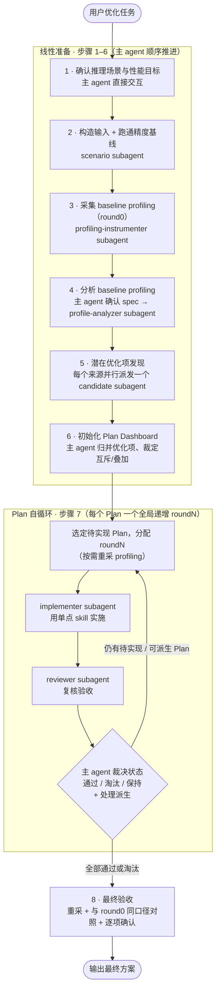
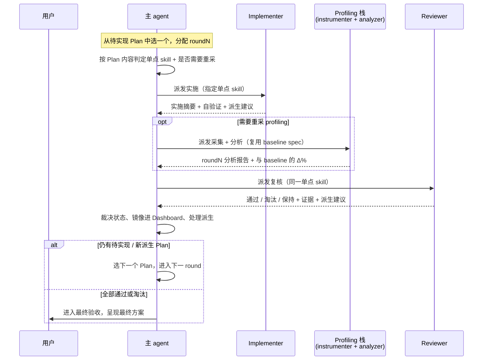

# 模型推理极致性能优化技能设计文档（model-infer-sota-approach）

本文档描述 `model-infer-sota-approach` 这一**模型推理极致性能优化技能**的设计。Skill 体系的通用约定（目录结构、SKILL.md 规范、命名规范、Hook 机制、贡献流程等）见 [skill-design.md](skill-design.md)，本文档不重复，只聚焦本技能独有的编排架构、潜在优化项发现、Plan 自循环、分层状态管理与证据口径设计。

## 1. 概述与定位

### 1.1 技能定位

`model-infer-sota-approach` 在一个**已经可运行的 baseline** 之上，由 profiling 数据驱动，在多个尚不确定的优化方向上并行发现潜在优化项，再用 Plan 自循环（实施 → 复核 → 派生 → 淘汰）逐步逼近最优方案。

它只负责**整条编排**——从推理场景建立、精度基线、profiling 采集与分析，到潜在优化项发现、Plan 实施、review、派生和最终验收；具体的代码改造由各单点技术 skill 负责，本技能不介入。其核心特征是**不预设固定阶段**：优化方向并非预先排定的流水线，而是由 profiling 分析识别得出，再用统一的 Plan 状态机逐个验证、收敛。这使它适合在 baseline 之上进一步挖掘性能空间，以及探索标准路径之外的非标准组合优化。

### 1.2 适用场景

- 已有可运行 baseline，需在其上继续进行 profiling 驱动的深度优化；
- 优化方向不止一个、且彼此可能互斥或叠加，需要统一编排、并行试验、逐个验收；
- 涉及融合算子、prefetch、图模式、多流、KVCache、量化、并行等多种优化项的统一调测编排。

### 1.3 前置条件

模型必须**已完成框架适配，并已有一个可运行、可复现精度的 baseline**。如果模型尚未适配进框架、或尚无 baseline，应先完成框架适配与基线建立，再进入本技能。本技能不承担"从零适配"的工作，其起点假定为一条语义正确、精度可复现的推理路径。

### 1.4 设计目标

- **多方向并行发现**：在不确定的多个优化方向上并行发现潜在优化项，降低遗漏优化点的风险；
- **探索可收敛**：用 Plan 自循环将"试验一个方向 → 验证 → 保留或淘汰 → 派生新方向"结构化，使探索式优化可收敛、可追溯；
- **证据驱动裁决**：一切性能判断以 profiling 分析报告为准，不以裸计时直接得出结论；
- **状态可接力**：通过分层状态文件支持跨 agent、跨 round、跨上下文压缩的状态接力。

### 1.5 职责边界

| 边界 | 说明 |
|------|------|
| 只编排不替工 | 主 agent 负责阶段推进、全部用户交互、prompt 组装、Dashboard 维护、最终验收，不直接执行采集 / 分析 / 实施 |
| 不嵌套编排 | 编排职责由本技能独占，**不调用其他编排流程**；具体优化交给它调用的单点技术 skill |
| 实施 skill 按 Plan 内容定 | 用哪个单点 skill（多流 / prefetch / 融合 / 图模式 / 量化 / 并行等）由主 agent 在 Plan 实施阶段按 Plan 内容判定，作为 implementer 的领域 skill 传下去 |

设计考虑：将"编排"与"实施"彻底分离，是为了让本技能能复用所有现有及未来的单点优化 skill，而无需关心其内部实现；同时禁止编排流程互相嵌套，避免上下文与职责的混乱叠加。

## 2. 整体编排架构

### 2.1 编排流程总览

主 agent 按 8 个步骤推进：前 6 步是线性准备，第 7 步是 Plan 自循环，第 8 步是最终验收。



### 2.2 探索式编排：为何不预设固定阶段

设计考虑：基础适配阶段的优化路径是确定的，可按固定阶段顺序执行完毕；但 baseline 之上的深度优化，**某个方向是否有收益、收益多大、方向之间是否冲突，均需依赖 profiling 才能判定**。预设的阶段流水线在此反而会限制探索——它预先假定了方向与顺序，而真实瓶颈往往落在标准路径之外。

因此本技能以「profiling 分析 → 多方向潜在优化项发现 → Plan 自循环」取代固定阶段：优化方向由 profiling 数据识别得出（第 4–5 步），再用统一的 Plan 状态机逐个验证、收敛（第 7 步）。固定的是编排骨架，可变的是具体执行哪些 Plan、迭代多少轮，由证据决定。

### 2.3 主 agent 独占编排 + subagent 执行

主 agent 是唯一的编排者与交互方；所有具体执行——采集、分析、潜在优化项发现、实施、复核——均派给 subagent。这样做有两个目的：

- **隔离上下文**：采集与分析的输出冗长，实施与复核涉及大量代码细节，将它们留在各自 subagent 的上下文中，主 agent 只接收结论摘要与产物路径，避免主上下文被无关信息占满；
- **角色隔离**：分析、实施、复核分属不同 subagent，职责边界清晰（如 reviewer 禁止改代码），降低单个 agent 同时承担多角色导致的越界与漏检。

主 agent 不直接执行采集 / 分析 / 实施；凡 subagent 因无法与用户对话而缺失的交互，由主 agent 在派发前先行确认、将结果作为 spec 下传（详见 §3.2）。

### 2.4 性能分析栈边界

profiling 的采集与分析交给两个独立 skill，本流程只调用、不重复它们的内部契约：

| skill | 职责 | 在本流程中的角色 |
|-------|------|-----------------|
| `model-infer-profiling` | 采集 profiling 数据（`kernel_details.csv` 等） | 由 profiling-instrumenter subagent 调用 |
| `model-infer-perf-breakdown` | 分析 profiling，一份报告同时给出「时间分布」和「逐算子实测/理论 gap」两类证据 | 本流程**唯一**性能分析入口，由 profile-analyzer subagent 调用 |

采集方式、拆解粒度、理论值计算等均属各 skill 的内部实现，本流程不予感知。本技能只规定一条对外契约：所有性能收益判断均以 `model-infer-perf-breakdown` 产出的分析报告为准（详见 §7）。

## 3. Subagent 角色设计

### 3.1 角色清单与职责

本技能编排六类 subagent，全部由主 agent 派发：

| subagent | 职责 | 主要产物 | 写权限 |
|----------|------|---------|--------|
| `scenario` | 构造可复现推理输入、跑通精度基线、定判定口径 | `scenario.md`、输入样本 / 构造脚本 | progress.md 工作区 |
| `profiling-instrumenter` | 为已跑通场景插入 / 启用 profiling 采集（可重复、可关闭、可回退） | 采集命令、profiling 产物目录 | progress.md 工作区 |
| `profile-analyzer` | 用 perf-breakdown 分析本轮 profiling，产出「时间分布」+「实测/理论 gap」两类证据 | 性能分析报告 | progress.md 工作区 |
| `candidate` | 从某一个来源（§5 表一行）发现潜在优化项，产出 Plan 草案 | `analysis/<source>.md` | progress.md 工作区 |
| `implementer` | 用 Plan 指定的单点 skill 实施单个 Plan | 代码改动、`plan-<id>.md` 实施记录 | 代码 + progress.md + plan 文件 |
| `reviewer` | 复核验收 implementer 的工作，判通过 / 淘汰 / 保持 | `plan-<id>.md` Review 记录 | progress.md + plan 文件（**禁改代码**） |

所有 subagent 均为**非交互**：它们不与用户对话，所需的交互信息由主 agent 在派发前确认、随 prompt 传入。每次派发前，主 agent 从 [`references/subagent-prompt-templates.md`](../../.agents/skills/model-infer-sota-approach/references/subagent-prompt-templates.md) 取对应模板、替换占位符。

### 3.2 主 agent 作为唯一交互方

设计考虑：subagent 无法与用户对话，而某些步骤又必须由用户确认（如优化场景的锁定、perf-breakdown 的拆解口径）。本技能的处理方式是**交互前置**——将全部用户交互收敛到主 agent，在派发 subagent 之前先行确认，再将结果作为 spec 随 prompt 下传：

- **场景确认**：第 1 步由主 agent 直接完成，先从仓库勘察备选场景、检查前置条件，再带着备选项以结构化提问与用户确认；
- **perf-breakdown 拆解 spec**：第 4 步由主 agent 先读 `model-infer-perf-breakdown`，了解其所需字段（拆解模块偏好、structure / cluster spec 等），与用户确认后作为分析 spec 传给 profile-analyzer，subagent 据此**非交互**地执行分析——包括第一次 baseline。baseline 确认的 spec 在后续重采轮复用，无需再次确认。

如此既保证 subagent 全程非交互、输出可控，又不遗漏必要的用户决策。

### 3.3 派发规范

主 agent 的 dispatch prompt 遵循以下规范（对所有 subagent 一致生效）：

- **配置继承主 agent**：每个 subagent 的 model、thinking、上下文强度均与主 agent 一致，不降级、不缩短推理、不更换配置；
- **只回摘要与路径**：subagent 将详细产物落盘，回传给主 agent 的仅有结论摘要、证据文件路径与需主 agent 决策的问题，不将长日志 / 完整 profile / 原始表回传至主上下文；
- **dispatch 不转述上下文**：dispatch 仅给出模板字段与路径，subagent 进场先读主 agent 传入的 `progress.md` 获取共享上下文（场景 / 精度口径 / baseline 瓶颈 / 已通过 Plan / 当前 round 目标），主 agent 不在 prompt 中复述这些；
- **Dashboard 只读**：Plan Dashboard 由主 agent 独占维护，subagent 可读取以了解全局，但不直接写入，自身产出通过回传摘要交主 agent 落库；
- **性能口径统一**：凡涉及性能收益的结论，一律以 profile-analyzer 报告为准，不以裸 wall-clock 数字作为判定依据。

设计考虑：dispatch 不转述上下文、subagent 统一从 `progress.md` 获取上下文，是为了让 prompt 保持简洁、避免 prompt 覆盖 skill 内的流程定义，同时使共享上下文具有单一来源（progress.md），不在 prompt 与文件之间产生分叉。

### 3.4 协作信息流

以第 7 步 Plan 循环的一个 round 为例，主 agent 与各 subagent 的协作时序如下：



准备阶段（第 1–6 步）的信息流与此类似：主 agent 顺序派发 scenario → profiling-instrumenter → profile-analyzer，再为 §5 表每个来源**并行**派发 candidate，最后由主 agent 归并并初始化 Dashboard。

## 4. 潜在优化项发现机制

### 4.1 多来源并行发现

潜在优化项发现是本技能探索的入口。主 agent 不预设优化方向，而是为每个来源并行派发一个 candidate subagent，让不同来源从各自角度发现潜在优化项，再统一归并。每个 candidate 只负责一个来源、只写入自身的产物文件、互不干扰，因此可并行执行。

### 4.2 来源注册表与可扩展性

潜在优化项的来源在 SKILL.md §5 的来源表注册，当前注册三个来源：

| 来源（source） | 方法 | 产物文件 |
|--------------------|------|---------|
| `multi-stream` | 用 `model-infer-multi-stream` 做整网 / 模块 / 算子 DAG 拆解、判定并行性，每个并行点给出 ≥2 种多流编排方案 | `analysis/multi-stream.md` |
| `wiki` | 查 CANN-Infer-Wiki，检索该模型 / 场景适用的优化手段（不限多流） | `analysis/wiki.md` |
| `perf-insight` | 读 baseline perf-breakdown 的 insight 产物整理优化项（连续 vector 区间 → 融合、冗余搬运 → prefetch、理论偏离 Top → 重点算子） | `analysis/perf-insight.md` |

设计考虑：来源采用注册式、可扩展的设计——新增一个来源即在 §5 表增加一行，candidate 的 prompt 模板保持不变。若某个来源当前未挂载关联的工具 / skill（如 wiki 的 MCP 未挂载），主 agent 跳过该行。这使潜在优化项发现的覆盖宽度可随能力增长而扩展，无需改动编排骨架。

### 4.3 来源内判互斥、跨来源归并

每个 candidate 只负责一个方向，因此：

- **来源内**的互斥 / 叠加关系，由该 candidate 自行判定并写入产物文件；
- **跨来源**的互斥 / 叠加关系，单个 candidate 无法看到全貌（例如"融合算子改写 attention"与"多流切分 attention"分属两个来源，却作用于同一段计算），**必须由主 agent 在初始化 Dashboard 时统一归并、裁定**。

主 agent 在第 6 步归并时还会合并重复或等价的优化项（例如多个来源均指向 MoE 多流 overlap，归并为同一个 Plan，编排变体作为该 Plan 的内部强度阶梯）。

### 4.4 先发现、后初始化 Dashboard

设计考虑：若在潜在优化项缺乏证据支撑时即初始化 Dashboard，后续裁决将无从依据。因此本技能强制**先完成潜在优化项发现、再初始化 Dashboard**——下列信息齐备后方可初始化：

- 推理场景及精度 / 功能口径已记录在案；
- 场景已跑通（即便被阻塞，也已查清原因，且用户仍要求继续）；
- baseline 的 profiling 采集方式已建立，或已有可直接复用的数据；
- baseline profiling 已分析完毕，产出了可回查的报告；
- 至少有一个 candidate 返回了潜在优化项，或所有来源均已明确判定无优化项。

用户若直接提供一份优化列表，仅作为种子分配给对应来源的 candidate，仍须经规范化后再进入 Dashboard，增删合并须说明原因。

## 5. Plan 自循环机制

Plan 自循环是本技能的核心：潜在优化项发现给出一批待验证的优化方向，Plan 循环负责将它们逐个实施、验证、保留或淘汰，并在过程中派生新方向，直至收敛。

### 5.1 Plan 状态机

全程只允许三种状态：

| 状态 | 含义 |
|------|------|
| `待实现` | 尚未实施，或证据不足但仍有继续实施、调测的价值 |
| `通过` | 有明确收益或必要价值，且功能、精度、回退路径和副作用都已检查通过 |
| `淘汰` | 无收益、风险过高、实现失败、破坏功能或精度，或被同一互斥组里更优的 Plan 替代 |

设计考虑：状态刻意只设三种，避免"部分完成""疑似有效"之类的模糊中间态——任一 Plan 在任意时刻都明确处于"待办 / 保留 / 丢弃"之一，使 Dashboard 成为可快速通览全局的状态真相源。证据不足但仍有价值的情形归入 `待实现`（可继续调测），而非新增状态。

### 5.2 全局递增 round

每一个 Plan、每一档强度、每一次尝试都用独立的**全局递增 `roundN`** 记录；派生出的 Plan 也分配新的 `roundN`，既不复用旧编号、也不与旧 round 合并。

设计考虑：round 是全局单调递增的时间轴，而非每个 Plan 各自的局部计数。这样任意一次尝试（包括同一 Plan 的不同强度、不同锚点）都有唯一编号，profiling 产物、Dashboard 裁决、plan 文件记录可借 roundN 一一对应，避免编号复用导致的证据错配。

### 5.3 实施 → review → 派生循环

从 `待实现` Plan 中选一个，分配 `roundN`，进入循环：

```text
选定 Plan / 分配 roundN
  → 主 agent 按 Plan 内容判断实施用哪个单点 skill
  → 主 agent 判断本轮是否需要重采 profiling（见 §7.2）
  → implementer subagent 用选定的 skill 实施当前 Plan
  →（需要时）派发 profiling-instrumenter + profile-analyzer 产出 round{N} profile
  → reviewer subagent 复核并验收 implementer 的工作
  → 主 agent 按 decision-rules 更新状态、处理派生建议
  → 仍有待实现或新派生的 Plan，则继续下一 round
```

- **实施 skill 由主 agent 按 Plan 内容定**，作为 implementer 的领域 skill 传下去；reviewer 用同一个 skill 复核。
- implementer **只实施当前一个 Plan**，不一并修改其他 Plan；发现更合理方案时可**建议**派生，但不得覆盖当前 Plan。
- reviewer 负责复核验收，可以建议派生，但**不改代码、不自行修复、不回退代码**。

### 5.4 派生机制

设计考虑：探索过程中常出现这样的情形——当前 Plan 并不完全成立，却指向了一条更优的实现路径。派生机制将这种发现结构化为**追加而非改写**——旧 Plan 原样保留（连同其证据与裁决），新 Plan 另起 `plan_id` 与 `roundN`、初始状态 `待实现`。如此优化路径的演化全程可追溯，不会因迭代出新版本而覆盖上一版的证据。

implementer、reviewer 和主 agent 都可以提议派生，最终由主 agent 写入 Dashboard。常见触发：当前 Plan 核心假设被推翻但证据指向另一条可行路径、同一优化点还有未试过的编排 / 算子 / 参数变体、原方案落地成本过高但存在更小切口、reviewer 确认有收益但还有更优变体、Plan 被淘汰的原因是"这条实现路径不合适"而非"优化点无价值"、多个已通过 Plan 组合后退化需专门治理组合。派生记录要写清：派生自哪个 Plan / round、来源是 implementer / reviewer 还是 main、触发现象、新旧 Plan 的差异。

### 5.5 互斥与叠加裁定

潜在优化项来自不同来源，机制上可能互斥、也可能正交可叠加，必须由主 agent 统一裁定：

- **互斥组**：同一互斥组最终只保留一个、或一组明确兼容的 `通过` Plan；新 Plan 替代旧 Plan 时，把旧 Plan 改为 `淘汰`，原因写明"被 Plan-X 替代"；
- **可叠加**：可叠加的 Plan 可以同时通过，但**不得默认收益可线性叠加**——必须在最终验收中实测叠加后的代码路径与指标；两个单独通过的 Plan 组合后若退化，追加一个组合验证 round，必要时淘汰组合收益更差的一方。

跨方向的冲突要在初始化 Dashboard 时就识别（§4.3），单个 candidate 无法看到全貌。

### 5.6 状态裁决规则

每轮 implementer / reviewer 返回后，主 agent 按以下规则裁决（完整判据见 [`references/decision-rules.md`](../../.agents/skills/model-infer-sota-approach/references/decision-rules.md)）：

- **判 `通过`**：reviewer 建议通过或主 agent 掌握更强证据；该 Plan 代码路径在确认场景里真正执行到；功能精度满足口径；目标指标达到保留标准（性能目标可选时也要说清保留价值）；enable 开关 / 回退路径清楚可用；不破坏已通过 Plan；互斥组内当前没有更优的已通过 Plan。
- **判 `淘汰`**：reviewer 明确判失败（非"缺一次可补的验证"）；功能 / 精度 / 稳定性 / 编译出问题；无收益或收益低于噪声且无继续空间；引入明显副作用（拖累其他模块、内存暴涨、多出 shape/layout 转换、图模式退化）；与已通过 Plan 冲突且本身更弱；互斥组内已有更优 Plan。淘汰后必须记录三件事：淘汰证据、代码是否已回退或 enable 是否已关闭、是否由此派生新 Plan。
- **保持 `待实现` 或追加 round**：实现未完成但卡点可修复；reviewer 只指出证据不足需补验证；方向成立只是强度 / 参数 / 局部实现还要调；本轮暴露新问题但不足以证明 Plan 无效。

## 6. 分层状态管理设计

本技能横跨多个 subagent、多个 round，并可能跨多次上下文压缩，状态管理必须明确回答三个问题：谁读、谁写、何种信息存于何处。为此将状态分为三类文件，各司其职、互不复制。

### 6.1 三类文件分工

| 文件 | 管什么 | 写者 | 读者 |
|------|--------|------|------|
| `plan-dashboard.md`（Dashboard 总览） | **状态指示**：Plan 状态机、当前采纳实现、round 裁决——Plan 状态的**单一真相源** | **只有主 agent** | 主 agent 裁决；subagent 只读了解全局 |
| `progress.md`（共享状态文件） | **跨 agent 共享上下文 + subagent 实施 / 踩坑 / 验证过程** | 各 subagent 追加工作区；主 agent 维护常驻区 | 所有 subagent 进场先读 |
| `plans/plan-<id>.md`（Plan 明细） | 单个 Plan 的**方案 spec + round 级结论摘要** | 该 Plan 的 candidate / implementer / reviewer | 主 agent 读它做裁决 |

三者互不复制：**看状态查 Dashboard，看过程与共享上下文查 progress.md，看单个 Plan 的方案查对应的 plan 文件**。

设计考虑：将"状态""过程""方案"分到三类文件，是为了让每类信息有唯一归属，避免同一信息在多处副本之间产生分叉。Dashboard 只存放高频读写的状态与裁决，保持精简、便于快速通览；冗长的过程记录归入 progress.md；每个 Plan 的领域细节保存在各自的 plan 文件中，主 agent 不解析其内部结构。

### 6.2 落盘布局

一次优化的所有产物固定落到约定路径 `optimization-analysis/<case>/`：

```text
optimization-analysis/<case>/
├── plan-dashboard.md       编排总览（脊柱）：只放关键信息 + 状态 + 裁决；主 agent 唯一写
├── scenario.md             场景记录（scenario subagent 产出）
├── analysis/               各来源的分析产物（一来源一文件，文件名取 §5 表来源名）
│   ├── <source>.md
│   └── …
├── plans/                  每个 Plan 一份完整记录（方案描述 / 细节 / 实施 / review / 派生）
│   ├── plan-A.md
│   └── …
└── perf/                   perf-breakdown 工作目录（采集 + 分析的 profile 与报告；内部结构归
                            model-infer-perf-breakdown，本流程不感知）
```

`progress.md`（共享状态文件）**不在本 case 树内**——其位置由主 agent 解析，不存在时则创建，沿用 `model-infer-optimize` 的常驻区 / 工作区 / 归档（`progress_history.md`）约定。它是项目级的跨 agent 共享上下文与过程日志，编排器读取它获取上下文、向工作区写入过程。

引用关系（一份分析派生多个 Plan，不重复）：

```text
baseline 性能报告 ──证据──► analysis/<source>.md ──派生──► plans/plan-A.md / plan-B.md / …
（时间分布 + 理论 gap）        （一份分析，多 Plan 共享）       每 Plan 一份完整记录
```

### 6.3 写者规则与单一真相源

- **Dashboard（§1–§7）只有主 agent 写**：subagent 不写 Dashboard，自己的产出通过回传摘要交主 agent 镜像进表；
- **`plans/plan-<id>.md` 由该 Plan 的 candidate / implementer / reviewer 产出与追加**：candidate 落初稿（方案描述 + 方案细节），implementer / reviewer 在循环里追加 round 级结论摘要；主 agent 读它做裁决、把关键信息 + 状态镜像进 Dashboard 表，但**不改 plan 文件的内层结构**；
- **`progress.md` 的常驻区由主 agent 维护、工作区由各 subagent 追加**：写入前先读现有内容。

设计考虑：让 Dashboard 成为 Plan 状态的**单一真相源**，且只有一个写者（主 agent），是为了杜绝多 agent 并发写同一状态文件造成的覆盖与不一致。subagent 的产出一律先写入各自的文件，再由主 agent 单点镜像进 Dashboard，使状态流向收敛。

### 6.4 总览 + 明细分离

Dashboard 分**总览**与**明细**两层：

- **总览（Dashboard）**：场景与基线、Baseline Profiling、潜在优化项发现记录、Plan Dashboard 表（每 Plan 一行：plan_id / 来源 / 优化类型 / 单点 skill / 互斥组 / 可叠加 / 状态 / round / 证据摘要 / 淘汰·保留原因 / plan 文件链接）、当前采纳的实现、Round 记录、最终验收。结构固定、与优化方向无关。
- **明细（每个 Plan 一份 `plan-<id>.md`）**：方案描述、方案细节（领域自由块，结构由对应单点 skill 定义）、实施记录、Review 记录、派生记录，**不内联到 Dashboard**。

**边界契约**：plan 文件的详尽程度由领域 skill 自行决定；但每个 Plan 必须将编排裁决所需的少数信息**上浮到 Dashboard 表**——是否真实生效、收益（性能以分析报告为准）、精度、enable / 回退、副作用，汇成「证据摘要」+ 状态。Dashboard 的 Round 记录只做索引（每轮选了哪个 Plan、是否重采、裁决结论），本轮明细写在对应 plan 文件里。

### 6.5 跨上下文压缩的状态重建

设计考虑：编排过程可能很长，主 agent 的上下文会被压缩。这套分层文件同时是主 agent **跨上下文压缩重建状态的依据**——Dashboard 给出全局状态、progress.md 给出共享上下文、plan 文件给出单 Plan 细节。因此要求关键节点**即时回写、不延后至收尾阶段**：每轮裁决、每次派生、每次状态变更都立即落盘，使任意时刻均可从文件重建出完整的编排状态，而不依赖主 agent 的上下文记忆。

## 7. profiling 驱动与证据口径

### 7.1 唯一性能真相源

一切性能收益判断均以 `profile-analyzer` 产出的分析报告为准——以报告给出的时间分布、与 baseline 的 Δ%、以及逐算子实测 / 理论 gap 变化为依据，**不以裸 wall-clock 数字**（infer 脚本打印、`time.perf_counter` 计时等）直接得出结论。

设计考虑：裸 wall-clock 易因采样噪声、口径不对等而产生误导。尤其在多流等场景，"主流-only busy"与"单流 full-work"属于不对等口径，直接相减会得到失真的收益数字。统一以分析报告为真相源，并要求重采轮与 baseline 做**同口径**对照，方能区分真实收益与口径偏差。需要注意的是，perf-breakdown 分析的是 in-graph kernel，若瓶颈落在图外的 host-dispatch 开销上（分析报告无法捕捉），需采用对应的 clean full-wall 口径补充测量——但仍须在固定、可复现的口径下进行，而非临时裸计时。

### 7.2 round 之间是否重采的判据

是否重采 profiling 由主 agent 判断，**不强制每轮都重采**。判断只围绕一个问题：现有 profiling 数据能否支撑后续的收益判断。

**需要重采**（用 profiling-instrumenter + profile-analyzer，复用 baseline 分析配置）：

- 上一轮改动改变了**算子下发时序、计算图结构、dtype 或 layout**——多流、融合算子、图模式、量化等改造大多属于此类；
- reviewer 反映现有 profile 已与当前代码不符，不足以判断收益；
- 切换到新的优化方向，或下钻到此前未采集过的热点模块；
- 准备给某个方案下「通过 / 淘汰」终裁，需要一份与当前代码严格对应的最新 profile；
- **进入最终验收前，对最终代码路径至少重采一次**，用来与 baseline 做同口径对照。

**可以不重采、沿用现有数据**：

- 本轮仅改动开关或参数，未改变算子下发与计算结构，且仍以同一份数据做对照；
- 改动与性能结构无关（纯精度修复、注释或日志调整）。

### 7.3 同口径对照与 baseline 基准

第 3 步采集得到的即为 **baseline（round0）profile**，是后续所有 round 做同口径对照的基准。baseline 在第 4 步确认的分析 spec 会被后续每个重采 round **复用、无需再次向用户确认**；重采轮与 baseline 做同口径对照得出 Δ%。最终验收时，以与 baseline 相同的场景、相同的指标口径做对照，并以 profile-analyzer 报告为准。

设计考虑：固定一个 baseline 基准 + 固定一套分析 spec，是所有轮次收益可比的前提。若每轮各自变更口径，Δ% 将失去意义；因此 spec 一次确认、全程复用，baseline 一次采定、反复对照。

## 8. TaskList 编排与验收

### 8.1 任务骨架

进入 skill 后先建准备阶段任务（到潜在优化项与 Dashboard 为止）：

```text
T1. 确认推理场景与可选性能目标
T2. 派发 scenario subagent 构造推理输入并跑通精度基线
T3. 派发 profiling-instrumenter subagent 采集 baseline (round0) profiling（非交互）
T4. 主 agent 确认 perf-breakdown 拆解 spec，再派发 profile-analyzer 执行 baseline 分析
T5. 为 §5 表每个来源并行派发 candidate subagent 发现潜在优化项
T6. 初始化 Plan Dashboard，归并优化项并裁定跨方向互斥 / 叠加
```

T6 之后进入 Plan 循环，**每选定一个 Plan 就新建一组 TR{N} 任务**（N 为全局递增 round 编号），本轮做完即逐项关闭，再为下一个 Plan 或派生 Plan 建下一组：

```text
TR{N}.1  选定当前 Plan，分配 roundN，准备上下文；判断本轮是否需要重采 profiling
TR{N}.2  主 agent 按 Plan 内容确定单点 skill，派发 implementer subagent 实施
TR{N}.3 （按需）重采并分析 round{N} profiling
TR{N}.4  派发 reviewer subagent 复核并验收 implementer 的工作
TR{N}.5  主 agent 更新 Plan 状态、记录证据、处理派生建议，决定下一步
```

无待实现 Plan 后，建最终验收任务（TF1–TF5，见 §8.3）。

### 8.2 不用长驻任务覆盖循环

设计考虑：**不要建"进入 Plan 循环"这种一个任务覆盖整个循环的长驻任务**——它会一直停在 `in_progress`、不反映真实进度。Plan 循环的轮数事先未知（取决于派生多少 Plan），用"每轮一组 TR{N} 任务"来表达循环：每轮的任务组在本轮内闭合，下一轮再开新组。这样 TaskList 的粒度始终对应当前正在推进的 Plan/round，进度可见、可断点接力。

### 8.3 不轻易收尾与最终验收

本技能强调**不轻易收尾**：必须所有 Plan 都转为 `通过` 或 `淘汰`，且确认再无可派生的、仍有潜在收益的新 Plan，才进入最终验收。

最终验收前先**重采一次** profiling，与 round0（baseline）做同场景、同口径对照，然后逐项确认：

```text
TF1. 确认所有 Plan 均为通过或淘汰（无待实现 Plan）
TF2. 确认再无可派生的、仍有潜在收益的新 Plan
TF3. 确认所有通过 Plan 已应用，且可叠加 Plan 的组合效果已实测验收
TF4. 确认所有淘汰 Plan 已回退或被开关关闭，不影响最终 profile
TF5. 汇总最终方案、淘汰原因与剩余风险
```

补充确认项：同一互斥组内状态自洽（最终只保留一个或一组明确兼容的 `通过` Plan）；最终精度 / 功能仍满足第 1 步约定的场景口径；最终性能用与 baseline 同一场景、同一指标口径，以 profile-analyzer 报告为准。

设计考虑：探索式优化容易在收益趋缓时过早停止，而"不轻易收尾"+ 逐项验收清单将收尾确立为一个具有明确门禁的状态——只有当 Plan 空间穷尽（无待实现、无可派生），且最终态经同口径实测确认后，才视为完成。

## 参考索引

- **本技能定义**：[`.agents/skills/model-infer-sota-approach/SKILL.md`](../../.agents/skills/model-infer-sota-approach/SKILL.md)
- **状态裁决与 round 推进规则**：[`references/decision-rules.md`](../../.agents/skills/model-infer-sota-approach/references/decision-rules.md)
- **Subagent prompt 模板**：[`references/subagent-prompt-templates.md`](../../.agents/skills/model-infer-sota-approach/references/subagent-prompt-templates.md)
- **场景确认操作细则**：[`references/scenario-confirm.md`](../../.agents/skills/model-infer-sota-approach/references/scenario-confirm.md)
- **scenario 操作细则**：[`references/scenario-setup.md`](../../.agents/skills/model-infer-sota-approach/references/scenario-setup.md)
- **Plan Dashboard 模板**：[`references/plan-dashboard-template.md`](../../.agents/skills/model-infer-sota-approach/references/plan-dashboard-template.md)
- **Plan 文件模板**：[`references/plan-file-template.md`](../../.agents/skills/model-infer-sota-approach/references/plan-file-template.md)
- **Skill 体系通用设计（目录结构 / 命名 / Hook / 贡献等）**：[skill-design.md](skill-design.md)
