# NPU Multi-Stream Principles

This document explains the hardware foundation of multi-stream parallelism on Ascend NPUs, the semantics of the multi-stream APIs under different execution paths, the conditions that must hold for parallelism to be valid, and representative case studies of multi-stream optimization in full networks.

## 1. Background

On the critical path of model execution, hardware resources are frequently underutilized: an imbalance between Cube and Vector utilization leaves one class of unit idle; operators that are too small cannot make efficient use of all AI Cores; and HCCL collective communication runs serially with local computation, so compute resources spin idle while communication is in flight. Multi-stream optimization distributes operators sensibly across multiple Streams so that they can compute in parallel on different Streams, thereby improving hardware utilization and shortening the critical path without adding any compute capacity.

To enable multi-Stream parallelism, the model's computation graph must contain a structure that satisfies the parallelism conditions: when several operators all take their input from the output of the same predecessor operator and have no data dependency on one another, they can be executed concurrently by topology. As shown in the graph below, the output of the upstream operator A is consumed simultaneously by two branches, B and C; since B and C have no data dependency between them, they can be carried on two separate Streams and executed in parallel, finally merging at the join operator D.

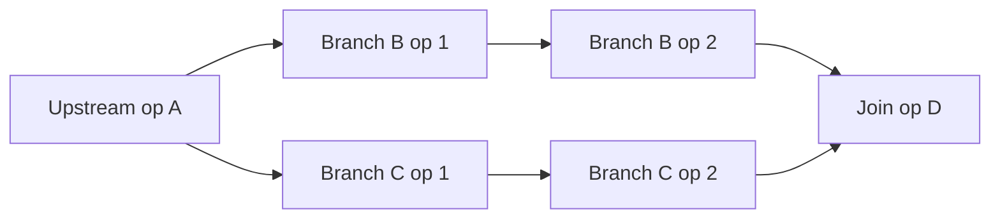

<div align="center">Figure 1. Two data-independent branches that can be carried on separate Streams.</div>

Besides the multi-stream parallelism supported by structures that are native to the model, the model's computation process can also be adjusted so that it satisfies these multi-stream parallelism requirements — for example, splitting the input data into two batches so that two additional parallel compute branches become available (Dual Batch Overlap).

This document describes how to fully utilize hardware resources for concurrent execution at the operator granularity. This concurrency is realized at the framework-runtime level through multi-Stream orchestration, and is referred to as multi-stream optimization. The sections below start from the underlying principles of the NPU hardware and the Stream mechanism, then explain how to implement multi-stream parallelism at the model-code level, and finally present multi-stream optimization case studies that have already been put into practice.

## 2. Principles

### 2.1 Hardware and Software Conditions

On the NPU, the Device side has several classes of physical execution resources that can be scheduled independently, while multi-Stream / Event provides the asynchronous mechanism — the software condition that lets these hardware units be scheduled for concurrent computation.

#### 2.1.1 Physical Resource Units

| Unit | Primary responsibility | Cross-Stream behavior |
| --- | --- | --- |
| Cube | Large matrix-multiply-class computation | Multiple Streams contend; core-splitting parallelism is possible, with each Stream able to obtain a portion of the cores (described below) |
| Vector | Vector, activation, and reduction-class computation | Same as above |
| HCCL | Collective communication | A resource independent of compute; some optimization scenarios require it to use some Vector |

* The compute units on Ascend are primarily Cube and Vector; for the related hardware concepts, refer to the [Basic Architecture documentation](https://www.hiascend.com/document/detail/en/CANNCommunityEdition/900/programug/Ascendcopdevg/atlas_ascendc_10_0008.html). In general, an operator cannot saturate all of the compute capacity, which is precisely what leaves room for multi-stream parallel acceleration. By their use of compute capacity, operators fall into three categories:

1. Pure Cube operators (e.g., non-quantized Matmul);
2. Pure Vector operators (e.g., the RMSNorm operator);
3. Mixed operators (which need both Cube and Vector, e.g., the quantized Matmul operator and the flash attention family of operators);


* Collective communication operators are generally independent of the compute units and can run in parallel with them, but in some scenarios a communication operator needs to occupy part of the compute resources for optimization:

1. Setting [HCCL_OP_EXPANSION_MODE](https://www.hiascend.com/document/detail/en/CANNCommunityEdition/900/maintenref/envvar/envref_07_0096.html) to "AIV", in which case it occupies part of the AIV (Vector core) compute resources;
2. [Fused compute-communication operators](https://hiascend.com/document/detail/zh/CANNCommunityEdition/910beta1/programug/Ascendcopdevg/docs/guide/算子实践参考/SIMD算子实现/融合算子编程/通算融合/基础知识.md) (Chinese) use both the compute units and the communication units at once; within such an operator there is sliced parallelism between computation and communication, which is suitable when the data volume is large;

> In addition, [npu_prefetch](https://www.hiascend.com/document/detail/en/Pytorch/2600/apiref/torchnpuCustomapi/docs/en/custom_APIs/torch_npu/torch_npu-npu_prefetch.md) also uses a hardware resource (data movement) for parallel acceleration; the framework automatically allocates a Stream to run the task in parallel. For details on that feature, see [NPU Prefetch Principles](./prefetch_principles.md).

#### 2.1.2 Stream

A Stream is a queue through which the Host issues tasks to the Device. Tasks on the same Stream execute serially in enqueue order, while the execution order of operators across Streams is determined by synchronization statements (such as Events, see below) and the scheduler. A Stream itself carries the scheduling context; its compute capacity comes from the underlying physical resource units. There are usually two ways to partition Streams:

1. Place branches such as B/C in the graph from [Section 1, Background](#1-background) onto two separate Streams;
2. Partition into two Streams by resource type — for example one compute Stream and one communication Stream — assigning the operators in the graph to the corresponding Stream by category and adding the appropriate Events between the two Streams (see below).

#### 2.1.3 Event

An Event is a cross-Stream synchronization primitive: `record_event` on Stream A marks a point in time on its execution flow, and `wait_event` on Stream B does not proceed until that point in time has completed (the Event API differs across modes). Mutual waiting between Streams ultimately comes down to the Event mechanism — either explicitly, by the script calling Event, or implicitly, by the framework automatically inserting Event synchronization (in scenarios where synchronization can be inferred to be necessary, e.g., from data dependencies). There are two main kinds of Event synchronization:

1. When the data flow has a cross-Stream dependency — i.e., one Stream's input data comes from another Stream — an Event is needed to ensure the data has finished being computed before it is used;
2. To control the execution order of operators so that resources can be staggered for maximum utilization, an Event must be added explicitly at the script level. For example, consider the two schemes below; the second performs better and requires an Event to control the ordering:

Scheme 1: No Event control. Stream1 may be scheduled and executed first, taking 110 us.

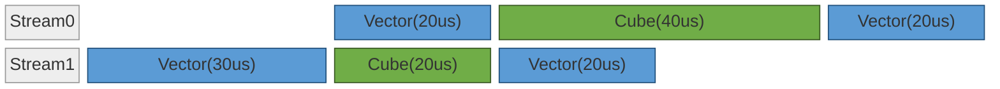

<div align="center">Figure 2. Without Event control, the schedule takes 110 us.</div>

Scheme 2: Event control over the ordering. The critical path is shorter, taking 100 us.

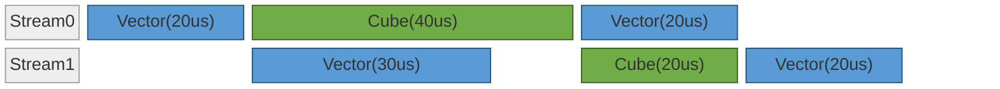

<div align="center">Figure 3. With Event control over the ordering, the schedule takes 100 us.</div>

### 2.2 Typical Forms of Parallelism

#### 2.2.1 Cube and Vector Complementarity

On a platform that supports [separated mode](https://www.hiascend.com/document/detail/en/CANNCommunityEdition/900/programug/Ascendcopdevg/atlas_ascendc_10_0008.html#EN-US_TOPIC_0000002531522198__section1574769433) (see the "AI Core Working Modes" section), Cube and Vector can be scheduled independently. By interleaving Cube operators and Vector operators across two Streams, they complement each other. Typically the two Streams share the same upstream data dependency: one branch continues on the previous Stream — the "main stream" — while the other branch runs on a second Stream — the "side stream" — and the side stream's data later returns to the main stream. In general the total time spent on Cube and Vector is not balanced; Cube tends to dominate, so the Cube-class operators are the critical path. As shown in the figure below, during the parallel phase the Cube unit, being the bottleneck, ideally approaches 100% utilization and hides the time of the other parallel units.

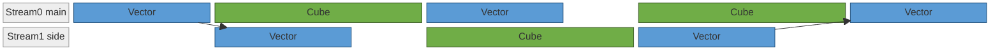

<div align="center">Figure 4. Cube and Vector operators interleaved across two Streams so that the Cube unit stays busy.</div>

#### 2.2.2 Core Splitting Within the Same Compute Pool

In many scenarios an operator does not utilize the compute resources very efficiently. For example, suppose an operator takes time $T$ when it uses all cores, and time $\frac{3}{2} T$ when it uses 1/2 of the cores; then the compute time of two similar Matmuls is optimized from $2T$ when run serially to $\frac{3}{2} T$ when each takes half the cores and they run in parallel — a 25% improvement. The main reason is that when the data volume is small, compute-resource and bandwidth utilization is low and the operator launch overhead is a relatively large fraction, so adding more cores yields little additional speedup (though it is not entirely unable to speed up — so when there is no parallelizable branch, the optimal strategy may still be to use more cores for the computation). Introducing a parallel Stream raises resource utilization.
In addition, in quantization scenarios many Matmuls are mixed operators; when the Vector utilization within them is low, a portion can be carved out for the Vector-class operators of a parallel Stream (this requires support for [separated mode](https://www.hiascend.com/document/detail/en/CANNCommunityEdition/900/programug/Ascendcopdevg/atlas_ascendc_10_0008.html#EN-US_TOPIC_0000002531522198__section1574769433), see the "AI Core Working Modes" section). For instance, on the Atlas A2/A3 platform, the AI Core has Cube:Vector = 1:2, so one can carve out a mixed Cube/Vector compute Stream with Cube:Vector = 1:1, plus a second, Vector-only Stream.

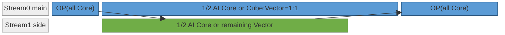

<div align="center">Figure 5. Splitting the same class of compute pool across two parallel Streams.</div>

The actual benefit must be measured and tuned according to the specific model:
* Core-splitting parallelism can raise compute-capacity utilization to some degree, but in real scenarios it also incurs some performance loss. As shown in the figure above, after the split the two parallel Streams do not take the same amount of time, yet the subsequent computation depends on the results of both Streams; the cores assigned to whichever Stream finishes first therefore sit idle, which offsets part of the performance gain — and in severe cases may yield no benefit at all or even degrade performance;
* Depending on the structure of the model being optimized, the split ratio between the two Streams can be tuned so that their execution times are roughly equal. Generally this core-splitting approach is used on Decode (small data volume, small operators, satisfying the conditions for core-splitting benefit) and mostly uses graph mode, so the core split is fixed at the first graph execution and does not change thereafter; but the execution times of the two streams may vary — for instance, the attention time changes with the KV cache length, and the MoE time changes with the routed-expert load — so adjusting the core split cannot necessarily fully eliminate the resource idling caused by the unequal Stream times above; whether to adopt this optimization must be analyzed against actual measurements.

#### 2.2.3 Compute and Communication Complementarity

The communication unit is independent of the compute units. By moving the communication operator onto a dedicated Stream, it executes concurrently with the computation on the main Stream.

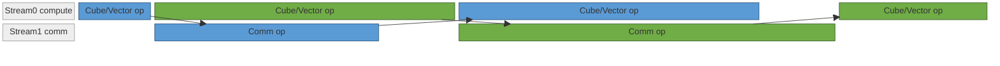

<div align="center">Figure 6. Communication operators on a dedicated Stream, overlapping with computation on the main Stream.</div>

By default communication does not occupy compute resources, but in two cases a communication operator does occupy Vector (see `HCCL_OP_EXPANSION_MODE` and fused compute-communication operators above). In that case, given that most operators occupy all AI Cores by default, the two Streams cannot run in parallel; one can apply the core-splitting shown in the previous section, allocating part of the Vector cores to the communication Stream while the compute Stream gives up the corresponding number of Vector cores.
Usually there is a data dependency between the compute and communication operators in a model, so they can only run serially; but they can be split into two parallel branches in the DBO (Dual Batch Overlap) style, where the communication in one branch and the computation in the other have no data dependency and can run in parallel. As shown below, the MoE module is split so that one micro-batch's dispatch / combine communication runs in parallel with the other micro-batch's expert computation.

```mermaid
block-beta
  columns 13
  s0["Stream0 main"]:1 a1["mb0 attn (0–2)"]:2 a2["mb1 attn (2–4)"]:2 space:1 a3["mb0 expert (5–8)"]:3 a4["mb1 expert (8–11)"]:3 space:1
  s1["Stream1 side"]:1 space:2 b1["mb0 dispatch (2–5)"]:3 b2["mb1 dispatch (5–8)"]:3 b3["mb0 combine (8–9)"]:1 space:2 b4["mb1 combine (11–12)"]:1

  classDef hdr fill:#eee,stroke:#999,color:#000
  classDef main fill:#5B9BD5,color:#fff,stroke:#1F4E79
  classDef parr fill:#70AD47,color:#fff,stroke:#385723

  class s0,s1 hdr
  class a1,a3,b1,b3 main
  class a2,a4,b2,b4 parr
```

<div align="center">Figure 7. DBO: one micro-batch's communication overlaps with the other micro-batch's computation.</div>

The performance gain of DBO comes mainly from parallelizing communication and computation, fully utilizing the hardware resources; but the split also introduces overhead. For a deep-neural-network accelerator chip, the larger the data volume a single operator processes, the higher its related hardware efficiency — bandwidth efficiency and instruction efficiency are both higher, and the scheduling and launch overhead is a smaller fraction. Conversely, splitting one batch of data into several pieces generally has a negative effect on compute time; if this offsets the parallelism gain, there is no overall benefit and performance may even degrade. For example, Decode is generally memory-bound (weight loading), and the two batches that DBO splits both load the full weights, so the compute time of the two batches nearly doubles; DBO is therefore mainly used for Prefill optimization.

## 3. Implementation

In model code implemented with torch, the model has several execution modes — such as eager mode and graph mode. On the NPU, graph mode is further divided into ge_graph and npugraph_ex according to the compilation-optimization backend; see [NPU Graph Mode Optimization Principles](./npu_graph_optimization.md). The multi-stream and Event-synchronization APIs differ across the three modes and cannot be mixed; for example, calling `record_event` / `wait_event` in ge_graph mode causes synchronization to fail or compilation to fail, because the external-object semantics cannot be integrated into the graph. This chapter lists the stream switching, synchronization, and lifecycle handling for each implementation in turn.

The three modes are selected via the `exe_mode` configuration (values `eager` / `ge_graph` / `npugraph_ex`).

The sections below use the DAG A → (branch B, branch C) → D from [Section 1, Background](#1-background) as a unified example. The main stream executes A → C1 → C2, while the side stream executes B1 → B2 in parallel; before `op_D` can launch, it must wait for the results of the two streams to merge. The code differs across the three implementations, but the semantics of the execution timeline are identical:

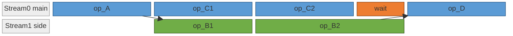

<div align="center">Figure 8. Unified execution timeline shared by the three implementations.</div>

In the figure, the `wait` block appears under eager / npugraph_ex as a `wait_event` call in the code, on the main stream, waiting for the side stream to finish executing; under ge_graph it is inserted automatically by the compiler from the data dependency on `out_B2`.

### 3.1 eager

In eager mode, Streams are created and switched actively at the model-script level.

```python
import torch

# Create the side stream (the main stream is the default current_stream)
side_stream = torch.npu.Stream()
main_stream = torch.npu.current_stream()

# Main stream: upstream operator A
out_A = op_A(x)

# Side stream: run branch B after A on the main stream completes
side_stream.wait_stream(main_stream)
with torch.npu.stream(side_stream):
    out_B1 = op_B1(out_A)
    out_B2 = op_B2(out_B1)
out_B2.record_stream(main_stream)  # out_B2 will be consumed by the main stream; tell the allocator to extend its lifetime
event_B = side_stream.record_event()

# Main stream runs branch C in parallel
out_C1 = op_C1(out_A)
out_C2 = op_C2(out_C1)

# Main stream waits for B on the side stream to finish, then merges
main_stream.wait_event(event_B)
out_D = op_D(out_B2, out_C2)
```

API notes:
- `torch.npu.Stream()` creates a side-stream object; `torch.npu.current_stream()` gets the current main stream.
- `with torch.npu.stream(side_stream):` is a context manager; kernels launched within the context are bound to the Stream `side_stream`.
- `side_stream.wait_stream(main_stream)`: at the side stream's entry, wait for all tasks already issued to the main stream (here, op_A) to complete. This is a coarse-grained join, suitable for the "wait until everything before this point has completed" scenario.
- `record_event` / `wait_event`: cross-stream point-in-time synchronization. The side stream marks `event_B` where B completes, and the main stream waits on that event before launching D.
- `tensor.record_stream(stream)`: by default the caching allocator tracks when to free a tensor according to the Stream on which it was created. A short-lived tensor consumed across streams must have its memory lifetime extended to the target Stream via `record_stream`, so that the allocator waits for the target Stream to finish consuming it before considering its memory for reuse. In the code, `out_B2` is created on the side stream and consumed by `op_D` on the main stream, so `out_B2.record_stream(main_stream)` must be called.

### 3.2 ge_graph

In ge_graph mode the multi-stream expression enters the graph; the GE compiler assigns it to logical Streams at graph-compile time, and it is scheduled per the graph at runtime.

```python
import torch
import torchair as tng
from torchair import CompilerConfig, get_npu_backend

class Model(torch.nn.Module):
    def forward(self, x):
        out_A = op_A(x)

        # Place branch B on the side stream with tag "1" and limit the number of cores it uses
        with tng.scope.npu_stream_switch("1"):
            with tng.scope.limit_core_num(12, 24):
                out_B1 = op_B1(out_A)
                out_B2 = op_B2(out_B1)

        # Branch C stays on the main stream and is likewise core-limited (forming a core-split pair with the side stream)
        with tng.scope.limit_core_num(12, 24):
            out_C1 = op_C1(out_A)
            tng.scope.npu_wait_tensor(out_C1, out_B2)
            out_C2 = op_C2(out_C1)

        # out_B2 comes from the side stream; the cross-stream data dependency of op_D triggers compiler-inserted synchronization automatically
        out_D = op_D(out_B2, out_C2)
        return out_D

# Compile into the graph
config = CompilerConfig()
model = Model()
model = torch.compile(model, backend=get_npu_backend(compiler_config=config))
```

API notes:

- `tng.scope.npu_stream_switch("tag")`: an in-graph scope; operators within the scope are assigned at compile time to the logical Stream corresponding to the tag. A tag uniquely identifies a Stream across the global scope, and reusing the same tag across modules reuses the same Stream.
- `tng.scope.npu_wait_tensor(anchor, wait_tensor)`: inserts a cross-stream wait within the current scope, for scenarios where the ordering between two streams must be controlled precisely.
- `tng.scope.limit_core_num(aic, aiv)`: limits the number of AIC (Cube core) / AIV (Vector core) cores used by the operators within the scope. When generating IR nodes, the compiler configures the available core count for the scope's operators according to the scope's limit, giving core control precise to each individual parallel segment. Both parallel Streams usually need core limits (in the example above, branches B and C each get 12+24 cores); in general the core counts of the parallel branches must sum to the total core count — exceeding it prevents parallelism and can even cause resource interlock and hangs.
- Lifecycle: memory lifetimes are fully analyzed from the data dependencies at graph-compile time, and cross-stream dependencies are expressed explicitly as graph edges.

### 3.3 npugraph_ex

In npugraph_ex mode, Stream creation and switching is done by creating Streams and Events; when there is a cross-stream data dependency, an Event must be used explicitly to synchronize and wait.

```python
import torch

class Model(torch.nn.Module):
    def __init__(self):
        super().__init__()
        # Streams and Events are created in __init__ so the object references stay stable across the capture / replay phases
        self.side_stream = torch.npu.Stream()
        self.events = [torch.npu.Event(), torch.npu.Event()]

    def forward(self, x):
        out_A = op_A(x)

        # Main stream marks that out_A will be consumed by the side stream; tell the allocator to extend its lifetime
        out_A.record_stream(self.side_stream)
        self.events[0].record()  # main stream records event 0

        # Place branch B on the side stream
        with torch.npu.stream(self.side_stream):
            self.events[0].wait()  # side stream waits for the main stream's event 0
            out_B1 = op_B1(out_A)
            out_B2 = op_B2(out_B1)
            self.events[1].record()  # side stream records event 1

        # Branch C runs in parallel
        out_C1 = op_C1(out_A)
        out_C2 = op_C2(out_C1)

        # Main stream marks that out_B2 will be consumed by itself, and waits for the side stream's event 1
        out_B2.record_stream(torch.npu.current_stream())
        self.events[1].wait()
        out_D = op_D(out_B2, out_C2)
        return out_D

# Wrap into the graph
model = Model()
model = torch.compile(model, backend="npugraph_ex")
```

API notes:

- Stream switching reuses eager's `with torch.npu.stream(s):` context.
- Event synchronization is invoked explicitly through `event.record()` / `event.wait()`.
- `tensor.record_stream(stream)`: a tensor consumed across streams must call `record_stream` before it enters the consuming stream, telling the allocator to extend the tensor's lifetime until `stream` has also finished using it. In this example both `out_A` (produced on the main stream, consumed by the side stream) and `out_B2` (produced on the side stream, consumed by the main stream) must call it.


## 4. Concrete Network Examples

### 4.1 DeepSeek-R1: Micro-batch Pipelining + Cube↔Vector Complementarity

DeepSeek-R1 uses two multi-stream optimizations: the prefill phase uses micro-batch pipelining, and the decode phase moves the shared experts onto the side stream to run in parallel with the routed experts.

#### 4.1.1 Key Structure

Inside the MoE layer there are two data-independent branches (the routed experts and the shared experts):

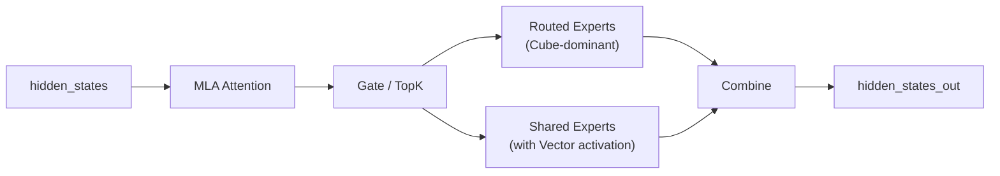

<div align="center">Figure 9. DeepSeek-R1 MoE layer: routed experts and shared experts are data-independent.</div>

Routed and Shared have no data dependency between them, corresponding to the Cube↔Vector complementarity form of parallelism in [Section 2.2.1, Cube and Vector Complementarity](#221-cube-and-vector-complementarity).

#### 4.1.2 Decode Phase: Shared Experts and Routed Experts in Parallel

The shared experts are divided into three segments — `gate_up_proj` → `swiglu` → `down_proj` — and are scheduled on the side stream **staggered segment by segment** against the main stream's three segments `dispatch` → `routed GMM` → `combine`. Each parallel pair has complementary resource types:

```mermaid
block-beta
  columns 13
  s0["Stream0 main"]:1 gate["gate"]:1 disp["dispatch"]:2 gmm["routed GMM"]:6 comb["combine"]:2 add["add"]:1
  s1["Stream1 side"]:1 space:1 gup["gate_up_proj"]:2 swi["swiglu"]:2 space:4 dp["down_proj"]:2 space:1

  gate --> gup
  disp --> swi
  gmm --> dp
  comb --> add
  dp --> add

  classDef hdr fill:#eee,stroke:#999,color:#000
  classDef vector fill:#5B9BD5,color:#fff,stroke:#1F4E79
  classDef cube fill:#70AD47,color:#fff,stroke:#385723
  classDef comm fill:#ED7D31,color:#fff,stroke:#7C390F

  class s0,s1 hdr
  class gate,swi,add vector
  class gmm,gup,dp cube
  class disp,comb comm
```

<div align="center">Figure 10. Decode phase: the three shared-expert segments staggered against the routed-expert segments.</div>

Colors by resource type: blue = Vector, green = Cube, orange = HCCL communication. The complementary resource relationships of the three parallel pairs:

| Time segment | Main stream (resource) | Side stream (resource) | Complementary relationship |
| --- | --- | --- | --- |
| dispatch ‖ gate_up_proj | HCCL comm + Vector | Cube | comm ↔ compute |
| routed GMM head ‖ swiglu | Cube | Vector | Cube ↔ Vector |
| combine ‖ down_proj | HCCL comm + Vector | Cube | comm ↔ compute |

#### 4.1.3 Prefill Phase: Micro-batch Pipelining

The prefill phase splits the input into two micro-batches (mb0, mb1). The main stream is the compute stream (attn / ln+gate / shared expert / expert / finalize_routing), and the side stream is HCCL communication (dispatch / combine). The two streams use several groups of Events to realize the cross-stream compute-communication waits between mb0 and mb1.

The execution timeline of one mb0/mb1 cycle per MoE layer:


<div align="center">Figure 11. Prefill phase: mb0 / mb1 micro-batch pipelining across a compute stream and a communication stream.</div>

Colors by micro-batch: blue = mb0, green = mb1. `L0`/`L1` are post_attention_layernorm + gate_init_routing, `S0`/`S1` are the shared expert, and `fin` is finalize_routing.

Cross-layer overlap: the previous layer's mb1 combine triggers mb1 finalize_routing at the entry of the next layer, running in parallel with the next layer's mb0 attn, so that the mb1 combine is also hidden.

### 4.2 LongCat-Flash: Same-Class Compute Pool Core-Splitting + Cross-Node Communication Overlap

Each LongCat-Flash layer contains two segments: the first is a single attention, and the second splits **dense → second attention → dense** and the **shortcut MoE** into two parallel paths. Both parallel paths are Cube-dominant and require `limit_core_num` to split the cores ([Section 2.2.2, Core Splitting Within the Same Compute Pool](#222-core-splitting-within-the-same-compute-pool)). Under AFD deployment the side stream's shortcut MoE is replaced by cross-node Send/Recv, which runs in parallel with the main stream's computation ([Section 2.2.3, Compute and Communication Complementarity](#223-compute-and-communication-complementarity)).

#### 4.2.1 Key Structure

The parallel structure of each layer:

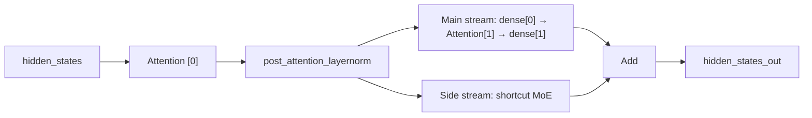

<div align="center">Figure 12. LongCat-Flash layer structure: two Cube-dominant paths merging at Add.</div>

After the first attention segment completes, the main stream's `dense[0] → attn[1] → dense[1]` and the side stream's shortcut MoE have no data dependency, forming a typical scenario for the core splitting of [Section 2.2.2, Core Splitting Within the Same Compute Pool](#222-core-splitting-within-the-same-compute-pool).

#### 4.2.2 Multi-Stream Orchestration

The two Cube-dominant paths run in parallel, each locking in an independent AIC / AIV quota via `limit_core_num`. With `attn[1]` embedded between the two denses on the main stream, the main stream's overall duration is close to that of the side stream's shortcut MoE; the two streams finish roughly in sync and merge at `Add`:


<div align="center">Figure 13. LongCat-Flash multi-stream orchestration with core-splitting between the two paths.</div>
