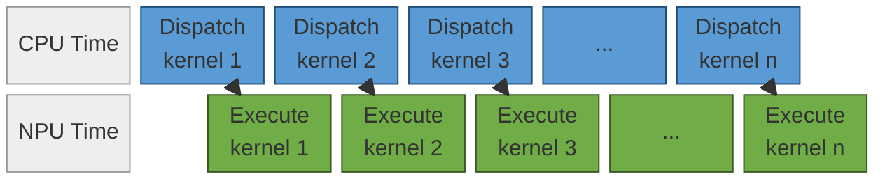
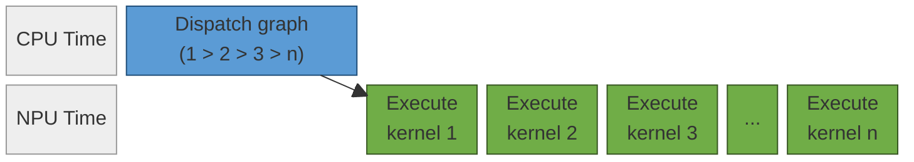
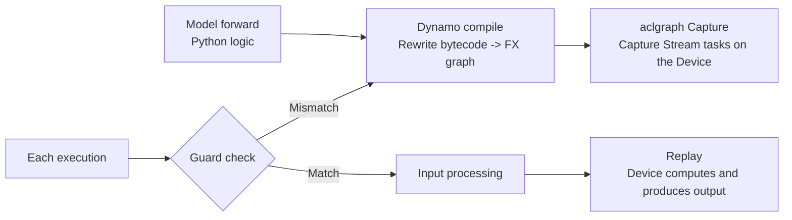
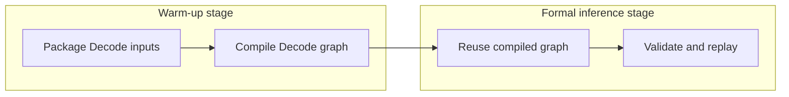

# NPU Graph Mode Optimization Principles

This document describes the background and fundamentals of graph mode optimization on Ascend NPUs, the relationship between GE graph mode and `npugraph_ex` graph mode, and their enablement and common debugging methods in the cann-recipes-infer framework.

## 1. Background

By default, PyTorch runs models in `eager` mode, which can be understood as "interpret while executing." As shown below, the framework dispatches the operators for a given point in the model forward pass to the Device only when execution reaches that point. This mode is straightforward to develop and debug. However, in large-model inference, especially during Decode, each invocation has few input tokens and fine-grained operators. Per-operator dispatch and runtime scheduling overhead on the Host can therefore become visible, ultimately making the workload host-bound.



<div align="center">Figure 1. Eager mode: the Host alternates between dispatching operators and Device execution.</div>

Graph mode optimization captures the model forward logic in advance as a computation graph, which is then compiled and executed uniformly by the NPU backend. With a more complete computation graph, the backend can perform operator fusion, memory reuse, scheduling optimization, and execution lowering across a broader scope. In graph mode, the Host dispatches the entire graph only once, with the execution order (1 > 2 > 3 > n) already fixed in the graph; the Device can then execute operators continuously. This reduces Host dispatch overhead and shortens end-to-end latency.



<div align="center">Figure 2. Graph mode: the Host dispatches the entire graph once and the Device executes continuously.</div>

For LLM inference, `prefill` and `decode` have different suitability for graph mode:

| Stage | Input characteristics | Graph mode recommendation | Rationale |
| --- | --- | --- | --- |
| `prefill` | Dynamically varying sequence length and relatively large per-invocation compute | Usually remain in eager mode | Shapes and control flow are more likely to vary, and longer operator execution times make Host dispatch overhead a smaller proportion of the total. |
| `decode` | A single token or a fixed, short input | Graph mode is recommended | Shapes are more stable and operators are smaller, making compiled graphs easier to reuse and dispatch overhead easier to reduce. |

Accordingly, in the current cann-recipes-infer execution framework, graph mode is used primarily for Decode, while Prefill follows the eager path by default.

In addition to ordinary graph compilation, graph mode is often used together with compile caching, also known as `cache compile`, which persists the result of the first graph compilation. When the model structure, input shape, dtype, cache directory, and graph mode configuration remain unchanged, subsequent starts or repeated runs can reuse the cache directly and reduce the startup overhead of initial compilation.

## 2. Principles

### 2.1 Fundamentals of Graph Mode

The core of graph mode is "capture once, replay many times": the first execution captures and compiles the model forward pass into a reusable graph; later executions replay that graph directly when reuse conditions are met. This avoids per-operator dispatch and repeated compilation. The following describes the key stages using `npugraph_ex` as an example.

1. **Dynamo compile**: A Python-level Just-In-Time (JIT) compiler. At runtime, it rewrites Python bytecode, extracts the PyTorch operation sequence of the model forward pass into an FX graph, and passes the graph to a configurable backend, here `npugraph_ex`, for compilation.
2. **Guards**: During Dynamo compilation, a set of guards is generated from assumptions about the input shape, dtype, selected scalars, and so on. The guards are checked before each execution to determine whether the program must be recaptured and recompiled. When all guards match, the existing graph is reused; otherwise, capture and compilation are triggered again.
3. **aclgraph Capture**: `npugraph_ex` captures tasks on a Stream onto the Device, materializing a stable NPU execution sequence, including the kernel sequence and memory layout, for low-overhead replay.
4. **Input processing**: Before replay, the input addresses of graph input parameters are updated to the addresses used by the actual execution. If an input Tensor uses a private format such as `FRACTAL_NZ`, its format information is retained.
5. **Replay**: The Device executes the captured graph using the supplied inputs, performs the computation, and produces output results.



<div align="center">Figure 3. npugraph_ex capture and reuse flow.</div>

In cann-recipes-infer, the preceding capture and compilation occur during warm-up. Warm-up runs Decode once to trigger Dynamo compilation and aclgraph Capture, compiles the graph, and retains it. Formal inference then reuses the graph compiled during warm-up rather than compiling again, performing only guard checks, input processing, and replay. Graph compilation overhead is therefore removed from the critical path of formal inference.

Graph mode benefits depend on stable guard hits. Decode naturally suits reuse of the same graph because its shapes are stable and its operators are fixed. This also explains why graph mode is used mainly for Decode and why the model must keep input shapes and persistent buffer addresses stable; see [Section 3.2, Requirements for Model Code](#32-requirements-for-model-code).

#### 2.1.1 Principles of Compile Caching

By default, the preceding capture and compilation take effect only within a process. A graph compiled during warm-up is cached in memory and becomes unavailable when the process exits, so the next launch must run Dynamo compilation and aclgraph Capture again. On this basis, compile caching persists compilation results to disk so they can be reused across processes and launches. For details, see [npugraph_ex Compile Cache](https://gitcode.com/Ascend/torchair/blob/26.0.0/docs/en/npugraph_ex/advanced/compile_cache.md).

The key idea is to persist the artifacts from a complete compilation:

1. **Initial compilation**: After `cache_compile` completes Dynamo compilation, graph optimization, and aclgraph Capture, it serializes the compilation artifacts, including the graph structure, kernel sequence, and memory layout, to `cache_dir`.
2. **Cache hit**: On subsequent launches, `cache_compile` looks for a matching entry in `cache_dir`. On a hit, it loads the compiled graph directly from disk, skips Dynamo compilation and Capture, and proceeds to guard checking, input processing, and replay.
3. **Cache invalidation**: If the model code, input shape or dtype, compilation configuration, or any relevant item in `cache_dir` changes, the cache is treated as a miss. The initial compilation path is used and the artifacts are persisted again.

Compile caching and the graph reuse described in Section 2.1 operate at different levels. Graph reuse lets multiple Decode invocations in the same process reuse one graph; compile caching reuses compilation artifacts across processes and launches, avoiding graph compilation overhead at every start.

### 2.2 Problems Addressed by Graph Mode

Graph mode primarily addresses two problems: Host scheduling overhead and insufficient scope for backend-wide optimization.

In eager mode, the Host schedules operators step by step according to the Python forward logic; see Figure 1 in [Section 1, Background](#1-background). For small operators during Decode, actual Device compute time can be short, making Host dispatch, synchronization, and scheduling a substantial share of execution time. Graph mode converts the forward pass into a reusable computation graph that the runtime schedules as a whole; see Figure 2 in [Section 1, Background](#1-background). The Host dispatches the complete graph once, and the Device executes it continuously, reducing the cost of entering Python and the framework runtime for each operator.

In addition, an eager-mode backend normally sees only local operators at a time and therefore has limited optimization scope. In graph mode, the backend can analyze data dependencies, lifetimes, and execution order from the complete graph, enabling operator fusion, constant folding, memory reuse, communication capture, and multi-stream scheduling.

### 2.3 Two NPU Graph Mode Implementations

This repository primarily provides two NPU graph mode paths: `ge_graph` and `npugraph_ex`. Both are based on TorchAir. For the complete set of capabilities and API descriptions, see the [TorchAir Documentation Overview](https://gitcode.com/Ascend/torchair/blob/26.0.0/docs/en/overview.md).

#### 2.3.1 GE Graph Mode

GE graph mode converts the FX graph captured by `torch.compile` into Ascend IR, which is then compiled and executed by the GE engine. This path emphasizes graph compile-time optimization. It is appropriate for expressing computation, communication, multi-stream execution, core limits, and related information within the graph so that the compiler can analyze and schedule them uniformly. For details, see the [GE / Ascend IR Graph Mode](https://gitcode.com/Ascend/torchair/blob/26.0.0/docs/en/ascend_ir/features) documentation.

Typical characteristics of GE graph mode include:

1. Stronger in-graph expressiveness, suitable for TorchAir scopes, communication capture, in-graph multi-stream execution, and related capabilities.
2. Compilation configuration is primarily carried by `CompilerConfig.experimental_config`.
3. Standard compilation uses `torchair.get_npu_backend(...)` as the backend.
4. Cached compilation uses `torchair.inference.cache_compile(...)`.

#### 2.3.2 npugraph_ex Graph Mode

npugraph_ex is based on npugraph capture and replay. Its central idea is to capture a stable NPU execution sequence and replay it at low overhead in subsequent Decode operations. For details, see the [npugraph_ex Backend](https://gitcode.com/Ascend/torchair/blob/26.0.0/docs/en/npugraph_ex/npugraph_ex.md) documentation. Its usage experience is closer to eager mode, and objects such as Stream and Event in model code more closely resemble explicit runtime objects.

Typical characteristics of npugraph_ex include:

1. A relatively lightweight adaptation path that facilitates incremental migration from eager code.
2. Compilation configuration is primarily passed through `options` keyword arguments.
3. Standard compilation uses `backend="npugraph_ex"`.
4. Cached compilation uses `torch.npu.npugraph_ex.inference.cache_compile(...)`.

> **Note:** Some early model code and documents in the repository still use the name `acl_graph`. In practice, it can usually be understood as an earlier graph mode path that is more closely related to the current `npugraph_ex` direction. New model integrations should prioritize the `ge_graph` and `npugraph_ex` configurations in the execution framework. Historical `acl_graph` naming will be gradually consolidated and removed.

### 2.4 Selecting a Graph Mode

Neither mode is universally superior. The appropriate choice depends on model adaptation cost, functional stability, and performance objectives.

| Comparison item | `ge_graph` | `npugraph_ex` |
| --- | --- | --- |
| Adaptation objective | More complete graph compilation and backend optimization | Capture and replay closer to eager mode |
| Configuration carrier | `CompilerConfig.experimental_config` | `options` keyword arguments |
| Compilation backend | `torchair.get_npu_backend(...)` | `backend="npugraph_ex"` |
| Cached compilation API | `torchair.inference.cache_compile(...)` | `torch.npu.npugraph_ex.inference.cache_compile(...)` |
| Common `dynamic` setting | `False` | `True` |
| Typical enhancement capabilities | [frozen_parameter](https://gitcode.com/Ascend/torchair/blob/26.0.0/docs/en/ascend_ir/features/advanced/frozen_parameter.md), [tiling_schedule_optimize](https://gitcode.com/Ascend/torchair/blob/26.0.0/docs/en/ascend_ir/features/advanced/tiling_schedule_optimize.md), and [topology_sorting_strategy](https://gitcode.com/Ascend/torchair/blob/26.0.0/docs/en/ascend_ir/features/advanced/topology_sorting_strategy.md) | [static_kernel_compile](https://gitcode.com/Ascend/torchair/blob/26.0.0/docs/en/npugraph_ex/basic/static_kernel_compile.md) and [frozen_parameter](https://gitcode.com/Ascend/torchair/blob/26.0.0/docs/en/npugraph_ex/basic/frozen_parameter.md) |

The current recommendation is to prioritize `npugraph_ex`, which reduces adaptation cost while preserving a development experience closer to eager mode.

Notably, `npugraph_ex` commonly keeps `dynamic=True` at present. This is not because the graph itself must be dynamic, but because of some FIA operator APIs used in current inference scenarios. For example, certain `actual_seq_lengths` arguments are still commonly passed as `list[int]`; forcing static execution can easily trigger recompilation. Once these operator APIs fully support Tensor inputs, this configuration can be further converged.

## 3. Implementation

Graph mode integration can be divided into two steps: first, use `torch.compile` with the appropriate backend to compile the model forward pass, usually the Decode forward pass, into a reusable graph; then make the model code satisfy the constraints for graph capture and graph reuse. This section first describes the compilation and cached compilation APIs for both modes, then the requirements for model code and FIA operator adaptation.

### 3.1 Compilation APIs

For implementation details, see [Framework Graph Compilation](../../../executor/utils/graph_utils.py). Before graph compilation, the following common preparation is typically required:

```python
import torchair as tng
import torchair.ge_concrete_graph.ge_converter.experimental.patch_for_hcom_allreduce

tng.patch_for_hcom()
torch._dynamo.config.inline_inbuilt_nn_modules = False
```

- `tng.patch_for_hcom()`: Enables collective communication capture. It can usually be omitted in PyTorch 2.6 and later.
- `inline_inbuilt_nn_modules = False`: Prevents excessive inlining of built-in modules and reduces uncertainty in some graph compilation scenarios.

Both modes are enabled through `torch.compile`; the primary differences are the `backend` and the configuration carrier. The compiled `model_compiled` is invoked in the same way as the original `model`; calling it with the same keyword arguments triggers graph execution or replay.

#### 3.1.1 ge_graph

`ge_graph` uses the NPU backend provided by TorchAir. See [GE Graph Mode Quick Start](https://gitcode.com/Ascend/torchair/blob/26.0.0/docs/en/ascend_ir/quick_start.md). Compilation configuration is carried by `CompilerConfig`:

```python
import torchair as tng
from torchair import CompilerConfig

compile_config = CompilerConfig()
# Enable in-graph optimizations in config.experimental_config as needed.
model_compiled = torch.compile(
    model,
    backend=tng.get_npu_backend(compiler_config=compile_config),
    dynamic=False,
    fullgraph=True,
)
```

API notes:

- `tng.get_npu_backend(compiler_config=config)`: Returns the GE graph mode compilation backend for use as the `backend` of `torch.compile`.
- `CompilerConfig`: The GE graph mode configuration entry point. In-graph optimizations such as `frozen_parameter`, `tiling_schedule_optimize`, and `topology_sorting_strategy` are enabled through `config.experimental_config`.
- `dynamic=False`: Decode shapes are stable; keeping the graph static reduces recompilation.

With cached compilation enabled, replace `torch.compile` with `torchair.inference.cache_compile`. The first execution persists compilation results to `cache_dir`; subsequent cache hits skip recompilation. For details and parameters, see [ge_graph Compile Cache](https://gitcode.com/Ascend/torchair/blob/26.0.0/docs/en/ascend_ir/features/advanced/compile_cache.md):

```python
import torchair as tng

model_compiled = tng.inference.cache_compile(
    model_forward,
    cache_dir=cache_dir,     # Persistent, writable compilation cache directory.
    config=compiler_config,  # Same CompilerConfig as standard compilation.
    dynamic=False,
    fullgraph=True,
    ge_cache=True,           # Reuse the GE compilation cache as well.
)
```

#### 3.1.2 npugraph_ex

`npugraph_ex` specifies the backend directly by name. See [npugraph_ex Quick Start](https://gitcode.com/Ascend/torchair/blob/26.0.0/docs/en/npugraph_ex/quick_start.md). Configuration is passed through `options` keyword arguments:

```python
options = {
    # For example, enhancement switches such as static_kernel_compile / frozen_parameter.
}
model_compiled = torch.compile(
    model,
    backend="npugraph_ex",
    dynamic=enable_dynamic_graph,
    fullgraph=True,
    options=options,
)
```

API notes:

- `backend="npugraph_ex"`: Selects the npugraph capture-and-replay backend.
- `options`: The npugraph_ex configuration carrier. Enhancement capabilities such as `static_kernel_compile` and `frozen_parameter` are passed through it.
- `dynamic=enable_dynamic_graph`: `enable_dynamic_graph` is configurable and must be selected according to the model input form. In current inference scenarios, when some FIA APIs still receive `actual_seq_lengths` as `list[int]`, keep `enable_dynamic_graph=True` to avoid recompilation caused by forcing static execution. When the model has no such `list` inputs, for example deepseek_v4, a static graph is recommended: set `enable_dynamic_graph=False` for more stable graph reuse and lower dispatch overhead.

With cached compilation enabled, replace `torch.compile` with `torch.npu.npugraph_ex.inference.cache_compile`. The first execution persists compilation results to `cache_dir`; later cache hits skip recompilation. For details and parameters, see [npugraph_ex Compile Cache](https://gitcode.com/Ascend/torchair/blob/26.0.0/docs/en/npugraph_ex/advanced/compile_cache.md):

```python
model_compiled = torch.npu.npugraph_ex.inference.cache_compile(
    model_forward,
    cache_dir=cache_dir,           # Persistent, writable compilation cache directory.
    dynamic=enable_dynamic_graph,  # Same setting as standard compilation.
    options=compile_options,       # Same backend options as standard compilation.
)
```

> In either mode, cache hits depend on the consistency of the model code, input specification (shape and dtype), compilation configuration, and `cache_dir`. A change to any of these invalidates the cache and triggers recompilation. Therefore, use a fixed cache directory and keep the model code, shapes, dtypes, and compilation configuration stable when using cached compilation.

### 3.2 Requirements for Model Code

Completing the preceding compilation integration alone does not guarantee that graph mode is usable. The model forward pass itself must satisfy graph capture and graph reuse constraints.

#### 3.2.1 Stabilize the Eager Path First

Graph mode does not correct functional or accuracy issues that already exist in eager mode. Before integrating graph mode, ensure that the model can complete Prefill and multiple Decode iterations reliably in eager mode and that output accuracy meets expectations.

#### 3.2.2 Explicitly Separate Prefill and Decode

Prefill and Decode should use explicitly separate execution paths:

1. Keep Prefill in eager mode.
2. Use graph mode for Decode.
3. Distinguish the paths with `forward_metadata.is_prefill` or separate `prefill()` and `decode()` methods.

This prevents Prefill's dynamic shapes and control flow from affecting Decode graph stability.

#### 3.2.3 Pass Dynamic Information Explicitly

Typical dynamic information includes `kv_len`, `position_ids`, `actual_seq_lengths_q`, `actual_seq_lengths_kv`, and `is_prefill`. The framework should construct this information and pass it to the model as explicit inputs, rather than generating Python scalars temporarily inside the model or deriving it from implicit global state.

#### 3.2.4 Update the KV Cache and Persistent Buffers In Place

Decode graph reuse requires the shapes and addresses of critical inputs to remain as stable as possible. Therefore, persistent data such as the KV cache, attention mask, and position buffer should be preallocated and updated in place at runtime.

Not recommended:

```python
key = torch.cat([past_key, new_key], dim=1)
```

Recommended:

```python
torch_npu.scatter_update_(k_cache, kv_len, key_states, -2)
torch_npu.scatter_update_(v_cache, kv_len, value_states, -2)
```

The objective is to prevent the KV cache shape or address from changing during Decode, thereby reducing Dynamo guard failures and recompilation.

#### 3.2.5 Avoid Graph-Break Patterns

During graph capture, avoid the following patterns whenever possible:

1. `tensor.item()`.
2. Python `if` or `while` statements driven by Tensor values.
3. Temporary control-flow branches in `forward` that affect shapes.
4. Switching in-graph control flow based on varying Python list or tuple lengths.

## 4. Concrete Model Example

### 4.1 Qwen3-MoE: Decode Graph Mode Adaptation

The Qwen3-MoE graph mode adaptation illustrates the typical Decode graph mode approach in this repository: Prefill remains eager; Decode switches to `ge_graph` or `npugraph_ex` according to `exe_mode`; and FIA APIs and dynamic inputs are handled in a mode-specific manner.

#### 4.1.1 Critical Path

The critical path consists of two stages: warm-up packages inputs and completes Decode graph compilation; formal inference directly reuses the compiled graph.



<div align="center">Figure 4. Critical path for Decode graph mode.</div>

During warm-up, package Decode inputs such as `kv_len`, `actual_seq_lengths_*`, and `position_ids`, then run Decode once to trigger graph compilation and retain the compiled graph. During formal inference, do not compile again; reuse the graph compiled during warm-up and perform only guard checking, input processing, and replay. As a result, graph compilation overhead is not on the critical path of formal inference.

#### 4.1.2 GE Graph Mode

In `ge_graph` mode, the model preferentially uses `torchair.ops` APIs that are suitable for inclusion in a GE graph, and organizes dynamic length information such as `actual_seq_lengths` as Tensor inputs. The backend can then track data dependencies inside the graph and use the GE compiler for graph optimization.

#### 4.1.3 npugraph_ex Graph Mode

In `npugraph_ex` mode, the model is closer to eager execution semantics and commonly uses `torch_npu` inference APIs. The current repository execution path converts some `actual_seq_lengths_*` values to `list[int]` during Decode to meet existing FIA API requirements. During integration, ensure that the organization of these lists has stable lengths to avoid recompilation or capture failures during replay.

### 4.2 Combining Graph Mode with Enhancement Features

Graph mode is usually not used in isolation. It is commonly combined with cached compilation, static kernels, multi-stream execution ([NPU Multi-Stream Principles](./multi_stream_principles.md)), prefetching ([NPU Prefetch Principles](./prefetch_principles.md)), SuperKernel ([NPU SuperKernel Principles](./super_kernel.md)), and other capabilities. The following order is recommended:

1. First make eager mode work and validate functionality and accuracy.
2. Enable graph mode and eliminate graph breaks and recompilation.
3. Compare eager and graph outputs, covering at least one Prefill and multiple Decode iterations.
4. Then enable `enable_cache_compile`, `enable_static_kernel`, multi-stream execution, core limiting, or the model-provided `enable_superkernel` as needed.

At present, `enable_static_kernel` applies only to paths related to `npugraph_ex`; operators in the static graph of `ge_graph` are static by default. `enable_superkernel` is currently attempted mainly in `ge_graph` mode. Because enhancement features have different scopes of applicability, confirm the model configuration and current backend capabilities during integration.

### 4.3 Common Issues and Debugging

#### 4.3.1 Quick Reference for Frequent Issues

| Symptom | Common root cause | Recommended action |
| --- | --- | --- |
| Error before compilation | The eager path is incorrect, or the model input shape, dtype, or length organization is unstable. | Validate eager mode independently first, then check graph mode inputs and forward parameters. |
| Graph capture interrupted | `.item()`, Tensor-driven Python branches, `print`, or an unsupported custom operator. | Rewrite the logic as Tensor operations, or complete graph-capture adaptation. |
| Decode performance does not improve or becomes worse | Recompilation occurs, or graph execution does not hit the expected optimization. | Enable recompilation logs and check guard changes, shapes, addresses, and cache-hit status. |
| `actual_seq_lengths` type error | Graph mode and the FIA API are incompatible. | For `ge_graph`, prioritize Tensor inputs with `torchair.ops`; for `npugraph_ex`, align with the current `list[int]` approach. |
| `enable_static_kernel` error | The enabled mode does not match the option. | Use this option only in `npugraph_ex` mode. |
| SuperKernel-related error | Enabled in an unsupported mode. | It is currently attempted mainly in `ge_graph` mode. |
| Communication cannot be captured into the graph | Collective communication capture preparation is incomplete. | Check whether `torchair.patch_for_hcom()` is needed for the PyTorch and TorchAir versions in use. |
| Cache compile is ineffective | The cache directory, input specification, or compilation configuration changed. | Fix the cache directory and keep model code, function names, Tensor shapes, dtypes, and configuration stable. |
| Accuracy anomaly in graph mode | The semantics of KV cache, FA APIs, or in-place updates changed. | Align first with eager mode, then restore graph mode optimizations one by one. |

#### 4.3.2 Common Debugging Techniques

Common debugging techniques include:

1. Enable recompilation logs. When recompilation occurs, enable the relevant logs, fix input shapes, KV cache addresses, and persistent buffers, and observe whether recompilation disappears.

   ```python
   torch._logging.set_logs(recompiles=True)
   ```

2. Compare eager and graph outputs to confirm functional and numerical consistency.
3. Test standard compilation and `cache_compile` separately to distinguish graph compilation issues from cache-hit issues.
4. Enable optimization features one at a time to avoid obscuring the source of an issue through simultaneous stacking.

For additional troubleshooting approaches and historical examples, see TorchAir's [Common Cases and Troubleshooting Methods](https://gitcode.com/Ascend/torchair/tree/26.0.0/docs/en/appendix/cases) and [FAQ](https://gitcode.com/Ascend/torchair/blob/26.0.0/docs/en/appendix/faq.md).
