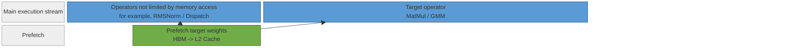
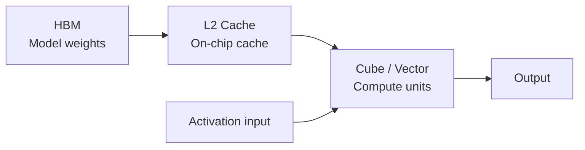
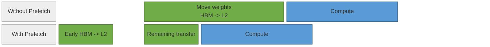

# NPU Prefetch Principles

This document describes the background of weight prefetching on Ascend NPUs, the associated hardware and API semantics, implementation in model code, and representative Prefetch optimizations already deployed in LongCat-Flash.

## 1. Background

The Decode phase of large-model inference commonly has few input tokens and a small batch size. The computation of matrix-multiplication operators may not fully utilize all compute resources, yet each invocation must still read a large volume of model weights. For MatMul, QuantBatchMatmul (QBMM), and GroupedMatmul (GMM), the input activation `x` is usually produced by a preceding operator and is relatively small, whereas the weight `W` can be tens of MB and primarily resides in HBM. Operator latency can therefore be dominated by weight reads, making the operator memory-bound.

Prefetch aims to bring forward these weight reads. When an earlier stage has a window in which HBM bandwidth is not saturated, `torch_npu.npu_prefetch` can move part of the weights of a subsequent target operator from HBM into L2 Cache in advance. When the target operator actually executes, the prefetched weights can be read from a closer cache level, reducing HBM read time within the target operator's execution window.



<div align="center">Figure 1. Prefetching target weights during an available preceding window.</div>

Prefetch is not a universal acceleration switch. It is worth trying only when all of the following conditions hold:

1. Profiling confirms that the target operator is memory-bound and that weight movement is the primary bottleneck.
2. The target weights are sufficiently large for early movement to hide a material amount of HBM read overhead.
3. A safe dependency window exists before the target operator, and prefetching does not materially slow that window.
4. Per-operator profiling explains the source of the benefit, rather than showing only random variation in end-to-end metrics.

Typical targets include MatMul or GMM operators such as `q_proj`, `o_proj`, `gate_up_proj`, and `down_proj`. LayerNorm, RMSNorm, ROPE, SwiGLU, router topk, dispatch, and combine are generally not prefetch targets; instead, they may provide preceding windows in which prefetch can run.

## 2. Principles

### 2.1 Weight Access Path Before Operator Computation

When operators such as MatMul, QBMM, and GMM execute, compute units cannot directly consume model weights resident in HBM. After an operator starts, hardware moves the weights from HBM to L2 Cache and other on-chip caches according to the operator's access pattern; Cube and Vector compute units then read the weights and complete the computation.

The execution of a target operator can be simplified into two interleaved phases:

1. **Transfer phase**: Read target weights from HBM and move them into L2 Cache and other on-chip caches.
2. **Compute phase**: Compute units read the weights from on-chip cache and perform MatMul, GMM, and related computation with the activation input.



<div align="center">Figure 2. Weight access path from HBM to on-chip compute units.</div>

In small-batch Decode workloads, the number of input tokens is low and the compute work of a single MatMul or GMM is limited, increasing the share of weight-read time. When HBM-to-L2 Cache transfer time approaches or exceeds actual compute time, the target operator becomes memory-bound. Prefetch does not change the operator's mathematical computation; it completes part of the HBM-to-L2 Cache transfer in the weight access path earlier.

### 2.2 Multi-Stream Asynchronous Transfer

Prefetch requires a multi-stream mechanism to provide a benefit. On an NPU, the Host dispatches tasks to the Device through Streams. Tasks in one Stream execute in order, while tasks in different Streams can be scheduled concurrently as long as their dependencies are satisfied. Multi-stream optimization exploits this behavior by placing computation, communication, or data movement on different Streams so that they overlap and part of the non-critical-path latency is hidden. For the basic concepts, see [NPU Multi-Stream Principles](./multi_stream_principles.md).

The key role of `torch_npu.npu_prefetch` is to execute movement of target weights on a dedicated prefetch stream. After model code obtains a dependency Tensor on the main execution stream, it calls `torch_npu.npu_prefetch(weight, depend, size, offset)` to initiate prefetch. The runtime uses `depend` to establish synchronization, ensuring that prefetch does not begin before the dependency Tensor is produced while allowing the main execution stream to continue with subsequent operators.

```mermaid
block-beta
  columns 13
  s0["Stream0: main execution stream"]:1 a["Preceding operator<br/>produces depend"]:3 c["Intermediate window"]:3 b["Target MatMul/GMM"]:4 space:2
  s1["Stream1: prefetch stream"]:1 space:3 p["npu_prefetch<br/>Move target weights"]:3 space:4

  a --> p
  p --> b

  classDef hdr fill:#eee,stroke:#999,color:#000
  classDef main fill:#5B9BD5,color:#fff,stroke:#1F4E79
  classDef pre fill:#70AD47,color:#fff,stroke:#385723

  class s0,s1 hdr
  class a,c,b main
  class p pre
```



<div align="center">Figure 3. Asynchronous weight transfer on a dedicated prefetch stream.</div>

The relationship between Prefetch and ordinary multi-stream optimization can therefore be understood as follows: ordinary multi-stream execution usually parallelizes two computation or communication branches, whereas Prefetch parallelizes weight movement for a subsequent operator. Model code must choose the correct `depend`; otherwise, the runtime cannot establish a suitable asynchronous transfer window.

| Comparison item | Multi-stream optimization | Prefetch |
| --- | --- | --- |
| Parallelized object | Compute branches, communication branches, or operators using different resource types | Weight movement for the target operator |
| Dependency expression | Stream/Event, in-graph data dependencies, or `npu_wait_tensor` | The `depend` Tensor |
| Primary benefit | Improves Cube, Vector, and communication-resource utilization | Hides HBM weight-read overhead |
| Tuning mechanism | Adjust Stream scheduling, Events, and core-allocation ratios | Adjust the position of `depend` and `size` |

### 2.3 How Prefetch Shortens the Critical Path

Without Prefetch, the target operator's execution window must include HBM reads, on-chip cache population, and actual computation. Weight-movement latency is therefore directly on the critical path of the target operator.

After Prefetch is introduced, the runtime starts asynchronous movement after the dependency Tensor and places part of the target weights in L2 Cache in advance. When the preceding window overlaps with prefetch transfer, the target operator has less HBM reading to wait for at launch, potentially shortening the critical path.



<div align="center">Figure 4. Critical-path reduction with Prefetch.</div>

An effective prefetch operation can be understood in the following sequence:

1. A preceding operator produces `depend`, and the main execution stream continues running.
2. After `depend`, the prefetch stream begins transferring the first `size` bytes of `weight`.
3. The transferred data enters L2 Cache and other on-chip caches.
4. When the target operator starts, it preferentially consumes weight data already prefetched into cache.
5. Any weight data not covered by the prefetch is still read from HBM through the original path.

## 3. Implementation

On the implementation side, Prefetch primarily involves four tasks: selecting the target weight `weight`, selecting the dependency Tensor `depend`, calculating the prefetch size `size`, and calling `torch_npu.npu_prefetch` at the appropriate location.

### 3.1 API Semantics

See the official [torch_npu.npu_prefetch](https://www.hiascend.com/document/detail/en/Pytorch/2600/apiref/torchnpuCustomapi/docs/en/custom_APIs/torch_npu/torch_npu-npu_prefetch.md) API documentation. The calling form used in the documentation and repository practices is:

```python
torch_npu.npu_prefetch(weight, depend, size, offset)
```

| Parameter | Meaning | Design requirement |
| --- | --- | --- |
| `weight` | Weight Tensor to prefetch | Usually the `.weight.data` of the target operator or the `.data` of expert weights. |
| `depend` | Dependency Tensor that constrains prefetch start time | A Tensor stably produced before the target operator that represents the desired prefetch start time. |
| `size` | Maximum number of bytes to prefetch in this call | Start conservatively and tune according to profiling. |
| `offset` | Starting offset within the weight for prefetch | Current repository practice generally uses `0`. |

### 3.2 Execution Modes and Stream Management

Prefetch stream management depends on the execution mode. In eager and `ge_graph` modes, the API, graph compiler, or runtime manages the prefetch stream internally. In `npugraph_ex` mode, model code must explicitly create and retain the prefetch stream.

#### 3.2.1 eager / ge_graph Usage

In eager or `ge_graph` mode, model code can call `torch_npu.npu_prefetch` directly. It does not need to create `torch.npu.Stream()` manually or switch Streams explicitly. The model only needs to pass the correct `weight`, `depend`, `size`, and `offset`:

```python
if enable_prefetch:
    torch_npu.npu_prefetch(
        target_weight,
        depend_tensor,
        prefetch_size,
        0,
    )
```

In these modes, `depend` expresses when prefetch begins. The API or graph runtime schedules the prefetch task on an appropriate prefetch stream based on this dependency. Do not add a hand-written Stream/Event layer during integration, as it can introduce unnecessary synchronization waits.

#### 3.2.2 npugraph_ex Usage

In `npugraph_ex` mode, graph-capture boundaries and Stream reuse must be explicit. Create a stream for prefetch operations manually. For example, LongCat-Flash creates a dedicated `npugraph_prefetch_stream` during model initialization:

```python
self.npugraph_prefetch_stream = None
if enable_npugraph_ex and enable_multi_streams and enable_prefetch:
    self.npugraph_prefetch_stream = torch.npu.Stream()
```

At the call site, first check whether the prefetch stream exists. If it does, switch to that stream through `npu_stream_switch` and then invoke prefetch. The following example is expressed in terms of the underlying API:

```python
route_prefetch = self.npugraph_prefetch_stream is not None
with npu_stream_switch(route_prefetch, self.npugraph_prefetch_stream):
    torch_npu.npu_prefetch(
        self.gate_up_proj.weight.data,
        o_proj,
        self.up_gate_prefetch_size,
        0,
    )
```

If prefetch depends on an event on the current stream, wait for that event on the prefetch stream to ensure that prefetch does not begin before the dependency data is produced:

```python
with npu_stream_switch(route_prefetch, self.npugraph_prefetch_stream):
    if route_prefetch and x_event is not None:
        self.npugraph_prefetch_stream.wait_event(x_event)
    if enable_prefetch:
        torch_npu.npu_prefetch(
            self.down_proj.weight.data,
            x,
            self.down_prefetch_size,
            0,
        )
```

At the end of complete-model execution in `npugraph_ex`, the main stream generally must wait for the prefetch stream to complete, preventing later stages from reusing related resources too early:

```python
if self.npugraph_prefetch_stream is not None and not is_prefill:
    with npu_stream_switch(True, self.npugraph_prefetch_stream):
        prefetch_done_event = torch.npu.current_stream().record_event()
    torch.npu.current_stream().wait_event(prefetch_done_event)
```

### 3.3 Prefetch Size

`size` determines the amount of data prefetched in one operation. A size that is too small has limited benefit; a size that is too large consumes HBM bandwidth and can degrade the dependency window or other Streams. Calculate a theoretical value from the weight size first, then validate using a conservative ratio.

```text
Theoretical prefetch size = number of weight elements * bytes per dtype element
Initial size = theoretical prefetch size * conservative coefficient
```

| dtype | Bytes |
| --- | --- |
| `int8` | 1 |
| `fp16 / bf16` | 2 |
| `fp32` | 4 |

Estimated sizes for common operators:

| Target operator | Weight shape | dtype | Theoretical size | Initial recommendation |
| --- | --- | --- | --- | --- |
| `q_proj / o_proj` | `hidden_size * hidden_size` | bf16 | `H * H * 2` | `H * H` |
| `gate_up_proj` | `hidden_size * intermediate_size * 2` | bf16 | `H * I * 4` | `H * I * 2` |
| `down_proj` | `intermediate_size * hidden_size` | bf16 | `I * H * 2` | `I * H` |

For example, LongCat-Flash calculates expert-weight prefetch sizes from the quantization mode and parallel partitioning, using local expert weights:

```python
gmm1_prefetch_size = (
    hidden_size * intermediate_size * 2 * dtype_bit
    // moe_tp_size * experts_per_rank // 2
)

gmm2_prefetch_size = (
    hidden_size * intermediate_size * dtype_bit
    // moe_tp_size * experts_per_rank
)
```

## 4. Concrete Model Example

### 4.1 LongCat-Flash: Attention and Dense Weight Prefetching

LongCat-Flash has integrated Prefetch at several locations in `models/longcat_flash/models/modeling_longcat_flash.py`. Using Dense MLP and Attention Prefetch as examples, the central idea is to prefetch the weights of a subsequent memory-intensive operator when the current layer completes computation or while the current submodule is executing.

#### 4.1.1 Dense MLP Prefetching

In `LongCatFlashMLP`, `gate_up_proj` and `down_proj` are linear layers with large weights. `gate_up_proj` can be prefetched after the preceding `o_proj` completes, while `down_proj` can be prefetched during `gate_up_proj` execution by using that execution as the dependency window.

```mermaid
block-beta
  columns 19
  s0["Main execution stream"]:1 o["o_proj"]:2 h1["Communication: Reduce_scatter"]:2 l["layer_norm"]:1 h2["Communication: All_gather"]:2 dq["dynamic_quant"]:2 g["gate_up_proj"]:4 sw["SwiGLU"]:1 d["down_proj"]:4
  s1["Prefetch"]:1 space:2 pg["Prefetch gate_up_proj"]:2 space:3 pd["Prefetch down_proj"]:2 space:10

  pg --> g
  pd --> d

  classDef hdr fill:#eee,stroke:#999,color:#000
  classDef main fill:#5B9BD5,color:#fff,stroke:#1F4E79
  classDef pre fill:#70AD47,color:#fff,stroke:#385723

  class s0,s1 hdr
  class o,g,sw,d,h1,h2,dq,l main
  class pg,pd pre
```



<div align="center">Figure 5. Dense MLP weight prefetching in LongCat-Flash.</div>

The following calls are expressed in terms of the underlying API:

```python
if enable_prefetch:
    torch_npu.npu_prefetch(
        self.gate_up_proj.weight.data,
        o_proj_output,
        self.up_gate_prefetch_size,
        0,
    )

    torch_npu.npu_prefetch(
        self.down_proj.weight.data,
        gate_up_input,
        self.down_prefetch_size,
        0,
    )
```

`up_gate_prefetch_size` and `down_prefetch_size` are calculated from the hidden size, intermediate size, dtype, and Dense TP partitioning.

#### 4.1.2 MLAProlog Weight Prefetching During Decode

When `enable_mla_prolog` is enabled during Decode, the Q/KV preparation logic in attention follows `mla_prolog`. In this case, `q_a_proj`, `q_b_proj`, and `kv_a_proj_with_mqa` are no longer called separately as ordinary Python linear layers; instead, they are supplied as weight inputs to `npu_mla_prolog_v3`:

```python
torch.ops.npu.npu_mla_prolog_v3(
    token_x=hidden_states,
    weight_dq=q_a_weight,
    weight_uq_qr=q_b_weight,
    weight_dkv_kr=kv_a_weight,
    ...
)
```

Therefore, attention prefetching during Decode in LongCat-Flash effectively moves `q_a_proj.weight`, `q_b_proj.weight`, and `kv_a_proj_with_mqa.weight` ahead of the subsequent MLAProlog operator. These weights are large, and MLAProlog is at the entry to the next attention segment, making it suitable to use a window in the preceding Dense MLP or at the end of the preceding layer for early prefetch.

| Target weight | Description |
| --- | --- |
| `q_a_proj.weight` | Corresponds to MLAProlog `weight_dq`. |
| `q_b_proj.weight` | Corresponds to MLAProlog `weight_uq_qr`. |
| `kv_a_proj_with_mqa.weight` | Corresponds to MLAProlog `weight_dkv_kr`. |

LongCat-Flash has two typical placement strategies:

1. **Intra-layer prefetch**: After the first Dense MLP segment, use an intermediate MLP dependency Tensor as `depend` to prefetch the MLAProlog weights of the second attention segment in the same layer.
2. **Cross-layer prefetch**: After the second Dense MLP segment of the current layer, use the current layer's `down_proj` output as `depend` to prefetch the MLAProlog weights of the first attention segment in the next layer.

The following is an abstract representation expressed in terms of the underlying API:

```python
if enable_prefetch:
    torch_npu.npu_prefetch(
        next_attention_q_a_weight,
        mlp_depend_tensor,
        q_a_prefetch_size,
        0,
    )
    torch_npu.npu_prefetch(
        next_attention_q_b_weight,
        mlp_depend_tensor,
        q_b_prefetch_size,
        0,
    )
    torch_npu.npu_prefetch(
        next_attention_kv_a_weight,
        mlp_depend_tensor,
        kv_a_prefetch_size,
        0,
    )
```

In `npugraph_ex` mode, the preceding Prefetch calls must be placed on an explicit prefetch stream and execute after the dependency event:

```python
with npu_stream_switch(has_prefetch_stream, prefetch_stream):
    if has_prefetch_stream and mlp_done_event is not None:
        prefetch_stream.wait_event(mlp_done_event)
    if enable_prefetch:
        torch_npu.npu_prefetch(next_attention_q_a_weight, mlp_depend_tensor, q_a_prefetch_size, 0)
        torch_npu.npu_prefetch(next_attention_q_b_weight, mlp_depend_tensor, q_b_prefetch_size, 0)
        torch_npu.npu_prefetch(next_attention_kv_a_weight, mlp_depend_tensor, kv_a_prefetch_size, 0)
```


<div align="center">Figure 6. MLAProlog weight prefetching during Decode.</div>

The target of this prefetch is MLAProlog at the attention entry, not `fused_infer_attention_score`. The benefit depends on whether a stable window exists between Dense MLP output and MLAProlog launch. Re-profile if multi-stream execution, AFD, `npugraph_ex`, or graph-mode strategy changes the intra-layer timing.
