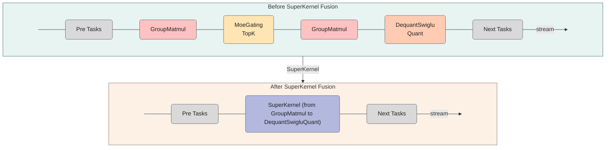
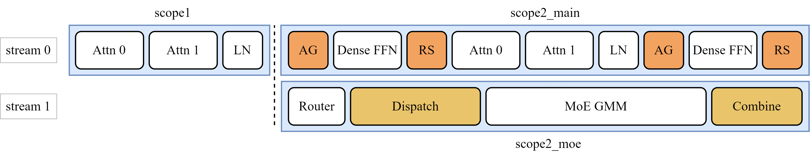

# SuperKernel

## 1. Background

Model performance is commonly improved through operator-level optimizations, including operator fusion, communication-computation overlap, and weight prefetching. Network execution optimizations, such as Continuous Batching and Pipeline Parallelism, are also widely used. Although these techniques can significantly improve model performance, further optimization opportunities remain at the model scheduling level. In graph mode, operator fusion is already available, but its coverage is limited by fusion rules. Operators that remain after fusion must still be scheduled and executed one by one, introducing scheduling overhead and wait time. More comprehensive task scheduling optimization can further reduce wait time during computation and unlock additional model performance.

SuperKernel, as described in this document, is a scheduling optimization technique for model computation graphs. Its core idea is to use prior information about operators in the graph, such as operator types and predecessor-successor dependencies, together with Just-In-Time (JIT) compilation capabilities to overcome the limitations of traditional operator fusion rules. Multiple operators in a model are compiled into a single SuperKernel and scheduled as a whole, significantly reducing inter-operator scheduling overhead.

## 2. Principles

SuperKernel is a binary fusion technology for operators. Unlike source-level fusion, it focuses on optimizing the binary scheduling of kernel functions. It fuses compiled binaries to create a super kernel function, referred to as a SuperKernel, which invokes multiple other kernel functions as subfunctions. This approach optimizes compute tasks and improves performance and resource utilization. Compared with dispatching operators individually, SuperKernel reduces task scheduling wait time and scheduling overhead. It can also use idle resources between tasks to further reduce operator launch overhead. With prior information about all sub-operators available at compile time, SuperKernel can perform deeper optimizations at both the operator and network levels.



### 2.1 Operator-Level Optimizations

#### 2.1.1 ICache Preload Optimization

During SuperKernel execution, the runtime system typically prefetches instructions only for the SuperKernel entry point. As a result, the hardware prefetch mechanism often fails to prefetch the code segments of sub-kernels effectively, lowering the instruction cache (ICache) hit rate and causing ICache misses. The ICache Preload mechanism addresses this issue by prefetching the code segment of the next sub-kernel into ICache with 2 KB alignment before the current sub-kernel completes. This preload strategy hides instruction loading latency behind the execution of the current sub-kernel, thereby reducing ICache misses in subsequent operators.

#### 2.1.2 Early-Start Optimization

Under conventional scheduling, a subsequent operator cannot start until its preceding operator has completed. However, the final instructions of most preceding operators are MTE (Memory Transfer Engine) data movement instructions, while the initial instructions of subsequent operators are typically scalar initialization instructions that do not depend on input data. Because these two types of instructions run on different compute units, they can execute concurrently. Early-Start inserts a Set synchronization point before the data movement instructions of the preceding operator and a Wait synchronization point after the initialization instructions of the subsequent operator. This enables partial instruction-level concurrency between the two sub-operators and improves overall execution efficiency.

#### 2.1.3 Synchronization Optimization

To ensure the correct execution order, SuperKernel inserts full-core synchronization operations between sub-operator dispatches. For mixed operators with a Kernel Type of Mix 1:2 (one Cube core paired with two Vector cores), full-core synchronization must wait until the Vector and Cube cores of all AI Cores reach the synchronization point. SuperKernel identifies the type of each sub-operator at compile time and can therefore customize the synchronization scope based on the Kernel Types of adjacent sub-operators. For example, consecutive Vector operators require only full-vector-core synchronization. Fine-grained control of the synchronization scope effectively reduces synchronization overhead between sub-operators.

#### 2.1.4 Sub-Kernel Replication

In a multi-core system, when multiple compute cores execute the same code segment, they concurrently access the same instruction address in memory. These concurrent accesses to one address form a serialized access queue in the shared L2 Cache, causing resource contention and reducing the performance gains of multi-core parallelism. To address this issue, SuperKernel creates multiple copies of the sub-kernel code so that different cores can map to different physical addresses based on their core IDs. This approach effectively mitigates contention for the same instruction address and significantly improves operator execution efficiency.

### 2.2 Network-Level Optimizations

#### 2.2.1 Tiling Offload and Weight Prefetching

SuperKernel supports memory-semantic `Notify` and `Wait` events for scenarios such as tiling offload and weight prefetching. A tiling-offload operator is one whose tiling calculation depends on the output of a preceding operator. To avoid frequent interactions between the Host and Device, its tiling calculation is offloaded to the AICPU. If a SuperKernel fuses an operator that precedes the tiling-offload operator, it must use a `Notify` event after that preceding operator completes to instruct the AICPU to start the tiling calculation. If the SuperKernel fuses the tiling-offload operator itself, it must use a `Wait` event to wait for the AICPU to complete the tiling calculation before starting Device-side computation.

Weight prefetching uses a Cache Management Operation (CMO) task to invoke the dedicated SDMA hardware unit and load data into L2 Cache in advance, improving compute efficiency. Coordination between SDMA and the AI Core is implemented through memory-semantic `Notify` and `Wait` events.

#### 2.2.2 Dual-Stream Concurrent Fusion

After Cube/Vector concurrency is implemented through multiple Streams, a straightforward conversion into a SuperKernel processes operators only in execution order and ignores dependencies. This causes execution inside the SuperKernel to become serial, yielding smaller performance gains than expected. To address this issue, operators can be classified by type and assigned to separate execution queues inside the SuperKernel according to the characteristics of Cube and Vector operations. Stream attributes and Events are then used to insert synchronization points precisely, enabling efficient concurrent execution of Cube and Vector operations.

> This section is based on [graph-autofusion](https://gitcode.com/cann/graph-autofusion). Refer to the source code and documentation of the corresponding version for the actual implementation and supported capabilities.

## 3. Implementation

The SuperKernel feature is currently enabled through PyTorch graph mode and primarily supports the `npugraph_ex` backend and GE graph mode.

### 3.1 npugraph_ex Backend

With the `npugraph_ex` backend, SuperKernel fusion is configured through the `options` parameter of `torch.compile`. Set `super_kernel_optimize=True` in `options` to enable this capability:

```python
compiled_model = torch.compile(
    model,
    backend="npugraph_ex",
    # Some parameters are omitted.
    options={
        "static_kernel_compile": True,
        "super_kernel_optimize": True,
        # Some parameters are omitted.
    },
)
```

Here, `super_kernel_optimize=True` enables SuperKernel fusion optimization.

To further control the scope of SuperKernel fusion, use the following APIs to mark the fusion scope:

```python
torch.npu.super_kernel_scope_begin(scope_name: str)
torch.npu.super_kernel_scope_end(scope_name: str)
```

Eligible operators within a scope marked by `super_kernel_scope_begin/end` participate in SuperKernel fusion.

For detailed usage, see the [SuperKernel documentation (Chinese)](https://gitcode.com/Ascend/torchair/blob/26.1.0/docs/zh/npugraph_ex/advanced/superkernel.md).

### 3.2 GE Graph Mode Backend

In GE graph mode, use the scope API provided by TorchAir to mark a SuperKernel scope and enable the feature through TorchAir's `CompilerConfig`. For more information, see the [GE Graph Mode Quick Start (Chinese)](https://www.hiascend.com/document/detail/zh/Pytorch/2600/modthirdparty/torchairuseguide/docs/zh/ascend_ir/quick_start.md).

First, analyze the model script to identify the range of operators that can be fused, and then use `torchair.scope.super_kernel` to mark a SuperKernel fusion region. Operators within the `with` block are fused into a single SuperKernel for computation.

The API has the following form:

```python
with torchair.scope.super_kernel(scope: str, options: str = ''):
    ...
```

Parameter descriptions:

- `scope`: Specifies the name of the SuperKernel created by fusing operators in the current context. Identical `scope` values indicate that operators belong to the same fusion scope. The value is specified by the user.
- `options`: Specifies SuperKernel compilation options.

Example:

```python
import torchair

with torchair.scope.super_kernel("super_kernel_0"):
    y = op1(x)
    z = op2(y)
```

In this example, `op1` and `op2` are in the same `super_kernel_0` scope and are fused into a single SuperKernel when they meet the fusion requirements.

If `None` is passed as `scope`, operators within the scope are not fused into a SuperKernel.

For detailed usage, please see the [SuperKernel Scope User Guide (Chinese)](https://www.hiascend.com/document/detail/zh/Pytorch/2600/modthirdparty/torchairuseguide/docs/zh/ascend_ir/features/advanced/super_kernel_scope.md).

## 4. Concrete Model Example

In the [LongCat-Flash model example in this repository](../../../models/longcat_flash), different Streams use different core-partitioning strategies. Accordingly, three SuperKernel scopes are marked across the entire network based on the core-partitioning and stream-assignment boundaries, as shown below.

<div align="center">

</div>

## 5. Constraints

- The compiler checks operators for fusion eligibility in their network execution order. When it encounters an operator that cannot be fused, such as a TBE (Tensor Boost Engine) operator, it forms a SuperKernel from the preceding sequence of eligible operators, skips the ineligible operator, and continues checking subsequent operators to form the next SuperKernel.
- The communication operators currently supported by SuperKernel fusion include AllReduce, ReduceScatter, AllGather, and AlltoAll.
- In `npugraph_ex` graph mode, enabling SuperKernel fusion optimization also requires [static kernel compilation (Chinese)](https://gitcode.com/Ascend/torchair/blob/26.1.0/docs/zh/npugraph_ex/basic/static_kernel_compile.md).
- GE graph mode requires a static graph, and graph breaks are not supported within the `with` block.
- Enabling SuperKernel fusion disables Operator Data Dump.
