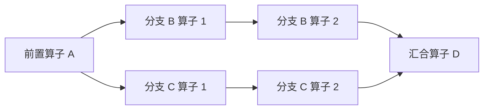
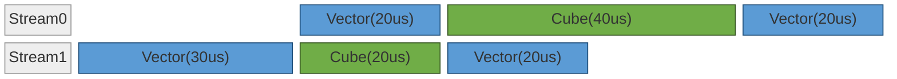
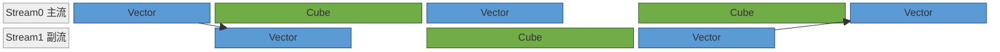
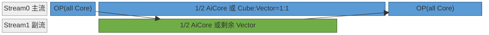
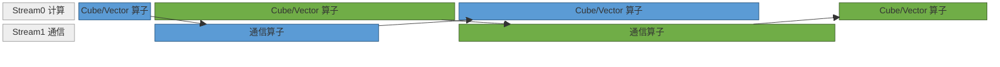
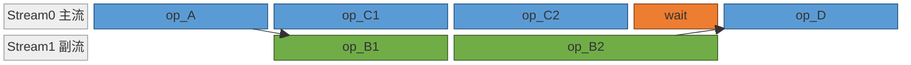
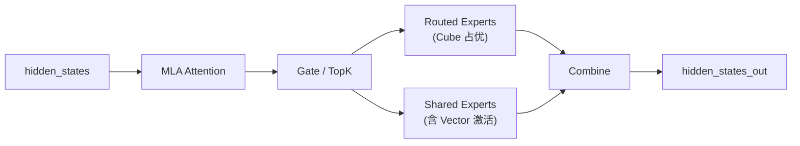
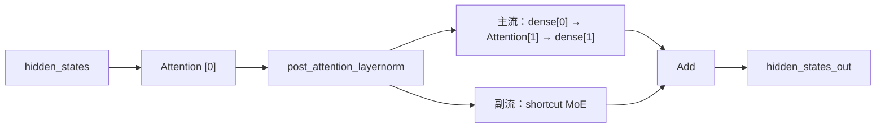

# NPU 多流原理

本文档说明昇腾 NPU 上多流并行的硬件基础、不同执行路径下多流接口的语义、并行成立的判定条件，以及典型整网中多流优化的案例。

## 1. 背景

模型执行的关键路径上常存在硬件资源未被充分使用的情形：Cube 与 Vector 利用率不均衡使一类单元闲置；算子小无法高效利用所有 AICore；HCCL 集合通信与本地计算串行进行，使通信期间计算资源空转。多流优化通过将算子合理分配到多条 Stream，让算子可以在不同 Stream 上进行并行计算，从而提高硬件的使用效率，在不增加算力的前提下缩短关键路径。

要使能多 Stream 并行，需要模型计算图中存在满足并行条件的结构：当多个算子的输入都依赖于同一个前驱算子的输出、彼此之间没有数据依赖时，这些算子在拓扑上即可并发执行。如下图所示，前置算子 A 的输出同时被 B 与 C 两条分支消费；B、C 之间无数据依赖，可分别承载于两条 Stream 并行执行，最终在汇合算子 D 合并。



除了模型中原生结构支持多流并行外，也可以通过对模型计算过程的调整使得模型可以满足这种多流并行的要求，例如将输入数据切分为两 batch 使得可以多出两个并行计算分支（Dual batch overlap）。

本文档介绍以算子粒度充分利用硬件资源进行并发执行的方式，这种并发在框架运行时层面通过多 Stream 编排实现，称为多流优化。下文将从 NPU 硬件和 Stream 机制等原理出发，再介绍如何在模型代码层面实现多流并行，最后给出已落地的多流优化案例。

## 2. 原理

### 2.1 硬件与软件条件

NPU 上 Device 侧拥有多类可以独立调度的物理执行资源，而多 Stream / Event 提供了异步机制可以将这些硬件调度进行并发计算的软件条件。

#### 2.1.1 物理资源单元：

| 单元 | 主要职责 | 跨 Stream 行为 |
| --- | --- | --- |
| Cube | 大矩阵乘类计算 | 多 Stream 竞争，可以进行分核并行，不同 Stream 各能获取一部分核（下文介绍） |
| Vector | 向量、激活、规约类计算 | 同上 |
| HCCL | 集合通信 | 与计算独立的资源，部分优化场景需要用一些 Vector |

* Ascend 上的计算单元主要是 Cube 和 Vector，相关硬件概念参考[文档](https://www.hiascend.com/document/detail/zh/CANNCommunityEdition/900/programug/Ascendcopdevg/atlas_ascendc_10_0008.html)。一般算子不能将全部算力用满，因此给多流并行加速提供了优化空间。算子按算力使用情况可以分为三类：

1. 纯 Cube 算子（如非量化的 Matmul）；
2. 纯 Vector 算子（如 RMSNorm 算子）；
3. 混合算子（Cube 和 Vector 都需要要，如量化的 Matmul 算子，flash attention 系列算子）；


* 集合通信算子一般情况下与计算单元独立，可以与计算单元并行，但部分场景为了优化通信算子信息需要占据部分计算资源：

1. 配置 [HCCL_OP_EXPANSION_MODE](https://www.hiascend.com/document/detail/zh/canncommercial/900/maintenref/envvar/envref_07_0096.html) 为 "AIV"，此时占用部分 AIV 计算资源；
2. [通算融合算子](https://hiascend.com/document/detail/zh/CANNCommunityEdition/910beta1/programug/Ascendcopdevg/docs/guide/算子实践参考/SIMD算子实现/融合算子编程/通算融合/基础知识.md)同时利用了计算单元和通信单元，算子内润存在计算与通信的分片并行，适合数据量较大时；

> 此外 [npu_prefetch](https://www.hiascend.com/document/detail/zh/Pytorch/2600/apiref/torchnpuCustomsapi/docs/zh/custom_APIs/torch_npu/torch_npu-npu_prefetch.md) 也是利用硬件资源（数据搬运）进行并行加速，框架会自动分配一条 Stream 进行任务并行，该特性细节可参考[ prefetch 文档](./prefetch_principles.md)。

#### 2.1.2 Stream

Stream 是 Host 向 Device 下发任务的队列，同一 Stream 上的任务按入队顺序串行执行，Stream 之间的算子执行顺序由同步语句（如 Event，见下文）和调度器决定。Stream 本身承载调度上下文，算力来自下层物理资源单元。通常有两种方式进行划分 Stream：

1. 将如第1章图中的 B/C 分支分别放在两条 Stream 上；
2. 按资源类型划分出两条 Stream，例如一条计算 Stream，一条通信 Stream，将图中的算子按类别分别划分到对应的 Stream，在两条 Stream 间加对应的 Event（见下文）。

#### 2.1.3 Event

Event 是跨 Stream 的同步原语，Stream A 上的 `record_event` 在执行流上标记一个时间点，Stream B 上的 `wait_event` 在该时间点完成后才继续（不同模式下的 Event 的接口不同）。Stream 间的的相互等待最终落到 Event 机制，或则显示的由脚本层面调用 Event，或者隐式的由框架自动插入 Event 同步（根据数据依赖等能推断出来必须要有同步的场景）。Event 同步主要有两种：
1. 当数据流有跨 Stream依赖时，即一个 Stream 的输入数据来自于另外一个 Stream，此时需要通过 Event 确保数据在被使用前已经完成计算；
2. 控制算子的执行顺序，使资源能够被错开利用以最大提高利用率，需要显示的在脚本层面添加 Event；例如如下两种，第二种性能更好，需要通过 Event 控制顺序：

方案一：不使用 Event 控制，可能 Stream1 先被调度执行，耗时 110us。



方案二：使用 Event 控制顺序，关键路径更短，耗时 100us。


### 2.2 并行的典型形态

#### 2.2.1 Cube 与 Vector 互补

在[分离模式](https://www.hiascend.com/document/detail/zh/CANNCommunityEdition/900/programug/Ascendcopdevg/atlas_ascendc_10_0008.html#ZH-CN_TOPIC_0000002531522198__section1574769433)的平台上，Cube 和 Vector 可以独立调度，将 Cube 算子与 Vector 算子交替编排在两条 Stream 上形成互补，一般两条 Stream 有相同的前置数据依赖，其中一个分支沿用之前的 Stream，即“主流”，另一个分支在另一条 Stream，即“副流”，后续副流的数据会回到主流上。一般情况下 Cube 和 Vector 的总耗时是不对等的，总体上 Cube 居多，因此 Cube 类算子是关键路径，如下图所示，在并行阶段，Cube 单元作为瓶颈最理想的情况下利用率接近 100%，将其他并行单元的时间掩盖。



#### 2.2.2 同类计算池分核

在很多场景中，算子对计算资源的利用效率不是很高，例如某个算子使用所有核计算时间为 $T$，使用 1/2 核的计算时间为 $\frac{3}{2} T$，那么两个相近的 Matmul 的计算时间从串行的 $2T$ 优化到各占一半核并行的 $\frac{3}{2} T$，优化了 25%。其主要原理是数据量比较小时，计算资源和带宽利用率不高，且算子启动开销占比较高，使用更多的核加速效果不明显（但不是不能加速，因此当没有可以并行分支时，最优策略任然可能是利用更多的核进行计算），引入并行的 Stream 可以提高资源利用率。
此外如量化场景有很多 Matmul 是混合算子，当其中的 Vector 利用率很低时，可以划分出来一部分给并行 Stream 的 Vector 类算子使用（需支持[分离模式](https://www.hiascend.com/document/detail/zh/CANNCommunityEdition/900/programug/Ascendcopdevg/atlas_ascendc_10_0008.html#ZH-CN_TOPIC_0000002531522198__section1574769433)）。例如 Atlas A2/A3 平台，AiCore 中 Cube:Vector=1:2，可以划分出 Cube:Vector=1:1 的 Cube/Vector 混合计算 Stream，和另一条 Vector Stream。



实际收益需要根据模型情况进行测试和调整：
* 分核并行的方式能一定程度上提升算力的利用率，但在实际场景中也会有部分性能损失，如上图所示，分核后两条并行的 Stream 耗时不相同，而后续计算依赖两条 Stream 的结果，因此分给对应的 Stream 的核处于闲置状态，会抵消掉部分性能收益，严重情况下可能会导致没有收益甚至性能劣化；
* 根据实际优化的模型结构，可以调整两条 Stream 的分配比例，以让两条 Stream 的执行时间基本接近。一般这种分核方式是在 Decode 上（数据量少，算子小，满足分核收益的条件），多采用图模式，因此分核在第一次图执行时确定，后续不会变，但两条流的执行时间可能会变化，例如 attention 耗时会因 kv cache 长度变化、moe 耗时会因路由专家负载情况变化，因此调整分核并不一定能完全消除上述 Stream 耗时不一致导致的资源闲置的问题，需要根据实测情况分析是否要采用这种优化。

#### 2.2.3 计算与通信互补

通信单元与计算单元独立，将通信算子切至独立 Stream，使其与主 Stream 上的计算并发执行。



默认情况下通信不占用通信资源，但有两种情况下通信算子会占用 Vector（见上文 `HCCL_OP_EXPANSION_MODE` 与通算融合算子），此时按大部分算子默认占用所有 AiCore 的情况，会导致两条 Stream 无法并行，可以按上一节所示的分核，给通信 Stream 分配部分 Vector 核，而计算 Stream 需要减去对应数量的 Vector 核。
通常模型里的计算与通信算子之间有数据依赖，因此只能串行，但可以按 DBO(Dual Batch Overlap) 的方式拆分出两个并行分支，这两个分支中的通信和计算没有数据依赖，可以并行执行。如下所示，将 Moe 模块拆分出两个 micro-batch 的前后通信部分与另一个 batch 的计算部分并行执行。

```mermaid
block-beta
  columns 13
  s0["Stream0 主流"]:1 a1["mb0 attn (0–2)"]:2 a2["mb1 attn (2–4)"]:2 space:1 a3["mb0 expert (5–8)"]:3 a4["mb1 expert (8–11)"]:3 space:1
  s1["Stream1 副流"]:1 space:2 b1["mb0 dispatch (2–5)"]:3 b2["mb1 dispatch (5–8)"]:3 b3["mb0 combine (8–9)"]:1 space:2 b4["mb1 combine (11–12)"]:1

  classDef hdr fill:#eee,stroke:#999,color:#000
  classDef main fill:#5B9BD5,color:#fff,stroke:#1F4E79
  classDef parr fill:#70AD47,color:#fff,stroke:#385723
  classDef sync fill:#ED7D31,color:#fff,stroke:#7C390F

  class s0,s1 hdr
  class a1,a3,b1,b3 main
  class a2,a4,b2,b4 parr
  class a5 sync
```



DBO 的性能收益主要来自通信和计算的并行，充分利用了硬件资源，但拆分也会引入开销：对深度神经网络加速芯片，单个算子处理的数据量越大，其相关的硬件使用效率越高，带宽效率、指令效率都比较高，调度、启动开销占比比较小，反之一份数据拆分成多份计算时间一般是负面的，这部分如果将并行的性能收益抵消了，整体没有收益甚至可能会劣化。例如 Decode 一般是访存瓶颈（weight 加载），DBO 切分的两 batch 加载的 weight 都是全量的，从而导致两份 batch 的计算时间近乎翻倍，因此 DBO 一般主要用在 Prefill 优化上。

## 3. 实现方式

在 torch 实现的模型代码中，模型有多种执行方式，如 eager 模式、图模式，在 NPU 上图模式按编译优化后端分为 ge_graph 和 npugraph_ex 两种模式，参考[文档](docs/cann/npu_graph_optimization.md)。三种模式的多流和 Event 同步对应的接口不一样，不能混用，例如在 ge_graph 模式调用 `record_event` / `wait_event` 会因外部对象语义无法接入图内而导致同步失效或编译失败。本章按实现方式分别列出各自的流切换、同步、生命周期等。

三种模式通过 `exe_mode` 配置（取值 `eager` / `ge_graph` / `npugraph_ex`）。

下文以第 1 章中 A → (B 分支, C 分支) → D 的 DAG 为统一例子。主流执行 A → C1 → C2，副流并行执行 B1 → B2；`op_D` 启动前需要等待两条流的结果汇合。三种实现方式的代码不同，但执行时序的语义一致：



图中 `wait` 块在 eager / npugraph_ex 下表现为代码中的 `wait_event` 调用，在主流上等待副流的执行结束，在 ge_graph 下由编译器从 `out_B2` 的数据依赖自动插入。

### 3.1 eager

eager 模式下 Stream 是模型脚本层面主动创建和切换。

```python
import torch

# 副流创建（主流为默认 current_stream）
side_stream = torch.npu.Stream()
main_stream = torch.npu.current_stream()

# 主流：前置算子 A
out_A = op_A(x)

# 副流：等主流的 A 完成后执行 B 分支
side_stream.wait_stream(main_stream)
with torch.npu.stream(side_stream):
    out_B1 = op_B1(out_A)
    out_B2 = op_B2(out_B1)
out_B2.record_stream(main_stream)  # out_B2 将被主流消费，告知 allocator 延长其生命周期
event_B = side_stream.record_event()

# 主流并行执行 C 分支
out_C1 = op_C1(out_A)
out_C2 = op_C2(out_C1)

# 主流等副流的 B 完成后汇合
main_stream.wait_event(event_B)
out_D = op_D(out_B2, out_C2)
```

接口说明：
- `torch.npu.Stream()` 创建副流对象；`torch.npu.current_stream()` 获取当前主流。
- `with torch.npu.stream(side_stream):` 上下文管理器，上下文内 launch 的 kernel 绑定 Stream `side_stream`。
- `side_stream.wait_stream(main_stream)`：副流入口等待主流当前已下发的全部任务（这里即 op_A）完成。粗粒度汇合，适合"等到这一点之前的所有工作完成"的场景。
- `record_event` / `wait_event`：跨流时间点同步。副流在 B 完成处标记 `event_B`，主流在 D 启动前等待该 event。
- `tensor.record_stream(stream)`：caching allocator 默认按 tensor 的创建 Stream 追踪释放时机。跨流消费的短生命周期 tensor 需通过 `record_stream` 将其内存生命周期延长至目标 Stream，allocator 才会等目标 Stream 完成消费再考虑复用其内存。代码中 `out_B2` 在副流创建、被主流 `op_D` 消费，需调用 `out_B2.record_stream(main_stream)`。

### 3.2 ge_graph

ge_graph 模式下多流表达进入图内，由 GE 编译器在图编译期分配到逻辑 Stream，运行期按图调度。

```python
import torch
import torchair as tng
from torchair import CompilerConfig, get_npu_backend

class Model(torch.nn.Module):
    def forward(self, x):
        out_A = op_A(x)

        # B 分支放到 tag "1" 副流，并限制其使用的核数
        with tng.scope.npu_stream_switch("1"):
            with tng.scope.limit_core_num(12, 24):
                out_B1 = op_B1(out_A)
                out_B2 = op_B2(out_B1)

        # C 分支留在主流，同样限制核数（与副流形成分核配对）
        with tng.scope.limit_core_num(12, 24):
            out_C1 = op_C1(out_A)
            tng.scope.npu_wait_tensor(out_C1, out_B2)
            out_C2 = op_C2(out_C1)

        # out_B2 来自副流，op_D 的跨流数据依赖由编译器自动插入同步
        out_D = op_D(out_B2, out_C2)
        return out_D

# 编译入图
config = CompilerConfig()
model = Model()
model = torch.compile(model, backend=get_npu_backend(compiler_config=config))
```

接口说明：

- `tng.scope.npu_stream_switch("tag")`：图内 scope，scope 内算子在编译期分配到 tag 对应的逻辑 Stream。tag 在全局范围内唯一标识一条 Stream，跨模块复用同 tag 会采用相同 Stream。
- `tng.scope.npu_wait_tensor(anchor, wait_tensor)`：在当前 scope 内插入跨流等待，用于两条流之间需要精确控制流排序的场景。
- `tng.scope.limit_core_num(aic, aiv)`：限制 scope 内算子使用的 AIC / AIV 核数。编译器在 IR 节点生成时按 scope 内的限制配置该 scope 算子的可用核数，控核精确到单个并行段。两条并行 Stream 通常都要限核（如上例 B 与 C 分支各分到 12+24 核），一般并行分支所有核数加起来等于总核数，超过到导致无法并行甚至资源互锁卡死。
- 生命周期：内存生命周期在图编译期依据数据依赖关系已分析完整，跨流依赖以图边形式显式表达。

### 3.3 npugraph_ex

npugraph_ex 模式下 Stream 的创建与切换采用创建 Stream 和 Event 的方式进行，跨流有数据依赖时需要显示用 Event 进行同步等待。

```python
import torch

class Model(torch.nn.Module):
    def __init__(self):
        super().__init__()
        # Stream 与 Event 在 __init__ 创建，capture / replay 阶段保持对象引用稳定
        self.side_stream = torch.npu.Stream()
        self.events = [torch.npu.Event(), torch.npu.Event()]

    def forward(self, x):
        out_A = op_A(x)

        # 主流标记 out_A 将被副流消费，告知 allocator 延长其生命周期
        out_A.record_stream(self.side_stream)
        self.events[0].record()  # 主流标记事件 0

        # B 分支放到副流
        with torch.npu.stream(self.side_stream):
            self.events[0].wait()  # 副流等主流的事件 0
            out_B1 = op_B1(out_A)
            out_B2 = op_B2(out_B1)
            self.events[1].record()  # 副流标记事件 1

        # C 分支并行执行
        out_C1 = op_C1(out_A)
        out_C2 = op_C2(out_C1)

        # 主流标记 out_B2 将被自身消费，并等副流的事件 1
        out_B2.record_stream(torch.npu.current_stream())
        self.events[1].wait()
        out_D = op_D(out_B2, out_C2)
        return out_D

# 包装入图
model = Model()
model = torch.compile(model, backend="npugraph_ex")
```

接口说明：

- 流切换沿用 eager 的 `with torch.npu.stream(s):` 上下文。
- Event 同步通过 `event.record()` / `event.wait()` 显式调用。
- `tensor.record_stream(stream)`：跨流消费的 tensor 在进入消费流之前调用 `record_stream`，告知 allocator 延长该 tensor 的生命周期至 `stream` 也使用完毕。本例中 `out_A`（主流产出、被副流消费）和 `out_B2`（副流产出、被主流消费）都需调用。


## 4. 具体网络样例

### 4.1 DeepSeek-R1：Micro-batch 流水 + Cube↔Vector 互补

DeepSeek-R1 的两种多流优化：prefill 阶段采用 Micro-batch 流水，decode 阶段把共享专家切至副流与路由专家并行执行。

#### 4.1.1 关键结构

MoE 层内部存在两条数据无依赖的分支（路由专家与共享专家）：



Routed 与 Shared 之间没有数据依赖，对应 §2.2.1 Cube↔Vector 互补的并行方式。

#### 4.1.2 Decode 阶段：共享专家、路由专家并行

共享专家分为 `gate_up_proj` → `swiglu` → `down_proj` 三段，与主流的 `dispatch` → `routed GMM` → `combine` 三段在副流上**逐段错开**排进。每段并行对的资源类型互补：

```mermaid
block-beta
  columns 13
  s0["Stream0 主流"]:1 gate["gate"]:1 disp["dispatch"]:2 gmm["routed GMM"]:6 comb["combine"]:2 add["add"]:1
  s1["Stream1 副流"]:1 space:1 gup["gate_up_proj"]:2 swi["swiglu"]:2 space:4 dp["down_proj"]:2 space:1

  gate --> gup
  disp --> swi
  gmm --> dp
  comb --> add
  dp --> add

  classDef hdr fill:#eee,stroke:#999,color:#000
  classDef vector fill:#5B9BD5,color:#fff,stroke:#1F4E79
  classDef cube fill:#70AD47,color:#fff,stroke:#385723
  classDef comm fill:#ED7D31,color:#fff,stroke:#7C390F

  class s0,s1 hdr
  class gate,swi,add vector
  class gmm,gup,dp cube
  class disp,comb comm
```



颜色按资源类型：蓝 = Vector、绿 = Cube、橙 = HCCL 通信。三段并行对各自的资源互补关系：

| 时间段 | 主流（资源） | 副流（资源） | 互补关系 |
| --- | --- | --- | --- |
| dispatch ‖ gate_up_proj | HCCL 通信 + Vector | Cube | 通信 ↔ 计算 |
| routed GMM 头部 ‖ swiglu | Cube | Vector | Cube ↔ Vector |
| combine ‖ down_proj | HCCL 通信 + Vector | Cube | 通信 ↔ 计算 |

#### 4.1.3 Prefill 阶段：Micro-batch 流水

prefill 阶段把输入拆为两个 micro-batch（mb0、mb1）。主流为计算流（attn / ln+gate / shared expert / expert / finalize_routing），副流为 HCCL 通信（dispatch / combine）。两条流通过多组 Event 实现 mb0 与 mb1 的计算-通信跨流等待。

每层 MoE 一个 mb0/mb1 周期的执行时序：


颜色按 micro-batch 分：蓝 = mb0、绿 = mb1。`L0`/`L1` 是 post_attention_layernorm + gate_init_routing，`S0`/`S1` 是 shared expert，`fin` 是 finalize_routing。

跨层覆盖：上一层的 mb1 combine 在下一层入口触发 mb1 finalize_routing，与下一层 mb0 attn 并行，使 mb1 combine 也被掩盖。


### 4.2 LongCat-Flash：同类计算池分核 + 跨节点通信 overlap

LongCat-Flash 每层包含两段：第一段是单条 attention，第二段把 **dense → 第二个 attention → dense** 与 **shortcut MoE** 拆成两条并行路径。两条并行路径均 Cube 占优，需 `limit_core_num` 切分核数（§2.2.2 同类计算池分核）。AFD 部署下副流的 shortcut MoE 换为跨节点 Send/Recv（§2.2.5 跨节点通信 overlap）。

#### 4.2.1 关键结构

每层的并行结构：



第一段 attention 完成后，主流的 `dense[0] → attn[1] → dense[1]` 与副流的 shortcut MoE 之间无数据依赖，构成 §2.2.2 同类计算池分核的典型场景。

#### 4.2.2 多流编排

两条 Cube 占优路径并行执行，各自通过 `limit_core_num` 锁定独立的 AIC / AIV 配额。主流由 `attn[1]` 嵌在两个 dense 之间，整体时长接近副流的 shortcut MoE，两条流大致同步完成后在 `Add` 处汇合：


