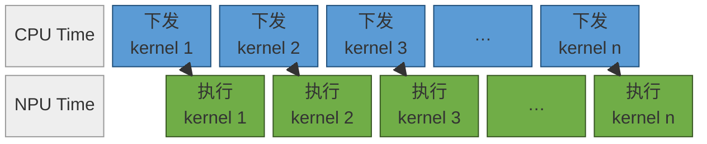
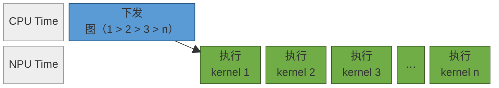
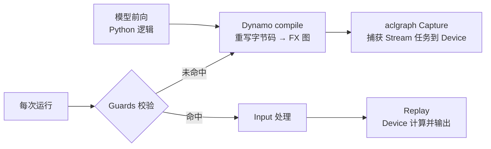
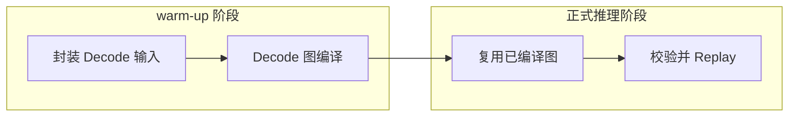

# NPU 图模式优化原理

本文档说明昇腾 NPU 上图模式优化的背景、基本原理、GE 图模式与 npugraph_ex 图模式的关系，以及在 cann-recipes-infer 框架中的使能方式和常见调试方法。

## 1. 背景

PyTorch 默认使用 `eager` 模式执行模型，可以理解为“边解释边执行”：如下图所示，模型前向执行到某个位置时，框架才把当前位置对应的算子逐个下发到 Device。该模式开发和调试都比较直接，但在大模型推理场景中，尤其是 Decode 阶段，单次输入 token 数少、算子粒度小，Host 侧逐算子下发和运行时调度开销容易暴露出来，最终形成 host bound。



<div align="center">图 1　eager 模式：Host 与 Device 交替下发和执行算子</div>

图模式优化的目标是将模型前向逻辑提前捕获为计算图，再交给 NPU 后端统一编译和执行。后端获得更完整的计算图之后，可以在更大范围内进行算子融合、内存复用、调度优化和下沉执行，图模式下 Host 只需一次性下发整张图（图内已固定 1 > 2 > 3 > n 的执行顺序），Device 即可连续执行各算子，从而减少 Host 侧下发开销，缩短端到端时延。


<div align="center">图 2　图模式：Host 一次性下发整图，Device 连续执行</div>

对 LLM 推理来说，`prefill` 和 `decode` 对图模式的适配价值并不相同：

| 阶段 | 输入特征 | 图模式适配建议 | 原因 |
| --- | --- | --- | --- |
| `prefill` | 序列长度动态变化，单次计算量较大 | 通常保持 eager | shape 与控制流更容易变化，且算子执行时间较长，Host 下发开销占比相对较低 |
| `decode` | 单 token 或固定小长度输入 | 推荐使用图模式 | shape 更稳定，算子更小，更容易复用已编译图并降低下发开销 |

因此，在 cann-recipes-infer 当前执行框架中，图模式主要用于 Decode 阶段；Prefill 阶段默认仍走 eager 路径。

除了普通图编译外，图模式还经常与编译缓存一起使用。编译缓存也称为 `cache compile`，用于保存第一次图编译的结果。当模型结构、输入 shape、dtype、缓存目录和图模式配置保持一致时，后续启动或重复运行可以直接复用缓存，减少首次编译带来的启动开销。

## 2. 原理

### 2.1 图模式的基本原理

图模式的核心是“捕获一次、多次回放”：第一次运行时把模型前向捕获并编译成一张可复用的图，后续运行在满足复用条件时直接回放，从而省去逐算子下发和重复编译的开销。下面以 `npugraph_ex` 为例，说明这一过程涉及的几个关键环节。

1. Dynamo compile：一个 Python 级的 Just-In-Time（JIT）编译器。它在运行时重写 Python 字节码，把模型前向中的 PyTorch 操作序列提取到一张 FX 图中，再交给可定制的后端（此处为 `npugraph_ex`）进行编译。
2. Guards：Dynamo 编译时会生成一组 Guards（对输入 shape、dtype、部分标量等的假设），并在每次执行前先执行 Guards 校验，用于区分当前程序是否需要被重新捕获与编译——Guards 全部命中则复用已有图，否则触发重新捕获与编译。
3. aclgraph Capture：`npugraph_ex` 将 Stream 上的任务捕获到 Device 侧，把一段稳定的 NPU 执行过程（kernel 序列与内存布局）固化为可低开销回放的执行序列。
4. Input 处理：回放前，将图内 input 类参数的输入地址更新为图实际运行时的输入地址。若输入 Tensor 的格式为私有格式（如 `FRACTAL_NZ`），其私有格式信息会被保留。
5. Replay：Device 基于给定的输入执行已捕获的图，进行真正的计算并得到输出结果。



<div align="center">图 3　npugraph_ex 捕获与复用流程</div>

在 cann-recipes-infer 中，上述捕获与编译发生在 warm-up 阶段：warm-up 会先跑一遍 Decode 以触发 Dynamo compile 和 aclgraph Capture，把图编译好并缓存下来；后续正式推理时不再重新编译，而是直接复用 warm-up 阶段编好的图，仅走 Guards 校验、Input 处理和 Replay 环节，因此图编译开销不落在正式推理的关键路径上。

因此，图模式收益的前提是 Guards 稳定命中。Decode 阶段 shape 稳定、算子固定，天然适合复用同一张图；这也解释了为什么图模式主要用于 Decode，并要求模型侧保持输入 shape 和常驻 buffer 地址稳定（详见 [§3.2 模型代码需要满足的条件](#32-模型代码需要满足的条件)）。

#### 2.1.1 编译缓存的原理

上述捕获与编译默认只在进程内生效：warm-up 阶段编好的图缓存在内存中，进程退出后即失效，下次启动仍需重新执行 Dynamo compile 与 aclgraph Capture。编译缓存（compile cache）在此基础上进一步把编译结果持久化到磁盘，使其可以跨进程、跨启动复用，原理可参考 [npugraph_ex 编译缓存](https://www.hiascend.com/document/detail/zh/Pytorch/2600/modthirdparty/torchairuseguide/docs/zh/npugraph_ex/advanced/compile_cache.md)。

其核心思路是把一次完整编译的产物落盘保存：

1. 首次编译：`cache_compile` 完成 Dynamo compile、图优化和 aclgraph Capture 后，把编译产物（图结构、kernel 序列、内存布局等）序列化写入 `cache_dir`。
2. 缓存命中：后续启动时，`cache_compile` 在 `cache_dir` 中查找匹配项。命中则直接从磁盘加载已编译的图，跳过 Dynamo compile 与 Capture，直接进入 Guards 校验、Input 处理和 Replay。
3. 缓存失效：若模型代码、输入 shape / dtype、编译配置或 `cache_dir` 中任意一项发生变化，缓存视为未命中，回退到首次编译流程并重新落盘。

编译缓存与 §2.1 的图复用是两个层次的复用：图复用解决的是“同一进程内多次 Decode 复用同一张图”，编译缓存解决的是“跨进程 / 跨启动复用编译产物”，避免每次启动都重新承担图编译开销。

### 2.2 图模式解决的问题

图模式主要解决两类问题：Host 调度开销和后端全局优化空间不足。

在 eager 模式下，Host 需要按 Python 前向逻辑逐步调度算子（见[§1 背景](#1-背景)图 1）。对 Decode 阶段的小算子来说，Device 上真实计算耗时可能并不长，Host 下发、同步和调度开销就会占据较大比例。图模式将前向过程转换为一张可复用计算图，使运行时可以按图整体调度（见[§1 背景](#1-背景)图 2），Host 只需一次性下发整图，Device 即可连续执行，减少逐算子进入 Python 和框架运行时的开销。

另一方面，eager 模式下后端每次看到的通常是局部算子，能够做的优化范围有限。图模式下，后端可以基于完整图结构分析数据依赖、生命周期和执行顺序，从而进行算子融合、常量折叠、内存复用、通信入图、多流调度等优化。

### 2.3 NPU 图模式的两类实现

NPU 图模式在本仓中主要有两类实现路径：`ge_graph` 和 `npugraph_ex`。两者都基于 TorchAir，完整能力和接口说明可参考 [TorchAir 文档总览](https://www.hiascend.com/document/detail/zh/Pytorch/2600/modthirdparty/torchairuseguide/docs/zh/overview.md)。

#### 2.3.1 GE 图模式

GE 图模式会将 `torch.compile` 捕获到的 FX 图转换为 Ascend IR，再由 GE 引擎进行编译和执行。该路径更强调图编译期优化，适合将计算、通信、多流、限核等信息表达进图内，由编译器统一分析和调度，具体细节可参考 [GE / Ascend IR 图模式](https://www.hiascend.com/document/detail/zh/Pytorch/2600/modthirdparty/torchairuseguide/docs/zh/ascend_ir/features) 各文档 。

GE 图模式的典型特征包括：

1. 图内表达能力更强，适合承载 TorchAir scope、通信入图、图内多流等能力。
2. 编译配置主要通过 `CompilerConfig.experimental_config` 承载。
3. 普通编译后端使用 `torchair.get_npu_backend(...)`。
4. 缓存编译使用 `torchair.inference.cache_compile(...)`。

#### 2.3.2 npugraph_ex 图模式

npugraph_ex 基于 npugraph capture & replay，核心思路是捕获一段稳定的 NPU 执行过程，并在后续 Decode 中低开销 replay，具体细节可参考 [npugraph_ex 后端](https://www.hiascend.com/document/detail/zh/Pytorch/2600/modthirdparty/torchairuseguide/docs/zh/npugraph_ex/basic/force_eager.md) 各文档。它的使用体验更接近 eager，模型代码中的 Stream / Event 等对象也更接近运行时显式对象。

npugraph_ex 的典型特征包括：

1. 适配路径相对轻量，便于从 eager 代码逐步迁移。
2. 编译配置主要通过 `options` kwargs 传入。
3. 普通编译后端使用 `backend="npugraph_ex"`。
4. 缓存编译使用 `torch.npu.npugraph_ex.inference.cache_compile(...)`。

>注意：仓内部分早期模型代码和文档仍会出现 `acl_graph` 命名。实际阅读时，通常可以将它理解为早期图模式路径，与当前 `npugraph_ex` 方向关系更近。新接入模型时，应优先使用执行框架中的 `ge_graph` / `npugraph_ex` 配置；历史 `acl_graph` 命名后续会逐步收敛和清理。

### 2.4 两种图模式的选择

两种模式没有绝对的优劣，选择时需要结合模型适配成本、功能稳定性和性能目标。

| 对比项 | `ge_graph` | `npugraph_ex` |
| --- | --- | --- |
| 适配目标 | 更完整的图编译和后端优化 | 更接近 eager 的 capture / replay |
| 配置承载 | `CompilerConfig.experimental_config` | `options` kwargs |
| 编译后端 | `torchair.get_npu_backend(...)` | `backend="npugraph_ex"` |
| 缓存编译接口 | `torchair.inference.cache_compile(...)` | `torch.npu.npugraph_ex.inference.cache_compile(...)` |
| 常见 `dynamic` 配置 | `False` | `True` |
| 典型增强能力 | [frozen_parameter](https://www.hiascend.com/document/detail/zh/Pytorch/2600/modthirdparty/torchairuseguide/docs/zh/ascend_ir/features/advanced/frozen_parameter.md)、[tiling_schedule_optimize](https://www.hiascend.com/document/detail/zh/Pytorch/2600/modthirdparty/torchairuseguide/docs/zh/ascend_ir/features/advanced/tiling_schedule_optimize.md)、[topology_sorting_strategy](https://www.hiascend.com/document/detail/zh/Pytorch/2600/modthirdparty/torchairuseguide/docs/zh/ascend_ir/features/advanced/topology_sorting_strategy.md) | [static_kernel_compile](https://www.hiascend.com/document/detail/zh/Pytorch/2600/modthirdparty/torchairuseguide/docs/zh/npugraph_ex/basic/static_kernel_compile.md)、[frozen_parameter](https://www.hiascend.com/document/detail/zh/Pytorch/2600/modthirdparty/torchairuseguide/docs/zh/npugraph_ex/basic/frozen_parameter.md) |

当前建议是：优先选择 `npugraph_ex`，可以降低适配成本、保留更接近 eager 的开发体验。

需要注意的是，`npugraph_ex` 当前常保持 `dynamic=True`，并不是因为图本身必须动态，而是与当前推理场景中部分 FIA 算子接口有关。例如部分 `actual_seq_lengths` 入参仍常以 `list[int]` 形式传入，如果强行静态化，容易触发重编译。后续算子接口补齐 Tensor 输入后，这类配置可以继续收敛。

## 3. 实现方式

图模式的接入可以拆成两步：先用 `torch.compile` 配合对应后端，把模型前向（通常是 Decode 前向）编译成可复用的图；再让模型代码满足图捕获和图复用的约束。本章先说明两种模式的编译接口与缓存编译接口，再说明模型代码需要满足的条件与 FIA 算子适配。

### 3.1 编译接口

接口实现细节可对照 [框架图编译](../../executor/utils/graph_utils.py)，图编译前通常都需要一段通用准备：

```python
import torchair as tng
import torchair.ge_concrete_graph.ge_converter.experimental.patch_for_hcom_allreduce

tng.patch_for_hcom()
torch._dynamo.config.inline_inbuilt_nn_modules = False
```

- `tng.patch_for_hcom()`：处理集合通信入图；在 PyTorch 2.6 及之后版本中通常可以省略。
- `inline_inbuilt_nn_modules = False`：避免内建模块被过度内联，降低部分图编译场景下的不确定性。

两种模式都通过 `torch.compile` 使能，区别主要在 `backend` 与配置承载方式。编译得到的 `model_compiled` 与原始 `model` 的调用方式一致，用相同的关键字入参调用即可触发图执行 / replay。


#### 3.1.1 ge_graph

`ge_graph` 使用 TorchAir 提供的 NPU 后端，可参考 [GE 图模式快速上手](https://gitcode.com/Ascend/torchair/tree/master/docs/zh/ascend_ir/quick_start.md)，编译配置通过 `CompilerConfig` 承载：

```python
import torchair as tng
from torchair import CompilerConfig

compile_config = CompilerConfig()
# 按需在 config.experimental_config 上开启图内优化
model_compiled = torch.compile(
    model,
    backend=tng.get_npu_backend(compiler_config=compile_config),
    dynamic=False,
    fullgraph=True,
)
```

接口说明：

- `tng.get_npu_backend(compiler_config=config)`：返回 GE 图模式的编译后端，作为 `torch.compile` 的 `backend`。
- `CompilerConfig`：GE 图模式的配置入口，`frozen_parameter`、`tiling_schedule_optimize`、`topology_sorting_strategy` 等图内优化通过 `config.experimental_config` 开启。
- `dynamic=False`：Decode 阶段 shape 稳定，固定为静态可减少重编译。

开启缓存编译后，`torch.compile` 替换为 `torchair.inference.cache_compile`，首次运行时把编译结果落盘到 `cache_dir`，后续命中缓存即可跳过重新编译，具体细节与参数可参考 [ge_graph 编译缓存说明](https://www.hiascend.com/document/detail/zh/Pytorch/2600/modthirdparty/torchairuseguide/docs/zh/ascend_ir/features/advanced/compile_cache.md)：

```python
import torchair as tng

model_compiled = tng.inference.cache_compile(
    model_forward,
    cache_dir=cache_dir,     # 编译缓存落盘目录，需固定且可写
    config=compiler_config,  # 与普通编译一致的 CompilerConfig
    dynamic=False,
    fullgraph=True,
    ge_cache=True,           # 同时复用 GE 编译缓存
)
```

#### 3.1.2 npugraph_ex

`npugraph_ex` 直接以字符串指定后端，可参考 [npugraph_ex 快速上手](https://gitcode.com/Ascend/torchair/tree/master/docs/zh/npugraph_ex/quick_start.md)，配置通过 `options` kwargs 传入：

```python
options = {
    # 例如 static_kernel_compile / frozen_parameter 等增强开关
}
model_compiled = torch.compile(
    model,
    backend="npugraph_ex",
    dynamic=enable_dynamic_graph,
    fullgraph=True,
    options=options,
)
```

接口说明：

- `backend="npugraph_ex"`：选择 npugraph capture & replay 后端。
- `options`：npugraph_ex 的配置承载方式，`static_kernel_compile`、`frozen_parameter` 等增强能力通过它传入。
- `dynamic=enable_dynamic_graph`：`enable_dynamic_graph` 是可控参数，需结合模型的输入形态选择。当前推理场景中，若部分 FIA 接口仍以 `list[int]` 形式传入 `actual_seq_lengths`，应保持 `enable_dynamic_graph=True`，避免强行静态化触发重编译；若模型不存在这类 `list` 输入（例如 deepseek_v4），则建议选择静态图，即 `enable_dynamic_graph=False`，以获得更稳定的图复用和更低的下发开销。

开启缓存编译后，`torch.compile` 替换为 `torch.npu.npugraph_ex.inference.cache_compile`，首次运行时把编译结果落盘到 `cache_dir`，后续命中缓存即可跳过重新编译，具体细节与参数可参考 [npugraph_ex 编译缓存说明](https://www.hiascend.com/document/detail/zh/Pytorch/2600/modthirdparty/torchairuseguide/docs/zh/npugraph_ex/advanced/compile_cache.md)：

```python
model_compiled = torch.npu.npugraph_ex.inference.cache_compile(
    model_forward,
    cache_dir=cache_dir,           # 编译缓存落盘目录，需固定且可写
    dynamic=enable_dynamic_graph,  # 与普通编译一致
    options=compile_options,       # 与普通编译一致的后端 options
)
```

> 无论哪种模式，缓存是否命中都取决于模型代码、输入规格（shape / dtype）、编译配置和 `cache_dir` 是否保持一致；任意一项发生变化都会导致缓存失效并重新编译。因此使用缓存编译时应固定缓存目录，并保持模型代码、shape、dtype 和编译配置稳定。

### 3.2 模型代码需要满足的条件

仅完成上述编译接入不足以保证图模式可用。模型前向本身需要满足图捕获和图复用的约束。

#### 3.2.1 eager 路径先稳定

图模式不会修复 eager 下本来就存在的功能或精度问题。接入图模式前，应先确保模型在 eager 下可以稳定完成 Prefill 和多轮 Decode，并且输出精度符合预期。

#### 3.2.2 Prefill 与 Decode 明确区分

推荐将 Prefill 和 Decode 的执行路径明确区分：

1. Prefill 保持 eager。
2. Decode 使用图模式。
3. 使用 `forward_metadata.is_prefill` 或独立的 `prefill()` / `decode()` 方法区分两条路径。

这样可以避免 Prefill 的动态 shape 和控制流影响 Decode 图的稳定性。

#### 3.2.3 动态信息显式传入

典型动态信息包括 `kv_len`、`position_ids`、`actual_seq_lengths_q`、`actual_seq_lengths_kv` 和 `is_prefill`。这些信息应由框架构造后作为显式输入传给模型，而不是在模型内部临时生成 Python 标量，或依赖隐式全局状态推导。

#### 3.2.4 KV Cache 与常驻 buffer 原地更新

Decode 图复用要求关键输入的 shape 和地址尽量稳定。因此 KV Cache、attention mask、position buffer 等常驻数据应预分配，并在运行时原地更新。

不推荐写法：

```python
key = torch.cat([past_key, new_key], dim=1)
```

推荐写法：

```python
torch_npu.scatter_update_(k_cache, kv_len, key_states, -2)
torch_npu.scatter_update_(v_cache, kv_len, value_states, -2)
```

目标是避免 Decode 过程中 KV Cache 的 shape 或地址发生变化，从而减少 dynamo guard 失败和重编译。

#### 3.2.5 避免 Graph Break 写法

图捕获过程中应尽量避免以下写法：

1. `tensor.item()`。
2. 基于 Tensor 值的 Python `if` / `while`。
3. 在 `forward` 内部临时创建影响 shape 的控制分支。
4. 根据 Python list / tuple 长度变化切换图内控制流。


## 4. 具体网络样例

### 4.1 Qwen3-MoE：Decode 图模式适配

Qwen3-MoE 的图模式适配体现了本仓 Decode 图模式的典型做法：Prefill 保持 eager，Decode 根据 `exe_mode` 切换到 `ge_graph` 或 `npugraph_ex`，并对 FIA 接口和动态输入进行模式化处理。

#### 4.1.1 关键路径

关键路径分为两个阶段：warm-up 阶段封装输入并完成 Decode 图编译，正式推理阶段直接复用编好的图。



<div align="center">图 4　Decode 图模式关键路径</div>

warm-up 阶段先封装好 `kv_len`、`actual_seq_lengths_*`、`position_ids` 等 Decode 输入，并跑一遍 Decode 触发图编译，把编好的图缓存下来；正式推理时不再重新编译，而是直接复用 warm-up 阶段编好的图，仅走 Guards 校验、Input 处理和 Replay 环节，使图编译开销不落在正式推理的关键路径上。

#### 4.1.2 GE 图模式

在 `ge_graph` 模式下，模型优先使用适合入 GE 图的 `torchair.ops` 接口，并将 `actual_seq_lengths` 等动态长度信息组织为 Tensor 输入。这样后端可以在图内追踪数据依赖，并配合 GE 编译器完成图优化。

#### 4.1.3 npugraph_ex 图模式

在 `npugraph_ex` 模式下，模型更接近 eager 执行语义，常用 `torch_npu` 推理接口。当前仓内执行链路会在 Decode 阶段将部分 `actual_seq_lengths_*` 转换为 `list[int]`，以匹配现有 FIA 接口要求。接入时需要保证这些 list 的长度组织方式稳定，避免 replay 过程中触发重编译或捕获失败。

### 4.2 图模式与增强特性叠加

图模式通常不是单独存在的优化开关，而是会与缓存编译、静态 kernel、多流（[NPU 多流原理](./multi_stream_principles.md)）、预取（[NPU Prefetch 原理](./prefetch_principles.md)）、superkernel（[NPU superkernel 原理](./super_kernel.md)）等能力组合使用。推荐按下面的顺序推进：

1. 先跑通 eager，并完成功能与精度验证。
2. 打开图模式，消除 graph break 和 recompile。
3. 对比 eager 与 graph 输出，至少覆盖一轮 Prefill 和多轮 Decode。
4. 再按需开启 `enable_cache_compile`、`enable_static_kernel`、多流、限核或模型自带的 `enable_superkernel`。

其中，`enable_static_kernel` 当前仅用于 `npugraph_ex` 相关路径，算子在 `ge_graph` 的静态图中默认是静态算子；`enable_superkernel` 当前主要在 `ge_graph` 模式下尝试。不同增强特性的适用范围不同，接入时需要结合模型配置和当前后端能力确认。

### 4.3 常见问题与调试

#### 4.3.1 高频问题速查

| 现象 | 常见根因 | 处理建议 |
| --- | --- | --- |
| 编译前报错 | eager 路径本身不正确，或模型输入 shape、dtype、长度组织方式不稳定 | 先单独验证 eager，再检查图模式输入和前向参数 |
| 图捕获中断 | `.item()`、Tensor 驱动的 Python 分支、`print`、自定义算子未适配 | 改写为 Tensor 逻辑，或补齐入图适配 |
| Decode 性能没有提升甚至变差 | 发生重编译，或图执行没有命中预期优化 | 打开重编译日志，检查 guard 变化、shape、地址和缓存命中情况 |
| `actual_seq_lengths` 类型报错 | 图模式与 FIA 接口不匹配 | `ge_graph` 优先 Tensor + `torchair.ops`，`npugraph_ex` 对齐当前 `list[int]` 方案 |
| `enable_static_kernel` 报错 | 开启模式不匹配 | 该选项只在 `npugraph_ex` 模式下使用 |
| `superkernel` 相关报错 | 在不支持的模式上开启 | 当前主要在 `ge_graph` 模式下尝试 |
| 通信无法入图 | 集合通信入图前置处理不完整 | 结合 PyTorch / TorchAir 版本检查是否需要 `torchair.patch_for_hcom()` |
| cache compile 不生效 | 缓存目录、输入规格或编译配置发生变化 | 固定 cache 目录，保持模型代码、函数名称、Tensor shape、dtype 和配置稳定 |
| 图模式下精度异常 | KV Cache、FA 接口或原地更新语义变化 | 回退到 eager 对齐，再逐项恢复图模式优化 |

#### 4.3.2 常用调试手段

实践中常用的调试方式包括：

1. 打开重编译日志：
出现重编译时打开相关日志，固定输入 shape、KV Cache 地址和常驻 buffer，观察重编译是否消失。
```python
torch._logging.set_logs(recompiles=True)
```

2. 对比 eager / graph 输出，确认功能和精度一致。
3. 分别测试普通编译和 `cache_compile`，区分图编译问题与缓存命中问题。
4. 将优化特性逐项打开，避免一次性叠加导致问题来源不清晰。

更多典型问题的定位思路和历史案例，可参考 TorchAir [常见案例与定位方法](https://gitcode.com/Ascend/torchair/tree/master/docs/zh/appendix/cases) 和 [FAQ](https://gitcode.com/Ascend/torchair/tree/master/docs/zh/appendix/faq.md)。
