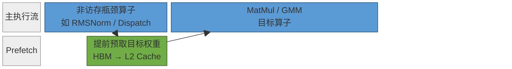
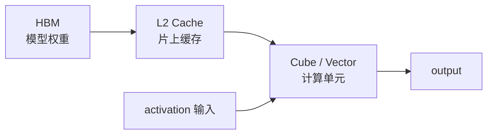
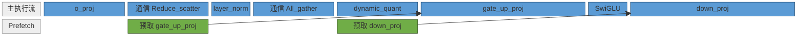

# NPU Prefetch 原理

本文档说明昇腾 NPU 上权重预取的背景、硬件与接口语义、模型代码中的实现方式，以及 LongCat-Flash 中已经落地的典型 Prefetch 优化案例。

## 1. 背景

大模型推理的 Decode 阶段常见一个特点：输入 token 数少、batch 较小，矩阵乘类算子的计算量不一定能把全部计算资源打满，但每次仍需要读取体量很大的模型权重。以 MatMul、QuantBatchMatmul(QBMM)、GroupedMatmul(GMM) 为例，输入激活 `x` 通常刚由前序算子产生，规模也相对较小；权重 `W` 则可能达到几十 MB，主要常驻在 HBM 中。此时算子耗时容易由“读权重”主导，表现为 memory-bound。

Prefetch 的目标是把这部分权重读取提前。当前序存在一个 HBM 带宽没有打满的窗口时，可以通过 `torch_npu.npu_prefetch` 提前把后续目标算子的部分权重从 HBM 搬入 L2 Cache。目标算子真正执行时，已经预取的权重可以从更近的缓存层读取，从而减少目标算子窗口内的 HBM 访存读取耗时。



Prefetch 不是通用加速开关。只有满足下面条件时才值得尝试：

1. profiling 已确认目标算子是 memory-bound，瓶颈主要来自权重搬运。
2. 目标权重足够大，提前搬运能覆盖可观的 HBM 读取开销。
3. 目标算子前存在安全的依赖窗口，且窗口本身不会被预取明显拖慢。
4. 单点 profiling 能解释收益来源，而不是只观察到端到端指标的随机波动。

典型目标包括 `q_proj`、`o_proj`、`gate_up_proj`、`down_proj` 等这些 MatMul 或 GMM 算子。LayerNorm、RMSNorm、ROPE、SwiGLU、router topk、dispatch、combine 等通常不是预取目标，而是可能提供预取窗口的前序算子。

## 2. 原理

### 2.1 算子计算前的权重访问链路

矩阵乘、QBMM、GMM 等算子执行时，计算单元不能直接使用常驻 HBM 的模型权重。算子启动后，硬件需要按照算子的访问模式，把权重从 HBM 搬到 L2 Cache 等片上缓存，再由 Cube / Vector 计算单元读取并完成计算。

可以把目标算子的执行简化为两个相互交织的阶段：

1. **搬运阶段**：从 HBM 读取目标权重，将其送入 L2 Cache 等片上缓存。
2. **计算阶段**：计算单元从片上缓存读取权重，与激活输入完成 MatMul / GMM 等计算。



在 Decode 小 batch 场景中，输入 token 数少，单次 MatMul / GMM 的计算量有限，权重读取的占比会变高。当 HBM 到 L2 Cache 的搬运时间接近或超过实际计算时间时，目标算子就会表现为 memory-bound。Prefetch 优化的目标不是改变算子的数学计算，而是提前完成一部分权重访问链路中的 HBM → L2 Cache 搬运。


### 2.2 基于多流的异步搬运

Prefetch 依赖多流机制才能产生收益。NPU 上 Host 通过 Stream 向 Device 下发任务，同一 Stream 内任务按顺序执行；不同 Stream 之间只要依赖关系满足，就可以并行调度。多流优化正是利用这一点，把计算、通信或数据搬运放到不同 Stream 上重叠执行，从而隐藏一部分非关键路径耗时。多流的基础概念见 [multi_stream_principles.md](multi_stream_principles.md)。

`torch_npu.npu_prefetch` 的核心就是把目标权重的数据搬运放到独立预取流中执行。模型代码在主执行流上得到某个依赖 Tensor 后，调用 `torch_npu.npu_prefetch(weight, depend, size, offset)` 接口发起预取；运行时根据 `depend` 建立同步关系，保证预取不会早于依赖 Tensor 的生产时刻，同时让主执行流继续推进后续算子。


因此，Prefetch 与普通多流优化的关系可以理解为：普通多流通常并行的是两个计算/通信分支，Prefetch 并行的是后续算子的权重搬运。模型侧需选择正确的 `depend`，否则运行时无法建立合理的异步搬运窗口。

| 对比项 | 多流优化 | Prefetch |
| --- | --- | --- |
| 并行对象 | 计算分支、通信分支、不同资源类型算子 | 目标算子的权重搬运 |
| 依赖表达 | Stream/Event、图内数据依赖或 `npu_wait_tensor` | `depend` Tensor |
| 主要收益 | 提高 Cube / Vector / 通信资源利用率 | 隐藏 HBM 权重读取开销 |
| 调优手段 | 调整 Stream 编排、Event、控核比例 | 调整 `depend` 位置和 `size` |

### 2.3 Prefetch 如何缩短关键路径

如果不做 Prefetch，目标算子的执行窗口内需要同时承担 HBM 读取、片上缓存填充和实际计算。也就是说，权重搬运耗时直接落在目标算子的关键路径上。

引入 Prefetch 后，运行时会在依赖 Tensor 之后发起异步搬运，将一部分目标权重提前放入 L2 Cache。当前序窗口与预取搬运可以重叠时，目标算子启动后需要等待的 HBM 读取减少，关键路径就可能缩短。


可以按下面的顺序理解一次有效预取：

1. 前序算子产生 `depend`，主执行流继续运行。
2. 预取流在 `depend` 之后开始搬运 `weight` 的前 `size` 字节。
3. 搬运结果进入 L2 Cache 等片上缓存。
4. 目标算子启动后，优先消费已经预取到缓存中的权重数据。
5. 未覆盖的权重仍按原路径从 HBM 读取。

## 3. 实现方式

Prefetch 的实现侧主要负责四件事：选择目标权重 `weight`、选择依赖 Tensor `depend`、计算预取大小 `size`、在合适位置调用 `torch_npu.npu_prefetch`。

### 3.1 接口语义

官方接口说明见 [torch_npu.npu_prefetch](https://www.hiascend.com/document/detail/zh/Pytorch/2600/apiref/torchnpuCustomsapi/docs/zh/custom_APIs/torch_npu/torch_npu-npu_prefetch.md)。文档与仓库实践中使用的调用形态如下：

```python
torch_npu.npu_prefetch(weight, depend, size, offset)
```

| 参数 | 含义 | 设计要求 |
| --- | --- | --- |
| `weight` | 需要预取的权重 Tensor | 通常传入目标算子的 `.weight.data` 或专家权重 `.data` |
| `depend` | 约束预取开始时机的依赖 Tensor | 目标算子之前稳定产生、能表达预取开始时机的 tensor |
| `size` | 本次最多预取的字节数 | 从保守值开始，根据 profiling 调整 |
| `offset` | 权重内预取起始偏移 | 当前仓库实践通常使用 `0` |

### 3.2 执行模式与流管理

Prefetch 的流管理方式与执行模式有关。eager / `ge_graph` 模式下，预取流由接口、图编译或运行时内部处理；`npugraph_ex` 模式下，模型侧需要显式创建并持有预取流。

#### 3.2.1 eager / ge_graph 用法

eager 或 `ge_graph` 模式下，模型代码直接调用 `torch_npu.npu_prefetch` 即可，不需要手动创建 `torch.npu.Stream()`，也不需要额外切流。模型侧只需要保证 `weight`、`depend`、`size`、`offset` 传入正确：

```python
if enable_prefetch:
    torch_npu.npu_prefetch(
        target_weight,
        depend_tensor,
        prefetch_size,
        0,
    )
```

在这种模式下，预取的开始时机由 `depend` 表达。接口或图运行时会基于这个依赖关系安排预取任务，使其在合适的预取流上执行。接入时不建议额外包一层手写 Stream / Event 逻辑，否则容易引入不必要的同步等待。

#### 3.2.2 npugraph_ex 用法

`npugraph_ex` 模式下，图捕获边界和流复用需要更明确，需要手动创建 prefetch 操作的流，例如，在 LongCat-Flash 中会在模型初始化时创建专门的 `npugraph_prefetch_stream`：

```python
self.npugraph_prefetch_stream = None
if enable_npugraph_ex and enable_multi_streams and enable_prefetch:
    self.npugraph_prefetch_stream = torch.npu.Stream()
```

具体调用时，先判断是否存在该预取流；如果存在，就通过 `npu_stream_switch` 切到预取流，再发起 prefetch。按原接口表示如下：

```python
route_prefetch = self.npugraph_prefetch_stream is not None
with npu_stream_switch(route_prefetch, self.npugraph_prefetch_stream):
    torch_npu.npu_prefetch(
        self.gate_up_proj.weight.data,
        o_proj,
        self.up_gate_prefetch_size,
        0,
    )
```

如果预取依赖当前流上的某个事件，需要在预取流上等待该事件，确保预取不会早于依赖数据产生：

```python
with npu_stream_switch(route_prefetch, self.npugraph_prefetch_stream):
    if route_prefetch and x_event is not None:
        self.npugraph_prefetch_stream.wait_event(x_event)
    if enable_prefetch:
        torch_npu.npu_prefetch(
            self.down_proj.weight.data,
            x,
            self.down_prefetch_size,
            0,
        )
```

在 `npugraph_ex` 的整网执行末尾，通常还需要让主流等待预取流收尾，避免后续阶段过早复用相关资源：

```python
if self.npugraph_prefetch_stream is not None and not is_prefill:
    with npu_stream_switch(True, self.npugraph_prefetch_stream):
        prefetch_done_event = torch.npu.current_stream().record_event()
    torch.npu.current_stream().wait_event(prefetch_done_event)
```

### 3.3 预取大小

`size` 决定本次预取量。过小收益有限，过大会抢占 HBM 带宽，导致依赖窗口或其他 Stream 退化。推荐先按权重大小计算理论值，再从保守比例开始验证。

```text
理论预取大小 = 权重元素个数 × dtype 字节数
首次 size = 理论预取大小 × 保守系数
```

| dtype | 字节数 |
| --- | --- |
| `int8` | 1 |
| `fp16 / bf16` | 2 |
| `fp32` | 4 |

常见算子的估算方式：

| 目标算子 | 权重形状 | dtype | 理论大小 | 首次建议 |
| --- | --- | --- | --- | --- |
| `q_proj / o_proj` | `hidden_size × hidden_size` | bf16 | `H × H × 2` | `H × H` |
| `gate_up_proj` | `hidden_size × intermediate_size × 2` | bf16 | `H × I × 4` | `H × I × 2` |
| `down_proj` | `intermediate_size × hidden_size` | bf16 | `I × H × 2` | `I × H` |

例如，LongCat-Flash 的专家权重预取大小按量化模式与并行切分计算，按本地专家权重计算：

```python
gmm1_prefetch_size = (
    hidden_size * intermediate_size * 2 * dtype_bit
    // moe_tp_size * experts_per_rank // 2
)

gmm2_prefetch_size = (
    hidden_size * intermediate_size * dtype_bit
    // moe_tp_size * experts_per_rank
)
```

## 4. 具体网络样例

### 4.1 LongCat-Flash：Attention / Dense 权重预取

LongCat-Flash 中已经在 `models/longcat_flash/models/modeling_longcat_flash.py` 接入多处 prefetch，以 Dense MLP 与 Attention 阶段的 prefetch 做法为例，核心思路是在当前层计算结束或当前子模块执行期间，提前预取后续访存密集算子的权重。

#### 4.1.1 Dense MLP 预取

`LongCatFlashMLP` 中，`gate_up_proj` 和 `down_proj` 都是权重量较大的线性层。`gate_up_proj` 可在上一段 `o_proj` 完成后预取，`down_proj` 可在 `gate_up_proj` 执行期间作为依赖窗口预取。



对应的原接口表示如下：

```python
if enable_prefetch:
    torch_npu.npu_prefetch(
        self.gate_up_proj.weight.data,
        o_proj_output,
        self.up_gate_prefetch_size,
        0,
    )

    torch_npu.npu_prefetch(
        self.down_proj.weight.data,
        gate_up_input,
        self.down_prefetch_size,
        0,
    )
```

其中 `up_gate_prefetch_size` 和 `down_prefetch_size` 基于 hidden size、intermediate size、dtype 和 dense TP 切分计算。

#### 4.1.2 Decode 阶段 MLAProlog 权重预取

Decode 阶段如果开启 `enable_mla_prolog`，attention 中的 Q/KV 准备逻辑会走 `mla_prolog`。此时 `q_a_proj`、`q_b_proj`、`kv_a_proj_with_mqa` 不再分别作为普通 Python 线性层逐个调用，而是作为 `npu_mla_prolog_v3` 的权重输入：

```python
torch.ops.npu.npu_mla_prolog_v3(
    token_x=hidden_states,
    weight_dq=q_a_weight,
    weight_uq_qr=q_b_weight,
    weight_dkv_kr=kv_a_weight,
    ...
)
```

因此，LongCat-Flash 中 decode 阶段的 attention 预取，本质上是为后续 MLAProlog 算子提前搬运 `q_a_proj.weight`、`q_b_proj.weight` 和 `kv_a_proj_with_mqa.weight`。这些权重体量较大，且 MLAProlog 位于下一段 attention 的入口处，适合利用前一段 Dense MLP 或跨层尾部窗口提前预取。

| 目标权重 | 说明 |
| --- | --- |
| `q_a_proj.weight` | 对应 MLAProlog 的 `weight_dq` |
| `q_b_proj.weight` | 对应 MLAProlog 的 `weight_uq_qr` |
| `kv_a_proj_with_mqa.weight` | 对应 MLAProlog 的 `weight_dkv_kr` |

LongCat-Flash 中有两类典型位置：

1. **层内预取**：第一段 Dense MLP 后，用 MLP 中间依赖 Tensor 作为 `depend`，预取同一层第二段 attention 的 MLAProlog 权重。
2. **跨层预取**：当前层第二段 Dense MLP 后，用当前层 `down_proj` 输出作为 `depend`，预取下一层第一段 attention 的 MLAProlog 权重。

按原接口抽象表示如下：

```python
if enable_prefetch:
    torch_npu.npu_prefetch(
        next_attention_q_a_weight,
        mlp_depend_tensor,
        q_a_prefetch_size,
        0,
    )
    torch_npu.npu_prefetch(
        next_attention_q_b_weight,
        mlp_depend_tensor,
        q_b_prefetch_size,
        0,
    )
    torch_npu.npu_prefetch(
        next_attention_kv_a_weight,
        mlp_depend_tensor,
        kv_a_prefetch_size,
        0,
    )
```

在 `npugraph_ex` 模式下，上述 prefetch 需要放到显式预取流中，并在依赖事件之后执行：

```python
with npu_stream_switch(has_prefetch_stream, prefetch_stream):
    if has_prefetch_stream and mlp_done_event is not None:
        prefetch_stream.wait_event(mlp_done_event)
    if enable_prefetch:
        torch_npu.npu_prefetch(next_attention_q_a_weight, mlp_depend_tensor, q_a_prefetch_size, 0)
        torch_npu.npu_prefetch(next_attention_q_b_weight, mlp_depend_tensor, q_b_prefetch_size, 0)
        torch_npu.npu_prefetch(next_attention_kv_a_weight, mlp_depend_tensor, kv_a_prefetch_size, 0)
```


这类预取的目标不是 `fused_infer_attention_score`，而是 attention 入口处的 MLAProlog。收益取决于 Dense MLP 输出到 MLAProlog 启动之间是否存在稳定窗口；如果多流、AFD、`npugraph_ex` 或图模式策略改变了层内时序，需要重新 profiling。
