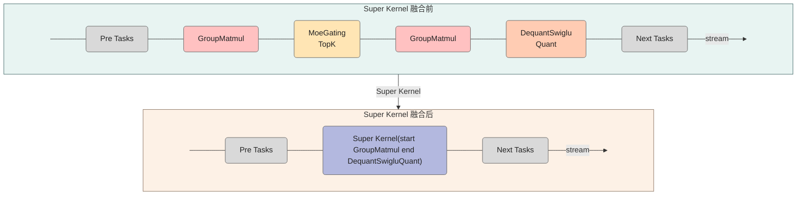
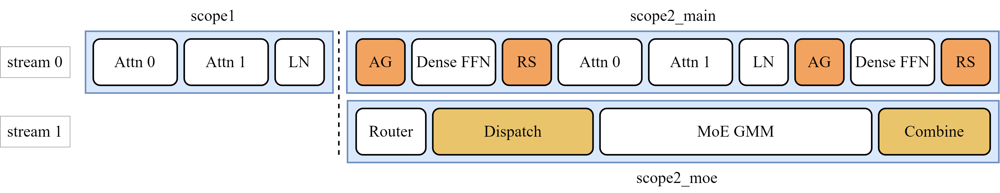

# SuperKernel

## 1. 背景

为提升模型性能，通常会采用多种优化手段，如算子级优化（算子融合、通信-计算重叠、Weight 预取等）和网络执行优化（Continuous Batching、Pipeline Parallelism 等）。尽管上述手段可以显著提升模型性能，但在模型调度层面仍存在优化空间：图模式下虽已有算子融合等优化，但受限于融合规则和边界约束，融合覆盖范围有限，融合后的算子间仍需逐个调度执行，存在调度开销和等待时间。通过更彻底的任务调度优化，可以进一步减少计算过程中的等待时间，释放模型性能。

本文档介绍的 SuperKernel 是一种面向网络图模型的调度优化技术。其核心思想是：基于网络图模型中算子的先验信息（如算子类型、前后序依赖关系等），结合即时编译（JIT）能力，突破传统算子融合规则的限制，将网络模型中的多个算子编译为一个 SuperKernel 进行整体调度执行，从而显著降低算子间的调度开销。

## 2. 原理

SuperKernel是一种算子二进制融合技术，它聚焦于内核函数（Kernel）的二进制调度方案优化，在已编译的二进制代码基础上融合创建一个超级Kernel函数（简称SuperKernel），以子函数调用的方式整合多个内核函数，从而优化计算任务、提升性能和资源利用率。与单算子下发相比，SuperKernel技术能够优化任务调度的等待时间和调度开销，并可利用Task间隙资源进一步优化算子头开销。得益于编译阶段即可获取全部子算子的先验信息，SuperKernel 可在此基础上实施更多深层优化，从算子级和网络级两个层面展开。



### 2.1 算子级优化

#### 2.1.1 ICache Preload 优化

SuperKernel 执行过程中，由于运行系统通常仅预取其入口点的指令，子 Kernel 的代码段往往无法被硬件预取机制有效捕获，导致指令缓存（ICache）命中率降低，引发 ICache Miss。为此，可引入 ICache Preload 机制：在当前子 Kernel 执行完毕前，以 2KB 对齐的方式，提前将下一个即将执行的子 Kernel 代码段预取到 ICache 中。这种预加载策略能够将指令加载的延迟隐藏在当前子 Kernel 的执行过程中，从而减少后续算子的 ICache Miss。

#### 2.1.2 Early-Start 优化

在常规调度中，必须等待前序算子全部执行完成后，才能启动后续算子。然而，多数前序算子的末尾指令为 MTE 数据搬运指令，而后续算子的起始指令通常为与输入数据无关的初始化标量指令。由于这两类指令分属不同计算单元，具备并发执行的条件。Early-Start 技术在前序算子的搬运指令前插入 Set 同步点，在后续算子的初始化指令后插入 Wait 同步点，从而实现两个子算子的部分指令并发执行，提升整体执行效率。

#### 2.1.3 同步优化

为保障执行顺序正确，SuperKernel 在各子算子调度之间会插入全核同步操作。对于 Kernel Type 为 Mix 1:2 的混合类型算子，完整的全核同步需等待所有 AI Core 的 Vector 核与 Cube 核均到达同步点。SuperKernel 在编译时能够识别每个子算子的类型，因此可针对前后子算子的 Kernel Type 定制同步范围。例如，对于连续的 Vector 算子，仅需执行全 Vector 核同步即可。通过细粒度控制同步范围，可有效降低子算子间的同步开销。

#### 2.1.4 子 Kernel 拆分

在多核系统中，当多个计算核心执行同一段代码时，会并发访问内存中的同一指令地址。这种对同一地址的并发访问会在共享的 L2 Cache 层面形成串行化访问队列，引发资源争用，削弱多核并行带来的性能增益。为解决该问题，SuperKernel 将子 Kernel 代码复制为多份，使不同核心能根据核 ID 映射到不同的物理地址执行。这一方法有效缓解了多核对同一指令地址的争用，显著提升算子执行效率。

### 2.2 网络级优化

#### 2.2.1 Tiling 下沉与 Weight 预取

SuperKernel 支持基于内存语义的 Notify 与 Wait 事件，以适配 Tiling 下沉与 Weight 预取等场景。Tiling 下沉算子指的是 Tiling 计算依赖前序算子的输出结果，为避免主机与设备间的频繁交互，将 Tiling 计算部署于 AICPU 执行的算子。若 SuperKernel 融合了该 Tiling 下沉算子的前序算子，则需在前序算子执行完成后通过 Notify 事件通知 AICPU 启动 Tiling 计算；若融合了 Tiling 下沉算子本身，则需通过 Wait 事件等待 AICPU 完成 Tiling 计算后再执行 Device 侧计算。Weight 预取则借助 CMO （ Cache Management Operation）任务调用专用硬件单元 SDMA，将数据提前加载至 L2 Cache，以提升计算效率。SDMA 与 AI Core 之间的协作正是通过内存语义的 Notify/Wait 事件实现的。

#### 2.2.2 双流并发融合

通过多流实现 Cube/Vector 并发场景后，在简单转换为 SuperKernel 时，如果不感知依赖关系，仅根据执行顺序进行处理，SuperKernel 内部的执行将退化为串行，导致性能收益不及预期。为解决这一问题，可以将算子按照类型进行分类，并在 SuperKernel 内部根据 Cube 和 Vector 的不同特性分配执行队列，同时结合流的属性和 Event，精准插入同步点，从而实现 Cube 和 Vector 的高效并发执行。

> 本节参考 [graph-autofusion](https://gitcode.com/cann/graph-autofusion) 整理，具体实现与能力以对应版本源码和文档为准。

## 3. 实现方式

当前 SuperKernel 特性通过 PyTorch 图模式开启，主要支持 `npugraph_ex` 后端和 `GE` 图模式两种方式。

### 3.1 npugraph_ex 后端

在 `npugraph_ex` 后端中，SuperKernel 融合能力通过 `torch.compile` 的 `options` 参数配置。用户可在 `options` 中设置 `super_kernel_optimize=True` 以开启该能力：

```python
compiled_model = torch.compile(
    model,
    backend="npugraph_ex",
    # 省略部分参数
    options={
        "static_kernel_compile": True
        "super_kernel_optimize": True,
        # 省略部分参数
    },
)
```

其中，`super_kernel_optimize=True` 表示开启 SuperKernel 融合优化。

如需进一步控制 SuperKernel 的融合范围，可通过如下接口进行范围标定：

```python
torch.npu.super_kernel_scope_begin(scope_name: str)
torch.npu.super_kernel_scope_end(scope_name: str)
```

通过 `super_kernel_scope_begin/end` 标定的范围内，满足条件的算子将参与 SuperKernel 融合。

具体使用方式可参考[功能文档](https://gitcode.com/Ascend/torchair/blob/26.1.0/docs/zh/npugraph_ex/advanced/superkernel.md)

### 3.2 GE 图模式后端

在 GE 图模式中，SuperKernel 通过 TorchAir 提供的作用域接口进行标定，并配合 TorchAir 的 `CompilerConfig` 开启，可参照[GE图模式](https://www.hiascend.com/document/detail/zh/Pytorch/2600/modthirdparty/torchairuseguide/docs/zh/ascend_ir/quick_start.md)。

用户需要先分析模型脚本中可被融合的算子范围，然后使用 `torchair.scope.super_kernel` 标定 SuperKernel 融合区域。`with` 语句块内的算子会被融合为一个 SuperKernel 进行计算。

接口形式如下：

```python
with torchair.scope.super_kernel(scope: str, options: str = ''):
    ...
```

参数说明：

- `scope`：表示当前上下文中算子融合后的 SuperKernel 名称。相同的 `scope` 表示属于同一个融合范围，由用户指定。若传入 `None`，表示该范围内的算子不进行 SuperKernel 融合。
- `options`：表示 SuperKernel 的编译选项。

示例：

```python
import torchair

with torchair.scope.super_kernel("super_kernel_0"):
    y = op1(x)
    z = op2(y)
```

上述示例中，`op1` 和 `op2` 位于同一个 `super_kernel_0` 作用域内，满足融合条件时会被融合为一个 SuperKernel。

具体使用方式可参考[使用指南](https://www.hiascend.com/document/detail/zh/Pytorch/2600/modthirdparty/torchairuseguide/docs/zh/ascend_ir/features/advanced/super_kernel_scope.md)

## 4. 具体网络样例

以 Longcat Flash 模型优化为例，由于不同流上采用了不同的分核策略，按照分核与分流的范围在整网中共标定了三个 SuperKernel ，如下图所示。

<div align="center">

</div>

## 5. 约束

- 编译器会按网络中算子的执行顺序依次识别可融合性。若遇到不可融合的算子（如 TBE 算子），则会将其前面已识别的连续可融合算子组成一段 SuperKernel，同时跳过该不可融合算子，继续向后识别并组成下一段 SuperKernel。
- 目前支持SuperKernel融合的通信类算子包括AllReduce、ReduceScatter、AllGather、AlltoAll。
- npugraph_ex图模式场景下，若开启SuperKernel融合优化，需要同时开启[静态Kernel编译功能](https://gitcode.com/Ascend/torchair/blob/26.1.0/docs/zh/npugraph_ex/basic/static_kernel_compile.md)。
- GE图模式场景下需要为静态图，且with语句块内不支持断图
- 开启SuperKernel融合优化后，算子Data Dump功能将会失效