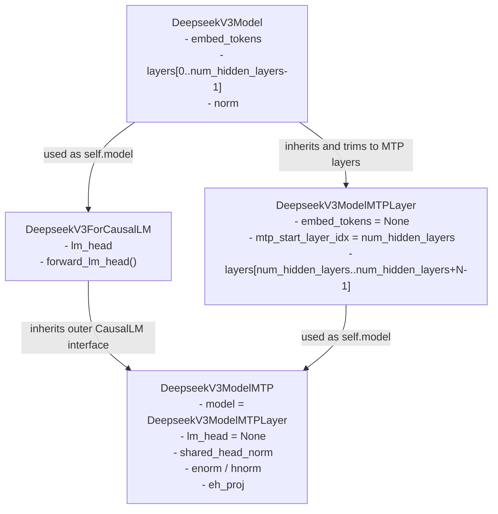

# MTP Model 模型适配指南

## 概述

MTP (Multi-Token Prediction) 流程已接入框架中。相关实现文件和文档如下：

- **实现文件**: [mtp_worker.py](../../executor/core/model_worker/mtp_worker.py) - MTPWorker 类实现
- **文档文件**: [mtp_design.md](../design/mtp_design.md) - MTP 执行机制设计文档

若想在框架上实现新模型的 MTP 特性，需要自定义 MTP 类。

**重要提示：**
1. 框架实现的投机算法需要从主模型传递 `prev_hidden_states` 到 MTP 模型，MTP 模型需支持该输入接口;
2. 推荐在已有的主模型上搭建 MTP 模型，复用主模型的 `lm_head`、`embed_tokens` 等组件，框架会默认处理权重共享。

本指南以[DeepSeek-R1](../../models/deepseek_r1/models/modeling_deepseek.py)中的 MTP 实现为例，介绍如何在 DeepSeekV3ForCausalLM 主模型基础上搭建 MTP  模型。

## 2. 核心类组成结构


下面这张图只关注 [DeepSeek-R1](../../models/deepseek_r1/models/modeling_deepseek.py)中 4 个核心类之间的继承和组合关系。



- `DeepseekV3ModelMTPLayer` 只是“额外 MTP 层容器”，它不负责embed token，也不负责最终 logits。
- `DeepseekV3ModelMTP` 复用了 `ForCausalLM` 的外层接口形态，但内部 model 已经 换成了 `DeepseekV3ModelMTPLayer`。


### 2.1 DeepseekV3ModelMTPLayer

MTP 专属的 Transformer 层容器，继承自 `DeepseekV3Model`。

| 成员变量 | 类型 | 说明 |
|---------|------|------|
| `embed_tokens` | `None` | **复用主模型的 lm_head** |
| `mtp_start_layer_idx` | `int` | MTP 层起始索引 = `config.num_hidden_layers` |
| `layers` | `ModuleDict` | MTP 专属的 decoder 层集合 |

**layers 结构**:
- **Key**: `"num_hidden_layers + i"` (如 "60", "61", ...)
- **Value**: `DeepseekV3DecoderLayer` 实例
- **数量**: `config.num_nextn_predict_layers`

#### DeepseekV3ModelMTPLayer 推理流程

`DeepseekV3ModelMTPLayer` 是 MTP 层的容器，其 forward 函数根据 `mtp_layer_idx` 参数选择并执行指定的 MTP decoder 层。

**流程图：**

```
输入: hidden_states, kv_len, actual_seq_lengths_kv, cos_sin, ..., mtp_layer_idx
│
├─ 根据索引获取指定 MTP 层
│   └─ layer = get_layer(mtp_layer_idx)
│       └─ 返回 layers[mtp_start_layer_idx + mtp_layer_idx]
│
└─ 调用该层的 forward 函数
    └─ return layer.forward(hidden_states, kv_len, actual_seq_lengths_kv, ...)
        ├─ Self-Attention 计算
        ├─ MoE 前馈网络计算
        └─ 残差连接 + 层归一化

输出: hidden_states
```

**关键代码：**

```python
def forward(
    self,
    hidden_states: torch.Tensor,
    mtp_layer_idx: Optional[int] = 0,  # 指定执行哪个 MTP 层
    ...
) -> torch.Tensor:
    # 根据索引获取对应的 MTP decoder 层
    layer = self.get_layer(mtp_layer_idx)

    # 调用该层的 forward 函数
    return layer.forward(
        hidden_states,
        ...
    )
```

**关键点：**
- `mtp_layer_idx` 从 0 开始，对应 `config.num_hidden_layers + mtp_layer_idx` 层
- MTP decoder 层的结构与主模型的 decoder 层相同


### 2.2 DeepseekV3ModelMTP

MTP 模型主类，继承自 `DeepseekV3ForCausalLM`。

| 成员变量 | 类型 | 作用 |
|---------|------|------|
| `is_mtp` | `bool = True` | MTP 模式标志 |
| `model` | `DeepseekV3ModelMTPLayer` | MTP transformer 层 |
| `lm_head` | `None` | **复用主模型的 lm_head** |
| `rotary_emb` | `DeepseekV3YarnRotaryEmbedding` | 位置编码层 |
| `shared_head_norm` | `DeepseekV3RMSNorm` | 共享头归一化层 |
| `enorm` | `DeepseekV3RMSNorm` | 当前帧 hidden state 归一化 |
| `hnorm` | `DeepseekV3RMSNorm` | 上一帧 hidden state 归一化 |
| `eh_proj` | `ReplicatedLinear` | 特征融合: `[h_t, h_{t-1}] → h` |

#### DeepseekV3ModelMTP 推理流程

MTP 模型主类的推理流程包含特征融合、位置编码获取、多层计算等步骤。

**流程图：**

```
输入: input_ids, prev_hidden_states (上一token输出)
│
├─ step 1: 获取 embeddings
│   └─ calc_input_embeddings()
│       ├─ 复用主模型的 embed_tokens
│       └─ 返回 hidden_states
│
├─ step 2: 归一化
│   ├─ hidden_states_e = enorm(hidden_states)
│   └─ prev_hidden_states_h = hnorm(prev_hidden_states)
│
├─ step 3: 特征融合
│   ├─ hidden_states_fused = concat([hidden_states_e, prev_hidden_states_h])
│   └─ hidden_states = eh_proj(hidden_states_fused)
│
├─ step 4: 获取位置编码
│   └─ cos_sin = rotary_emb(hidden_states, kv_len, ...)
│
├─ step 5: Transformer 层计算
│   └─ 遍历所有 MTP 层
│       ├─ for i in range(num_nextn_predict_layers):
│       │   └─ hidden_states = ModelMTPLayer(mtp_layer_idx=i)(hidden_states, ...)
│       └─ 逐层执行 MTP 专属的 decoder 层
│
├─ step 6: 共享头归一化
│   └─ prev_hidden_states, _ = shared_head_norm(hidden_states, residual)
│
└─ step 7: 输出 logits
    └─ logits = forward_lm_head(prev_hidden_states, ...)
```

**关键代码：**

```python
def forward(
    self,
    input_ids: torch.Tensor,
    prev_hidden_states: torch.Tensor,
    forward_metadata: ForwardMetaData,
    ...
):
    is_prefill = forward_metadata.is_prefill
    kv_len = forward_metadata.kv_len

    # Step 1: 获取 embeddings (复用主模型)
    hidden_states = self.model.calc_input_embeddings(input_ids, ...)

    # Step 2: 归一化
    hidden_states = self.enorm(hidden_states)
    prev_hidden_states = self.hnorm(prev_hidden_states)

    # Step 3: 特征融合
    hidden_states_fused = concat([hidden_states, prev_hidden_states], dim=-1)
    hidden_states = self.eh_proj(hidden_states_fused)

    # Step 4: 获取位置编码
    cos_sin = self.rotary_emb(hidden_states, kv_len, ...)

    # Step 5: Transformer 层计算
    residual = None
    for i in range(self.config.num_nextn_predict_layers):
        residual, hidden_states = self.model.forward(
            hidden_states,
            kv_len,
            ...,
            mtp_layer_idx=i,
            past_residual=residual
        )

    # Step 6: 共享头归一化
    prev_hidden_states, _ = self.shared_head_norm(hidden_states, residual)

    # Step 7: 输出 logits (复用主模型)
    logits = self.forward_lm_head(prev_hidden_states, ...)

    return logits, prev_hidden_states
```

#### MTP 独有权重映射

MTP 模型需要额外加载的权重如下，当出现checkpoint权重名与模型参数名不一致的情况，需要在 MTP 模型的`load_weights`函数进行映射：

| checkpoint权重名 | 模型参数名 | 说明 |
|-------------|-----------|------|
| `shared_head.norm` | `shared_head_norm` | 共享头归一化 |
| `enorm` | `enorm` | e 分支归一化 |
| `hnorm` | `hnorm` | h 分支归一化 |
| `eh_proj` | `eh_proj` | 特征融合投影 |

**注意**:
- MTP 层索引从 `num_hidden_layers` 开始，例如主模型有 60 层，MTP 有 1 层，则 MTP 层为 60
- `embed_tokens.weight` 和 `lm_head.weight` 可以无需加载（复用主模型）

## 3. 实现步骤

在框架中实现模型的 MTP 特性需要完成以下三个步骤：

### 3.1 步骤一：定义 MTP 类

在模型文件中定义 MTP 相关类。以 DeepSeek-R1 为例，在 `models/deepseek_r1/models/modeling_deepseek.py` 中定义：

**核心类：**
- `DeepseekV3ModelMTPLayer` - MTP Transformer 层容器
- `DeepseekV3ModelMTP` - MTP 模型主类

**MTP 模型关键特征：**
```python
class DeepseekV3ModelMTP(DeepseekV3ForCausalLM):
    is_mtp = True                    # MTP 模式标志
    model = DeepseekV3ModelMTPLayer  # MTP 专属层
    lm_head = None                   # 复用主模型
    rotary_emb = ...                 # 位置编码
    shared_head_norm = ...           # 共享头归一化
    enorm = ...                      # 当前帧归一化
    hnorm = ...                      # 上一帧归一化
    eh_proj = ...                    # 特征融合投影
```

### 3.2 步骤二：注册 MTP 模型

将 MTP 模型类注册到框架的模型字典中。在 `executor/core/entrypoints/support_models.py` 中添加：

```python
from models.deepseek_r1.models.modeling_deepseek import DeepseekV3ForCausalLM, DeepseekV3ModelMTP
from models.deepseek_r1.models.configuration_deepseek import DeepseekV3Config

model_dict = {
    "deepseek_r1": (DeepseekV3ForCausalLM, DeepseekV3ModelMTP, DeepseekV3Config)
}
```

**model_dict 结构说明：**
- 第一个元素: 主模型类 (`DeepseekV3ForCausalLM`)
- 第二个元素: MTP 模型类 (`DeepseekV3ModelMTP`)
- 第三个元素: 配置类 (`DeepseekV3Config`)

### 3.3 步骤三：使能 MTP 的配置

在 YAML 配置文件中设置 `model_config` 中的 `next_n` 参数来启用 MTP：

```yaml
model_config:
  next_n: 3  # 每步预测的推测 token 数量，> 0 时启用 MTP
```

**框架自动处理：**
- 框架检查 `next_n > 0`，满足条件时自动使用 MTP 模型
- 框架通过 `share_weights_from_main_model` 自动共享 `lm_head` 和 `embed_tokens` 权重
