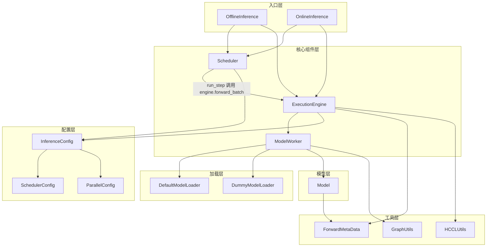
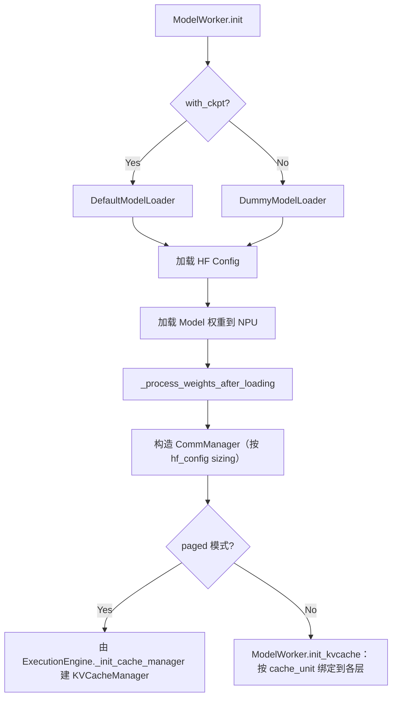
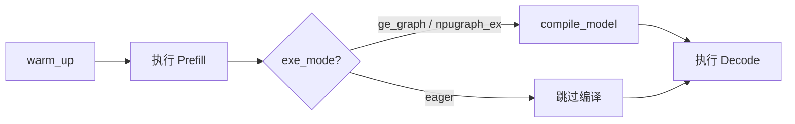
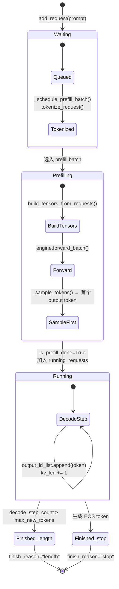

# 框架架构总览

本文档介绍 executor 中提供的模型执行的公共流程机制。该模块旨在统一模型执行流程，以避免不同模型需要适配大量的重复流程代码，从而将工作重点集中在模型本身的性能优化上。提供 offline 和 online两种执行方式：

1. offline 为核心功能，与原有流程功能保持一致，有确定的输入数据和调度，以提供稳定的性能分析和问题定位的执行方式；
2. online 参考开源框架提供的简易在线功能，以方便用 evalscope 等评测工具进行精度评测；保证基础功能，不做流程相关的性能优化；以 PD 分离的方式支持 P 和 D 按不同并行切分策略进行测试；模型需要按[KV Cache 管理](kv_cache_design.md)适配（offline 提供了非 KV Cache管理机制），除此之外的适配要求同 offline。

细节专题：
- [在线推理（PD 分离）执行机制](online_inference_design.md)
- [KV Cache 管理](kv_cache_design.md)
- [MTP 投机采样执行流程](mtp_design.md)

---

## 1. 目录结构

```
cann-recipes-infer/
├── executor/                  # 推理框架核心
│   ├── core/                  # 核心引擎组件
│   │   ├── config/            # 配置类（InferenceConfig、CommManager）
│   │   ├── engine/            # 执行引擎（ExecutionEngine）
│   │   ├── kv_cache/          # Paged KV cache 管理（KVCacheManager / BlockPool）
│   │   ├── model_worker/      # 模型 Worker（ModelWorker、MTPWorker）
│   │   ├── scheduler/         # 调度器基类（Scheduler）
│   │   └── types_/            # 公共类型（Request、Batch、ForwardMetaData 等）
│   ├── offline/               # 离线推理入口（OfflineInference）
│   ├── online/                # 在线推理入口
│   │   ├── server.py          #   FastAPI HTTP 入口 + WorkerManager
│   │   ├── dp_dispatcher.py   #   DPDispatcher（父进程经 ZMQ 把请求派给 worker、收回 worker 算出的结果）
│   │   ├── online_inference.py#   OnlineInference 推理循环（继承 OfflineInference）
│   │   ├── router.py          #   PD Router sidecar（双发 prefill/decode）
│   │   ├── bootstrap.py       #   PD Bootstrap server（rank table / dp_rank 路由）
│   │   ├── kv_transfer/       #   KV 传输（buffer / conn / transfer_engine / transfer_manager）
│   │   └── scheduler/         #   PD 调度器（PrefillDisaggScheduler / DecodeDisaggScheduler）
│   ├── model_loader/          # 权重加载
│   ├── scripts/               # 启动脚本（function.sh / set_env.sh）
│   └── utils/                 # 工具函数（forward_metadata、graph_utils、hccl_utils、profiler 等）
├── models/                    # 各模型实现（每个子目录一个模型）
├── module/                    # 公共模块（并行 Linear、MoE GMM、量化、blockwise sparse 等）
├── ops/                       # 自定义算子（AscendC、TileLang、PyPTO）
├── dataset/                   # 默认评测数据集
└── docs/                      # 文档
```

## 2. 模块依赖关系



---

## 3. 核心组件说明

### 3.1 InferenceConfig

统一配置容器，从 YAML 文件加载，包含五个子配置：

```
InferenceConfig
├── DataConfig       # 数据集、序列长度上限等
├── ModelConfig      # 模型路径、执行模式（eager/graph）、MTP 等
├── ParallelConfig   # TP/DP/EP 并行规模、rank 信息、ZMQ 端口
├── SchedulerConfig  # batch_size、max_new_tokens、每 DP rank 的 batch 限额
└── DisaggConfig     # PD 分离运行时（disaggregation_mode ∈ {NONE, PREFILL, DECODE}、
                     #                bootstrap_host/port、store_url、is_store_creator_node、local_ip）
```

`DisaggConfig.disaggregation_mode == "NONE"` 即离线，`PREFILL` / `DECODE` 即在线（在线即 PD 分离，见 §5）。

配置加载入口：`executor/core/config/inference_config.py`

### 3.2 CommManager

通信组管理器，在初始化阶段一次性创建所有通信组并按用途分两类：

**模型计算通信域**（HCCL），模型中的各模块（attention / FFN / MoE / embedding / lm_head 等）对应的 yaml 并行参数进行配置，具体所需的组随模型结构而异。

**调度通信域**（gloo，承载 Python 对象在父子进程或 leader 间广播 / 同步）：

- `dp_leader_group`：各 **DP leader**（每个 DP 组内 `attn_tp_rank == 0` 的 rank，承担该组对外的代理）之间跨 DP 同步
- `tp_cpu_group`：每个 DP 组内由 DP leader 向 TP worker 广播请求

### 3.3 ModelWorker

模型执行的直接载体，持有：
- 模型实例（`self.model`）
- KV cache tensor（`self.kv_cache`）
- 图编译后的 forward 函数（`self.model_compiled`，graph 模式下）

核心方法：
- `init(model_cls, config_cls)`：实际启动入口；加载 HF config + 权重，并按 `hf_config` 构造 `CommManager`（其 `moe_ep` buffer 大小依赖 `hf_config`，必须在权重加载后建）
- `init_kvcache()`：**legacy（非 paged）模式**才调用——按 `module.cache_unit` 形状为各 attention 层分配 `module.k_cache / module.v_cache`。**paged 模式**下不调用，KV 块由 `ExecutionEngine._init_cache_manager()` 通过 `KVCacheManager` 统一管理（见 §3.6）
- `compile_model()`：图模式下编译 forward；由 `ExecutionEngine.warm_up()` 在执行完 dummy prefill 后调用
- `inference(model_inputs, is_prefill, is_mtp=False)`：执行单次 forward，返回 `(output, infer_time)`。`is_mtp` 当前不参与分支，仅保留签名兼容；每步推理耗时日志已迁到 `Scheduler._log_step`

**模型加载流程：**



**图编译流程：**



### 3.4 ExecutionEngine

框架的核心驱动层，连接调度器与模型：
- `_build_model_inputs(batch)`：调用 `build_tensors_from_requests` 将 requests 拼装为 tensor，再构建 position_ids、ForwardMetaData 等模型输入；paged 模式下同时通过 `prepare_block_tables` / `prepare_slot_mapping` 写入 `block_table` / `slot_mapping`
- `forward_batch(batch)`：调用 `_build_model_inputs` → `ModelWorker.inference` 执行前向 → `_sample_tokens` 采样 → `Batch.update_requests_from_batch` 回写到 `Request`；返回 dict 含 `next_tokens` / `logits` / `inference_time`（聚合，等于 main + sum(mtp)）/ `inference_time_main` / `inference_times_mtp`
- `warm_up()`：执行一次 dummy prefill + decode，触发算子预热；图模式下在 dummy prefill 之后调用 `ModelWorker.compile_model`

> 日志：`executor/utils/logging_config.py` 中 `setup_logging()` 是统一入口，环境变量 `CANN_RECIPES_LOG_LEVEL`（默认 `INFO`）控制级别。

### 3.5 Scheduler

请求生命周期管理：



状态转换的关键位置：

| 转换 | 代码位置 |
|------|----------|
| Waiting → Prefilling | `_schedule_prefill_batch()`: 从 waiting_queue 取出，tokenize（若未 tokenize），创建 Batch |
| Prefilling → Running | `_process_batch_output()`: `request.is_prefill_done = True`，加入 `running_requests` |
| Running → Running | `_process_batch_output()`: `decode_step_count += 1`，追加 output token |
| Running → Finished | `_should_finish()`: 检查 `decode_step_count >= max_new_tokens` 或 EOS，设 `finish_reason` |

- **离线模式**（`disaggregation_mode == NONE`）：基类 `Scheduler`，prefill 优先、无 prefill 则 decode
- **在线模式**（`disaggregation_mode ∈ {PREFILL, DECODE}`，即 PD 分离）：`PrefillDisaggScheduler` / `DecodeDisaggScheduler` 在基类基础上扩展角色专一队列、bootstrap 同步、KV 传输衔接，详见 §5

### 3.6 KV Cache Manager

KV cache 采用 paged attention 三层结构，定义在 `executor/core/kv_cache/`：

| 层 | 职责 |
|------|------|
| `KVCacheManager` | 请求级总协调器，对接 Scheduler 的 slot 申请；跨 attention type 做一致性预检查后再分配 |
| `SingleTypeKVCacheManager` | 单一 attention type（Full / Sliding Window）的逻辑块管理：决定每请求所需 block、回收旧块、维护 block table |
| `BlockPool` | 物理 block 池：发放与回收 block id |

调度层通过 `manager.allocate_slots(request, num_tokens)` 申请块；attention 内核读写时按 `block_table/slot_mapping` 索引到具体物理块。

详见 [kv_cache_design.md](kv_cache_design.md)。

---

## 4. 离线推理流程

离线推理是框架的主要使用场景，用于性能评测和模型验证。

### 4.1 启动方式

```bash
bash models/<model>/infer.sh
```

### 4.2 初始化时序图

`ExecutionEngine` 的初始化分两阶段：构造时只做设备/进程组就绪，真正的权重加载与 KV cache 分配由 `init()` 方法触发。

```
[infer.py]
    │
    ├─ 读取 YAML → 构建 InferenceConfig
    │
    └─ OfflineInference.__init__(config)
            │
            ├─ ExecutionEngine.__init__(config)            # Phase 1: 资源占位
            │       ├─ _init_device()                       #   绑定 NPU、init_process_group(hccl)
            │       ├─ ModelWorker(config, device)          #   仅构造，不加载模型
            │       └─ ProfilerManager()                    #   profiler 配置
            │
            ├─ ExecutionEngine.init(model_cls, config_cls)  # Phase 2: 真正装载
            │       ├─ main_worker.init()                   #   加载 hf_config + 权重 → 构造 CommManager
            │       ├─ AutoTokenizer.from_pretrained()      #   加载 tokenizer
            │       └─ if cache_info: _init_cache_manager() #   paged：建 KVCacheManager + 块池
            │            else:        main_worker.init_kvcache()  # legacy：非paged方法分配 kv_cache
            │
            ├─ engine.warm_up()                             # dummy prefill + decode；图模式触发 compile_model
            │
            └─ Scheduler.__init__(tokenizer, config)        # 初始化请求队列
```

### 4.3 运行时时序图

```
[OfflineInference.generate(prompts)]
    │
    ├─ scheduler.add_request(prompt)  ×N   # 将所有 prompt 加入 waiting_queue
    │
    └─ 推理循环（while scheduler.has_work()）
            │
            ├─ scheduler.run_step(engine)
            │       │
            │       ├─ _schedule_batch()             # 优先 prefill，无 prefill 则 decode
            │       │       └─ 选择 requests → 创建 Batch 对象（不构建 tensors）
            │       │
            │       ├─ engine.forward_batch(batch)
            │       │       ├─ _build_model_inputs(batch)
            │       │       │       ├─ build_tensors_from_requests()  # 拼装 input_ids、seq_lens
            │       │       │       └─ 构建 position_ids、ForwardMetaData（内部调用 set_forward_metadata）
            │       │       ├─ ModelWorker.inference()  # 调用 model.forward()
            │       │       └─ _sample_tokens()            # argmax 采样
            │       │
            │       └─ _process_batch_output()       # 更新 request 状态，检查 EOS/max_len
            │
            └─ 收集 finished_requests → 解码输出文本
```

**关键数据流：**

```
waiting_queue[Request]
    │  (prompt str / token ids)
    ▼
Batch.input_ids [TotalTokens]                          ← Batch.build_tensors_from_requests()：torch.cat 串接
Batch.seq_lens [num_requests]                             prefill 各 prompt 串接，decode 每请求 1 token
    │
    ▼
ForwardMetaData { is_prefill, kv_len, attention_mask,  ← ExecutionEngine._build_model_inputs()：
                  actual_seq_lengths_kv/q (含 cu/list 变体),  内部 set_forward_metadata(...) 写入
                  prompt_tokens,
                  block_table, slot_mapping }            paged 模式下 block_table / slot_mapping
                                                         由 prepare_block_tables / prepare_slot_mapping 生成
    │
    ▼
model.forward(input_ids, position_ids, forward_metadata,  ← ModelWorker.inference() 调用
              slot_mapping, block_table, ...)              eager 或图模式（model_compiled）
    │
    ▼
logits [TotalTokens, vocab]                            （prefill 场景由 _sample_tokens 内部按
                                                         actual_seq_lengths 取每请求最后位置）
    │
    ▼
next_tokens [num_requests]                              ← ExecutionEngine._sample_tokens()：argmax
    │
    ▼
next_tokens_by_request {request_id → [token_id]}        ← Batch.update_requests_from_batch()：
                                                          同时回写 Request.output_id_list / Request.kv_len /
                                                          Request.infer_time
    │
    ▼
Scheduler._process_batch_output()                       ← 状态机推进：Prefilling → Running、
                                                          Running → Finished（按 EOS / max_new_tokens）
```

---

## 5. 在线推理流程（PD 分离）

在线推理走 **Prefill-Decode (PD) 分离**部署：prefill 与 decode 拆到独立服务实例，分别按各自最优策略部署（prefill 倾向 TP、decode 倾向 DP），避免合并部署时的策略折中。

代码层面 `disaggregation_mode ∈ {PREFILL, DECODE}` 即在线，`NONE` 即离线，没有prefill+decode 合并的在线模式。在线推理主要用于 benchmark 验证，不以吞吐为核心目标。

### 5.1 进程结构与组件

每节点由 `executor/online/server.py main()` 拉起一个父进程，父进程根据 `--role` 参数 spawn 出 N 个 worker 子进程（一卡一 worker）。父进程跑 FastAPI HTTP + `DPDispatcher`（通过 ZMQ 把请求派发给 worker，再把 worker 算出的结果收回父进程），worker 子进程跑 `OnlineInference` 推理循环（继承 `OfflineInference`）。

部署位置涉及两类 leader：

- **实例 leader**：一个 service instance（一组并行运行的 rank 构成的 Prefill 或 Decode 实例）内 `node_index == 0` 的节点，每个实例只有一个；承担实例级控制面入口（HTTP handler / DPDispatcher 都跑在它的父进程上），Prefill 实例 leader 还额外起 Bootstrap server 线程
- **DP leader**：单个 DP 组内 `attn_tp_rank == 0` 的 worker，每个 DP 组一个；DPDispatcher 在父进程侧分发请求时只对接 DP leader，组内其他 TP worker 通过 `tp_cpu_group` 接收 leader 广播的请求

四个 PD 专用组件分布在 `executor/online/` 下：

| 组件 | 文件 | 部署位置 | 职责 |
|------|------|----------|------|
| Router | `router.py` | Decode 实例 node 0 的 sidecar 进程 | 按 `bootstrap_room % N` 选 prefill/decode 实例并双发请求 |
| Bootstrap Server | `bootstrap.py` | Prefill 实例 leader 父进程的独立线程 | 提供 rank table 注册/查询、`bootstrap_room → dp_rank` 路由 |
| KVTransferManager | `kv_transfer/` | 每个 worker 子进程 | 控制面走 ZMQ，数据面走 RDMA / HCCL，metadata 直写对端 buffer |
| PD Scheduler | `scheduler/{prefill,decode}.py` | 每个 worker 子进程，替换基类 `Scheduler` | Prefill 完成后释放 KV；Decode 等待 KV 到齐后才进入计算 |

### 5.2 请求路径

```
Client ──POST /generate──▶ Router (decode-node-0:8000)
                              │   注入 bootstrap_room / bootstrap_host / bootstrap_port
                              │
                              │   asyncio.gather 并发双发：
                              ├──▶ Prefill 实例 leader  ──▶ KV 经 RDMA 直发 Decode worker
                              │                              （HTTP 响应被 Router 丢弃）
                              │
                              └──▶ Decode 实例 leader   ──▶ 等 KV 到齐 + 完成 decode
                                       │
                                       ▼  HTTP response (主响应)
                                    Router
                                       │
                                       ▼
                                    Client
```

`bootstrap_room` 是请求级唯一 ID，prefill / decode 两侧用它关联同一请求。Router 用 `asyncio.gather` 并发 POST，等到 Decode 端 200 后取其响应 JSON 作为返回 body 透传给 Client；Prefill 端的 HTTP 响应在 Router 内被丢弃，仅用于检测后端是否在线（连接异常时 Router 抛 503）。

### 5.3 启动方式

启动通过模型目录下的 `infer.sh` 调用 `executor/scripts/function.sh`：

```bash
# Prefill 节点（local IP 必须在 PREFILL_IPS 中）
bash models/<model>/infer.sh online prefill

# Decode 节点（local IP 必须在 DECODE_IPS 中）
bash models/<model>/infer.sh online decode
```

1. `PREFILL_IPS` 与 `DECODE_IPS` 由 `executor/scripts/set_env.sh` 维护；
2. 每角色用独立 YAML（`prefill.yaml` / `decode.yaml`），其 `parallel_config.world_size` 是**每实例** world size；
3. `PREFILL_IPS` 与 `DECODE_IPS` 不重叠时，可省略 `prefill` / `decode` 参数，shell 会从 local IP 自动推断角色；
4. 同机部署（PREFILL/DECODE 列表重叠）时必须显式传，并通过 `ASCEND_RT_VISIBLE_DEVICES` 隔离 NPU。

### 5.4 离线与在线的差异

离线与在线共用 `ExecutionEngine` / `ModelWorker` / 基类 `Scheduler`，差异集中在入口、调度与 KV 生命周期：

| 维度 | 离线（`NONE`） | 在线（`PREFILL` / `DECODE`） |
|------|----------------|-------------------------------|
| 请求来源 | YAML prompts 列表 | HTTP POST /generate（经 Router 双发） |
| 并发控制 | `generate()` 顺序处理 | asyncio + threading.Event 异步等待 |
| 进程结构 | torchrun 按 worker数启动进程 | 父进程 + N worker 子进程，每节点一组 |
| 父进程 ↔ worker | 无（同进程） | ZMQ：父 PUSH 请求、worker PUSH 结果 |
| Scheduler | 基类 `Scheduler`，prefill 优先 | `PrefillDisaggScheduler` / `DecodeDisaggScheduler`，按角色专一 |
| KV cache 生命周期 | 自身完整 | Prefill 端发完即可释放；Decode 端等到齐再用 |
| 跨实例通信 | 无 | Bootstrap server（HTTP 控制面） + KVTransferManager（ZMQ + RDMA/HCCL 数据面） |
| 性能目标 | 单步模型执行时间（核心指标） | 端到端可用性（benchmark 验证） |

> 进程拓扑、Bootstrap 协议、Router 路由规则、KVTransferManager 数据面、DPDispatcher / worker 进程模型、配置项与启动流程详见 [online_inference_design.md](online_inference_design.md)。

---

## 6. 框架对模型的接口契约

新模型在 `models/<model_name>/` 下实现，executor/ 与模型通过两类接口耦合：模型必须提供的字段/方法，以及 executor/ 反向提供给模型的能力。本节只列契约；具体如何在 `models/` 下实现一个模型，参见各参考模型代码与 README。

### 6.1 模型必须提供

1. **`model.forward(input_ids, position_ids, forward_metadata, slot_mapping=None, block_table=None, **kwargs)`**
   - `input_ids` 已由框架按 packed 布局拼装为一维 `[TotalTokens]`（packed 是框架唯一的输入布局）
   - `forward_metadata: ForwardMetaData` 携带 `is_prefill` / `kv_len` / `actual_seq_lengths_kv/q`（含 cu/list 变体）/ `attention_mask` / `prompt_tokens` 等 attention 所需元数据
   - **Paged 模式**（默认）：`block_table` 与 `slot_mapping` 由 `ExecutionEngine._build_model_inputs` 通过 `prepare_block_tables` / `prepare_slot_mapping` 构造后透传；attention 层据此索引 `KVCacheManager` 管理的物理块
   - **Legacy 模式**：两个参数为 `None`，KV 通过 `ModelWorker.init_kvcache()` 按各层 `module.cache_unit` 形状预分配并绑定到 `self.k_cache` / `self.v_cache`，attention 层直接访问
   - 返回 `logits`（packed 输出 `[TotalTokens, vocab]`）

2. **`module.cache_unit`（仅 legacy 模式生效）**——每层 attention 模块声明 KV head 形状 `(num_kv_heads_per_rank, head_dim)`，`ModelWorker.init_kvcache` 据此为每层分配 `k_cache` / `v_cache` tensor。Paged 模式不读此字段，KV 块由 `cache_info` 接管。

3. **权重加载**——框架根据 `ModelConfig.with_ckpt` 在 `DefaultModelLoader`（真实 ckpt）与 `DummyModelLoader`（随机权重）之间二选一，模型本身不暴露 loader hook。需要自定义分片/格式转换时，继承 `BaseModelLoader`（`executor/model_loader/base_loader.py`）并替换装载入口。

### 6.2 框架提供的能力

| 能力 | 使用方式 |
|------|----------|
| 通信域创建 | 根据 yaml 配置文件中的e并行参数创建对应 HCCL 通信域 |
| Paged KV cache | `KVCacheManager` 按 `cache_info` 申请块；attention forward 按 `block_table` / `slot_mapping` 索引 |
| Packed Sequence | 唯一输入布局：`Batch.input_ids` 始终为 `[TotalTokens]` 一维；attention 用 TND 格式 + `sparse_mode`（参见 `models/gpt_oss/`：`sparse_mode = 4 if sliding_window else 3`） |
| 图编译 | `ModelConfig.exe_mode ∈ {ge_graph, npugraph_ex}` 开启；`ExecutionEngine.warm_up()` 在 dummy prefill 后调用 `compile_model()`；模型需保证输入 shape 静态 |
| Profiler | `ModelConfig.enable_profiler=True` 开启；`ProfilerManager` 自动插入 profiling 桩 |
