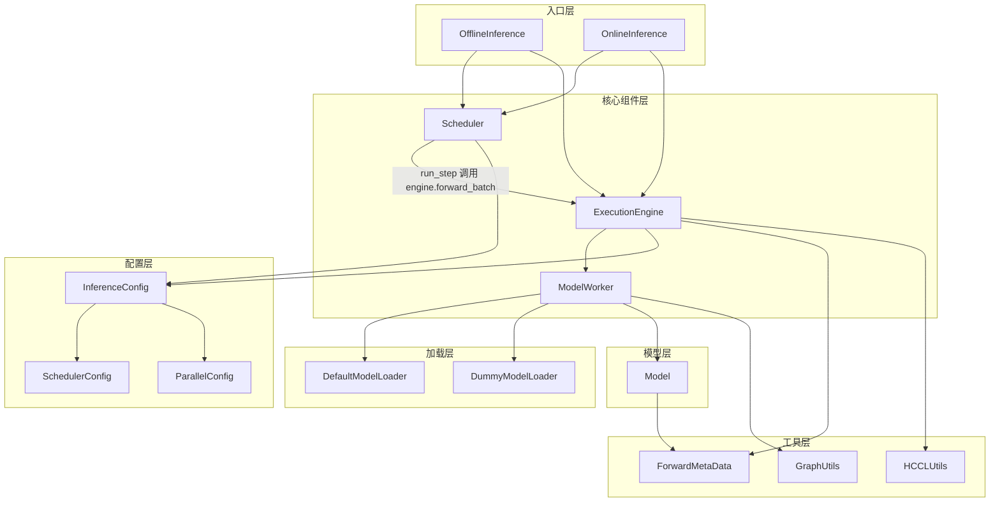
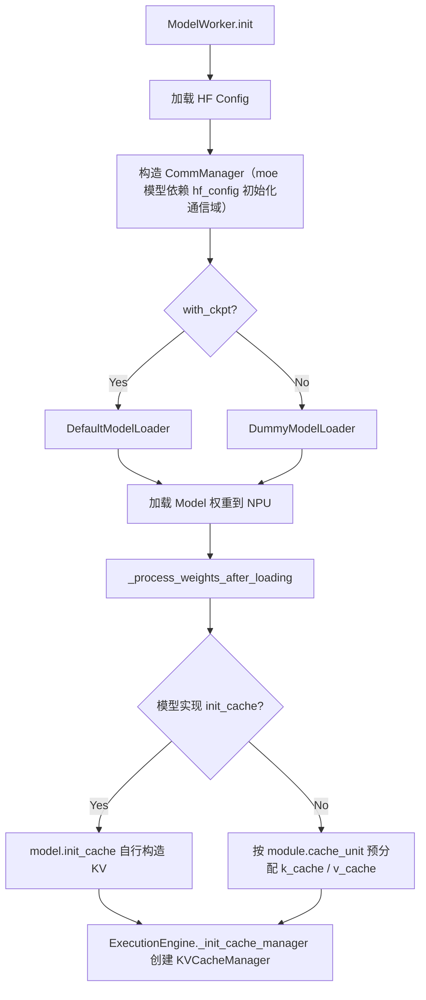
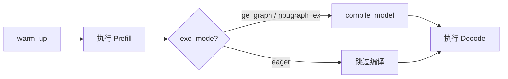
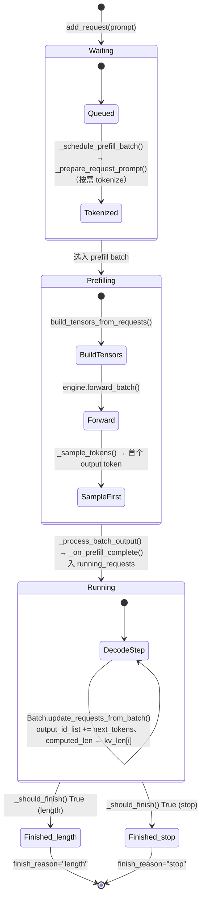

# 框架架构总览

本文档介绍 executor 中提供的模型执行的公共流程机制。该模块旨在统一模型执行流程，以避免不同模型需要适配大量的重复流程代码，从而将工作重点集中在模型本身的性能优化上。提供 offline 和 online 两种执行方式：

1. **offline 推理**：批处理模式，是框架的核心使用场景，按YAML 配置所有需要处理的 prompts，有确定的输入数据和调度，关注单步执行时间、吞吐与资源利用率，为性能分析和问题定位提供稳定的执行方式；
2. **online 推理**：Client-Server 服务模式，客户端通过 HTTP 发起请求并实时拿到结果。参考开源框架的简易在线功能，方便用 evalscope 等评测工具做精度评测；以 PD 分离的方式支持 Prefill / Decode 各自选用最优并行策略；保证基础功能，不做流程相关的性能优化。模型需按 [KV Cache 管理](kv_cache_design.md) 适配（offline 另提供非 KV Cache 管理机制）。

本文档介绍关键模块和主要流程、逻辑，细节专题见以下文档：
- [KV Cache 管理](kv_cache_design.md)
- [MTP 投机采样执行流程](mtp_design.md)
- [在线推理（PD 分离）执行机制](online_inference_design.md)

---

## 1. executor 目录结构

```
executor/
├── core/                  # 核心引擎组件
│   ├── config/            # 配置类（InferenceConfig、CommManager）
│   ├── engine/            # 执行引擎（ExecutionEngine）
│   ├── forward_data_info/ # 公共类型（Request、Batch 等）
│   ├── kv_cache/          # Paged KV cache 管理（KVCacheManager / BlockPool）
│   ├── model_worker/      # 模型 Worker（ModelWorker、MTPWorker）
│   └── scheduler/         # 调度器基类（Scheduler）
├── offline/               # 离线推理入口（OfflineInference）
├── online/                # 在线推理入口
│   ├── server.py          #   FastAPI HTTP 入口 + WorkerManager
│   ├── dp_dispatcher.py   #   DPDispatcher（父进程经 ZMQ 把请求派给 worker、收回 worker 算出的结果）
│   ├── online_inference.py#   OnlineInference 推理循环（继承 OfflineInference）
│   ├── router.py          #   PD Router
│   ├── bootstrap.py       #   PD Bootstrap server（rank table / dp_rank 路由）
│   ├── kv_transfer/       #   KV 传输（buffer / conn / transfer_engine / transfer_manager）
│   └── scheduler/         #   PD 调度器（PrefillDisaggScheduler / DecodeDisaggScheduler）
├── model_loader/          # 权重加载
├── scripts/               # 启动脚本（function.sh / set_env.sh / infer.sh）
└── utils/                 # 工具函数（forward_metadata、graph_utils、hccl_utils、profiler 等）
```

## 2. 模块依赖关系



---

## 3. 核心组件说明

### 3.1 InferenceConfig

统一配置容器，包含五个子配置：

```
InferenceConfig
├── DataConfig       # 数据集、序列长度上限等
├── ModelConfig      # 模型路径、执行模式（eager/graph）、MTP 等
├── ParallelConfig   # TP/DP/EP 并行规模、rank 信息
├── SchedulerConfig  # batch_size_per_dp_rank（每个 DP rank 的最大并发请求数）、max_new_tokens 等
└── DisaggConfig     # PD 分离运行时（disaggregation_mode、bootstrap_host/port、store_url、local_ip 等）
```

前四个由 YAML 加载，入口 `executor/core/config/inference_config.py`；`DisaggConfig` 由 `executor/online/server.py` 启动时按 CLI 参数构造（YAML 不含该字段）。

`disaggregation_mode` 取值：
- `NONE`：离线（默认）
- `PREFILL` / `DECODE`：在线 PD 分离的两种角色（见 §5）

### 3.2 CommManager

通信组管理器，分两阶段创建：模型计算用的 HCCL 组离线 / 在线都建，调度用的 Gloo 组只在 online 模式下追加。

**模型计算 HCCL 组**（`CommManager.initialize()`，由 `ModelWorker._build_comm_manager` 在权重加载前调用）：模型中各模块（attention / ffn / moe / embedding / lm_head 等）按 YAML 并行参数申请的 HCCL 组；具体所需的 HCCL 组随模型结构而异。

**调度用 Gloo 组**（`CommManager.init_cpu_groups()`，仅在 `OnlineInference.__init__` 中追加调用，用于在 DP leader 之间或 DP leader 与 TP worker 之间广播 / 同步 Python 对象，例如请求 dict、phase 标记）：

- `dp_leader_group`：跨 DP 组同步，各 DP 组内 `attn_tp_rank == 0` 的 rank 称为 **DP leader**，参与跨实例协商
- `tp_cpu_group`：DP 组内同步，DP leader 向同组其他 TP worker 广播请求

### 3.3 ModelWorker

模型执行的直接载体，持有：
- 模型实例（`self.model`）
- KV cache（`self.kv_cache`）
- 图编译后的执行图（`self.model_compiled`，graph 模式下）

核心方法：
- `init(model_cls, config_cls)`：初始化顺序为，加载 `hf_config` → 构造 `CommManager` → 加载权重
- `init_kvcache()`：分配 KV Cache
- `compile_model()`：图模式下编译执行图，由 `ExecutionEngine.warm_up()` 在执行完 dummy prefill 后调用
- `inference(model_inputs, is_prefill)`：执行单次 forward，返回 `(output, infer_time)`

**模型加载流程：**



**图编译流程：**



### 3.4 ExecutionEngine

框架的核心驱动层，连接 `Scheduler` 与 `ModelWorker`：
- `_build_model_inputs(batch)`：将 requests 拼装为 tensor 并构建 `position_ids` 与 `ForwardMetaData`；启用 paged KV cache 时（`kvcache_manager` 非空）额外通过 `prepare_block_tables` / `prepare_slot_mapping` 写入 `block_table` / `slot_mapping`
- `forward_batch(batch)`：依次调用 `_build_model_inputs` → `ModelWorker.inference` → `_sample_tokens` → `Batch.update_requests_from_batch`，把采样结果回写到 `Request`，并返回包含 `next_tokens` / `logits` / 推理耗时的 dict
- `warm_up()`：执行一次 dummy prefill + decode 触发算子预热；图模式下在 dummy prefill 后 dummy decode 前调用 `ModelWorker.compile_model` 编译 decode 阶段的执行图，减少运行时开销

> 日志：`executor/utils/logging_config.py` 中 `setup_logging()` 是统一入口，环境变量 `CANN_RECIPES_LOG_LEVEL`（默认 `INFO`）控制级别。

### 3.5 Scheduler

请求生命周期管理：



状态转换的关键接口：

| 转换 | 代码位置 |
|------|----------|
| Waiting → Prefilling | `_schedule_prefill_batch()`：从 `waiting_queue` 取出，按需 tokenize，创建 Batch |
| Prefilling → Running | `_process_batch_output()` → `_on_prefill_complete()`：`is_prefill_done=True`，加入 `running_requests` |
| Running → Finished | `_process_batch_output()` → `_should_finish()`：命中后设 `is_finished=True`、出 `running_requests`、入 `finished_requests`，并调用 `kvcache_manager.free(rid)` 与 `_on_request_finished` |

`_should_finish` 在 decode 阶段每步检查两类结束条件：

1. **遇到 EOS**：未设 `sampling_params.ignore_eos` 且最后一个 output token 为 `tokenizer.eos_token_id` 时，设置状态 `finish_reason="stop"`
2. **达到长度限制**：decode 步数达到 `max_new_tokens` 或 `sampling_params.max_tokens` 时，设置状态 `finish_reason="length"`

> 离线模式没有 DP 间的状态同步，需额外保证各 DP rank 步数对齐：上述两类条件命中后只回填 `finish_reason` 与 `valid_output_len`，请求仍走完 `max_new_tokens` 步；`generate()` 处理输出结果时按 `valid_output_len` 截掉提早结束后的填充 token。

### 3.6 KV Cache Manager

KV cache 采用 paged attention 三层结构，定义在 `executor/core/kv_cache/`：

| 层 | 职责 |
|------|------|
| `KVCacheManager` | 请求级总协调器，对接 Scheduler 的 slot 申请；跨 attention type 做一致性预检查后再分配 |
| `SingleTypeKVCacheManager` | 单一 attention type（Full / Sliding Window）的逻辑块管理：决定每请求所需 block、回收旧块、维护 block table |
| `BlockPool` | 物理 block 池：发放与回收 block id |

调度层通过 `manager.allocate_slots(request_id, computed_tokens, num_new_tokens, lookahead_tokens=0)` 申请 Block；模型读写时按 `block_table` / `slot_mapping` 索引到具体物理 Block。

详见 [kv_cache_design.md](kv_cache_design.md)。

---

## 4. 离线推理流程

离线推理是框架的主要使用场景，用于性能评测和模型验证。

### 4.1 启动方式

```bash
bash executor/scripts/infer.sh --model <model> --mode offline [--yaml <name>]
```

### 4.2 初始化时序图

`ExecutionEngine` 的初始化分两阶段：构造时只做设备/进程组就绪，真正的权重加载与 KV cache 分配由 `init()` 方法触发。

```
[infer.py]
    │
    ├─ 读取 YAML → 构建 InferenceConfig
    │
    └─ OfflineInference.__init__(config)
            │
            ├─ ExecutionEngine.__init__(config)            # Phase 1: 资源占位
            │       ├─ _init_device()                       #   绑定 NPU、init_process_group(hccl)
            │       ├─ ModelWorker(config, device)          #   仅构造，不加载模型
            │       └─ ProfilerManager()                    #   profiler 配置
            │
            ├─ ExecutionEngine.init(config_cls, main_model_cls, mtp_model_cls=None)  # Phase 2: 真正装载
            │       ├─ main_worker.init()                   #   加载 hf_config + 权重 → 构造 CommManager
            │       ├─ AutoTokenizer.from_pretrained()      #   加载 tokenizer
            │       └─ if cache_info: _init_cache_manager() #   paged：建 KVCacheManager + 块池
            │            else:        main_worker.init_kvcache()  # legacy：非paged方法分配 kv_cache
            │
            ├─ engine.warm_up()                             # dummy prefill + decode；图模式触发 compile_model
            │
            └─ Scheduler.__init__(tokenizer, config)        # 初始化请求队列
```

### 4.3 运行时时序图

```
[OfflineInference.generate(prompts)]
    │
    ├─ scheduler.add_request(prompt)  ×N   # 将所有 prompt 加入 waiting_queue
    │
    └─ 推理循环（while scheduler.has_work()）
            │
            ├─ scheduler.run_step(engine)
            │       │
            │       ├─ _schedule_batch()             # 优先 prefill，无 prefill 则 decode
            │       │       └─ 选择 requests → 创建 Batch 对象（不构建 tensors）
            │       │
            │       ├─ engine.forward_batch(batch)
            │       │       ├─ _build_model_inputs(batch)
            │       │       │       ├─ build_tensors_from_requests()  # 拼装 input_ids、seq_lens
            │       │       │       └─ 构建 position_ids、ForwardMetaData（内部调用 set_forward_metadata）
            │       │       ├─ ModelWorker.inference()  # 调用 model.forward()
            │       │       └─ _sample_tokens()            # argmax 采样
            │       │
            │       └─ _process_batch_output()       # 更新 request 状态，检查 EOS/max_len
            │
            └─ 收集 finished_requests → 解码输出文本
```

**关键数据流：**

```
waiting_queue[Request]
    │  (prompt str / token ids)
    ▼
Batch.input_ids [TotalTokens]                          ← Batch.build_tensors_from_requests()：torch.cat 串接
Batch.seq_lens [num_requests]                             prefill 各 prompt 串接，decode 每请求 1 token
    │
    ▼
ForwardMetaData { is_prefill, kv_len, attention_mask,  ← ExecutionEngine._build_model_inputs()：
                  actual_seq_lengths_kv/q (含 cu/list 变体),  内部 set_forward_metadata(...) 写入
                  prompt_tokens,
                  block_table, slot_mapping }            paged 模式下 block_table / slot_mapping
                                                         由 prepare_block_tables / prepare_slot_mapping 生成
    │
    ▼
model.forward(input_ids, position_ids, forward_metadata,  ← ModelWorker.inference() 调用
              slot_mapping, block_table, ...)              eager 或图模式（model_compiled）
    │
    ▼
logits [TotalTokens, vocab]                            （prefill 场景由 _sample_tokens 内部按
                                                         actual_seq_lengths 取每请求最后位置）
    │
    ▼
next_tokens [num_requests]                              ← ExecutionEngine._sample_tokens()：argmax
    │
    ▼
next_tokens_by_request {request_id → [token_id]}        ← Batch.update_requests_from_batch()：
                                                          同时回写 Request.output_id_list / Request.kv_len /
                                                          Request.infer_time
    │
    ▼
Scheduler._process_batch_output()                       ← 状态机推进：Prefilling → Running、
                                                          Running → Finished（按 EOS / max_new_tokens）
```

---

## 5. 在线推理流程（PD 分离）

在线推理走 **Prefill-Decode (PD) 分离**部署：prefill 与 decode 拆到独立服务实例，分别按各自最优策略部署（prefill 倾向 TP、decode 倾向 DP），避免合并部署时的策略折中。

代码层面 `disaggregation_mode ∈ {PREFILL, DECODE}` 即在线，`NONE` 即离线，没有prefill+decode 合并的在线模式。在线推理主要用于 benchmark 验证，不以吞吐为核心目标。

### 5.1 进程结构与组件

每节点由 `executor/online/server.py main()` 拉起一个父进程，父进程根据 `--role` 参数 spawn 出 N 个 worker 子进程（一卡一 worker）。父进程跑 FastAPI HTTP + `DPDispatcher`（通过 ZMQ 把请求派发给 worker，再把 worker 算出的结果收回父进程），worker 子进程跑 `OnlineInference` 推理循环（继承 `OfflineInference`）。

部署位置涉及两类 leader：

- **实例 leader**：一个 service instance（一组并行运行的 rank 构成的 Prefill 或 Decode 实例）内 `node_index == 0` 的节点，每个实例只有一个；承担实例级控制面入口（HTTP handler / DPDispatcher 都跑在它的父进程上），Prefill 实例 leader 还额外起 Bootstrap server 线程
- **DP leader**：单个 DP 组内 `attn_tp_rank == 0` 的 worker，每个 DP 组一个；DPDispatcher 在父进程侧分发请求时只对接 DP leader，组内其他 TP worker 通过 `tp_cpu_group` 接收 leader 广播的请求

四个 PD 专用组件分布在 `executor/online/` 下：

| 组件 | 文件 | 部署位置 | 职责 |
|------|------|----------|------|
| Router | `router.py` | 与 Prefill 实例 node 0 同机的独立进程 | 按 `bootstrap_room % N` 选 prefill/decode 实例并双发请求 |
| Bootstrap Server | `bootstrap.py` | Prefill 实例 leader 父进程的独立线程 | 提供 rank table 注册/查询、`bootstrap_room → dp_rank` 路由 |
| KVTransferManager | `kv_transfer/` | 每个 worker 子进程 | 控制面走 ZMQ，数据面走 RDMA / HCCL，metadata 直写对端 buffer |
| PD Scheduler | `scheduler/{prefill,decode}.py` | 每个 worker 子进程，替换基类 `Scheduler` | Prefill 完成后释放 KV；Decode 等待 KV 到齐后才进入计算 |

### 5.2 请求路径

```
Client ──POST /generate──▶ Router (prefill-node-0:8000)
                              │   注入 bootstrap_room / bootstrap_host / bootstrap_port
                              │
                              │   asyncio.gather 并发双发：
                              ├──▶ Prefill 实例 leader  ──▶ KV 经 RDMA 直发 Decode worker
                              │                              （HTTP 响应被 Router 丢弃）
                              │
                              └──▶ Decode 实例 leader   ──▶ 等 KV 到齐 + 完成 decode
                                       │
                                       ▼  HTTP response (主响应)
                                    Router
                                       │
                                       ▼
                                    Client
```

`bootstrap_room` 是请求级唯一 ID，prefill / decode 两侧用它关联同一请求。Router 用 `asyncio.gather` 并发 POST，等到 Decode 端 200 后取其响应 JSON 作为返回 body 透传给 Client；Prefill 端的 HTTP 响应在 Router 内被丢弃，仅用于检测后端是否在线（连接异常时 Router 抛 503）。

### 5.3 启动方式

启动通过 `executor/scripts/infer.sh` 调用 `executor/scripts/function.sh`：

```bash
# Prefill 节点（local IP 必须在 PREFILL_IPS 中）
bash executor/scripts/infer.sh --model <model> --mode online --pd-role prefill

# Decode 节点（local IP 必须在 DECODE_IPS 中）
bash executor/scripts/infer.sh --model <model> --mode online --pd-role decode
```

1. `PREFILL_IPS` 与 `DECODE_IPS` 由 `executor/scripts/set_env.sh` 维护；
2. 每角色用独立 YAML（`prefill.yaml` / `decode.yaml`），其 `parallel_config.world_size` 是**每实例** world size；
3. `PREFILL_IPS` 与 `DECODE_IPS` 不重叠时，可省略 `--pd-role`，shell 会从 local IP 自动推断角色；
4. 同机部署（PREFILL/DECODE 列表重叠）时必须显式传，并通过 `ASCEND_RT_VISIBLE_DEVICES` 隔离 NPU。

### 5.4 离线与在线的差异

离线与在线共用 `ExecutionEngine` / `ModelWorker` / 基类 `Scheduler`，差异集中在入口、调度与 KV 生命周期：

| 维度 | 离线（`NONE`） | 在线（`PREFILL` / `DECODE`） |
|------|----------------|-------------------------------|
| 请求来源 | YAML prompts 列表 | HTTP POST /generate（经 Router 双发） |
| 并发控制 | `generate()` 顺序处理 | asyncio + threading.Event 异步等待 |
| 进程结构 | torchrun 按 worker数启动进程 | 父进程 + N worker 子进程，每节点一组 |
| 父进程 ↔ worker | 无（同进程） | ZMQ：父 PUSH 请求、worker PUSH 结果 |
| Scheduler | 基类 `Scheduler`，prefill 优先 | `PrefillDisaggScheduler` / `DecodeDisaggScheduler`，按角色专一 |
| KV cache 生命周期 | 自身完整 | Prefill 端发完即可释放；Decode 端等到齐再用 |
| 跨实例通信 | 无 | Bootstrap server（HTTP 控制面） + KVTransferManager（ZMQ + RDMA/HCCL 数据面） |
| 性能目标 | 单步模型执行时间（核心指标） | 端到端可用性（benchmark 验证） |

> 进程拓扑、Bootstrap 协议、Router 路由规则、KVTransferManager 数据面、DPDispatcher / worker 进程模型、配置项与启动流程详见 [online_inference_design.md](online_inference_design.md)。

### 5.5 请求方式

提供的 http 请求接口：`/v1/completions`、`/v1/chat/completions`，如上文所述，Router 启动在 Prefill 实例 node 0 上，因此，Client的服务请求地址为：`https://prefill.node0.ip:8000`，其中端口8000由代码常量`ROUTER_HTTP_PORT`指定。请求方式如（在prefill首节点可直接用 `localhost`）：

```shell
# 单请求
curl -s -X POST http://localhost:8000/v1/chat/completions -H 'Content-Type: application/json' -d '{"model":"default","messages":[{"role":"user","content":"hello"}],"max_tokens":10}'

# 数据集评测
evalscope eval \
    --model default \
    --api-url http://localhost:8000/v1 \
    --datasets gsm8k \
    --eval-batch 32 \
    --generation-config '{"max_tokens":65535}'
```

> *当前尚未支持 temperature、top_k等采样参数*

---

## 6. 框架对模型的接口契约

新模型在 `models/<model_name>/` 下实现，executor/ 与模型通过两类接口耦合：模型必须提供的字段/方法，以及 executor/ 反向提供给模型的能力。本节只列契约；具体如何在 `models/` 下实现一个模型，参见各参考模型代码与 README。

### 6.1 模型必须提供

1. `model.forward(input_ids, position_ids, forward_metadata, **kwargs)`
   - `input_ids` 按 packed 布局拼装为一维 `[TotalTokens]`
   - `forward_metadata: ForwardMetaData` 携带 `is_prefill` / `kv_len` / `actual_seq_lengths_kv/q`（含 cu/list 变体）/ `attention_mask` / `prompt_tokens` / `block_table` / `slot_mapping` 等 attention 所需元数据
   - 模型侧 forward 必须返回 `logits` 或 `(logits, prev_hidden_states)`，后者用于 MTP draft model
   - 模型侧在 prefill 阶段返回的 logits 的 shape 是 `[batch_size, 1, vocab_size]`（模型内先取每请求最后位置再计算 lm_head）

2. KV cache 形状声明 (online 必须)：
   - 实现 `init_cache(device)`：`ModelWorker.init_kvcache` 会全权委托给模型构造 KV（paged 模型通常返回 paged-shape `past_key_values` 并自行挂载到各层）

3. `load_weights(weights_iterator)`：从 `DefaultModelLoader` 提供的 `(name, tensor)` 迭代器读权重并写入模型参数；自定义分片 / 格式转换在此完成。`ModelConfig.with_ckpt=False` 时启用 `DummyModelLoader`，跳过该调用并随机初始化。

### 6.2 框架提供的能力

| 能力 | 使用方式 |
|------|----------|
| 通信域创建 | 根据 yaml 配置文件中的e并行参数创建对应 HCCL 通信域 |
| Paged KV cache | `KVCacheManager` 按 `cache_info` 申请块；attention forward 按 `block_table` / `slot_mapping` 索引 |
| Packed Sequence | 唯一输入布局：`Batch.input_ids` 始终为 `[TotalTokens]` 一维；
| 图编译 | `ModelConfig.exe_mode ∈ {ge_graph, npugraph_ex}` 开启；`ExecutionEngine.warm_up()` 在 dummy prefill 后调用 `compile_model()`；模型需保证输入 shape 静态 |
| Profiler | `ModelConfig.enable_profiler=True` 开启；`ProfilerManager` 自动插入 profiling 桩 |
