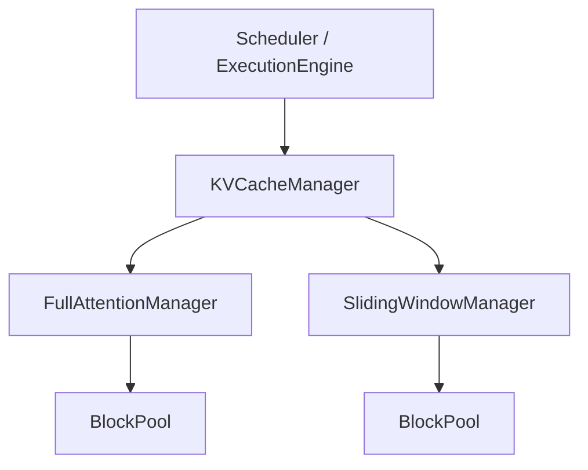
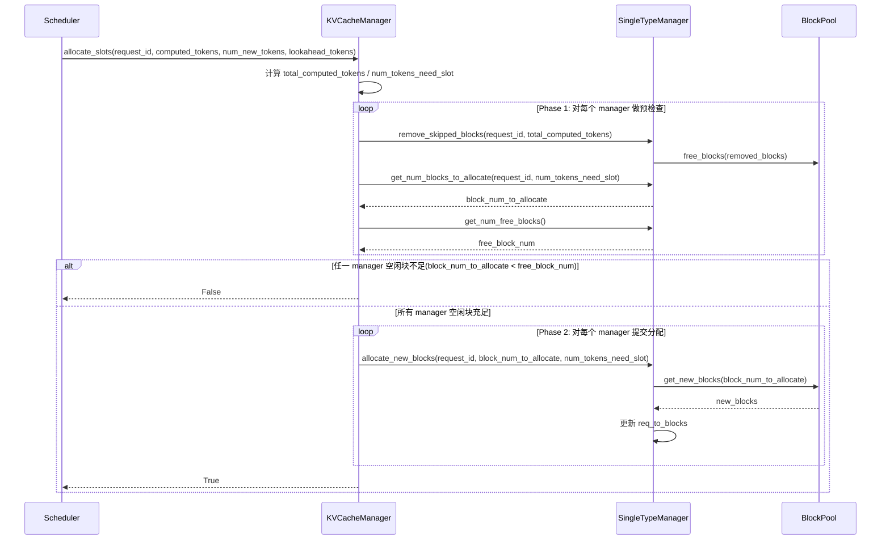
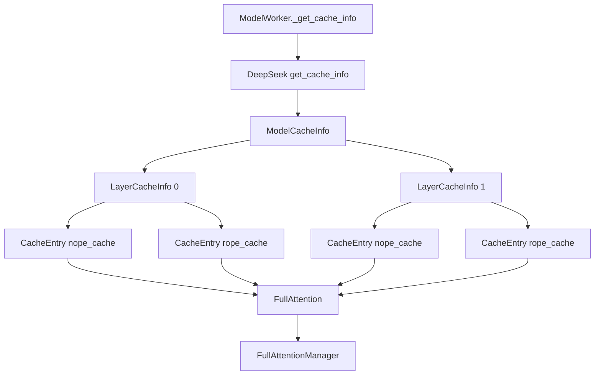

# KV Cache 管理设计文档

## 1. 概述

本文档描述了 LLM 推理框架中 KV Cache 管理的设计与实现。该模块采用 **Paged Attention** 技术，将 KV Cache 以块（Block）为单位进行管理，并兼容不同 attention 类型的块分配策略，实现高效的内存复用和并发请求支持。

### 1.1 核心目标

- **内存效率**：通过分块管理避免为每个请求预分配完整序列长度的内存
- **并发支持**：多请求共享有限的 NPU 内存资源
- **灵活适配**：支持多种注意力机制（Full Attention、Sliding Window Attention）

### 1.2 模块目录结构

```
executor/core/kv_cache/
├── __init__.py              # 模块导出
├── kv_cache_manager.py      # 顶层协调器 KVCacheManager
├── single_type_kv_cache_manager.py  # 单类型管理器
├── block_pool.py            # 底层块池 BlockPool
├── cache_info.py            # Cache 元数据结构
└── cache_utils.py           # 辅助工具函数
```

---
## 2. 三层结构设计

### 2.1 总体分层

KV cache 管理采用三层结构：

1. `KVCacheManager`
   请求级总协调器，负责跨类型的一致性分配。
2. `SingleTypeKVCacheManager`
   单一 attention type 的逻辑块管理器，负责决定某个请求在该类型下需要多少 block、何时回收旧 block、如何组织 block table。
3. `BlockPool`
   物理 block 池，负责具体 block id 的发放和回收。

可以用下图表示：



### 2.2 第一层：KVCacheManager

`KVCacheManager` 是请求级入口，面向调度层提供统一接口。

**定义位置**：[kv_cache_manager.py](../../executor/core/kv_cache/kv_cache_manager.py)

核心职责如下：

1. 统一接收调度层的 slot 申请请求。
2. 将一次请求的分配广播到所有 `single_type_managers`。
3. 在真正分配前完成一次全局可分配性检查，避免部分 attention type 分配成功、部分失败。
4. 提供 request 维度的 block 查询与整体释放能力。

其核心接口包括：

- `allocate_slots(request_id, computed_tokens, num_new_tokens, lookahead_tokens=0)`
- `get_block_ids(request_id)`
- `free(request_id)`

其中 `allocate_slots` 的关键点是”两阶段处理”（具体实现可见：[块分配核心流程](#3-块分配核心流程allocate_slots)）：

1. 预检查阶段。
   对每个 Manager 先执行旧块回收，再计算本次需要的新块数量；若任一 Manager 空闲块不足，则整体返回失败。
2. 分配阶段。
   只有当所有 Manager 都满足条件时，才逐个执行真实分配，避免部分分配导致资源不一致。


### 2.3 第二层：SingleTypeKVCacheManager

`SingleTypeKVCacheManager` 抽象”某一种 attention type 的 block 管理策略”。

**定义位置**：[single_type_kv_cache_manager.py](../../executor/core/kv_cache/single_type_kv_cache_manager.py)

其内部成员包括：

- `attn_type`：当前 manager 所属的 attention 类型。
- `block_pool`：该类型对应的物理 block 池。
- `block_size`：每个 block 容纳的 token 数。
- `max_model_len`：模型总长度上限。
- `_null_block`：空洞占位 block，用于逻辑对齐。之所以需要单独设置 `null_block`，是因为相关算子要求 block table 中必须存在合法的 block 索引；因此实现上会额外申请一个 block 作为占位，但该 block 不承载真实的 cache 数据读写。
- `req_to_blocks`：`request_id -> block_id 列表` 的映射字典，记录每个请求使用的block ids。

通用接口包括：

1. `get_num_blocks_to_allocate`
   计算某个请求当前需要新增多少 block。
2. `allocate_new_blocks`
   从 `BlockPool` 获取真实 block，并写入 `req_to_blocks`。
3. `remove_skipped_blocks`
   回收已不再需要保留的旧 block，识别请求已经滑出有效注意力范围的 block，将这些位置替换为 `_null_block`，并把对应物理 block 归还给 `BlockPool`。
4. `free`
   请求结束时释放该 request 在当前 attention type 下的全部 block。

需要子类实现的抽象方法：

5. `get_num_skipped_tokens(num_computed_tokens)`
   计算可跳过分配的 token 数。基类抛出 `NotImplementedError`，子类必须实现此方法：
   - `FullAttentionManager`：始终返回 0，全注意力机制无需跳过任何 token。
   - `SlidingWindowManager`：返回 `max(0, num_computed_tokens - sliding_window + 1)`，滑窗外的历史 token 可被跳过。
6. `validate_and_build_kwargs(group_entries)`【静态方法】
   验证并构建 manager 实例化所需的类型特定参数。基类抛出 `NotImplementedError`，子类必须实现此方法：
   - `FullAttentionManager`：无需额外参数，返回空字典 `{}`。
   - `SlidingWindowManager`：从 `CacheEntry` 中提取并校验 `sliding_window` 参数。

根据管理**注册表**，可以选择Attention类对应的 cache 管理策略：

```python
ATTN_TYPE_MANAGER_MAP = {
    "FullAttention": FullAttentionManager,
    "SlidingWindow": SlidingWindowManager,
}
```
目前已实现两类具体的**派生类型**：

| 类名 | 说明 | 定义位置 |
|------|------|----------|
| `FullAttentionManager` | 全注意力，块随序列增长线性追加 | [single_type_kv_cache_manager.py](../../executor/core/kv_cache/single_type_kv_cache_manager.py) |
| `SlidingWindowManager` | 滑动窗口注意力，支持过期块回收 | [single_type_kv_cache_manager.py](../../executor/core/kv_cache/single_type_kv_cache_manager.py) |

#### 2.3.1 FullAttentionManager

`FullAttentionManager` 直接复用基类逻辑，特点是：

1. 逻辑 block 数量等于 `ceil(num_tokens / block_size)`。
2. 请求随着 token 增长持续追加物理内存块 block。

需实现的抽象方法：

- `get_num_skipped_tokens(_num_computed_tokens)`：返回 0，全注意力机制无需跳过任何 token。
- `validate_and_build_kwargs(_group_entries)`：返回空字典 `{}`，无额外参数。


#### 2.3.2 SlidingWindowManager

`SlidingWindowManager` 在基类上增加滑窗逻辑，目标是在逻辑位置保持对齐的同时，只为有效窗口保留真实物理 block。

其关键设计点如下：

1. 由于算子约束，逻辑块表 `block_table` 长度要求与 `ceil(kv_len / block_size)` 对齐，因此即使窗口左侧的历史 token 已经失效，这部分逻辑 block 位置仍然需要保留，所以让失效的历史 block 不再占用真实物理块，而是用 `_null_block` 占位。
2. prefill 时只为有效窗口部分分配真实 block，但会在块表头部补齐若干 `_null_block`。
3. decode 时随着 `num_computed_tokens` 增长，通过 `remove_skipped_blocks` 逐步把滑窗之外的 block 置为 `_null_block` 并回收到池中。

`SlidingWindowManager` 额外实现了：

- `_get_logical_block_layout(num_tokens)`
- `get_num_blocks_to_allocate(...)`
- `allocate_new_blocks(...)`
- `get_num_skipped_tokens(num_computed_tokens)`：返回 `max(0, num_computed_tokens - sliding_window + 1)`。
- `validate_and_build_kwargs(group_entries)`【静态方法】：提取并校验 `sliding_window` 参数。

这使得滑窗类 attention 可以兼顾“逻辑位置连续”与“物理存储压缩”。

### 2.4 第三层：BlockPool

`BlockPool` 是最底层的物理资源管理器，只关心 block id 的生命周期。

**定义位置**：[block_pool.py](../../executor/core/kv_cache/block_pool.py)

内部成员包括：

- `num_blocks`：总 block 数。
- `block_size`：block 大小。
- `_free_block_queue`：空闲 block 队列，负责按顺序发放 block。
- `_free_block_set`：空闲 block 集合，负责快速校验重复释放。
- `_null_block`：保留的占位 block。

其关键设计点如下：
- 使用 `deque` + `set` 双结构：队列保证 FIFO 分配顺序，集合支持 O(1) 重复释放检测。
- `_null_block`：该 block 是为了满足算子约束而额外申请的保底占位 block，不参与正常 cache 存储，可以用于表示逻辑上不存在物理块的位置（如滑动窗口的无效区域）。

其核心行为如下：

1. 初始化时，先创建 `0 ~ num_blocks-1` 的 block 队列。
2. 从队列头取出一个 block 作为 `_null_block`，该 block 不参与正常分配，也不承载实际 KV 数据；它仅用于满足算子约束下的占位需求。
3. `get_new_blocks(n)` 从空闲队列中依次弹出 `n` 个 block 并返回。
4. `free_blocks(blocks)` 将释放的 block 重新追加回空闲队列末尾。

---

## 3. 块分配核心流程：allocate_slots

`allocate_slots` 是整个 KV cache 管理链路里的核心入口，它的设计重点是逐请求地进行不同 attention type 的块分配。调度层只需要关心当前请求是否还能继续推进，而 `KVCacheManager` 负责把这一请求广播到所有 `SingleTypeKVCacheManager`，分别计算所需块数、回收可跳过块，并在真正分配前完成一次整体可分配性检查。

### 3.1 输入参数含义

`KVCacheManager.allocate_slots(request_id, computed_tokens, num_new_tokens, lookahead_tokens=0)` 中各入参的含义为：

- `request_id`：请求唯一标识。
- `computed_tokens`：当前请求已经计算完成的 token 数。
- `num_new_tokens`：本轮需要继续为该请求预留 slot 的新增 token 数。
- `lookahead_tokens`：在 `num_new_tokens` 之外额外预留的 token 数，用于 speculative decoding 等需要提前占位的场景。

函数内部首先构造两个关键量：

1. `total_computed_tokens = min(computed_tokens, max_model_len)`
   表示当前已经实际计算过并纳入 Cache 管理的token数，可用于判断 skipped block 的 token 数。
2. `num_tokens_need_slot = min(computed_tokens + num_new_tokens + lookahead_tokens, max_model_len)`
   表示本次分配后需要 block 覆盖到的总 token 范围。

### 3.3 两阶段实现流程

#### 3.3.1 预检查阶段

预检查阶段是整个分配逻辑最关键的部分，它确保分配前先收敛状态。对`KVCacheManager` 中每个 `SingleTypeKVCacheManager`，依次执行：

1. `remove_skipped_blocks(request_id, total_computed_tokens)`
   如果该 attention type 存在可以释放的无用内存块，则先回收这部分 block。
2. `get_num_blocks_to_allocate(request_id, num_tokens_need_slot)`
   根据 `num_tokens_need_slot` 和当前请求已持有的 block 数，计算本轮还需新增多少 block。通用逻辑可以表示为：
   ```text
   required_block_num = ceil(num_tokens_need_slot / block_size)
   existing_block_num = len(req_to_blocks.get(request_id, []))
   block_num_to_allocate = max(0, required_block_num - existing_block_num)
   ```
3. `get_num_free_blocks()`
   查看 `BlookPool` 中空闲块的数量。

若任何一个 manager 的空闲块数少于需要新增的块数，则顶层立刻返回 `False`，该请求在本次迭代中不会发生任何新的 block 分配。

#### 3.3.2 分配阶段

只有全部 manager 都通过预检查，才进入分配阶段，此时 `KVCacheManager` 会再次遍历 managers，从 `BlockPool` 申请块并更新 request 对应的 block table。：

```text
allocate_new_blocks(request_id, block_num_to_allocate, num_tokens_need_slot)
```

#### 3.4 allocate_slots 时序图

通过时序图展示这两个阶段的协作关系：

---

## 4. 辅助模块

辅助模块包括 `cache_info.py` 和 `cache_utils.py`。`cache_info.py` 定义 KV cache 的元数据结构，`cache_utils.py` 负责初始化校验、资源分配以及运行期输入准备。

### 4.1 CacheInfo

`cache_info.py` 定义了三层元数据结构：

**定义位置**：[cache_info.py](../../executor/core/kv_cache/cache_info.py)

- `CacheEntry`
  描述单个 cache 条目，包括 `cache_name`、`attn_type`、`dim`、`num_head`、`dtype`、`tensor_setter` 和 `needs_block`；Sliding Window 场景下还包含 `sliding_window`。
- `LayerCacheInfo`
  按 layer 聚合多个 `CacheEntry`。
- `ModelCacheInfo`
  汇总全模型 cache 信息，包括 `num_layers`、`block_size` 和所有层的 `LayerCacheInfo`。

`CacheEntry.attn_type` 决定 cache 条目映射到哪一类 `SingleTypeKVCacheManager`。分组维度是 `attn_type` ，因此本框架支持单层同时包含多个 cache 条目，也支持单层同时包含**多种 cache 类型**。

`ModelCacheInfo` 在模型侧构建。执行链路为：`ModelWorker._get_cache_info()` 调用模型对象的 `get_cache_info()`，由具体模型实现返回自身的 cache 元数据。

以 DeepSeek-R1 的 [modeling_deepseek.py](../../models/deepseek_r1/models/modeling_deepseek.py) 为例，`get_cache_info()` 会遍历 `self.model.layers`，从每层 `self_attn` 中取出 `nope_cache` 和 `rope_cache`，并构造 `LayerCacheInfo`。每层包含两个 `CacheEntry`：

1. `nope_cache`
   `attn_type="FullAttention"`，`dim=self.config.kv_lora_rank`，`num_head=1`。
2. `rope_cache`
   `attn_type="FullAttention"`，`dim=self.config.qk_rope_head_dim`，`num_head=1`。

二者虽然是不同的 cache 条目，但 `attn_type` 相同，因此会被归入同一个 manager 统一管理。其层级关系如下：



### 4.2 CacheUtils

`cache_utils.py` 提供以下工具函数：

**定义位置**：[cache_utils.py](../../executor/core/kv_cache/cache_utils.py)

- `validate_cache_info()`
  校验 cache 元数据合法性。
- `calculate_block_num()`
  计算各 attention type 的 block 数量。
- `allocate_cache_tensors()`
  根据 block 规划结果分配底层 cache tensor。
- `prepare_block_tables()`
  根据各 request 的 block table 构造批次 `block_table`。
- `prepare_slot_mapping()`
  根据 `position_ids` 和 `block_table` 生成 `slot_mapping`。

#### 4.2.1 详解 calculate_block_num()
`calculate_block_num()` 会计算要给每种 `attn_type` 对应的 `SingleTypeKVCacheManager` 分配多少 block 数量。
它会先按 `attn_type` 将 cache 分成两类，再分别计算 `block_num`：

**1. 固定 block 数的 `attn_type`**
   这类 `attn_type` 需要的 cache 数据不随着请求总长度线性增长，例如 `SlidingWindow` 只需要窗口长度的 cache，因此只给其分配固定大小的 block。代码中通过 `FIXED_BLOCK_ATTN_TYPES` 对这类 `attn_type` 进行标识。
   当前典型例子是 `SlidingWindow`。对其 `block_num` 的计算思路是先为单个请求估算“窗口内最多需要保留多少真实 block”，再乘以最大并发数 `batch_size_per_dp_rank`。具体计算为：
   ```text
   fixed_block_num =
       max_concurrency *
       (ceil((sliding_window + 2 * next_n) / block_size) + 1) + 1
   ```
   其中，
   - sliding_window + 2 * next_n 是用于每个请求在一次迭代内最多会使用的 cache 大小，2 * next_n 为 [MTP 场景](mtp_design.md)下，主模型与小模型共同需要额外使用的 cache 空间；
   - 1 个用于每个请求覆盖滑动窗口跨 block 边界时的额外保留需求；
   - 最后的 1 个用于 `null_block` 占位。

**2. 非固定 block 数的 `attn_type`**
   这类 `attn_type` 需要的 cache 数据随着请求总长度线性增长，例如 `FullAttention`，MLA、MHA、GQA等全注意力都属于`FullAttention`。
   在计算这类 `attn_type` 的所需 block 数时：
   - 在离线推理模式下可以直接根据固定的最大长度计算：
      ```text
      block_num_per_request = ceil(offline_max_len / block_size)
      total_block_num = block_num_per_request * max_concurrency + 1
      ```
      这里额外的 `+1` 同样用于 `null_block` 占位。

   - 在在线推理模型下，则先统计所有这类 cache 的 `per_token_bytes`，再用**剩余显存**预算换算出可支持的最大 token 数，最后再折算为 block 数。伪代码如下：
      ```text
      per_token_bytes = sum(cache.dim * cache.num_head * dtype_size(cache.dtype))
      available_memory = available_kv_memory * kv_cache_mem_ratio - fixed_block_memory_bytes

      max_tokens = floor(available_memory / per_token_bytes)
      non_fixed_block_num = floor(max_tokens / block_size)

      for attn_type in paged_attn_types:
         block_num_by_type[attn_type] = non_fixed_block_num + 1
      ```
      其中额外的 `+1` 用于预留 `null_block`。

整体上，`calculate_block_num()` 的顺序是：先为固定 block 类 cache 预留内存，再用剩余内存估算非固定 block 类 cache 的 block 数；这样可以避免 SWA 这类必须预留的 cache 挤占后续计算时出现不确定性。

#### 4.2.2 构建 block_table 与 slot_mapping

`prepare_block_tables()` 和 `prepare_slot_mapping()` 的输出均为字典结构，键为 `attn_type`，值为对应的`block_tables / slot_mapping` 张量，即：

- `block_tables[attn_type] = block_table_tensor`
- `slot_mapping[attn_type] = slot_mapping_tensor`

这种形式与多 attention type 的设计一致，推理运行时可以按 `attn_type` 取出对应的 `block_table` 和 `slot_mapping`。

---

## 5. 新模型适配 Cache 管理的 Checklist

本文档提供新模型接入 KV Cache 管理框架的完整步骤清单，涵盖必选和可选任务，帮助开发者定位具体代码位置。

### 5.1 分析模型 Attention 形态【必选】

#### 5.1.1 确定每个 cache 的 `attn_type`

在模型 attention 类中，分析每个 cache 的特性并确定其归属类型：

| 支持的 `attn_type` | 对应 Manager 类 | 特性说明 |
|-------------------|----------------|---------|
| `FullAttention` | `FullAttentionManager` | 全注意力，cache 随序列增长线性追加 |
| `SlidingWindow` | `SlidingWindowManager` | 滑动窗口注意力，支持过期块回收 |

**检查位置**：[single_type_kv_cache_manager.py](../../executor/core/kv_cache/single_type_kv_cache_manager.py) 的 `ATTN_TYPE_MANAGER_MAP`：
```python
ATTN_TYPE_MANAGER_MAP: Dict[str, Type[SingleTypeKVCacheManager]] = {
    "FullAttention": FullAttentionManager,
    "SlidingWindow": SlidingWindowManager,
}
```

**判断逻辑**：
- 若模型使用标准 MHA/MQA/GQA/MLA 等全注意力机制，使用 `"FullAttention"`
- 若模型使用滑动窗口注意力（如 gpt-oss），使用 `"SlidingWindow"`，需额外设置 `sliding_window` 参数
- 若现有 `ATTN_TYPE_MANAGER_MAP` 不满足需求，参考步骤 3 新增 SingleTypeKVCacheManager 类


### 5.2 在模型中配置 Cache 信息【必选】

#### 5.2.1 定义 cache 变量

在 attention 类的 `__init__()` 中，为每个 cache 定义占位 tensor，用于存放每一层的 cache 数据：

**示例代码位置**：[modeling_deepseek.py](../../models/deepseek_r1/models/modeling_deepseek.py) ：
```python
self.nope_cache = torch.Tensor([])
self.rope_cache = torch.Tensor([])
```

#### 5.2.2 创建 `CacheEntry` 实例列表

在 attention 类的 `__init__()` 中，为每个 cache 创建 `CacheEntry` 实例并存入列表 `self.cache_entries`。

**关键参数说明**（参见 [cache_info.py](../../executor/core/kv_cache/cache_info.py)）：

| 参数 | 说明 |
|-----|------|
| `cache_name` | cache 名称，如 `"k_cache"`、`"v_cache"`、`"nope_cache"` |
| `attn_type` | attention 类型，从步骤 1 确定 |
| `dim` | 单个 attention head 的特征维度 |
| `num_head` | cache 包含的 head 数量（注意考虑 TP 切分后的实际 head 数） |
| `dtype` | cache tensor 数据类型，如 `torch.bfloat16`、`torch.int8` |
| `needs_block` | 是否参与 block 分配，通常为 `True` |
| `tensor_setter` | 回调函数，用于将分配的 cache tensor 注册到 attention 类 |
| `sliding_window` | 仅 `SlidingWindow` 类型需要，设置窗口大小 |

**示例代码位置**：[modeling_deepseek.py](../../models/deepseek_r1/models/modeling_deepseek.py)：
```python
self.cache_entries = [
    CacheEntry(
        cache_name="nope_cache",
        attn_type=self.attn_type,
        dim=self.config.kv_lora_rank,
        num_head=1,
        dtype=dtype_nope,
        needs_block=True,
        tensor_setter=lambda tensor, layer=self: setattr(layer, "nope_cache", tensor),
    ),
    CacheEntry(
        cache_name="rope_cache",
        attn_type=self.attn_type,
        dim=self.config.qk_rope_head_dim,
        num_head=1,
        dtype=dtype_rope,
        needs_block=True,
        tensor_setter=lambda tensor, layer=self: setattr(layer, "rope_cache", tensor),
    ),
]
```

#### 5.2.3 遍历所有层构建 `ModelCacheInfo`

在模型类（如 `DeepseekV3ForCausalLM`）中实现 `get_cache_info()` 方法。

**核心逻辑**：
1. 遍历 `self.model.layers`
2. 对每个层取出`CacheEntry` 实例列表 `layer.self_attn.cache_entries`
3. 封装为 `LayerCacheInfo` 并加入列表
4. 将 `LayerCacheInfo` 列表封装为 `ModelCacheInfo` 实例并返回

**示例代码位置**：[modeling_deepseek.py](../../models/deepseek_r1/models/modeling_deepseek.py)：
```python
def get_cache_info(
    self,
) -> ModelCacheInfo:
    layers = self.model.layers if not self.is_mtp else self.model.layers.values()
    layer_infos = []
    for layer_idx, layer in enumerate(layers):
        layer_infos.append(
            LayerCacheInfo(
                layer_idx=layer_idx,
                caches=list(layer.self_attn.cache_entries),
            )
        )

    return ModelCacheInfo(
        num_layers=len(layer_infos),
        block_size=self.block_size,
        layer_infos=layer_infos,
    )
```

**注意**：确保模型类持有 `block_size`，在模型类 `__init__()` 中保存 `block_size`，供 `get_cache_info()` 使用：

```python
self.block_size = infer_config.scheduler_config.block_size
```

### 5.3 新增 `SingleTypeKVCacheManager` 子类【可选】

仅在现有 `ATTN_TYPE_MANAGER_MAP` 无法满足新 cache 类型需求时执行。

#### 5.3.1 新建 Manager 子类

**位置**：[single_type_kv_cache_manager.py](../../executor/core/kv_cache/single_type_kv_cache_manager.py)

**需要实现的函数**：

| 函数名 | 说明 |
|-------|------|
| `get_num_blocks_to_allocate(request_id, num_tokens)` | 计算本次需要新增多少 block |
| `allocate_new_blocks(request_id, block_num_to_allocate, num_tokens)` | 执行真实 block 分配，更新 `req_to_blocks` |
| `get_num_skipped_tokens(num_computed_tokens)` | 计算可跳过分配的 token 数 |
| `remove_skipped_blocks(request_id, total_computed_tokens)` | 【可选】重写，用于特殊回收机制 |
| `validate_and_build_kwargs(group_entries)` | 【静态方法】用于从 `CacheEntry` 提取和校验类型特定参数 |

**参考实现**：[single_type_kv_cache_manager.py](../../executor/core/kv_cache/single_type_kv_cache_manager.py) 的 `FullAttentionManager`、`SlidingWindowManager`

#### 5.3.2 注册到 `ATTN_TYPE_MANAGER_MAP`

**位置**：[single_type_kv_cache_manager.py](../../executor/core/kv_cache/single_type_kv_cache_manager.py)

```python
ATTN_TYPE_MANAGER_MAP: Dict[str, Type[SingleTypeKVCacheManager]] = {
    "FullAttention": FullAttentionManager,
    "SlidingWindow": SlidingWindowManager,
    "NewAttentionType": NewAttentionManager,  # 新增
}
```

### 5.4 扩展 `calculate_block_num()`【可选】

仅在新增 Manager 且现有 block 计算逻辑不满足需求时执行。

`calculate_block_num()`会在 cache 管理初始化对每个 `attn_type` 分配 block 内存块，如果新增了 Manager，需要检查或新增分配逻辑。

#### 5.4.1 判断是否属于固定 block 类型

判断新增的 Manager 属于哪一种类型：
- 固定 block 类型：block 数不随序列长度增长（如 SlidingWindow）
- 非固定类型：block 数随序列长度线性增长（如 FullAttention）

#### 5.4.2 固定 block 类型：扩展 `calculate_fixed_block_memory_bytes()`

若新增固定 block 类型，首先在[cache_utils.py](../../executor/core/kv_cache/cache_utils.py) 的 `FIXED_BLOCK_ATTN_TYPES`中新增该 `attn_type`：

```python
FIXED_BLOCK_ATTN_TYPES = {"SlidingWindow", "NewFixedBlockType"}  # 新增
```

然后需要在[cache_utils.py](../../executor/core/kv_cache/cache_utils.py) 的 `calculate_fixed_block_memory_bytes()`函数中补充计算逻辑：

```python
if "NewFixedBlockType" in cache.attn_type:
    # 计算该类型的 fixed_block_num
    fixed_block_num = ...
else:
    raise AttributeError(...)
```

#### 5.4.3 确保 `calculate_block_num()` 正确处理

**位置**：[cache_utils.py](../../executor/core/kv_cache/cache_utils.py)

若新增非固定 block 类型，检查现有的 block 计算逻辑是否满足新 Manager 需求。


### 5.5 在 Attention forward 中接入 `block_table` / `slot_mapping`【必选】

#### 5.5.1 从 `forward_metadata` 获取 block 信息

`block_table` 和 `slot_mapping` 存储在 `forward_metadata` 中，均为 `Dict[str, torch.Tensor]` 结构：

**生成位置**：
- [cache_utils.py](../../executor/core/kv_cache/cache_utils.py)：`prepare_block_tables()`
- [cache_utils.py](../../executor/core/kv_cache/cache_utils.py)：`prepare_slot_mapping()`

**数据结构**：
```python
block_tables = forward_metadata.block_table  # Dict[attn_type, Tensor]
slot_mapping = forward_metadata.slot_mapping  # Dict[attn_type, Tensor]
```

#### 5.5.2 按 `attn_type` 取出对应 tensor

在 attention forward 中，使用 `self.attn_type` 作为 key：

```python
block_table = forward_metadata.block_table[self.attn_type]
slot_mapping = forward_metadata.slot_mapping[self.attn_type]
```

**注意事项**：
- 同一层多个 cache（如 `k_cache` 和 `v_cache`）共享相同的 `attn_type`，使用同一份 `block_table` 和 `slot_mapping`
- 若一层包含多种 `attn_type` 的 cache，需分别取出对应的 tensor

### 5.6 验证完整链路【必选】

#### 5.6.1 初始化链路验证

以 [execution_engine.py](../../executor/core/engine/execution_engine.py) 的 `_init_cache_manager()` 函数为主线：

| 步骤 | 函数位置 | 验证内容 |
|-----|---------|---------|
| 1 | `ModelWorker.get_cache_info()` → [model_worker.py](../../executor/core/model_worker/model_worker.py) | 模型正确返回 `ModelCacheInfo` |
| 2 | `validate_cache_info()` → [cache_utils.py](../../executor/core/kv_cache/cache_utils.py) | cache 元数据合法 |
| 3 | `calculate_block_num()` → [cache_utils.py](../../executor/core/kv_cache/cache_utils.py) | 各类型 block 数正确计算 |
| 4 | `allocate_cache_tensors()` → [cache_utils.py](../../executor/core/kv_cache/cache_utils.py) | cache tensor 正确分配 |
| 5 | `create_single_type_managers()` → [single_type_kv_cache_manager.py](../../executor/core/kv_cache/single_type_kv_cache_manager.py) | Manager 正确创建 |
| 6 | `KVCacheManager(...)` → [kv_cache_manager.py](../../executor/core/kv_cache/kv_cache_manager.py) | 顶层 Manager 初始化完成 |

#### 5.6.2 运行期链路验证

| 步骤 | 函数位置 | 验证内容 |
|-----|---------|---------|
| 1 | `KVCacheManager.allocate_slots()` → [kv_cache_manager.py](../../executor/core/kv_cache/kv_cache_manager.py) | 能成功分配 block |
| 2 | `prepare_block_tables()` → [cache_utils.py](../../executor/core/kv_cache/cache_utils.py) | `block_table` 正确生成 |
| 3 | `prepare_slot_mapping()` → [cache_utils.py](../../executor/core/kv_cache/cache_utils.py) | `slot_mapping` 正确生成 |
| 4 | 模型前向 | 能正确消费对应 `attn_type` 的 block 信息 |

**关键调用点**：
- Prefill 阶段：[scheduler.py](../../executor/core/scheduler/scheduler.py) 的 `_schedule_prefill_batch()` 调用 `allocate_slots`
- Decode 阶段：[scheduler.py](../../executor/core/scheduler/scheduler.py) 的 `_schedule_decode_batch()` 调用 `allocate_slots`
- Engine 构建：[execution_engine.py](../../executor/core/engine/execution_engine.py) 的 `_build_model_inputs()` 调用 `prepare_block_tables` 和 `prepare_slot_mapping`

#### 5.6.3 释放链路验证

| 步骤 | 函数位置 | 验证内容 |
|-----|---------|---------|
| 1 | `KVCacheManager.free()` → [kv_cache_manager.py](../../executor/core/kv_cache/kv_cache_manager.py) | 请求结束时正确释放 block |
| 2 | `SingleTypeKVCacheManager.free()` → [single_type_kv_cache_manager.py](../../executor/core/kv_cache/single_type_kv_cache_manager.py) | 各类型 Manager 正确释放 |
| 3 | `BlockPool.free_blocks()` → [block_pool.py](../../executor/core/kv_cache/block_pool.py) | block 正确回收，无重复释放 |

**调用点**：[scheduler.py](../../executor/core/scheduler/scheduler.py) 的 `_process_batch_output()` 在请求完成时调用 `kv_cache_manager.free(request.request_id)`
