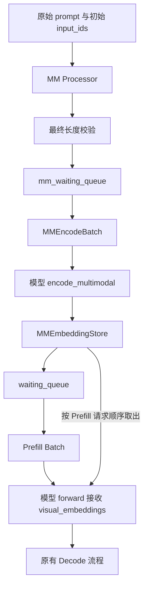

# 多模态编码（MM Encode）设计文档

本文介绍多模态理解模型接入 `executor/core` 的公共机制。框架将媒体编码作为独立的 MM Encode 阶段，在语言 Prefill 前执行；Processor 和模型负责媒体内容及其 token 布局，Scheduler 和 ExecutionEngine 负责准入、组批与执行。

整体执行框架见 [框架架构总览](executor_design.md)，在线服务的拓扑和 KV 传输见 [在线推理设计文档](online_inference_design.md)。本机制在现有 Offline / Online Prefill worker 内执行 Encode，不额外建立独立的 Encode 服务。

## 1. 概述与架构

媒体编码的合批范围与语言 Prefill 的 token 预算不同。将 Encode 独立调度后，可以先编码一批请求的媒体，再按语言侧预算拆成多个 Prefill mini-batch。编码结果由 `MMEmbeddingStore` 按请求暂存，供后续 Prefill 取用。



上图为启用 MM Encode 的请求路径。框架职责分工如下：

| 组件 | 职责 |
|---|---|
| `BaseMMProcessor` 的模型实现 | 读取媒体、预处理、生成最终 IDs 和模型专用媒体输入 |
| `Scheduler` | 以最终长度准入，分别组织 MM Encode 和语言 Prefill/Decode 批次 |
| `ExecutionEngine` | 调用执行入口，持有 Processor 和 Store，并向 Prefill 传递编码结果 |
| `ModelWorker` | 在同步与计时边界内调用模型的 `encode_multimodal()` 或语言 forward |
| `MMEmbeddingStore` | 按 request ID 保存编码结果，按 Prefill 请求顺序取出 |
| 模型 | 实现视觉网络、Projector、媒体并行和 embedding 回填 |

`encode_mm_batch()` 不执行语言 forward、KV 更新或采样；`forward_batch()` 继续承载 Prefill/Decode。未注册 MM Processor 的模型不创建 MM 队列和 Store，沿用文本路径。

## 2. 请求处理与调度

### 2.1 请求准入

`Scheduler.add_request()` 按以下顺序处理请求：

```text
创建 Request
    → _prepare_request_prompt()：生成或复用初始 input_ids
    → mm_processor.process(request)：生成最终 IDs 和媒体输入
    → 更新 request.prompt_tokens
    → reject_if_prompt_too_long()：最终长度校验
    → 入队
```

Processor 可能把一个媒体占位 token 展开成多个 token，因此长度校验必须在展开之后执行。后续语言 KV 分配也使用这一最终长度。

Offline 在 `_prepare_request_prompt()` 中按需 Tokenize；Online 由 DP leader 提前 Tokenize 并广播原始 prompt 和初始 IDs，各 rank 准入时复用已有 IDs，再执行 Processor。Processor 不重复 Tokenize。

`should_defer_truncation(prompt)` 默认返回 `False`。模型需要在媒体展开后截断时，返回 `True`，使 Tokenizer 跳过提前截断，再由 Processor 按模型布局处理。Offline 将 `input_truncated_len` 配置传给 Processor；Online 使用 `None`，最终长度仍由 Scheduler 校验。具体媒体块如何截断由模型实现。

### 2.2 批次与队列

启用 MM Encode 的模型将待编码请求放入 `mm_waiting_queue`，包括其中的纯文本请求。Online P 先等待 `bootstrap_queue` 中的握手共识，完成后才进入下述计算队列。队列成员关系表示处理阶段，不增加 `is_mm_encode_done` 状态位。

```text
mm_waiting_queue
    → 按 FIFO 取出 MMEncodeBatch
    → Encode 完成，结果写入 Store
    → 清空 Request.mm_inputs，转入 waiting_queue
    → 按原 Prefill 预算选出 Batch
    → 从 Store 取出本批结果，执行 Prefill
```

MM 组批使用 Processor 提供的 `mm_token_count`，不解析模型的图片尺寸、patch 或视图字段。`max_mm_encode_tokens` 是整请求打包目标，具体默认值和分摊规则见 [调度配置](../common/inference_config_guide.md#24-schedulerconfig-调度配置)。它不会拆分单个请求，也不构成峰值显存硬上限。

Prefill 仍按 `max_prefill_tokens`、`cp_mini_batch` 和 KV 槽位可用性选批。一个 MM Encode batch 可以对应多个 Prefill batch，框架不要求二者具有相同请求数。

### 2.3 阶段选择与 Online dummy

Offline 的执行优先级为 Prefill-ready → MM Encode → Decode。先消费已经编码的请求，可以避免它们持续等待新到来的媒体编码，并及时释放 Store 条目。

Online 将 MM pending 加入原有 DP 阶段协商，由实例内的 DP leaders 同步后，广播给各自副本的 TP/CP ranks。P 实例选择 Prefill 或 MM Encode，D 实例执行 Decode；P/D 之间仍通过原有 KV 传输流程协作，详见 [PD Scheduler](online_inference_design.md#6-pd-scheduler)。

选中 MM Encode 而本地没有请求时，Scheduler 创建 `MMEncodeBatch(requests=[], is_dummy=True)`。Worker 仍进入公共同步与计时边界，但不调用模型 Encoder、不构造假图片、不写 Store。模型 Encoder 内的通信范围应与实际参与编码的 ranks 一致，不能依赖其他 DP 副本同时调用 Encoder。

## 3. 数据结构与接口

### 3.1 请求与批次

| 字段或类型 | 内容 | 生命周期 |
|---|---|---|
| `Request.input_ids` | Processor 更新后的一维 `torch.long` 最终 token IDs | 后续进入原有语言输入流程 |
| `Request.prompt_tokens` | 最终 IDs 的数量，由 Scheduler 统计 | 用于准入和 Prefill 预算 |
| `Request.mm_inputs` | 模型专用 `dict`；无媒体时为 `None` | Processor 生成，Encode 完成后清空 |
| `Request.mm_token_count` | 本请求多模态 embedding 行数，无媒体时为 0 | 用于 MM Encode 组批 |
| `MMEncodeBatch.requests` | 本次 Encode 的有序请求列表 | 一个 Encode step |
| `MMEncodeBatch.is_dummy` | 是否为 Online 阶段对齐的空批次 | 不更新真实请求状态 |
| `model_inputs["visual_embeddings"]` | 本次 Prefill 请求对应的编码结果 | 普通模型参数，不属于 `ForwardMetaData` |

媒体 payload 的内部结构由模型定义。原有语言 `Batch` 继续组织 token Tensor，`ForwardMetaData` 继续描述阶段、长度和 KV 索引，不增加图片类型、mask 或视觉 ordinal 字段。

### 3.2 编码结果与 Store

模型的 `encode_multimodal(mm_inputs_list)` 接收按请求排列的媒体输入，返回等长列表；每项为该请求的 `[num_mm_tokens, hidden_size]` Tensor，纯文本请求对应 `None`。一个请求有多项媒体时，模型负责确定输出行顺序，并在 Prefill 中使用相同顺序回填。

Store 的接口为：

| 方法 | 作用 |
|---|---|
| `put_many(request_ids, embeddings)` | 按 request ID 保存逐请求结果 |
| `pop_many(request_ids)` | 按给定顺序取出并删除条目，过滤 `None` 后按行拼接 Tensor |
| `clear()` | Offline 开始下一次 `generate()` 时清空残留条目 |

`None` 表示该请求已完成 MM 阶段但没有媒体结果，与缺少 request ID 不同；缺少条目时 `pop_many()` 会报错。Store 保留 Encoder 返回的 Tensor，不执行设备迁移或类型转换，模型应返回适合语言侧使用的 device 和 dtype。

Store 用于衔接 Encode 和 Prefill 批次，不按媒体内容跨请求复用，也不使用 KV 的 `BlockPool`、`block_table` 或 `slot_mapping`。条目在 Prefill 调用模型前取出并移除，当前链路不提供跨多轮 chunked prefill 的重复读取或失败重试。

## 4. 新模型接入

### 4.1 实现并注册 Processor

模型在自己的目录中继承 `BaseMMProcessor`，实现 `process(request)`；构造参数为 `(model_path, tokenizer)`。`get_mm_processor()` 创建实例后设置 `input_truncated_len`，并由 Engine 将同一实例交给 Scheduler。

在 `executor/core/mm_processor_registry.py` 的 `_MM_PROCESSOR_SPECS` 中添加模型名到 `(模块路径, 类名)` 的映射。模型类仍通过 `support_models.py` 注册；仅在需要自定义 Tokenizer 行为时使用 `tokenizer_registry.py`。

Processor 负责媒体来源支持、预处理与占位展开，不执行设备侧编码。框架不规定图片 token ID、固定图片尺寸或媒体块布局。

### 4.2 实现编码与 Prefill 回填

| 模型接口 | 要求 |
|---|---|
| `encode_multimodal(mm_inputs_list)` | 返回与请求顺序一致的 Tensor/None 列表 |
| `forward(..., visual_embeddings=None, **kwargs)` | 根据模型的 token 布局，将视觉向量合入语言 embedding |
| `build_multimodal_warmup_inputs(seq_len)`（可选） | 返回合法的 `(input_ids, mm_inputs)`，供框架预热 |

模型若实现 `preprocess_model_inputs()`，应保留 `visual_embeddings`，使其到达实际 forward。视觉行与完整 token 序列的长度通常不同，模型负责占位映射以及 CP 下的局部对应关系。

Encoder 使用的视图/图片切分、TND 组装、AllGather 和结果布局仍由模型实现。所需通信组通过已有 `CommManager.register_group()` 声明，不改变语言并行配置的限制。

多模态 MTP 的视觉输入和 token 左移对应关系需要单独适配与验证，见 [MTP 执行机制](mtp_design.md)。

Online D 和 AFD FFN rank 不启用 MM Encode，也不创建 Store。D 侧仍执行 Processor 得到最终 IDs 和长度，随后清空媒体 payload；是否跳过视觉模块构造和视觉权重加载，需要模型按角色实现。

### 4.3 输入样例与验证

Offline 设置 `data_config.dataset: default_multimodal` 后，读取数据目录中的 `default_multimodal_prompt.json`。JSON 的 `text` 字段保存请求列表，每个请求为一组 messages。例如：

```json
{
  "text": [[{
    "role": "user",
    "content": [
      {"type": "image_url", "image_url": {"url": "example.png"}},
      {"type": "text", "text": "描述这张图片。"}
    ]
  }]]
}
```

样例文件中的相对图片路径按 JSON 所在目录转换为绝对 `file://` URI。图片读取和其他 URI 支持由模型 Processor 决定。接入后验证纯文本、含图及混合请求的顺序、最终长度和生成结果，并覆盖声明支持的并行与 Online 场景；检查项见 [新模型合入 Checklist](../common/new_model_checklist.md)。

## 5. 预热与性能统计

### 5.1 多模态 Warm-up

模型 hook 返回长度恰好为 `seq_len` 的单请求 IDs 及配套媒体输入。Engine 替换第一个 Prefill warm-up 请求，执行 Encode → Store → Prefill，随后继续原有预热流程。无法构造完整媒体输入时，hook 可返回 `None`。

该 hook 只替换第一个模拟请求，其余请求仍使用原有随机文本 IDs。模型负责输入合法性；一次媒体 warm-up 不保证覆盖全部动态图片尺寸。预热调用 `encode_mm_batch(..., profile=False)`，不推进正式 Encode 采集窗口。

### 5.2 耗时返回与日志

`OfflineInference.generate()` 仍返回 `(results, mtp_stats, infer_time)`，耗时列表按是否启用 MM Encode 区分：

| 模式 | `infer_time` |
|---|---|
| 未启用 MM Encode | `[prefill, decode...]` |
| 启用 MM Encode | `[encode, prefill, decode...]` |

启用 MM Encode 时，Encode、Prefill 分别为当前 rank 的真实批次累计时间，内部单位为秒；Decode 保留原有每步时间列表。`log_results()` 接收完整列表和 `enable_mm_encode`，分别打印 Encode/Prefill 总时间，再对 Decode 部分按原统计方法计算平均耗时。语言阶段沿用主模型与启用的 MTP 耗时合计口径，MTP 继续使用原有接受率和等效延迟统计。

运行过程中，MM Encode 通过 `_log_mm_encode_step()` 输出每批耗时；语言 Prefill/Decode 沿用原有 step 日志。Processor 的 CPU 预处理时间不包含在 Encoder 的模型执行计时中。

### 5.3 Profiler 阶段

`ProfilerManager.set_status()` 接收 `ProfilerPhase` 枚举，由 `check_if_update(cur_status)` 判断是否切换；非枚举输入会被拒绝。各阶段配置如下：

| 阶段 | 默认采集窗口 | 输出目录 |
|---|---|---|
| `MM_ENCODE` | `active=1, skip_first=0, warmup=0, repeat=1` | `prof/mm_encode/` |
| `PREFILL` | `active=1, skip_first=0, warmup=0, repeat=1` | `prof/prefill/` |
| `DECODE` | `active=3, skip_first=3, warmup=0, repeat=1` | `prof/decode/` |

Profiler 按执行 step/batch 推进，连续相同阶段复用同一对象。Encode 和 Prefill 可以相互切换；初始状态直接请求 Decode 不启动采集，进入 Decode 后不再切换。产物检查应依据实际启动的采集阶段和完成的窗口，不能假定所有运行都会生成三个目录。
