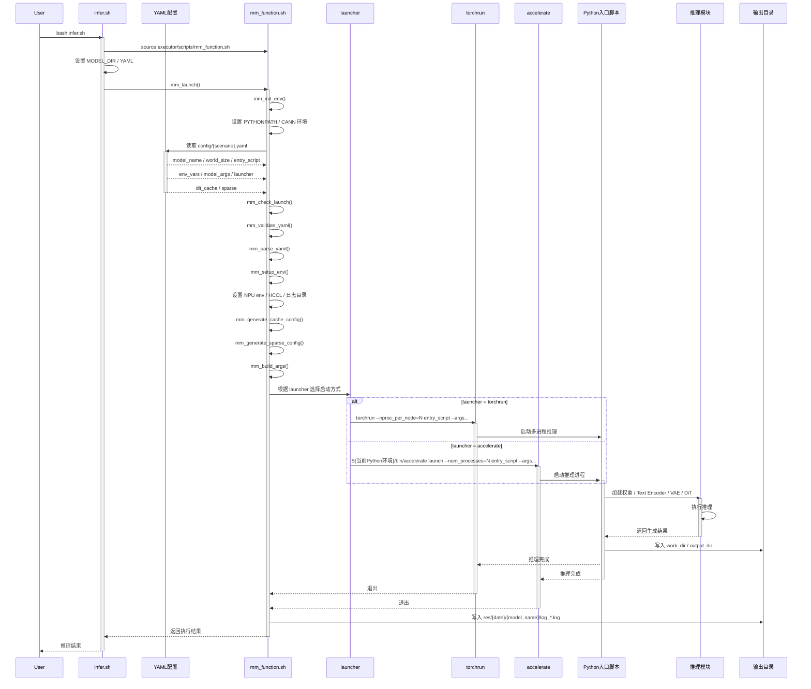

# 多模态生成模型统一推理拉起架构

## 1. 概述

本文档描述仓库中多模态生成模型（Wan2.2-I2V、HunyuanVideo、SANA-Video、HunyuanImage-3.0）的统一推理拉起架构。每个模型以 `infer.sh` 作为入口，通过切换 YAML 选择推理场景；YAML 集中管理模型参数、Dit-Cache 配置、环境变量与启动器参数；启动器支持 `torchrun` 与 `accelerate`；推理日志统一输出到 `models/{model}/res/{YYYYMMDD}/{model_name}/`。

## 2. 架构概览

```
models/{model_name}/
├── infer.sh                        # 统一入口，指定 YAML 文件名
├── config/
│   ├── {base_scenario}.yaml        # 基线配置，dit_cache.method 注释中列出可切换的选项
│   └── {base_scenario}_*.yaml      # 正交特性变体（量化、稀疏 Attention 等）
├── {Python 入口脚本}               # 由 YAML 的 entry_script 指向
├── res/{YYYYMMDD}/{model_name}/    # 拉起时自动创建的日志目录
└── {模型代码}                       # 保持不变

executor/scripts/
└── mm_function.sh                  # 统一拉起函数库（YAML 校验 / cache 段 / sparse 段透传）

module/dit_cache/
└── cache_method.py                 # 缓存管理器，支持从 YAML 读取配置

module/blockwise_sparse/
└── sparse_method.py                # 块稀疏 Attention（仅 HunyuanVideo，单卡 + Ulysses 多卡，详见 §5.5）
```

## 3. 执行流程

```
bash infer.sh
  └── mm_launch()
        ├── mm_init_env()                 # 计算 RECIPES_ROOT
        ├── mm_check_launch()             # 校验 YAML 文件存在
        ├── mm_validate_yaml()            # 必填键 / 白名单 / 枚举值校验（详见 §4.1）
        ├── mm_parse_yaml()               # 解析公共字段到 shell 变量
        ├── mm_setup_env()                # 设置 NPU 默认 env、YAML env、HCCL、日志目录
        ├── mm_generate_cache_config()    # 检测 dit_cache 段，拼 --cache-config / --cache_config
        ├── mm_generate_sparse_config()   # 检测 sparse 段，拼 --sparse-method / --sparse-attention-config
        └── mm_launch_task()              # 根据 launcher 调用 torchrun 或 accelerate
```

调用链示意图如下：



`infer.sh` 本身比较简洁（四个模型完全相同），仅做三件事：source `mm_function.sh`；导出 `MODEL_DIR`、`YAML`；调用 `mm_launch`：

```bash
#!/bin/bash
SCRIPT_PATH=$(cd "$(dirname "${BASH_SOURCE[0]}")" &>/dev/null && pwd)
MM_FUNCTION_ABS_PATH=$(realpath "${SCRIPT_PATH}/../../executor/scripts/mm_function.sh")
source ${MM_FUNCTION_ABS_PATH}

export MODEL_DIR=$(basename "$SCRIPT_PATH")
export YAML_PARENT_PATH="${SCRIPT_PATH}/config"
export YAML_FILE_NAME=14b_cfg2_ulysses4.yaml    # 切换场景改这一行
export YAML=${YAML_PARENT_PATH}/${YAML_FILE_NAME}

mm_launch
```

## 4. YAML 配置结构

YAML 是推理配置的唯一来源，分为 **公共字段**、**启动器字段**、**环境变量字段**、**Dit-Cache 字段**、**模型参数字段** 五类。示例（HunyuanVideo 单卡 TeaCache 场景）：

```yaml
# ===== 公共字段 =====
model_name: "hunyuan-video"         # 必填，模型标识
world_size: 1                       # 必填，使用的 NPU 卡数
master_port: 29600                  # 可选，默认 29600
entry_script: "sample_video.py"     # 必填，相对于模型目录的 Python 入口脚本

# ===== 启动器字段 =====
launcher: "torchrun"                # 可选，默认 torchrun；另一可选值 accelerate
launcher_args:                      # 可选，仅 accelerate 生效，每对 k: v 转为 --k=v
  mixed_precision: "bf16"

# ===== 环境变量字段 =====
env_vars:                           # 可选，按原样 export，可覆盖 mm_function.sh 默认
  CFG_PARALLEL: "1"
  DISABLE_XFORMERS: "1"
  PYTORCH_NPU_ALLOC_CONF: "expandable_segments:True"

# ===== Dit-Cache 字段 =====
dit_cache:                          # 可选；不声明则推理脚本按自身默认或 NoCache 执行
  method: "TeaCache"                # NoCache / FBCache / TeaCache / TaylorSeer
  enable_separate_cfg: true         # 可选，默认 true
  params:                           # 可选，按 method 部分覆盖内置默认值（仅提供想改的键）
    rel_l1_thresh: 0.15
    coefficients: [733.226126, -401.131952, 67.5869174, -3.149879, 0.0961237896]
    warmup: 2

# ===== 模型参数字段 =====
model_args:                         # 可接收任意被入口脚本 argparse 识别的参数
  video-size: [720, 1280]
  video-length: 129
  infer-steps: 50
  prompt: "A cat walks on the grass, realistic style."
  seed: 42
  embedded-cfg-scale: 6.0
  flow-shift: 7.0
  flow-reverse: true
  use-cpu-offload: true
  ulysses-degree: 8
  ring-degree: 1
  use-vae-parallel: true
```

### 4.1 顶层字段完整清单

| 字段 | 类型 | 必填 | 默认值 | 作用 |
|------|------|------|--------|------|
| `model_name` | string | 是 | — | 模型标识，用于日志目录命名、以及自动选择 cache 参数名（`hunyuan-video` → `--cache-config`，其他 → `--cache_config`） |
| `world_size` | int | 是 | — | NPU 卡数。`torchrun` 下映射为 `--nproc_per_node`，`accelerate` 下映射为 `--num_processes` |
| `master_port` | int | 否 | 29600 | 分布式主进程端口。`torchrun` 映射为 `--master_port`，`accelerate` 映射为 `--main_process_port` |
| `entry_script` | string | 是 | — | 相对于模型目录的 Python 入口脚本 |
| `launcher` | string | 否 | `torchrun` | 启动器，取值 `torchrun` 或 `accelerate` |
| `launcher_args` | dict | 否 | `{}` | 启动器额外参数，**仅 accelerate 生效**。每对 `k: v` 生成 `--k=v` |
| `env_vars` | dict | 否 | `{}` | 模型特有环境变量，按原样 export，可覆盖 `mm_function.sh` 的 NPU 默认值 |
| `dit_cache` | dict | 否 | 不声明 | Dit-Cache 配置段，详见 §5 |
| `sparse` | dict | 否 | 不声明 | 块稀疏 Attention 配置段（仅 HunyuanVideo），详见 §5.5 |
| `model_args` | dict | 否 | `{}` | 透传给 `entry_script` 的命令行参数，详见 §4.2 |

`mm_function.sh` 启动前会对顶层字段做校验（`mm_validate_yaml`）：缺失必填键、出现未知顶层键、`world_size / master_port` 类型错误、或 `dit_cache.method / sparse.method` 取值不在枚举集内，都会立即打印 `[ERROR]` 并退出。`model_args` 子项不走该校验，由入口脚本 `argparse` 自行拒绝未识别的 flag（subprocess 会以 exit 2 退出，错误信息落到日志）。

### 4.2 `model_args` 透传规则

`model_args` 会按下表规则转为命令行参数，追加在启动命令末尾。YAML 键保持原样（连字符和下划线不会互转），因此请严格按照 Python 入口脚本 `argparse` 中声明的参数名书写：

| YAML 值类型 | 转换规则 | 示例 |
|------------|---------|------|
| 字符串 | `--key value`（值经 shell 转义） | `task: "i2v-A14B"` → `--task i2v-A14B` |
| 整数 / 浮点数 | `--key value` | `seed: 42` → `--seed 42` |
| 布尔 `true` | `--key`（flag，无值） | `dit_fsdp: true` → `--dit_fsdp` |
| 布尔 `false` | 忽略（不追加到命令行） | `dit_fsdp: false` → 不添加 |
| 列表 | `--key v1 v2 ...`（适用于 `nargs="+"`） | `video-size: [720, 1280]` → `--video-size 720 1280` |
| 加引号字符串 `"False"` / `"True"` | 按字面量透传 | `model.fp32_attention: "False"` → `--model.fp32_attention False` |

> 表中"加引号字符串"的用法示例见 `sana-video/config/2b_480p_single.yaml` 中的 `model.fp32_attention: "False"`：YAML 需要以字符串字面量 `False` 透传，否则被解析为 Python `False` 后会按布尔规则被忽略。

**`model_args` 不是白名单**：任何被入口脚本 `argparse` 接收的参数都可以通过 `model_args` 传入，包括 DiT 权重路径（`dit-weight`）、量化开关（`use-fp8` / `fa-perblock-fp8` / `mm-mxfp8`）、profiler 开关（`prof-dit`）、UAA 开关（`ulysses-anything`）等。示例仅展示常用参数，不代表全部可用参数。HunyuanVideo 块稀疏 Attention 不经由 `model_args`，而是通过顶层 `sparse:` 段配置，详见 §5.5。

### 4.3 环境变量优先级

`mm_setup_env` 按以下顺序设置环境变量，后设置覆盖先设置：

1. **NPU 默认值**（最低优先级）：使用 `VAR=${VAR:-default}` 语法，仅在用户 shell 未设置该变量时生效：

   | 变量 | 默认值 |
   |------|--------|
   | `PYTORCH_NPU_ALLOC_CONF` | `expandable_segments:True` |
   | `TASK_QUEUE_ENABLE` | `2` |
   | `CPU_AFFINITY_CONF` | `1` |
   | `TOKENIZERS_PARALLELISM` | `false` |

2. **YAML `env_vars` 段**：无条件 export，覆盖 shell 已设置值和默认值。

3. **`MODEL_BASE` 自动派生**：紧接 `env_vars` 之后，若 shell 与 yaml 都未设置 `MODEL_BASE`，则从 `model_args.model-base` 取值并 export。HunyuanVideo `hyvideo/constants.py` 在 import 时把 `MODEL_BASE` freeze 进 `VAE_PATH` / `TEXT_ENCODER_PATH` / `TOKENIZER_PATH`，与 argparse `--model-base`（仅控制 DiT 权重路径）相互独立——这一步使两者保持一致，让用户只在 yaml `model_args.model-base` 写一次即可。其他模型不读 `MODEL_BASE` env，多出该变量无副作用。

4. **HCCL 通信参数**（最高优先级，硬编码在 `mm_function.sh`）：

   | 变量 | 值 |
   |------|-----|
   | `HCCL_IF_IP` | 本机 `hostname -I` 第一个 IP |
   | `HCCL_IF_BASE_PORT` | 23456 |
   | `HCCL_CONNECT_TIMEOUT` | 1200 |
   | `HCCL_EXEC_TIMEOUT` | 1200 |

> HCCL 通信参数位于 YAML `env_vars` 之后设置，YAML 中若声明了同名 HCCL 变量会被硬编码值覆盖。如需自定义，请直接修改 `mm_function.sh`。

5. **用户自行 export**：`ASCEND_RT_VISIBLE_DEVICES` 等设备选择类变量由用户在执行 `bash infer.sh` 前手动 export，`mm_function.sh` 不处理。

### 4.4 `launcher_args` 使用范围

`launcher_args` 仅在 `launcher: "accelerate"` 时生效。每对 `k: v` 转为 `--k=v`（等号分隔，区别于 `model_args` 的空格分隔），拼入 `accelerate launch` 的启动参数中。`mm_function.sh` 会优先使用当前 `python` 所在环境下的 `accelerate` 可执行文件，避免 `PATH` 命中其他 Python 环境的用户级脚本。常用键包括 `mixed_precision`、`config_file` 等，完整列表参考 [accelerate launch 文档](https://huggingface.co/docs/accelerate/package_reference/cli)。

`torchrun` 启动器由 `mm_function.sh` 直接拼装 `--master_port` 与 `--nproc_per_node`，`launcher_args` 在 torchrun 场景下会被忽略。

## 5. Dit-Cache 集成

### 5.1 配置来源

YAML 中的 `dit_cache` 段是 Dit-Cache 的唯一配置源。拉起时 `mm_function.sh` 将 YAML 路径作为 `--cache-config`（`hunyuan-video`）或 `--cache_config`（其他模型）参数传给入口脚本；入口脚本调用 `module/dit_cache/cache_method.py` 的 `load_cache_config()`，该函数读取 `dit_cache` 段并与 `DEFAULT_CACHE_CONFIG` 合并后构造 `CacheManager`。

### 5.2 `dit_cache` 段字段

| 字段 | 类型 | 必填 | 默认 | 说明 |
|------|------|------|------|------|
| `method` | string | 否 | `NoCache` | 缓存方法：`NoCache` / `FBCache` / `TeaCache` / `TaylorSeer` |
| `enable_separate_cfg` | bool | 否 | `true` | 是否为 CFG 的条件分支和无条件分支各维护独立缓存 |
| `params` | dict | 否 | `{}` | 仅 `method` 对应方法的参数会生效，按键部分覆盖 §5.3 的默认值 |

### 5.3 各缓存方法默认值（`module/dit_cache/cache_method.py:DEFAULT_CACHE_CONFIG`）

| 方法 | 参数 | 默认 | 说明 |
|------|------|------|------|
| `FBCache` | `rel_l1_thresh` | 0.05 | L1 差异阈值，越大越快、质量越低 |
| | `latent` | `"latent"` | 命中判定所用的张量 key |
| | `judge_input` | `"cache_latent"` | 用于缓存命中判定的输入 |
| `TeaCache` | `rel_l1_thresh` | 0.15 | 累积 L1 阈值 |
| | `coefficients` | `[733.23, -401.13, 67.59, -3.15, 0.096]` | 多项式重缩放系数 |
| | `warmup` | 2 | 前 N 步强制完整计算 |
| | `latent` | `"latent"` | 同上 |
| | `judge_input` | `"modulated_inp"` | 同上 |
| `TaylorSeer` | `n_derivatives` | 3 | Taylor 展开阶数 |
| | `skip_interval_steps` | 4 | 每 N 步做一次完整计算 |
| | `warmup` | 3 | 前 N 步强制完整计算 |
| | `cutoff_steps` | 1 | 最后 N 步强制完整计算 |
| | `offload` | `true` | 是否将导数缓存 offload 到 CPU |
| `NoCache` | — | — | 禁用缓存，按 DiT 原始前向执行 |

YAML 的 `params` 段只需写入想覆盖的键，其余键沿用上表默认值。例如：

```yaml
dit_cache:
  method: "TaylorSeer"
  params:
    skip_interval_steps: 3         # 只改跳算间隔，其它沿用默认
```

### 5.4 单卡 / 多卡与 Dit-Cache 的关系

Dit-Cache 与序列并行正交。HunyuanVideo 的 `sp8.yaml` 和 `single.yaml` 都将 `dit_cache.method` 默认设为 `NoCache`，并在注释中列出 `[NoCache, FBCache, TeaCache, TaylorSeer]` 四个可选值——切换方法时改 `method` 并按注释展开对应的 `params` 子块即可，不再需要为每种方法单独派生 yaml。Wan2.2-I2V 的多卡 YAML（`14b_cfg2_ulysses4.yaml`）同样固定为 `NoCache`，因为当前 wan 侧多卡与 Dit-Cache 路径互不兼容；单卡 `14b_single.yaml` 内同样用注释提供 `[NoCache, FBCache, TeaCache]` 切换。

### 5.5 HunyuanVideo 块稀疏 Attention

HunyuanVideo 额外支持基于 `module/blockwise_sparse/` 的块稀疏 Attention 优化（`torch_bsa` 算子）。**支持单卡和 Ulysses 多卡**（`hyvideo/sparse/sparse_block.py` 已内置 Ulysses all-to-all 分支，`sample_video.py` 在 `ulysses_degree > 1` 时会调用 `apply_head_reorder_for_load_balance` 做 head 级负载均衡），**不支持 Ring Attention**（`ring_degree > 1` 时 `sample_video.py` 直接抛 `ValueError`）。启用后会**覆盖**所有 Dit-Cache 的 block forward。配置内联在启动 YAML 顶层的 `sparse` 段（与 `dit_cache` 并列）：

```yaml
sparse:
  method: "SVG"                      # [no_sparse, TopK, SVG]
  block_size_Q: 128
  block_size_K: 512
  model: "HunyuanVideo"
  params:
    TopK:                            # only used when method == TopK
      sparse_time_step: "10-49"
      sparsity_files_path: "./sparsity/320x480x65/v3"
      CAC_threshold: 0.66
    SVG:                             # only used when method == SVG
      sparse_time_step: "14-49"
      sparsity: 0.8
      sample_mse_max_row: 5000
      context_length: 256
```

`mm_function.sh` 检测到 `sparse:` 段后自动拼 `--sparse-method <method> --sparse-attention-config <yaml>` 透传给 `sample_video.py`；`module/blockwise_sparse/sparse_method.py:load_sparse_config_from_file` 读取 yaml 顶层 `sparse` 段并扁平化成内部结构（向后兼容老的独立 `sparse_config.yaml` 扁平格式）。

关键约束：

- **支持 Ulysses，不支持 Ring**：`hyvideo/sparse/sparse_block.py` 的 sparse forward 已包含 Ulysses all-to-all 通信路径；但 `sample_video.py` 在 `ring_degree > 1` 时硬性抛 `ValueError`，多卡 sparse 仅可走 Ulysses（设 `ring-degree: 1`）。
- **与 Dit-Cache 互斥**：`sample_video.py` 顺序是先 cache_manager 初始化并替换 block forward，再在 sparse 启用时把**所有** double/single block forward 替换为 sparse 版——sparse 会静默覆盖 FBCache / TeaCache / TaylorSeer 的 block forward。因此 sparse 与 cache 不应同时启用；预置的 `single_sparse.yaml` / `sp8_sparse.yaml` 都固定 `dit_cache.method: NoCache`。
- **TopK 前置**：`TopK` 策略需要先跑一次 `module/blockwise_sparse/offline_profiling/offline_profiling_hyvideo.py` 生成 sparsity 文件（路径由 `sparse.params.TopK.sparsity_files_path` 指定，规格须与 `video-size / video-length` 一致——单卡默认 `320*480*65`，多卡默认 `720*1280*129`）；`SVG` 策略无需离线 profiling。
- **算子依赖**：运行前需依据 `blitz_sparse_attention` 算子文档编译对应算子库，详见 HunyuanVideo README。

参考 YAML：`config/single_sparse.yaml`（单卡 + SVG + `320*480*65` 规格）、`config/sp8_sparse.yaml`（8 卡 Ulysses + SVG + `720*1280*129` 规格）。其他预置 YAML 不写 `sparse` 段，稀疏分支默认关闭。

## 6. 各模型 YAML 清单

| 模型 | YAML 文件 | 卡数 | 启动器 | Cache | 关键特性 |
|------|-----------|------|--------|-------|---------|
| Wan2.2-I2V | `14b_single.yaml` | 1 | torchrun | `dit_cache.method` 切 NoCache / FBCache / TeaCache | 单卡基线，`832*480*61`，`convert_model_dtype` |
| | `14b_cfg2_ulysses4.yaml` | 8 | torchrun | NoCache（多卡强制） | CFG=2 × Ulysses=4, VAE 并行，`1280*720*81` / `832*480*61`，DiT+T5 FSDP |
| HunyuanVideo | `single.yaml` | 1 | torchrun | `dit_cache.method` 切 NoCache / FBCache / TeaCache / TaylorSeer | 单卡基线，`720*1280*129`，CPU offload |
| | `single_fp8.yaml` | 1 | torchrun | NoCache | FP8 FA 激活量化（需 950PR） |
| | `single_sparse.yaml` | 1 | torchrun | NoCache（sparse 覆盖） | 块稀疏 Attention（默认 SVG，可切 TopK），`320*480*65` 规格 |
| | `sp8.yaml` | 8 | torchrun | `dit_cache.method` 切 NoCache / FBCache / TeaCache / TaylorSeer | Ulysses=8, VAE 并行，`720*1280*129` |
| | `sp8_sparse.yaml` | 8 | torchrun | NoCache（sparse 覆盖） | Ulysses=8 + 块稀疏 Attention（默认 SVG，可切 TopK），`720*1280*129` 规格；`ring-degree` 必须为 1 |
| SANA-Video | `2b_480p_single.yaml` | 1 | accelerate | — | `mixed_precision=bf16`，`DISABLE_XFORMERS=1`，2B 480p，本地离线 DiT/VAE/Gemma 权重 |
| | `2b_480p_single_platform.yaml` | 1 | python 直接拉起 | — | 一站式平台模板，由 `infer_platform.sh` 读取并生成临时本地权重配置 |
| HunyuanImage-3.0 | `ep8_cfg.yaml` | 16 | torchrun | — | Attn TP8 + MoE EP8 + CFG 并行 + VAE 并行 |

上表列出的 YAML 均为参考配置，用户可复制并修改任意字段以派生新的场景配置。

## 7. 使用方式

### 7.1 切换推理配置

修改 `infer.sh` 中的 `YAML_FILE_NAME` 指向目标 YAML：

```bash
# 8 卡多卡推理
export YAML_FILE_NAME=sp8.yaml

# 单卡；改 yaml 的 dit_cache.method 即可在 NoCache/FBCache/TeaCache/TaylorSeer 之间切换
export YAML_FILE_NAME=single.yaml
```

### 7.2 执行推理

```bash
# 先 source CANN 环境
source /usr/local/Ascend/ascend-toolkit/set_env.sh

# 可选：指定参与推理的 NPU 设备
export ASCEND_RT_VISIBLE_DEVICES=0,1,2,3,4,5,6,7

cd models/{model_name}
bash infer.sh
```

### 7.3 修改推理参数

所有参数修改都通过编辑 YAML 完成：

- 调整模型权重路径：修改 `model_args.ckpt_dir` / `model-id` / `dit-weight` / `model_path`；SANA-Video 还需按需修改 `vae.vae_pretrained` 与 `text_encoder.text_encoder_name`
- 调整生成规格：修改 `model_args.size` / `video-size` / `video-length` / `frame_num` / `image-size`
- 调整并行度：修改 `world_size` 以及 `model_args` 中的 `cfg_size` / `ulysses_size` / `ulysses-degree` / `ring_size` / `ring-degree`，保证 `world_size = cfg_size * ulysses_size * ring_size`
- 切换 Dit-Cache：修改 `dit_cache.method` 与 `dit_cache.params`
- 切换启动器：修改 `launcher`，并按需增删 `launcher_args`
- 追加环境变量：新增 `env_vars.<KEY>: "<VALUE>"`

### 7.4 日志与输出

拉起时在 `models/{MODEL_DIR}/res/{YYYYMMDD}/{model_name}/` 下创建日志目录，并将推理 stdout / stderr `tee` 到 `log_<YYYYMMDD_HHMMSS>.log`。其中 `MODEL_DIR` 取自 `infer.sh`（脚本所在目录的 basename），`model_name` 取自 YAML。

模型自身的输出文件（生成的视频、图片等）由 Python 入口脚本决定，通常落在 YAML 的 `model_args.work_dir` 或 `output_dir` 指向的目录。

## 8. 关键实现细节

### 8.1 PYTHONPATH 注入策略

`mm_function.sh` 在启动 `torchrun` / `accelerate` 子进程时，通过命令行前缀向子进程注入 `PYTHONPATH=${RECIPES_ROOT}:$PYTHONPATH`：

```bash
eval PYTHONPATH=${RECIPES_ROOT}:\$PYTHONPATH \
     torchrun --master_port=... --nproc_per_node=... \
     ${ENTRY_SCRIPT_PATH} ${MODEL_ARGS} ...
```

注入仅作用于推理子进程，当前 shell 与 CANN TBE 算子编译器所使用的 Python 解释器不受影响。

### 8.2 Cache 参数名自动选择

`mm_generate_cache_config` 根据 YAML 中的 `model_name` 自动选择 cache 参数名：

- `model_name` 包含 `hunyuan-video` → `--cache-config`（连字符）
- 其他情况 → `--cache_config`（下划线）

### 8.3 YAML 校验

`mm_check_launch` 校验 `YAML` 环境变量已设置且文件存在；`mm_setup_env` 校验 `entry_script` 解析后的绝对路径存在；`_validate_config_keys` 校验合并后的缓存配置包含 `cache_forward`、`enable_separate_cfg`、`FBCache`、`TeaCache`、`NoCache`、`TaylorSeer` 六个必备键。任一校验失败都会立即退出并打印 `[ERROR]` 日志。
