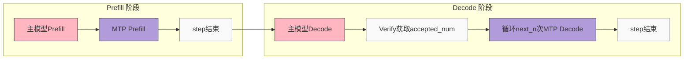
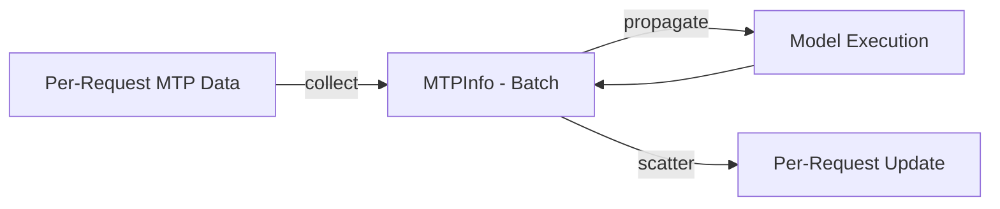
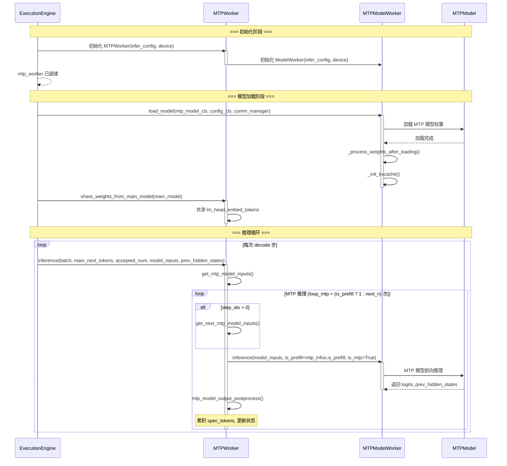

# MTP 执行机制设计文档

## 1. 目录结构

```
executor/core/model_worker
└── mtp_worker.py      # MTPWorker 类实现
```

## 2. MTP 设计流程及结构体设计

MTP (Multi-Token Prediction) 是一种推测解码技术，使用小型的 draft model 预测多个 token，再由主模型验证。

### 2.1 MTP 设计流程

MTP 工作流程遵循多步推测推理模式：

**关键点：**
- MTP 模型每次迭代运行 `next_n` 个 decode 步来生成推测 token
- 主模型验证推测 token 并接受/拒绝它们
- 该过程在每个 decode 步重复


**流程说明：**




**Prefill 阶段：**
- 主模型先执行 Prefill，处理输入 prompt，生成第一个 token
- MTP 模型使用主模型输出执行 Prefill

**Decode 阶段：**
- 主模型执行 Decode，生成候选 token
- 验证：比较 MTP 预测的 `spec_tokens` 与主模型生成的 token，得到 `accepted_num`（每个样本接受的 token 数量）
- MTP 模型循环 `next_n` 次 Decode，每次根据 `accepted_num` 更新输入，累积新的推测 token


### 2.2 MTPInfo 结构体设计

`MTPInfo` 数据类封装了 MTP 推测解码的状态信息，管理 draft 模型和主模型之间的工作流。

| 变量名 | 类型 | 说明 |
|--------|------|------|
| `is_prefill` | `Optional[bool]` | 当前阶段是否为 prefill（初始 token 处理） |
| `spec_tokens` | `Optional[torch.Tensor]` | 累积的推测 token 序列，供主模型验证 |
| `accepted_num` | `Optional[torch.Tensor]` | 当前迭代中每个样本接受的 token 数量 |

**MTPInfo 在调度中的数据流：**


### 2.3 MTPWorker 类设计

`MTPWorker` 类负责执行 MTP (Multi-Token Prediction) 模型推理。

**成员变量：**

| 分类 | 变量名 | 说明 |
|------|--------|------|
| 配置 | `infer_config` | 包含所有运行时设置的推理配置 |
| | `next_n` | 每步预测的推测 token 数量 |
| | `exe_mode` | 执行模式 (eager, npugraph_ex 等) |
| | `prefill_mini_batch` | Prefill 阶段的小批次大小 |
| | `batch_size_per_dp_rank` | 每个 dp rank 的批次大小 |
| 模型组件 | `device` | 用于计算的 NPU 设备 |
| | `mtp_model_worker` | 封装 MTP 模型的 ModelWorker 实例 |

**方法说明：**

| 方法 | 说明 |
|------|------|
| `__init__(infer_config, device)` | 使用推理配置和设备初始化 MTPWorker |
| `share_weights_from_main_model(main_model)` | 从主模型共享可复用权重到 MTP 模型 |
| `_pad_seq_len_to_size(tensor, size)` | 静态方法，沿序列维度 (dim=1) 将 tensor 填充或截断到指定大小 |
| `get_main_model_inputs(input_ids, batch)` | 获取主模型验证所需的输入 |
| `get_mtp_model_inputs(batch, main_next_tokens, model_inputs_main, prev_hidden_states)` | 静态方法，根据当前阶段为 MTP 模型推理准备输入 |
| `mtp_model_output_postprocess(model_inputs, logits, mtp_infos)` | 处理 MTP 模型输出并更新 mtp_infos 状态 |
| `get_next_mtp_model_inputs(model_inputs, mtp_infos, prev_hidden_states)` | 构建下一次 MTP 迭代的输入 |
| `inference(batch, main_next_tokens, accepted_num, model_inputs_main, prev_hidden_states)` | 执行多步推测推理以生成草稿 token |

**方法详解：**

**`__init__`**
- 初始化配置参数：next_n、exe_mode、prefill_mini_batch、batch_size_per_dp_rank
- 创建 MTP ModelWorker 实例

**`share_weights_from_main_model`**
- 从主模型共享 lm_head 和 embed_tokens 到 MTP 模型
- 当 MTP 模型缺少这些层时使用主模型的权重

**`_pad_seq_len_to_size`**
- 静态方法，将 tensor 填充或截断到指定序列长度
- 超过指定长度时截断，不足时用零填充

**`get_main_model_inputs`**
- 构建主模型验证窗口：拼接 input_ids 和 spec_tokens
- 回退 kv_len 到接受的前缀位置，为下次主模型验证做准备

**`get_mtp_model_inputs`**
- 处理两个阶段：prefill 和 decode
- Prefill：拼接 input_ids 与接受的 token，存储 prev_hidden_states，添加 cycle_idx
- Decode：使用主模型位置信息和 forward_metadata
- 返回包含 input_ids、position_ids、prev_hidden_states、forward_metadata 的字典

**`mtp_model_output_postprocess`**
- 处理来自 MTP 模型推理的输出，无返回值，直接修改 mtp_infos
- Prefill 分支：跳过 MTP decode，直接推进 kv_len，更新 is_prefill 标志
- Decode 分支：基于接受的 token 更新状态，提取下一个推测 token
- 在 `mtp_infos.spec_tokens` 中累积推测 token

**`get_next_mtp_model_inputs`**
- 为下一次 MTP 迭代构建输入
- 更新 kv_len、position_ids
- 根据接受的 token 数量 scatter 最后一个推测 token 到 input_ids
- 重塑 prev_hidden_states 维度

**`inference`**
- MTP 推测推理的主入口
- 确定循环次数：prefill 为 1，decode 为 `next_n` 步
- 工作流：
  1. 初始化/更新 batch.mtp_infos
  2. 获取初始 MTP 模型输入
  3. 循环推理步骤：
     - 非首次迭代时获取下一次输入
     - 调用 MTP model_worker 进行推理
     - 后处理输出，累积推测 token，更新状态


**MTP 调用时序图:**



## 3. MTP 指标介绍

当 MTP 启用时，框架会统计并计算以下三个核心指标，用于评估 decode 阶段的性能收益：

### 3.1 指标计算公式

**1. 平均接受率 (avg_accept_rate)**

```
avg_accept_rate = total_accept_tokens / total_spec_tokens
```

- `total_spec_tokens = sum(spec_num_forward_ct) × next_n`：MTP 模型推测的总 token 数
- `total_accept_tokens = sum(spec_num_accepted_tokens)`：主模型验证后接受的总 token 数
- 含义：衡量 MTP 预测的准确程度，越高表示 MTP model 与主模型越一致

**2. 平均接受长度 (avg_accept_length)**

```
avg_accept_length = total_accept_tokens / spec_num_forward_ct + 1
```

- `spec_num_forward_ct = sum(spec_num_forward_ct)`：前向传播次数
- 加 1 表示主模型每次验证至少产出 1 个有效 token
- 含义：平均每次 decode 迭代实际产出的 token 数

**3. 平均等效时间 (avg_equivalent_time)**

```
avg_equivalent_time = avg_decode_time / avg_accept_length
```

- `avg_decode_time`：decode 阶段平均前向推理耗时，包括一次主模型推理耗时和 next_n 次 MTP 模型推理耗时
- 含义：等效于每生成一个有效 token 的平均耗时
