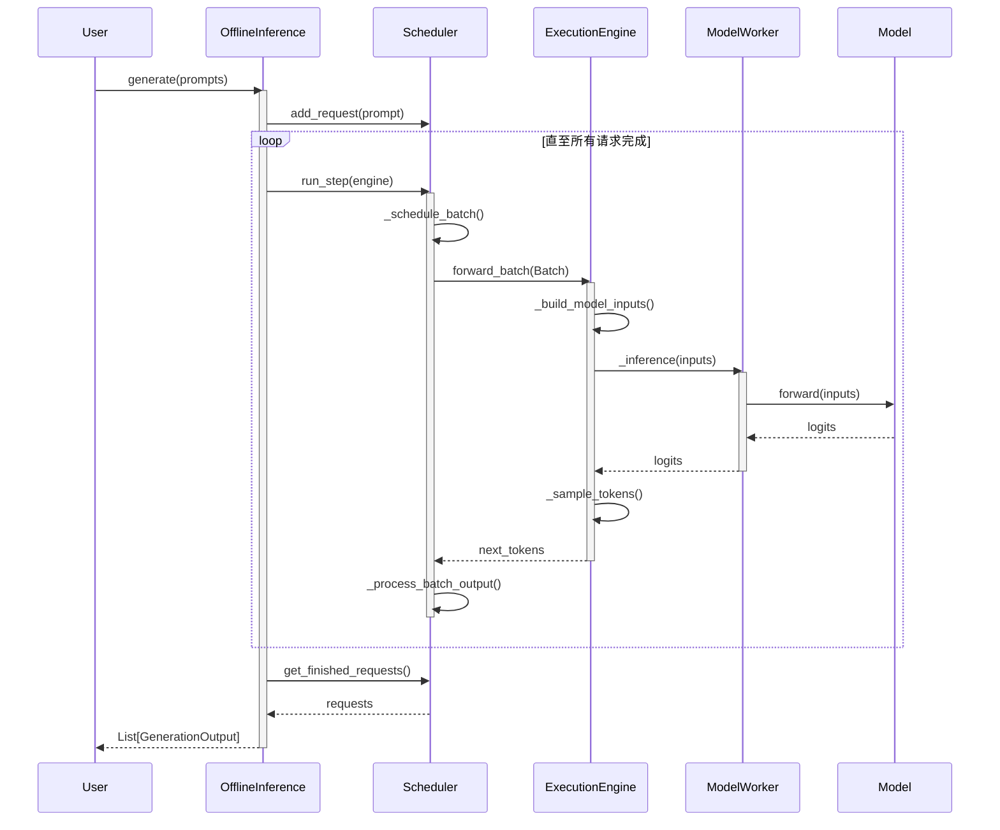

# Offline Inference 执行机制设计文档

## 1. 概述

`OfflineInference` 是离线推理的入口类，对应vllm/sglang等框架中的Offline Inference执行方式，推荐在验证性能上限、问题定位时使用这种模式。

## 2. 核心组件关系

离线推理执行框架主要由以下四个核心组件协作完成：

### 2.1 OfflineInference (入口类)
- **职责**：作为用户直接交互的 API 层，负责协调各个组件的生命周期。
- **功能**：
    - 初始化 `ExecutionEngine` 和 `Scheduler`。
    - 接收用户输入的 Prompts 并将其转化为推理请求。
    - 驱动推理循环（Scheduling Loop），直到所有请求完成。
    - 收集并解码推理结果。

### 2.2 Scheduler (调度器)
- **职责**：管理请求的生命周期、状态转换以及批处理策略。
- **关键逻辑**：
    - **请求队列管理**：维护 waiting、running 和 finished 的三个请求列表。
    - **批处理组装**：根据Batch Size 限制，决定下一步执行哪些请求。优先处理Prefill，全部请求的Prefill处理完后再处理Decode。
    - **状态转换**：根据 Engine 的输出，将请求从 Prefill 阶段转换到 Decode 阶段，或标记为完成。
    - **固定形状模式**：默认对 Batch 进行填充以保持 Tensor 形状一致，适用于性能压测。

### 2.3 ExecutionEngine (执行引擎)
- **职责**：负责模型加载、底层硬件资源管理，触发模型执行。
- **功能**：
    - **环境初始化**：设置 NPU 设备、初始化分布式通信组（CommManager）。
    - **模型加载与分身**：通过 `ModelWorker` 管理模型。支持从 Loader 加载权重并支持在线切分。
    - **预热**：在正式推理前执行一次 Prefill 和一次 Decode。如果开启图模式，Decode会触发图编译。
    - **前向执行**：提供 `forward_batch` 接口，接收 Scheduler 组装的 Batch，执行推理并进行后处理采样。
    - **图模式适配**：通过 `exe_mode` 处理图编译，支持 `eager`, `ge_graph` 和 `acl_graph` 等模式。

### 2.4 ModelWorker (具体模型执行)
- **职责**：封装底层模型操作，提供对单模型的统一控制。
- **功能**：
    - **模型加载与初始化**：支持从 checkpoint 加载模型和配置，初始化 KV Cache 并将其赋值到模型各层的对应变量。
    - **权重后处理**：在加载模型后根据硬件需求对权重进行转换。
    - **推理执行**：提供 `_inference` 接口，执行 eager 或 graph 模式（通过 `compile_model`）的模型前向。
    - **图编译管理**：负责管理图编译状态，确保计算图被正确重放。

### 2.5 Model (模型实现)
- **职责**：定义具体的神经网络结构和前向计算逻辑。
- **适配要求**：
    - 接受 `InferenceConfig` 和 `CommManager` 作为初始化参数。
    - 通过 `ForwardMetaData` 获取当前步的序列信息（如 `kv_len`, `is_prefill`, `actual_seq_lengths_kv`, `attention_mask`）。

## 3. 推理执行流程

整个离线推理过程遵循以下步骤：

1.  **初始化**：用户根据 YAML 配置文件创建 `InferenceConfig`，并以此初始化 `OfflineInference`。
2.  **模型加载与预热**：`ExecutionEngine` 加载权重，并调用 `warm_up()` 执行一次 dummy 推理以完成图编译和资源就绪。
3.  **请求提交**：用户调用 `generate(prompts)`。`OfflineInference` 将每个 prompt 封装为 `Request` 并存入 `Scheduler` 的等待队列。
4.  **驱动循环**：进入 `while scheduler.has_work()` 循环：
    - **调度阶段**：`Scheduler` 根据当前资源和策略，从队列中挑选请求组装成一个 `Batch`（包含 `input_ids` 等）。
    - **执行阶段**：`ExecutionEngine` 接收 `Batch`，内部调用 `_build_model_inputs` 构建 `position_ids` 和 `ForwardMetaData`，随后通过 `ModelWorker` 执行模型前向计算。
    - **采样阶段**：`ExecutionEngine` 对 Logits 进行采样，得到每个请求的下一个 Token。
    - **更新阶段**：`Scheduler` 根据采样出的 Token 更新请求状态，处理 Prefill 到 Decode 的转换，并检查是否达到终止条件。
5.  **结果收集**：所有请求完成后，`OfflineInference` 从 `Scheduler` 获取已完成的请求，进行 Token 解码并返回给用户。

## 4. 组件交互图 (逻辑)

