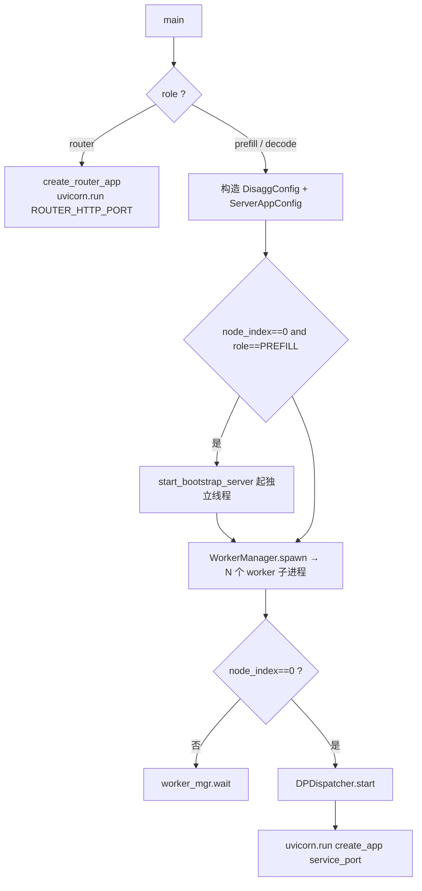
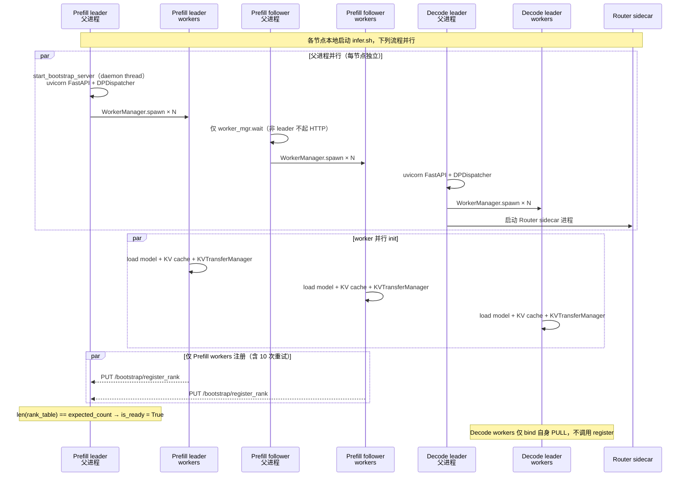
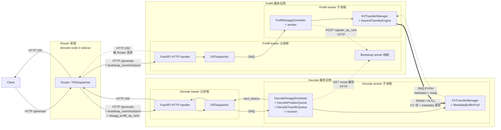
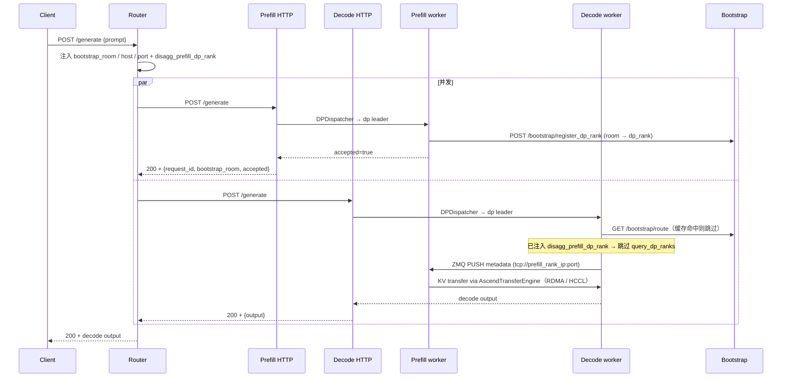
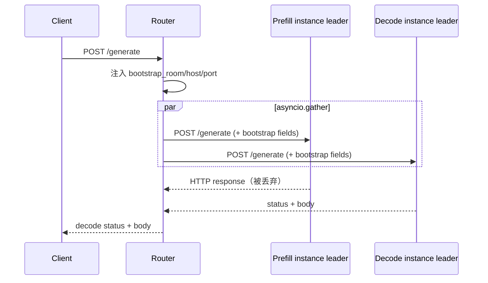
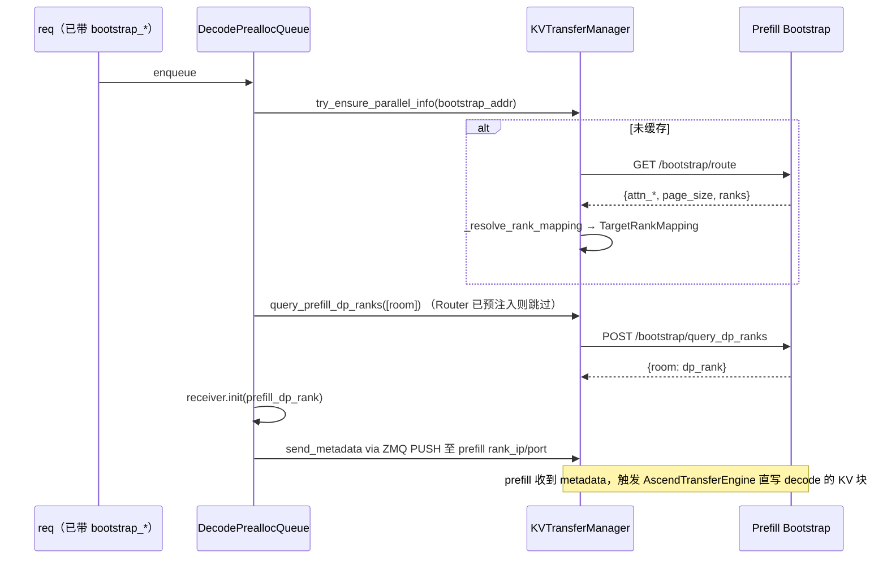

# 在线推理（PD 分离）设计文档

本文档描述 cann-recipes-infer 在线推理的整体设计。在线推理在本框架中`disaggregation_mode ∈ {PREFILL, DECODE}` 即在线，`NONE` 即离线。

本文档详细介绍进程拓扑、控制面协议、数据面协议、调度器与启动流程。

---

## 目录

1. [概述与术语](#1-概述与术语)
2. [运行时架构与流程](#2-运行时架构与流程)
3. [控制面：Bootstrap Server](#3-控制面bootstrap-server)
4. [控制面：Router (PDDispatcher)](#4-控制面router-pddispatcher)
5. [数据面：KVTransferManager](#5-数据面kvtransfermanager)
6. [PD Scheduler](#6-pd-scheduler)
7. [配置与启动](#7-配置与启动)

---

## 1. 概述与术语

### 1.1 PD 分离的动机

LLM 推理分两阶段：

- **Prefill**：一次性对全部输入 token 并行算 KV，**计算密集**（NPU 算力瓶颈）
- **Decode**：逐 token 自回归生成，读 KV cache 算 1 个新 token，**访存密集**（HBM 带宽瓶颈）

最优策略上 prefill 倾向 TP、decode 倾向 DP。合并部署被迫用同一拓扑兼顾两阶段，无法各自最优；分离部署后 prefill 与 decode 跑在独立的服务实例上，分别按各自最优策略配置，prefill 算完 KV 经 RDMA 直发 decode。

### 1.2 核心术语

| 术语 | 含义 |
|---|---|
| **服务实例 (service instance)** | 一组并行运行的 rank 构成一个 Prefill 或 Decode 实例；一个实例有一份完整的 TP × CP × DP × PP 并行拓扑 |
| **节点 (node)** | 物理或虚拟机，承载若干 rank；实例可跨节点（例如 TP 跨机时） |
| **实例 Leader 节点** | 实例内首个节点（`node_index == 0` within instance）；Prefill 实例 leader 额外运行 Bootstrap server 线程 |
| **bootstrap_room** | 请求级唯一标识，由 Router 生成并注入 prefill / decode 双方 payload，用于跨 PD 关联同一请求 |
| **bootstrap_host / bootstrap_port** | Prefill 实例 leader 的 HTTP 控制面地址，Bootstrap server 监听于此 |
| **rank_ip / rank_port** | **Prefill rank** 的 ZMQ PULL socket 可达地址，每 prefill rank 一份；启动时由 prefill rank `PUT /bootstrap/register_rank` 注册到 bootstrap，decode 通过 `GET /bootstrap/route` 查询并向其 PUSH metadata。Decode 端 worker 自身也有 PULL socket，但**不**对外发布、不进 bootstrap rank_table |

### 1.3 典型拓扑示例

```
PREFILL_IPS = (p0 p1 p2 p3)
DECODE_IPS  = (d0 d1)
prefill.yaml ws = 32, devices_per_node = 16  →  2 实例，leader = p0 / p2
decode.yaml  ws = 16, devices_per_node = 16  →  2 实例，leader = d0 / d1
```

Router target 列表（由 decode node-0 的 shell 计算后传给 `--role router`）：

- `prefill_addrs = [p0, p2]`（每实例 leader IP）
- `decode_addrs  = [d0, d1]`

Bootstrap server 仅在 **p0、p2** 启动；p1、p3 只跑 worker，不起 HTTP、不起 bootstrap。

---

## 2. 运行时架构与流程

每节点由 `executor/online/server.py main()` 拉起一个父进程，父进程按 rank 拉起 N 个 worker 子进程（一卡一 worker）。本章先讲静态结构（§2.1-§2.3），再讲启动/初始化（§2.4-§2.6），最后讲端到端请求流（§2.7）。

### 2.1 父进程（`server.py main()`）



父进程关键对象（仅在实例 leader 节点上具备）：

| 对象 | 范围 | 用途 |
|---|---|---|
| FastAPI HTTP handler | 实例 leader 父进程 | 接收 Router 转发的请求 |
| `DPDispatcher`（ZMQ） | 实例 leader 父进程 | 把 HTTP 请求派发给对应 dp leader 的 worker；收回 worker 算完的结果以便父进程回 HTTP |
| Bootstrap server 线程 | **Prefill** 实例 leader 父进程独有 | 独立 uvicorn 线程，监听 `BOOTSTRAP_PORT` (18800) |

非 leader 节点（`node_index != 0`）父进程只调用 `worker_mgr.wait()` 等子进程结束，不起 HTTP 与 DPDispatcher。

### 2.2 Worker 子进程（`server.py:worker_main`）

每个 worker 子进程对应一张 NPU，加载模型，构造 `OnlineInference`（继承 `OfflineInference`），内部实例化 `KVTransferManager` 并进入推理循环。关键对象：

| 对象 | 范围 | 用途 |
|---|---|---|
| `OnlineInference` | 每个 worker 子进程 | 推理主循环 |
| `KVTransferManager` | 每个 worker 子进程 | KV 传输发送/接收 + rank 注册 |
| ZMQ PULL socket | 每个 worker 子进程 | KV 传输控制通道；`bind 0.0.0.0:rank_port`，对外通告 `local_ip` |
| `AscendTransferEngine` | 每个 worker 子进程 | KV 数据传输（HCCL / 内存 ptr） |

### 2.3 Router（`--role router` 进程）

Decode 侧 **node 0**（`VC_TASK_INDEX=0`）额外起一个 Router sidecar 进程（`function.sh` 中 `PD_ROLE=decode && VC_TASK_INDEX=0` 分支）。Router 监听 `ROUTER_HTTP_PORT`（8000），处理客户端请求时：

- 注入 `bootstrap_room / bootstrap_host / bootstrap_port`
- `asyncio.gather` 并发 POST 给一个 Prefill 实例 leader 和一个 Decode 实例 leader
- 透传 Decode 响应给 client

### 2.4 集群拉起

每个节点本地运行 `bash infer.sh online {prefill|decode}`，没有中心调度器；下列时序图描述各节点启动后**并行**进行的活动以及跨节点的 bootstrap 注册调用。



启动顺序保证由两个机制叠加：

1. `server.py main()` 在每节点内部按"先起 bootstrap thread → 再 spawn workers"顺序排布——leader 节点的 bootstrap 在 fork worker 之前就已 bind 端口
2. follower 节点的 worker `_register_to_bootstrap` 自带 10 次重试 + 1 s 间隔——足以覆盖 leader 节点 bootstrap 上线的延迟

### 2.5 Worker 初始化时序

每个 worker 子进程从 `server.py:worker_main` 进入，构造 `OnlineInference`（继承 `OfflineInference`），整体形状一致，差异集中在 `KVTransferManager` 的 `_start_listener_thread` 与 `_register_to_bootstrap` 两步。

**Prefill 侧：**

```text
worker_main(global_rank, local_rank, ..., disagg_config)              # in server.py
  └── OnlineInference.__init__
        ├── 父类 ExecutionEngine.__init__ + ExecutionEngine.init     # 加载模型 + KV cache
        ├── KVTransferManager(disagg_config, attn_dp_size, attn_dp_rank, ...)
        │     ├── self.local_ip = disagg_config.local_ip
        │     ├── _init_rank_socket → bind PULL on 0.0.0.0:<random>，advertise local_ip
        │     ├── _start_listener_thread
        │     │     ├── _prefill_listener_loop（daemon thread）
        │     │     ├── transfer_executor: 4-worker thread pool（`ASCEND_TRANSFER_THREADS`）
        │     │     └── _metadata_scratch: MetadataBufferPool（NPU HBM，每线程 1 槽）
        │     └── _register_to_bootstrap → PUT /bootstrap/register_rank（含 10 次重试）
        └── scheduler = PrefillDisaggScheduler
  └── run_continuous_loop                                              # ~10 行主循环，无 mode 分叉
```

**Decode 侧：**

```text
worker_main(global_rank, local_rank, ..., disagg_config)              # in server.py
  └── OnlineInference.__init__
        ├── 父类 ExecutionEngine.__init__ + ExecutionEngine.init     # 加载模型 + KV cache
        ├── KVTransferManager(disagg_config, attn_dp_size, attn_dp_rank, ...)
        │     ├── self.local_ip = disagg_config.local_ip
        │     ├── _init_rank_socket → bind PULL on 0.0.0.0:<random>，advertise local_ip
        │     ├── _start_listener_thread
        │     │     ├── _decode_listener_loop（daemon thread）
        │     │     └── _heartbeat_loop（daemon thread；定期 ping 已知 prefill bootstrap）
        │     └── _register_to_bootstrap → mode guard 命中后 return（不注册、不进 rank_table）
        └── scheduler = DecodeDisaggScheduler
  └── run_continuous_loop                                              # ~10 行主循环，无 mode 分叉
```

整个 init 期间没有 prefill / decode 之间的同步——decode worker 启动不等 prefill bootstrap ready；首次需要 prefill 拓扑时（处理第一个含 `bootstrap_host/port` 的请求时）再 `GET /bootstrap/route`。

### 2.6 首请求允入条件

| 角色 | 允入条件 |
|---|---|
| **Prefill** | 本实例 `BootstrapState.is_ready == True`（所有 prefill rank 已 register） |
| **Decode** | 能 `GET /bootstrap/route` 拿到 prefill 实例的拓扑表（请求级触发，非启动期）；若该实例 ranks 不全，请求实际处理时 KV 传输会因目标 rank 缺位失败 |
| **Router** | 无 ready 概念，可在 prefill / decode 启动前先起来；目标后端不在线时返回 503 |

### 2.7 端到端请求流

#### 2.7.1 整体执行边界

下图按"服务实例 → 父进程 / 子进程 → 组件"三层包裹，给出一次请求从 Client 进入到响应回 Client 涉及的全部关键组件与边界。实线箭头是请求/响应主链，虚线是控制面 HTTP 调用，加粗箭头是数据面 KV 块传输。



#### 2.7.2 主链阶段

请求处理主链以 **"握手 → 传输 → 完成确认"** 为骨架。下面 9 个步骤对照上图展开（并发部分由 Prefill / Decode 主循环交错推进，详见 §6）：

1. **Client 发起请求**：Client 把 prompt + 采样参数封装成 JSON，`POST /generate` 到 Router 监听的 `ROUTER_HTTP_PORT`（8000，运行在 decode-node-0 上）。Client 不感知 PD 拓扑——对它而言 Router 就是单一服务入口。请求可显式携带 `bootstrap_room`（用于幂等重试或外部追踪），未携带时由 Router 自动生成 uuid64。
2. **Router 注入与双发**：`Router` 按 `bootstrap_room % N` 选一个 Prefill 实例和一个 Decode 实例，注入 `bootstrap_room / bootstrap_host / bootstrap_port` 与预算好的 `disagg_prefill_dp_rank`，`asyncio.gather` 并发 POST 给两端 leader。
3. **Prefill 接入**：Prefill leader 父进程 FastAPI handler 收到请求，DPDispatcher 通过 ZMQ 分发到对应 dp rank 的 worker；`PrefillDisaggScheduler.add_request` 创建 `sender`，sender 触发 `POST /bootstrap/register_dp_rank` 把 `bootstrap_room → dp_rank` 写入 bootstrap。
4. **Decode 接入**：Decode leader 父进程 FastAPI handler 收到请求，DPDispatcher 分发到 worker；`DecodeDisaggScheduler.add_request` 把请求放入 `DecodePreallocQueue`。Decode 端 `KVTransferManager.try_ensure_parallel_info(bootstrap_addr)` 首次拉 `GET /bootstrap/route` 得 `PrefillServerInfo`，本地推导 `TargetRankMapping`（缓存后跳过）。
5. **握手发起**：`DecodePreallocQueue.pop_preallocated` 通过入场控制后，分配本地 KV 块，构造 `receiver`；调用 `receiver.init(prefill_dp_rank)` 与 `receiver.send_metadata(...)`，通过 ZMQ PUSH 把目标布局/ready 信号发到对应 prefill rank 的 PULL socket。
6. **Prefill 准入与执行**：Prefill worker 主循环通过 `sender.poll()` 看到状态从 `Bootstrapping` 推进到 `WaitingForInput`，`PrefillDisaggScheduler._schedule_prefill_batch` 将该请求纳入 prefill batch，模型执行算 KV。
7. **KV 传输**：Prefill 完成后 `_on_prefill_complete` 构造 `send_metadata`，调用 `sender.send(...)` 把任务交给 `AscendTransferEngine`；后者经 RDMA / HCCL 把 KV 块与 metadata 直写到 decode 端的物理块池与 `MetadataBufferPool`。Prefill 释放本地 KV，HTTP 响应给 Router（被丢弃）。
8. **Decode 完成确认**：Decode worker 主循环通过 `DecodeTransferQueue.pop_transferred` 轮询 `MetadataBufferPool` 的 64 B 槽，检测到 metadata 到齐后把 `DecodeRequest` 转成 `Req` 推入 `running_requests`。
9. **Decode 输出与 Client 响应**：Decode 端进入 decode 循环采样 `next_token`，每步走 `DPDispatcher` ZMQ 回收到 leader 父进程；FastAPI handler 把完整响应回 Router；Router 透传 decode 的 200 + body 给 Client。Client 在阻塞 `httpx.post` 处一次性拿到 `{request_id, bootstrap_room, output, ...}`，完成本次请求生命周期。

#### 2.7.3 控制面 / 数据面分离

| 路径 | 协议 | 承载 | 触发节点 |
|---|---|---|---|
| 控制面 | HTTP（bootstrap） | 拓扑发现、`bootstrap_room → dp_rank` 路由 | Prefill rank 启动注册、Decode rank 首次拉拓扑 |
| 控制面 | ZMQ PUSH/PULL | metadata + ready 握手信号 | 每请求 decode → prefill |
| 数据面 | RDMA / HCCL | KV 块 + 完成 metadata 直写 | 每请求 prefill → decode |
| 应用层 | HTTP（业务） | prompt / output token | Client ↔ Router ↔ 实例 leader |

控制面只承载拓扑和请求级关联，不流过 KV；数据面只走真正的 KV / metadata 块，不参与路由决策——这条边界让请求级失败（控制面）与传输级失败（数据面）可以独立观察、独立处理。

#### 2.7.4 完整时序图（HTTP / ZMQ 协议视图）

§2.7.1 的 flowchart 给的是结构边界；下图按时间顺序铺开 §2.7.2 的 9 个步骤，标注各步对应的 HTTP / ZMQ 调用与 payload 主要字段。



---

## 3. 控制面：Bootstrap Server

### 3.1 部署

| 维度 | 内容 |
|---|---|
| 文件 | `executor/online/bootstrap.py`（`BootstrapState` + FastAPI 路由 `init_bootstrap`） |
| 启动入口 | `executor/online/server.py:start_bootstrap_server(yaml_dict)`，仅在 Prefill 实例 leader 父进程调用 |
| 监听 | `0.0.0.0:BOOTSTRAP_PORT (18800)`，独立 uvicorn `Server` 跑在 daemon 线程 |
| FastAPI app | 独立 app（不复用主 HTTP handler） |

### 3.2 BootstrapState 字段

`BootstrapState`（`executor/online/bootstrap.py:29`）是 Bootstrap server 的内存数据结构，包含两类字段：启动时从 Prefill YAML 读入并固定的拓扑参数；运行时由 prefill rank 注册或 per-request 调用写入的注册表。

| 字段 | 填入时机 | 作用 |
|---|---|---|
| `attn_tp_size / attn_cp_size / attn_dp_size` | 启动时读 `parallel_config`（`attn_dp_size = world_size / (tp * cp)`） | 集群拓扑，返回给 decode |
| `expected_count` | 启动时计算 `tp * cp * dp` | `is_ready` 判定阈值 |
| `block_size / kv_cache_dtype` | 首个 rank 注册时回填（默认 `1` / `bfloat16`） | KV 兼容性校验 |
| `rank_table: (dp, cp, tp) → {rank_ip, rank_port}` | 每个 prefill rank 注册时写入 | decode 查 rank 地址 |
| `room_to_dp_rank: bootstrap_room → dp_rank` | per-request（prefill 端 `register_dp_rank` 触发） | decode 查 prefill 端 dp_rank |

`is_ready` 语义：`len(rank_table) >= expected_count`——所有 `attn_tp × attn_cp × attn_dp` 个 Prefill rank 都已 `PUT /bootstrap/register_rank` 后变为 True。

Bootstrap 不持有 transfer 态——metadata 通过 RDMA 直写 decode 的 buffer，状态信号通过 ZMQ，bootstrap 只负责拓扑和 dp_rank 路由。

### 3.3 HTTP 端点

| Method | Path | 调用方 | 作用 |
|---|---|---|---|
| `PUT` | `/bootstrap/register_rank` | Prefill rank | 启动时注册 `rank_ip / rank_port` 与拓扑参数 |
| `GET` | `/bootstrap/route` | Decode rank | 拉取整份 rank_table + 集群视图 |
| `POST` | `/bootstrap/register_dp_rank` | Prefill（per-request） | 写入 `bootstrap_room → dp_rank` 映射 |
| `POST` | `/bootstrap/query_dp_ranks` | Decode（per-request） | 批量查 `bootstrap_room → dp_rank`；Router 已预注入 `disagg_prefill_dp_rank` 时 decode 跳过 |
| `GET` | `/bootstrap/health` | 运维 | 只读健康 |

所有端点用 JSON body。

### 3.4 `GET /bootstrap/route` 响应示例

```json
{
  "attn_tp_size": 2, "attn_cp_size": 1, "dp_size": 2,
  "block_size": 32, "kv_cache_dtype": "bfloat16",
  "ranks": {
    "0,0,0": {"rank_ip": "p0", "rank_port": 35123},
    "0,0,1": {"rank_ip": "p0", "rank_port": 35124},
    "1,0,0": {"rank_ip": "p1", "rank_port": 35125},
    "1,0,1": {"rank_ip": "p1", "rank_port": 35126}
  }
}
```

Decode 一次 GET 拉全表，本地按自己 `(dp, cp, tp)` 布局过滤（`KVTransferManager._resolve_rank_mapping`）。

---

## 4. 控制面：Router (PDDispatcher)

### 4.1 部署

文件：`executor/online/router.py`。`server.py` 在 `--role router` 模式下调用 `create_router_app(prefill_addrs, decode_addrs, bootstrap_ports)` 并用 uvicorn 暴露在 `ROUTER_HTTP_PORT`（8000）。Router 进程只起在 decode node-0 上。

### 4.2 路由规则

按请求级 `bootstrap_room` 哈希取模选目标：

- prefill：`bootstrap_room % len(prefill_targets)`（`PDDispatcher._select_prefill_target`）
- decode： `bootstrap_room % len(decode_targets)`（`PDDispatcher._select_decode`）

无 `bootstrap_room` 时 Router 自动生成 uuid64。

### 4.3 注入字段

```python
def _inject_pd_fields(request_dict):
    if bootstrap_room is None: 自动生成 uuid64
    target = _select_prefill_target(bootstrap_room)
    if bootstrap_host is None: payload.bootstrap_host = target.bootstrap_host
    if bootstrap_port is None: payload.bootstrap_port = target.bootstrap_port
    payload.setdefault("disagg_prefill_dp_rank", 0)   # 让 decode 跳过 query_dp_ranks
```

`bootstrap_room / bootstrap_host / bootstrap_port` 三元组同时下发给 prefill 与 decode。

### 4.4 双发语义



`asyncio.gather` 并发 POST 后直接把 decode 响应透传给 client；prefill 的 HTTP 响应在 Router 内被丢弃，仅用于触发 prefill 处理 + 检测后端是否在线。

错误传播：

- prefill HTTP 错误 → prefill rank 自身记日志；不影响 decode 主响应
- decode 非 200 → 以 decode 的 status 和 body 返回 client
- 任一连接异常（`httpx.TransportError`）→ Router 抛 503 `backend unavailable`

---

## 5. 数据面：KVTransferManager

### 5.1 类位置与职责

| 维度 | 内容 |
|---|---|
| 文件 | `executor/online/kv_transfer/transfer_manager.py:KVTransferManager` |
| 实例 | 每个 worker 子进程一个 |
| 职责 | (a) ZMQ PULL 监听；(b) 控制面注册到 Bootstrap；(c) 数据面调用 `AscendTransferEngine` 收发 KV；(d) 协调 sender / receiver 状态机 |

### 5.2 初始化（`__init__`）

```python
self.local_ip = disagg_config.local_ip          # 启动配置驱动，非运行时探测
self.server_socket = ctx.socket(zmq.PULL)
self.rank_port = self.server_socket.bind_to_random_port("tcp://0.0.0.0")
self._start_listener_thread(disaggregation_mode)
self._register_to_bootstrap()                   # 仅 PREFILL 模式实际发请求；DECODE 直接 return
```

`local_ip` 必填（缺失会抛 `ValueError`），由 `server.py` 从 `args.ips[args.node_index]` 注入到 `DisaggConfig.local_ip`。这把"对端通告 IP 是哪一个"的决策从运行时探测移到了启动配置——多网卡环境下的歧义在启动脚本侧解决，运行时单一确定值。

**bind `0.0.0.0` / advertise `local_ip`**：ZMQ PULL 监听所有网卡，对外通告 `local_ip`。配置错网卡的故障模式从"socket 收不到包（沉默）"降级为"通告了不可达 IP（对端连接失败可观测）"。

### 5.3 Prefill 注册到 Bootstrap

`_register_to_bootstrap` 在 `KVTransferManager.__init__` 末尾被调用，但内部首先按 `disaggregation_mode` 分支：

```python
def _register_to_bootstrap(self) -> None:
    if self.disaggregation_mode != "PREFILL":
        return    # Decode rank 不注册——它不暴露 rank_ip / rank_port
    ...
```

**只有 PREFILL rank 实际发请求**；DECODE rank 直接 return，不进 bootstrap 的 `rank_table`。这与 §1.2 术语表中"`rank_ip / rank_port` 仅指 prefill rank"一致。

PREFILL 路径的 PUT 请求：

```text
PUT http://{bootstrap_host}:{bootstrap_port}/bootstrap/register_rank
payload:
  attn_tp_size / attn_tp_rank,
  attn_cp_size / attn_cp_rank,
  attn_dp_size / attn_dp_rank,
  rank_ip   = self.local_ip,
  rank_port = self.rank_port,
  block_size, kv_cache_dtype
```

含**最多 10 次重试**（每次 5 s 超时 + 1 s 间隔），全部失败后只 `logger.error`，不抛异常以避免单 rank 启动竞态阻塞整体服务。跨节点启动竞态由 `server.py main()` 的"**bootstrap 先起、workers 后 spawn**"顺序 + 上述重试共同保证：leader 节点 bootstrap 线程先 bind，再 fork workers；follower 节点通过 `function.sh` 同批次启动，10 × ~5 s 的窗口足以覆盖 leader bootstrap 上线的延迟。

### 5.4 `PrefillServerInfo` vs `TargetRankMapping`

两类语义不同的数据，并列存在 `KVTransferManager` 上：

| 字典 | 来源 | 内容 |
|---|---|---|
| `prefill_info_table: dict[bootstrap_addr, PrefillServerInfo]` | bootstrap `/route` 直接返回 | 原始拓扑：`attn_tp_size / attn_cp_size / dp_size / pp_size / page_size / kv_cache_dtype / ranks` |
| `target_rank_map_table: dict[bootstrap_addr, TargetRankMapping]` | decode 本地推导 | 我要向哪几个 prefill rank 拉 KV：`target_tp_rank[s] / target_cp_ranks / target_pp_ranks / required_dst_info_num / required_prefill_response_num` |

`try_ensure_parallel_info(addr)`：一次 GET 同时填两个表；已填则跳过。

### 5.5 Decode 侧请求处理时序



### 5.6 metadata 直写

Decode 端的 `MetadataBufferPool`（`buffer.py`）在 NPU HBM 上预分配若干 64 字节槽，prefill 端通过 RDMA 把 metadata 直接写到 decode 端 buffer 槽中。Decode 通过轮询自己的 buffer 检测 metadata 到达，避免 HTTP 长轮询和心跳，对齐 sglang `MetadataBufferPool` 设计。

---

## 6. PD Scheduler

PD 模式下 base `Scheduler` 被 `PrefillDisaggScheduler` / `DecodeDisaggScheduler` 替换；两者继承基类、扩展队列与 KV 传输衔接。

### 6.1 PrefillDisaggScheduler

文件：`executor/online/scheduler/prefill.py`。

关键扩展：

| 方法 | 作用 |
|---|---|
| `add_request(request_dict)` | 接入 PD 请求；建立 sender；写 bootstrap `room → dp_rank` |
| `_create_sender(request)` | 在 KVTransferManager 上注册一个 sender，绑定到 `bootstrap_room` |
| `advance_queues_consensus(engine)` | TP 内 Gloo poll-and-all-reduce，确保所有 rank 对队列推进达成一致后再走全局 forward |
| `_schedule_prefill_batch(engine)` | 选 prefill batch；与 base 不同点：被选中的请求要保证它的 sender 已 bootstrap ready |
| `_on_prefill_complete(request)` | prefill 完成后构建 `send_metadata`，触发 KVTransferManager 把 KV 经 RDMA 直发 decode；释放 KV 块 |
| `_log_step` | 输出 `kv=used/total`、传输队列深度等 PD 专属指标 |

### 6.2 DecodeDisaggScheduler

文件：`executor/online/scheduler/decode.py`。

关键扩展：

| 方法 | 作用 |
|---|---|
| `add_request(request_dict)` | 接入请求 → `DecodePreallocQueue` |
| `_schedule_prefill_batch` | 退化为空操作（decode 实例不做 prefill） |
| `_schedule_decode_batch(engine)` | 基类返回空但 `running_requests` 非空时，触发 retraction（受害者驱逐） |
| `_retract_one()` | 选 `min(running_requests, key=(len(output_ids), -prompt_tokens))` 驱逐，标记 `is_finished=True, finish_reason='abort_oom' or 'preempted_oom'`，释放 KV 后再调度 |

### 6.3 队列（`scheduler/queues.py`）

| 队列/类 | 作用 |
|---|---|
| `DecodeRequest` | dataclass：`req` + `receiver` + 状态字段 |
| `DecodePreallocQueue` | 等待 KV 到达：管理 receiver 生命周期、ensure_parallel_info、query_dp_ranks、入场控制 |
| `DecodeTransferQueue` | 持有已分配 KV 块的请求；轮询 `MetadataBufferPool` 提交 metadata，提交成功后请求进入 running |

### 6.4 入场控制与 retraction

**入场控制（`DecodePreallocQueue.pop_preallocated`）**：在调用 `allocate_slots` 前做块预算检查——每个 pipeline 按 `num_reserved_decode_tokens` 预留 KV 空间，新请求若 `required_blocks > free_blocks - reserved_for_pipeline` 则拒入场，下一 tick 重试。避免"已 admit 的请求因后续 decode 块不足 OOM 死锁"的退化。

**Retraction**：尾部 OOM 时按"最便宜受害者优先"驱逐，释放 KV 后让其他请求继续推进，对齐 sglang `retract_decode`。

**`allocate_slots` 失败由 `break` 改 `continue`**：避免 head-of-line blocking——队首单个不可装请求不应阻断其后小请求入场。

### 6.5 Per-step 日志钩子

base `Scheduler.run_step` 在 `forward_batch` 后调用 `_log_step(output)` 钩子，捕获 `output['inference_time']` 与累计步数 `_step`；PD 角色 override `_log_step` 输出统一格式状态行，包含 `kv=used/total`（来自 `kv_cache_manager.get_usage()`），便于联机观察 KV 水位与吞吐。

---

## 7. 配置与启动

### 7.1 YAML 布局

PD 模式用**目录**：

```
model_dir_pd/
  prefill.yaml
  decode.yaml
```

YAML 内容 = 模型/并行/调度配置；`parallel_config.world_size` 是**每实例** world_size。

YAML **不**含 `disagg_config` 字段——`DisaggConfig` 由 `server.py` 在启动时按 CLI 参数构造。

`SchedulerConfig` 中关键 PD 字段：

| 字段 | 默认 | 作用 |
|---|---|---|
| `num_reserved_decode_tokens` | `64` | `DecodePreallocQueue` 入场控制的 per-pipeline 单请求 KV 预留量；高 QPS 突发场景增大可减少 retraction 频率，但牺牲并发吞吐 |

### 7.2 端口常量（`executor/online/constants.py`）

```python
PREFILL_HTTP_PORT = 8001
DECODE_HTTP_PORT  = 8100
ROUTER_HTTP_PORT  = 8000
BOOTSTRAP_PORT    = 18800
```

四个端口不可配。调整需改源码——避免给 YAML/CLI 增加低价值旋钮。

### 7.3 启动命令

```bash
# Prefill 节点
bash infer.sh online [prefill/decode]
```

同机 PD 分卡：分两次调用infer.sh，在调用 `infer.sh` 之前设 `ASCEND_RT_VISIBLE_DEVICES` 隔离 NPU，且需添加prefill/decode参数

### 7.4 `server.py` CLI

该方式主要在 `function.sh` 中调用。

```bash
# Prefill / Decode 服务父进程
python3 server.py \
    --role prefill \
    --yaml_file_path=<prefill.yaml> \
    --master_node=<MASTER_ADDR> \
    --node-index=<VC_TASK_INDEX> \
    --devices-per-node=<MA_NUM_GPUS> \
    --bootstrap-host=<LOCAL_HOST> \
    --ips <p0> <p1> ... <d0> <d1> ...

# Router sidecar（decode node-0 起）
python3 server.py \
    --role router \
    --prefill-addrs <p0_ip> <p2_ip> ... \
    --decode-addrs <d0_ip> <d1_ip> ...
```

`--ips` 是合并的 prefill+decode IP 列表，按 `node_index` 索引取出本节点 IP 注入 `DisaggConfig.local_ip`；这是 **rank_ip 的唯一来源**，下文 `KVTransferManager` 通告的 `rank_ip` 即此值。

### 7.5 `DisaggConfig`

```python
@dataclass
class DisaggConfig:
    disaggregation_mode: str = "NONE"        # NONE / PREFILL / DECODE
    bootstrap_host: str = "0.0.0.0"          # 仅 Prefill leader 有意义
    bootstrap_port: int = 18800              # 仅 Prefill leader 有意义
    store_url: str = ""                      # MemFabric 控制面 URL（tcp://<host>:<port>）
    is_store_creator_node: bool = False      # 仅 Prefill 实例 0 leader 节点为 True
    local_ip: str = ""                       # 来自 args.ips[args.node_index]
```

字段全部由 `server.py main()` 在 `args.role / args.node_index / args.ips / ...` 中显式构造（YAML 不含 `disagg_config`）。

`store_url` 在 prefill 与 decode 全部 rank 必须一致，由 router/launch 脚本以 `tcp://<PREFILL_IPS[0]>:<port>` 形式生成下发。

