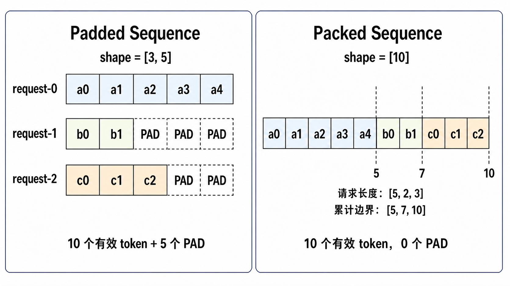

# Packed Sequence 机制设计文档

本文档基于 `executor/core/` 的当前实现，介绍 Packed Sequence 的输入布局及其在框架与模型之间的处理流程，重点说明框架如何组织 packed 输入和长度元数据，以及模型如何在 Prefill 和 Decode 阶段使用这些信息。

## 1. 两种输入布局

### 1.1 Padded Sequence 与 Packed Sequence

当一个批次包含多个长度不同的请求时，可以采用 Padded Sequence 或 Packed Sequence 组织输入。下表对比两种布局，其中 `B` 表示批内请求数，`S_max` 表示批内最大序列长度，`T` 表示当前输入中各请求 token 数之和。

| 方案 | 输入形状 | 组织方式 | 边界信息 |
|---|---|---|---|
| Padded Sequence | `[B, S_max, ...]` | 各请求沿 batch 维独立排列，并在 sequence 维补齐至批内最大序列长度 `S_max` | 请求由 batch 维度分隔，有效长度通常由 mask 或长度信息表示 |
| Packed Sequence | `[T, ...]` | 按请求顺序拼接每个请求的有效 token，不插入 padding | 通过每请求长度和累计长度描述请求边界 |

下图以序列长度分别为 5、2、3 的三个请求为例，对比两种输入布局：

<p align="center">
  
</p>

Padded Sequence 中，每个请求对应 batch 维的一个索引，并在 sequence 维补齐至最大长度 5，因此输入 shape 为 `[3, 5]`，共包含 5 个 padding 位置。Packed Sequence 则按请求顺序仅拼接 10 个有效 token，形状为 `[10]`；累计边界 `[5, 7, 10]` 将三个请求划分为 `[0, 5)`、`[5, 7)` 和 `[7, 10)` 三个区间。

### 1.2 Packed Sequence 的优势

相比于 Padded Sequence，Packed Sequence 主要有以下优势：

- **减少 padding 带来的开销**：Padded Sequence 的输入 shape 为 `[B, S_max, ...]`，批内共有 `B * S_max` 个序列位置，其中仅 `T` 个位置对应有效 token，其余为 padding。padding 位置虽然不包含有效请求数据，但仍会扩大输入及中间张量，增加 Prefill 阶段的计算量、临时设备内存占用和数据读写。Packed Sequence 仅保留 `T` 个有效 token，避免由 padding 位置带来的额外开销；请求长度差异越大，收益越明显。
- **统一输入与元数据约定**：Prefill 和 Decode 都按一维 token 序列组织当前 step 的输入，并使用长度元数据描述请求范围。两个阶段可以沿用相同的框架与模型接口，无需依赖固定的 batch 维和 sequence 维表达请求边界。
- **便于关联 Paged KV Cache**：`slot_mapping` 与 packed 输入逐 token 对齐，用于确定当前输入 token 对应的 K/V 在 Paged KV Cache 中的写入位置。

Packed Sequence 的代价是请求边界无法再由张量维度直接区分，需要额外使用长度元数据进行描述。综合上述收益与代价，**当前框架选择 Packed Sequence 作为模型输入布局。**

## 2. Packed Sequence 处理路径

本章介绍 Packed Sequence 在框架与模型之间的处理流程。总体上，框架侧与模型侧遵循以下接口约定：

1. 框架按请求顺序将当前 step 的输入 token 组织为一维 `input_ids`，并提供与其逐 token 对齐的 `position_ids`。
2. 框架通过 `ForwardMetaData` 提供每请求长度和 packed 序列的累计边界；启用 Paged KV Cache 时，还会提供 `block_table` 和 `slot_mapping`。
3. 模型接收 packed 输入后，可以保持按 token 维展平的 packed 布局，也可以根据算子接口转换为其他布局。无论采用哪种布局，都必须保留各请求的边界；需要识别请求边界的算子使用长度元数据，不能将整个 packed 输入视为一个请求。
4. 模型将 logits 按请求组织后返回：Prefill 为 `[B, 1, vocab]`，Decode 为 `[B, q_len, vocab]`，其中 `q_len` 表示 Decode 当前 step 每个请求提交的 query token 数。未启用多 Token 预测（Multi-Token Prediction，MTP）时，`q_len = 1`；启用 MTP 时，`q_len = next_n + 1`。

下图给出总体路径，后续分别说明框架提供的模型输入和模型侧的处理方式。

```text
model_inputs（框架与模型的边界）
├── input_ids: [T]
├── position_ids: [T]
└── forward_metadata：阶段、长度、请求边界和 Cache 元数据
    ├── is_prefill
    ├── actual_seq_lengths_*
    └── block_table / slot_mapping
│
▼
model.forward(input_ids, position_ids, forward_metadata, **kwargs)
        │
        ├── Embedding 与布局适配
        │   ├── input_ids -> hidden states
        │   └── 根据模型和算子接口保持按 token 维展平的 packed 布局或转换布局
        │
        ├── Position Encoding
        │   └── 使用与输入 token 逐项对齐的 position_ids
        │
        ├── Decoder Layers
        │   ├── Attention 根据长度元数据识别请求边界
        │   ├── Paged KV Cache
        │   │   ├── slot_mapping 关联 K/V 写入位置
        │   │   └── block_table 定位各请求使用的 Cache block
        │   └── Attention、FFN 等计算保持 token 与请求的对应关系
        │
        ├── 输出整理与 LM Head
        │   ├── Prefill: 取每个请求最后一个 token -> [B, 1, vocab]
        │   └── Decode: 保留每请求 q_len 个 token -> [B, q_len, vocab]
        │
        ▼
        ExecutionEngine
        ├── 根据 logits 采样
        └── 更新 Request 状态
```

### 2.1 框架提供的模型输入

在一次 Prefill 或 Decode 执行中，框架将当前批次的输入整理为 `model_inputs`，并在调用模型的 `forward()` 时按字段传入。对于 Packed Sequence，模型需要关注其中的 token、位置信息，以及描述请求长度和边界的元数据。

`ExecutionEngine._build_model_inputs()` 构造 `model_inputs`，其与 Packed Sequence 相关的顶层字段如下：

| 字段 | 类型 | 有效部分形状 | 含义 |
|---|---|---|---|
| `input_ids` | `torch.Tensor` | `[T]` | 按请求顺序排列的当前 step 输入 token。 |
| `position_ids` | `torch.Tensor` | `[T]` | 每个 token 在所属请求序列中的位置整数索引。 |
| `forward_metadata` | `ForwardMetaData` | — | 当前 forward 所需的阶段、长度、边界和 Cache 信息。 |

`ForwardMetaData` 中与 Packed Sequence 相关的主要字段如下：

| 字段 | 类型 | 有效部分形状 | 含义 |
|---|---|---|---|
| `is_prefill` | `bool` | scalar | 当前输入是否为 Prefill。 |
| `actual_seq_lengths_kv` | `torch.Tensor` | `[B]` | 每个请求执行当前 Attention 时可见的 KV token 总数。 |
| `actual_seq_lengths_q` | `torch.Tensor` | `[B]` | 每个请求当前 query token 数；Prefill 为对应 prompt 长度，Decode 为 `q_len`。 |
| `actual_seq_lengths_cu_kv` | `torch.Tensor` | `[B]` | `actual_seq_lengths_kv` 的前缀和。 |
| `actual_seq_lengths_cu_q` | `torch.Tensor` | `[B]` | `actual_seq_lengths_q` 的前缀和；第 `i` 项是第 `i` 个请求在 packed query 中的结束偏移（不含该位置）。 |
| `prompt_tokens` | `int` | scalar | 仅用于 Prefill，表示当前批次补齐前的有效 prompt token 总数；Decode 不使用，值为 `0`。 |
| `actual_seq_lengths_list_kv`、`actual_seq_lengths_list_q` | `list[int]` 或 `None` | `[B]` | `npugraph_ex` Decode 使用的普通长度 host list。 |
| `actual_seq_lengths_cu_list_kv`、`actual_seq_lengths_cu_list_q` | `list[int]` 或 `None` | `[B]` | `npugraph_ex` Decode 使用的长度前缀和 host list。 |
| `block_table` | `dict[str, torch.Tensor]` 或 `None` | 每个 Cache 分组为 `[B, max_block_num]` | Paged KV Cache 中每个请求对应的物理 block 表。 |
| `slot_mapping` | `dict[str, torch.Tensor]` 或 `None` | 每个 Cache 分组为 `[T]` | 当前 query token 到物理 cache slot 的映射。 |
| `cp_metadata` | `PrefillCPMetaData` 或 `None` | — | 框架为 Prefill CP 构造的补齐、切分和 Cache 映射元数据；未启用 CP 时为 `None`。 |

表中的 `B` 和 `T` 只统计当前批次补齐前的实际请求及其输入 token。实际执行时，框架可能根据执行阶段或并行配置扩展输入：Decode 阶段，`ExecutionEngine` 会将输入补齐到框架计算的单个 DP rank batch size，以保持固定的 batch shape，`input_ids`、`position_ids`、长度元数据、`block_table` 和 `slot_mapping` 的实际形状会相应扩展。启用 Prefill CP 时，框架会按 CP 计算要求补齐输入，并在 `forward_metadata` 中提供 `cp_metadata`。此时 `input_ids`、`position_ids` 的长度会相应扩展，而表中的 `T` 和普通长度字段仍描述补齐前的有效输入。

涉及序列长度的字段分为以下三类：

- **普通长度**（如 `actual_seq_lengths_q`）表示每个请求自身的长度。
- **累计长度**（如 `actual_seq_lengths_cu_q`）是普通长度的前缀和，表示每个请求在 packed query 中的结束偏移（不含该位置），供算子识别请求边界。
- **list 变体**（如 `actual_seq_lengths_cu_list_q`）用于图模式 `npugraph_ex` Decode 路径，使静态图所需的序列长度信息在 host 端可见。

模型适配时，应根据具体处理路径及算子接口选用相应的普通长度、累计长度或 list 变体，无需在所有路径中使用全部字段。

下面通过同一组请求说明 Prefill 和 Decode 阶段的输入组织方式。

<a id="prefill-example"></a>

**Prefill 示例**

Prefill 阶段，框架按请求顺序拼接批内所有请求的 prompt token。以下示例包含三个 prompt 长度分别为 5、2、3 的请求：

```text
request-0: [a0 a1 a2 a3 a4]
request-1: [b0 b1]
request-2: [c0 c1 c2]

input_ids:                  [a0 a1 a2 a3 a4 | b0 b1 | c0 c1 c2]
position_ids:               [ 0  1  2  3  4 |  0  1 |  0  1  2]
actual_seq_lengths_q = actual_seq_lengths_kv = [5, 2, 3]
actual_seq_lengths_cu_q = actual_seq_lengths_cu_kv = [5, 7, 10]
```

累计长度 `[5, 7, 10]` 表示三个请求在 packed 输入中的结束偏移（不含该位置）。若使用 Paged KV Cache，同一组请求还对应以下 Cache 元数据（假设 `block_size = 4`）：

```text
block_table（仅展示当前已分配的 block）:
request-0: [2, 7]
request-1: [5]
request-2: [1]

slot_mapping:
request-0, position [0, 1, 2, 3, 4] -> slot [8, 9, 10, 11, 28]
request-1, position [0, 1]          -> slot [20, 21]
request-2, position [0, 1, 2]       -> slot [4, 5, 6]

packed slot_mapping: [8, 9, 10, 11, 28 | 20, 21 | 4, 5, 6]
```

<a id="decode-example"></a>

**Decode 示例**

延续上述三个请求。Prefill 计算完成后，框架根据模型输出为各请求采样，分别得到 `a5`、`b2` 和 `c3`，并将这些 token 作为下一次 Decode 的输入。以下仅展示三个真实请求及其 token，实际执行时的补齐规则见前文说明：

```text
input_ids:                    [a5 | b2 | c3]
position_ids:                 [ 5 |  2 |  3]
actual_seq_lengths_q:         [1, 1, 1]
actual_seq_lengths_cu_q:      [1, 2, 3]
actual_seq_lengths_kv:        [6, 3, 4]
```

`a5`、`b2` 和 `c3` 在各自请求中的位置分别为 5、2、3。计入当前 token 后，三个请求可见的 KV 长度分别为 6、3、4。

若使用 Paged KV Cache，沿用 Prefill 阶段的 Cache 分配，当前三个 query token 对应的写入位置为：

```text
block_table（仅展示当前已分配的 block）:
request-0: [2, 7]
request-1: [5]
request-2: [1]

slot_mapping: [29, 22, 7]
```

`input_ids`、`position_ids` 和 `slot_mapping` 按相同的请求顺序组织，长度元数据描述各请求的 query 边界和可见 KV 长度。启用 MTP 时，`input_ids`、`position_ids` 和 `slot_mapping` 均按每请求 `q_len` 个 token 扩展，相关长度和累计边界也随之更新。

### 2.2 模型侧处理

本节从模型适配的视角说明如何使用框架构造的 `model_inputs`，包括 Prefill 与 Decode 阶段的输入处理、请求边界识别、KV Cache 访问以及 logits 输出组织。

#### 2.2.1 Prefill 阶段的处理

Prefill 阶段，模型一次接收当前批次按请求顺序拼接的一维 prompt 输入。各请求的 prompt 长度可以不同，因此不同请求的 Attention 范围必须相互隔离。

沿用 [2.1 节中的 Prefill 示例](#prefill-example)。模型首先使用与 `input_ids` 逐 token 对齐的 `position_ids` 完成位置编码；`position_ids` 表示每个 token 在所属请求序列中的位置，而不是 batch 内的全局位置。进入 Attention 计算时，模型将框架提供的累计 Q/KV 边界传给算子，由算子识别各请求的 Q/KV 范围并分别计算，避免不同请求之间发生 Attention。

以下以 [Qwen3-MoE](../../models/qwen3_moe/models/modeling_qwen3_moe.py) 的 Prefill Attention 调用为例，仅展示与 Packed Sequence 相关的参数。示例中的 `fa_ops` 是模型根据执行模式选择的算子命名空间。Q、K、V 按请求顺序沿 token 维拼接，累计长度通过算子参数传入：

```python
actual_seq_qlen = forward_metadata.actual_seq_lengths_cu_q
actual_seq_kvlen = forward_metadata.actual_seq_lengths_cu_kv

attn_output, _ = fa_ops.npu_fused_infer_attention_score_v2(
    query_states,  # [T, num_heads_per_rank, head_dim]，本例 T = 10
    key_states,  # [T, num_key_value_heads_per_rank, head_dim]
    value_states,  # [T, num_key_value_heads_per_rank, head_dim]
    input_layout="TND",  # 算子接口中的布局取值
    actual_seq_qlen=actual_seq_qlen,  # [5, 7, 10]，Q 的结束偏移（不含该位置）
    actual_seq_kvlen=actual_seq_kvlen,  # [5, 7, 10]，KV 的结束偏移（不含该位置）
    # ... 省略与 Packed Sequence 无关的算子参数
)
```

使用 Paged KV Cache 时，`slot_mapping` 指定 prompt K/V 的写入位置。Prefill Attention 的 K/V 来源取决于具体实现：上述 Qwen3-MoE 示例直接使用当前 packed K/V；若从 Cache 读取，则通过 `block_table` 定位各请求使用的物理 block。无论采用哪种方式，都必须保持 token 顺序、请求边界和 Cache 映射的一致性。

#### 2.2.2 Decode 阶段的处理

Decode 阶段，`input_ids` 中的有效位置只包含各真实请求在当前 step 的 query token；历史 token 不再重复输入模型，而是通过 KV Cache 参与 Attention 计算。

沿用 [2.1 节中的 Decode 示例](#decode-example)。模型使用 `position_ids = [5, 2, 3]` 完成当前 query token 的位置编码。采用 tensor 长度参数时，`actual_seq_lengths_cu_q = [1, 2, 3]` 描述各请求的 query 边界，`actual_seq_lengths_kv = [6, 3, 4]` 描述各请求可见的 KV 长度；`npugraph_ex` 路径使用 2.1 节所述的相应 list 变体。

Decode 使用 Paged KV Cache 时，`slot_mapping` 描述当前 query token 的 K/V 写入位置，`block_table` 描述各请求使用的 Cache block。模型应根据具体的 Cache 和 Attention 接口使用这些元数据，并保持 query token、请求边界与 Cache 映射的对应关系。

以下以 Qwen3-MoE 的 Decode 路径为例。该实现先根据 `slot_mapping` 更新 Cache，再将 `block_table` 传给 Attention 算子，以读取包含当前 token 在内的可见 K/V。代码仅展示与 Packed Sequence 和 Paged KV Cache 相关的部分：

```python
actual_seq_qlen = forward_metadata.actual_seq_lengths_cu_q
actual_seq_kvlen = forward_metadata.actual_seq_lengths_kv

key_states, value_states, key_scale, value_scale = self.kv_cache_update(
    slot_mapping, key_states, value_states
)

attn_output, _ = fa_ops.npu_fused_infer_attention_score_v2(
    query_states,
    key_states.view(*key_states.shape[:2], -1),  # Paged K Cache
    value_states.view(*value_states.shape[:2], -1),  # Paged V Cache
    input_layout="TND",  # 算子接口中的布局取值
    actual_seq_qlen=actual_seq_qlen,  # [1, 2, 3]，Q 的结束偏移（不含该位置）
    actual_seq_kvlen=actual_seq_kvlen,  # [6, 3, 4]，每个请求可见的 KV 长度
    block_table=block_table,
    block_size=self.block_size,
    # ... 省略与 Packed Sequence 和 Paged KV Cache 无关的算子参数
)
```

#### 2.2.3 Logits 输出约定

模型 forward 返回的 logits 需要按请求维度组织，使框架能够为每个请求独立完成采样：

- Prefill：根据 `actual_seq_lengths_cu_q - 1` 定位每个请求的最后一个 token，返回这些位置的 logits，形状为 `[B, 1, vocab]`。
- Decode：对于 `B` 个真实请求，保留每个请求当前 step 中 `q_len` 个 query 的有效 logits，形状为 `[B, q_len, vocab]`。

Decode 阶段，可由 `actual_seq_lengths_q` 的元素个数确定模型实际处理的 batch size。使用静态 shape 时，该 batch size 包含补齐位置；`ExecutionEngine` 完成采样后，按真实请求数 `B` 截取采样结果，补齐位置不参与请求状态更新。

### 2.3 并行场景下的长度差异

Prefill 采用 Packed Sequence 后，每个 Attention 数据并行（Attention DP）副本实际处理的 token 数由其请求的 prompt 长度决定。即使各副本处理的请求数相同，输入在 token 维上的长度也可能不同，因此可能在模型并行处理中引发以下问题：

- **集合通信输入 shape 不一致**：当后续张量并行（TP）或专家并行（EP）通信组包含来自不同 Attention DP 副本的 rank 时，各 rank 参与通信的张量可能在 token 维上长度不同。对于要求输入 shape 一致的集合通信，需要在实现中处理这种差异。
- **MoE chunk 数量不一致**：如果 chunk 数量根据各 rank 实际处理的 token 数计算，不同 rank 可能执行不同数量的 chunk。当 chunk 内包含集合通信时，需要保证组内通信调用的次数和顺序一致。
