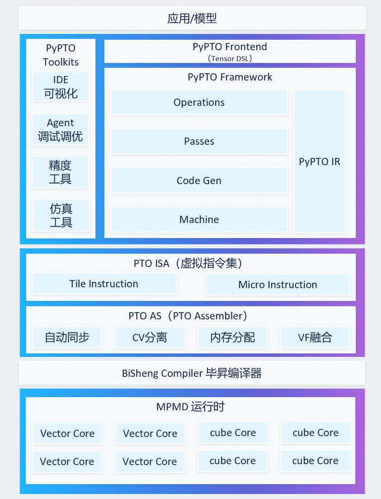
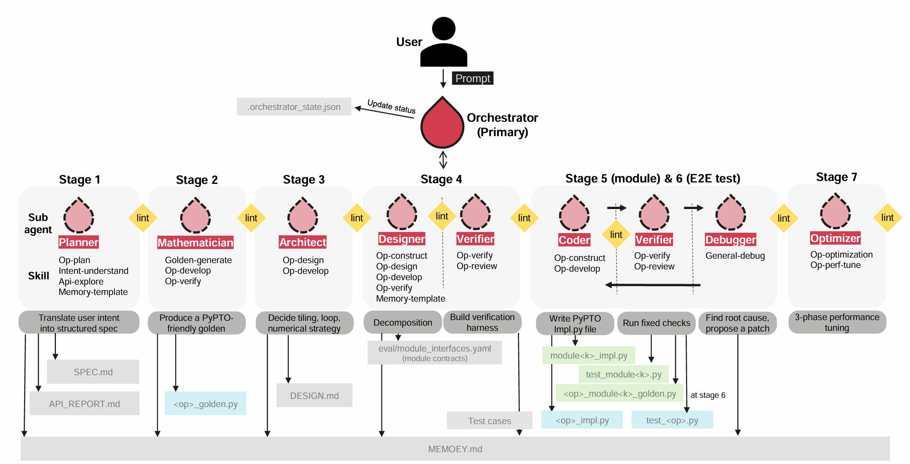
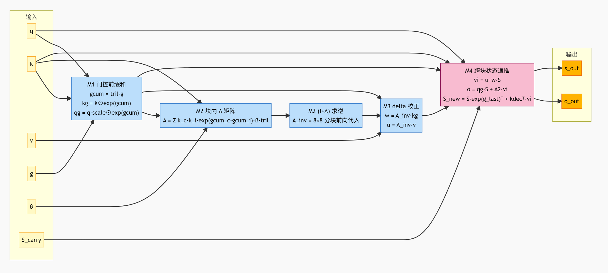
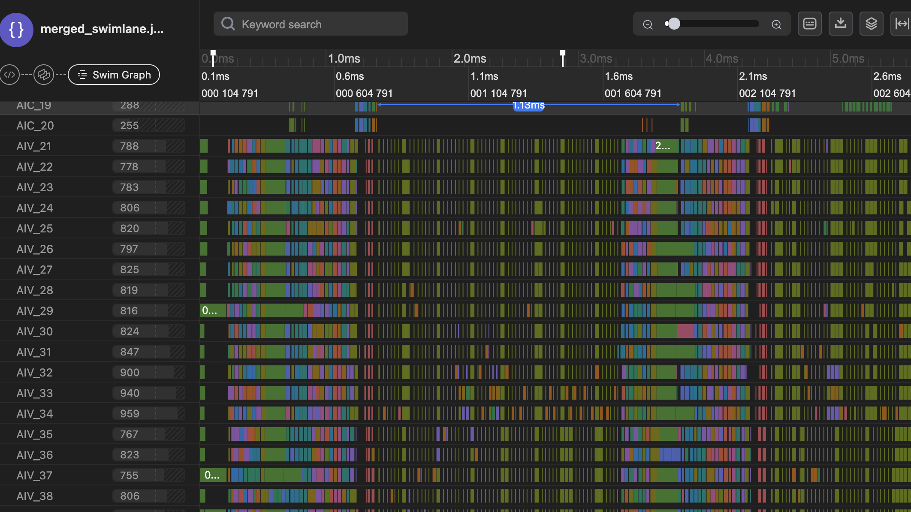
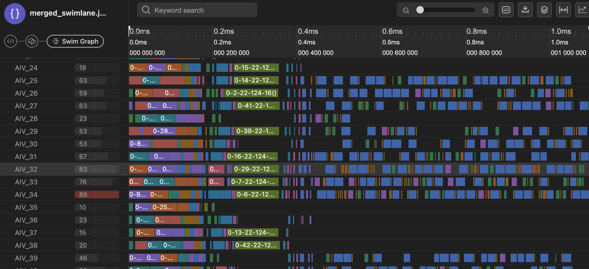
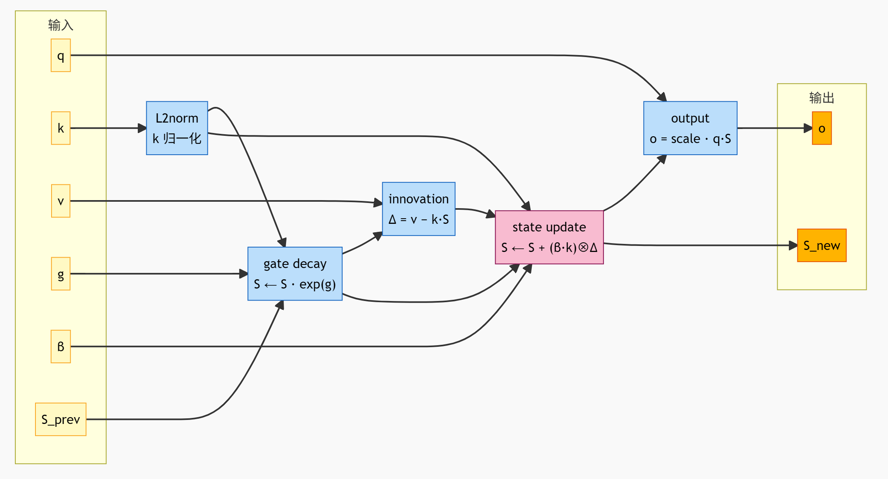
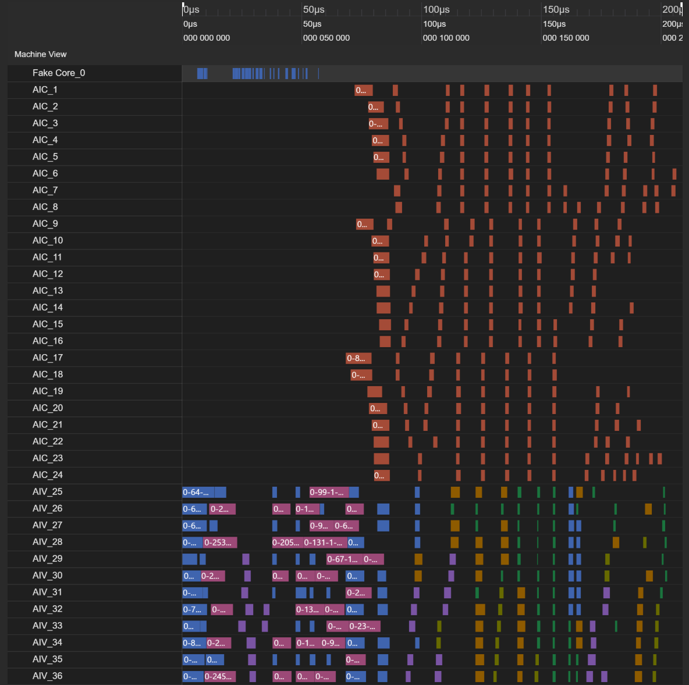
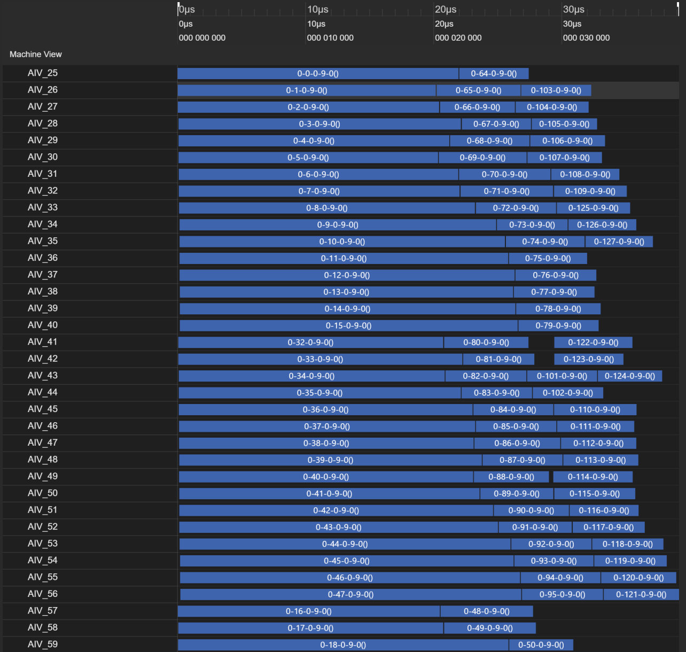

# NPU 百灵模型 ling-3.0-flash PyPTO 融合算子开发优化实践

大模型推理与训练对底层算子的吞吐与访存效率提出了极高要求。单算子逐个下发带来大量 kernel 启动开销与 Global Memory 冗余搬运，**算子融合**是缓解这一瓶颈的关键手段。然而，融合算子开发面临代码量大、SRAM 排布敏感、硬件定制依赖重、调参维度多等挑战，手写方式难以为继。

**百灵模型 ling-3.0-flash** 在注意力机制中采用了 **KDA（Kimi Delta Attention）** 算子，该算子融合了矩阵向量计算、递推累积、状态更新等多段计算逻辑，对核内数据复用与多核并行调度要求较高，是典型的复杂融合算子。传统手写 Kernel 方式难以兼顾高效开发与极致性能，亟需一种高效的融合算子开发范式。

**PyPTO** 基于 Tile 编程范式，让开发者以 Tensor 级 API 描述计算逻辑，框架自动完成 Tiling、内存搬运、调度与代码生成，使百灵模型 ling-3.0-flash 中的 KDA 等复杂融合算子的开发与调优从手工试错转变为系统化、自动化流程。

## PyPTO 简介

**PyPTO** 是 CANN 推出的一款面向 AI 加速器的自研编程框架，旨在简化复杂融合算子乃至整个模型网络的开发流程，同时保持高性能计算能力。该框架采用创新的 **PTO（Parallel Tensor/Tile Operation）编程范式**，以**基于 Tile 的编程模型**为核心设计理念，通过多层次的中间表示（IR）系统，将用户通过 API 构建的 AI 模型应用从高层次的 Tensor 图逐步编译成硬件指令，最终生成可在目标平台上高效执行的可执行代码。

### 核心优势

- **编程易用性**：提供 Python 友好的 Tensor 级别 API，贴近算法开发者的思维模式，开发者只需描述"做什么"，框架自动处理"怎么做"（Tiling、内存搬运、调度、代码生成），无需感知底层硬件细节，显著降低算子开发门槛。
- **开发效率高**：基于多 Agent 协同的算子开发与调优流程（详见第二章），将算子开发分解为 7 个 Stage 自动推进，覆盖从需求规格到性能调优的全链路；配合可视化工具链，问题定位效率大幅提升，缩短算子交付周期。
- **快速迭代与迁移**：算法层表达与硬件层执行解耦，算子代码可快速修改、快速适配新 Shape/新场景；Tensor 级别的声明式写法与 Torch 表达接近，GPU 算子向 NPU 迁移时只需重写计算图描述，无需重写底层 Kernel，迁移成本低。
- **跨代兼容**：PTO 指令集作为硬件抽象层，同一份算子代码经不同目标平台编译器即可在多代 NPU 上运行；同代 NPU 不同形态（训练/推理、不同核数配置）间无需修改算子代码，由运行时自动适配调度。
- **自动调优**：将性能调优手段参数化抽象为可配置项，并支持自动调优。框架以 Human-In-The-Loop 方式辅助开发者提高调优效率，开发者基于可视化泳道图进行性能分析和调优。
- **MPMD 高效调度**：采用 MPMD（Multiple Program Multiple Data）执行模型，自动完成任务调度，不同核可在同一时间执行不同程序，避免全局同步开销，充分利用多核并行能力（详见下文 MPMD 小节）。
- **硬件亲和性**：算子经编译转换为 PTO 指令（PTO-ISA 虚拟指令集），由目标平台编译器映射为硬件指令。开发者无需手写硬件定制代码，框架自动生成访存与计算指令，充分利用核内 SRAM 层次结构与并行计算能力。
- **DFX 能力**：提供完整的可维可测工具链——编译各阶段中间产物（Tensor/Tile/Block/Execute Graph）可导出可视化，运行时性能数据（泳道图、气泡分析、核使用率）可采集分析，支持精度逐层对比与根因定位，实现算子快速迭代调优。

### 整体架构

PyPTO 框架采用分层架构设计，从用户 API 到底层硬件执行，共分为以下几个层次：

- **用户 API 层**：是 PyPTO 框架与开发者交互的接口层，提供 Python 友好的编程接口，使开发者能够以直观的方式表达计算逻辑，而无需深入了解底层硬件实现细节。
- **框架编译层**：采用多层级计算图表达，支持从高到低多个抽象层次的计算图的优化和转换：
  - **Tensor Graph**：高层次的 Tensor 操作，贴近算法设计者的数学表达式。该阶段实现与硬件无关的图优化，包括冗余操作消除、类型转换、内存冲突推断等。
  - **Tile Graph**：硬件感知的 Tile 操作，根据 TileShape 进行 Tile 展开，实现 Tile 级别的优化，包括内存类型分配、移动操作生成、子图切分等。
  - **Block Graph**：子图分区，切分生成计算子图，进行 Block 级别的优化，包括乱序调度、内存重用、同步点插入等。
  - **Execute Graph**：执行图，整合计算子图信息，编排生成最终的执行图，分析 Block Graph 之间的依赖关系，规划全局资源，生成调度提示。
  - 编译过程通过模块化的 Pass 实现，每个阶段由多个 Pass 组成，负责特定阶段优化或转换任务。
- **代码生成层**：将优化后的计算图转换为目标平台的可执行代码。从 Execute Graph 生成 PTO 虚拟指令集（PTO Virtual Instructions），再通过编译器将虚拟指令代码编译为目标平台代码。
- **调度执行层**：负责将可执行代码在设备上调度执行，通过 MPMD 方式将任务调度到设备处理器核。

### MPMD 运行时

PyPTO 采用 MPMD（Multiple Program Multiple Data）执行模型，与传统 SPMD（Single Program Multiple Data）模型相比：

- **SPMD**：用户需编写单一内核逻辑并实例化到多个处理器核上运行，所有核执行相同程序，带来全局同步开销和性能瓶颈。
- **MPMD**：计算被抽象为一组异构任务，任务之间通过数据依赖关系组织。运行时调度器根据依赖关系将任务分配到合适的执行单元，不同核可在同一时间执行不同程序，避免了全局同步限制。

经切图得到的子图是 PyPTO 的最小执行单元，每个子图编译成可执行文件并生成对应任务，被分发到不同核上执行。整个运行过程为：

1. 根据子图间的数据依赖，创建任务间依赖；
2. 调度 AICPU 根据任务拓扑顺序下发无前置依赖的任务到空闲 AI 核，AI 核收到任务后立即异步执行；
3. 任务执行完成后调度 AICPU 收到回调信息，解除后续任务依赖并继续尝试下发。

当一个任务解依赖完成后即可与不同 AI 核上的任务异步并行执行，无需等待全局同步。这一机制使 Cube 核与 Vector 核可交替并行工作。

---

## PyPTO Agent 介绍

### Agent 详解

PyPTO 仓集成了**多智能体（Multi-Agent）团队**，将算子开发分解为 7 个 Stage 自动推进，由职责分明的子智能体协同完成。所有调度由 `pypto-op-orchestrator` 统一负责，子智能体之间通过记忆模式和机器可读状态交换信息。整个流程从自然语言算子需求输入，到最终产出精度通过、性能调优完成的可上板算子，无需人工介入各阶段交接。各 Stage 的工作流如下图所示：

各 Stage 的工作原理、拥有者及对应的 Agent Skill 如下表：

| Stage | 名称 | 工作原理 | 拥有者 | 关键 Skill |
|-------|------|---------|--------|-----------|
| **1** | Planning（规划） | 将自然语言算子需求转化为结构化规格，并调研 PyPTO API 映射、约束与可行性，确认 API 对应关系 | `pypto-op-planner` | `pypto-intent-understand`、`pypto-api-explore`、`pypto-op-plan` |
| **2** | Algorithm（算法） | 生成 PyPTO 友好的 torch golden 参考实现，标注所有中间张量 shape，并通过 NPU Profiling 采集 golden 性能基线 | `pypto-op-mathematician` | `pypto-golden-generate` |
| **3** | Architecture（架构） | 计算图分解决策、API 映射与精度路由、自动 tiling 策略、循环/数据流设计 | `pypto-op-architect` | `pypto-op-design` |
| **4** | Design（设计） | 模块分解、接口定义、算子设计、高性能编程范式选取 | `pypto-op-designer`、`pypto-op-verifier` | `pypto-op-construct` |
| **5** | Construction（构建） | 每个子模块增量实现循环：coder → verifier (-> debugger) → coder -> cleanup，最终完成算子实现 | `pypto-op-coder`、`pypto-op-verifier`、`pypto-op-debugger` | `pypto-op-develop`、`pypto-op-verify`、`pypto-general-debug` |
| **6** | Verification（验证） | 对算子实现文件进行精度校验 + lint 门禁校验 | `pypto-op-verifier` | `pypto-op-verify` |
| **7** | Optimization（优化） | 三阶段配置级调优：**FRONTEND**（代码层级）→ **SWIMLANE**（泳道层级）→ **INCORE**（核内流水） | `pypto-op-orchestrator` | `pypto-op-perf-tune`、`perf-analyzer`、`tune-frontend`、`tune-swimlane`、`tune-incore` |

在上述 7 个 Stage 中，Stage 3（架构设计）的 Tiling 策略与 Stage 7（优化）的性能调优是决定算子最终性能的两个关键环节，且二者高度依赖 PyPTO 框架的自动化能力。下面分别介绍框架的自动 Tiling 机制与自动性能调优体系。

### 自动 Tiling

TileShape 定义了数据在硬件不同计算单元中的切分方式，直接影响数据搬运与计算效率。PyPTO 的 Tiling 机制使开发者无需手动管理核内 SRAM 的分配与搬运，框架根据 TileShape 配置自动完成 Tensor Operation 到 Tile Operation 的展开，并自动插入 GM↔SRAM 的数据搬运指令。

- **Vector 计算**：通过 `set_vec_tile_shapes` 设置各维度切分大小，数据按切分粒度搬入 Unified Buffer（UB）进行向量运算。切分粒度越大，单次处理数据量越多，但受 UB 容量约束。
- **Cube 计算**：通过 `set_cube_tile_shapes` 设置矩阵乘 m/k/n 三轴在 L0 与 L1 两级缓冲的切分大小。合理切分可充分利用 L0/L1 缓冲区，减少数据搬运开销；对 M/N 较小而 K 较大的场景，可开启 `enable_split_k` 使能 K 轴分核以提升多核利用率。
- **框架自动处理**：开发者仅需设置 TileShape 参数，框架按内置 Tiling 方法将 Tensor Operation 计算图展开为 Tile Operation 计算图，并根据 Operation 亲和性（Cube/Vector 分核执行）、子图同构性（减少编译耗时与 ICache Miss）、子图并行度与重复搬运的权衡，自动切分子图、插入搬运指令、分配核内 SRAM。

Tiling 策略解决了数据如何切分与搬运的问题，而切分完成后，算子能否达到预期性能还取决于调度策略、核内流水等多维度参数的调优。为此，PyPTO 提供了一套系统化的自动性能调优体系。

### 自动性能调优

性能调优由 `pypto-op-perf-tune` skill 驱动，采用**编排器（tune-orchestrator）+ 三层领域子技能**的架构。编排器常驻全程，负责状态机推进、门控校验、迭代轮次控制与 Todo 维护，不负责具体优化建议或代码修改；三个领域子技能按固定顺序按需加载，每层聚焦不同抽象级别的优化。各 skill 集成了算子专家经验，并形成了性能调优库，涵盖常见算子类型的调优策略、TileShape 推荐配置、泳道并行模式及核内流水模板，使调优过程可复用、可迁移，大幅降低新算子的调优门槛。

| 层级 | 子技能 | 调优对象 | 优化手段 |
|------|--------|---------|---------|
| **1. FRONTEND（开箱）** | `tune-frontend` | 代码级优化 | loop 写法优化、TileShape 设置、基础 runtime_options、数据操作优化 |
| **2. SWIMLANE（深度）** | `tune-swimlane` | 任务调度与并行 | 泳道图分析、核使用率/负载均衡分析、Stitch 调优、合图调优、L1Reuse、调度策略、TileShape 深度调优 |
| **3. INCORE（核内）** | `tune-incore` | 单 task 指令级 | 单 task 实现指令与 operation 分析、指令级优化、核内流水优化 |

---

以上介绍了 PyPTO 的编程模型、架构设计、Agent 开发流程以及自动 Tiling 与调优能力。接下来，将以百灵模型 ling-3.0-flash 中的 KDA 融合算子为实际案例，展示上述能力在复杂融合算子开发中的端到端应用与 Human-In-The-Loop 调优实践。

## KDA 融合算子开发实战

百灵模型 ling-3.0-flash 采用 **KDA（Kimi Delta Attention）** 作为线性注意力机制，以逐通道门控衰减 + Delta Rule 先删后写的状态更新取代标准 Softmax Attention，将复杂度从 $O(L^2)$ 压到 $O(L)$，同时保留块内精度。其推理路径分为 **prefill（分块）** 与 **decode（递推）** 两个阶段，分别由 `chunk_kda` 与 `fused_recurrent_kda` 两个 PyPTO 融合算子承载。本文以这两个算子为例，从融合算子开发者的视角，阐述在 PyPTO 编程框架下如何进行不同融合范围的算子开发与 Human-In-The-Loop 调优。

### KDA 算法概述

标准 Softmax Attention 需显式构造 $L \times L$ 的注意力矩阵并做 softmax 归一化，计算与显存复杂度均为 $O(L^2)$，长序列下成为吞吐瓶颈。KDA 用三处改造把复杂度压到 $O(L)$，同时保留块内精度：

| 维度 | 标准 Attention | KDA |
|------|---------------|-----|
| 权重计算 | $\text{softmax}(qk^\top/\sqrt{d})$ | $qk^\top \odot$ 逐通道门控衰减 $\odot\,\beta$（无 softmax） |
| 复杂度 | $O(L^2)$（必须先算完整 $L\times L$ 矩阵） | $O(L)$（块内 $O(64^2)$ 精确 + 跨块 $O(64\cdot d)$ 状态递推） |
| 显存 | $O(L^2)$（存注意力矩阵） | $O(L\cdot d)$（仅存状态 $S\in\mathbb{R}^{d\times d}$ + 当前块） |
| 遗忘机制 | 无（softmax 归一化抹掉绝对距离） | 逐通道门控衰减 $\exp(g)$，每个特征维度独立遗忘 |
| 状态更新 | 无状态（每步重算全部历史） | Delta Rule 先删后写，$S$ 跨块递推，可增量更新 |
| 精度 | 全序列精确 | 块内 64×64 精确，跨块状态近似 |

**KDA 的三要素使其在长序列下兼具效率与表达力**：

1. **线性注意力取代 softmax**：去掉归一化后，可利用结合律 $q\cdot\sum_i(k_i v_i^\top)=q\cdot S$，把 $L$ 个 (k,v) 对压成固定 $d\times d$ 状态 $S$，查询从 $O(L)$ 降到 $O(d)$，整体 $O(L^2)\to O(L)$。
2. **逐通道门控衰减取代标量衰减**：每个 $K$ 维度有独立门控 $g$，衰减因子 $\exp(\text{gcum}_{c,k}-\text{gcum}_{i,k})$ 按维度选择性保留/遗忘，表达能力远强于 RWKV 式标量衰减。
3. **Delta Rule 先删后写**：状态更新 $S_t = e^{g_t}\odot S_{t-1} - \beta_t k_t(k_t^\top(e^{g_t}\odot S_{t-1})) + \beta_t k_t v_t^\top$ 先沿 $k_t$ 方向擦除旧内容再写入新内容，状态可修正而非只能追加，避免线性注意力"信息只增不改"的堆积问题。

分块设计在 $O(L)$ 复杂度与块内精度间取得平衡：块内保留完整 64×64 矩阵做精确 delta 解耦，跨块才走状态近似，兼顾长序列效率与局部精度。

基于上述算法原理，KDA 的推理路径被拆分为 prefill 与 decode 两个阶段，分别由 `chunk_kda` 与 `fused_recurrent_kda` 两个 PyPTO 融合算子承载。下面依次介绍这两个算子的设计实现与调优过程。

### chunk_kda

#### 简介

chunk_kda 是 Kimi Delta Attention（KDA）的分块门控 delta-rule 线性注意力前向算子。它将序列按 `chunk_size=64` 切分：块内构造下三角删除矩阵 `A` 并用 8×8 分块前向代入求 `(I+A)^{-1}` 完成 delta 解耦，块间以状态 `S` 递推传递信息。算子将 M1（门控前缀和）、M2（块内 A 矩阵 + (I+A) 求逆）、M3（delta 校正后的 w/u）、M4（跨块状态递推）四段计算融合进单个 PyPTO JIT kernel，减少内核启动开销与 GM 读写次数，提升核内 SRAM 复用率。

#### 计算公式

##### M1 — 门控前缀和

逐通道门控衰减是乘性累积的，在对数域下变为前缀和。块内门控前缀和通过下三角矩阵乘法实现：

$$\text{gcum} = \text{tril}_{incl} \cdot g, \quad \text{gcum} \in \mathbb{R}^{64 \times K}$$

其中 $\text{tril}_{incl}$ 为含对角线的 64×64 下三角矩阵，$g \in \mathbb{R}^{64 \times K}$ 为块内门控（log 域，$\le 0$）。由此得到门控加权 key / query：

$$\text{kg} = k \odot \exp(\text{gcum}), \quad \text{qg} = (q \cdot \text{scale}) \odot \exp(\text{gcum})$$

其中 $\text{scale} = K^{-1/2} = 128^{-1/2}$，$\odot$ 为逐通道（K 维度）乘法。可选地，在 scale 之前对 q/k 做 per-token L2 归一化。

##### M2 — 块内 A 矩阵与 (I+A) 求逆

块内 token 间的 delta 删除关系矩阵 A 定义为：

$$A_{c,i} = \beta_c \cdot \sum_{d=1}^{K} k_{c,d} \cdot k_{i,d} \cdot \exp(\text{gcum}_{c,d} - \text{gcum}_{i,d}), \quad c > i$$

其中 $\beta_c$ 为 token c 的 delta 更新权重，$\exp(\text{gcum}_{c,d} - \text{gcum}_{i,d})$ 为从 i 到 c 的逐通道门控衰减。A 为严格下三角矩阵（仅 $c>i$ 非零）。$(I+A)$ 描述"1 份自身写入 + A 份对别人的删除"，其逆通过 8×8 分块前向代入层次合并求得：

$$A_{inv} = (I + A)^{-1} \cdot \text{diag}(\beta)$$

层次合并路径：8 个 8×8 叶子逆 → 4 个 16×16 → 2 个 32×32 → 1 个 64×64。实现中以 $\text{neg}(A)$ 喂入单位下三角前向代入，使返回 $(I - (-A))^{-1} = (I+A)^{-1}$。

##### M3 — Delta 校正后的 w/u

用 $(I+A)^{-1}$ 解耦后，得到每个 token 对状态的独立净贡献：

$$w = A_{inv} \cdot \text{kg}, \quad u = A_{inv} \cdot v$$

其中 $w \in \mathbb{R}^{64 \times K}$ 为 delta 校正后的 key，$u \in \mathbb{R}^{64 \times V}$ 为 delta 校正后的 value，二者均已去除块内其他 token 的重叠贡献。

##### M4 — 跨块状态递推

对每个块依次执行去重叠、读输出、更新状态三步。

**去重叠**（去掉块内 value 与跨块状态 S 的重叠）：

$$v_i = u - w \cdot S$$

**读输出**（跨块记忆 + 块内交互）：

$$o = \text{qg} \cdot S + A_2 \cdot v_i$$

其中 $A_2$ 为 q-side 注意力矩阵（结构同 A，以 q 替代 k，含对角线下三角）：

$$A_{2,c,i} = \sum_{d=1}^{K} q_{c,d} \cdot k_{i,d} \cdot \exp(\text{gcum}_{c,d} - \text{gcum}_{i,d}), \quad c \ge i$$

**更新状态**（衰减旧状态 + 写入新信息）：

$$S_{new} = S \cdot \exp(g_{last})^{\top} + k_{dec}^{\top} \cdot v_i$$

其中 $g_{last} = \text{gcum}[\text{块末行}] \in \mathbb{R}^{1 \times K}$ 为块末门控累积，$k_{dec} = k \odot \exp(g_{last} - \text{gcum})$ 为对齐到块末的衰减加权 key。状态 S 在块间串行递推（$S \leftarrow S_{new}$），跨 (n, h) 重置。

#### 计算图

##### Tensor 级计算图（逻辑数据流）

#### 性能瓶颈与优化

典型 Shape：T=4K, H=4, K=V=128，Ascend910B3。

| 瓶颈 | 原因 | 优化 |
|------|------|------|
| chunk 间串行依赖过强 | 整 chunk 原子串行，但仅 $S$ 递推需串行，块内求逆/矩阵构造可跨 chunk 重叠 | 仅对 $S$ 递推施加串行约束，释放块内无关计算并行度，加深流水深度 |
| 子图碎片化 | 小 matmul + 求逆拼装产生大量细粒度子图，调度开销超计算本身 | 合并粒度调大，求逆整体拼接替代逐块填充，循环不变量外提 |

| 优化前 | 优化后 |
|:---:|:---:|
|  |  |

通过仅对 $S$ 递推施加串行约束释放块内并行度、合并子图碎片减少调度开销，显著提升了流水并行度与核利用率，整体约 **3.8x** 加速。

---

### fused_recurrent_kda

#### 简介

`fused_recurrent_kda` 是 KDA 的**递推（decode）模式算子**，用于长序列线性注意力推理的 decode 阶段。它以 token 为粒度逐 token 递推维护一个 `[H, D, D]` 的状态矩阵 `S`，每个 token 的状态更新包含三个子步骤：门控衰减 `S ← S * exp(g_i)`、KDA delta 更新 `S ← S + outer(β_i·k_i, v_i − (k_i·S))`、输出 `o_i = q_i · S`。核内可选对 q/k 做 L2 归一化，状态以 fp32 维护以保证递推累积精度。

#### 计算公式

逐 token 递推公式（D = K = V）：

$$S \leftarrow S \cdot \exp(g_i)$$

$$\Delta_i = v_i - (k_i \cdot S)$$

$$S \leftarrow S + \text{outer}(\beta_i \cdot k_i,\ \Delta_i)$$

$$o_i = \text{scale} \cdot q_i \cdot S$$

其中 $\text{outer}(a, b)$ 表示向量 $a$（`[K]`）与向量 $b$（`[V]`）的外积，结果为 `[K, V]` 矩阵，第 $(m,n)$ 元素为 $a_m \cdot b_n$。状态更新 $\text{outer}(\beta_i \cdot k_i,\ \Delta_i)$ 即将新息 $\Delta_i$ 沿 $k_i$ 方向以秩 1 矩阵形式写回状态 $S$。

#### 计算图

每个 token 的计算在 `LOOP_T` 内完成，流程如下：

#### 性能瓶颈与优化

典型 Shape：H=4, D=128, 32 sequences, bf16，Ascend910B3。基线：209 us，核心利用率 26.36%，气泡率 71.32%。

| 瓶颈 | 原因 | 优化 | 收益 |
|------|------|------|------|
| 并行度不足 | `LOOP_SEQ`(串行) 嵌套 `LOOP_H`(parallel)，并行度仅 32，AIV 40 核有 8 核空转 | 合并为 `LOOP_NH[parallel]`，seq×head 统一并行，并行度 32→128 | 核均分到 3~4 单元 |
| Cube 核利用率低 | `k·S`/`q·S` 为 `[1,K]×[K,V]`，M=1 无法填满 Cube 流水线 | matmul 展开为 broadcast `mul` + `sum` 归约，计算迁移至 Vector 核 | 消除 Cube 空转 |
| 子图调度开销 | `LOOP_T` body 编译为 4 个子图，128 单元×4=512 任务，GM 落地+调度往返累积 | `sg_set_scope` 合 4 子图为 1，中间结果核内直传 | 任务 512→128 |

配套：`stitch_function_max_num:256`、`vec_nbuffer_setting:{-2:1,-1:4}`、`vec_tile_shapes(128,128)`、q/k/v/g 标 `NONE_CACHEABLE`、`combine_axis=True`。优化后：36 us，核心利用率 63.08%，气泡率 1.11%，整体 **5.8x** 加速。

| 优化前 | 优化后 |
|:---:|:---:|
|  |  |

通过合并循环轴提升并行度、小 matmul 迁移至 Vector 核消除 Cube 空转、合图减少子图调度，显著提升了核利用率与流水效率，整体 **5.8x** 加速。

---

## 下一步计划

基于上述两个 KDA 融合算子的调优实践，后续算子性能优化方向集中在以下几个层面：

### 1. 性能挖掘

- **消除 Pipeline Bubble**：分析任务间依赖，将不依赖的计算，尽可能并行。
- **子图去碎片化**：关注子图粒度，增加合图策略，避免碎片化。

### 2. 框架与工具链增强

- **MPMD 调度优化**：`fused_recurrent_kda` 中 AIV 等待全为调度等待而非前序等待，调度是瓶颈。需框架侧提升小任务调度密度与 L2 亲和调度策略。
- **自动合图能力**：部分合图是调优工具尝试调整合图参数达成的，后续可增强框架自动合图能力。

### 3. 跨算子整网融合

- **整网级融合**：将 ling-3.0-flash 中相对独立的算子（如 KDA 的 prefill 与 decode、MLA Prolog、FFN 等）先各自调优至接近最优，再通过 PyPTO 框架融合成更大范围的算子，挖掘跨子算子的并行度与内存复用空间，以期获得整网级最优性能。
- **MegaKernel**：PyPTO 支持 MegaKernel 模式，将多个算子的计算逻辑合并到单一 Kernel 中执行，消除算子间的 GM 读写与调度开销，实现跨算子的数据复用与流水并行，是整网级融合的关键路径。