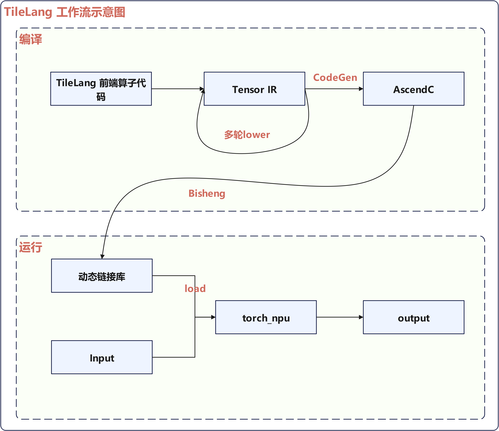
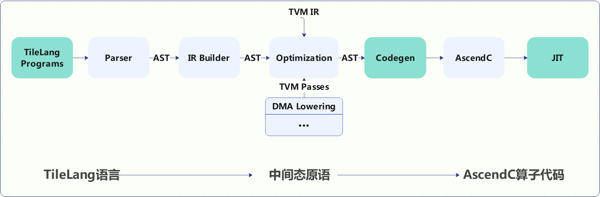
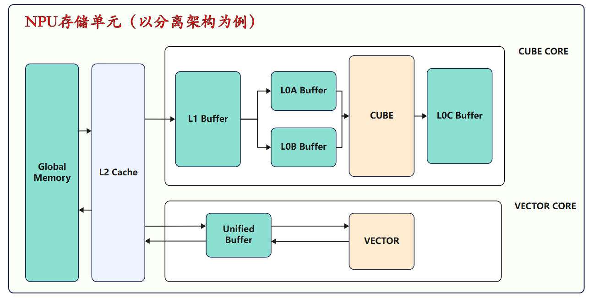
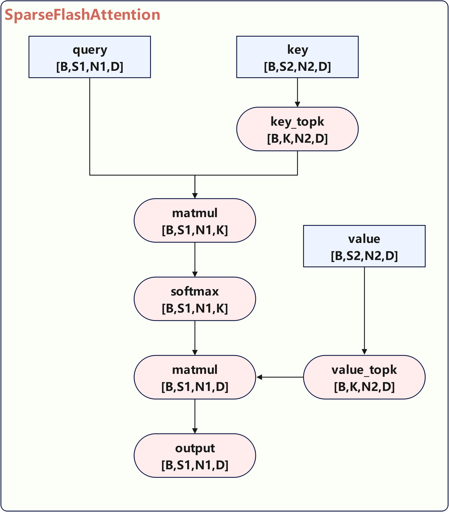
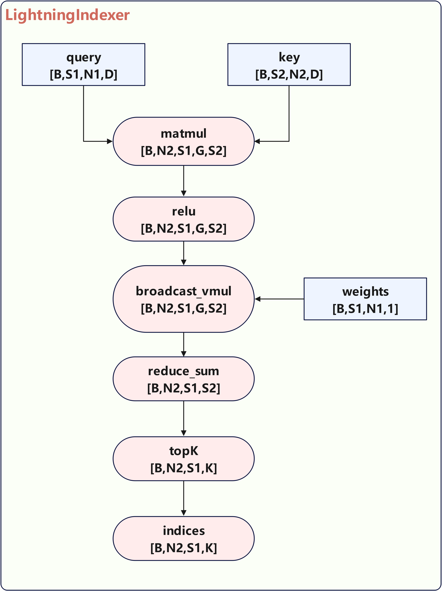
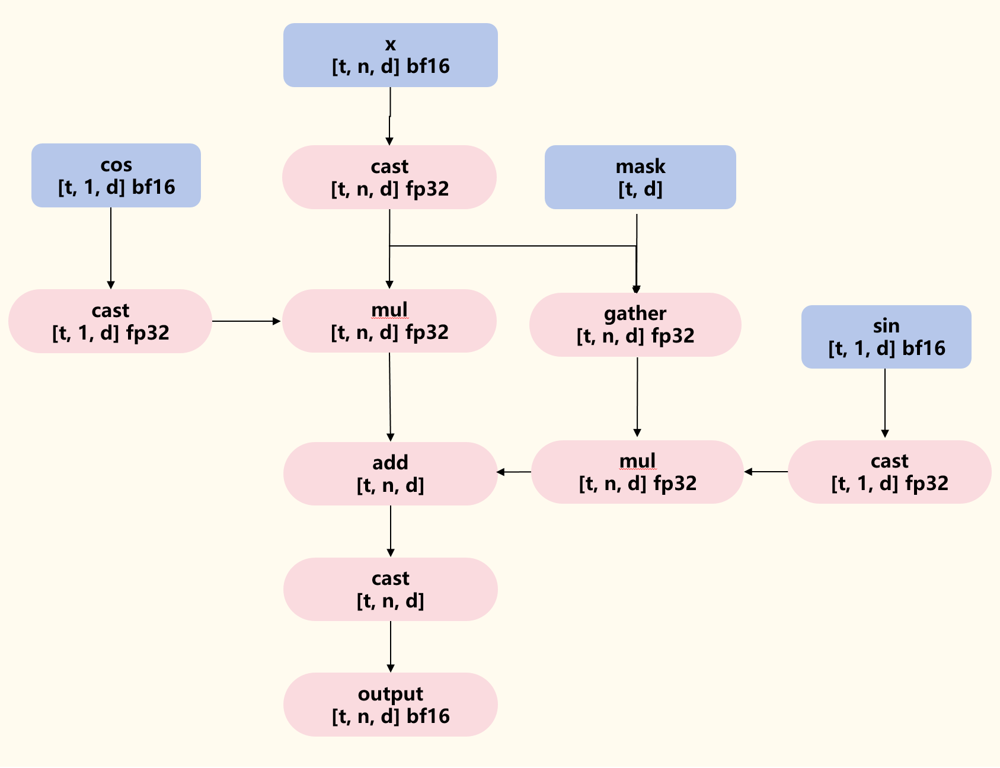
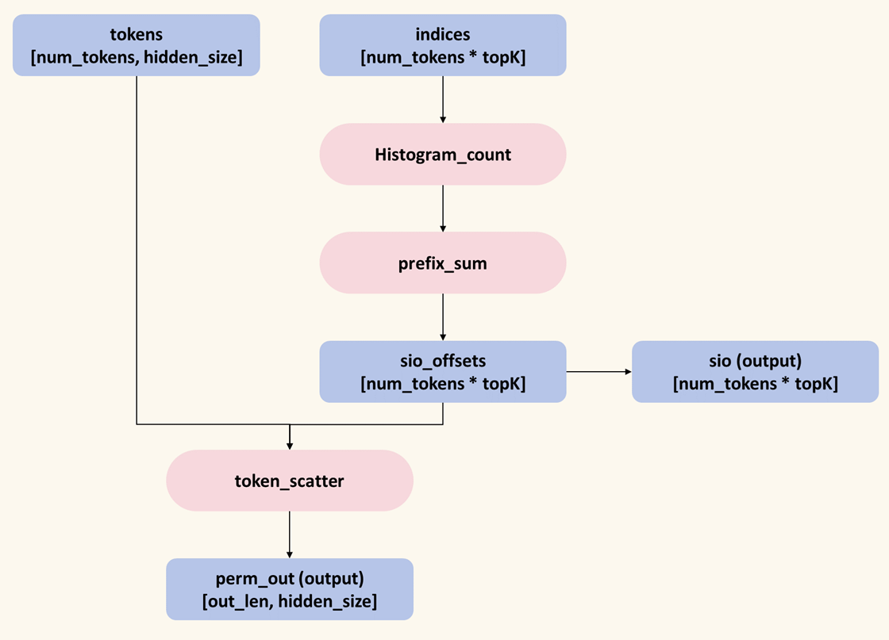
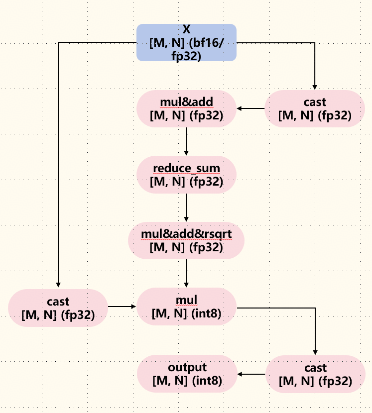

# NPU DeepSeek-V3.2-Exp TileLang算子开发实践

## 简介

近年来AI大模型出现爆炸式增长，其对高性能算子的要求也越来越高。但开发高性能的算子并非易事，传统 AI 编程涉及复杂的调度优化（如线程绑定、布局优化、张量化等），需要大量手动编写调度代码，导致开发效率低且难以维护。在这种背景下，专门针对AI领域的DSL应运而生。尽管最近针对AI工作负载的DSL极大的简化了高性能算子内核的创建，即使数据流被明确暴露，但它们仍然将大多数低级优化与算子内核紧密交织在一起。例如Triton虽然提供了直观的块级原语，但将线程行为、内存布局和地址空间注释隐藏在自动生成的策略背后。这种抽象简化了编程，但却阻碍了那些寻求提取最大性能的经验丰富的开发者。

为了克服目前DSL的这些不足，TileAI开源社区提出了TileLang算子编程语言，旨在简化高性能GPU/NPU/CPU算子（例如GEMM、Dequant GEMM、FlashAttention、LinearAttention）的开发。TileLang采用类Python的语法，并在TVM之上构建底层编译器基础架构，能自动生成针对特定硬件优化的代码，使开发者专注于提高生产力，而无需牺牲实现最佳性能所需的底层优化。TileLang的核心设计理念是将调度空间（线程绑定、布局、张量化和流水线）与数据流解耦，并将其封装为一组可自定义的注解和原语，这使得用户专注于内核的数据流本身，而将大多数其他优化工作交由编译器完成。

本文主要介绍Ascend NPU适配TileLang的过程，以及基于其开发高性能算子的实践。

## Highlights

- 简化NPU算子编程复杂度：Tilelang采用类Python语法，大大降低NPU算子开发门槛，封装调度空间为自定义原语，开发者更加关注数据流本身。

- 支持灵活扩展：实现调度空间与数据流解耦，NPU算子优化由编译器自动完成，同时充分利用NPU底层硬件特性。

- 高性能：Tilelang可以实现高性能NPU算子，允许用户感知NPU硬件特性，相较Triton理论上可以获得更好的性能。
## TileLang NPU工作流程

下图展示了TileLang 在NPU上的工作流程，主要分为编译和运行两个阶段：


<p align="center">
  
  <center>TileLang 工作流示意图</center>
</p>


- 编译阶段

  1.  多级Lowering转换：TileLang算子根据NPU硬件特性进行多级降级，生成针对昇腾硬件优化的TensorIR表示
  2.  AscendC代码生成：基于TensorIR，使用专门的Ascend Codegen模块生成对应的AscendC代码
  3.  动态库编译：通过毕昇编译器（bisheng）将AscendC代码编译成动态链接库（.so文件）

- 运行阶段

  4.  库文件加载：通过torch_npu运行时库将.so文件加载到Python环境中
  5.  函数封装：将算子封装为可调用的Python函数对象
  6.  执行调用：用户以普通Python函数方式调用，提供输入张量即可在昇腾NPU上执行计算并获得结果


## TileLang NPU适配

下图是TileLang的整体编译运行流程图以及本次适配要修改的部分（深绿色显示）：


<p align="center">
  
  <center>TileLang 编译运行流程图</center>
</p>


### TileLang API

算子语言原语是支撑算子开发与执行的基础操作单元，其贯穿算子运行的完整生命周期。Tilelang API原语封装了昇腾AscendC后端接口，在此基础上提供精简高效的原语指令供用户使用，各原语通过功能协同，实现算子对硬件资源的高效调度与数据处理逻辑的可靠运行。原语的核心作用如下：
- NPU硬件能力精准适配。TileLang原语可封装NPU的底层硬件细节，实现算子与NPU架构的高效协同，屏蔽底层差异，降低开发复杂度。
- 算子开发效率提升。Tilelang API原语简化了NPU算子开发流程，降低技术门槛。封装好的Tilelang指令允许开发者快速构建NPU算子框架，用高效的Python语法实现AI Core级功能调用，标准化的接口也提升了代码复用性，便于实现更丰富、复杂的计算逻辑。
- 算子性能优化与可靠性保障。Tilelang API原语封装了AscendC算子后端语言，具有自动流水调度、内存存储访问模式优化等功能，能够提升NPU缓存命中率并降低计算资源占用与数据搬运量，并能够规避底层语言造成的数据残留、内存越界等问题。

下面为NPU存储结构图，展示NPU多级内存架构，方便用户理解相应内存分配与拷贝语义。
<p align="center">
  
  <center>NPU存储结构图</center>
</p>

针对昇腾后端实现如下几类原语，原语类型及典型原语介绍如下表：


| 原语类型     | 原语名称                                                     | 用法示例                                         | 功能介绍                                                     |
| ------------ | ------------------------------------------------------------ | ------------------------------------------------ | ------------------------------------------------------------ |
| 内核原语     | kernel                                                       | T.kernel(block\_num, is\_npu=True) as (cid, vid) | 该原语对应到AscendC的kernel调用处，其中block\_num对应于<<< >>>中的第一个参数，表示这个kernel开启多少个子任务数量。cid的范围为 $[0, block\\\_num)$, vid的范围为0或1。因为A2的cv核默认配比为1:2, 可以通过vid指定当前vector的索引。 |
| 内存分配原语 | alloc\_L1/L0A/L0B/L0C/UB                                     | T.alloc\_L1/L0A/L0B/L0C/UB(shape, dtype)         | 用于分配位于片上内存的buffer；通过指定shape和数据类型标记buffer的信息。 |
| 数据搬运原语 | copy                                                         | T.copy(src, dst)                                 | 将src上的buffer拷贝到dst上，注意buffer可以通过BufferLoad或者BufferRegion指定一小块区域。 |
| 计算原语     | gemm, add, mul, reduce\_max...                               | T.reduce\_max(dst, src, tmp, dim)                | 其中dim指定为对应规约的维度，目前只支持二维的规约。          |
| 同步原语     | set\_flag, wait\_flag, set\_cross\_flag, wait\_cross\_flag, pipe\_barrier | T.set\_cross\_flag(pipe: str, eventId: int)      | 其中pipe为需要同步的流水线，eventId为同步事件编号。          |


### CodeGen

在TileLang面向Ascend NPU的算子开发流程中，CodeGen（代码生成）模块是实现 “前端简洁开发” 与 “后端高效执行” 衔接的关键组件，其核心作用是通过指令模板封装与指令映射两大机制，将TileLang API高层抽象语法自动转化为标准AscendC语言，为后端算子开发提供标准化、规范化与高效化支撑。
- 语法转化与硬件适配。CodeGen通过预定义的AscendC指令模板，封装NPU底层硬件操作（如AI Core计算指令、DMAC数据传输指令）的语法细节与参数约束，CodeGen可自动解析TileLang语法树，根据语义逻辑匹配对应的指令模板，并通过指令映射规则，实现TileLang与AscendC NPU后端的无缝适配。
- 标准化与高效率算子代码生成。CodeGen将TileLang到AscendC的转化过程自动化，大幅缩短后端算子的开发周期；且CodeGen的指令模板经过AscendC NPU性能优化，生成的AscendC代码可直接调用NPU的硬件加速能力，有效降低人工编码可能导致的性能损耗。同时CodeGen生成的代码高度标准化，大幅提升后端算子代码的可维护性与跨版本兼容性。

#### Codegen适配
- 指令模板封装

  基于AscendC的基础/高阶API封装出相应的指令模板，例如 copy_gm_to_l1函数即表示将global memory上的一个tile搬运到L1 buffer上。
  ```
  template <typename T, uint32_t srcM, uint32_t srcN, uint32_t dstM, uint32_t dstN>
  void copy_gm_to_l1(LocalTensor<T> dstTensor, GlobalTensor<T> srcTensor) {
    AscendC::DataCopy(dstTensor, srcTensor, {1, dstM, dstN, 0, srcN, dstM, 1, 0});
  }
  ```

- 指令映射

  将前端的tile api原语映射到后端的指令模板上，通过这一轮映射，完成AscendC代码的生成。
  ```
  def div(dst: Buffer, src0: Buffer, src1: Union[Buffer, BufferLoad]):
    return binary_op(dst, src0, src1, "Div")
  ```

- 编译

  最后调用bisheng编译器对AscendC代码进行编译，得到动态链接库，得到.so文件。
### JIT

JIT（Just-in-time，即时编译）是一种动态编译技术，Tilelang算子开发过程中通过JIT调用CodeGen生成AscendC代码，并对整个过程进行动态调控，解决静态编译的局限性，确保生成的AscendC代码动态适配NPU特性，同时最大化提升算子执行效率。
- 动态参数驱动的AscendC定制代码生成。JIT会在运行中实时解析输入参数，同步向CodeGen传递参数维度、数据类型等信息，确保NPU算子支持动态输入。
- NPU硬件约束下的AscendC语法修正。JIT在运行时可检测当前NPU硬件的资源配置，严格遵守硬件资源限制，指导CodeGen生成符合性能约束的AscendC代码。
- 算子运行时的即时编译与动态优化。算子运行过程中，JIT会在编译过程中结合NPU当前的硬件状态优化指令分配，根据AI Core的利用率和内存占用情况动态调整编译策略。

#### JIT适配

1. 代码生成与编译：
通过codegen模块生成AscendC源代码，将生成的AscendC代码编译为动态链接库文件(.so格式)。
2. 适配器集成：
基于TileLang中的Cython版本适配器进行修改，对接NPU对应接口。
3. Python环境集成：
通过上述适配过程，实现：JIT编译调用的无缝集成，Python环境中kernel函数的便捷使用，同时保持与原有TileLang接口的一致性。


## 如何扩展TileLang的NPU API接口

NPU TileLang后端API接口在TileLang框架中以Python封装的接口形式提供支持，提供了扩展能力，用户可以根据自己的需要对其进行扩展。

### 简单API封装

简单的API可以通过直接调用[Ascend C API接口](https://www.hiascend.com/document/detail/zh/canncommercial/82RC1/API/ascendcopapi/atlasascendc_api_07_0003.html)进行封装。


以**T.exp** 为例：

#### a) Python封装接口

tilelang/tilelang/language/ascend.py

```
def unary_op(dst: Buffer, src0: Buffer, op: str):
    size_0 = math.prod(src0.shape)
    size_2 = math.prod(dst.shape)

    assert size_0 == size_2, "size must be same"
    
    return T.call_extern("handle", f"AscendC::{op}", dst.access_ptr("w"), src0.access_ptr("r"), size_0)

def exp(dst: Buffer, src0: Buffer):
    return unary_op(dst, src0, "Exp")
```

#### b) Codegen

tilelang/src/target/codegen_ascend.cc

Codegen步骤作用是生成TileLang算子代码映射后的AscendC源代码。

```
void CodeGenTileLangAscend::VisitExpr_(const CallNode *op, std::ostream &os) {
    ...
    else if (op_name == "AscendC::Add" || op_name == "AscendC::Max" || op_name == "AscendC::Sub" || op_name == "AscendC::Mul" || op_name == "AscendC::Exp") {
      std::vector<std::string> var_names;
      for (int i = 1; i < op->args.size() - 1; i++) {
        auto var_name = print_buffer_offset(op->args[i].as<CallNode>());
        var_names.push_back(var_name);
      }
      this->PrintIndent();
      this->stream << op_name << "("; 
      for (int i = 0; i < var_names.size(); i++) {
        this->stream << var_names[i];
        if (i != var_names.size() - 1) {
          this->stream << ", ";
        }
      }
      this->stream << ", " << PrintExpr(op->args[op->args.size() - 1]) << ");\n";
    }
    ...
}
```

### 复杂API封装
本章节介绍复杂API封装，下面以**T.gemm_v0**为例，**T.gemm_v0**接收矩阵A和B（A和B都位于L1），经过矩阵乘后输出C（C位于L0c）。

#### a) Python封装接口

```
def gemm_v0(A, B, C, transpose_A=False, transpose_B=False, init=False):

    def legalize_arguments(arg: Union[Buffer, Var]):
        """Convert let-bound variables to their corresponding buffers.

        Args:
            arg (Union[tir.Buffer, tir.Var]): Input argument to legalize

        Returns:
            Union[tir.Buffer, tir.Var]: The legalized argument
        """
        if isinstance(arg, Var) and T.has_let_value(arg):
            return T.get_let_value(arg).buffer
        return arg

    A = legalize_arguments(A)
    B = legalize_arguments(B)
    C = legalize_arguments(C)

    def retrieve_shape(object: Union[Buffer, BufferRegion]) -> List[int]:
        if isinstance(object, Buffer):
            return object.shape
        elif isinstance(object, BufferRegion):
            region = object.region
            shape = []
            for r in region:
                shape.append(r.extent)
            return shape
        else:
            raise ValueError(f"Unsupported argument type: {type(object)} for buffer {object}")

    A_shape = retrieve_shape(A)
    B_shape = retrieve_shape(B)
    C_shape = retrieve_shape(C)

    assert len(C_shape) == 2, "current only support C as a 2D tensor"
    assert len(A_shape) >= 2, "current only support A as a 2D or higher-order tensor"
    assert len(B_shape) >= 2, "current only support B as a 2D or higher-order tensor"
    if len(A_shape) > 2:
        for i in range(len(A_shape) - 2):
            assert A_shape[i] == 1, \
                "current only support A as a 2D or higher-order tensor with the last two dimensions being the matrix dimensions"
    if len(B_shape) > 2:
        for i in range(len(B_shape) - 2):
            assert B_shape[i] == 1, \
                "current only support B as a 2D or higher-order tensor with the last two dimensions being the matrix dimensions"

    M, N = C_shape
    K = A_shape[-2] if transpose_A else A_shape[-1]
    K_B = B_shape[-1] if transpose_B else B_shape[-2]
    assert K == K_B, f"T.gemm K shape check failed: K_A = {K}, K_B = {K_B}"

    def retrieve_ptr(object: Union[Buffer, BufferRegion], access_type: str = "r") -> PrimExpr:
        if isinstance(object, Buffer):
            return object.access_ptr(access_type)
        elif isinstance(object, BufferRegion):
            buffer, region = object.buffer, object.region
            indices = []
            for r in region:
                indices.append(r.min)
            strides = []
            stride = 1
            for s in reversed(buffer.shape):
                strides.insert(0, stride)
                stride *= s
            offset = 0
            for i in range(len(indices)):
                offset += indices[i] * strides[i]
            return buffer.access_ptr(access_mask=access_type, offset=offset)
        else:
            raise ValueError(f"Unsupported argument type: {type(object)} for buffer {object}")

    Aptr = retrieve_ptr(A, "r")
    Bptr = retrieve_ptr(B, "r")
    Cptr = retrieve_ptr(C, "rw")

    # assert _dtype(A) == _dtype(B), f"gemm A and B dtype mismatch: {_dtype(A)} vs {_dtype(B)}"
    return T.call_extern(
        "handle", f"tl::ascend::gemm_v0<{_dtype(A)}, {_dtype(C)}, {M}, {N}, {K}, {str(transpose_A).lower()}, {str(transpose_B).lower()}>",
        Aptr, Bptr, Cptr, init)
```

#### b) AscendC封装

复杂的API封装可能需要更多的复杂处理，以及调用多个AscendC接口来进行封装，我们把这部分代码放在如下文件中：

**tilelang/src/tl_templates/ascend/common.h**

```
template <typename T1, typename T2, uint32_t M, uint32_t N, uint32_t K, bool transpose_A=false, bool transpose_B=false>
CATLASS_DEVICE void gemm_v0(
  LocalTensor<T1> const &A,
  LocalTensor<T1> const &B,
  LocalTensor<T2> const &C, // this must be located in l0c
  AscendC::TBuf<AscendC::TPosition::A2> &l0a_,
  AscendC::TBuf<AscendC::TPosition::B2> &l0b_,
  bool clear
) {
  auto l0a = l0a_.Get<T1>();
  auto l0b = l0b_.Get<T1>();
  AscendC::PipeBarrier<PIPE_ALL>();
  if constexpr (!transpose_A) {
    tl::ascend::copy_l1_to_l0a<half, layout::zN, M, K, M, K>(l0a, A);
  } else {
    tl::ascend::copy_l1_to_l0a<half, layout::nZ, M, K, M, K>(l0a, A);
  }
  if constexpr (!transpose_B) {
    tl::ascend::copy_l1_to_l0b<half, layout::zN, K, N, K, N>(l0b, B);
  } else {
    tl::ascend::copy_l1_to_l0b<half, layout::nZ, K, N, K, N>(l0b, B);
  }

  AscendC::PipeBarrier<PIPE_ALL>();

  tl::ascend::mma<T1, T2, M, N, K>(l0a, l0b, C, clear);
  AscendC::PipeBarrier<PIPE_ALL>();
}
```

#### c) Codegen

Codegen步骤作用是生成TileLang算子代码映射后的AscendC源代码。

```
void CodeGenTileLangAscend::VisitExpr_(const CallNode *op, std::ostream &os) {
    ...
    else if (op_name.find("gemm_v0") != std::string::npos) {
        this->PrintIndent();
        auto a_var = op->args[1].as<CallNode>()->args[1].as<VarNode>();
        auto b_var = op->args[2].as<CallNode>()->args[1].as<VarNode>();
        auto c_var = op->args[3].as<CallNode>()->args[1].as<VarNode>();

        auto a_offset = PrintExpr(op->args[1].as<CallNode>()->args[2]);
        auto b_offset = PrintExpr(op->args[2].as<CallNode>()->args[2]);
        auto c_offset = PrintExpr(op->args[3].as<CallNode>()->args[2]);

        auto a_name = var_idmap_[a_var];
        auto b_name = var_idmap_[b_var];
        auto c_name = var_idmap_[c_var];

        auto src_type = op->args[1].as<CallNode>()->args[0].as<CallNode>()->dtype;
        auto dst_type = op->args[3].as<CallNode>()->args[0].as<CallNode>()->dtype;


        this->stream << op_name << "(" << a_name << "[" << a_offset << "], "
            << b_name << "[" << b_offset << "], " << c_name << "[" << c_offset << "], ascend_l0a, ascend_l0b, "  << PrintExpr(op->args[4]) << ");\n";
    } 
    ...
}
```

## 主要算子实现

本节主要介绍在NPU上基于TileLang开发的SparseFlashAttention和LightningIndexer两个算子。

### SparseFlashAttention

#### 概述

SparseFlashAttention算子的整体计算流程如下图所示：

<p align="center">
  
  <center>SparseFlashAttention计算流程图</center>
</p>

相较于原始FlashAttention(FA)，SparseFlashAttention的核心创新在于引入**索引张量index**作为输入。该张量显式指定了查询序列(query)中每个token在键值序列(key/value)中需要交互的**稀疏关联子集**。通过将注意力计算限制在这些预定义的子集上，算法显著降低了计算复杂度（从O(N²)降至O(N·S)，其中S为稀疏关联大小）和内存带宽需求，特别适用于超长序列或结构化稀疏场景。

#### 算法流程详解（Block-Level视角）

从NPU的块级执行视角，结合具体维度阐述实现细节。假设输入张量维度为：

- **query**: `[batch_size=1, seq_len_q=128, num_heads=128, head_dim=576]`
- **key/value**: `[batch_size=1, seq_len_kv=32768, num_heads_kv=1, head_dim=576]`（注：num_heads_kv=1表示多头融合或共享机制）
- **index**: `[batch_size=1, seq_len_q=128, num_heads=1, topk=2048]`

##### 实现步骤

1. **查询块加载**
   - **并行切分策略**：batch_size和seq_len_q作为数据并行维度；num_heads维度以block_size=64为粒度切分（张量并行）
   - **核心操作**：从全局内存加载当前处理的查询块
     - 主块(q_tile): 加载连续512个特征维度的数据 → Shape: `[64, 512]`
     - 尾部块(q_tail_tile): 加载剩余64个特征维度的数据 → Shape: `[64, 64]`

2. **稀疏键值块收集**
   - **索引驱动加载**：对于当前查询块中的每个查询位置，利用index张量获取其在key/value序列中关联的topk_tile=64个token索引
   - **硬件优化收集**：按索引从全局key/value张量收集对应数据
     - 主块(kv_tile): 收集每个关联token的512维主特征 → Shape: `[64, 512]`
     - 尾部块(kv_tail_tile): 收集每个关联token的64维尾部特征 → Shape: `[64, 64]`

3. **注意力分数计算**
   - **主路径计算**：利用Cube计算主块相似度，清空l0c buffer  
     `S_block = q_tile @ kv_tile.T` → Shape: `[64, 64]`
   - **尾部路径计算**：计算尾部块相似度，利用l0c buffer上原有的计算结果累加  
     `S_block += q_tail_tile @ kv_tail_tile.T` → Shape: `[64, 64]`

4. **Online Softmax**
   - 在S_block上执行分块稳定的在线Softmax
   - 沿topk_tile维度(dim=-1)计算
   - 动态维护最大值(m)和指数和(l)等中间统计量，确保数值稳定性

5. **上下文向量计算**
   - 利用注意力权重P_block与kv_tile相乘  
     `O_tile = P_block @ kv_tile` → Shape: `[64, 512]`

6. **循环累加与重缩放**
   - **结果累加**：在以64为粒度遍历topk的循环中，将O_tile累加到输出缓冲区
   - **在线重缩放**：循环结束后，利用在线Softmax维护的统计量(m,l)，通过向量化操作对累加结果进行全局重缩放，校正分块计算引入的偏差

7. **全局内存写回**
   - 将最终重缩放后的输出块O_tile写回全局内存对应位置

### LightningIndexer

#### 概述

LightningIndexer算子作为SparseFlashAttention的前置算子，输入为Query和Key，针对每个Query输出Topk的Key/Value索引，从而稀疏化Key/Value，将注意力机制的计算长度压缩到TopK。算子流程如下图所示：


<p align="center">
  
  <center>LightningIndexer计算流程图</center>
</p>

#### 输入输出张量详解

- **Query**: `(B, S1, N1, D)` - 查询向量集合，每个查询向量分为G个组，每组D个维度
- **KEY**: `(B, S2, N2, D)` - 键向量集合
- **QK_RES**: `(B, N2, S1, G * S2)` - 存储Query和Key之间的相似度分数
- **WEIGHTS**: `(B, S1, N2, G)` - 权重矩阵，用于对不同分组的相似度得分进行加权
- **OUT**: `(B, N2, S1, TOP_K)` - 最终输出的Top-K索引结果

#### 关键参数含义

- **B**: 批次大小，支持批量处理多个样本
- **S1, S2**: Query序列长度和Key序列长度，支持不同长度的序列匹配
- **N2**: KV注意力头数量
- **G**: 分组数量，满足G × N2 = N1
- **D**: 每组的特征维度
- **TOP_K**: 需要返回的最相似结果数量
- **VECTOR_BASEN, VECTOR_BASEG**: 向量化计算的基本单位
- **BLOCK_M, BLOCK_N, BLOCK_K**: 矩阵分块大小

#### Cube核计算

##### 内存层次设计

Cube核计算充分利用NPU的内存层次结构：

- **L1缓存**: 作为主要数据暂存区，存储当前正在计算的Query和Key数据块
- **L0C缓存**: 作为计算缓存，专门用于矩阵乘法运算的中间结果存储

以`BLOCK_M=128, BLOCK_N=128, BLOCK_K=128`为例，Query和Key的搬运/计算基本块为128\*128，Query子块的内存大小为128\*128\*sizeof(half)=32768，内存地址分配策略如下：

```
- Q_L1: 地址0开始，存储Query数据块
- K_L1: 地址32768开始，存储Key数据块
- C_L0: 地址0开始，存储计算结果
```

这种手动控制的内存地址分配确保了不同数据之间不会产生地址冲突，同时优化了内存访问的局部性。

##### 切分逻辑

###### 核间切分

- 对Batch维进行切分，通过不同的偏移确定每个核并行处理不同的数据

###### 核内切分

采用多重循环结构进行分块矩阵乘法计算：

1. **外层循环 - 注意力头遍历(n2)**: 对每个注意力头独立计算，支持多头注意力机制
2. **第二层循环 - 分组遍历(g)**: 遍历Query向量的每个分组，与完整Key向量进行匹配
3. **第三层循环 - Query序列分块(m)**: 将长度为S1的Query序列按BLOCK_M分块处理
4. **内层循环 - Key序列分块(n)**: 将长度为S2的Key序列按BLOCK_N分块处理

##### 详细计算步骤

在每个内层循环迭代中执行以下精确计算步骤：

1. **数据加载阶段**: 通过`T.copy`操作将Query数据块从全局内存加载到L1缓存的Q_L1区域
2. **Key数据加载**: 将Key数据块加载到K_L1区域
3. **矩阵乘法计算**: 使用`T.gemm_v0`执行优化的矩阵乘法运算，`transpose_B=True`表示对Key矩阵转置
4. **结果写回**: 将计算结果通过`T.copy`操作写回到全局内存中，`enable_relu=True`利用AscendC的Fixpipe算子原生能力在搬运过程中完成relu操作

##### 同步与CV协同

- 在每个关键步骤后使用`T.barrier_all()`进行同步，确保数据一致性和计算正确性
- Cube核心计算完成后，使用`T.set_cross_flag("FIX", 0)`设置跨核同步标志，通知Vector核心开始后续处理工作

#### Vector核计算

##### 内存管理

Vector核使用多种专用缓冲区处理不同类型数据：

- **计算缓冲区**：`mm_res_ub`（相似度矩阵）、`weight_ub`（权重向量）、`reduce_tmp_ub`（累加缓冲区）
- **Top-K缓冲区**：`reduce_g_ub`（归约后分数）、`sort_indice_tmp_ub`（排序索引）、`topk_global_ub1/ub2`（增量Top-K）
- **类型转换缓冲区**：`mm_res_ub_uint8`、`sort_indice_tmp_ub_uint`

##### 并行负载均衡

- 总任务`N2 * S1`平均分配给两个Vector核
- 每个vector核处理`total_process_num // 2`个任务
- 核心通过`vid`确定处理范围：`s1_start_idx`至`s1_end_idx`

##### ReduceSum计算

对每个查询位置`s1_id`计算与所有键位置的加权相似度：

1. **初始化**：`T.init_sort_buf(topk_global_ub2, TOP_K * 2, 0)`
2. **分块处理Key序列**：按`VECTOR_BASEN`分块
   - 重置累加器（`reduce_tmp_ub`和`reduce_g_ub`）
   - 按分组`g_id`计算：从`QK_RES`加载分数，从`WEIGHTS`加载权重，执行乘法后累加
   - 维度归约：`T.reduce_sum()`沿分组维度求和得到最终分数

##### Top-K算法实现

采用增量式归并排序策略：

1. **分块排序**：生成索引并对当前块排序
2. **增量归并**：
   - 使用`merge_sort_times = TOP_K // VECTOR_BASEN`确定排序块数
   - 首次归并：直接执行`T.merge_sort()`
   - 后续归并：执行归并后用Top-K操作保持结果集大小
3. **结果输出**：提取并写回最终Top-K索引

## 训练算子实现

本章介绍DeepSeek-V3.2 中Tilelang-Ascend实现的8个训练算子。模型训练请参考：[链接](https://gitcode.com/cann/cann-recipes-train/blob/master/docs/llm_pretrain/deepseekv32_pre_train_optimization.md)，Tilelang算子替换请参考：[链接](https://gitcode.com/cann/torchtitan-npu/blob/master/docs/feature_guides/tilelang_ops.md)。

### 1、Rotary Position Embedding

#### **概述**

RoPE（Rotary Position Embedding）是一种位置编码算子，用于大模型中的旋转位置嵌入计算。与传统的绝对位置编码不同，RoPE通过旋转向量的方式将位置信息融入注意力机制，能够更好地捕捉相对位置关系。该算子支持前向和反向传播计算，适用于模型训练和推理场景。

Rotary Position Embedding算子的整体计算流程如下图所示：


<center>Rotary Position Embedding计算流程图</center>


#### 算法流程详解

算子输入输出典型维度张量分析：

- **x**: [M, hidden_size] 或 [B, S, N, D]，输入张量。
- **sin**: [sc_rows, rope_dim]，旋转正弦角度向量。
- **cos**: [sc_rows, rope_dim]，旋转余弦角度向量。
- **mask**: [row_per_vec, rope_dim]，旋转索引掩码向量。
- **output**: 与输入同形状，旋转位置编码输出张量。

**计算流程：**

##### 1、数据加载与预处理

- **分块加载：**按block_M大小将输入数据分块加载至UB buffer，其中block_M默认为64（float16/bfloat16）或32（float32）。
- **Partial RoPE支持：**当rope_dim小于hidden_size时，仅对输入张量的最后rope_dim维度应用旋转位置编码，前dim_start维度保持不变。


##### 2、数据类型转换

- **精度提升：**对于float16/bfloat16输入，利用T.tile.cast接口转换为float32进行计算，确保数值精度与稳定性。


##### 3、sin/cos加载

- **位置索引计算：**根据head_num和行位置计算对应的sin/cos索引，公式为`row_sin_cos = (row_x // head_num) % sc_rows`。
- **旋转角度加载：**按计算得到的索引加载对应的sin和cos值至UB buffer。


##### 4、旋转操作

- **元素重排：**使用T.tile.gather配合mask实现旋转操作中的元素重排，mask向量编码了旋转所需的索引映射关系。
- **旋转模式：**
  - **interleave模式：**相邻元素对交换旋转，即`rotate([x0, x1, x2, x3]) = [-x1, x0, -x3, x2]`。
  - **half模式：**前后半部分交换旋转，即`rotate([x0, x1, x2, x3]) = [-x2, -x3, x0, x1]`。


##### 5、RoPE计算

- **前向传播：**执行旋转位置编码计算，公式为`out = x * cos + rotate(x) * sin`。
- **反向传播：**执行反向梯度计算，公式为`dx = cos * dy + swap(sin_masked * dy)`。


##### 6、结果写回

- **类型转换：**计算结果从float32转换回原始数据类型（float16/bfloat16）。
- **结果保存：**按块将结果写回全局内存，若为partial RoPE则仅更新最后rope_dim维度。


### 2、moe_token_permute 

#### 概述

MoeTokenPermute 算子的整体计算流程如下图所示：


<center>MoeTokenPermute计算流程图</center>

在基于混合专家架构（Mixture of Experts, MoE）的大语言模型中，由于不同专家接收到的Token数量动态变化，Token的分发操作（Token Permute / Scatter）容易因密集的非连续显存访问成为计算瓶颈。

`MoeTokenPermute` 类作为该算子面向用户的唯一接口，通过在底层利用 NPU 特性，将“直方图统计”、“全局前缀和计算”与“数据重排”三大步骤深度融合。算子对外屏蔽了底层的内存对齐与核间同步细节，用户只需提供Token和路由索引，即可高效获得按专家连续排列的Token张量以及对应的Scatter偏移量记录。

#### 接口参数详解

为了更好地理解算法流程，以下是 `MoeTokenPermute` 类的完整接口参数定义：

**1. 初始化参数 (`__init__`)：**

- **num_tokens**: `int`，输入序列的总 Token 数量。
    
- **topK**: `int`，每个 Token 被分配的专家数量（如 Top-2 路由则设为 2）。
    
- **hidden_size**: `int`，Token 的隐藏层向量维度大小。
    
- **num_experts**: `int`，模型中专家的总数量，默认值为 64。
    
- **num_out_tokens**: `int`，预期的输出 Token 容量。若设置为 0，则默认按照 `num_tokens * topK`的大小分配。
    
- **NUM_CORES**: `int`，NPU 物理核利用数量，默认值为 24。
    
- **TILE_H**: `int`，核内数据切分的隐藏层块大小。默认为 `None`（会自动取 `hidden_size` 的全长）。
    
- **dtype**: `str`，Token 数据的计算类型，默认值为 `"float16"`。
    

**2. 调用参数 (`__call__`)：**

- **tokens**: `Tensor[num_tokens, hidden_size]`，原始输入的 Token 隐藏层状态张量。
    
- **indices**: `Tensor[num_tokens * topK]`，路由网络输出的一维展平专家索引张量。
    

**3. 输出返回值：**

- **perm_out**: `Tensor[out_len, hidden_size]`，根据专家归属重排后的 Token 张量（其中 `out_len` 由初始化参数 `num_out_tokens` 决定）。
    
- **sio**: `Tensor[num_tokens * topK]`，Token 对应的 Scatter 偏移量/写入位置索引（去除了底层 padding 的有效部分）。
    

#### 算法流程详解

结合 `MoeTokenPermute` 类的输入输出参数，其底层算子的具体执行流程如下：

##### 1、张量初始化与对齐填充

- 在 `__call__` 被调用时，首先计算逻辑上的总索引数量 `E = num_tokens * topK`。
    
- 为了满足 NPU 多核均匀切分的对齐要求，算子内部会计算一个对齐后的长度 `padded_E`（为 `NUM_CORES` 和 `chunk_size` 的公倍数），并创建一个填充后的索引张量 `indices_padded`，将用户传入的 `indices` 拷贝至其中，超出 `E` 的部分用零填充。
    

##### 2、数据切分与多核并行策略

- **核间切分：** 根据初始化时指定的 `NUM_CORES`（取 `NUM_CORES` 与 `num_tokens` 的最小值作为实际核数），将输入的 Token 序列均匀划分给各个 NPU 核心。每个核心负责处理一段大小为 `tokens_per_core` 的 Token 数据及其对应的索引块（`chunk_size`）。
    
- **核内切分：** 针对 `hidden_size` 维度，算子利用初始化的 `TILE_H` 将其切分为多个子块（HTiles），并在单个 NPU 核的多个矢量计算单元间对半划分（`HALF_H`），实现更细粒度的指令级并行。
    

##### 3、本地专家直方图统计

- 每个 NPU 核心首先从全局的 `indices_padded` 中异步加载自身负责的索引数据块。
    
- 通过流水线循环，统计该数据块中分配给 `num_experts` 个专家的 Token 频次（Histogram Count）。
    
- 统计完成后，各核心将本地的直方图结果写入全局的 Workspace 中，并触发全局同步屏障（Barrier），等待所有核心完成统计。
    

##### 4、全局偏移量计算 (Prefix Sum)

- 各核心读取全局 Workspace 中的完整直方图数据。
    
- 通过两次累加（计算所有核心的累计值 `acc_ub` 与当前核心的前置累加值 `cpre_ub`），利用前缀和算法，为当前核心内每个 Token-专家对计算出在全局输出张量 `perm_out` 中的绝对写入基址偏移量（Scatter Offsets）。
    
- 这些偏移量被保存在内部的 `sio_chunk_ub` 数组中。
    

##### 5、流水线 Token 重排计算 (Pipelined Token Scatter)

- 构建大小为 2 的软流水线缓存（Double Buffering），通过 NPU 的异步拷贝指令（MTE2/MTE3）与矢量计算指令（V）的标志位同步，实现内存读取与重排写入的掩盖。
    
- 在每次循环中，提前从输入的 `tokens` 张量中加载下一块 Token 数据（MTE2）。
    
- 针对当前块的 Token 数据，查询第 4 步计算得到的写入偏移量。若偏移量合法（未超出 `num_out_tokens` 限制），则将该 Token 数据写入到输出张量 `perm_out` 的指定位置（MTE3）。
    

##### 6、结果提取与返回

- 流水线执行完毕后，底层算子输出带有 padding 的重排 Token 张量和记录了全局写入位置的索引张量。
    
- 在 Python 类接口层，切片截取有效长度的 Scatter 索引 `sio = sio_padded.squeeze(0)[:E]`。
    
- 最终返回重排后的连续 Token 表示 `perm_out` 和偏移量记录 `sio`，整个 Token 排布流程结束。

### 3、moe_token_permute_grad 

#### 概述

MoeTokenPermuteGrad 算子的整体计算流程如下图所示：


<center>MoeTokenPermuteGrad计算流程图</center>


在基于混合专家架构（Mixture of Experts, MoE）的大语言模型反向传播中，需要将各个专家计算得出的 Token 梯度，按照前向传播时的路由分发规则，精准回传给原始的 Token。由于前向传播时一个 Token 可能被路由给 Top-K 个专家，因此在反向传播时，原始 Token 的梯度是这 K 个专家对应梯度向量的累加和（Gather-Reduce 操作）。

`MoeTokenPermuteGrad` 类是该操作的融合算子。它利用 NPU 的高并发读写能力与核内累加器，通过“**索引批加载 -> 向量聚合 (Gather) -> 高精度累加 (Reduce)**”的计算范式，高效完成了梯度的反向收集与合并。针对半精度（如 float16）计算容易出现数值溢出或精度截断的问题，算子内部针对性地设计了向上类型转换（Cast to FP32）的累加机制，保障了梯度计算的数值稳定性。

#### **接口参数详解**

`MoeTokenPermuteGrad` 类的完整接口参数定义如下：

**1. 初始化参数 (`__init__`)：**

- **num_tokens**: `int`，原始输入序列的总 Token 数量。
    
- **topK**: `int`，每个 Token 在前向传播时被分配的专家数量。
    
- **hidden_size**: `int`，Token 的隐藏层向量维度大小。
    
- **num_experts**: `int`，模型中专家的总数量（默认值为 64，反向算子中主要为保持 API 对称）。
    
- **num_out_tokens**: `int`，前向传播输出的 Token 总长度。若设置为 0，则默认等于 `num_tokens * topK`。
    
- **NUM_CORES**: `int`，NPU 物理核利用数量，默认值为 24。
    
- **TILE_H**: `int`，核内数据切分的隐藏层块大小。默认为 `None`（会自动根据 `hidden_size` 和数据类型推导最优大小）。
    
- **dtype**: `str`，输入梯度的数据类型，默认值为 `"float16"`。
    

**2. 调用参数 (`__call__`)：**

- **permuted_output_grad**: `Tensor[out_len, hidden_size]`，前向传播输出张量对应的梯度，即专家层反向传播传出的连续梯度张量。
    
- **sorted_indices**: `Tensor[num_tokens * topK]`，前向传播 Scatter 算子生成的偏移量/目标位置索引（对应前向的 `sio` 输出）。
    

**3. 输出返回值：**

- **input_grad**: `Tensor[num_tokens, hidden_size]`，经过 Gather-Reduce 聚合累加后，回传给原始输入的 Token 梯度张量。
    

---

#### **算法流程详解**

`MoeTokenPermuteGrad` 类的梯度聚合的执行流程如下：

##### 1、张量初始化与对齐填充

- 在 `__call__` 调用时，首先计算前向理论逻辑长度 `E = num_tokens * topK`。
    
- 若传入的 `permuted_output_grad` 的实际长度小于 `E`，算子会创建一个全零的 Padding 张量 `perm_grad_padded` 进行长度补齐，防止 Gather 时越界。
    
- 同步将用户传入的 `sorted_indices` 填充对齐为 NPU 多核均匀分配所需的 `padded_E` 长度。
    

##### 2、数据切分与多核并行策略

- **核间切分（Core-level）：** 根据 `NUM_CORES` 计算出 `actual_cores`（取 `NUM_CORES` 与 `num_tokens` 的最小值作为实际核数）。按照原始 Token 维度进行划分，每个核负责处理 `tokens_per_core` 个原始 Token 的梯度还原。
    
- **批处理维度（Batch-level）：** 为防止统一缓存（UB）超载，对每个核负责的 Tokens 进一步划分为多个 Batch（`BATCH_T`），分批次进行计算。
    
- **核内切分（Thread-level）：** 针对 `hidden_size` 维度，算子将其切分为多个子块（`n_htiles`），并在单个计算核内进一步对半切分（`HALF_H` = `TILE_H // 2`）交给两个计算单元并行累加。
    

##### 3、批处理索引加载

- 以 `BATCH_T` 为单位进入串行批处理循环。
    
- 每个 NPU 核心通过 `sorted_idx_gm` 将当前批次对应的专家路由索引（大小为 `BATCH_T * topK`）异步加载至统一缓存 `idx_ub` 中。
    

##### 4、梯度聚合与高精度累加 (Gather & Reduce)

这是该反向算子的核心计算模块。根据初始化时的 `dtype`，底层路由到两种不同的核函数（Cast 与 NoCast）：

- **高精度累加模式 (针对 float16 输入)：**
    
    - 对于当前 Token 的某个 `hidden_size` 块，首先在缓存中初始化一段全零的 float32 累加器（`acc_buf`）。
        
    - 循环遍历 `topK` 次。
        
    - 根据加载的索引，利用异步拷贝（MTE2）从全局显存 `perm_grad_gm` 中精准抓取对应的 Top-K 梯度向量块到 `row_buf`。
        
    - 将抓取到的 float16 梯度向量通过矢量指令（Vector Instruction）转换（Cast）为 float32 高精度类型（`CAST_LOW2HIGH`）。
        
    - 在 float32 精度下将向量累加至 `acc_buf` 中，避免半精度加法造成的小梯度被吞掉或溢出。
        
    - 累加完成后，将结果通过 `CAST_HIGH2LOW` 转回 float16 数据格式。
        
- **普通累加模式 (针对 float32 输入)：**
    
    - 若输入本身即为单精度，则省去 Cast 开销，直接利用共享内存通过循环展开进行连续加载与加法运算。
        

##### 5、结果写回

- 单个 Token 的 `hidden_size` 分块累加完成后，触发内存到显存的同步写回屏障（`pipe_barrier`）。
    
- 将合并好的还原梯度从内部缓冲输出并写入到全局内存 `input_grad_gm` 的对应原始 Token 位置。
    
- Python 层接收最终聚合的 `input_grad` 张量，继续参与网络的反向传播计算。


### 4、moe_token_unpermute 

#### **概述**

MoeTokenUnpermute 算子的整体计算流程如下图所示：


<center>MoeTokenUnPermute计算流程图</center>

在混合专家架构（MoE）中，Token 经过不同专家（Expert）的计算后，需要将打乱分布在各个专家输出张量中的 Token 特征，按照原始序列的位置重新收集（Gather）组合。如果使用了 Top-K 路由策略，还需要将同一个 Token 从多个专家处得到的输出，乘以对应的路由概率（Routing Probabilities）进行加权求和（Reduce）。

`MoeTokenUnpermute` 类是执行上述操作的 NPU 算子接口。该算子基于 TileLang 框架开发，针对底层硬件的矢量计算单元（Vector Unit）和内存拷贝路径进行了深度优化，同时在进行概率加权时，强制采用了向上转换（Cast to FP32）的高精度累加策略，以确保模型计算过程中的数值稳定性。

#### **接口参数详解**

以下是 `MoeTokenUnpermute` 类的完整接口参数定义：

**1. 初始化参数 (`__init__`)：**

- **num_tokens**: `int`，原始输入序列的总 Token 数量。
    
- **topK**: `int`，每个 Token 分配的专家数量（即同一个 Token 需要从几个专家处拉取并聚合结果）。
    
- **hidden_size**: `int`，Token 的隐藏层向量维度大小。
    
- **has_probs**: `bool`，默认值为 `True`。指示是否需要根据路由概率进行加权合并。若为 `True`，算子执行 Gather + Scale + Accumulate；若为 `False`，算子仅执行纯数据聚集（Gather）。
    
- **padded_mode**: `bool`，默认值为 `False`。预留参数，目前不支持设为 `True`（会抛出 `NotImplementedError`）。
    
- **NUM_CORES**: `int`，NPU 物理核心利用数量，默认值为 24。
    
- **TILE_T**: `int`，可选。核内 Token 维度的切分块大小。默认为 `None`（系统会基于 Token 总量动态自动计算最佳切分）。
    
- **TILE_H**: `int`，可选。核内隐藏层维度的切分块大小。默认为 `None`（系统会自动推导对齐大小）。
    
- **dtype**: `str`，数据的计算类型，支持 `"float16"`, `"bfloat16"`, `"float32"`, `"float"`。默认值为 `"float16"`。
    

**2. 调用参数 (`__call__`)：**

- **permuted_tokens**: `Tensor[E, hidden_size]`（其中 `E = num_tokens * topK`），由各个专家层计算完毕后输出的 Token 张量集合。
    
- **sorted_indices**: `Tensor[E]`，对应原始排布操作中记录的专家索引映射关系（即 Token 排布后的位置与原位置的映射）。
    
- **probs**: `Tensor[num_tokens, topK]`，可选。Token 对应的 Top-K 路由概率。当 `has_probs=True` 时为必填项。
    

**3. 输出返回值：**

- **out**: `Tensor`。
    
    - 当 `has_probs=True` 时，返回聚合加权后的张量，形状为 `[num_tokens, hidden_size]`。
        
    - 当 `has_probs=False` 时，仅返回 Gather 回来的张量，不执行求和降维，形状为 `[E, hidden_size]`。
        

#### **算法流程详解**

##### 1、张量初始化与维度对齐 (Padding)

- 硬件底层对于并行切分往往有最小维度要求（如 `float16` 下 hidden_size 至少为 64）。算子在初始化阶段会计算 `_compile_hidden_size`，并在 `__call__` 调用时，通过 `pad_last_dim` 和 `pad_first_dim` 函数动态对 `permuted_tokens` 和 `sorted_indices` 进行尾部和首部补齐，使得总长度和隐藏层维度严格对齐 NPU 核间并行分配的整倍数（`padded_E`，`padded_tokens`）。计算完成后，再对输出结果进行切片剥离 Padding。
    

##### 2、切分与调度策略 (Auto Tiling)

- **核间并行：** 根据 `has_probs` 的状态，算子采用不同的并行分发策略。通过 `auto_launch_cores` 动态计算实际激活的物理核数（`actual_cores`），将逻辑上的 Token 块（`n_ttiles` 或 `n_etiles`）均匀派发给对应的计算核。
    
- **核内流水：** 利用 TileLang 自动生成的 `TILE_H` 和 `TILE_T` 参数，每个计算核心分批次（`BATCH_T`）处理数据，并在 NPU 核内部切分数据流至双缓冲区，交由矢量单元处理。
    

##### 3、索引解析与数据收集 (Index Gather)

- 各个 NPU 计算核从全局内存中加载对应的路由概率 `probs_ub` 与反向排序索引 `idx_ub`。
    
- 根据读取到的 `idx_ub`，计算核心定位到 `permuted_tokens` 中该 Token 经过专家计算后的所在行，并通过数据拷贝指令异步将对应特征行抓取到统一缓存（UB）中的行缓冲区（`row_buf`）。
    

##### 4、高精度概率加权与累加 (Scale & Accumulate)

- **若 `has_probs=True`：**
    
    - **类型提升（Cast-Up）：** 为防止半精度浮点（FP16/BF16）在多次累加时导致严重的精度截断问题，算子在 UB 中预分配了高精度缓存区（`acc_dtype`，通常为 FP32）。使用 `CAST_LOW2HIGH` 指令将特征数据与概率 `probs` 提升精度。
        
    - **乘加运算（AXPY）：** 展开针对 Top-K 数量的内层循环。由于 Top-K 的值可能不是指令寄存器的最佳倍数，底层利用 `n_quads`（4次/8次循环展开）与 `remainder`（余数处理）将计算拆分为多个子操作。使用 NPU 的 `T.tile.axpy`（$Y = aX + Y$）或 `T.tile.mul` 矢量乘法，将当前专家的特征行乘以概率 `prob`，并累加到对应的 Token 累加寄存器 `acc_buf` 中。
        
    - **类型降维（Cast-Down）：** 同一个 Token 的 Top-K 个专家结果累加完毕后，通过 `CAST_HIGH2LOW` 重新降级转回原始的数据类型（如 FP16）。
        
- **若 `has_probs=False`：**
    
    - 跳过类型转换与累加过程，直接按照切分维度将加载到 `row_buf` 的专家特征逐行写回到结果缓存 `out_gm` 中。
        

##### 5、结果写回全局内存

- 利用底层 `pipe_barrier` 同步标量与矢量指令流，确保当前批次的数据在寄存器中计算无误后，将完成 Unpermute （及 Reduce）的数据片段刷写回全局内存。所有核心运行完毕后，接口切片去除初期的 Padding，返回整齐的输出张量。

### 5、moe_token_unpermute_grad

#### **概述**

MoeTokenUnpermuteGrad 算子的整体计算流程如下图所示：


<center>MoeTokenUnPermuteGrad计算流程图</center>


在混合专家架构（MoE）的反向传播阶段，需要计算 Token Unpermute（加权聚合）操作的梯度。如果前向传播中使用了 Top-K 路由和概率加权（`has_probs=True`），反向过程需要同时计算两个方向的梯度：

1. **对专家输出的梯度 (`perm_grad`)**：通过链式法则，等于上层传回的梯度乘以对应的路由概率。
    
2. **对路由概率的梯度 (`probs_grad`)**：等于上层传回的梯度与对应的专家输出特征（`permuted_tokens`）在隐藏层维度上的点乘之和。
    

`MoeTokenUnpermuteGrad` 类是执行上述反向梯度计算的 NPU 算子接口。该算子不仅实现了高效的数据 Scatter 分发，还针对概率梯度的“点乘与规约（Reduce Sum）”操作进行了底层的多核并行与双核矢量单元（Dual-Vector Unit）的独立累加优化，从而在保证 FP32 高精度累加的同时，最大化了硬件吞吐量。

#### **接口参数详解**

以下是 `MoeTokenUnpermuteGrad` 类的完整接口参数定义：

**1. 初始化参数 (`__init__`)：**

- **num_tokens**: `int`，原始输入序列的总 Token 数量。
    
- **topK**: `int`，每个 Token 分配的专家数量。
    
- **hidden_size**: `int`，Token 的隐藏层向量维度大小。
    
- **has_probs**: `bool`，默认值为 `True`。指示前向过程是否使用了概率加权。若为 `True`，算子将计算并返回 `perm_grad` 和 `probs_grad`；若为 `False`，仅进行梯度的 Scatter 分发，返回 `perm_grad`。
    
- **NUM_CORES**: `int`，NPU 物理核心利用数量，默认值为 24。
    
- **TILE_T**: `int`，可选。核内 Token 维度的切分块大小。默认为 `None`（系统自动计算最优值）。
    
- **TILE_H**: `int`，可选。核内隐藏层维度的切分块大小。默认为 `None`（系统自动计算最优对齐值）。
    
- **dtype**: `str`，数据的计算类型，支持 `"float16"`, `"bfloat16"`, `"float32"`, `"float"`。默认值为 `"float16"`。
    

**2. 调用参数 (`__call__`)：**

- **permuted_tokens**: `Tensor[E, hidden_size]`（其中 $E = num\_tokens \times topK$），前向过程中专家层计算输出的 Token 集合。当 `has_probs=True` 时为计算概率梯度的必填项。
    
- **unpermuted_tokens_grad**: `Tensor[num_tokens, hidden_size]`，反向传播从网络上层传回的、对应 Unpermute 操作输出的梯度（即 $\frac{\partial L}{\partial X_{out}}$）。
    
- **sorted_indices**: `Tensor[E]`，映射路由关系的全局索引。
    
- **probs**: `Tensor[num_tokens, topK]`，可选。前向传播时的 Top-K 路由概率。当 `has_probs=True` 时为必填项。
    

**3. 输出返回值：**

- 当 `has_probs=True` 时，返回一个元组 `(perm_grad, probs_grad)`：
    
    - **perm_grad**: `Tensor[E, hidden_size]`，传导给专家层的特征梯度。
        
    - **probs_grad**: `Tensor[num_tokens, topK]`，传导给路由网络（Router）的概率梯度。
        
- 当 `has_probs=False` 时，仅返回：
    
    - **perm_grad**: `Tensor[E, hidden_size]`。
        

---

#### **算法流程详解**

##### 1、张量初始化与维度对齐 (Padding)

- 类似于前向算子，NPU 硬件底层对并行块（Tile）的大小有对齐要求。在 Python 侧调用时，算子通过 `_pad_first_dim` 和 `_pad_last_dim` 动态将传回的梯度 `unpermuted_tokens_grad`、专家特征 `permuted_tokens` 以及索引和概率在首尾维度上补齐至 `_padded_E` 和 `_compile_hidden_size`。
    

##### 2、反向重排与数据分发加载 (Scatter Routing)

- 各 NPU 计算核基于分配到的 Token 块，加载对应的 `sorted_idx_gm` 和 `probs_gm` 到统一缓存（UB）。
    
- 核心根据索引，反向定位 `unpermuted_tokens_grad`（网络上层传回的梯度）的当前行。
    

##### 3、高并发梯度计算 (Gradient Computation)

- **若 `has_probs=True`：**
    
    算子采用双缓冲流水线掩盖内存延迟，并在计算上拆分为两条路径：
    
    - **计算专家特征梯度 (`perm_grad`)：** 提取对应的路由概率 `prob`，将其通过 `CAST_LOW2HIGH` 提升至高精度（如 FP32），然后执行矢量乘法 $grad\_f32 \times prob$。计算结果再降级（`CAST_HIGH2LOW`）并通过异步指令 MTE3 写回全局内存。
        
    - **计算路由概率梯度 (`probs_grad`)：** 需要计算梯度和特征的点积。算子通过矢量乘加 $grad\_f32 \times perm\_f32$ 得到每个维度的乘积，随后调用 `T.reduce_sum` 指令，沿隐藏层维度将其累加到标量寄存器 `reduce_dst`，并最终累加到 `pg_acc`。
        
- **若 `has_probs=False`：**
    
    算子进入极简模式（`_build_scatter_kernel_no_probs`）。无需计算点积或概率乘法，仅执行基于索引的 Scatter 操作，将 `unpermuted_tokens_grad` 分段拷贝至 `perm_grad` 的指定位置。

##### 4、双矢量单元融合 (Dual-Vector Unit Optimization)

- 在 NPU 架构中，单个 Core 内部通常包含两个独立的矢量计算单元（Vector Unit 0 和 1）。为了突破点积 Reduce 操作的硬件瓶颈，算子在底层分配 `probs_grad_gm` 时增加了一个 `vid` 维度（形状变为 `[2, padded_tokens, topK]`）。
    
- 两个矢量单元分别处理 `HALF_H`（即一半的隐藏层维度）上的点积累加，各自保存部分和（Partial Sum）。这种设计避免了核内两个执行单元间的频繁锁同步。
    

##### 5、结果写回与 Python 侧降维合并

- 底层 Kernel 执行完毕后，控制权交回 Python 侧接口。
    
- 若开启了概率计算，接口会提取 NPU 双矢量单元独立计算出的两个 `probs_grad_raw` 结果，执行 `probs_grad_raw[0] + probs_grad_raw[1]`，将两部分点和相加，完成最终的 Reduce Sum。
    
- 最后，对所有的梯度张量（`perm_grad` 和 `probs_grad`）进行切片，剔除阶段 1 引入的 Padding，并按原数据类型 `dtype` 安全返回给 PyTorch 计算图。


### 6、rms norm 
#### **概述**
rms norm算子的整体计算流程如下图所示：


<center>rms_norm计算流程图</center>

Root Mean Square Layer Normalization（RMS Norm）是一种高效的归一化算子，通过舍弃层归一化（LayerNorm）中的均值中心化操作，仅利用方差进行归一化。 

#### 算法流程详解

算子输入输出典型维度张量分析：

- **A**:[M, N]，输入特征矩阵张量。
- **B**:[M, N]，归一化后的输出特征矩阵张量。
- **block_M / block_N**: 超参数，分块计算的行与列大小。
- **dtype**: 输入输出的数据类型。

**计算流程：**

##### 1、精度对齐
- 内存分配：在 Unified Buffer 中分配输入缓存 a_ub、计算缓存 a_ub_cast 及中间变量存储空间。
- 精度判断：根据 dtype 确定 acc_dtype，确认是否需要做精度转换。
##### 2、平方和累加
- 按 block_N 遍历列维度，通过 mul 和 add 算子计算特征值的平方并累加到 sum_sq_acc 中：
  - `for by in T.serial(n_num): * ​T.tile.mul(a_ub_cast, a_ub_cast, a_ub_cast) * T.tile.add(sum_sq_acc, sum_sq_acc, a_ub_cast)`

##### 3、规约计算
- 对平方和结果执行行规约（ReduceSum），计算每一行所有列元素的平方总和。将规约结果保存到 sum_sq_row 中。

##### 4、计算均方根倒数
- 均值化处理：在 Unified Buffer 中分配输入缓存 a_ub、计算缓存 a_ub_cast 及中间变量存储空间。
- 数值稳定性处理：累加 eps 防止后续开方及除法出现零值。
- 倒数平方根计算：执行 rsqrt 指令，得到每行的缩放因子 inv_rms_ub 。

##### 5、归一化应用结果写回
- 预广播后，再次遍历列维度，读取原始输入。
- 向量化乘法：使用 inv_rms_tile 与输入数据进行逐元素相乘实现归一化：
  - `a_ub_cast = a_ub_cast * inv_rms_tile`
- 精度恢复结果写回：将计算结果转换回原始 dtype，并将结果写回。


### 7、swiglu

#### **概述**

SwiGLU（Swish-Gated Linear Unit）是一种常用于 Transformer 和大模型中的激活算子，通过门控机制增强特征表达能力。该算子将输入张量沿指定维度拆分为两部分，其中一部分经过 Swish（SiLU）激活函数，另一部分作为门控向量，两者逐元素相乘得到输出。

swiglu算子的整体计算流程如下图所示：


<center>swiglu计算流程图</center>

#### 算法流程详解

算子输入输出典型维度张量分析：

- **A**:[M, N]，输入特征矩阵张量。
- **B**:[M/m_div, N/n_div]，输出特征矩阵张量。
- **block_M / block_N**: 超参数，分块计算的行与列大小。
- **split_dim**：超参数，确定切分维度，默认列切分，0或者-2为行切分
- **dtype**: 输入输出的数据类型。

**计算流程：**

##### 1、分块与并行调度

- 将输入张量按 `(block_M, block_N)` 划分为多个 tile：`block_id → (bx, by)`
- 每个 tile 对应：
   行起始：`row_start = bx * block_M`
   列起始：`col_start = by * block_N`
- 每个 Core 以 stride 方式处理多个 tile：`block_id = cid + i * NUM_CORES`
- tile 内部再按 `VEC_NUM=2` 做行方向拆分：`rows_per_vec = block_M / 2`

##### 2、数据加载（Global → UB）

对于每个 tile：

- 加载 x1：`x1 = A[row_start, col_start]`
- 加载 x2（通过偏移实现 split）：`x2 = A[row_start + m_offset, col_start + n_offset]`
   列切分：`n_offset = N/2`
   行切分：`m_offset = M/2`
- 数据类型转换（可选）
   若输入为 bf16/float16：
   `x1_ub = cast(x1 → float32)`
   `x2_ub = cast(x2 → float32)`
   否则直接使用原始数据。

##### 3、**Swish 激活计算**

Swish(x1) = \frac{x1}{1 + e^{-x1}}
 这一阶段在 UB 中逐元素执行 Swish 计算。

1. 先对 x1 做取负：`temp = 0 - x1`（`T.tile.sub`）
2. 计算指数：`temp = exp(temp)`（`T.tile.exp`）
3. 加 1 构造分母：`temp = temp + 1`（`T.tile.add`）
4. 取倒数：`temp = reciprocal(temp)`（`T.tile.reciprocal`）
5. 与原始 x1 相乘：`swish = x1 * temp`（`T.tile.mul`）
    整个过程完全在 UB 内完成，无额外访存。

##### **4、门控计算（GLU）**

y=Swish(x1)⋅x2
 使用 Swish 输出与 x2 做逐元素乘法：`result = swish * x2`（`T.tile.mul`）

##### **5、结果写回**

- 若需要降精度：float32 → bf16（`T.tile.cast (CAST_RINT)`）
- 写回输出：`B[row_start, col_start] = result`

### 8、swiglu_grad

#### **概述**

SwiGLU Backward 算子用于计算前向过程中输入张量的梯度。其核心是对 Swish 激活函数求导，并结合门控分支计算两个分量（x1 和 x2）的梯度。
 swiglu_grad 算子的整体计算流程如下图所示：

<center>swiglu_grad计算流程图</center>

#### 算法流程详解

算子输入输出典型维度张量分析：

- **A**:[M, N]，输入特征矩阵张量。
- **dY**:[M/m_div, N/n_div]，上游梯度。
- **dA**:[M, N]，输出梯度。
- **block_M / block_N**: 超参数，分块计算的行与列大小。
- **split_dim**：超参数，确定切分维度，默认列切分，0或者-2为行切分
- **dtype**: 输入输出的数据类型。

**计算流程：**

##### 1、分块与并行调度

- 将输入张量按 `(block_M, block_N)` 划分为多个 tile：`block_id → (bx, by)`
- 每个 tile 对应：
   行起始：`row_start = bx * block_M`
   列起始：`col_start = by * block_N`
- 每个 Core 以 stride 方式处理多个 tile：`block_id = cid + i * NUM_CORES`
- tile 内部再按 `VEC_NUM=2` 做行方向拆分：`rows_per_vec = block_M / 2`

##### 2、数据加载（Global → UB）

对于每个 tile：

- 加载 x1：`x1 = A[row_start, col_start]`
- 加载 x2（通过偏移实现 split）：`x2 = A[row_start + m_offset, col_start + n_offset]`
   列切分：`n_offset = N/2`
   行切分：`m_offset = M/2`
- 数据类型转换（可选）
   若输入为 bf16/float16：
   `x1_ub = cast(x1 → float32)`
   `x2_ub = cast(x2 → float32)`
   `dy_ub = cast(dy → float32)`
   否则直接使用原始数据。

##### **3、Swish 导数计算**

Swish 计算同前向计算：
 Swish(x1) = \frac{x1}{1 + e^{-x1}}
 其中：
 σ(x1​)=\frac{1}{1 + e^{-x1}}
 Swish求导：
 Swish′(x1)=σ(x1)+x1⋅σ(x1)(1−σ(x1))
 先对 x1 做逐元素处理：

1. 计算负值（用于指数计算）：`temp = 0 - x1`
2. 计算指数：`temp = exp(temp)`
3. 加 1 构造分母：`temp = temp + 1`
4. 取倒数，得到 sigmoid：`temp = reciprocal(temp)`，此时 temp 即为 `sigmoid(x1)`

- 再与原始 x1 相乘，得到 Swish 输出：
   `swish = x1 * sigmoid`
   这一过程对应连续的 `exp / add / reciprocal / mul` Tile 指令

##### **4、dx2 计算**

计算公式：
 `dx2=dy⋅Swish(x1)`

- 首使用上一步得到的 swish 结果，与上游梯度 dy 做逐元素乘法：`dx2 = dy * swish`
  这一部分是一次逐元素乘法，对应 `T.tile.mul`。

##### **5、dx1 计算**

计算公式：
 `dx1=dy⋅x2⋅Swish′(x1)`

- 首先将上游梯度与门控分支 x2 相乘：`dx1 = dy * x2`
- 再乘上 Swish 导数：`dx1 = dx1 * swish_grad`
  本质是两次连续的逐元素乘法，对应两条 `T.tile.mul` 指令。

##### **6、结果写回**

同前向，如果需要则通过`cast`进行数据类型转换

- 将 dx1 写回到 x1 对应位置：
   `dA[row_start, col_start] = dx1`
- 将 dx2 写回到 x2 对应位置（带 offset）：
   `dA[row_start + m_offset, col_start + n_offset] = dx2`


## 下一步计划
### 易用性提升
- 支持更完备的NPU算子：支持所有NPU通用算子（2025年Q4）
### 泛化性增强
- 支持动态shape并支持接入整网（2025年Q4）
- 原语中添加更多可配置的参数
### 性能优化
- 关键算子性能优化：SparseFlashAttention和LightningIndexer算子的性能进一步优化，典型Shape性能优于Triton（2025年Q4）
