# NPU DeepSeek-V4 Ascend C 融合算子优化


面向 DeepSeek-V4 架构，本次发布两个全新的融合算子：`SparseAttnSharedKV` (SAS)以及`Compressor`，并且对`LightningIndexer` (LI) 进行了能力增强。其中`SparseAttnSharedKV`算子为本次 DeepSeek 新架构中的 Attention 模块设计，可覆盖 SharedKV 情形下多种不同的 FlashAttention 应用场景，包括Sliding Window Attention，Compressed Attention，Sparse Attention以及它们的组合；`LightningIndexer`算子的计算流程与核心功能保持不变，针对 $KV$ 压缩场景适配了对应的mask计算方式，并且在 950PR/DT 上利用直方图 API 加速了 Top-$k$ 计算；`Compressor`算子面向新架构中较为复杂的压缩算法，将原本分散的一系列操作实现为高效的融合算子。

本次的三个算子均同步支持 Atlas-A3 及 950PR/DT 平台，并且在 950PR/DT 上适配了 FP8 量化模式以进一步提高 CANN 算子对于不同数据类型的支持。

<figure align = "center">
    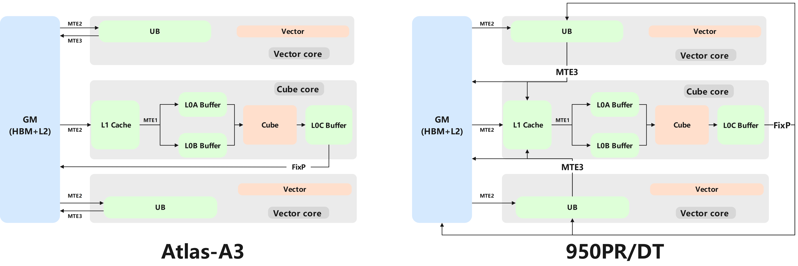
</figure>

## Highlights

- 融合算子在 Atlas-A3 和 950PR/DT 同步开源，强化昇腾芯片对低精度浮点数 FP8 的类型支持
- 融合复杂的Compressor计算流程，兼顾不同压缩方式
- 强化`LightningIndexer`算子，利用 950PR/DT 全新指令提升算子性能
- 统一接口设计，`SparseAttnSharedKV`算子覆盖多种不同 Attention 计算场景
- 将值依赖的 Scheduler 计算部分独立为 AICPU Scheduler 算子，使用更为灵活且适配不同图模式
- 分阶段的分核策略，充分利用硬件计算资源

## Outline

- [NPU DeepSeek-V4 Ascend C 融合算子优化](#npu-deepseek-v33-ascend-c-融合算子优化)
  - [Highlights](#highlights)
  - [Outline](#outline)
  - [DeepSeek-V4 Attention 整体结构](#deepseek-v33-attention-整体结构)
  - [Compressor](#compressor)
    - [计算公式](#计算公式)
    - [Tiling 设计](#tiling-设计)
    - [错位矩阵乘](#错位矩阵乘)
  - [LightningIndexer](#lightningindexer)
    - [计算公式](#计算公式-1)
    - [Tiling 设计](#tiling-设计-1)
    - [Top-k 950PR/DT 方案](#top-k-950prdt-方案)
  - [SparseAttnSharedKV](#sparseattnsharedkv)
    - [计算公式](#计算公式-2)
    - [Tiling 设计](#tiling-设计-2)
    - [多场景覆盖](#多场景覆盖)
  - [AICPU Scheduler](#aicpu-scheduler)
    - [AICPU scheduler 算子](#aicpu-scheduler-算子)

## DeepSeek-V4 Attention 整体结构


<figure align = "center">
    
    <figcaption> DeepSeek-V4 Attention 模块 </figcaption>
</figure>

本次 DeepSeek-V4 将 $K,V$ 统一为同一份，即 Shared Key-Value Attention，并且采用了 Attention Sink，同时引入了复杂的交错 Hybrid Attention 结构，不同层的 Attention 模块的计算模式不同，基于每层不同的 compress ratio 分为三类：
- C1A: 前两层 C1A 层，只涉及关于原始$KV$的 Sliding Window Attention 计算，每个 token 只与相邻 128 个 token 对应的原始$KV$cache进行计算；
<figure align = "center">
    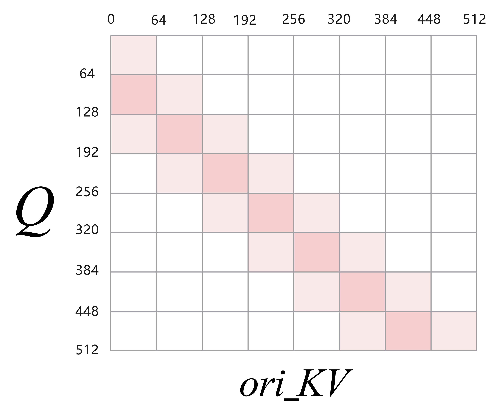
    <figcaption> C1A-Attention </figcaption>
</figure>

- C4A：除第一层外的奇数层为 C4A 层。C4A 层的 Attention 除了会与原始$KV$(ori_KV) 进行 window size 为 128 的 Sliding Window Attention 计算外，还涉及到与压缩$KV$(cmp_KV) 的稀疏计算，其中 cmp_KV 会基于每 4 个 token 及其前 4 个 token 的语义进行压缩。
<figure align = "center">
    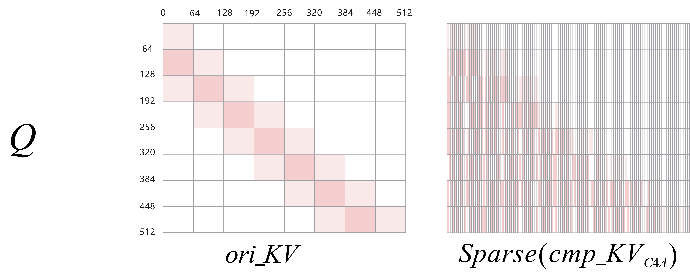
    <figcaption> C4A-Attention </figcaption>
</figure>

- C128A：除第二层外的偶数层为 C128A 层。C128A 层的 Attention 除了会与原始$KV$(ori_KV) 进行 window size 为 128 的 Sliding Window Attention 计算外，还涉及到与压缩$KV$(cmp_KV) 的稠密计算，其中 cmp_KV 会基于每 128 个 token 的语义进行压缩。
<figure align = "center">
    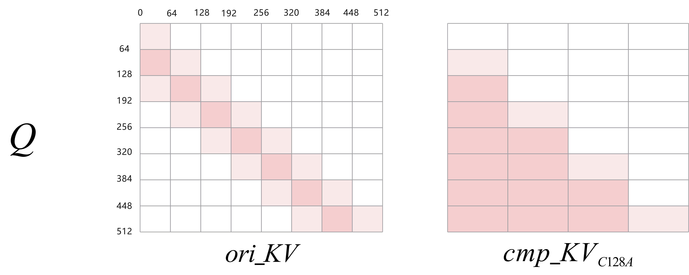
    <figcaption> C128A-Attention </figcaption>
</figure>

在 C4A 及 C128A 层，输入的 hidden state 会通过一系列计算分别产生 ori_KV 和 cmp_KV，其中计算 cmp_KV 的流程较为复杂，而且在 C4A 和 C128A 的场景下有所不同。我们将这一部分计算设计为 Atlas-A3 和 950PR/DT 上的`Compressor`融合算子，兼顾不同情况下的计算流程，并且实现了较好的性能。

C4A 层还会涉及到对 cmp_KV 的进一步稀疏化，延续 DeepSeek-V3.2 的设计，这一部分的稀疏化基于`LightningIndexer`进行。本次发布的`LightningIndexer`融合算子在 Atlas-A3 原本的算子基础上适配了 compress ratio 对应的阶梯形状 mask 计算逻辑，并且在 950PR/DT 上适配 FP8 全量化版本。

由于不同层的 Attention 计算不尽相同，涉及到多种场景。针对 DeepSeek-V4 的 Attention 核心计算部分，我们分别在 Atlas-A3 和 950PR/DT 上设计了支持 Attention Sink 的全新非量化`SparseAttnSharedKV`及伪量化`SparseAttnSharedKV`算子，通过一套接口覆盖不同的功能需求。


## Compressor

DeepSeek-V4 采用了一个新的attention架构，Compress-4-Attention (C4A) 和Compress-128-Attention (C128A). 具体来说是将每 4 或 128 个 token 的$KV$cache 压缩成一个，然后每个token与这些压缩的$KV$cache去进行 Attention 计算。在长序列的情况下，C4A 和 C128A 可以有效地减少计算开销。

### 计算公式

**C4A层**

C4A层的 Compressor 包含如下一系列计算操作，给定输入$X\in \mathbb{R}^{s\times h}$，其中 $s$是 序列长度，$h$ 是hidden size，首先计算其对应的 $2$ 个$KV$输入 $C^a, C^b \in \mathbb{R}^{s \times d}$,与压缩权重 $Z^a, Z^b \in \mathbb{R}^{s \times d}$，其中 $d$ 是 head dimension. 具体公式如下：

$$
\begin{aligned}
C^a&=X\cdot W^{aKV}, C^b=X\cdot W^{bKV}, \\
Z^a&=X\cdot W^{aGate}, Z^b=X\cdot W^{bGate},
\end{aligned}
$$

其中$W^{aKV}, W^{bKV}, W^{aGate}, W^{bGate} \in \mathbb{R}^{h \times d}$是C4A对应KV和压缩权重的权重参数。

长度为$s$的KV序列$C^a, C^b$中的每4个KV会被压缩成1个
$C^{\text{Comp}} \in \mathbb{R}^{\frac{s}{4} \times d}$，其第 $i$ 行 $C_{i}^{\text{Comp}} \in \mathbb{R}^{1 \times d}$ 的计算公式如下：

$$
\begin{aligned}
C_{i}^{\text{Comp}}
&= \frac{\sum_{j=4i}^{4(i+1)-1}{e^{Z_j^a+B_{j-4i}}} \odot C^a_j + \sum_{j=4(i+1)}^{4(i+2)-1}{e^{Z_j^b+B_{j-4i}}} \odot C^b_j}{\sum_{j=4i}^{4(i+1)-1}{e^{Z_j^a+B_{j-4i}}} + \sum_{j=4(i+1)}^{4(i+2)-1}{e^{Z_j^b+B_{j-4i}}}} \\
&= \left[1\right]_{1\times8} @ (softmax(\left[Z^a_{\left[4(i-1)+1:4i,:\right]} ; Z^b_{\left[4i+1:4(i+1),:\right]}\right] + B) \odot \left[C^a_{\left[4(i-1)+1:4i,:\right]} ; C^b_{\left[4i+1:4(i+1),:\right]}\right])
\end{aligned}
$$

其中 $B \in \mathbb{R}^{8 \times d}$ 为 $C^a, C^b$ 对应的positional biases。

<figure align = "center">
    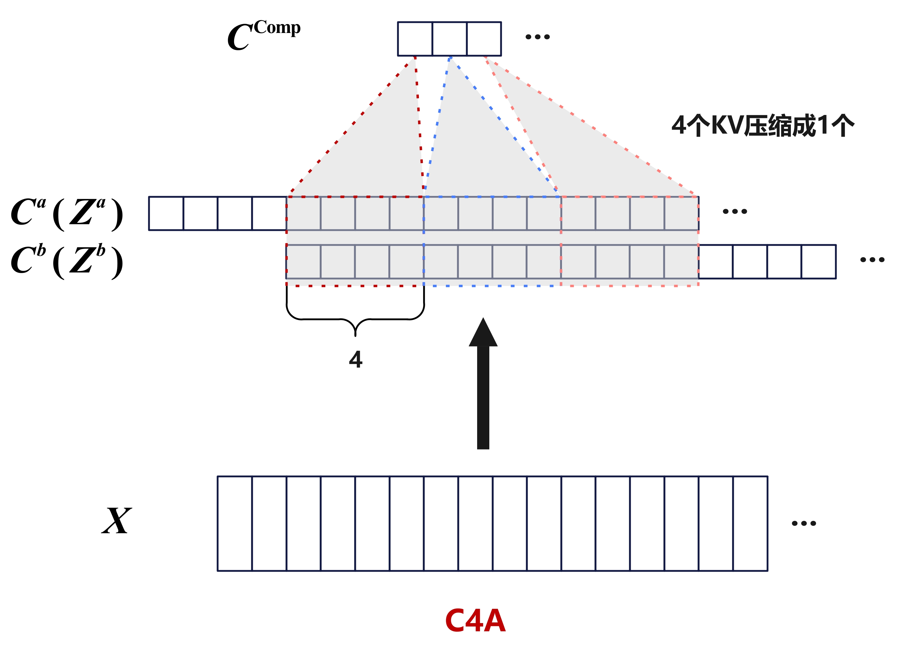
    <figcaption> C4A 示意图 </figcaption>
</figure>

**C128A层**
相比C4A, C128A层的 Compressor 会以更大的压缩比率对KV序列去进行压缩，并且只依赖单一KV序列$C \in \mathbb{R}^{s \times d}$和压缩权重$Z \in \mathbb{R}^{s \times d}$，其中
$$
\begin{aligned}
C&=X\cdot W^{KV}, \\
Z&=X\cdot W^{Gate}
\end{aligned}
$$
$W^{KV}, W^{Z}$ 是C128A对应KV和压缩权重的权重参数。

然后长度为$s$的KV序列$C$中的每 $128$ 个$KV$会被压缩成 $1$ 个 $C^{\text{Comp}} \in \mathbb{R}^{\frac{s}{128} \times d}$，其第 $i$ 行

$$
\begin{aligned}
C_{i}^{\text{Comp}}
&= \frac{\sum_{j=128i}^{128(i+1)-1}{e^{Z_j+B_{j-128i}}} \odot C_j}{\sum_{j=128i}^{128(i+1)-1}{e^{Z_j+B_{j-128i}}}} \\
&= \left[1\right]_{1\times128} @ (softmax(Z_{\left[128(i-1)+1:128i,:\right]} + B) \odot C_{\left[128(i-1)+1:128i,:\right]})
\end{aligned}
$$

$i = 1, \cdots, \frac{s}{128},$ 其中 $B \in \mathbb{R}^{128 \times d}$ 为 $C$ 对应的positional biases.

<figure align = "center">
    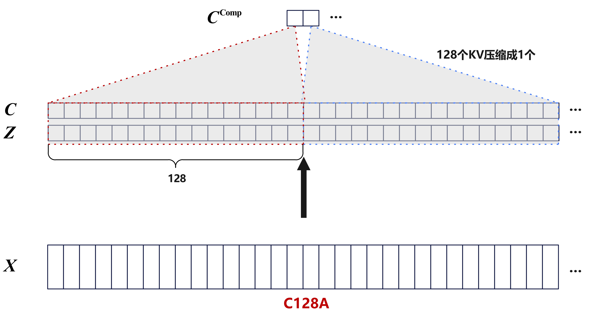
    <figcaption> C128A 示意图 </figcaption>
</figure>

**具体计算流程**

`Compressor` 会先把 $r (r=4 \text{ or } 128)$ 个$KV$压缩成 $1$ 个，再对压缩后的 $KV$ 做 RMSNorm 与 Partial Rope 的后处理。各阶段具体计算如下：

压缩阶段：
1. 计算矩阵乘法：
    - C4A: $\left[C^a, Z^a\right] = X @ \left[W^{aKV}, W^{aGate}\right], \left[C^b, Z^b\right] = X @ \left[W^{bKV}, W^{bGate}\right];$
    - C128A: $\left[C, Z\right] = X @ \left[W^{KV}, W^{Gate}\right]$
2. 计算分组加法：
    - C4A: $Z_i^\prime = \left[Z_{\left[4(i-1)+1:4i,:\right]}^a; Z_{\left[4i+1:4(i+1),:\right]}^b\right]+B,~i=1,2,\cdots, \frac{s}{4};$
    - C128A: $Z_i^\prime = Z_{\left[128(i-1)+1:128i,:\right]} + B,~i=1,2,\cdots, \frac{s}{128};$
3. 计算分组Softmax：
    - C4A: $S_i^\prime = softmax(Z_i^\prime),~i=1,2,\cdots, \frac{s}{4};$
    - C128A: $S_i^\prime = softmax(Z_i^\prime),~i=1,2,\cdots, \frac{s}{128};$
4. 计算Hadamard乘积:
    - C4A: $(S_H)_i = S_i^\prime \odot \left[C^a_{\left[4(i-1)+1:4i,:\right]} ; C^b_{\left[4i+1:4(i+1),:\right]}\right],~i=1,2,\cdots, \frac{s}{4};$
    - C128A: $S_H = S^\prime \odot C;$
5. 沿着压缩轴分组求和：
    - C4A: $C_{i}^{\text{Comp}} = \left[1\right]_{1\times8} @ (S_H)_i, ~i=1,2,\cdots, \frac{s}{4};$
    - C128A: $C_{i}^{\text{Comp}} = \left[1\right]_{1\times128} @ (S_H)_i, ~i=1,2,\cdots, \frac{s}{128};$

后处理阶段：
1. 计算RMSNorm;
2. 计算Partial RoPE。

**融合价值**

<figure align = "center">
    
    <figcaption> Compressor 计算流程</figcaption>
</figure>

从上述计算流程图可以看出，Compressor 中存在大量的非计算向量操作 (如图中`split`,`slice`等)，若以小算子实现则会引入大量无意义的数据重复搬入搬出，导致性能极差。以融合算子实现可以将这一类操作在数据搬运的过程中随路实现，大幅降低 Compressor 部分的耗时。

图中的`coff`在 C128A 层为1，在 C4A 层为2。`coff=2`意味着需要用相邻的两组 token 语义进行压缩，因此 C4A 层的 Compressor 会引入一个较为复杂的数据重排操作：

<figure align = "center">
    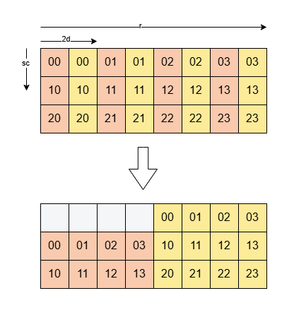
    <figcaption> C4A Compressor 数据重排</figcaption>
</figure>

如上图所示，C4A 层的 Compressor 会引入一个较为复杂的数据重排操作，即将每个 token 映射为两个 $d$ 大小的向量后 (图中的红色方块与黄色方块)，将每 4 个 token 对应的黄色方块向量与前 4 个 token 对应的红色方块向量重排为连续存储。该操作如果用小算子单独实现，同样会引入大量非计算的向量操作。而在该融合算子中，我们利用错位的矩阵乘法巧妙地完成了这一部分的数据重排，可参考后续章节[错位矩阵乘](#错位矩阵乘)。

### Tiling 设计
**Atlas-A3**
Atlas-A3 上算子 Tiling 如下：

对于 C128A:
- L1 空间划分为如下部分：
    - $X$ 矩阵：$2 \times 256 \times 256 \times 2 \text{ Bytes}=256 \text{ KB}$, L1 层级基本块为 $(256, 256)$
    - $W^{KV}, W^{Gate}$ 矩阵：$2 \times 256 \times 64 \times 2 \text{ Bytes}=64 \text{ KB}$, L1 层级基本块为 $(256, 128)$，一轮迭代会搬入 $W^{KV}, W^{Gate}$ 各 $2$ 个 $(256, 64)$ 的矩阵块
- L0A, L0B 使能 double buffer, 分别划分为 $2\times32\text{ KB},2\times32\text{ KB}$，一次搬入 L0A 和 L0B 的矩阵块大小都为 $(128,128)$； L0C 使能 double buffer，划分成 $2\times64\text{ KB}$，分别存放 $1$ 个 $X$ 分块与 $W^{KV}, W^{Gate}$ 矩阵相乘的结果，并且在 L0C 上累加。


对于 C4A:
- L1 空间划分为如下部分：
    - $X$ 矩阵：$ 128 \times 256 \times 2 \text{ Bytes}=64 \text{ KB}$, L1 层级基本块为 $(128, 256)$
    - $W^{KV}, W^{Gate}$ 矩阵：$4 \times 256 \times 64 \times 2 \text{ Bytes}=128 \text{ KB}$, L1 层级基本块为 $(256, 128)$，一轮迭代会搬入 $W^{aKV}, W^{bKV}, W^{aGate}, W^{bGate}$ 各 $1$ 个 $(256, 64)$ 的矩阵块。
- L0A, L0B 使能 double buffer, 分别划分为 $2\times32\text{ KB},2\times32\text{ KB}$，一次搬入 L0A 和 L0B 的矩阵块大小都为 $(128,128)$； L0C 使能 double buffer，划分成 $2\times64\text{ KB}$，分别存放 $2$ 个 $X$ 分块与 $1$ 个 KV+Gate 矩阵相乘的结果，并且在 L0C 上累加。

<figure align = "center">
    
    <figcaption> Atlas-A3 上 Compressor 核内 Tiling </figcaption>
</figure>


以此基本块做完矩阵乘法并按 reduce 轴累加后，均分给 2 个 Vector 核, 进行后续Vector操作。

**Decode**
在 Decode 阶段，为了解决 $s$ 轴方向无法分核的问题，进一步切分 $d$ 轴（从 $64$ 降低成 $32$），来提高启动的核数与带宽利用率。

**基本块 Cost Model**
基本块的选取是算子设计中的关键环节，需依据硬件参数通过理论计算确定合适的 Tiling 策略：

为使一轮基本块迭代中搬运左矩阵或右矩阵数据的时间能被对应计算时间掩盖，需满足搬运耗时不超过计算耗时，即
$$
\frac{(baseM + baseN) \times baseK \times 2 \text{ Bytes}}{\text{Bandwidth}} \leq \frac{baseM \times baseN \times baseK}{4096}
$$
约去 $baseK$

- 对于 Atlas-A3, C128A 中选取 $(baseM, baseN, baseK)=(256, 128, 512)$, C4A 中选取 $(baseM, baseN, baseK)=(128, 256, 512)$，这里 $baseK$ 的选取主要是考虑昇腾亲和 Cacheline 对齐，提高搬运效率。
- 对于 950PR/DT，考虑 L0A，L0B 容量限制，可取 $baseM=baseN=baseK=256$ 达成条件。

### 错位矩阵乘
注意到在计算 C4A 时，$Z^b, C^b$ 计算 $C_{i}^{\text{Comp}}$ 的下标与 $Z^a, C^a$ 计算 $C_{i+1}^{\text{Comp}}$ 的下标有重叠，在这里我们用错位矩阵乘来实现这个处理。

在搬运 $X$ 矩阵块到 L1 时，会额外多搬运一个压缩组 $r=4$ 的数据，与 $W^{aKV}, W^{aGate}$ 相乘时，用的是忽略最后一个压缩组的数据，而与 $W^{bKV}, W^{bGate}$ 相乘时，用的是忽略第一个压缩组的数据。从而最后矩阵乘的结果中 $Z^a, C^a$ 的下标与$Z^b, C^b$ 的下标自然错开，后续的向量计算无需额外的下标偏移处理。

<figure align = "center">
    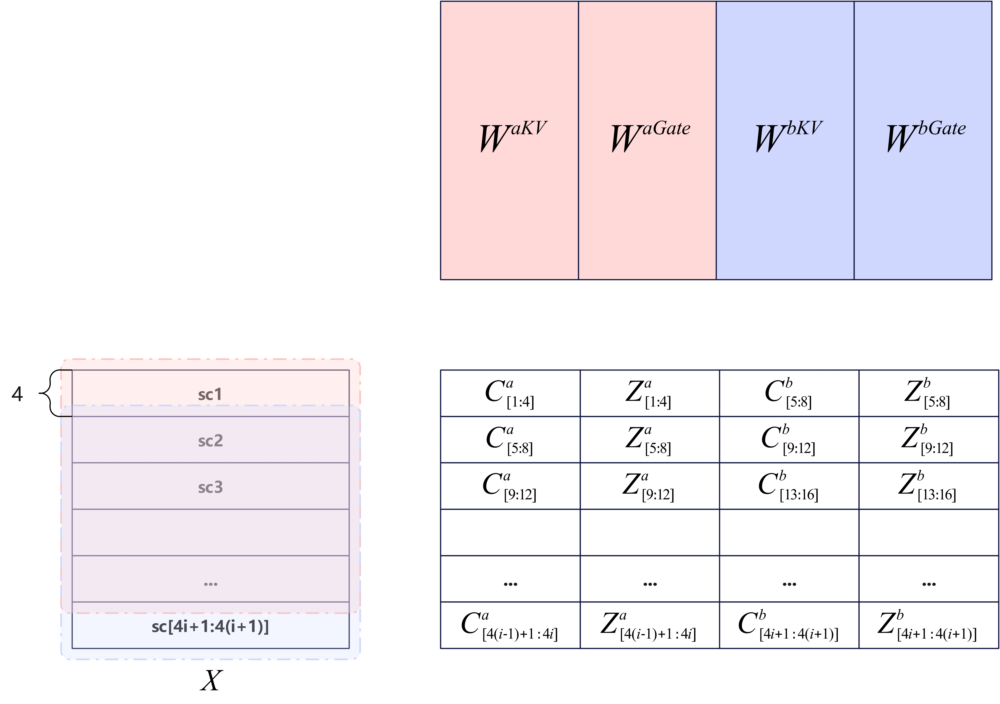
    <figcaption> 错位矩阵乘 </figcaption>
</figure>

## LightningIndexer

### 计算公式
`LightningIndexer`基于一系列操作得到每一个 token 对应的 Top-$k$ 个位置。不考虑 batch 轴，对于 Query 对应的 $Q_{index}\in\R^{n \times S_q \times d}$，给定上下文 Index Key $K_{index}\in\R^{S_{k}\times d},W\in\R^{n \times S_q\times 1}$，其中 $n$ 为头的个数，$d$ 为每一个头的维度，$S_{q}$ 是请求的个数，$S_{k}$ 是上下文的长度，`LightningIndexer`的具体计算公式如下：
$$
\text{Top-}k\left\{[1]_{1\times n}@_n\left[(W@_{1}[1]_{1\times S_{k}})\odot\text{ReLU}\left(Q_{index}@_{d}K_{index}^T\right)\right]\right\}
$$

此时默认 $Q_{index}$ 和 $K_{index}$ 是量化后的FP8(E4M3)矩阵。量化过程中已对每个头和每个token得到反量化系数，记为矩阵形式： $Scale_q \in\R^{n \times S_q\times 1}$, $Scale_k \in \R^{S_k \times 1}$。

`LightningIndexer`可拆分为如下计算流程 (其中 $@_{d}$，$@_{1}$ 和 $@_{n}$ 分别代表 $d,1,n$ 三个维度上相乘, $\odot$ 代表逐元素相乘)：
1. 对量化后的矩阵计算矩阵乘法：$S = Q_{index}@_{d} K_{index}^T$；
2. 计算激活函数：$S'=\text{ReLU}(S)$；
3. W 吸收反量化系数 $Scale_q$：$W' = Scale_q \odot W$;
4. 计算广播乘法：$S_W=(W' @_{1}[1]_{1\times S_{k}})\odot S'$；
5. 关于头进行ReduceSum操作：$Score=[1]_{1\times n}@_{n} S_W$；
6. 广播乘反量化系数：$Score = (Scale_k @_{1}[1]_{1\times S_{q}})^T \odot Score$
7. 对 $Score$ 进行 $\text{Top-}k$ 计算，即获取数值排序前 $k$ 个的结果，并返回其对应的 Index。

在 Prefill 或开启 MTP 的 Decode 场景，多个 token 对应的 $Q_{index}$ 会被合并统一计算，本文后续部分不对单/多个 token 对应的 $Q_{index}$ 加以区分。

实际开发中需要充分利用昇腾硬件的特征以实现更好的性能，以下将详细介绍当前的解决方案及具体实现方式。

<div align="center">
    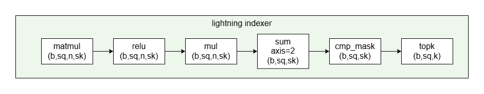
    <figcaption> Lightning Indexer 计算流程 </figcaption>
</div>

### Tiling 设计

**Atlas-A3**
本次 Atlas-A3 上 `LightningIndexer`的 Tiling 沿用之前的设计，可参考：[Atlas-A3 LightningIndexer](https://gitcode.com/cann/cann-recipes-infer/blob/master/docs/models/deepseek-v3.2-exp/deepseek_v3.2_exp_ascendc_operator_guide.md#lightningindexer)。

### Top-k 950PR/DT 方案
`LightningIndexer`融合算子的核心是在长达数十万 (序列长度记为$S_{k}$) 的序列中，为每个 token 高效地筛选出分数最高的 $k$ (例如 512) 个索引。同时，对于算子而言，Top-$k$ 的计算必须是准确无误的，不能采用近似算法求解。

一种昇腾亲和的解决方案是使用 950PR/DT 的 Histograms 指令。该指令可对若干个 uint8 数字进行直方图统计，一个 cycle 可将 64 个数字分到 0-127 或 128-255 桶中。基于此思路，以一个 Query 为例，使用 Histograms 指令在 $S_{k}$ 个 float 类型的 Score 中选取 Top-$k$ 的核心算法总结如下：

**保序变换**
设 $x$ 为浮点数 $f$ 的二进制表示, $\text{convert}(f)$ 为变换后的 uint32 值。可采用如下的保序变换算法：
```c
uint32_t mask = (x&0x80000000)?0xffffffff:0x80000000;
return (f==f)?(x^mask):0x0;
```
这等价于以下分段函数:
$$
\text{convert}(f) =
\begin{cases}
0 & \text{if}\ f\ \text{is nan}\\
2^{32}-1-x (\equiv \sim x) & \text{if}\ x\ \geq 2^{31} (\text{i.e.}\ f < 0) \\
x + 2^{31} (\equiv x \oplus 2^{31}) & \text{if}\ x < 2^{31} (\text{i.e.}\ f \geq 0)
\end{cases}
$$
若 Score 的输入为 bfloat16 类型，则可用类似方法转化为 uint16。

**多级直方图分桶**
以 uint32 类型为例介绍一种昇腾亲和的多级直方图分桶方法。首先将 uint32 的 32 位由高到低切分为 4 个 8 位，分别视为 uint8 类型。已知，对于 uint32 类型的两个数 a 和 b，记两者的高8位构成的 uint8 分别为 a_8 和 b_8，则 a_8 < b_8 一定可以推导出 a < b。基于这一思想，可分别定位出第 Top-$k$ 值的每一个 8 位。

<figure align = "center">
    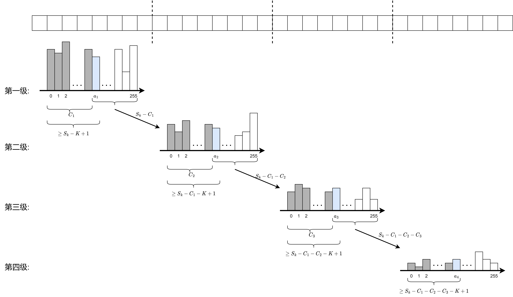
    <figcaption> 以 uint32 为例，若为 uint16 则只需二级直方图</figcaption>
</figure>

如图所示，多级直方图筛选第 Top-$k$ 的值流程如下：
1. 对所有的 uint32 元素，提取从高到低的第一个 8 位，用`hist`指令绘制直方图，返回的结果是一个长度为256的数组 Array_1，其中第 $i$ 个值代表 $0$-$i$ 个桶的个数和。
2. 将 Array_1 中的值与临界值 $S_k-k+1$ 比较，大于等于 $S_k-k+1$ 的位置为 true。从小到大第一个为 true 的桶即为第 Top-$k$ 元素所在的桶 (图中蓝色部分)，记为 $a_1$。此时可将前8位小于 $a_1$ 的元素用 mask 掩去 (即为图中的灰色部分)。这部分元素将被丢弃，设本次丢弃的个数为 $C_1$ ($C_1 < S_k-k$)。
3. 对剩余的 $S_k - C_1$ 个元素，提取第 2 个 8 位绘制直方图，重复 1-2 步的过程，选取出临界桶 $a_2$，并丢弃第2个8位小于 $a_2$ 的元素，统计本次丢弃个数 $C_2$。
4. 对剩余的 $S_k - C_1 - C_2$ 个元素，提取第 3 个 8 位绘制直方图，重复 1-2 步的过程，选取出临界桶 $a_3$，并丢弃第 3 个 8 位小于 $a_3$ 的元素，统计本次丢弃的个数 $C_3$。
5. 对剩余的 $S_k - C_1 - C_2 - C_3$ 个元素，提取第 4 个 8 位绘制直方图，重复 1-2 步的过程，选取出临界桶 $a_4$。

由此得到第 $k$ 大的值为：
$$
value_k = a_1 \times 2^{24} + a_2 \times 2^{16} + a_3 \times 2^{8} + a_4
$$

**向量化筛选**
此时已拿到第 $k$ 大的值为 $value_k$，只需考虑大于等于 $ value_k $ 的值，总体流程如下：
1. 大于 $value_k$ 的部分：以向量化的方式，256B 为单位将原序列中的值与 $value_k$ 比较得到一个 mask，大于 $value_k$ 的位置为 true。以此 mask 筛选出所有大于 $value_k$ 的值对应的指标并聚集到 $result$ 中，此时个数小于 $k$。
2. 等于 $value_k$ 的部分：以 256B 为单位循环遍历所有 $Score$，找到等于 $value_k$ 的值并筛选出来，直到 $result$ 的总数等于 $k$ 时退出循环。

**实现指令和理论开销**
以 uint32 为例，设序列长度 $S_k=16384$, 选取的 Top-$k$ 为 $512$，Top-$k$ 部分具体的实现指令和理论开销如下:
1. `hist1`: 用 `DeInterleave` 解交织提取第一个8位，并用直方图指令 `hist` 分桶。 一条`hist`指令每个cycle处理64个数字，且需要两条指令分别处理0-127和128-255。实现过程中以 $256$ 个数字为一组进行循环处理，每组需8个cycle处理直方图。加上初始化等其他开销约 10 cycle，总计 $(S_k/256 * 9 + 10)$ cycle。
2. `find1`: 对 `hist1` 的结果，每 64 个桶一组，与临界值$S_k-k+1$做比较，将比较的结果用 `squeeze` 的 `gather` 模式拼到一起，并计算新的临界值，开销约 $(4*7 + 10)$ cycle。
3. `hist2`: 相比于 `hist1`，每轮循环增加一次比较 `Compare`，总开销约 $(S_k/256 * 10 + 10)$ cycle。
4. `find2`: 和 `find1` 相同， 开销 $(4 * 7 + 10)$ cycle。
5. `hist3`: 相比于 `hist1`，除了每轮循环增加两次比较 `Compare` 和一次 `And`，还需要增加一次 `DeInterleave` 解交织提取第三个8位，故总开销约 $(S_k/256 * 13 + 10)$ cycle。
6. `find3`: 和 `find1` 相同，开销 $(4 * 7 + 10)$ cycle。
7. `hist4`: 相比于 `hist1`，增加一次 `DeInterleave`，三次 `Compare` 和两次  `And`，开销估计为 $(S_k/256 * 15 + 10)$ cycle。
8. `findKth`: 计算临界 Top-$k$ 的值 $value_k$，开销和 和 `find1` 基本相同，共计 $(4 * 7 + 10)$ cycle。
9. `findGTO`: 64 个 uint32 为一组，做 `Compare` 和 `squeeze`，将大于 $value_k$ 的值对应的指标取出，共计约 $S_k/64*7$ cycle。
10. `findEQ`: 64 个 uint32 为一组，做 `Compare` 和 `squeeze`，将等于 $value_k$ 的值对应的指标依次取出，直到取满 $k$ 个，共计 $S_k/64*9$ cycle。

累计以上所有开销, 在 950PR/DT 上采用多级直方图和向量化筛选的方式，理论开销估计为 $(S_k/256*111+192)$ cycle, 在 $S_k=16384$时，理论开销计算为 7296 cycle。

相比之下，对于相同的 $S_k$ 和 $k$， Atlas-A3 上基于 sort32 和 mrgsort 的实现方式 ([Atlas-A3 LI Top-k 指令实现](https://gitcode.com/cann/cann-recipes-infer/blob/master/docs/models/deepseek-v3.2-exp/deepseek_v3.2_exp_ascendc_operator_guide.md#top-k-%E6%8C%87%E4%BB%A4%E5%AE%9E%E7%8E%B0)) 需要 $
(1.36S_k+3.32k+\lceil\frac{max(log_2(k)-5,0)}{2}S_k \rceil)/2
$ cycle 的理论开销。在 $S_k=16384, k=512$ 时，开销约 28375 cycle。

## SparseAttnSharedKV

### 计算公式
`SparseAttnSharedKV`算子旨在完成以下形式的 Attention 计算：
$$O = \text{softmax}(Q@\tilde{K}^T \cdot \text{softmax\_scale})@\tilde{V}$$
其中 $\tilde{K}=\tilde{V}$ 为基于入参控制的实际参与计算的 $KV$。适配DeepSeek-V4 模型的全新 Attention，该算子支持 Sliding Window Attention、Compressed Attention (以及在此基础上的稀疏化) 和两者混合。

本次的`SparseAttnSharedKV`算子在 Atlas-A3 和 950PR/DT 上同步发布，Atlas-A3 上为非量化版本，即输入的 $Q,KV$ 都是半精度，算子计算流程分为下面四个阶段
- $C_1$：$Q@K^T$；
- $V_1$：online softmax；
- $C_2$：$P@V$；
- $V_2$：rescaling $O$。

950PR/DT 上为伪量化版本，即输入的 $KV$ 已被量化到 8bit，算子计算流程在最初新增一个 $V_0$ 阶段用于对 $KV$ 进行反量化，整体计算流程为五个阶段。

### Tiling 设计

由于 Atlas-A3 和 950PR/DT 的芯片架构不同，我们采用了不同的 Tiling 策略。

**Atlas-A3**

<div align="center">
    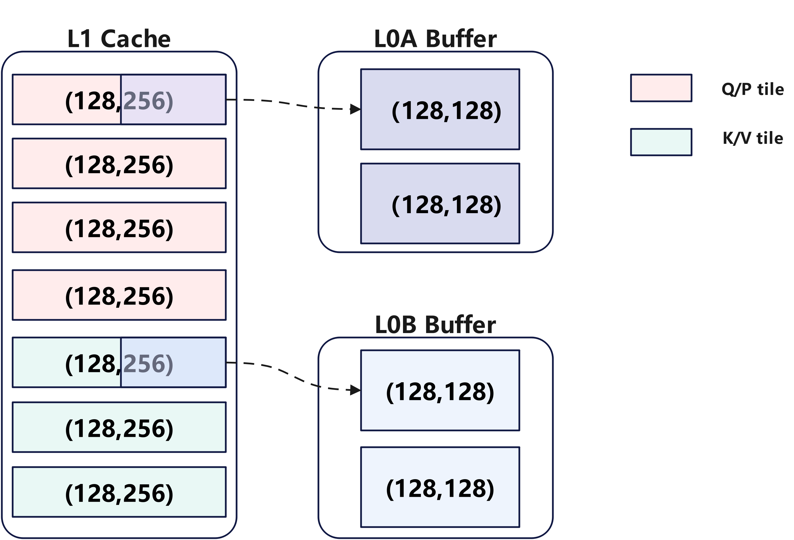
</div>

一次迭代计算的基本块大小为(256,512)，即完成 $Q$ 序列方向 256 和 $KV$ 序列方向 512 长度的计算。考虑到实际情况，例如 C4A 层中存在的稀疏计算，无法将不同 $Q$ 进行合轴计算，只能一个 Group 内统一计算，因此一次迭代实际计算的基本块大小可能为(64,512)，但不影响整体 Cache 划分。

算子核内 Tiling 设计如下：

- L1 空间划分为如下部分：
  - $Q/P$ 矩阵分时复用 ($P$矩阵是softmax计算的结果)：4×128×256×2 Bytes=256 KB，即在一个 $C_1$ ​或 $C_2$ ​ 阶段中，左矩阵分四次搬运到 L1 中，最终在一次迭代内常驻于 L1，其中 $Q$ 矩阵每次的搬运量大小为 (128,256)，$P$ 矩阵每次的搬运量大小为 (128,256)；
  - $K/V$ 矩阵 3-Buffer 循环复用：3×128×256×2 Bytes=192 KB，其中 $K$ 矩阵每次的搬运大小为(128,256)，$V$ 矩阵每次的搬运大小为(256,128)。
- L0A，L0B，L0C使能 Double Buffer，分别划分为$2\times32\text{ KB}$ KB,$2\times32\text{ KB}$,$2\times64\text{ KB}$，在 $C_1$ / $C_2$ 阶段一次搬入 L0A 和 L0B的矩阵块大小分别为 (128,128),(128,128)。

### 多场景覆盖

`SparseAttnSharedKV`算子通过多种入参组合实现不同场景的 Attention 计算场景，其中关键入参为：

- ori_kv: SWA对应的原始 $KV$ cache；
- ori_win_left, ori_win_right: 表示 sliding window attention 中参与计算的 key-value 在序列轴的范围。假设 $t$ 为 query 的sequence id， 则参与计算的key/value 的sequence id 范围为 $t - \text{win\_left}, t - \text{win\_left} + 1, ..., t, ..., t + \text{win\_right}$；
- cmp_kv: C4A 层及 C128A 层压缩后 $KV$ cache；
- cmp_ratio: cmp_kv 中 $KV$ 的压缩比例。

上述入参可通过如下组合方式完成 DeepSeek-V4 中不同场景的 Attention 计算：
<figure align = "center">
    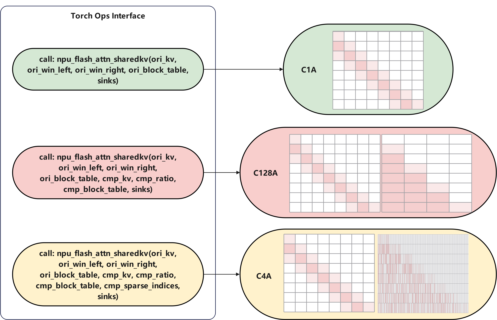
</figure>

## AICPU Scheduler

Scheduler 核心职能在于执行流的静态预演与管控。通过预分配显存空间、锁定执行分支并优化分核策略，该机制能够有效消除运行时开销，确保指令流水线始终处于饱和状态，极大提升硬件吞吐。

### AICPU scheduler 算子

对于 Attention 及 LI 这类“值依赖算子”而言，仅依靠输入的 shape 信息无法实现好的分核策略，还需要在运行时获取**实际的上下文长度**。传统 Scheduler 实现方式需要回到 HOST 执行，会导致整体执行流水被打断；而直接在算子 kernel 内计算分核策略会导致这一部分的计算耗时无法被掩盖，引入极大的头开销。昇腾芯片内置若干个 ARM 计算核（AICPU），把这一部分 Scheduler 计算放到 AICPU 上执行既可以保证算子入图又可以使得这一部分耗时被掩盖。

本次同步发布了`SparseAttnSharedKV`及`LightningIndexer`对应的AICPU Scheduler 算子: [SAS AICPU Scheduler](https://gitcode.com/cann/ops-transformer/tree/master/experimental/attention/sparse_attn_sharedkv_metadata), [LI AICPU Scheduler](https://gitcode.com/cann/ops-transformer/tree/master/experimental/attention/quant_lightning_indexer_metadata)。

现可以将整个 Scheduler 过程分为两个部分：
- 只需要输入的 shape 即可计算：
  - 最大显存占用 max workspace：用于提前给算子分配足够的device空间；
  - 具体执行路径 tiling key：确定实际编译的算子模板；
  - 启用的核数 block dim：用于确定开核情况；
  - tiling data：提取实际的 shape 信息进行常量折叠，减少算子运行时的标量计算。
- 需要实际的上下文长度才可以计算：
  - 具体的分核策略：每个核要执行的实际计算部分，提高计算负载的均衡性以实现高算力利用率。

第一个部分的 Scheduler 计算由 Host 执行，而本次算子将第二个值依赖部分的 Scheduler 单独定义为一个 AICPU 算子，其输出蕴含分核信息的 metadata 供实际的 NPU 算子使用：
```python
# run in aicpu
metadata = torch_npu.npu_sparse_attn_sharedkv_metadata(......)
# run in aicore
npu_result, softmax_lse = torch.ops.custom.npu_sparse_attn_sharedkv(...,metadata=metadata,...)
```
这样的方式有很多优势：
- 更为灵活，不需要框架侧额外识别这类特殊的“值依赖”算子，也减轻了算子侧额外适配框架的工作量；
- 用户通过脚本直接调用 AICPU 算子即可，对于 aclgraph 等图模式更为友好；
- 对于单次推理而言，每种计算模式对应的 AICPU Scheduler 算子只需要执行一次，可以复用。

对于同样有实时 Scheduler 需求的算子，也可以自定义开发 AICPU Scheduler 算子实现更好的整网性能，可参考：[AICPU算子开发](https://www.hiascend.com/document/detail/zh/CANNCommunityEdition/850alpha001/opdevg/tbeaicpudevg/atlasopdev_10_0001.html)了解开发方式，获取更多信息。

<div align="center">
    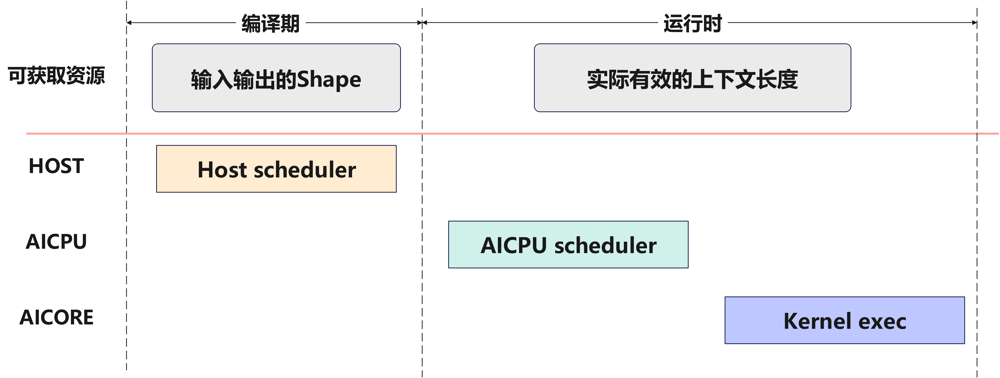
</div>