# NPU DeepSeek-V4推理优化实践

DeepSeek团队发布了最新的模型DeepSeek-V4系列模型，包含DeepSeek-V4 Flash和DeepSeek-V4 Pro两种规格。在DeepSeek-V3.2的稀疏Attention（DeepSeek Sparse Attention）的基础上，在不同层间进一步通过KV Cache滑窗 (Window Cache) 和压缩算法 (KV Cache Compress)，减少Attention的计算和访存开销，可以大幅提升长序列的计算效率，降低推理的成本。本实践0 Day支持了DeepSeek-V4的模型推理部署，并适配支持`Atlas-A3 Pod`和`950PR/DT`多代际昇腾芯片，提供长达1M序列的高性能推理能力。

针对新模型结构特点，实践打造了低时延、高吞吐的部署方案，创新设计高性能NPU融合Kernel和多流并行方案，大幅提升推理性能。在量化支持上，本实践在`Atlas-A3 Pod`平台适配了W8A8C16（Int8）量化方案，在`950PR/DT`平台上支持了原生Hybrid FP8-MXFP4混合量化模式，以及硬件亲和的Hybrid MXFP8-MXFP4模式，充分发挥不同硬件的算力优势。本实践同步开源了TileLang和PyPTO实现，为高效算子开发提供可直接参考的样例，仅需几百行代码即可完成复杂融合kernel的开发工作。
针对DeepSeek-V4模型的新结构，本次开源提供了一系列高性能融合算子，主要包括：

- 针对多Layer交织的Window/Sparse/Compress Attention，提供了SparseAttnSharedKV (SAS)统一接口支持多种Attention计算。

- 针对不同的Compress Ratio，支持Compressor和CompressEpilog融合算子，实现Cache的高效压缩与更新。

- 强化LightningIndexer(LI)算子功能，新增Compress Ratio特性支持。

- 针对mHC [(Manifold-Constrained Hyper-Connections)](https://arxiv.org/pdf/2512.24880) 架构，提供了HCPre和HCPost融合算子。

上述融合算子的**AscendC**实现，均已在0 Day开源。此外，本次开源还提供了**PyPTO**和**TileLang**实现，为高效算子开发提供可直接参考的样例，仅需几百行代码即可完成复杂融合kernel的开发工作。

## Highlights
- 整体部署策略沿用DeepSeek的EP并行方案，针对模型的新结构特征，设计实现NPU亲和的并行策略，支持`Atlas-A3 Pod`和`950PR/DT`多代际昇腾芯片部署，提供长达1M序列的高性能推理能力。[模型推理代码](../../../models/deepseek-v4/README.md)已在本仓开源，同时也适配了主流开源推理框架vLLM和SGLang。
- 基于AscendC开源发布HC Pre和HC Post融合算子，高性能计算mHC的前后处理流程。AscendC Kernel[技术文档](./deepseek_v4_mHC_guide.md)和[代码](../../../ops/ascendc/README.md)已开源。
- 基于自研PyPTO发布HC Pre和MLAProlog融合算子，提高融合算子的编程易用性，算子前端无需感知芯片的代际差异，后端通过pass IR和PTO_ISA指令进行区分，实现代际兼容。PyPTO Kernel[技术文档](./deepseek_v4_pypto_operator_guide.md)、PTO ISA的[使用指南](https://gitcode.com/cann/pto-isa/blob/master/README.md)和[代码](../../../ops/pypto/README.md)已开源。
- 开源社区TileLang同步支持了DeepSeek-V4中的所有新增算子开发，并分别对应Tilelang-Ascend的Expert和Developer开发模式，提供AscendC基础指令和PTO AS两种对接层次，为各种编程前端语言和编译器提供多层开放接口，在TileAi开源社区发布，TileLang Kernel[技术文档](./deepseek_v4_tilelang_operator_guide.md)和[代码](../../../ops/tilelang/README.md)已同步开源。
- 基于NpuGraphEx后端，叠加dynamo编译缓存、静态编译等独有特性，释放昇腾算力，实现极致的图模式加速。
- `950PR/DT`支持原生Hybrid FP8-MXFP4混合量化模式，可实现权重无损平滑迁移。同时本实践支持采用MXFP8替代原生FP8计算，在Prefill或Decode高吞吐场景下进一步提升计算效率。
- 基于上述优化点，CANN已0 Day支持DeepSeek-V4推理部署。Decode的参考性能：DeepSeek-V4 Flash在`950DT`平台16卡128K序列场景TPOT小于10ms；在`Atlas-A3 Pod`平台64卡8K序列场景Decode单卡吞吐4388TPS@30ms。


## Outline

- [模型结构](#模型结构)
- [融合Kernel](#融合Kernel)
- [并行策略](#并行策略)
- [MTP](#mtp)
- [量化策略](#量化策略)
- [多流并行优化](#多流并行优化)
- [Benchmark](#benchmark)
- [Future Plan](#future-plan)

## 模型结构

DeepSeek-V4每个Layer包含mHC、Attention和Mixture of Experts (MoE)三种模块。相较于DeepSeek-V3.2，DeepSeek-V4在Attention部分沿用了LI稀疏注意力机制，并新增了滑窗注意力机制 (Window Attention) 和KV Cache压缩技术，使得Attention的整体计算量、访存量保持在较低水平（对比Full Cache），从而大幅提升长序列下的性能表现。

DeepSeek-V4模型的结构如下图所示：
<p align="center">
  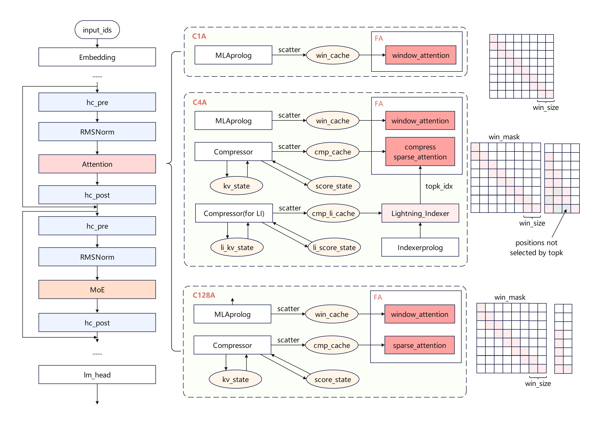
</p>

> 受篇幅所限，图片所呈现的内容简化表达了部分结构。

#### Attention 稀疏与压缩

- 在模型的前两层，Deepseek-V4 Flash采用Window Attention (SWA)，使用`sliding_window=128`大小的KV Cache，有效降低Attention的计算量和KV Cache的内存占用；Deepseek-V4 Pro则使用128倍Compress Ratio，通过Compressor将Full Cache压缩128倍 (HCA)；
- 在后续的层中，交替使用Compressed Sparse Attention (CSA)和Heavily Compressed Attention (HCA)，通过Compressor将Full Cache压缩4倍 (CSA) 或128倍 (HCA)；
- 在CSA层中，在压缩后的Cache上通过LI叠加KV Cache稀疏技术，选取Top 512对KV参与Attention计算，进一步提升长序列下的性能表现；

- Attention计算采用MQA (Multi-Query Attention)而非MLA，不再区分Prefill和Decode的计算流差异（`naive`或者`absorb`），同时引入`attention_sink`参数。

#### MoE 专家

|模型规格|路由专家数|共享专家数|单Token路由专家激活参数量|
|-------|----------|---------|-------------------------|
| 285B  | 256      |  1      |  6G                     |
| 1.6T  | 384      |  1      |  22.5G                  |

在MoE部分，DeepSeek-V4 MoE模块参数详见上表，每次激活6个路由专家和1个共享专家。在专家选取上，前3层采用了`hash routing`，后40层则采用可学习的`soft routing`。

#### mHC (Manifold-Constrained Hyper-Connections)
mHC是对于传统残差连接的扩展，它将`hidden_state`从一路扩展到多路，在Attention/MoE计算前通过Pre Mapping融合回一路，保持Attention/MoE的计算过程不变。对于Attention和MoE的输出结果，再通过Post Mapping扩展回多路，同时多路残差通过Res Mapping进行特征融合，融合结果与Post Mapping结果加和，得到mHC输出。

<p align="center">
  
</p>

> 图片源自mHC论文 [Manifold-Constrained Hyper-Connections (Xie et al., 2026)](https://arxiv.org/pdf/2512.24880)

#### KV Cache内存分析

- 在DeepSeek-V4中，通过多种算法有效降低KV Cache占用的内存。SWA仅需保留`sliding_window`大小的KV Cache；在压缩Cache的层中，KV Cache中存储压缩后的KV，内存大小为：
  $$
    \mathrm{batch\_size}\times (\mathrm{kv\_length} // \mathrm{compress\_ratio} ) \times \mathrm{head\_dim} \times \mathrm{storage\_bytes} \times \mathrm{num\_compress\_layers}
  $$
- 未满足压缩长度，暂时不被压缩的`kv_state`和对应的`score_state`，会被保存在`remainder`中。因此`remainder`的最大大小为：
    $$
    \mathrm{batch\_size}\times (\mathrm{compress\_ratio - 1}) \times \mathrm{compress\_dim} \times \mathrm{storage\_bytes} \times \mathrm{num\_compress\_layers}
  $$
- 在压缩倍率为4的层中（CSA），采用了LI进一步稀疏KV Cache，因此与DeepSeek-3.2类似，LI需要保留对应的Indexer Cache。为了与KV Cache的压缩对应，在LI中也通过Compressor模块进行了4倍压缩，因此Indexer Cache的存储数据量也为压缩后的长度，如当前的`kv_length`不满足压缩长度，则会暂存在`indexer_kv_state`和`indexer_score_state`中。

综合来看，得益于滑窗和高倍率压缩，不保留Full Cache可以使得KV Cache整体存储的数据量明显降低，如128k序列，在128倍压缩（HCA）后，仅需保留1k KV；在4倍压缩（CSA）后，保留32k KV，对于长序列下的内存压力得以显著缓解。

针对上述的差异和模型特点，本实践设计了NPU亲和的并行策略，并实现了SAS, Compressor, LI, GatingTopK, mHC等融合Kernel，详细介绍请参考后续章节。


## 融合Kernel

使用融合Kernel可以获得算子间的数据流优化、流水并行、减少算子调度开销等优化收益。在DeepSeek-V4中，本次开源的融合算子覆盖Attention、MoE、mHC等各模块。

Attention部分的融合算子包括Compressor、LI、KvCompressEpilog、IndexerCompressEpilog、SAS，其整体结构如下图所示：

<p align="center">
  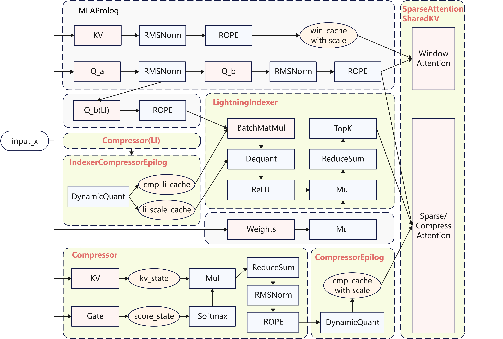
</p>


> LI部分Compressor结构与KV的Compressor结构相同，图中简化表示。

- Compressor：包含了KV/Gate的Linear计算和`kv_state`/`score_state`更新，并选取对应的数据（CSA场景存在Overlap）计算压缩KV并输出；
- KvCompressEpilog：包含对压缩后的压缩KV的量化、量化后压缩KV和其Scale的拼接，和刷新到KV Cache的操作；
- IndexerCompressEpilog：包含Indexer Cache的量化、刷新操作；
- LightningIndexer：包含了`score_batchmatmul`、`re_lu`、`reduce_sum`、`topk`等操作，长序列场景`topk`操作会成为瓶颈，可用`topk`计算耗时流水掩盖其他操作的耗时，从而拿到计算流水收益；
- SparseAttentionSharedKV：包含了Sparse Attention、Compress Attention和Window Attention的计算；
- mHC模块的融合算子由`hc_pre`和`hc_post`组成，其中`hc_pre`融合算子同步提供 AscendC、PyPTO 两种实现版本，融合范围如下图所示：

<p align="center">
  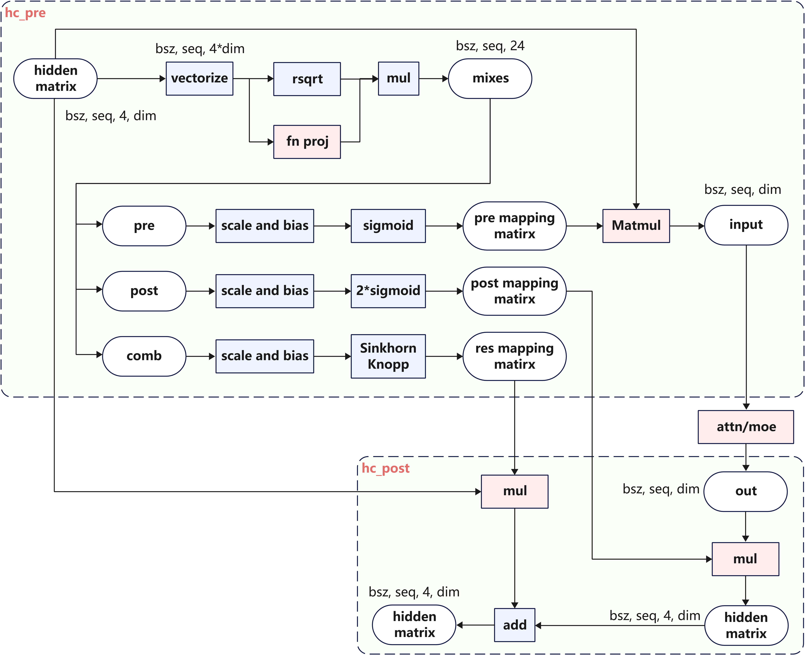
</p>

上述NPU融合Kernel均已开源，使用方式参见[ 融合Kernel执行指导 ](../../../ops/ascendc/README.md) 。

## 并行策略

针对Decode场景，在`950DT`平台下，可以采用8卡或16卡部署，获取极低单用户时延；在`Atlas-A3 Pod`平台采用64卡大EP部署，获得高吞吐性能收益。针对Prefill场景，在`950PR`平台下，采用8卡或16卡部署，针对长短序列可以分别选用DP或CP并行，提升TTFT。

### Prefill并行策略

DeepSeek-V4主要面向长序列推理场景，Prefill阶段的内存占用和TTFT会面临巨大挑战，因此优化内存占用和TTFT是并行策略设计的主要目的。如果采用Attention DP (Data Parallel) 策略，每个Rank都需要推理超长序列，总体计算量较大，TTFT较高，用户体验较差。因此，针对长序列场景，在Attention部分设计选用Context Parallel（CP）并行，通过多Rank分摊计算和访存开销，提升整体性能。

由于LI采用`causal_mask`，越往后的Context Chunk访存和计算量越大，在CP切分时，可以沿用之前Recipes在DeepSeek-3.2使用的`zig_zag`切分方式，将首尾的序列块放在同一Rank上，使得CP后各卡间的计算量相对均衡。

<p align="center">
  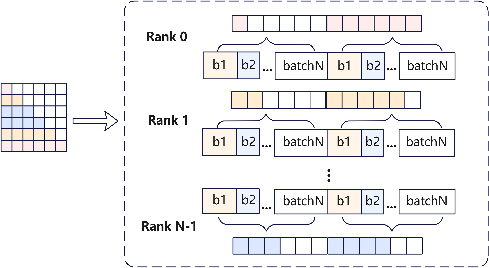
</p>


此外，在切分序列时，还需要考虑Attention模块采用的Window Attention和KV Cache压缩。
- SWA层计算时，每个Chunk需要获取到前序`win_size=128`长度的KV；
- 在HCA层中，可以通过切分使得前序Rank上的序列为128对齐，则无需传递额外的Token给后续`chunk`所在的Rank，同时除最后一个`chunk`以外，其余`chunk`不需要处理`remainder`；
- 在CSA层中，由于Compressor需要处理Token Overlap的信息，因此需要获取到前序4个Token来实现Overlap压缩；假设前序`chunk`的序列长度为128对齐，则除最后一个`chunk`所在的Rank外，无`remainder`。

因此在Attention模块执行时，需要从前序序列获取的最大Token长度为128（满足Window Cache），每个`chunk`向后续`chunk`传递128个Token。通过全局的`all_gather`通信算子，获取所有Rank最后的128个Tokens，并通过对应的`receive_idx`裁切出各`chunk`所需的数据。首个序列块`chunk_0`不需要获取额外的Token。

<p align="center">
  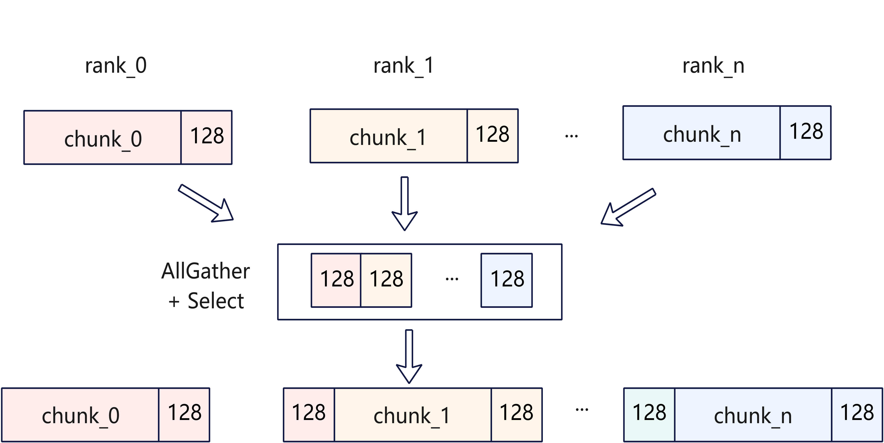
</p>

因此在Attention模块会引入2次通信：
- 在MQA模块起始做一次通信，通信128大小的`hidden_states`。此时MLAProlog的计算量会略有冗余，但实现较为简洁；
- 在Compressor计算后，由于Query已进行CP切分，需要对Compress Cache进行CP域的`all_gather`，获取到完整的压缩后的Cache，用于LI和SAS的计算。针对`zig_zag`场景，在`all_gather`后需要对Cache进行顺序重排。

    以CSA为例，实现如下图：

<p align="center">
  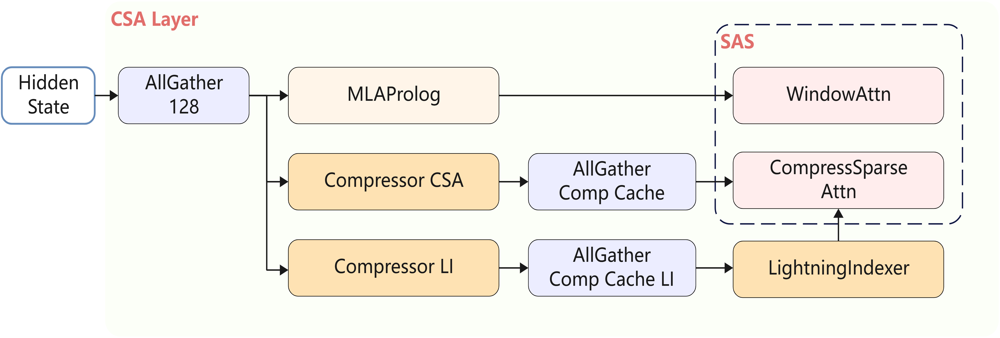
</p>

由于两个Compressor存在并行空间，同时CSA的Compressor仅需4个Overlap的Token信息，因此也可以将Window Attention和Compressor需要的数据分别进行通信，实现计算通信掩盖，冗余计算的数据量也较少。Compressor后同样需要对Compressed Cache做CP域的`all_gather`通信。以CSA为例，实现如下图：
<p align="center">
  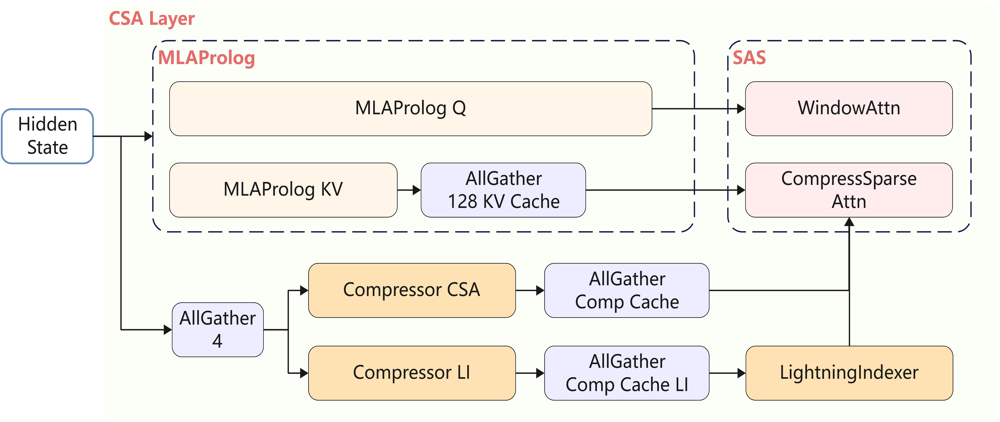
</p>


### Decode并行策略
在Decode阶段，并行策略参考DeepSeek-R1和DeepSeek-3.2的并行方案：
- Attention采用Data Parallel (DP) 并行；
- MoE采用Expert Parallel (EP) 并行；
- LM_head采用Tensor Parallel (TP) 并行；
- Attention后的Output Projection中`o_a_proj`的权重较大，访存耗时较长。在低时延场景可以选择性地采用TP切分，让多个Rank并行分担访存开销，并通过`all_to_all`和`reduce_scatter`通信算子实现DP和TP间的转换，如下图所示：

<p align="center">
  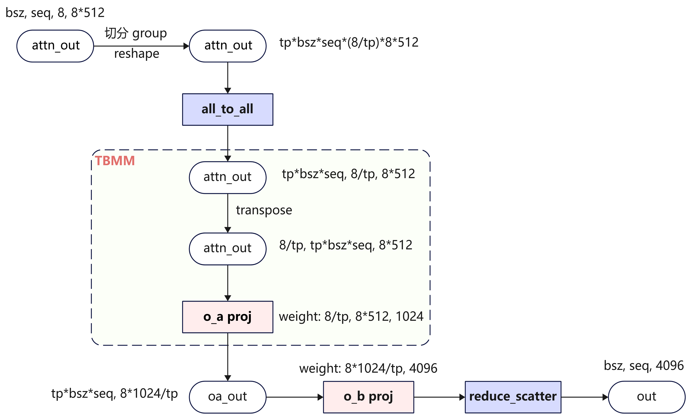
</p>


## MTP

DeepSeek-V4依然提供了原生的Multi-Token Prediction(MTP)机制，MTP机制允许在一次主模型推理过程中同时计算验证多个Token，在未达到计算瓶颈前，可以通过较少的时延增加，有机会获得更多的输出Token，从而降低单Token的推理耗时。DeepSeek-V4涉及的滑窗/压缩/稀疏Hybrid Attention算法复杂度较高，为适配MTP带来了新的挑战。

### Main Model方案

- Cache设计：本模型针对Window KV和Compressor模块的`kv_state`/`score_state`设计了Ring Buffer，可以通过`block_table`与`slot_mapping`实现对少数几块Cache的内存复用；其余KV Cache的内存按照压缩后的最大长度申请。

两种Cache管理方式的对比实现，如下图所示：

<p align="center">
  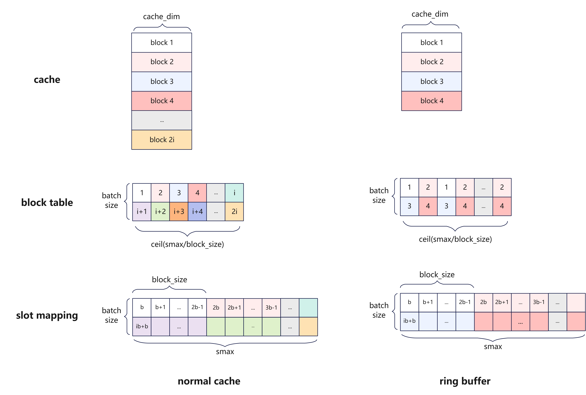
</p>

- MTP场景适配：假如主模型在Decode阶段每个Step每个Batch需要额外验证`next_n`个Token。在每个Step的推理过程中，算子正常在`kv_length`维度递进，如果满足CSA/HCA的压缩条件就进行压缩。这一场景需要沿用LI和SAS算子内置的梯形掩码，确保待验证Token的压缩Cache不参与主模型Token的计算。假如有MTP Token校验不被接受，需要在下一个Step重新推导该Token。重新推导的场景需要为Compressor的`kv_state`/`score_state`额外缓存。如下图所示，左侧是`kv_state`/`score_state`缓存范围，右侧是Indexer/Attention计算使用梯形掩码。
<p align="center">
  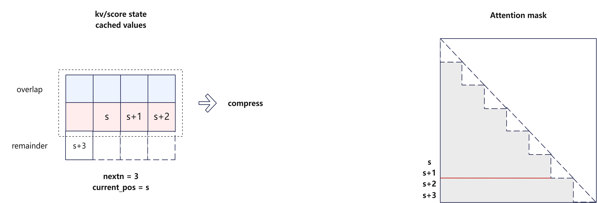
</p>

结合本模型的Ring Buffer设计，只需要提前申请更大的Buffer，就可以自然实现额外缓存的动作。需要缓存的Cache大小可以以`compress_ratio`个Token为一组进行统计，具体多少组Token的计算公式为
$$
\mathrm{num\_ratio\_group} = (1 \ \mathrm{if} \ \mathrm{next\_n}\  == 0 \ \mathrm{else}\ 2) + \mathrm{overlap}
$$

其中`overlap`在CSA等于1，在HCA等于0。`num_ratio_group`里预留了余数Token和可能需要重新压缩的前序Token。每个Batch需要的Cache Block个数为
$$
\mathrm{ceil}(\mathrm{num\_ratio\_group} * \mathrm{ratio} \ / \ \mathrm{block\_size})
$$

### MTP Spec Model方案

- 模型结构：MTP模型仅使用Window Attention (SWA)。
- Cache结构：在当前实现中，`next_n`个Draft Token共享一份MTP权重和KV Cache。

### 性能分析

MTP机制允许Decode在一次主模型推理过程中同时对小模型投机的`next_n`个Token批量Verify，在相似的数据搬运下，有机会能得到更多的预测Token，提高了Decode推理阶段的计算访存比；
- Attention部分：在MTP场景下，CSA的FA计算在极端情况下需要搬运的KV Cache数据量是非MTP场景的`next_n + 1`倍，一定程度上增加了离散访存代价。但是SWA/HCA/LI的Cache搬运量与非MTP场景几乎一致，能够自然地提升计算访存比。
- 其余算子，如Matmul等，在MTP机制下可以复用权重搬运，达到更好的计算访存比，因此MTP有比较可观的加速比。
- 在高吞吐场景下，使用多个Draft Token很容易触及计算瓶颈，因此可采用MTP1进行加速；在低时延场景下，计算密度更小，可采用MTP3获得更大加速比；


## 量化策略

### Int8量化策略

基于`Atlas-A3 Pod`平台，本实践支持了Int8 W8A8量化。相对于BF16推理，W8A8量化可以有效降低端到端时延，提升系统吞吐。量化策略如下：

<p align="center">
  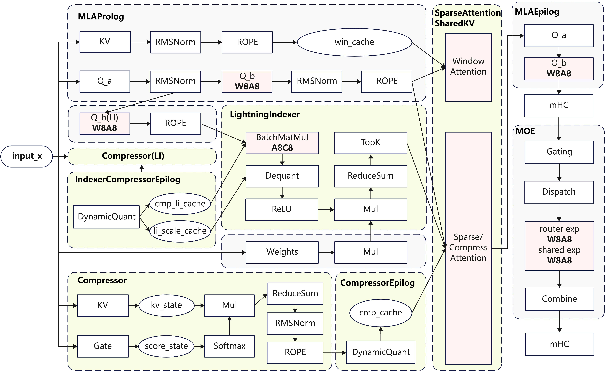
</p>

- MLAProlog：`q_b_proj`使用W8A8量化，其它Linear不量化；KV Cache使用C16；
- IndexerProlog：`q_b_proj`使用W8A8，`indexer_weight`不量化；`indexer_q`使用A8量化；Indexer Cache使用C8量化；
- LightningIndexer: `batch_matmul`使用Int8计算；
- Compressor: Linear不量化；
- MLAEpilog：`o_a_proj`不量化，`o_b_proj`使用W8A8量化；
- MoE：路由和共享专家的Linear使用W8A8量化；
- LMHead：不量化。

>注：
W8A8：W8指权重使用静态Per-Channel Int8量化，A8指数据使用动态Per-Token Int8量化；
A8C8：A8表示LI中的Q使用动态Per-Token-Head Int8量化，Indexer Cache使用动态Per-Token-Head Int8量化。

出于性能考虑，只对参数量较多的部分Linear模块进行量化。因此Linear模块里只对MLA的`q_b_proj`, `o_b_proj`和Indexer的`q_b_proj`进行量化，KV Cache暂时维持BF16存算。LI通过A8C8量化进一步降低计算时延，同步优化TTFT和TPOT。


### Hybrid MXFP8-MXFP4量化策略

基于`950PR/DT`平台，本实践支持了原生Hybrid FP8-MXFP4量化方式，同时也支持了使用MXFP8替换原生FP8格式的Linear模块，在Prefill和Decode高吞吐场景可以进一步提升算力利用率，提高整体性能。Hybrid MXFP8-MXFP4整体量化策略如下：

<p align="center">
  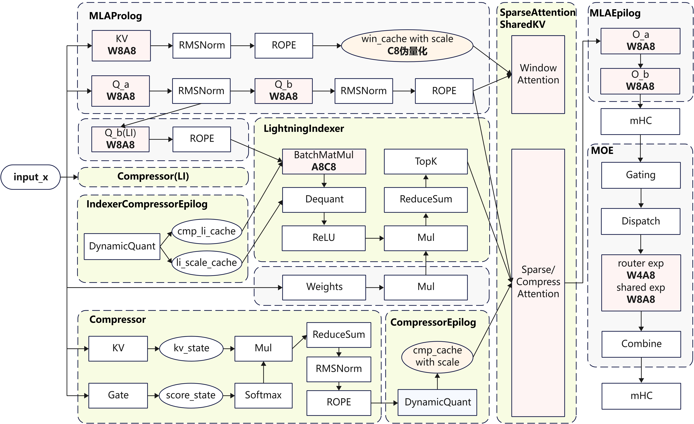
</p>

- MLAProlog：`q_a_proj`, `q_b_proj`, `kv_proj`使用W8A8量化；KV Cache采用C8伪量化；
- IndexerProlog：`q_b_proj`使用W8A8，`indexer_weight`不量化；`indexer_q`使用A8量化；Indexer Cache使用C8量化；
- LightningIndexer: `batch_matmul`使用FP8计算；
- Compressor: Linear不量化；
- MLAEpilog：`o_a_proj`和`o_b_proj`使用W8A8量化；
- MoE：路由专家的Linear使用W4A8量化，共享专家的Linear使用W8A8量化；
- LMHead：不量化。

> 注：
> W8A8：W8和A8指MXFP8量化；
> LI A8C8：A8表示LI中的Q使用动态Per-Token-Head FP8量化，Scale格式为FP32，Indexer Cache使用动态Per-Token-Head FP8量化，Scale格式为FP32；
> KV Cache C8：表示KV Cache使用动态Per-Group-64 FP8量化，Scale格式为E8M0。

MLAProlog KV Cache的量化策略使用了动态存8算16。在超长序列情况下，C8 KV Cache内存优化2倍。LI通过A8C8获取计算收益，降低LI计算时延，同步优化TTFT和TPOT。


## 多流并行优化

#### Attention多流并行
在Attention计算前的MLAProlog模块，Query的计算流与KV的计算流有计算并行的空间；在CSA时，LI与CSA Compressor无数据依赖，同样存在并行空间。因此，我们可以通过CANN软件栈提供的算子控核和多流并行技术，实现Attention模块的细粒度的计算流控制，提升推理性能。以CSA为例，可以实现如下方案：

<p align="center">
  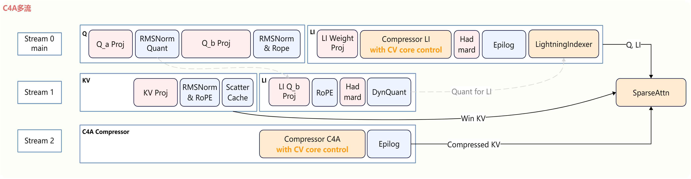
</p>

- MLAProlog中的`kv_proj`，`q_b_proj`等Matmul使用Cube核进行计算，与`q_rms_norm`等使用Vector核计算的算子，可以并行；
- `q_b_proj`后的`rms_norm`和`rope`可以和LI的`li_q_b_proj`并行计算；
- LI和CSA的Compressor模块，可以通过CV控核，确保算子分配到合适的Cube和Vector核数，在多流并行时减少计算资源抢占对性能的影响，从而完全掩盖CSA的Compressor；
- HCA中没有LI，可以直接用MLAProlog计算掩盖部分Compressor。
> 部分逻辑简化表示；算子框的长度不代表实际的执行耗时，仅作为图示。

#### MoE共享路由多流并行
在MoE模块中，共享专家和路由专家也存在计算与计算、计算与通信的并行机会，通过多流并行，可以在基本不影响路由专家的同时掩盖共享专家的计算耗时。本实践针对Int8和MXFP8量化场景实现了专家多流并行，可获得较大收益。实现如下图所示：
<p align="center">
  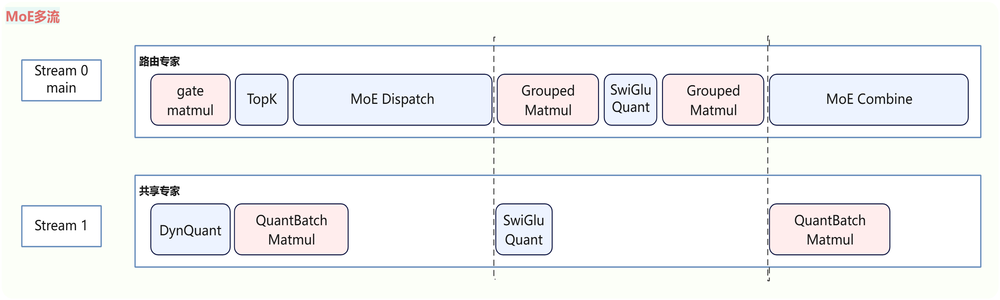
</p>


#### AICPU Scheduler算子多流并行
Attention及LI这类算子在计算时依赖实际上下文长度，本次实践中提供了对应的AICPU Scheduler算子，可以在算子执行前计算出分核策略，减少算子执行负担，提升性能。
以SparseAttnSharedkv为例，提供如下接口：
- npu\_sparse\_attn\_sharedkv\_metadata：根据`cu_seqlens_q`、`seqused_kv`、`cmp_ratio`等算子入参得到包含关键负载均衡信息的Tiling；
- npu\_sparse\_attn\_sharedkv：根据`npu_sparse_attn_sharedkv_metadata`输出的tiling信息，执行Attention计算；

整网单轮推理中，每个SAS（SWA, CSA, HCA）, LI算子依赖的AICPU Scheduler算子只需要执行一次，Tiling信息可在不同层的算子间复用。因此，Tiling计算与Embedding及MLAProlog计算存在并行机会，通过多流并行，可以有效掩盖Tiling计算的耗时。以SWA为例，参考伪代码如下：

```python
# prepare metadata
metadata_stream = torch.npu.Stream()
event_0, event_1 = torch.npu.Event(), torch.npu.Event()
input_tensor.record_stream(metadata_stream)
event_0.record()
with torch.npu.stream(metadata_stream):
    event_0.wait()
    attn_metadata = torch.ops.custom.npu_sparse_attn_sharedkv_metadata(input_tensor, ..., cmp_ratio=1)
    event_1.record()

# input embedding calculation (skip details)

for layer in model_layers:
    # attention forward
    event_1.wait()
    attn_output = torch.ops.custom.npu_sparse_attn_sharedkv(input_tensor, ..., metadata=attn_metadata)

    # moe forward (skip details)

```

整网单轮推理需要调用4次AICPU Scheduler算子，其多流并行方案图如下。
<p align="center">
  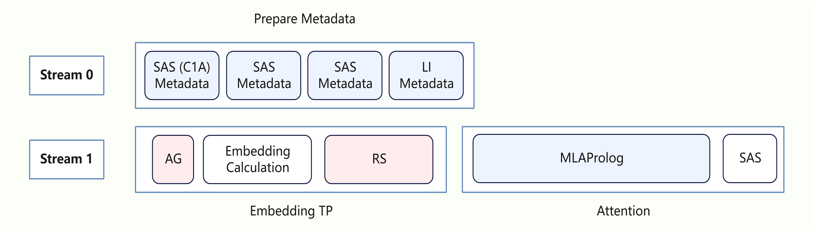
</p>

## Benchmark

下述Benchmark数据均基于Offine推理模式采集，不包含Serving调度和框架负载均衡影响。

#### 950DT

[profile_data](https://cann-ai.obs.cn-north-4.myhuaweicloud.com/cann-quantization/DeepSeek/profile_data/trace_view_950DT_decode.json)

在`950DT`平台上，本实践使用16卡部署W8A8C8模型，部署策略采用 Attention Data Parallel (DP) 和 MoE Expert Parallel (EP)并行。DeepSeek-V4 Flash 8K序列场景Decode单卡吞吐1625TPS@10ms，对应的Profile数据已在上方链接开源，不同Batch Size和序列长度的性能Benchmark测试如下：

**950DT Deepseek-V4 Flash Benchmark**

| Global Batch Size | Chips | MTP | DataType | Seq Length | TPOT (ms) | Throughput (Tokens/p/s) |
| ----------------- | ---------|----------  | ----- | ----------------- | ----------------- |----------------- |
| 16   | 16  | 3   | Hybrid MXFP8-MXFP4    | 8192     | 6.71      | 148.96  |
| 256  | 16  | 3   | Hybrid MXFP8-MXFP4    | 8192     | 9.84      | 1625.31 |
| 1536 | 16  | 1   | Hybrid MXFP8-MXFP4    | 8192     | 20.33     | 4722.22 |
| 16   | 16  | 3   | Hybrid MXFP8-MXFP4    | 131072   | 7.80      | 128.15  |
| 256  | 16  | 3   | Hybrid FP8-MXFP4      | 8192     | 11.06     | 1447.00 |
| 1536 | 16  | 1   | Hybrid FP8-MXFP4      | 8192     | 24.28     | 3953.49 |

DeepSeek-V4 Pro 8K序列场景Decode单卡吞吐c，不同Batch Size和序列长度的性能Benchmark测试如下：

**950DT Deepseek-V4 Pro Benchmark**

| Global Batch Size | Chips | MTP | DataType | Seq Length | TPOT (ms) | Throughput (Tokens/p/s) |
| ----------------- | ---------|----------  | ----- | ----------------- | ----------------- |----------------- |
| 16   | 16  | 3   | Hybrid MXFP8-MXFP4    | 8192     | 17.64      | 56.7  |
| 64   | 16  | 3   | Hybrid MXFP8-MXFP4    | 8192     | 19.03      | 210.16 |
| 128  | 16  | 3   | Hybrid MXFP8-MXFP4    | 8192     | 20.61      | 388.23 |

> 注：Global Batch Size为16及256的性能数据基于MTP3与强制EPLB配置采集，平均3个Draft Token中Accepted Token个数为1.44。Global Batch Size为1536的性能数据基于MTP1与强制EPLB配置采集，平均1个Draft Token中Accepted Token个数为0.7，用户可按照数据集实际接受率自行折算benchmark性能。

> 注：Hybrid FP8-MXFP4指转换后的权重中部分Matmul FP8量化 + MoE模块MXFP4量化；Hybrid MXFP8-MXFP4指转换后的权重中部分Matmul MXFP8量化 + MoE模块MXFP4量化，详情见[量化策略](#量化策略)。

#### Atlas-A3 Pod

[profile_data](https://cann-ai.obs.cn-north-4.myhuaweicloud.com/cann-quantization/DeepSeek/profile_data/trace_view_a3_decode.json)

在`Atlas-A3 Pod`平台上，本实践使用64卡部署W8A8C16模型，部署策略采用Attention Data Parallel (DP)和MoE Expert Parallel (EP)并行。DeepSeek-V4 Flash 8K序列场景Decode单卡吞吐可达4388TPS@30ms，对应的Profile数据已在上方链接开源，不同场景的性能Benchmark测试如下：

**Atlas-A3 Pod Deepseek-V4 Flash Benchmark**

| Global Batch Size | Chips | MTP  | Seq Length | TPOT (ms) | Throughput (Tokens/p/s) |
| ----------------- | ----- | ---- | ---------- | --------- | ----------------------- |
| 7168              | 64    | 1    | 8192       | 27.82     | 4025                    |
| 8192              | 64    | 1    | 8192       | 29.17     | 4388                    |

> 注：LI Cache使用Int8量化，KV Cache使用BF16计算。性能数据基于MTP1与强制EPLB配置采集，平均1个Draft Token中Accepted Token个数为0.7，用户可按照数据集实际接受率自行折算benchmark性能。

## Future Plan

- **Atlas A3 DeepSeek-V4 Pro模型支持**：在`Atlas`平台，泛化支持DeepSeek-V4 Pro模型；
- **量化**：在`950PR/DT`平台，将进一步支持HiFloat8量化方式，丰富量化形态；
- **SuperKernel**：使能Super Kernel进一步降低算子启动开销与调度间隙，提升计算执行效率；
- **融合Kernel性能优化**：通过Flash Decode等技术，优化长序列场景下的LI/SAS性能。
