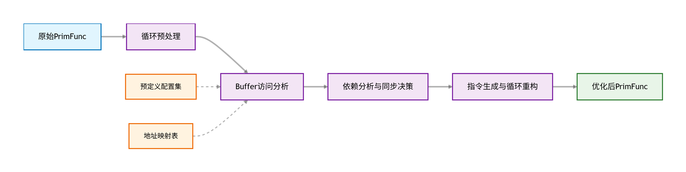
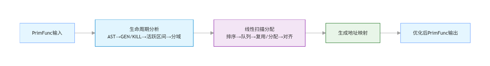
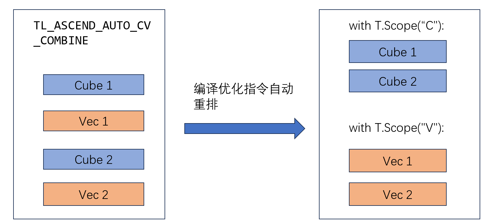
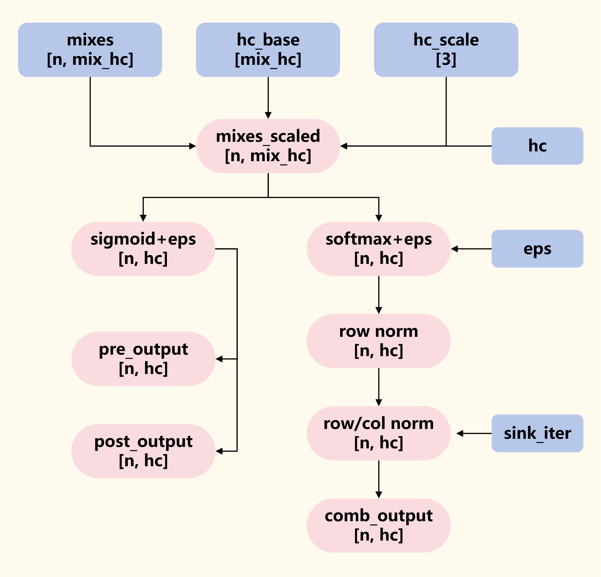
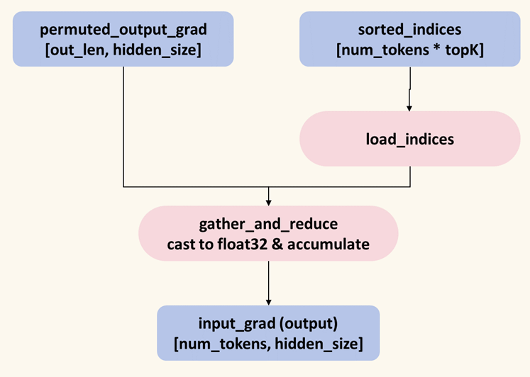
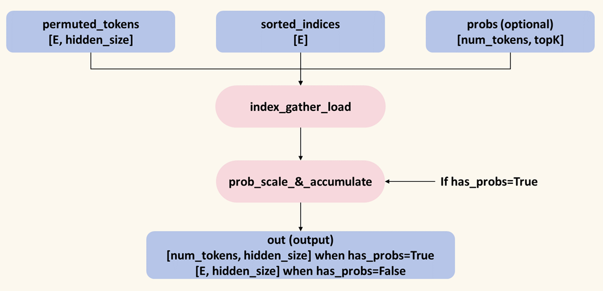
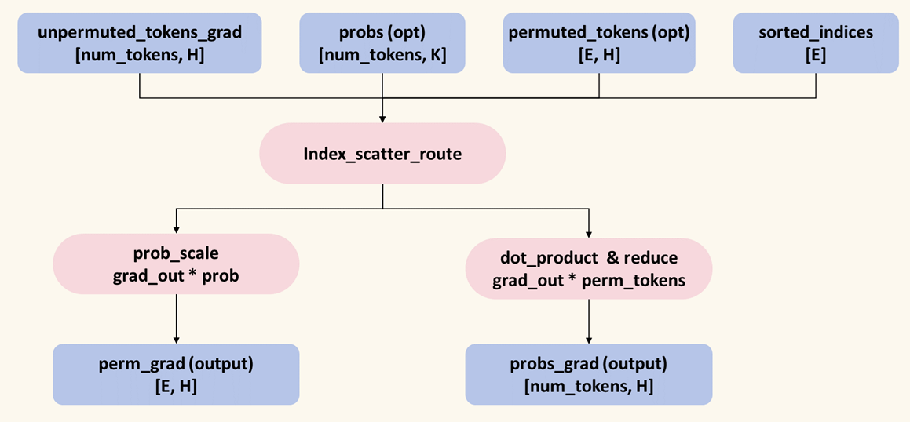
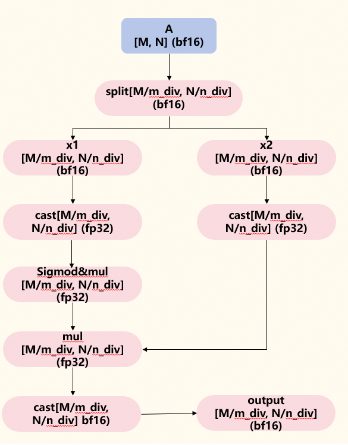
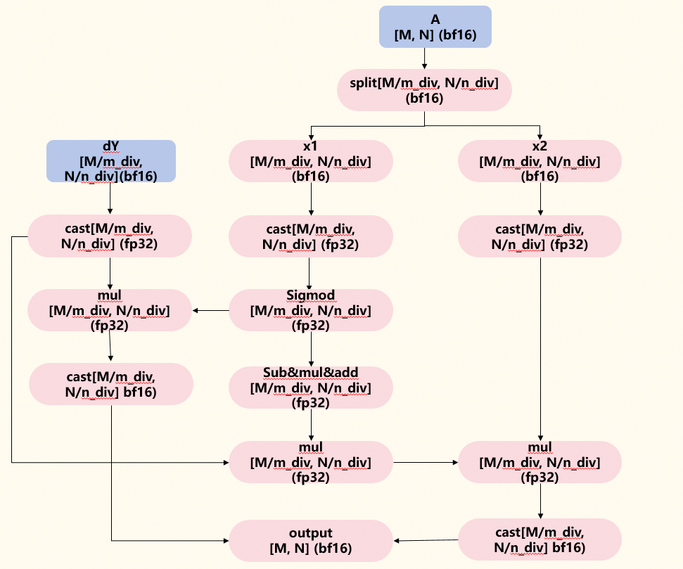

# NPU DeepSeek-V4 TileLang算子开发实践
## 简介

在大模型异构计算发展背景下，GPU 端成熟模型及新算子向昇腾 NPU 的跨平台迁移，Tilelang-Ascend 作为昇腾 CANN 生态原生算子开发框架，深度契合昇腾 NPU 硬件架构特性，采用声明式编程范式大幅降低开发门槛。框架内置丰富硬件原语与性能优化策略，可充分释放 NPU 算力，同时具备极强的新算子快速适配能力，支持 GPU 算子逻辑高效迁移重构，无需深入底层硬件细节即可完成算子开发优化，显著缩短迁移周期。[Tilelang-Ascend代码仓](https://github.com/tile-ai/tilelang-ascend)，助力开发者快速开展昇腾平台算子开发工作。同时在此工作中，我们也覆盖了 [TileKernels](https://github.com/deepseek-ai/TileKernels) 中的mhc算子。


## HighLights

Tilelang-Ascend具有适配大模型开发的显著优势。

在开发易用性方面，Tilelang-Ascend致力于实现语法简洁、思路清晰的编程模式，用简单代码实现高性能复杂算子：

- **易用性强。**高性能、低开发门槛，开发者可以专注于算法逻辑，忽略底层同步、内存等细节。
- **后端语言灵活。**灵活后端语言切换，既有稳定的AscendC编程路径，也有跨代际兼容的高性能PTO编程路径，能够自动适配不同层级、硬件场景。
- **算子快速开发。**Tilelang-Ascend用极短的时间实现了DeepSeek新模型中SFA/MHC等复杂融合算子，开发者可以快速利用Tilelang抽象建立算子模型，并且有多种优化路径可选。

在功能支撑方面，Tilelang-Ascend同样以提升框架便捷性和高效性为核心，Developer模式的框架新特性包含了以下新功能：

- **自动流水同步。**CV 核间由硬件流水自动同步，Tilelang-Ascend 自动化分析生成精准同步指令，保障算子执行正确与高效。
- **自动内存复用。**Tilelang-Ascend 自动完成内存规划与复用，分析生命周期并线性扫描分配，提升 NPU 内存利用率与执行效率。
- **自动拆分跨核指令。**Tilelang-Ascend 编译器自动识别 CV 核操作，支持指令混合编写，自动完成同步调度与依赖管理。
- **流水并行语法糖。**T.Pipelined特性在编译时静态分析与代码转换，实现计算与内存的重叠执行，最大化硬件利用率，显著提升计算密集任务的执行性能。
- **数据并行语法糖。**T.Parallel特性用直观语法表达Tile元素向量化计算并实现数据并行，不暴露底层硬件细节，提升编程体验与效率。


## Tilelang-Ascend框架特性介绍

Tilelang-Ascend持续致力于在提升开发易用性、降低开发难度和代码量上努力。本次框架升级支持了Developer特性开发模式，包括硬件流水自动同步（核间与核内同步）、内存地址自动复用、自动拆分CV指令，及T.Parallel等核心原语操作，从底层简化算子开发流程。原需手动实现的核间同步、内存规划、算力分配等复杂操作，均由原语自动完成，开发者无需深入硬件底层细节，大幅降低对硬件认知的门槛。同时T.Parallel、T.Pipelined原语高效支撑并行计算开发，从算力调度到资源复用全流程自动化，显著降低开发难度、减少代码量，让开发者聚焦核心算法设计，提升算子开发效率与落地速度。

#### 1、硬件流水自动同步

昇腾NPU芯片集成的Cube、Vector等计算单元是异步执行的，CV核间同步通过硬件流水自动对齐各核执行节拍，避免手动栅栏与等待；核内同步由原语在指令级插入依赖与顺序控制，确保数据就绪与访存一致。开发者只需声明并行与流水边界，即可在多核协同与单核流水间获得稳定、高效的执行。

Tilelang-Ascend通过自动化分析**实现同步指令的精准生成，兼顾算子执行的正确性与运行性能**。下图介绍了硬件流水自动同步插入的实现逻辑：

<p align="center">
  
  <center>硬件流水自动同步流程图</center>
</p>

- **循环与处理**：通过将for循环递归展开两份，准确分析嵌套循环中的依赖关系。

- **Buffer访问分析**：结合预定义配置集合，确定指令操作所属的硬件流水线，并解析对Buffer的读写操作。

- **依赖分析与同步决策**：识别数据依赖并根据硬件特性决策同步插入的类型，并通过同步图剔除冗余指令。
  - 识别 RAW（写后读）、WAW（写后写）、WAR（读后写）三类数据依赖。
  - 根据依赖关系和硬件特性，决策同步类型：同流水线用PipeBarrier，跨流水线用EventPair（SetFlag/WaitFlag）。

- **指令生成与循环重构**：展开后的循环进行重构，得到原始嵌套结构并生成指令代码。

**硬件流水自动同步开启方式**：

```python
pass_configs = {
    tilelang.PassConfigKey.TL_ASCEND_AUTO_CV_SYNC: True, # CV核间流水自动同步
    tilelang.PassConfigKey.TL_ASCEND_AUTO_SYNC: True,    # 核内流水自动同步
}
```


#### 2、内存规划与复用

内存规划与复用由框架自动完成，开发者无需手动分配与回收。传统的手动规划内存与手动复用存在很多挑战，开发效率低下，需要人工计算每个层级的偏移量，且算子迭代成本高；并且开发过程中容易出错、难以调试。Tilelang-Ascend根据算子依赖关系与生命周期分析，**智能布局缓冲区与中间张量，减少碎片与冗余拷贝**；同时**通过地址复用与双缓冲策略，在保持数据一致性的前提下复用空闲内存，显著降低峰值占用**。配合流水并行与算力调度，内存访问更连贯，整体带宽利用率与执行效率同步提升。

下图展示了内存自动规划与复用的实现逻辑：

<p align="center">
  
  <center>内存规划与复用流程图</center>
</p>

Tilelang-Ascend通过Developer模式带来了内存规划与复用特性，它完全替代人工 Offset 计算，开发效率显著提升，维度 / 类型变更无需手动适配。自动规避地址重叠、对齐错误，消除内存超限 / 执行异常的人为因素。自动考虑内存复用降低总占用率 ，最大化利用昇腾 NPU 有限的共享内存资源。该特性 是面向昇腾NPU的核心内存优化组件，通过精准的缓冲区生命周期分析与高效的线性扫描内存分配算法，为每个buffer分配内存空间，提高昇腾NPU内存利用率。

- **缓存区生命周期分析**：
  - 遍历 TIR 抽象语法树（AST），全量采集昇腾 NPU 共享内存缓冲区的访问行为。
  - 标记每个缓冲区的 GEN（生成）/KILL（销毁）事件，精准界定其活跃区间 [start, end]（首次使用→最后一次使用的执行阶段）。
  - 按昇腾硬件内存域分组缓冲区，适配不同分区的内存上限约束。
- **线性扫描分配算法**：
  - 按活跃区间起始位置排序缓冲区，构建线性执行序列。
  - 维护活跃队列与空闲内存块池，循环处理每个缓冲区的分配需求。
  - 智能分配策略：优先复用已释放的空闲内存块，无可用块时分配新内存，所有操作遵循 32 字节硬件对齐规则。
  - 最终生成缓冲区到物理地址 Offset 的映射表（address_map），固化到函数属性指导执行。

**内存自动规划与复用开启方式**：

```python
pass_configs = {
    tilelang.PassConfigKey.TL_ASCEND_MEMORY_PLANNING: True, # 内存自动规划与复用
}
```


#### 3、自动拆分CV指令

在昇腾NPU编程中，开发者面临着一种非自然的编程约束。由于硬件架构的CV分离特性，开发者必须在代码中明确标注每段代码属于Cube还是Vector单元。这种显式作用域声明方式会带来开发困扰：开发的割裂性破坏了代码的连贯性；CV频繁切换导致代码和开发逻辑破碎；同时会导致代码结构重复、调试跳跃性强，定位问题困难。例如在Flash Attention融合算子中，Vector核上的Softmax计算和Cube核上的矩阵乘计算会有多次复用同步的逻辑，人工拆分对开发者并不友好。

为了解决这些问题，CV代码分离优化Pass应运而生。它的核心理念是：让开发者专注于算法逻辑，让编译器处理硬件适配。**开发者按算法逻辑自然编写代码，Pass自动识别哪些操作属于Cube，哪些属于Vector**。

<p align="center">
  
  <center>CV指令自动拆分示意图</center>
</p>

如上图所示，Tilelang-Ascend的Developer模式允许用户忽略底层CV核的指令和硬件差异，编写符合正常算法逻辑的代码。

CV自动同步在编译期构建Cube/Vector依赖图，识别跨核读写与数据就绪点，自动插入同步指令与等待机制，并进行流水重排与双缓冲优化，保证核间数据一致与顺序正确。开发者仅需描述算法，编译器即可完成核间调度与核内依赖管理，减少手工拆分与同步代码。

**自动拆分CV指令开启方式**：

```python
pass_configs = {
    tilelang.PassConfigKey.TL_ASCEND_AUTO_CV_COMBINE: True, # 自动拆分CV指令
}
```


#### 4、T.Parallel

Tilelang-Ascend编程模型中，T.Parallel是用于表达 tile 内元素向量化计算 的核心原语。它在 IR 层以“并行循环”的形式描述数据并行，而不直接暴露底层硬件指令细节，可以**让用户用符合编程思维的逐元素编程语法，实现硬件层面Tile级的高性能并行操作**，极大的提升用户的算子编程体验。

目前支持的双目运算符、支持的单目运算符、多运算场景、1D / 2D 场景、双目“向量 + 标量”场景、行切分场景、Buffer + 标量广播运算、拷贝场景。

**代码使用方式示例：**

- **运算操作**：

```python
# 一维运算场景
for i in T.Parallel(v_block):
    m_i[i] = T.max(m_i[i], m_i_prev[i])
```

```python
# 二维运算场景
for (i, j) in T.Parallel(v_block, d):
	acc_o_ub[i, j] /= T.exp(attn_sink_ub[i] - scores_max[i])
```

- **拷贝操作**：

``` python
# GM -> UB 拷贝&计算场景
for i, j in T.Parallel(block_M // VEC_NUM, block_N):
	C[bx * block_M + vid * block_M // VEC_NUM + i, by * block_N + j] = T.exp(a_ub[i, j])
```


## 主要算子实现

本章介绍DeepSeek-V4 0Day支持中Tilelang-Ascend实现的四个算子用例。

### Tilelang算子优势

多个融合算子已经成功适配并接入DeepSeek模型，Tilelang-Ascend在精细化Tile编程中具有语法简洁、先天适配NPU多级存储模型的优势，开发者可以快速简洁地开发Tilelang算子，结合上述Developer模式新特性，在保持相近性能的前提下，代码量可降低至原后端实现的约20%，开发者能用简短的代码实现高性能的复杂算子。

### 1、Sparse Flash Attention

#### **概述**

SparseFlashAttention算子的整体计算流程如下图所示：

<p align="center">
  
  <center>SparseFlashAttention计算流程图</center>
</p>

在DeepSeek-V4模型中，随着上下文长度不断变大，面对超长序列，注意力机制成为模型中的主要计算瓶颈。为了高效计算注意力，SFA（Sparse Flash Attention）在保留原有稀疏索引筛选功能的基础上，改进计算流程并接入了C4A（Compress-4-Attention）和C128A（Compress-128-Attention）稀疏注意力压缩架构，显著降低了长文本场景中注意力的计算成本。新版的SFA算子还引入了可学习注意力锚点（Attention sink）机制，通过调整每个查询头的注意力分数，保护模型输出序列的稳定性。

#### 算法流程详解

从NPU的块级执行视角，结合具体维度阐述实现细节。输入输出张量以典型维度为例：

- **query**: [b, m, h, d]，查询向量集合。
- **key/value**: [b, n, d]，键值向量集合。
- **topk_idxs**: [b, m, k]，topk索引向量。
- **attn_sink**: [h]，attn sink注意力锚点向量。
- **output**: [b, m, h, d]，注意力权重输出向量。

**计算流程：**

##### 1、查询块加载

- **数据并行策略：**将batch和m（序列长度）作为核间并行切分维度，分核执行；设置C:V核1:2比例，以`[head // 2, block=64]`为基础块大小细粒度核内切分张量并行执行。
- **数据切分细节：**按照核间并行-核内切分的双重并行策略进行。
  - 以batch*m为逻辑核core_id数，在AiCores上均匀分配任务。
  - 主块大小为dim=512（`Shape -> [32, 512]`），核内切分块大小为block=64（`Shape -> [32, 64]`）。


##### 2、稀疏键值索引构建掩码块

- **索引驱动加载**：根据mask规则，对基本块中每个数据的位置，利用topk_idxs张量筛选计算得到key/value关联的idxs_ub索引张量：

  - `for i in T.serial(block):`

    `idxs_ub[i] = topk_idxs[by, bx, t * block + i] if t * block + i < topk else -1`

- **构建掩码块**：根据idxs_ub索引张量，筛选参与注意力计算的key值(kv_ub)，并构建存储注意力分数计算结果的掩码矩阵(acc_s_ub)。


##### 3、注意力分数计算

- **矩阵乘：**在Cube核上使用gemm_v0接口计算注意力分数矩阵乘结果，累加存储到L0C buffer上，计算逻辑为：
  - `attn_tile = query @ key.T  Shape -> [64, 64]`

- **注意力掩码累加：**将掩码矩阵累加到矩阵乘的注意力分数结果上，得到掩码后的注意力分数值，并与缩放scale相乘。


##### 4、Online Softmax

- 在注意力分数结果上分块执行在线softmax。

- **数据并行：**利用Tilelang框架新特性T.Parallel，用逐元素计算代码表达Tile块级数据并行计算：

  - `for (i, j) in T.parallel(v_block, block):`

    ​	`acc_s_ub[i, j] -= scores_max[i]`

- 计算过程中通过规约动态维护最大值(score_max)和指数和(score_sum)中间统计量，确保数值稳定性。


##### 5、上下文向量计算

- 完成计算图中注意力权重与value的矩阵乘:
  - `attn_tile = score @ value  Shape -> [64, 512]`


##### 6、结果累加与重缩放

- **结果累加：**以block=64的基本Tile块进行循环，累加计算结果到acc_o_ub buffer中。
- **在线重缩放**：循环结束后，利用在线Softmax维护的统计量(score_max, score_sum)，通过向量化操作对累加结果进行全局重缩放，校正分块计算引入的偏差。


##### **7、注意力锚点计算**

- **attn sink注意力锚点：**对累加结果进行attn sink锚点运算，保留前s个token的注意力权重和KV缓存，使输出保留全局上下文，避免结果仅依赖近期token，导致语义陷入局部陷阱或缺失:

  - `for (i, j) in T.Parallel(v_block, d):`

    ​	`acc_o_ub[i, j] /= T.exp(attn_sink_ub[i] - scores_max[i])`


##### 8、结果写回

- **结果保存：**经过缩放与锚点处理的注意力权重结果按块写回全局内存中。


### 2、Manifold-Constrained Hyper-Connections

#### **概述**

Manifold-Constrained Hyper-Connections算子的整体计算流程如下图所示：

<p align="center">
  
  <center>Manifold-Constrained Hyper-Connections计算流程图</center>
</p>

Manifold-Constrained Hyper-Connections（Mhc）是一种通用残差架构优化方案，融合了流形约束+结构化映射技术，Mhc算子主要包含三类可学习映射：预变换映射pre、后变换映射post和跨流连接映射comb，其将超连接（HC）的多路残差跨流映射约束在双随机矩阵流形上，保留多流表达能力的同时恢复恒等映射特性，解决大规模训练的数值不稳定与信号失控问题。

#### 算法流程详解

算子输入输出典型维度张量分析：

- **mixes**: [n, mix_hc]，多流特征输入张量。
- **hc_scale**: [3]，流级缩放系数向量。
- **hc_base**: [mix_hc]，跨流映射初始矩阵向量。
- **hc**: 超参数，流的数量。
- **sinkhorn_iters**: 超参数，Sinkhorn-Knopp的迭代次数。
- **eps**: 超参数，数值稳定epsilon。
- **pre**: [n, hc]，mixes流级缩放预变换输出张量。
- **post**: [n, hc]，残差融合特征流级缩放的后变换输出张量。
- **comb**: [n, hc]，跨流连接映射输出张量。

**计算流程：**

##### 1、多流特征缩放

- **缩放值计算：**首先根据流级缩放系数向量及流的数量，构建每条流向量对应的缩放值hc_scale_shared。
- **计算缩放多流特征：**按基本块大小，将多流特征乘以缩放值后与跨流初始矩阵相加得到：
  - `mixes_shared = mixes_shared * hc_scale_shared + hc_base_shared`


##### 2、计算预变换张量

- 预变换张量控制每条流的输入强度。

- 根据多流特征缩放值，通过Sigmoid缩放+流级参数融合计算预变换张量结果，按基本块Tile，通过乘以scale值控制每条流的输入维度，用 sigmoid 约束结果在稳定区间，然后加eps防止出现零值，计算流程如下：
  - `pre = mixes ⊙ sigmoid(scale) + eps`


##### 3、计算后变换张量

- 后变换张量控制每条流的输出幅度。
- 与预变换处理流程类似，经过Sigmoid缩放+流级参数融合后，后处理张量会乘以2，以适当扩大输出维度：
  - `post= (mixes ⊙ sigmoid(scale)) * 2`


##### 4、指数归一化

- 按基本块读取跨流融合张量comb，即上述经过缩放的多流特征张量，准备计算跨流映射矩阵的双随机投影。
- 通过reduce、sub、exp等运算接口对每个基本块实现softmax指数归一化运算逻辑，同样累加eps避免产生零值，实现特征输出的范围稳定：
  - `comb = comb.softmax(-1) + eps`


##### 5、行列归一化

- **行归一化：**对经过指数归一化的comb基本块首先在行方向做整体归一化：

  - `comb = comb / (comb.sum(-2) + eps)`

- **迭代行列归一化：**基于Sinkhorn-Knopp算法，按基本块对comb执行总共sink_iter次行列归一化：

  - `for i in range(sink_iter):`

    ​	`comb = comb / (comb.sum(-1) + eps)`

    ​	`comb = comb / (comb.sum(-2) + eps)`

- 最终得到归一化后的comb跨流连接映射输出张量。


##### 6、结果写回

- **结果保存：**将跨流连接映射输出张量结果按块写回全局内存中。


### 3、Int8 General Matrix Multiplication

#### **概述**

Int8 General Matrix Multiplication算子的整体计算流程如下图所示：

<p align="center">
  
  <center>Int8 General Matrix Multiplication计算流程图</center>
</p>

Int8_gemm（Int8 General Matrix Multiplication）是带有量化激活输入值的MatMul算子，将int8类型的输入值的矩阵乘结果反量化为fp32，经过缩放因子缩放后，再次量化到目标数据类型，并保存输出结果。

#### 算法流程详解

算子输入输出典型维度张量分析：

- **a_int8**: [M, K]，int8激活值向量。
- **a_scales**: [M, 1]，激活值缩放因子。
- **b_int8**: [N, K]，int8权重向量。
- **b_scales**: [N, 1]，权重缩放因子。
- **output**: [M, N]，量化gemm输出向量。

**计算流程：**

##### 1、int8矩阵乘法

- **矩阵乘：**分块读入并使用gemm_v0接口计算矩阵乘结果，输入值为int8类型，存储中间结果为int32类型:
  - `C_tile = A_tile @ B_tile.T  Shape -> [64, 64]`
- **运算结果传递：**利用GM workspace将运算结果写入c_ub buffer中。


##### 2、数据类型转换

- **int32->fp32转换：**利用cast接口执行数据类型转换：
  - `T.tile.cast(c_scale, c_ub)  Type: int32 -> float32`


##### 3、反量化缩放

- **加载缩放因子：**将激活值和权重缩放因子按基本分块大小拷贝至ub buffer。

- **转换数据缩放：**将转换后的数据与缩放因子相乘，同样从Tile层级数据并行计算：

  - `for (i, j) in T.Parallel(block_M_2, block_N):`

    ​	`c_scale[i, j] *= scale_a_ub[i]`

    ​	`c_scale[i, j] *= scale_b_ub[j]`


##### 4、结果转换与写回

- 类型转换：再次通过cast将缩放结果转换为目标输出数据类型（以fp16为例）:
  - `T.tile.cast(c_out, c_scale)  Type: float32-> float16`
- **结果保存：**经过类型转换与反量化缩放的结果按块写回全局内存中。


### 4、Activation Quantization

#### **概述**

Activation Quantization算子的整体计算流程如下图所示：

<p align="center">
  
  <center>Activation Quantization计算流程图</center>
</p>

Act_quant（Activation Quantization）是处理激活量化的算子，负责将模型前向推理时动态生成的激活值从高精度（FP32/FP16）转换为低精度（INT8/INT4），主要在模型反向传播或推理后完成量化。

#### 算法流程详解

算子输入输出典型维度张量分析：

- **x_bf16**: [M, N] / [batch, seq, N]，待处理输入张量。
- **round_scale**: False，bool值，是否对缩放因子取整为2的幂次。

**计算流程：**

##### 1、最大值计算

- **数据预处理：**首先把读入的数据转换为fp32类型，然后求取其绝对值数据。
- **最大值：**对列方向进行最大值规约得到输入数据每列的最大值，并存储到max_ub buffer中。


##### 2、计算缩放因子

- 使用每列计算出的最大值除以int8类型的最大值127，根据round_scale判断是否取整为2的幂次，然后得到每个元素的缩放因子：

  - `for i in T.Parallel(block_M_2):`

    ​	`scale_ub[i] = max_ub[i] / int8_abs_max`


##### 3、int8对称量化

- **数据缩放：**将第一步处理的数据除以缩放因子，并通过clamp接口将数据限制在[-127, 127]范围内。
- **对称量化：**将上述数据四舍五入取整，然后先后量化为fp16和int8类型，得到量化输出结果。
- 整体计算流程可概括为：
  - `y = round(clamp(x / scale, -127, 127)).to(float16).to(int8)`


##### 4、结果写回

- 将结算得到的缩放因子向量scale_ub和量化激活值y_ub写回全局内存中。

## 训练算子实现

本章介绍DeepSeek-V3.2 中Tilelang-Ascend实现的8个训练算子。模型训练请参考：[链接](https://gitcode.com/cann/cann-recipes-train/blob/master/docs/llm_pretrain/deepseekv32_pre_train_optimization.md)，Tilelang算子替换请参考：[链接](https://gitcode.com/cann/torchtitan-npu/blob/master/docs/feature_guides/tilelang_ops.md)。

### 1、Rotary Position Embedding

#### **概述**

RoPE（Rotary Position Embedding）是一种位置编码算子，用于大模型中的旋转位置嵌入计算。与传统的绝对位置编码不同，RoPE通过旋转向量的方式将位置信息融入注意力机制，能够更好地捕捉相对位置关系。该算子支持前向和反向传播计算，适用于模型训练和推理场景。

Rotary Position Embedding算子的整体计算流程如下图所示：


<center>Rotary Position Embedding计算流程图</center>


#### 算法流程详解

算子输入输出典型维度张量分析：

- **x**: [M, hidden_size] 或 [B, S, N, D]，输入张量。
- **sin**: [sc_rows, rope_dim]，旋转正弦角度向量。
- **cos**: [sc_rows, rope_dim]，旋转余弦角度向量。
- **mask**: [row_per_vec, rope_dim]，旋转索引掩码向量。
- **output**: 与输入同形状，旋转位置编码输出张量。

**计算流程：**

##### 1、数据加载与预处理

- **分块加载：**按block_M大小将输入数据分块加载至UB buffer，其中block_M默认为64（float16/bfloat16）或32（float32）。
- **Partial RoPE支持：**当rope_dim小于hidden_size时，仅对输入张量的最后rope_dim维度应用旋转位置编码，前dim_start维度保持不变。


##### 2、数据类型转换

- **精度提升：**对于float16/bfloat16输入，利用T.tile.cast接口转换为float32进行计算，确保数值精度与稳定性。


##### 3、sin/cos加载

- **位置索引计算：**根据head_num和行位置计算对应的sin/cos索引，公式为`row_sin_cos = (row_x // head_num) % sc_rows`。
- **旋转角度加载：**按计算得到的索引加载对应的sin和cos值至UB buffer。


##### 4、旋转操作

- **元素重排：**使用T.tile.gather配合mask实现旋转操作中的元素重排，mask向量编码了旋转所需的索引映射关系。
- **旋转模式：**
  - **interleave模式：**相邻元素对交换旋转，即`rotate([x0, x1, x2, x3]) = [-x1, x0, -x3, x2]`。
  - **half模式：**前后半部分交换旋转，即`rotate([x0, x1, x2, x3]) = [-x2, -x3, x0, x1]`。


##### 5、RoPE计算

- **前向传播：**执行旋转位置编码计算，公式为`out = x * cos + rotate(x) * sin`。
- **反向传播：**执行反向梯度计算，公式为`dx = cos * dy + swap(sin_masked * dy)`。


##### 6、结果写回

- **类型转换：**计算结果从float32转换回原始数据类型（float16/bfloat16）。
- **结果保存：**按块将结果写回全局内存，若为partial RoPE则仅更新最后rope_dim维度。


### 2、moe_token_permute 

#### 概述

MoeTokenPermute 算子的整体计算流程如下图所示：


<center>MoeTokenPermute计算流程图</center>

在基于混合专家架构（Mixture of Experts, MoE）的大语言模型中，由于不同专家接收到的Token数量动态变化，Token的分发操作（Token Permute / Scatter）容易因密集的非连续显存访问成为计算瓶颈。

`MoeTokenPermute` 类作为该算子面向用户的唯一接口，通过在底层利用 NPU 特性，将“直方图统计”、“全局前缀和计算”与“数据重排”三大步骤深度融合。算子对外屏蔽了底层的内存对齐与核间同步细节，用户只需提供Token和路由索引，即可高效获得按专家连续排列的Token张量以及对应的Scatter偏移量记录。

#### 接口参数详解

为了更好地理解算法流程，以下是 `MoeTokenPermute` 类的完整接口参数定义：

**1. 初始化参数 (`__init__`)：**

- **num_tokens**: `int`，输入序列的总 Token 数量。
    
- **topK**: `int`，每个 Token 被分配的专家数量（如 Top-2 路由则设为 2）。
    
- **hidden_size**: `int`，Token 的隐藏层向量维度大小。
    
- **num_experts**: `int`，模型中专家的总数量，默认值为 64。
    
- **num_out_tokens**: `int`，预期的输出 Token 容量。若设置为 0，则默认按照 `num_tokens * topK`的大小分配。
    
- **NUM_CORES**: `int`，NPU 物理核利用数量，默认值为 24。
    
- **TILE_H**: `int`，核内数据切分的隐藏层块大小。默认为 `None`（会自动取 `hidden_size` 的全长）。
    
- **dtype**: `str`，Token 数据的计算类型，默认值为 `"float16"`。
    

**2. 调用参数 (`__call__`)：**

- **tokens**: `Tensor[num_tokens, hidden_size]`，原始输入的 Token 隐藏层状态张量。
    
- **indices**: `Tensor[num_tokens * topK]`，路由网络输出的一维展平专家索引张量。
    

**3. 输出返回值：**

- **perm_out**: `Tensor[out_len, hidden_size]`，根据专家归属重排后的 Token 张量（其中 `out_len` 由初始化参数 `num_out_tokens` 决定）。
    
- **sio**: `Tensor[num_tokens * topK]`，Token 对应的 Scatter 偏移量/写入位置索引（去除了底层 padding 的有效部分）。
    

#### 算法流程详解

结合 `MoeTokenPermute` 类的输入输出参数，其底层算子的具体执行流程如下：

##### 1、张量初始化与对齐填充

- 在 `__call__` 被调用时，首先计算逻辑上的总索引数量 `E = num_tokens * topK`。
    
- 为了满足 NPU 多核均匀切分的对齐要求，算子内部会计算一个对齐后的长度 `padded_E`（为 `NUM_CORES` 和 `chunk_size` 的公倍数），并创建一个填充后的索引张量 `indices_padded`，将用户传入的 `indices` 拷贝至其中，超出 `E` 的部分用零填充。
    

##### 2、数据切分与多核并行策略

- **核间切分：** 根据初始化时指定的 `NUM_CORES`（取 `NUM_CORES` 与 `num_tokens` 的最小值作为实际核数），将输入的 Token 序列均匀划分给各个 NPU 核心。每个核心负责处理一段大小为 `tokens_per_core` 的 Token 数据及其对应的索引块（`chunk_size`）。
    
- **核内切分：** 针对 `hidden_size` 维度，算子利用初始化的 `TILE_H` 将其切分为多个子块（HTiles），并在单个 NPU 核的多个矢量计算单元间对半划分（`HALF_H`），实现更细粒度的指令级并行。
    

##### 3、本地专家直方图统计

- 每个 NPU 核心首先从全局的 `indices_padded` 中异步加载自身负责的索引数据块。
    
- 通过流水线循环，统计该数据块中分配给 `num_experts` 个专家的 Token 频次（Histogram Count）。
    
- 统计完成后，各核心将本地的直方图结果写入全局的 Workspace 中，并触发全局同步屏障（Barrier），等待所有核心完成统计。
    

##### 4、全局偏移量计算 (Prefix Sum)

- 各核心读取全局 Workspace 中的完整直方图数据。
    
- 通过两次累加（计算所有核心的累计值 `acc_ub` 与当前核心的前置累加值 `cpre_ub`），利用前缀和算法，为当前核心内每个 Token-专家对计算出在全局输出张量 `perm_out` 中的绝对写入基址偏移量（Scatter Offsets）。
    
- 这些偏移量被保存在内部的 `sio_chunk_ub` 数组中。
    

##### 5、流水线 Token 重排计算 (Pipelined Token Scatter)

- 构建大小为 2 的软流水线缓存（Double Buffering），通过 NPU 的异步拷贝指令（MTE2/MTE3）与矢量计算指令（V）的标志位同步，实现内存读取与重排写入的掩盖。
    
- 在每次循环中，提前从输入的 `tokens` 张量中加载下一块 Token 数据（MTE2）。
    
- 针对当前块的 Token 数据，查询第 4 步计算得到的写入偏移量。若偏移量合法（未超出 `num_out_tokens` 限制），则将该 Token 数据写入到输出张量 `perm_out` 的指定位置（MTE3）。
    

##### 6、结果提取与返回

- 流水线执行完毕后，底层算子输出带有 padding 的重排 Token 张量和记录了全局写入位置的索引张量。
    
- 在 Python 类接口层，切片截取有效长度的 Scatter 索引 `sio = sio_padded.squeeze(0)[:E]`。
    
- 最终返回重排后的连续 Token 表示 `perm_out` 和偏移量记录 `sio`，整个 Token 排布流程结束。

### 3、moe_token_permute_grad 

#### 概述

MoeTokenPermuteGrad 算子的整体计算流程如下图所示：


<center>MoeTokenPermuteGrad计算流程图</center>


在基于混合专家架构（Mixture of Experts, MoE）的大语言模型反向传播中，需要将各个专家计算得出的 Token 梯度，按照前向传播时的路由分发规则，精准回传给原始的 Token。由于前向传播时一个 Token 可能被路由给 Top-K 个专家，因此在反向传播时，原始 Token 的梯度是这 K 个专家对应梯度向量的累加和（Gather-Reduce 操作）。

`MoeTokenPermuteGrad` 类是该操作的融合算子。它利用 NPU 的高并发读写能力与核内累加器，通过“**索引批加载 -> 向量聚合 (Gather) -> 高精度累加 (Reduce)**”的计算范式，高效完成了梯度的反向收集与合并。针对半精度（如 float16）计算容易出现数值溢出或精度截断的问题，算子内部针对性地设计了向上类型转换（Cast to FP32）的累加机制，保障了梯度计算的数值稳定性。

#### **接口参数详解**

`MoeTokenPermuteGrad` 类的完整接口参数定义如下：

**1. 初始化参数 (`__init__`)：**

- **num_tokens**: `int`，原始输入序列的总 Token 数量。
    
- **topK**: `int`，每个 Token 在前向传播时被分配的专家数量。
    
- **hidden_size**: `int`，Token 的隐藏层向量维度大小。
    
- **num_experts**: `int`，模型中专家的总数量（默认值为 64，反向算子中主要为保持 API 对称）。
    
- **num_out_tokens**: `int`，前向传播输出的 Token 总长度。若设置为 0，则默认等于 `num_tokens * topK`。
    
- **NUM_CORES**: `int`，NPU 物理核利用数量，默认值为 24。
    
- **TILE_H**: `int`，核内数据切分的隐藏层块大小。默认为 `None`（会自动根据 `hidden_size` 和数据类型推导最优大小）。
    
- **dtype**: `str`，输入梯度的数据类型，默认值为 `"float16"`。
    

**2. 调用参数 (`__call__`)：**

- **permuted_output_grad**: `Tensor[out_len, hidden_size]`，前向传播输出张量对应的梯度，即专家层反向传播传出的连续梯度张量。
    
- **sorted_indices**: `Tensor[num_tokens * topK]`，前向传播 Scatter 算子生成的偏移量/目标位置索引（对应前向的 `sio` 输出）。
    

**3. 输出返回值：**

- **input_grad**: `Tensor[num_tokens, hidden_size]`，经过 Gather-Reduce 聚合累加后，回传给原始输入的 Token 梯度张量。
    

---

#### **算法流程详解**

`MoeTokenPermuteGrad` 类的梯度聚合的执行流程如下：

##### 1、张量初始化与对齐填充

- 在 `__call__` 调用时，首先计算前向理论逻辑长度 `E = num_tokens * topK`。
    
- 若传入的 `permuted_output_grad` 的实际长度小于 `E`，算子会创建一个全零的 Padding 张量 `perm_grad_padded` 进行长度补齐，防止 Gather 时越界。
    
- 同步将用户传入的 `sorted_indices` 填充对齐为 NPU 多核均匀分配所需的 `padded_E` 长度。
    

##### 2、数据切分与多核并行策略

- **核间切分（Core-level）：** 根据 `NUM_CORES` 计算出 `actual_cores`（取 `NUM_CORES` 与 `num_tokens` 的最小值作为实际核数）。按照原始 Token 维度进行划分，每个核负责处理 `tokens_per_core` 个原始 Token 的梯度还原。
    
- **批处理维度（Batch-level）：** 为防止统一缓存（UB）超载，对每个核负责的 Tokens 进一步划分为多个 Batch（`BATCH_T`），分批次进行计算。
    
- **核内切分（Thread-level）：** 针对 `hidden_size` 维度，算子将其切分为多个子块（`n_htiles`），并在单个计算核内进一步对半切分（`HALF_H` = `TILE_H // 2`）交给两个计算单元并行累加。
    

##### 3、批处理索引加载

- 以 `BATCH_T` 为单位进入串行批处理循环。
    
- 每个 NPU 核心通过 `sorted_idx_gm` 将当前批次对应的专家路由索引（大小为 `BATCH_T * topK`）异步加载至统一缓存 `idx_ub` 中。
    

##### 4、梯度聚合与高精度累加 (Gather & Reduce)

这是该反向算子的核心计算模块。根据初始化时的 `dtype`，底层路由到两种不同的核函数（Cast 与 NoCast）：

- **高精度累加模式 (针对 float16 输入)：**
    
    - 对于当前 Token 的某个 `hidden_size` 块，首先在缓存中初始化一段全零的 float32 累加器（`acc_buf`）。
        
    - 循环遍历 `topK` 次。
        
    - 根据加载的索引，利用异步拷贝（MTE2）从全局显存 `perm_grad_gm` 中精准抓取对应的 Top-K 梯度向量块到 `row_buf`。
        
    - 将抓取到的 float16 梯度向量通过矢量指令（Vector Instruction）转换（Cast）为 float32 高精度类型（`CAST_LOW2HIGH`）。
        
    - 在 float32 精度下将向量累加至 `acc_buf` 中，避免半精度加法造成的小梯度被吞掉或溢出。
        
    - 累加完成后，将结果通过 `CAST_HIGH2LOW` 转回 float16 数据格式。
        
- **普通累加模式 (针对 float32 输入)：**
    
    - 若输入本身即为单精度，则省去 Cast 开销，直接利用共享内存通过循环展开进行连续加载与加法运算。
        

##### 5、结果写回

- 单个 Token 的 `hidden_size` 分块累加完成后，触发内存到显存的同步写回屏障（`pipe_barrier`）。
    
- 将合并好的还原梯度从内部缓冲输出并写入到全局内存 `input_grad_gm` 的对应原始 Token 位置。
    
- Python 层接收最终聚合的 `input_grad` 张量，继续参与网络的反向传播计算。


### 4、moe_token_unpermute 

#### **概述**

MoeTokenUnpermute 算子的整体计算流程如下图所示：


<center>MoeTokenUnPermute计算流程图</center>

在混合专家架构（MoE）中，Token 经过不同专家（Expert）的计算后，需要将打乱分布在各个专家输出张量中的 Token 特征，按照原始序列的位置重新收集（Gather）组合。如果使用了 Top-K 路由策略，还需要将同一个 Token 从多个专家处得到的输出，乘以对应的路由概率（Routing Probabilities）进行加权求和（Reduce）。

`MoeTokenUnpermute` 类是执行上述操作的 NPU 算子接口。该算子基于 TileLang 框架开发，针对底层硬件的矢量计算单元（Vector Unit）和内存拷贝路径进行了深度优化，同时在进行概率加权时，强制采用了向上转换（Cast to FP32）的高精度累加策略，以确保模型计算过程中的数值稳定性。

#### **接口参数详解**

以下是 `MoeTokenUnpermute` 类的完整接口参数定义：

**1. 初始化参数 (`__init__`)：**

- **num_tokens**: `int`，原始输入序列的总 Token 数量。
    
- **topK**: `int`，每个 Token 分配的专家数量（即同一个 Token 需要从几个专家处拉取并聚合结果）。
    
- **hidden_size**: `int`，Token 的隐藏层向量维度大小。
    
- **has_probs**: `bool`，默认值为 `True`。指示是否需要根据路由概率进行加权合并。若为 `True`，算子执行 Gather + Scale + Accumulate；若为 `False`，算子仅执行纯数据聚集（Gather）。
    
- **padded_mode**: `bool`，默认值为 `False`。预留参数，目前不支持设为 `True`（会抛出 `NotImplementedError`）。
    
- **NUM_CORES**: `int`，NPU 物理核心利用数量，默认值为 24。
    
- **TILE_T**: `int`，可选。核内 Token 维度的切分块大小。默认为 `None`（系统会基于 Token 总量动态自动计算最佳切分）。
    
- **TILE_H**: `int`，可选。核内隐藏层维度的切分块大小。默认为 `None`（系统会自动推导对齐大小）。
    
- **dtype**: `str`，数据的计算类型，支持 `"float16"`, `"bfloat16"`, `"float32"`, `"float"`。默认值为 `"float16"`。
    

**2. 调用参数 (`__call__`)：**

- **permuted_tokens**: `Tensor[E, hidden_size]`（其中 `E = num_tokens * topK`），由各个专家层计算完毕后输出的 Token 张量集合。
    
- **sorted_indices**: `Tensor[E]`，对应原始排布操作中记录的专家索引映射关系（即 Token 排布后的位置与原位置的映射）。
    
- **probs**: `Tensor[num_tokens, topK]`，可选。Token 对应的 Top-K 路由概率。当 `has_probs=True` 时为必填项。
    

**3. 输出返回值：**

- **out**: `Tensor`。
    
    - 当 `has_probs=True` 时，返回聚合加权后的张量，形状为 `[num_tokens, hidden_size]`。
        
    - 当 `has_probs=False` 时，仅返回 Gather 回来的张量，不执行求和降维，形状为 `[E, hidden_size]`。
        

#### **算法流程详解**

##### 1、张量初始化与维度对齐 (Padding)

- 硬件底层对于并行切分往往有最小维度要求（如 `float16` 下 hidden_size 至少为 64）。算子在初始化阶段会计算 `_compile_hidden_size`，并在 `__call__` 调用时，通过 `pad_last_dim` 和 `pad_first_dim` 函数动态对 `permuted_tokens` 和 `sorted_indices` 进行尾部和首部补齐，使得总长度和隐藏层维度严格对齐 NPU 核间并行分配的整倍数（`padded_E`，`padded_tokens`）。计算完成后，再对输出结果进行切片剥离 Padding。
    

##### 2、切分与调度策略 (Auto Tiling)

- **核间并行：** 根据 `has_probs` 的状态，算子采用不同的并行分发策略。通过 `auto_launch_cores` 动态计算实际激活的物理核数（`actual_cores`），将逻辑上的 Token 块（`n_ttiles` 或 `n_etiles`）均匀派发给对应的计算核。
    
- **核内流水：** 利用 TileLang 自动生成的 `TILE_H` 和 `TILE_T` 参数，每个计算核心分批次（`BATCH_T`）处理数据，并在 NPU 核内部切分数据流至双缓冲区，交由矢量单元处理。
    

##### 3、索引解析与数据收集 (Index Gather)

- 各个 NPU 计算核从全局内存中加载对应的路由概率 `probs_ub` 与反向排序索引 `idx_ub`。
    
- 根据读取到的 `idx_ub`，计算核心定位到 `permuted_tokens` 中该 Token 经过专家计算后的所在行，并通过数据拷贝指令异步将对应特征行抓取到统一缓存（UB）中的行缓冲区（`row_buf`）。
    

##### 4、高精度概率加权与累加 (Scale & Accumulate)

- **若 `has_probs=True`：**
    
    - **类型提升（Cast-Up）：** 为防止半精度浮点（FP16/BF16）在多次累加时导致严重的精度截断问题，算子在 UB 中预分配了高精度缓存区（`acc_dtype`，通常为 FP32）。使用 `CAST_LOW2HIGH` 指令将特征数据与概率 `probs` 提升精度。
        
    - **乘加运算（AXPY）：** 展开针对 Top-K 数量的内层循环。由于 Top-K 的值可能不是指令寄存器的最佳倍数，底层利用 `n_quads`（4次/8次循环展开）与 `remainder`（余数处理）将计算拆分为多个子操作。使用 NPU 的 `T.tile.axpy`（$Y = aX + Y$）或 `T.tile.mul` 矢量乘法，将当前专家的特征行乘以概率 `prob`，并累加到对应的 Token 累加寄存器 `acc_buf` 中。
        
    - **类型降维（Cast-Down）：** 同一个 Token 的 Top-K 个专家结果累加完毕后，通过 `CAST_HIGH2LOW` 重新降级转回原始的数据类型（如 FP16）。
        
- **若 `has_probs=False`：**
    
    - 跳过类型转换与累加过程，直接按照切分维度将加载到 `row_buf` 的专家特征逐行写回到结果缓存 `out_gm` 中。
        

##### 5、结果写回全局内存

- 利用底层 `pipe_barrier` 同步标量与矢量指令流，确保当前批次的数据在寄存器中计算无误后，将完成 Unpermute （及 Reduce）的数据片段刷写回全局内存。所有核心运行完毕后，接口切片去除初期的 Padding，返回整齐的输出张量。

### 5、moe_token_unpermute_grad

#### **概述**

MoeTokenUnpermuteGrad 算子的整体计算流程如下图所示：


<center>MoeTokenUnPermuteGrad计算流程图</center>


在混合专家架构（MoE）的反向传播阶段，需要计算 Token Unpermute（加权聚合）操作的梯度。如果前向传播中使用了 Top-K 路由和概率加权（`has_probs=True`），反向过程需要同时计算两个方向的梯度：

1. **对专家输出的梯度 (`perm_grad`)**：通过链式法则，等于上层传回的梯度乘以对应的路由概率。
    
2. **对路由概率的梯度 (`probs_grad`)**：等于上层传回的梯度与对应的专家输出特征（`permuted_tokens`）在隐藏层维度上的点乘之和。
    

`MoeTokenUnpermuteGrad` 类是执行上述反向梯度计算的 NPU 算子接口。该算子不仅实现了高效的数据 Scatter 分发，还针对概率梯度的“点乘与规约（Reduce Sum）”操作进行了底层的多核并行与双核矢量单元（Dual-Vector Unit）的独立累加优化，从而在保证 FP32 高精度累加的同时，最大化了硬件吞吐量。

#### **接口参数详解**

以下是 `MoeTokenUnpermuteGrad` 类的完整接口参数定义：

**1. 初始化参数 (`__init__`)：**

- **num_tokens**: `int`，原始输入序列的总 Token 数量。
    
- **topK**: `int`，每个 Token 分配的专家数量。
    
- **hidden_size**: `int`，Token 的隐藏层向量维度大小。
    
- **has_probs**: `bool`，默认值为 `True`。指示前向过程是否使用了概率加权。若为 `True`，算子将计算并返回 `perm_grad` 和 `probs_grad`；若为 `False`，仅进行梯度的 Scatter 分发，返回 `perm_grad`。
    
- **NUM_CORES**: `int`，NPU 物理核心利用数量，默认值为 24。
    
- **TILE_T**: `int`，可选。核内 Token 维度的切分块大小。默认为 `None`（系统自动计算最优值）。
    
- **TILE_H**: `int`，可选。核内隐藏层维度的切分块大小。默认为 `None`（系统自动计算最优对齐值）。
    
- **dtype**: `str`，数据的计算类型，支持 `"float16"`, `"bfloat16"`, `"float32"`, `"float"`。默认值为 `"float16"`。
    

**2. 调用参数 (`__call__`)：**

- **permuted_tokens**: `Tensor[E, hidden_size]`（其中 $E = num\_tokens \times topK$），前向过程中专家层计算输出的 Token 集合。当 `has_probs=True` 时为计算概率梯度的必填项。
    
- **unpermuted_tokens_grad**: `Tensor[num_tokens, hidden_size]`，反向传播从网络上层传回的、对应 Unpermute 操作输出的梯度（即 $\frac{\partial L}{\partial X_{out}}$）。
    
- **sorted_indices**: `Tensor[E]`，映射路由关系的全局索引。
    
- **probs**: `Tensor[num_tokens, topK]`，可选。前向传播时的 Top-K 路由概率。当 `has_probs=True` 时为必填项。
    

**3. 输出返回值：**

- 当 `has_probs=True` 时，返回一个元组 `(perm_grad, probs_grad)`：
    
    - **perm_grad**: `Tensor[E, hidden_size]`，传导给专家层的特征梯度。
        
    - **probs_grad**: `Tensor[num_tokens, topK]`，传导给路由网络（Router）的概率梯度。
        
- 当 `has_probs=False` 时，仅返回：
    
    - **perm_grad**: `Tensor[E, hidden_size]`。
        

---

#### **算法流程详解**

##### 1、张量初始化与维度对齐 (Padding)

- 类似于前向算子，NPU 硬件底层对并行块（Tile）的大小有对齐要求。在 Python 侧调用时，算子通过 `_pad_first_dim` 和 `_pad_last_dim` 动态将传回的梯度 `unpermuted_tokens_grad`、专家特征 `permuted_tokens` 以及索引和概率在首尾维度上补齐至 `_padded_E` 和 `_compile_hidden_size`。
    

##### 2、反向重排与数据分发加载 (Scatter Routing)

- 各 NPU 计算核基于分配到的 Token 块，加载对应的 `sorted_idx_gm` 和 `probs_gm` 到统一缓存（UB）。
    
- 核心根据索引，反向定位 `unpermuted_tokens_grad`（网络上层传回的梯度）的当前行。
    

##### 3、高并发梯度计算 (Gradient Computation)

- **若 `has_probs=True`：**
    
    算子采用双缓冲流水线掩盖内存延迟，并在计算上拆分为两条路径：
    
    - **计算专家特征梯度 (`perm_grad`)：** 提取对应的路由概率 `prob`，将其通过 `CAST_LOW2HIGH` 提升至高精度（如 FP32），然后执行矢量乘法 $grad\_f32 \times prob$。计算结果再降级（`CAST_HIGH2LOW`）并通过异步指令 MTE3 写回全局内存。
        
    - **计算路由概率梯度 (`probs_grad`)：** 需要计算梯度和特征的点积。算子通过矢量乘加 $grad\_f32 \times perm\_f32$ 得到每个维度的乘积，随后调用 `T.reduce_sum` 指令，沿隐藏层维度将其累加到标量寄存器 `reduce_dst`，并最终累加到 `pg_acc`。
        
- **若 `has_probs=False`：**
    
    算子进入极简模式（`_build_scatter_kernel_no_probs`）。无需计算点积或概率乘法，仅执行基于索引的 Scatter 操作，将 `unpermuted_tokens_grad` 分段拷贝至 `perm_grad` 的指定位置。

##### 4、双矢量单元融合 (Dual-Vector Unit Optimization)

- 在 NPU 架构中，单个 Core 内部通常包含两个独立的矢量计算单元（Vector Unit 0 和 1）。为了突破点积 Reduce 操作的硬件瓶颈，算子在底层分配 `probs_grad_gm` 时增加了一个 `vid` 维度（形状变为 `[2, padded_tokens, topK]`）。
    
- 两个矢量单元分别处理 `HALF_H`（即一半的隐藏层维度）上的点积累加，各自保存部分和（Partial Sum）。这种设计避免了核内两个执行单元间的频繁锁同步。
    

##### 5、结果写回与 Python 侧降维合并

- 底层 Kernel 执行完毕后，控制权交回 Python 侧接口。
    
- 若开启了概率计算，接口会提取 NPU 双矢量单元独立计算出的两个 `probs_grad_raw` 结果，执行 `probs_grad_raw[0] + probs_grad_raw[1]`，将两部分点和相加，完成最终的 Reduce Sum。
    
- 最后，对所有的梯度张量（`perm_grad` 和 `probs_grad`）进行切片，剔除阶段 1 引入的 Padding，并按原数据类型 `dtype` 安全返回给 PyTorch 计算图。


### 6、rms norm 
#### **概述**
rms norm算子的整体计算流程如下图所示：


<center>rms_norm计算流程图</center>

Root Mean Square Layer Normalization（RMS Norm）是一种高效的归一化算子，通过舍弃层归一化（LayerNorm）中的均值中心化操作，仅利用方差进行归一化。 

#### 算法流程详解

算子输入输出典型维度张量分析：

- **A**:[M, N]，输入特征矩阵张量。
- **B**:[M, N]，归一化后的输出特征矩阵张量。
- **block_M / block_N**: 超参数，分块计算的行与列大小。
- **dtype**: 输入输出的数据类型。

**计算流程：**

##### 1、精度对齐
- 内存分配：在 Unified Buffer 中分配输入缓存 a_ub、计算缓存 a_ub_cast 及中间变量存储空间。
- 精度判断：根据 dtype 确定 acc_dtype，确认是否需要做精度转换。
##### 2、平方和累加
- 按 block_N 遍历列维度，通过 mul 和 add 算子计算特征值的平方并累加到 sum_sq_acc 中：
  - `for by in T.serial(n_num): * ​T.tile.mul(a_ub_cast, a_ub_cast, a_ub_cast) * T.tile.add(sum_sq_acc, sum_sq_acc, a_ub_cast)`

##### 3、规约计算
- 对平方和结果执行行规约（ReduceSum），计算每一行所有列元素的平方总和。将规约结果保存到 sum_sq_row 中。

##### 4、计算均方根倒数
- 均值化处理：在 Unified Buffer 中分配输入缓存 a_ub、计算缓存 a_ub_cast 及中间变量存储空间。
- 数值稳定性处理：累加 eps 防止后续开方及除法出现零值。
- 倒数平方根计算：执行 rsqrt 指令，得到每行的缩放因子 inv_rms_ub 。

##### 5、归一化应用结果写回
- 预广播后，再次遍历列维度，读取原始输入。
- 向量化乘法：使用 inv_rms_tile 与输入数据进行逐元素相乘实现归一化：
  - `a_ub_cast = a_ub_cast * inv_rms_tile`
- 精度恢复结果写回：将计算结果转换回原始 dtype，并将结果写回。


### 7、swiglu

#### **概述**

SwiGLU（Swish-Gated Linear Unit）是一种常用于 Transformer 和大模型中的激活算子，通过门控机制增强特征表达能力。该算子将输入张量沿指定维度拆分为两部分，其中一部分经过 Swish（SiLU）激活函数，另一部分作为门控向量，两者逐元素相乘得到输出。

swiglu算子的整体计算流程如下图所示：


<center>swiglu计算流程图</center>

#### 算法流程详解

算子输入输出典型维度张量分析：

- **A**:[M, N]，输入特征矩阵张量。
- **B**:[M/m_div, N/n_div]，输出特征矩阵张量。
- **block_M / block_N**: 超参数，分块计算的行与列大小。
- **split_dim**：超参数，确定切分维度，默认列切分，0或者-2为行切分
- **dtype**: 输入输出的数据类型。

**计算流程：**

##### 1、分块与并行调度

- 将输入张量按 `(block_M, block_N)` 划分为多个 tile：`block_id → (bx, by)`
- 每个 tile 对应：
   行起始：`row_start = bx * block_M`
   列起始：`col_start = by * block_N`
- 每个 Core 以 stride 方式处理多个 tile：`block_id = cid + i * NUM_CORES`
- tile 内部再按 `VEC_NUM=2` 做行方向拆分：`rows_per_vec = block_M / 2`

##### 2、数据加载（Global → UB）

对于每个 tile：

- 加载 x1：`x1 = A[row_start, col_start]`
- 加载 x2（通过偏移实现 split）：`x2 = A[row_start + m_offset, col_start + n_offset]`
   列切分：`n_offset = N/2`
   行切分：`m_offset = M/2`
- 数据类型转换（可选）
   若输入为 bf16/float16：
   `x1_ub = cast(x1 → float32)`
   `x2_ub = cast(x2 → float32)`
   否则直接使用原始数据。

##### 3、**Swish 激活计算**

Swish(x1) = \frac{x1}{1 + e^{-x1}}
 这一阶段在 UB 中逐元素执行 Swish 计算。

1. 先对 x1 做取负：`temp = 0 - x1`（`T.tile.sub`）
2. 计算指数：`temp = exp(temp)`（`T.tile.exp`）
3. 加 1 构造分母：`temp = temp + 1`（`T.tile.add`）
4. 取倒数：`temp = reciprocal(temp)`（`T.tile.reciprocal`）
5. 与原始 x1 相乘：`swish = x1 * temp`（`T.tile.mul`）
    整个过程完全在 UB 内完成，无额外访存。

##### **4、门控计算（GLU）**

y=Swish(x1)⋅x2
 使用 Swish 输出与 x2 做逐元素乘法：`result = swish * x2`（`T.tile.mul`）

##### **5、结果写回**

- 若需要降精度：float32 → bf16（`T.tile.cast (CAST_RINT)`）
- 写回输出：`B[row_start, col_start] = result`

### 8、swiglu_grad

#### **概述**

SwiGLU Backward 算子用于计算前向过程中输入张量的梯度。其核心是对 Swish 激活函数求导，并结合门控分支计算两个分量（x1 和 x2）的梯度。
 swiglu_grad 算子的整体计算流程如下图所示：

<center>swiglu_grad计算流程图</center>

#### 算法流程详解

算子输入输出典型维度张量分析：

- **A**:[M, N]，输入特征矩阵张量。
- **dY**:[M/m_div, N/n_div]，上游梯度。
- **dA**:[M, N]，输出梯度。
- **block_M / block_N**: 超参数，分块计算的行与列大小。
- **split_dim**：超参数，确定切分维度，默认列切分，0或者-2为行切分
- **dtype**: 输入输出的数据类型。

**计算流程：**

##### 1、分块与并行调度

- 将输入张量按 `(block_M, block_N)` 划分为多个 tile：`block_id → (bx, by)`
- 每个 tile 对应：
   行起始：`row_start = bx * block_M`
   列起始：`col_start = by * block_N`
- 每个 Core 以 stride 方式处理多个 tile：`block_id = cid + i * NUM_CORES`
- tile 内部再按 `VEC_NUM=2` 做行方向拆分：`rows_per_vec = block_M / 2`

##### 2、数据加载（Global → UB）

对于每个 tile：

- 加载 x1：`x1 = A[row_start, col_start]`
- 加载 x2（通过偏移实现 split）：`x2 = A[row_start + m_offset, col_start + n_offset]`
   列切分：`n_offset = N/2`
   行切分：`m_offset = M/2`
- 数据类型转换（可选）
   若输入为 bf16/float16：
   `x1_ub = cast(x1 → float32)`
   `x2_ub = cast(x2 → float32)`
   `dy_ub = cast(dy → float32)`
   否则直接使用原始数据。

##### **3、Swish 导数计算**

Swish 计算同前向计算：
 Swish(x1) = \frac{x1}{1 + e^{-x1}}
 其中：
 σ(x1​)=\frac{1}{1 + e^{-x1}}
 Swish求导：
 Swish′(x1)=σ(x1)+x1⋅σ(x1)(1−σ(x1))
 先对 x1 做逐元素处理：

1. 计算负值（用于指数计算）：`temp = 0 - x1`
2. 计算指数：`temp = exp(temp)`
3. 加 1 构造分母：`temp = temp + 1`
4. 取倒数，得到 sigmoid：`temp = reciprocal(temp)`，此时 temp 即为 `sigmoid(x1)`

- 再与原始 x1 相乘，得到 Swish 输出：
   `swish = x1 * sigmoid`
   这一过程对应连续的 `exp / add / reciprocal / mul` Tile 指令

##### **4、dx2 计算**

计算公式：
 `dx2=dy⋅Swish(x1)`

- 首使用上一步得到的 swish 结果，与上游梯度 dy 做逐元素乘法：`dx2 = dy * swish`
  这一部分是一次逐元素乘法，对应 `T.tile.mul`。

##### **5、dx1 计算**

计算公式：
 `dx1=dy⋅x2⋅Swish′(x1)`

- 首先将上游梯度与门控分支 x2 相乘：`dx1 = dy * x2`
- 再乘上 Swish 导数：`dx1 = dx1 * swish_grad`
  本质是两次连续的逐元素乘法，对应两条 `T.tile.mul` 指令。

##### **6、结果写回**

同前向，如果需要则通过`cast`进行数据类型转换

- 将 dx1 写回到 x1 对应位置：
   `dA[row_start, col_start] = dx1`
- 将 dx2 写回到 x2 对应位置（带 offset）：
   `dA[row_start + m_offset, col_start + n_offset] = dx2`

