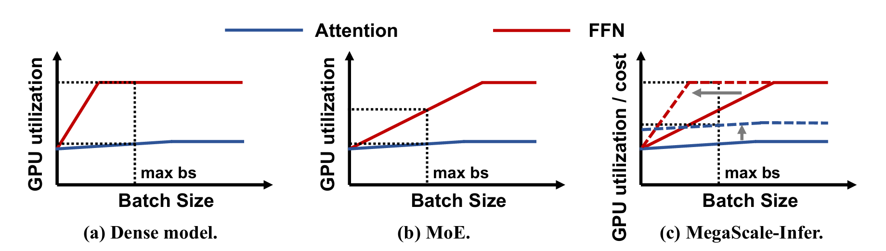
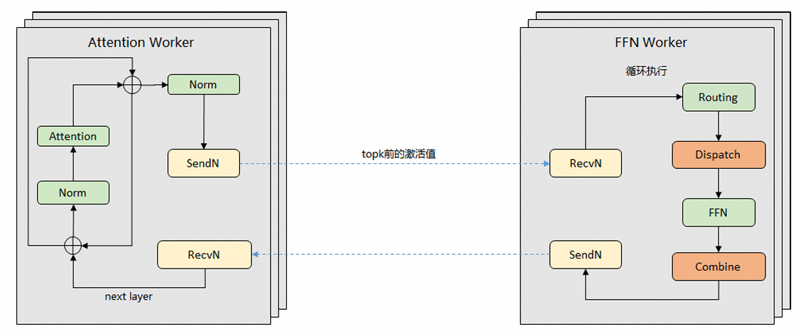
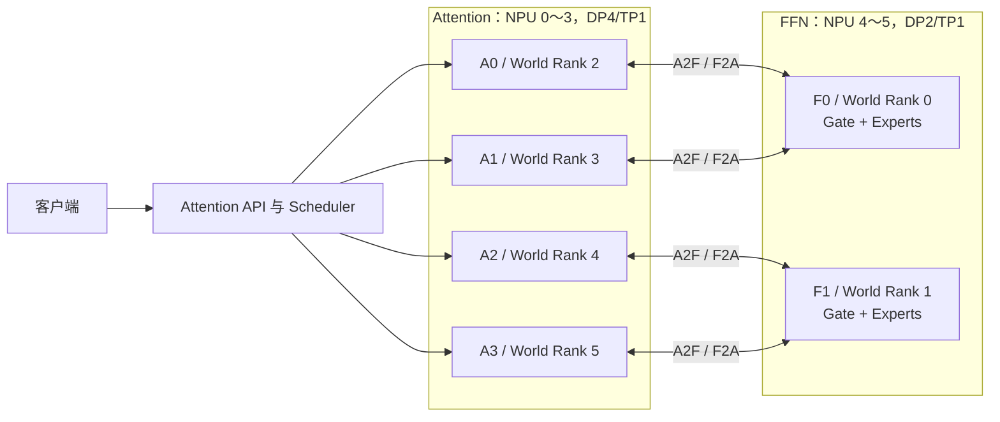
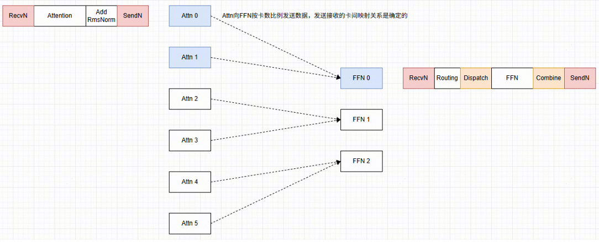
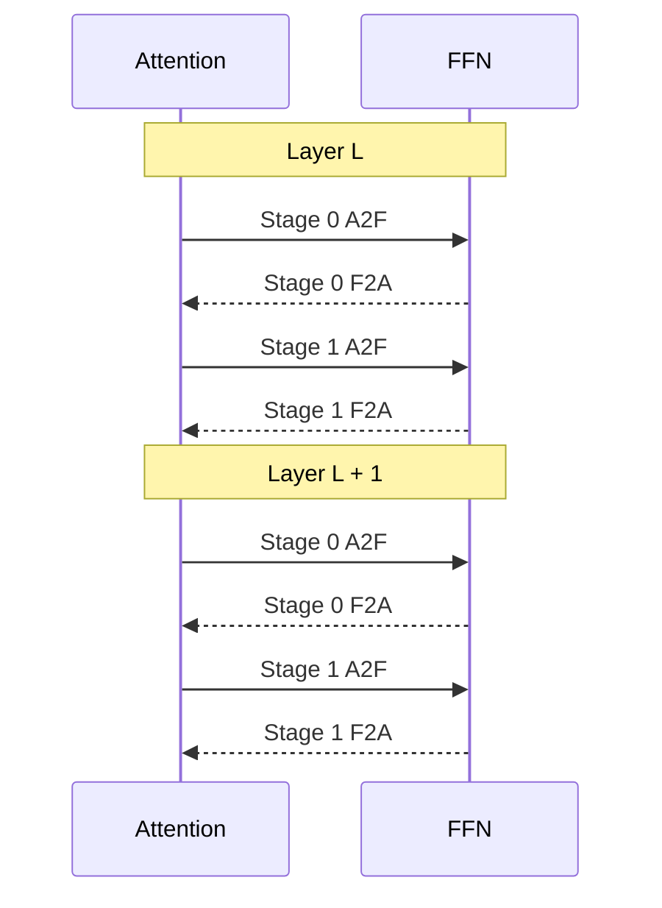
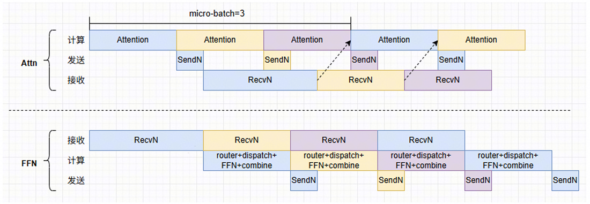
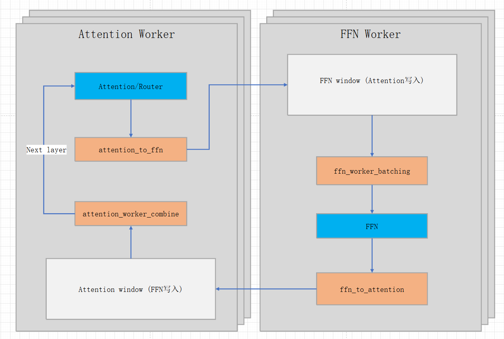
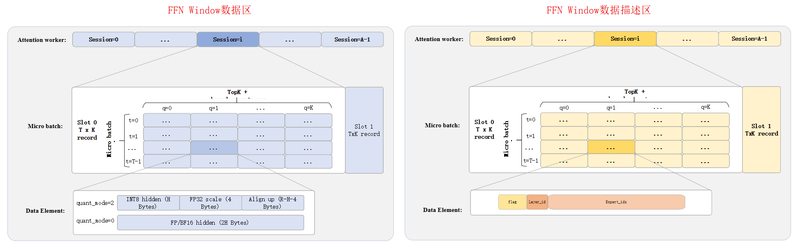

# DeepSeek-V4 Attention-FFN 分离方案

## 简介

本文介绍 DeepSeek-V4 在昇腾 NPU 上的 Attention-FFN（AF）分离方案，重点说明同步与异步两种技术方案及其关键设计。同步方案要求各 Attention 实例同步批次信息，并按一致的层和 microbatch 顺序与 FFN 配合执行；异步方案允许各实例独立推进，FFN 按数据就绪情况动态组批。

本文方案基于 vLLM 和 vLLM-Ascend，通过外部插件 [afd-plugin](https://github.com/vllm-project/afd-plugin) 实现，DeepSeek-V4 适配代码见 [PR #408](https://github.com/vllm-project/afd-plugin/pull/408)。环境准备与启动命令见[《DeepSeek-V4 AFD 部署与启动指南》](../../../integration/vllm/dsv4-afd/deepseek_v4_afd_deployment_guide.md)。

## Highlights
- **Attention 与 FFN 分离部署：** 两侧分别承载 Attention 计算与专家计算，支持不同卡数的资源配比。

- **基于 P2P 的同步执行：** Attention 实例同步本轮批次信息，两侧按约定的层和 microbatch 顺序，通过配对的发送、接收完成计算与结果回传。

- **基于 Window 的异步调度：** 允许不同 Attention 实例的层进度错开，FFN 按数据就绪情况动态组批，无需等待所有实例到达同一层。

- **Window 内存与通信算子协同设计：** 使用预分配、可复用的缓冲区承载动态 token 数据，由 A2F、FFN Batching、F2A 和 Attention Combine 算子完成分发、组批、回传与合并。

- **跨层专家的统一计算：** 将不同层的专家权重统一组织，根据组批结果执行分组矩阵计算，避免在主机侧逐层解析和调用。

- **微批流水与图执行：** 支持双 microbatch 流水、多流并行以及 ACLGraph 执行。

- **DSpark 推测解码集成：** 完整的 draft model 与 proposer 保留在 Attention 侧，与 AF 分离的目标模型配合完成推测解码。

## 目录

- [DeepSeek-V4 Attention-FFN 分离方案](#deepseek-v4-attention-ffn-分离方案)
  - [简介](#简介)
  - [Highlights](#highlights)
  - [目录](#目录)
  - [1. 场景分析和动机](#1-场景分析和动机)
  - [2. 相关方案与本文定位](#2-相关方案与本文定位)
  - [3. AF 分离方案实现](#3-af-分离方案实现)
    - [3.1 vLLM 框架中 afd-plugin 的执行框架](#31-vllm-框架中-afd-plugin-的执行框架)
    - [3.2 基于 P2pHcclAFDConnector 的同步方案](#32-基于-p2phcclafdconnector-的同步方案)
      - [3.2.1 同步方案整体框架](#321-同步方案整体框架)
      - [3.2.2 同步方案的执行流程](#322-同步方案的执行流程)
    - [3.3 基于 WindowAFDConnector 的异步方案](#33-基于-windowafdconnector-的异步方案)
      - [3.3.1 异步方案整体框架](#331-异步方案整体框架)
      - [3.3.2 异步方案的执行流程](#332-异步方案的执行流程)
      - [3.3.3 Window 数据结构](#333-window-数据结构)
      - [3.3.4 性能优化](#334-性能优化)
  - [4. 参考资料](#4-参考资料)

## 1. 场景分析和动机

大规模 MoE 模型推理需要兼顾响应速度、并发吞吐和显存容量。传统部署将 Attention 与 FFN 放在同一组设备上，但两者对资源的需求并不相同，使用同一套资源配置往往难以同时获得较高效率。

Attention 需要保存和访问请求的 KV Cache。上下文越长、同时处理的请求越多，KV Cache 占用的显存越大，计算时需要读取的数据也越多。因此，Attention 侧的资源配置需要重点考虑显存容量和访存带宽，不能仅靠增大 batch size 提高效率。

MoE FFN 则需要足够多的 token 参与同一专家的计算，才能充分复用权重。Dense 模型中，多个 token 使用同一组 FFN 权重，因此在图 (a) 中，FFN 随批量增大较快达到较高利用率。MoE 模型的 token 会分散到不同专家，单个专家实际处理的批量更小，读取权重后只能完成少量计算。这对应图 (b) 中的现象：即使整体 batch size 已达到部署允许的上限，FFN 仍可能没有得到充分利用。

AF 分离将 Attention 与专家计算部署到不同设备上，使两侧可以分别选择资源配置和组批方式。FFN 侧汇聚多个 Attention 实例发往同一层、同一专家的 token，扩大专家计算批量，而不必要求每个 Attention 实例继续增大自己的 batch。Attention 侧则可以根据上下文长度和并发需求配置显存与卡数，并将原先存放专家权重的显存用于 KV Cache。图 (c) 中的虚线示意了这种设计带来的改善：FFN 更容易达到高效计算所需的批量，Attention 可以通过独立的资源配置改善单位成本下的利用效率。右图的纵轴考虑了成本，与前两幅图的纯利用率有所区别。

<p align="center">
  
</p>

图 1：批量大小与 Attention、FFN 资源利用效率的关系，蓝线表示 Attention，红线表示 FFN。来源：文献 [1]，曲线为趋势示意。

分离部署也引入了额外成本。每个分离层都需要将中间数据发送到 FFN，再将计算结果返回 Attention。如果通信耗时过长，或者不同 Attention 实例因执行进度不一致而互相等待，就可能抵消组批和资源配置带来的收益。因此，通信效率、任务调度以及计算与通信的重叠，是 AF 分离方案需要解决的关键问题。

本文围绕这些问题介绍 DSV4 的 P2P 同步方案和 Window 异步方案。实际部署时，需要结合请求长度、并发规模、两侧卡数配比和互联带宽选择配置，并在相同资源预算下比较整体吞吐和请求时延。

## 2. 相关方案与本文定位

Attention 与 FFN 分离并不是只有一种实现方式。已有研究和工程方案分别从专家 token 聚合、模型与系统协同、异构硬件以及通用框架适配等角度，探索如何拆分两类计算并组织分离后的数据交换。

**MegaScale-Infer。** 将多个 Attention 副本与 Expert/FFN 节点分离部署，通过 M-to-N/N-to-M 路由汇聚不同 Attention 产生的专家 token，并使用 ping-pong microbatch 流水交错执行 Attention、通信和专家计算，以减少两侧交替等待。[1]

**StepMesh。** 面向 Attention-FFN 分离提供通信库，通过 Push/Pull、GetBatch/Respond、预注册 Buffer 和多 microbatch 管理 A2F/F2A 数据交换，尽量重叠通信与专家计算。[2]

**NVIDIA Groq 3 LPX。** 将 AFD 扩展为异构 Decode：GPU 负责 KV Cache 与 Attention，LPX/LPU 负责 Decode 阶段的 FFN/MoE，重点利用不同硬件资源的互补性，相关资料见 [3]。

**vLLM AFD 社区原型。** 从通用 serving 框架抽象 AFDConfig、AFDConnector、独立 FFN Server 和可替换通信后端，并与 DBO 和 microbatch 协同；后续社区 external plugin 继续扩展 CUDA/NPU 上的 P2P、CAMP2P 和异步 Connector。[4–5]

上述方案从专家计算组织、通信调度、异构硬件和框架接入等不同角度探索 AF 分离。vLLM AFD 为本文提供了角色化 Worker、独立 FFN Server 和 Connector 等框架抽象，本文在此基础上面向 DeepSeek-V4 的 NPU 部署实现具体通信路径。

本文实现了两种 DSV4 Connector：`P2pHcclAFDConnector` 使用显式 HCCL P2P，Attention 和 FFN 按约定的 layer 与 microbatch 顺序匹配执行；`WindowAFDConnector` 使用固定容量 Window、ready 状态和索引 metadata，由 FFN 侧对已就绪数据进行组批。下文所称的“同步方案”和“异步方案”特指这两种 DSV4 Connector，并不是对上述四种业界方案的统一分类。

## 3. AF 分离方案实现

### 3.1 vLLM 框架中 afd-plugin 的执行框架

DeepSeek-V4 的 AFD 适配位于 decoder layer 的 Attention 与 MoE/FFN 之间。Attention worker 负责 Attention、KV Cache 和 FFN 结果合并，FFN worker 负责专家计算；Scheduler 和 ModelRunner 负责组织请求、batch 和模型执行，Connector 负责 Attention 与 FFN 之间的 A2F/F2A 数据传输、任务匹配和完成状态管理。两侧 worker 分别创建并初始化对应的 AFD Connector。

两种 Connector 在模型层使用统一的远端 FFN 调用边界。Attention 完成当前 layer 的计算后，将 hidden states 和相关数据发送到 FFN；FFN 完成专家计算后，将结果返回 Attention，Attention 再继续当前 layer 和后续 decoder layer。P2P 同步路径由 FFN 侧完成 Gate 和专家路由，Window 异步路径要求 Attention 侧完成 Gate/Top-K，并将 expert IDs 等 metadata 一并发送。

在本文实现中，`P2pHcclAFDConnector` 使用显式 HCCL P2P，依赖通信双方按约定的 layer 和 microbatch 顺序匹配；`WindowAFDConnector` 使用固定容量 Window、ready 状态和索引 metadata，由 FFN 侧根据已就绪数据组织组批。两种 Connector 的具体通信协议、Window 数据结构、同步流程和异步调度分别在后续章节展开。

| 对比维度 | `P2pHcclAFDConnector` | `WindowAFDConnector` |
|---|---|---|
| 传输方式 | 显式 HCCL P2P `send/recv` | AFD通信算子 |
| 数据匹配 | 通信双方的调用顺序 | 传输数据 ready 状态 |


### 3.2 基于 P2pHcclAFDConnector 的同步方案
#### 3.2.1 同步方案整体框架

`P2pHcclAFDConnector` 面向通信 Peer 和数据量可以在执行前确定的 AF 分离拓扑。Attention 侧保留客户端入口、请求调度、KV Cache、Attention 和 HC；FFN 侧保留 Gate/Top-K、Token Dispatch、Shared/Routed Experts 以及 Token Combine。每个 decoder layer 在远端 MoE 边界执行一次 A2F/F2A 交换：Attention 向 FFN 发送 hidden states 和 DeepSeek-V4 所需的 input IDs，FFN 完成当前层的路由与 MoE 计算后，将合并后的 FFN 输出返回来源 Attention rank。expert IDs 和 expert scales 不需要跨 A/F 传输。

<p align="center">
  
</p>

该 Connector 使用统一的 AFD 通信 World，rank 编号顺序为 `[F0, F1, ..., A0, A1, ...]`。当前同步拓扑要求 Attention rank 数不少于 FFN rank 数，且前者是后者的整数倍；Connector 据此建立固定 P2P subgroup。以参考方案中的单机 Atlas A5 A4F2（Attention DP4/TP1、FFN DP2/TP1）为例，每个 FFN rank 固定汇聚两个 Attention rank：



*图：A4F2 同步方案的服务角色与 P2P subgroup*

| Subgroup | FFN rank | Attention rank | AFD World rank |
| -------- | -------- | -------------- | -------------- |
| 0        | F0       | A0、A1         | 0、2、3        |
| 1        | F1       | A2、A3         | 1、4、5        |

FFN rank 先依据控制面给出的 token 数，从 subgroup 内各 Attention peer 接收本层输入并按 peer 顺序拼接；MoE 计算结束后，再按原始 peer slice 切分结果并逐一返回。因而 FFN 的 token 容量必须覆盖汇聚比带来的总输入。参考 A4F2 配置将 Attention 和 FFN 的 `max_num_batched_tokens` 分别设置为 4096 和 8192；该数值是此拓扑的部署配置，不是 Connector 对其他拓扑的固定常量。

同步方案以确定的 peer 关系、调用顺序和 layer/stage 配对完成消息匹配，要求各 Attention 实例同步批次信息，并按一致的 layer/stage 顺序与 FFN 配合完成数据收发和计算。

#### 3.2.2 同步方案的执行流程

`P2pHcclAFDConnector` 将同步路径拆成控制面和数据面：

| 通信平面 | 后端     | 传输内容                                                     | 作用                                                         |
| -------- | -------- | ------------------------------------------------------------ | ------------------------------------------------------------ |
| 控制面   | Gloo     | Stage 标识、各 peer token 数、Graph/Eager 模式和生命周期消息 | 让两侧选择相同执行模式，并确定本轮 Tensor 的接收长度和匹配顺序 |
| 数据面   | HCCL P2P | Hidden states、DeepSeek-V4 input IDs、FFN 输出               | 承载每层 A2F/F2A Tensor                                      |

一次 layer/stage 的执行过程如下：

1. Attention ModelRunner 根据 Scheduler 和 U-batch 结果建立 forward context，并通过控制面发送本 stage 的 token 数和执行模式。
2. Attention 完成本层 Attention 与 HC 后，通过 HCCL P2P 向映射到的 FFN rank 发送 hidden states；DeepSeek-V4 input IDs 使用独立的数据通道发送。
3. FFN rank 按固定 peer 顺序和控制消息给出的 token 数，接收 subgroup 内各 Attention rank 的对应长度输入，并拼接成当前层的 FFN batch。
4. FFN 在本地执行 Gate/Top-K、Token Dispatch、Shared/Routed Expert 计算和 Token Combine。
5. FFN 按原始 peer slice 切分输出，通过 F2A P2P 发送回各 Attention rank；Attention 在下一层消费该 stage 前等待对应结果完成。

数据面使用 PyTorch Distributed 的阻塞式 `send/recv` 接口，因此双方必须保持完全一致的 peer、Tensor shape、layer 和 stage 调用序列；任一侧提前退出或模式不一致都可能使对端停在匹配通信上。“阻塞式接口”描述的是调用和消息匹配语义，不等价于所有设备任务在同一 stream 上串行。实现仍可将 Attention compute、A2F send、F2A recv、FFN recv、FFN compute 和 FFN send 放到不同 NPU stream，并用 event 建立生产、传输和消费依赖。

在SendN/RecvN⽅案中，发送/接收的卡和数据量都确定，直接⽤双边同步通信的send/recv实现即可。 ⽆论是Attention还是FFN，计算/数据发送/数据接收都是分配独立的stream执⾏的，按layer和micro-batch轮询。
<p align="center">
  
</p>

U1 只有一个 stage，每层按 A2F、FFN、F2A 的顺序推进，路径最短，适合连通性和基础功能验证。U2 则在请求边界将一个调度 step 拆为两个非空 stage，由 Host 按 `layer -> stage` 的顺序提交：



*图：U2 的 layer-major、stage-minor 通信配对顺序；设备侧任务可在 event 依赖允许时重叠。*

两个 stage 分别使用独立的 HCCL group，避免不同 stage 的消息错误配对。Attention 在下一层使用某个 stage 的结果前，只等待该 stage 上一层对应的 F2A event；不同 stage 的计算和通信可以在依赖允许的区间交错。若当前 step 无法拆成两个非空 stage，运行时回退为 U1，因此验证 U2 是否实际生效需要在请求日志或 profiler 中同时看到 Stage 0 和 Stage 1，不能只依据启动参数。

<p align="center">
  
</p>


DeepSeek-V4 同步 AFD 的 ACLGraph 模式限定为 `FULL_DECODE_ONLY`。Hidden states 的 HCCL send/recv 可以进入图捕获，input IDs 和动态控制消息保留在图外。Attention 与 FFN 在启动阶段使用一致的 shape key 完成 capture；在线请求命中已捕获 shape 时，两侧共同 replay Graph/U2，未命中时则对完整 target step 一致回退 Eager/U2，避免一侧回放图、另一侧执行 eager 导致 HCCL 操作序列失配。是否产生预期的通信/计算重叠，仍需结合目标 NPU 上的 stream/event trace 验证，不能仅由 U2 或 Graph 配置静态推断。


### 3.3 基于 WindowAFDConnector 的异步方案

#### 3.3.1 异步方案整体框架

同步 P2P 方案要求各 Attention 实例按照相同的 layer 和 microbatch 顺序与 FFN 配合。如果某个 Attention 实例计算或通信较慢，其他实例需要等待它到达同一个执行位置。Window 异步方案取消了这种全局的执行位置约束：各 Attention 实例可以按照自己的进度产生数据，FFN 侧检测已经就绪的数据，一次性计算来自不同实例、处于不同 layer 的 hidden states，减少实例之间因进度不同产生的等待。

Window 异步方案的关键还在于将跨角色数据交换从配对的发送/接收调用，改为面向预分配 Window 内存区域的单边写入和就绪数据读取。Attention 或 FFN 完成数据准备后直接写入对应方向的 Window，另一侧根据状态和索引取用已经发布的数据，不必与对端在同一个计算位置配对等待。这样可以将通信过程与两侧的计算推进解耦；为承载不同方向的数据和完成状态，A2F 与 F2A 分别使用专用的 Window 内存布局。


<p align="center">
  
</p>

图中左侧是 Attention worker，右侧是 FFN worker。Attention 完成当前 layer 的 Attention、HC 和路由后，通过 `attention_to_ffn` 算子将 hidden states 和路由信息写入 A2F Window。FFN 侧从 A2F Window 中已经写入完成的预留区域取出数据，通过 `ffn_worker_batching` 组织专家计算；计算结果再由 `ffn_to_attention` 写入 F2A Window，最后由 `attention_worker_combine` 从 F2A Window 读取结果并完成合并。

不同 Attention worker 可以按照各自的执行进度到达不同的 layer，FFN 只处理当前已经就绪的数据；一次 FFN batching 可以组织来自不同 session、layer 和 expert group 的任务，再根据 `session_id` 和 `layer_idx` 将结果写回对应的 Attention 实例。异步执行流程和 Window 的布局分别在 3.3.2 和 3.3.3 中说明。

#### 3.3.2 异步方案的执行流程

在 `WindowAFDConnector` 中，Attention 与 FFN 通过 A2F 和 F2A Window 交换当前 layer 的中间结果。Attention 先发布已经完成的 layer 数据，FFN 侧从多个 Attention session 中选取已经就绪的数据并组织专家计算，计算结果再写回对应的 Attention。Window 中的状态和索引使不同 Attention 实例可以处于不同的 layer，FFN 不需要等待所有实例到达同一执行位置。

Attention 完成当前 decoder layer 的 Attention、HC 和 Gate/Top-K 路由后，通过 `attention_to_ffn` 算子将 hidden states、routed expert IDs 和有效性信息写入 A2F Window，并将数据对应的flag置1，表示ready状态。`session_id` 和 `micro_batch_id` 用于选择来源 session 及其 Window 区域，`layer_idx` 标识当前 decoder layer。

FFN 侧的 `recv_attn_output()` 调用 `ffn_worker_batching`，扫描多个 Attention session 和 microbatch 对应的 A2F 区域，读取已经发布且字段完整的数据，并将有效 token 压缩为 FFN 输入。算子返回 `hidden_states`、`group_list`、`session_ids`、`micro_batch_ids` 等数据。其中，`group_list` 描述每个“层-本地专家组合”包含的有效 token 数，用于后续 grouped matmul（GMM）确定每段输入的范围。

异步路径的关键能力是跨层组批。不同 Attention 实例可以处于不同 layer，FFN 将已经就绪的数据组织到同一次 grouped FFN 计算中。为了让 GMM 区分不同层的专家输入，需要把 layer 和 local expert 展开成一个连续编号：

```text
全局专家索引 = 层号 × 每层本地专家数 + 层内专家编号
```

其中，层号就是 `layer_idx`，层内专家编号就是 `local_expert_id`，每层本地专家数就是 `local_expert_num`。 `global_group_id` 表示“全局专家索引”，它把每个层内的专家依次排成一维列表，便于 GMM 按这个位置找到对应的输入和权重。例如 `local_expert_num=4` 时，第 0 层的 4 个本地专家对应索引 0～3，第 1 层对应索引 4～7；第 1 层的第 2 个本地专家对应索引 `1 × 4 + 2 = 6`。

batching 算子会扫描 FFN Window 中已就绪的数据，并按照上述专家编号顺序重新整理输入，同时生成用于记录各专家 token 数量的 group_list。FFN 权重也按照相同的专家编号顺序排列。后续 GMM 会根据组批结果，将每段输入与对应的专家权重进行匹配并完成计算。通过这种方式，来自不同 Attention 实例、不同层的数据可以被合并到同一批 FFN 计算中。

专家计算完成后，结果根据记录的来源和 token 位置写回对应的 Attention Window。Attention 使用本地保存的专家路由权重合并结果，再继续当前层及后续层的计算。

这套流程通过 Window 中的就绪状态选择可处理的数据，通过跨层统一的专家编号匹配输入与专家权重。各 Attention 实例可以按自身进度推进，FFN 则对已就绪的数据跨层组批，同时保持每个实例内部的层间依赖。

#### 3.3.3 Window 数据结构

`WindowAFDConnector` 使用两个方向独立的设备侧 Window：FFN Window 承载 Attention 发往 FFN 的 A2F 数据，Attention Window 承载 FFN 返回 Attention 的 F2A 数据。FFN Window 由 FFN 侧为各个 Attention session 和 microbatch 预留固定容量的输入区域；Attention Window 由每个 Attention worker 管理自己的返回区域，按 microbatch、token 以及每个 token 对应的专家结果位置组织结果。实际请求的 token 数可以小于对应区域容量，有效范围由状态信息和有效标记确定。

Attention Window和FFN Window都由数据区和数据描述区两部分组成，数据区表示实际的hidden数据，数据描述区描述hidden数据的ready状态，layer_id等相关信息。两类 Window 的数据描述区字段并不完全相同：FFN Window 的描述区还需要记录输入的层号和专家路由信息，Attention Window 的描述区主要记录每个返回结果位置的状态；两者的数据区分别保存 A2F 输入和 F2A 输出的 hidden 数据。

**FFN Window：A2F 输入**

首先介绍FFN Window，决定申请FFN Window内存大小的参数如下表所示：

| 参数 | 含义 |
|---|---|
| `attention_size=A` | Attention rank 数；每个 rank 对应一个 session，FFN Window 为每个 session 预留空间 |
| `micro_batch_num=U` | 槽位数，U1=1，U2=2 |
| `micro_batch_size=T` | 每个槽位的最大 token 容量，通常是 `max_num_batched_tokens` |
| `selected_expert_num=K` | 每个 token 选择的专家数，通常为 routed TopK + shared expert |
| `hidden_size=H` | hidden size |
| `quant_mode` | A2F 激活的存储模式 |

FFN Window 的第一维是 `attention_size=A`，表示每个 FFN rank 需要同时为所有 Attention rank 预留输入空间。可以将FFN Window 理解为 `A × U` 二维表，每个槽位 `(session, micro_batch)` 都具有固定容量 `T`。数据描述区保存槽位状态和路由信息，包括 ready/flag、`layer_id` 以及每个 token 的 expert ids；数据区保存对应 token 的 hidden state。`quant_mode=0` 时，每条记录保存 FP16/BF16 hidden state；`quant_mode=2` 时，每条记录保存 INT8 hidden state、dynamic scale 和尾部对齐空间。
<p align="center">
  
</p>


FFN Window 内存大小计算方式如下：

- 信息区：`ffn_info = align512(4 × (K × T + 2) × U × A)`
  - 逻辑形状：`int32[A, U, 2 + T × K]`
  - 每个 `(session, micro_batch)` 槽包含 `flag`、`layer_id` 和 `expert_ids[T × K]`；其中 `flag` 与 `layer_id` 是额外的两个 int32。
- 数据区：`ffn_data = ffn_token_size × K × T × U × A`
  - 逻辑形状：`[A, U, T, K, H]`，其中最后一维 `H` 是 hidden size。
  - `quant_mode=0`：`ffn_token_size = 2H`，每个 `(a, u, t, k)` 数据项保存 FP16/BF16 hidden `[H]`。
  - `quant_mode=2`：`ffn_token_size = align512(H + 4, 512)`，每个 `(a, u, t, k)` 数据项保存 INT8 hidden `[H]`、FP32 dynamic scale（4 bytes）和 padding。

在 `int32[A, U, 2 + T × K]` 中，`A` 和 `U` 分别定位 Attention session 与 microbatch，后面的 `2 + T × K` 表示该槽位的两个公共字段以及 `T × K` 个 token-expert 路由项；在 `[A, U, T, K, H]` 中，前四个维度定位一条输入数据，最后一维 `H` 表示该数据的 hidden 向量。

在未量化模式下，物理存储直接保存 FP16/BF16 hidden；量化模式下，物理存储按 INT8 hidden、scale 和对齐空间展开，具体大小由 `align512(H + 4, 512)` 给出。

FFN Window size = `align2MiB(ffn_info + ffn_data)`。


**Attention Window：F2A 返回结果**

Attention Window 的布局与 FFN Window 不同，每个 Attention worker 只管理自己的返回区域。其逻辑结构为：

<p align="center">
  
</p>
每个 `(micro_batch, token, q)` 位置对应一个 FFN expert 的返回结果，其中 `q` 表示该 token 的第 `q` 个专家结果位置。F2A 完成后，Attention 侧使用本地保存的 `expert_scales` 对这些 expert 输出进行 Top-K 加权合并，恢复当前 layer 的 routed FFN 输出。

Attention Window 内存大小计算方式如下：

- 信息区：`attn_info = align512(4 × K × T × U)`，逻辑形状为 `int32[U, T, K]`，每个 `(u, t, q)` 有一个 4 字节状态项。
- 数据区：`attn_data = 2 × H × K × T × U`，逻辑形状为 `FP16/BF16[U, T, K, H]`，每个 `(u, t, q)` 对应一个长度为 `H` 的 hidden 返回结果，占 `f2a_record_size = 2H` bytes。
- Attention Window size：`align2MiB(attn_info + attn_data)`。

在 Attention Window 的逻辑 shape 中，`u` 是 microbatch 下标，`t` 是该 microbatch 中的 token 下标，`q` 是该 token 的第 `q` 个专家结果位置，`H` 是 hidden 维度。因此，信息区的 `int32[U, T, K]` 与数据区的 `FP16/BF16[U, T, K, H]` 一一对应：一个状态项描述一份长度为 `H` 的返回结果是否可用。

**固定容量与有效数据**

Window 采用固定容量布局， `T` 表示槽位容量，不表示本轮一定有 `T` 个有效 token。动态 batch 为 `N<T` 时，A2F 输入保持 `[1, T, H]`：前 `N` 行写入真实 hidden states 和 expert IDs，尾部全部零填充，并通过 `active_mask[:N]=true` 标记有效行；本地 combine scale buffer 同样只复制前 `N` 行。FFN batching 使用 `actual_token_num` 标识压缩后的有效前缀，grouped compute 和 F2A 只消费该范围。信息区先按 512 bytes 对齐，信息区与数据区之和再整体按 2 MiB 对齐，以满足 CommContext Window 的容量约束。

#### 3.3.4 性能优化

Window 异步方案在数据交换解耦的基础上，结合多流、ACLGraph 和 DSpark 优化执行效率。

**多流并行。** Attention 侧为 A2F 发送、Attention 计算和 F2A 接收/合并使用独立的执行流，在依赖满足时交错推进；FFN 侧不启用多流，按 batching、专家计算和 F2A 的顺序串行执行。

**ACLGraph。** 当前 AFD 主要支持 `FULL_DECODE_ONLY` 模式，即只对 decode 阶段的固定输入 shape 进行 capture/replay，减少重复的算子启动开销。Attention 和 FFN 需要使用一致的图 shape 和执行路径；请求 shape 或运行条件未命中时，当前 step 回退到 eager 路径，避免两侧执行模式不一致。

**DSpark。** DSpark 仅在 Attention 侧启用，与 Attention 的计算流程结合完成推测解码；FFN 侧继续使用 Window 协议处理 A2F 和 F2A 数据，不参与 DSpark 的 draft 计算。

## 4. 参考资料

[1] [MegaScale-Infer: Serving Mixture-of-Experts at Scale with Disaggregated Expert Parallelism](https://arxiv.org/abs/2504.02263v4) (v4, 2025-07-26).

[2] [StepFun: StepMesh: A High-Performance, Low-Latency Communication Library for Attention-FFN Disaggregation](https://github.com/stepfun-ai/StepMesh).

[3] [Inside NVIDIA Groq 3 LPX: The Low-Latency Inference Accelerator for the NVIDIA Vera Rubin Platform](https://developer.nvidia.com/blog/inside-nvidia-groq-3-lpx-the-low-latency-inference-accelerator-for-the-nvidia-vera-rubin-platform/).

[4] [vLLM Project: PR #29772, AFD basic implementation](https://github.com/vllm-project/vllm/pull/29772).

[5] [vLLM Project: AFD Plugin repository](https://github.com/vllm-project/afd-plugin).
