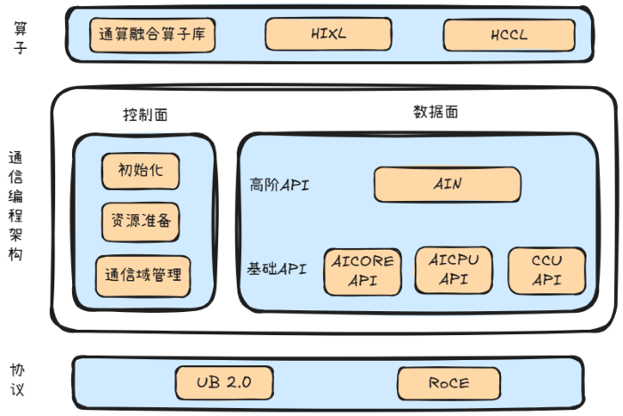
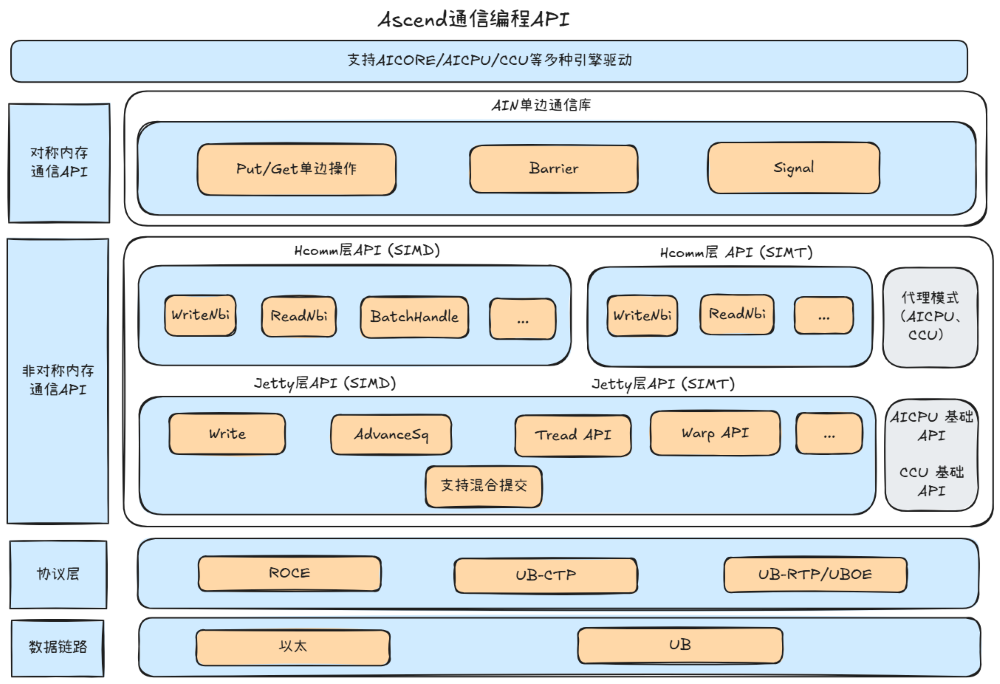
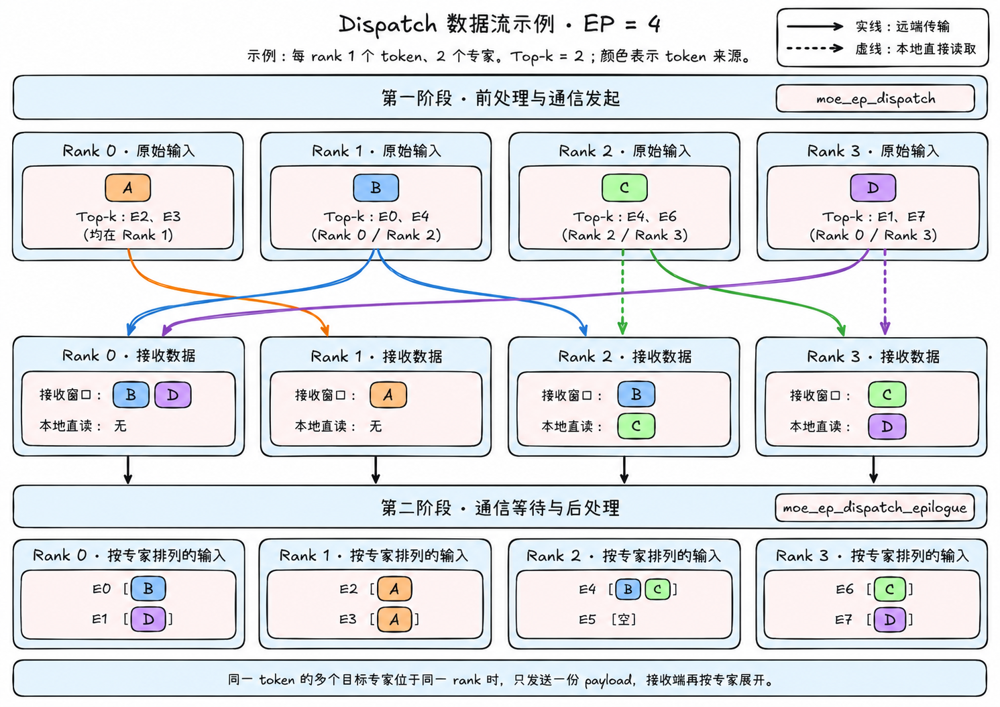
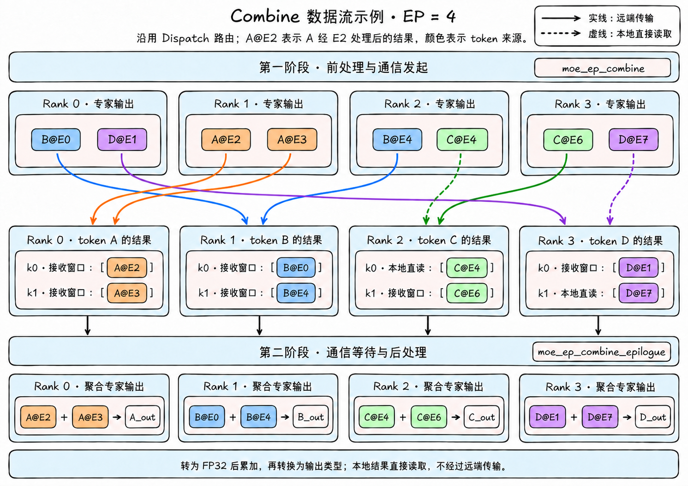
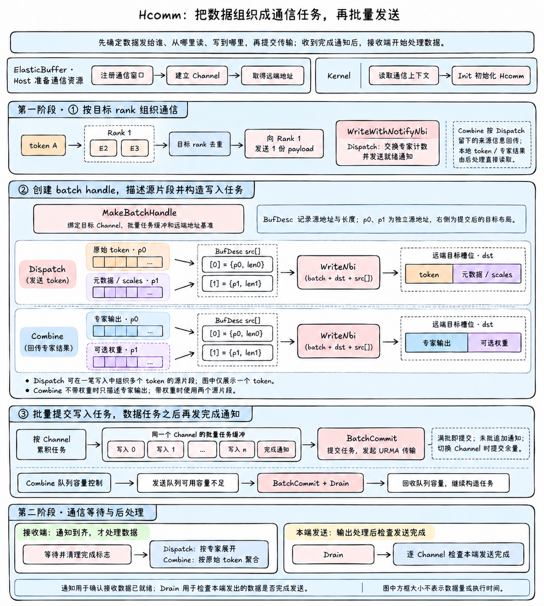
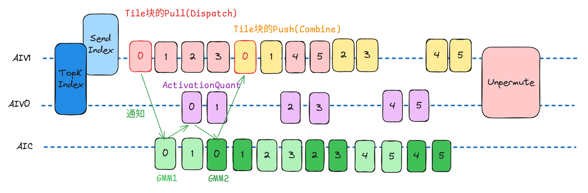

# AscendC高性能自定义通信编程参考实践

## 简介
ASC-COMM是CANN提供的高性能自定义通信编程库，整体面向集群场景，屏蔽通信通路差异，支撑纯通信算子与通算融合算子的高效编程，整体能力覆盖多种通信引擎，多种通信协议以及不同编程层级的高性能通信API。

通信编程整体架构分为Host控制面和Device数据面。Host负责通信域、拓扑、内存注册、Channel和远端地址准备等；Kernel则在数据面直接使用这些资源，完成任务构造、传输、归约和同步。

本文先介绍ASC-COMM的通信编程能力和接口全景，再以MegaMoE和DeepEP的Dispatch/Combine为实践对象，说明如何在ASC-COMM上实现MoE动态分发与结果聚合。

# ASC-COMM通信编程能力

## 控制面与数据面

自定义通信算子开发整体逻辑是把资源准备和任务执行拆开。Host控制面负责通信域的创建和管理、通信内存注册以及与远端建立链接。Device数据面通过Host准备好的这些资源，向目的地址发送/读取数据，进行队列和事件的管理及任务提交与完成。这种拆分让通信资源在Kernel外准备一次，Kernel内可以专注处理动态路由和任务布局。

## 多引擎

ASC-COMM提供AICORE直驱、代理（AICPU/CCU）模式等完善的高性能通信编程API。其中AICORE占用Vector Core，发起路径短；AICPU不占用Vector Core，适合将通信行为与当前Kernel解耦；CCU不占用AIV计算核，片上Buffer可减少Global Memory往返。

| 通信引擎 | 执行主体 | 主要功能 |
| --- | --- | --- |
| AICORE | Vector Core | 执行通信Kernel中的算法逻辑、数据处理、搬运及归约等操作 |
| AICPU | AICPU + TS | 采用AICPU+TS的执行模式，STARS是Device侧的任务调度器，负责调度AICPU Kernel以及提交到任务队列中的通信任务。AICPU Kernel由STARS调度执行后，向任务队列提交数据搬运等通信任务，最后再由STARS调度到相应的执行器 |
| CCU | 集合通信专用硬件引擎 | 执行预置通信指令，并使用内部CCU Buffer完成数据暂存、搬运、同步和片上归约等操作 |

## 多协议

ASC-COMM通过提供极简API，屏蔽昇腾芯片代际差异，支持多种网络与灵衢互联（RoCE/UB等）协议。自定义算子开发者可以根据自己实际的组网及业务需求情况，选择与自己匹配的协议类型。

| 协议 | 语义 | 当前主要路径 |
| --- | --- | --- |
| UB | 队列式远端内存访问，轻量可靠传输访问，以及Load、Store语义访问 | AIN、Hcomm层API、Jetty层API |
| RoCE | 通过以太网RDMA进行远端数据访问 | Hcomm层API |

# 自定义通信编程API全景

## 通信编程架构

## 通信编程应用场景分层
ASC-COMM提供的通信API，可以在对称/非对称内存场景以及SIMD/SIMT场景下自由选择。

| 编程界面 | 内存模型 | 典型用途 |
| --- | --- | --- |
| AIN | 对称内存 | 基于对称内存的单边通信库，AIN通过目标成员、窗口和偏移发起Put/Get/Signal等任务，简化集群编程 |
| Hcomm层API | 非对称内存 | HCOMM控制点对点任务，通过Channel确定通信对端，并由本地地址和远端地址分别指定数据的来源和目标。适合目的地址动态变化、buffer布局不一致及需要精细控制的场景 |
| Jetty层API | 非对称内存 | Jetty层提供底层URMA通信原语，提供最灵活、高性能的通信编程能力 |

### 内存模型

通信内存按用户看到的组织方式分为对称内存和非对称内存。两者都依赖Host侧完成内存注册、Channel建立和访问凭据准备，区别在于Device侧如何表达目标内存。

| 内存组织 | 主要接口 | 地址表达 | 典型场景 |
| --- | --- | --- | --- |
| 对称内存 | AIN | 目标成员、窗口和窗口内偏移 | 统一布局的单边访问、Team同步 |
| 非对称内存 | HCOMM | Channel、本地地址和远端地址 | 独立Buffer、动态目的地址、点对点读写 |

### 执行模型

通信任务按发起方与执行方的关系分为直驱模式和代理模式。

| 模式 | 任务发起方 | 任务执行方 | 特点 |
| --- | --- | --- | --- |
| 直驱模式 | 通信引擎 | 通信引擎 | 通信引擎直接下发并执行通信任务，用户通过数据面接口控制任务提交、保序与同步。 |
| 代理模式 | AICore客户端 | AICPU_TS或CCU服务端 | 发起方与执行方分离，客户端描述任务并发布执行条件，服务端解析任务、展开通信算法并通过Channel执行。 |

# DeepEP Dispatch/Combine/MegaMoE 实践

## Dispatch / Combine 通信实践

MoE 的专家并行（Expert Parallel，EP）将专家分布在不同 rank 上。Dispatch 根据每个 token 的 Top-k 路由，将输入分发给目标专家所在的 rank，并整理成按专家排列的数据，供专家计算使用；Combine 则将专家输出送回 token 的来源 rank，按原始 token 顺序聚合结果。

本实践通过 ElasticBuffer 对外提供 Dispatch / Combine 接口，采用上文介绍的 **Hcomm 层 API（非对称内存）与AIV直驱URMA模式**。Dispatch 的目标 rank 随 Top-k 路由变化，Combine 的回传位置由 token 来源信息决定，算子通过 Channel、本地源地址和远端目标地址描述点对点传输。Kernel 通过 Hcomm 通信 API 直接构造并提交通信任务。

每次操作分为前处理与通信发起、通信等待与后处理两个算子阶段；第二阶段由对应的 Epilogue 算子完成。

| 操作 | 第一阶段：前处理与通信发起 | 第二阶段：通信等待与后处理 |
| --- | --- | --- |
| Dispatch | 统计路由、交换计数、准备元数据并发起 token 发送 | 等待接收完成，按专家展开并输出 token 和回传所需的元数据 |
| Combine | 根据回传元数据计算目标位置，发起专家输出发送 | 等待接收完成，按原始 token 聚合专家输出 |

ElasticBuffer 在同一条流上依次下发两个阶段的算子。通信请求采用非阻塞方式发起，第一阶段返回时，payload 传输可能仍在进行，等待通信实际结束在第二阶段中完成。

### Dispatch：从 token 路由到专家输入

Dispatch 将“发送到哪个 rank”与“交给该 rank 上哪个专家”分开处理：同一个 token 即使命中同一目标 rank 的多个专家，也只向该 rank 发送一份 payload，再由接收端按专家展开。

**第一阶段：前处理与通信发起（`moe_ep_dispatch`）。** 首先从 Top-k 专家编号得到目标 rank，对同一 token 的重复目标 rank 去重，分别统计各 rank 和各专家需要接收的 token 数。随后交换计数，并准备 token 的来源 rank、原始索引、Top-k 路由等元数据；FP8 输入还携带 scales，存在可选 Top-k 权重时一并携带。收到各来源 rank 的计数后，生成本端接收计数。最后按目标 rank 和 Channel 划分发送任务，将输入 token 与元数据写入远端接收窗口，并提交完成通知。

**第二阶段：通信等待与后处理（`moe_ep_dispatch_epilogue`）。** 根据专家计数确定输出区间，等待所有预期的 payload 通知到达并清理 flag 位。随后扫描接收元数据，识别各本地专家命中的 token，将数据展开为按专家连续排列的输入，同时整理 scales、可选权重以及回传所需的来源信息和索引。远端 token 从通信窗口读取，本 rank 的 token 直接从原始输入读取。最后检查本端各发送 Channel 的完成状态。

以下用一个 **EP=4** 的简化例子表示数据流：每个 rank 放置两个专家，并各有一个原始 token（A、B、C、D），每个 token 选择两个专家（Top-k=2）。专家 E0/E1、E2/E3、E4/E5、E6/E7 分别位于 Rank 0、1、2、3。颜色始终表示 token 的原始来源；图中参数仅用于说明路由关系。

例中 A 同时命中 Rank 1 上的 E2、E3，因此只向 Rank 1 发送一份 payload，再在通信等待与后处理阶段展开成两份专家输入。C→E4、D→E7 为本地路径，token 直接从本 rank 的输入读取。图中省略计数交换、通知和元数据的具体布局，重点表示 payload 的流向。

上述流程展示非 cached 模式。cached 模式下，可复用计数、槽位与接收元数据，省去对应的路由重建；发送、通信等待与后处理仍由两个阶段完成。

### Combine：将专家输出送回并聚合

Combine 使用 Dispatch 留下的元数据，确定每份专家输出对应的来源 rank、原始 token 以及 Top-k 槽位。

**第一阶段：前处理与通信发起（`moe_ep_combine`）。** 按目标 rank 的元数据区间划分任务，批量计算专家输出的本地地址与远端目标槽位。对于远端 rank，直接从专家输出地址发起写入；存在可选权重时，将对应权重随数据一并传输。每个发送 Channel 在数据任务之后提交完成 flag，即使该 Channel 没有 payload，也发布 flag。本 rank 的专家输出留在本地，供 Epilogue 直接读取。

**第二阶段：通信等待与后处理（`moe_ep_combine_epilogue`）。** 等待预期的 Channel 完成 flag 到齐并清理 flag。然后按原始 token 遍历有效 Top-k 槽位：本地结果直接读取专家输出，远端结果从接收窗口读取，转为 FP32 累加，再转换为输出类型，恢复原始 token 顺序。可选 Top-k 权重单独恢复到对应槽位。最后检查本端各发送 Channel 的完成状态。

Combine 对输入的专家结果直接求和；可选 Top-k 权重作为独立数据回传，不在本算子内与专家结果相乘。

Combine 沿用上图的路由，`A@E2` 表示 token A 经专家 E2 处理后的结果，其他标记同理。A 的两份专家结果分别回到 Rank 0 的两个 Top-k 槽位，再聚合成 A 的输出；B、C、D 同理。图中的本地结果槽位仅表示逻辑对应关系，实际由通信等待与后处理算子直接读取本地专家输出。

### 通过 AscendC 通信 API 组织传输

ElasticBuffer 的 Host 侧准备并注册通信窗口，建立面向远端 rank 的 Channel，取得远端窗口地址，再将 Channel 句柄和窗口地址放入通信上下文。Kernel 从该上下文选取目标 Channel，并结合 token 路由计算本地源地址、远端目标地址与传输长度。

Dispatch/Combine 算子通信过程中涉及的 API 及使用方式如下表所示：

| 通信 API | 使用方式 |
| --- | --- |
| `Hcomm::Init` | 初始化通信资源，供后续任务构造和提交使用。 |
| `Hcomm::WriteWithNotifyNbi` | Dispatch 交换计数时，将目标 rank 上各专家的计数写入远端，同时发送携带该 rank 的 token 数及就绪标记的通知。 |
| `Hcomm::MakeBatchHandle` | 绑定目标 Channel、批量任务缓冲与远端地址基准，构造批量写入使用的 handle。 |
| `Hcomm::WriteNbi` | 向目标窗口写入数据或状态；payload 路径使用 batch handle 构造写入任务。Dispatch 通过 `BufDesc` 描述 token 与元数据两个源片段，Combine 描述专家输出及可选权重片段。 |
| `Hcomm::BatchCommit` | 将已构造的批量任务提交给 Channel；在批量容量达到阈值、需要切换 Channel 或收尾时提交剩余任务。 |
| `Hcomm::Drain` | 检查并等待 Channel 的发送完成。两个 Epilogue 在输出处理后逐 Channel 执行；Combine 发送阶段还会在发送队列可用容量不足时提交并等待，再继续发送。 |

Dispatch/Combine 算子围绕通信 API 组织传输，具体方式如下：

- **按 rank 去重，再按专家展开。** Dispatch 的远端传输以去重后的目标 rank 为单位，避免同一 token 因命中同一 rank 的多个专家而重复发送 payload。
- **直接描述源数据片段。** Dispatch 将原始 token 与暂存元数据组成源片段列表，Combine 直接描述专家输出及可选权重；通过 `WriteNbi` 写入目标槽位。
- **构造多笔任务后批量提交。** 两个发送算子均通过 batch handle 累积任务，使用 `BatchCommit` 提交，使任务构造与提交分开。Combine 还根据批量缓冲和发送队列的剩余容量控制提交与等待。
- **分别等待接收就绪和发送完成。** 发送端在数据写入任务之后提交通知任务。Epilogue 等待接收通知，再处理数据；输出处理完成后，通过 `Drain` 等待本端发送完成。

通过为数据任务和通知任务配置不同的保序参数，保证同一 Channel 上的完成通知在对应数据写入完成后生效。

完成队列项（CQE）用于记录发送完成信息。Dispatch 在每个非空发送段的最后一笔数据写入中请求生成 CQE；Combine 则在发送段末尾或发送队列需要回收的位置请求生成 CQE，供后续发送完成检查使用。

### 性能数据

测试硬件为 **Ascend 950 DT**，`epWorldSize=16`。下表中的 `num_tokens` 均为每个 rank 的原始输入 token 数，Combine 沿用对应 Dispatch 用例的规模参数。Combine 的输入是本 rank 的专家输出，其行数由各本地专家实际处理的 token 数之和决定。

时间单位为 **μs**，通信带宽单位为 **GB/s**。

性能数据拆分为前处理、URMA 通信和后处理三个阶段，分别统计耗时。

#### Dispatch

| num_tokens | hidden | k | num_experts | 数据类型 | 前处理时间（μs） | URMA 通信时间（μs） | 后处理时间（μs） | 通信带宽（GB/s） |
| --- | --- | --- | --- | --- | --- | --- | --- | --- |
| 4096 | 7168 | 6 | 384 | BF16 | 58.021 | 649.602 | 298.877 | 508.467 |
| 4096 | 7168 | 6 | 384 | FP8 | 71.031 | 318.665 | 239.513 | 518.258 |
| 4096 | 5120 | 6 | 256 | BF16 | 56.918 | 418.661 | 235.918 | 563.534 |
| 4096 | 5120 | 6 | 256 | FP8 | 70.123 | 235.983 | 209.274 | 499.887 |

#### Combine

| num_tokens | hidden | k | num_experts | 数据类型 | 前处理时间（μs） | URMA 通信时间（μs） | 后处理时间（μs） | 通信带宽（GB/s） |
| --- | --- | --- | --- | --- | --- | --- | --- | --- |
| 4096 | 7168 | 6 | 384 | BF16 | 37.861 | 769.748 | 151.046 | 429.103 |
| 4096 | 5120 | 6 | 256 | BF16 | 37.832 | 513.922 | 131.331 | 459.077 |

## MegaMoE

在专家并行（EP）场景下，MoE通过Dispatch将Token分发到专家所在设备，完成专家计算后，再通过Combine返回并合并结果。MegaMoE旨在通过通信与计算并行、相互掩盖耗时，减少阶段间等待，提升MoE端到端性能。为此，MegaMoE将Dispatch、两层分组矩阵乘（GMM）、SwiGLU与量化、Combine融合到一个Kernel中，在设备侧统一安排通信和计算流水。以下介绍昇腾950上的MTE实现。

### 流水设计

MegaMoE通过tile分块与Wave调度，将通信和计算组织成并行推进的流水，实现细粒度的通算融合。每个tile的数据就绪后即可启动对应计算，无需等待整个专家的输入搬运完成；不同Wave之间提前搬入后续输入，并让前一Wave的Combine与后一Wave的GMM1重叠，利用计算时间掩盖通信，缩短MoE端到端执行时间。具体实现将专家输入按最多256行分组，再将若干组组成一个Wave，从而既能合并多个小专家的任务，也能分批处理大专家。

通信方向与流水配合设计：**Dispatch采用pull模式**，先将输入Token写入本卡共享内存，再由专家所在卡根据路由index主动读取所需Token。同一份输入可以供多个专家读取，减少按路由展开Token副本所需的通信缓冲空间。**Combine采用push模式**，将已完成的专家结果写入原Token所在卡的结果缓冲区，供后续加权合并。整体流水如下图所示：

> 图中以A8W8展示核间分工：AIC执行矩阵计算，AIV0执行激活与量化，AIV1执行Dispatch和Combine。数字表示分块任务编号，方块长度不代表实际执行耗时。

- **输入准备与Dispatch**：按专家生成路由index，并向专家所在设备发送index及对应Token数量。Dispatch根据index拉取输入；一组输入搬入完成后，即通知AIC开始GMM1，同时继续搬入后续输入。
- **GMM1与激活处理**：GMM1写出一块gate/up后，AIV0执行该块的SwiGLU与量化，AIC继续计算后续分块。对应激活结果就绪后，由GMM2完成输出投影。
- **GMM2与Combine**：GMM2的分块结果写出后，AIV1开始返回数据。AIC完成当前Wave的GMM2后，继续计算已准备好输入的下一Wave，实现**前一Wave的Combine与后一Wave的GMM1重叠**。AIV1按调度顺序交错处理Dispatch和Combine，持续准备输入、返回结果。
- **输出还原**：最后一个Wave计算结束后，完成剩余Combine，在跨卡输出同步后执行Unpermute，按原Token顺序和路由权重合并结果。

MegaMoE支持A8W8、A8W4和A4W4路径，使用FP8/FP4格式。A8W4中，AIV0负责将FP4权重转换为FP8，AIV1交错处理下一Wave的Dispatch与当前激活；A4W4中，GMM1使用FP4输入和权重，SwiGLU后量化为FP8，GMM2复用A8W4实现。

### 性能优化

在Wave调度的基础上，MegaMoE进一步优化通信资源分配和GMM内部流水：

- **减少通信与计算的带宽竞争**：通信和矩阵计算都需要读写内存。启动时优先搬入首批输入，计算期间控制同时进行的通信量，收尾时加快剩余结果的传输，减少通信对矩阵计算的干扰。
- **让计算结果尽早进入激活处理**：SwiGLU需要将gate和up两部分结果配对计算。通过交错排列（interleave），让每个输出分块同时包含对应的gate和up，算完一块即可开始激活，减少等待另一部分结果的时间。
- **重叠数据加载、计算和写回**：根据矩阵尺寸分配片上缓冲，计算当前分块时提前加载下一块数据；已完成的结果分批写出，与后续计算同时进行，减少数据搬运等待。

### 性能测试结果

在昇腾 950 **8 卡 EP** 环境下，采用 **MoE 专家 A8W4、共享专家 A8W8**，每个 token 选择 6 个路由专家。所选测试中，MegaMoE 相比分离算子组合在 **Decode 场景达到 1.27～1.52 倍加速，Prefill 场景达到 1.59～1.90 倍加速**。

以下耗时均为完整MoE流程的实测最小值；加速比为分离算子组合耗时与 MegaMoE 耗时之比。

**Decode**

| 输入 Token 数 | 分离算子组合（μs） | MegaMoE（μs） | 加速比 |
| ---: | ---: | ---: | ---: |
| 72 | 146.8 | 116.0 | **1.27×** |
| 128① | 279.8 | 186.6 | **1.50×** |
| 128② | 220.5 | 157.3 | **1.40×** |
| 256 | 312.3 | 206.0 | **1.52×** |

**Prefill**

| 输入 Token 数 | 分离算子组合（ms） | MegaMoE（ms） | 加速比 |
| ---: | ---: | ---: | ---: |
| 2048① | 3.552 | 1.874 | **1.90×** |
| 2048② | 4.328 | 2.729 | **1.59×** |
| 4096 | 5.263 | 3.091 | **1.70×** |
| 8192 | 8.093 | 4.992 | **1.62×** |

*①②区分相同输入规模下的不同配置，具体参数见下表。加速比按舍入前的原始耗时计算。*

测试配置与对照实现

| 场景 | 输入 Token 数 | 矩阵参数（h × n） | 每卡路由专家数 |
| --- | ---: | ---: | ---: |
| Decode | 72 | 5120 × 4608 | 3 |
| Decode | 128① | 7168 × 4096 | 6 |
| Decode | 128② | 4096 × 6144 | 6 |
| Decode | 256 | 4096 × 4096 | 3 |
| Prefill | 2048① | 7168 × 4096 | 24 |
| Prefill | 2048② | 7168 × 6144 | 16 |
| Prefill | 4096 | 4096 × 6144 | 24 |
| Prefill | 8192 | 4096 × 4096 | 16 |

矩阵参数对应原测试表中的 h、n，每卡路由专家数不含共享专家。Decode 对照由 Dispatch、专家计算和 Combine 组成；Prefill 对照由路由重排、AllToAll/AllToAllV 通信和专家计算组成。两类对照均包含共享专家计算。

