# NPU DeepSeek-V4.1 CANNBot-DSL 融合算子优化

面向 DeepSeek-V4.1 架构，本次在 Ascend 950 上使用 CANNBot-DSL 实现了 `engram_gate`、`attn_prologue`、`indexer_prologue_qw`、`indexer_prologue_k`、`quant_lightning_indexer`、`quant_sparse_lightning_indexer`、`mixed_quant_sparse_flash_mla` 和 `attn_epilogue` 八个算子。在模型逐层计算中，启用 Engram 的层首先执行残差门控；Attention 前处理生成 Query 并更新原始 KV Cache，两个 Indexer Prologue 生成索引 Query、Key 和打分权重，QLI/QSLI 按层配置选择压缩 KV 位置。SMLA 根据原始窗口和可选的压缩位置读取 KV 并计算 Attention，Attention Epilogue 对结果执行 inverse RoPE 和输出矩阵乘。各算子通过 CANNBot-DSL 指定数据布局与 Buffer 复用方式，安排计算和搬运流水，减少中间结果搬运与计算等待。

## Highlights

- CANNBot-DSL 通过 Tensor、Layout、Channel 和 Buffer 简化算子编程，自动处理同步并保持算子性能。
- 融合连续的 Vector 计算，复用片上数据，减少中间结果的 GM 读写。
- 融合 Cube 与 Vector 计算，通过片上数据交接减少流水等待。
- 原生支持混合量化 SMLA，并优化稀疏 KV 的寻址与搬运。
- 原生支持 QLI 与 QSLI，优化量化打分、分页读取和 TopK。

## Outline

- [CANNBot-DSL 的关键能力](#cannbot-dsl-的关键能力)
- [DeepSeek-V4.1 Attention 整体结构](#deepseek-v41-attention-整体结构)
- [Engram Gate](#engram-gate)
  - [计算流程](#计算流程)
  - [Tiling 设计](#tiling-设计)
  - [优化实现](#优化实现)
    - [向量归约](#向量归约)
    - [Buffer 流水](#buffer-流水)
- [Attention Prologue](#attention-prologue)
  - [计算流程](#计算流程-1)
  - [Tiling 设计](#tiling-设计-1)
  - [优化实现](#优化实现-1)
    - [输入驻留与权重搬运](#输入驻留与权重搬运)
    - [4 Buffer 循环与跨阶段流水](#4-buffer-循环与跨阶段流水)
    - [连续权重面板](#连续权重面板)
    - [A2 批量归约](#a2-批量归约)
- [Indexer Prologue QW](#indexer-prologue-qw)
  - [计算流程](#计算流程-2)
  - [Tiling 设计](#tiling-设计-2)
  - [优化实现](#优化实现-2)
    - [Q/W 交替计算](#qw-交替计算)
    - [小 T 的 W 归约](#小-t-的-w-归约)
- [Indexer Prologue K](#indexer-prologue-k)
  - [计算流程](#计算流程-3)
  - [Tiling 设计](#tiling-设计-3)
  - [优化实现](#优化实现-3)
    - [目标行分核与 Cache 写入](#目标行分核与-cache-写入)
    - [非对齐数据处理](#非对齐数据处理)
- [Quant Lightning Indexer](#quant-lightning-indexer)
  - [计算流程](#计算流程-4)
  - [Tiling 设计](#tiling-设计-4)
  - [优化实现](#优化实现-4)
    - [Channel 供给与流水](#channel-供给与流水)
    - [QK UB 错位布局](#qk-ub-错位布局)
    - [分数驻留、直方图与选择](#分数驻留直方图与选择)
- [Quant Sparse Lightning Indexer](#quant-sparse-lightning-indexer)
  - [计算流程](#计算流程-5)
  - [Tiling 设计](#tiling-设计-5)
  - [优化实现](#优化实现-5)
    - [联合记录与稀疏搬运](#联合记录与稀疏搬运)
    - [地址生成与 Scalar 优化](#地址生成与-scalar-优化)
    - [多级流水与行间预取](#多级流水与行间预取)
- [Mixed Quant Sparse Flash MLA](#mixed-quant-sparse-flash-mla)
  - [计算流程](#计算流程-6)
  - [Tiling 设计](#tiling-设计-6)
  - [优化实现](#优化实现-6)
    - [核内流水与片上数据复用](#核内流水与片上数据复用)
    - [稀疏 KV 寻址](#稀疏-kv-寻址)
    - [稀疏 KV 搬运：UB 直写 L1](#稀疏-kv-搬运ub-直写-l1)
- [Attention Epilogue](#attention-epilogue)
  - [计算流程](#计算流程-7)
  - [Tiling 设计](#tiling-设计-7)
  - [优化实现](#优化实现-7)
    - [QuantA 分段供数](#quanta-分段供数)
    - [MM1 与 QuantY 的片上交接](#mm1-与-quanty-的片上交接)
    - [权重预取](#权重预取)

## CANNBot-DSL 的关键能力

CANNBot-DSL 基于协程模型，以 Tensor、Layout、Buffer 和 Channel 作为算子编程的领域抽象。Kernel 以 Tensor 作为数据操作对象；Layout 表达 Tile 的切分及其在核间、核内的调度；Buffer 管理片上数据的存放与复用；Channel 串联异步计算与搬运，按数据的生产和消费关系自动插入同步，并在循环处理 Tile 时切换 Buffer。开发者通过这些抽象安排 Tiling、Tile 调度和计算搬运流水，在保持算子性能的同时减少手工处理地址、同步和 Buffer 切换的工作。下文以 GM 表示全局内存，以 L1、L0A/L0B/L0C 和 UB 表示片上存储。

| 开发任务 | DSL 能力 | 作用 |
| --- | --- | --- |
| 数据访问需要管理地址、Tile 切分和调度 | Tensor、Layout | 以 Tensor 表达数据，以 Layout 表达 Tile 切分与调度 |
| 异步计算与搬运需要协调依赖关系 | Channel | 串联各阶段并自动插入同步 |
| 片上数据需要循环复用 | Buffer、Channel | 管理片上数据并自动切换 Buffer |

## DeepSeek-V4.1 Attention 整体结构

配置 Engram 的层在 Block 入口更新残差流，经 Hyper-Connections 混合后进入 Attention。每层 Attention 使用原始 KV 滑窗；启用压缩路径的层还读取较早位置的压缩 KV。

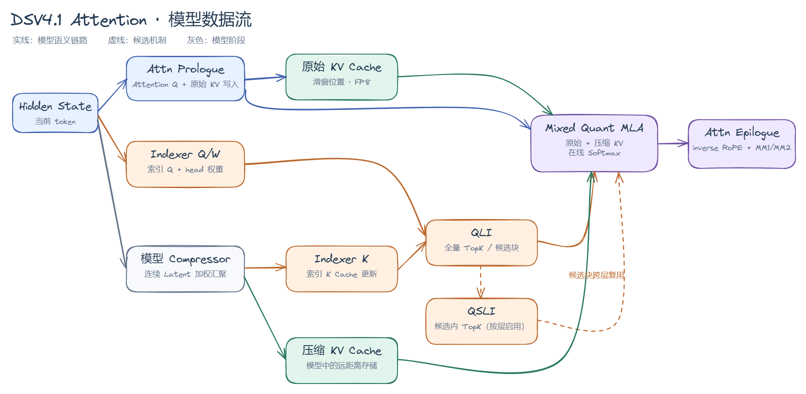

`attn_prologue` 生成 Attention Query 并更新原始 KV Cache。模型 Compressor 形成压缩 Latent，`indexer_prologue_qw` 生成索引 Query 和打分权重，`indexer_prologue_k` 生成索引 K。索引源层使用 QLI 在可见压缩位置中选择 TopK；启用候选块时，后续指定层使用 QSLI 在候选范围内重新选择。压缩 KV 和索引结果可供后续层复用。

`mixed_quant_sparse_flash_mla` 读取滑窗原始 KV 与选中的压缩 KV，两路分数使用同一归一化分母；`attn_epilogue` 对结果执行 inverse RoPE 和输出矩阵乘。

## Engram Gate

### 计算流程

模型按层配置 Engram。进入指定层的 Block 前，模型用当前 token 的 n-gram 哈希查表，再由 `wkv` 线性层把查表结果一次变换为两部分：每个 Hyper-Connections 副本各自的 Key，以及所有副本共享的 Value。`engram_gate` 接收这些已经生成的张量和残差流，计算门控并输出更新后的残差流；哈希生成、嵌入查表和 `wkv` 线性层不在该融合算子内。更新后的残差流才进入本层的 Hyper-Connections 混合、Attention 和 FFN。未配置 Engram 的层跳过整条分支。

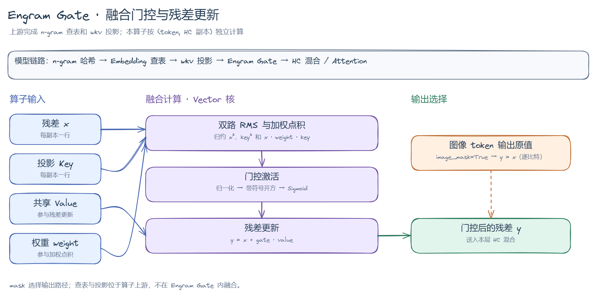

令 $t$ 为 token、$c$ 为 Hyper-Connections 副本、$D$ 为行维度。残差向量 $x_{t,c}$、Key $k_{t,c}$ 与共享 Value $v_t$ 均为 $D$ 维；权重 $w_c$ 为模型中 `q_weight` 和 `k_weight` 的逐元素乘积。每个 $(t,c)$ 行独立计算：

$$
\begin{aligned}
\mathrm{rstd}_{t,c}&=\operatorname{rsqrt}\!\left(D^{-1}\sum_d x_{t,c,d}^{2}+\varepsilon\right)\cdot
\operatorname{rsqrt}\!\left(D^{-1}\sum_d k_{t,c,d}^{2}+\varepsilon\right),\\
\mathrm{dot}_{t,c}&=\left(\sum_d x_{t,c,d}w_{c,d}k_{t,c,d}\right)\cdot\mathrm{rstd}_{t,c}\cdot D^{-1/2},\\
\mathrm{gate}_{t,c}&=\sigma\!\left(\operatorname{copysign}\!\left(\sqrt{\max(|\mathrm{dot}_{t,c}|,\delta)},\mathrm{dot}_{t,c}\right)\right),\\
y_{t,c,d}&=\operatorname{BF16}\!\left(x_{t,c,d}+\mathrm{gate}_{t,c}v_{t,d}\right).
\end{aligned}
$$

其中 $\sigma$ 为 sigmoid，$\varepsilon$ 是归一化常数，$\delta$ 是开方前的幅值下限。当 `image_mask[t]=True` 时，算子跳过该 token 的门控计算，将每个副本的 $x_{t,c}$ 直接复制到 $y_{t,c}$；输出与输入逐比特一致。

平方和、加权点积、门控及残差加法在 FP32 中计算，最后将输出转换为 BF16。

精度验证以 FP32 计算为对照，并检查图像 token 的输出与输入逐比特一致；测试覆盖二维输入、不同副本数、非 64 对齐的维度和大维度分块路径。

### Tiling 设计

Host 将前导维展平为 $T$ 个 token，以 $(t,c)$ 为一条向量任务；启动的 Vector 核数为 $B=\min(N_{\mathrm{AIV}},T H)$，每核以 $B$ 为步长处理所分配的行。当 $B$ 能被副本数 $H$ 整除时，一个核处理的各行具有相同的 $c$，因此可将该副本的权重行在行循环外搬入 UB 并持续复用；否则逐行更新对应权重。$D=5120$ 时，每份 FP32 权重行为 20 KiB。共享 Value 虽对同一 token 的各副本相同，当前行级任务仍分别读取。

$T=72$、$H=4$ 时共有 288 条向量任务。56 个 Vector 核分担这些任务，且 $56\bmod4=0$，每核可复用固定副本的权重。

单任务沿 $D$ 维以 64 个 FP32 元素为一个向量段，分别累积 $\sum x^2$、$\sum k^2$ 和 $\sum xwk$，计算一个门控值，再广播到该任务的整条残差向量。`vf(mode="raw")` 将向量加载、归约、非线性变换和输出计算组织在寄存器计算区域内。

当补齐后的行宽 $D_{64}=64\lceil D/64\rceil$ 满足实现中的 UB 容量条件 $30D_{64}\le C_{\mathrm{UB}}$ 时，完整向量行进入 UB；$D=5120$ 时这项预算为 150 KiB。行宽超过该条件时，按 UB 容量将一行切为多个 64 元素对齐的 chunk：第一遍逐块累积门控所需的三个归约量，第二遍逐块读取 $x$ 和 Value 并写出残差结果。分块路径为累加器及控制信息额外预留 8 KiB。两种路径均按副本独立计算；`image_mask=True` 的 token 在两种路径中均复制输入残差。

### 优化实现

#### 向量归约

完整行驻留路径为三个求和各保留一组 64 lane FP32 向量累加器，处理完所有向量段后才执行跨 lane 归约。门控标量在单 lane 算出后广播到整行。$D=5120$ 时每行有 80 个向量段；将跨 lane 归约延至行末，可避免在每段分别归约三个求和。累加时解包的 FP32 $x$ 保留在 UB，输出阶段直接复用，不必再次从 BF16 解包。尾部不足 64 元素时采用部分掩码。

#### Buffer 流水

输入 $x$、Key、Value 分别使用三组 UB Buffer 循环复用。当前行计算前发出后续行的 GM→UB 搬运，使后续行预取与当前行 Vector 计算交叠；输出使用两块 Buffer 交替承接相邻行，使上一行的 UB→GM 写回与当前行计算能够交叠。预取会检查下一行是否有效以及对应的 `image_mask`。`image_mask=True` 的 token 只读取 $x$ 并将其写入输出，跳过 Key、Value、权重的读取和门控计算。mask 选择与门控计算在同一 kernel 内完成；无 mask 路径省去条件分支。

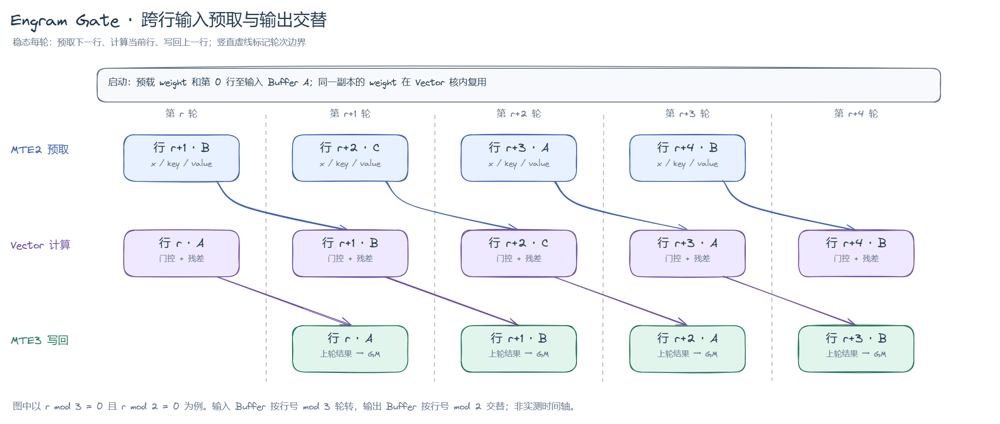

**性能结果。** 以下 kernel 时延在 Ascend950DT 上采集，设备提供 56 个 Vector 核；配置为 $D=5120$、$H=4$。`partial mask` 表示奇数 token 位置屏蔽，约占一半。每个用例采集 10 组 Device Task Duration，表中取各组目标 kernel 时长的中位数；每组目标执行前运行 256 MiB FP16 ArgMax 构造缓存状态，其时间不计入目标 kernel。

| Token 数 $T$ | mask | kernel 时延 / µs |
| ---: | --- | ---: |
| 1 | 无 | 2.8630 |
| 72 | 无 | 5.6500 |
| 128 | 无 | 8.4385 |
| 512 | 部分 | 22.1720 |
| 1024 | 无 | 43.8015 |
| 4096 | 无 | 191.2330 |
| 8192 | 部分 | 354.3730 |

## Attention Prologue

### 计算流程

`attn_prologue` 从同一份 MXFP8 Hidden State 生成 Attention Q 和原始 KV。下文的“投影”指输入与模型训练得到的权重矩阵相乘。Q 路径先用 QA 权重得到较短的中间向量，归一化、量化后得到 `qr` 和对应的 scale；QB 使用量化后的 `qr` 及其 scale，将其展开为各个 head 的 Q。另一条路径用 KV 权重生成一份供各 head 共享的向量，它在滑窗 Attention 中同时作为 Key 和 Value，并写入 Cache。算子还融合了 RoPE、量化和 Cache 更新。`qr` 供 QB 矩阵乘使用，生成的 `q` 进入后续 Attention。

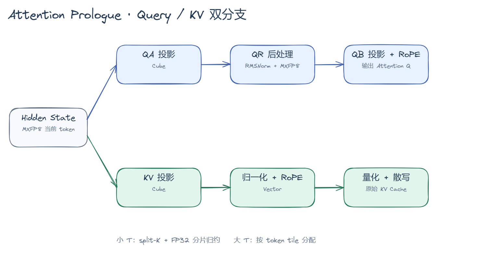

令 $\widehat X$ 和 $\widehat W$ 表示 MXFP8 输入与权重按各自 E8M0 scale 反量化后的数值，$\mathcal Q_{\mathrm{MX8}}$ 表示分组 MXFP8 量化。RMSNorm 定义为

$$
\operatorname{RMSNorm}(z;\gamma)
=\frac{z\odot\gamma}{\sqrt{\frac{1}{d}\sum_{i=0}^{d-1}z_i^2+\epsilon}}.
$$

省略 batch 和 token 下标，双分支的逻辑计算为

$$
\begin{aligned}
Q_A&=\widehat X\widehat W_{QA}^{\mathsf T},
&K_V&=\widehat X\widehat W_{KV}^{\mathsf T},\\
(QR,S_R)&=\mathcal Q_{\mathrm{MX8}}\!\left(\operatorname{RMSNorm}(Q_A;\gamma_Q)\right),\\
Q&=\operatorname{BF16}\!\left(\operatorname{RoPE}_{\mathrm{tail}}\!\left(
\operatorname{reshape}_{T,N_h,D}\!\left(\operatorname{Dequant}(QR,S_R)\widehat W_{QB}^{\mathsf T}\right)\right)\right),\\
KV_{\mathrm{ori}}&=\operatorname{FP8}_{\mathrm{scale}=1}\!\left(
\operatorname{RoPE}_{\mathrm{tail}}\!\left(\operatorname{RMSNorm}(K_V;\gamma_{KV})\right)\right).
\end{aligned}
$$

Partial RoPE 仅旋转每个 head 的末尾通道，并沿用输入 sin/cos 表的通道配对方式。KV 先执行 RMSNorm 和 RoPE，再编码为 scale=1 的 FP8；`uint8` Cache 保存 FP8 编码字节。QB 使用量化后的 QR 和对应 scale 执行矩阵乘。

性能用例固定 $T=72$、Hidden 维 $H=5120$、低秩维 $R=1280$、Query head 数 $N_h=64$、head 维 $D=512$、旋转尾部 $D_r=64$。因此 QA 将 5120 维变为 1280 维，QB 再将 1280 维变为 $64\times512$ 维，KV 则将 5120 维变为一份 512 维向量。Cube 的 M 维内部补齐为 80，输出及 Cache 写入仍只覆盖真实的 72 行。实现按 A1 投影、A2 归约与后处理、B 投影与后处理三个阶段组织：

| 阶段 | 计算与主要结果 | 数据依赖 |
| --- | --- | --- |
| A1 | 同一 X 执行 QA、KV 两个 MXFP8 矩阵乘，FP32 分片结果写入 Workspace | QA/KV 可复用 X |
| A2 | 按原 K 顺序归约分片结果；QA 经 RMSNorm 与 MXFP8 生成 QR/scale，KV 经 RMSNorm、Partial RoPE、FP8 编码后散写 Cache | 等待 A1 写完分片结果 |
| B | QR/scale 与 QB 权重进行 MXFP8 矩阵乘，Partial RoPE 后输出 BF16 `Q[T,64,512]` | 等待 A2 发布 QR/scale |

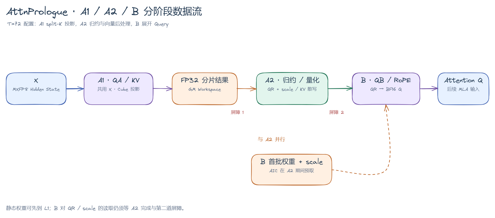

权重逻辑形状分别为 `Wqa[1280,5120]`、`Wkv[512,5120]`、`Wqb[32768,1280]`，按 `[输出维,归约维]` 记；矩阵乘使用其转置。权重及尺度在计算前打包，常规计算使用 `FRACTAL_NZ`，连续面板实验使用专门预排布局。`cache_index` 确定 KV 写入位置。

### Tiling 设计

实现针对 Decode 与 Prefill 提供 `split_k`、`split_t` 两类模板：前者在较小 T 时切分 QA/KV 的归约轴，各片将 FP32 结果写入 GM Workspace，再由 A2 归约；后者在较大 T 时沿 token tile 与输出列分配任务。当前模板选择规则以 `T≤256` 选择 `split_k`。以下分块数值对应 T=72、32 AIC / 64 AIV 的配置。

A1 把 K=5120 切为 8 份，每份 K640，再拆为两个 K320 Cube 块。QA 有 20 个 N64 输出块，KV 有 8 个；两支合成 28 个输出任务，划为 4 个 N 分组，每组处理 7 个任务。每个 K 分片与 N 分组的组合分配给一个 AIC，因此 $8\times4=32$ 个任务覆盖可用 AIC。每个 AIC 在负责的 QA/KV 列块之间复用 X。按 M 补齐 80 行，存放 FP32 分片结果的 Workspace 为

$$
B_{A1}=8\times80\times(1280+512)\times4=4{,}587{,}520\ \mathrm B.
$$

B 阶段每个 AIC 负责两个 head，各 head 的 512 列分成两个 N256 面板；K=1280 分成四个 K320 消费块。一个 FP8 权重面板占 $256\times320=80\,\mathrm{KiB}$，四个 L1 权重槽共 320 KiB。Cube 仍按 N64 计算，一个 QR K320 的 L0A 块可连续服务同一 N256 面板内的四次 MMAD；该 head 的 K scale 槽大小为 $512\times(320/32)=5\,\mathrm{KiB}$，由两个 N256 组共享。

| 片上资源 | T=72 资源占用 / 容量 | 分配说明 |
| --- | ---: | --- |
| L1 | 496000 / 524288 B | 权重预取、QR 驻留与尺度槽共同占用 |
| L0A 双槽 | $2\times80\times320=51200$ B | K640 双槽超过 64 KiB |
| L0B 双槽 | $2\times64\times320=40960$ B | 对应 N64/K320 消费块 |
| A2+B UB | 240768 / 262144 B | 批量归约占用更多 UB 空间 |

L1 权重面板和 L0 计算块可以采用不同粒度。增大 GM→L1 请求时，还要检查拆分消费、scale 覆盖范围与 Buffer 释放时刻。

split-K=4 的配置可将 Workspace 减半，同时调度转为 7 个 N 分组、28 个有效 A1 任务，K1280 的 X 需要分段装入 L0A。X 有效数据的 GM→L1 搬运从 1.5625 MiB 增至 2.734375 MiB，L1→L0A 从 1.5625 MiB 增至 10.9375 MiB。该路径已通过精度验证，性能排序仍需设备时延数据。

### 优化实现

#### 输入驻留与权重搬运

A1 联合调度 QA/KV，使每个 AIC 的 X K640 分片在两支投影之间复用，并驻留在两个 K320 L0A Buffer 中。实验字节模型中，X 与 scale 的 GM→L1 搬运由 3,379,200 B 降至 1,689,600 B，X 有效数据的 L1→L0A 搬运由 11,468,800 B 降至 1,638,400 B。四个 N 分组仍各自读取 X；复用发生在单个 AIC 内。

B 的 QR 数据驻留 L1 后，L1→L0A 搬运仍会随 N64 计算块重复发生。将 B 面板从 N128/K1280 调整为 N256/K640，并让同一 QR 块连续服务四个 N64 MMAD，QR 的 L1→L0A 总量由 50 MiB 降至 12.5 MiB；该轮完整算子时延为 56.9290→55.2675 µs。后续 4 Buffer 循环方案保留 N256 内复用，并用 K320 权重面板让 Buffer 更早释放。

Wqb 权重数据合计 40 MiB，scale 为 1.25 MiB。早期每个 N64/K320 计算块分别读取权重与 scale，产生 `2048×20 KiB` 权重请求和 `2048×640 B` scale 请求。先把 scale 合并为 `64×20 KiB`，再把权重合并为 `256×160 KiB`，减少 DMA 请求与调度开销，权重总字节数保持不变。160 KiB 大块使 Buffer 释放变晚，因此后续改为 4 个 80 KiB Buffer，按 K320 面板的消费顺序循环预取。

#### 4 Buffer 循环与跨阶段流水

权重由 2 个 160 KiB Buffer 改为 4 个 80 KiB Buffer，总 L1 占用不变；scale 配置 4 个 5 KiB Buffer，分别对应 4 个 K320 分组。当前 head 的第一个 N256 组完成某 K 面板的 L1→L0 读取后，释放该权重 Buffer，并用它预取第二组的同 K 面板；scale Buffer 此时仍供第二组使用。第二组读取完成后，scale Buffer 才能复用到下一 head。4 个 Buffer 按消费顺序循环使用；最后一个 head 不发出越界预取，Channel 的就绪与释放约束防止覆盖尚在使用的 L1 数据。

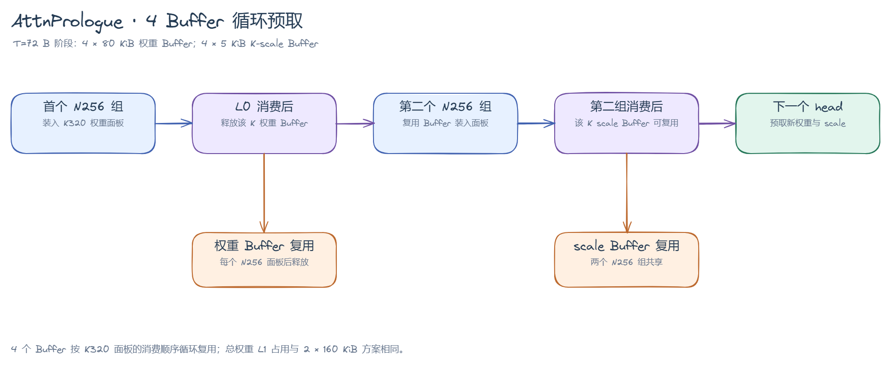

仅运行 B 阶段的单核仿真保持 64 次 MMAD 和 1,457,280 B 有效 GM→L1 数据不变，数据搬运窗口内部空隙由 2695 cycles 降至 0，Cube 内部空隙由 4754 降至 1096 cycles；完整 32 核算子的同轮时延为 55.4735→53.9810 µs。“0 gap”对应 B 阶段仿真的数据搬运窗口；完整算子还包含 A1、A2 和全核屏障。

N128/K320 的 8 Buffer 方案在同轮冷缓存对照中由 53.712 µs 增至 55.913 µs；N512/K320 的 2 Buffer 方案由 53.6845 µs 增至 54.4900 µs。后者的数据搬运窗口同样没有内部空隙，但首次 Cube 计算启动更晚，说明面板选择还受计算启动时间与 Buffer 复用时机约束。

A1 写完分片结果并经过第一道全核屏障后，AIV 执行 A2 归约、归一化与量化；同时 AIC 预取 B 阶段首批权重与 scale，这些数据不依赖 QR。第二道屏障之后 B 才读取 QR/scale。首批每核预取四块 80 KiB 权重与四块 5 KiB scale。该轮完整时延为 55.1205→53.0900 µs；两个数据依赖屏障仍保留。

#### 连续权重面板

全矩阵 `FRACTAL_NZ` 布局下，一个 N256/K320 面板由十段跨步的 8 KiB 数据组成。实验将面板内部 NZ 字节保持原次序，再把 512 个面板预排为连续 ND 字节矩阵 `[512,81920]`，使每个 80 KiB 面板可连续搬入；Cube 内部仍按 NZ 消费。该轮完整时延为 52.5440→50.3880 µs。预排须在权重加载阶段完成；CPU 预排单次约 40.992 ms。按同轮每次节省 2.156 µs 估算，约需 1.9 万次调用摊销准备成本。表中收益对应权重在加载阶段预排并复用的场景。

#### A2 批量归约

A2 原先逐份加载 8 个 split-K 分片结果，每份调用一次 VF，并反复读写 UB 中的累加值。批量版对每个 token、每条分支用一次 strided DMA 装入全部分片结果，在一个 VF 内按 split 0→7 的原 FP32 加法顺序归约。T=72 的 Workspace DMA/VF 调用数由 1152/1152 降至 144/144；有效 GM 分片数据读取仍为 4,128,768 B，UB 归约读写量由 11,870,208 B 降至 4,644,864 B。所测配置的 Q、QR、scale 与完整 Cache 同对照逐字节一致，并通过独立 FP64 值域判据。

**完整算子性能。** 下表记录 T=72、32 AIC 的特化实现所做的七轮优化实验。每行分别在同一轮测试中测量修改前后的完整算子时长，单位 µs。不同轮次的基线会变化，各行降幅分别对应本轮修改。

| 优化措施 | 同轮基准 | 同轮候选 | 耗时下降 |
| --- | ---: | ---: | ---: |
| scale 合并搬运 | 71.8405 | 71.3190 | 0.73% |
| 权重合并搬运 | 71.6850 | 61.8315 | 13.75% |
| N256 面板与 L0A 复用 | 56.9290 | 55.2675 | 2.92% |
| 4 Buffer 循环与 K scale 预取 | 55.4735 | 53.9810 | 2.69% |
| A2 期间预取 B | 55.1205 | 53.0900 | 3.68% |
| B 连续 panelpack | 52.5440 | 50.3880 | 4.10% |
| A2 批量归约 | 49.5785 | 49.1355 | 0.89% |

末行冷缓存差值较小，统计显著性尚未确认；同轮未主动清 L2 的 33.3240→30.8115 µs 属于另一采集条件。

测试设备为 Ascend 950PR，使用 32 AIC / 64 AIV。冷缓存测试在每次目标 kernel 前执行 256 MiB FP16 ArgMax，取 10 次目标 kernel 的 NPU 时长中位数，并以极差与中位数之比不超过 10% 验收；热缓存另作预热和重复采样。A2 批量归约对应的冷缓存时延为 49.1355 µs，未主动清 L2 的时延为 30.8115 µs，分别对应两种采集条件。

以 $T=72$ 计算，必要矩阵乘的有效工作量为 $F=2T(HR+HD+RN_hD)=7{,}361{,}003{,}520$ FLOPs。必要 IO 模型取 $B_{\mathrm{useful}}=57{,}990{,}784$ B。以 1.6 TB/s 名义带宽和 32 AIC 的 865.0752 TFLOP/s FP8 算力作参考，49.1355 µs 对应的模型带宽利用率（MBU）为 73.76%，模型算力利用率（MFU）为 17.32%。这两个指标由模型工作量和时长计算；1.6 TB/s 用作参考分母，设备认证带宽峰值尚未获得。

4 Buffer 循环、连续面板和 A2 批量归约的时延分别对应表中的测试配置。性能结果覆盖 T=72 的算子调用，不包含其他 token 数与整模型的时延。

## Indexer Prologue QW

### 计算流程

`indexer_prologue_qw` 在同一个融合 kernel 中计算索引 Query 和每个索引 head 的打分系数。Q 路径使用 MXFP8 `QR` 和 `wqb` 完成矩阵乘，只对每个 head 末尾的 $D_r$ 个通道执行 RoPE，再按 MXFP4 E2M1 量化，输出 `q` 和 E8M0 scale `descale_q`。W 路径使用 BF16 Hidden State `X` 和 `ww` 完成矩阵乘，在 FIXPIPE 阶段乘以 `softmax_scale`，输出 FP32 系数 `w`。完整 head 路径直接写出 W 结果；小 $T$ 路径先归约各核的部分和。Q 路径的 FP32 结果由 FIXPIPE 送给两个 AIV，分别完成半个 token tile 的 RoPE 和量化。

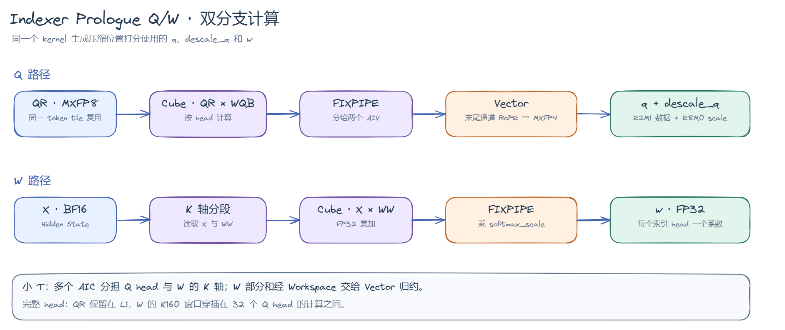

设 $\alpha$ 为 `softmax_scale`，$\mathcal D$ 表示按 E8M0 scale 还原 MXFP8 数值，$\mathcal Q_4$ 表示每 32 个元素一组的 MXFP4 量化。两条分支的计算关系为

$$
\begin{aligned}
Y_Q&=\mathcal D(QR,S_{QR})\,\mathcal D(W_{QB},S_{QB})^{\mathsf T},\\
(q,S_q)&=\mathcal Q_4\!\left(\operatorname{RoPE}_{\mathrm{tail}}\!\left(\operatorname{reshape}(Y_Q)\right)\right),\\
w&=\alpha\,\bigl(XW_W^{\mathsf T}\bigr).
\end{aligned}
$$

典型计算形状为 Hidden 维度 $H=5120$、`QR` 维度 $R=1280$、索引 head 数 $N_h=32$、每个 head 的维度 $D=128$、RoPE 通道数 $D_r=64$。对 $T$ 个 token，Q 路径生成打包结果 `q[T,32,64]` 和 scale `descale_q[T,32,2,2]`，W 路径生成 `w[T,32]`。RoPE 只处理每个 head 的末尾 64 个通道；每个输出字节保存两个 E2M1 元素。量化编码使用 Vector 寄存器操作和查找表。权重预先存储为 `FRACTAL_NZ`，供 Cube 直接读取。

### Tiling 设计

沿 token 轴每 128 行构成一个 tile。Q 路径每次计算一个完整的 head，矩阵基本块为 $M128\times N128$，K 轴每次计算 128 个元素。`QR` 及其 scale 在 L1 中保留，供同一 tile 的各个 head 复用。FIXPIPE 将 Q 的结果按 token 行分给两个 AIV，每个 AIV 处理最多 64 行。Q 的 L0C、跨核 UB 与 Vector 输出缓冲采用双缓冲，使相邻 head 的矩阵乘和量化处理交错执行。

令 $N_T=\lceil T/128\rceil$。默认配置在 $N_T<25$ 时将 32 个 head 分为 16 组，由多个核处理同一个 token tile；从 $N_T=25$ 起，各核沿 token 轴领取任务并处理完整的 32 个 head。Host 根据 $T$ 选择计算模板，模板内的有效 token 数由 Device 在运行时读取，减少相近形状重复编译。

### 优化实现

#### Q/W 交替计算

完整 head 路径将 W 的 5120 维归约轴划分为 32 个 K160 窗口。每处理一个 Q head，就搬入一个窗口的 `X` 和 `ww`，用两次 K80 的 BF16 矩阵乘将结果累计到 W 的 FP32 L0C。Q 路径同时处理该 head 的 MXFP8 矩阵乘；`QR` 保留在 L1，`wqb` 按 K 窗口搬入。这样，W 的输入搬运分布在 Q 的 head 循环中。W 的 FP32 累加结果在处理完整个 head 循环后，经 FIXPIPE 乘以 `softmax_scale` 并写出。

#### 小 T 的 W 归约

小 $T$ 路径由同一 token tile 的多个核分别处理 W 归约轴的一段。每个核经 FIXPIPE 缩放部分和并写入 GM Workspace；各核完成计算后，Vector 按行块读取部分和、求和并写出 `w`。各核分担 `X` 的读取量，减少单个核的搬运工作。在单核只处理一个 Q head 的情况下，`wqb` 使用较短的 L1 K 窗口，使当前 head 的权重加载与矩阵乘交错。跨 tile 路径还可在当前 tile 的最后一个 Q 矩阵乘后预取下一 tile 的 `QR`。

**完整算子性能。** 下表记录不同优化步骤的同轮测量。测试形状为 $H=5120$、$R=1280$、$N_h=32$、$D=128$、$D_r=64$，使用 Ascend 950 的 32 个 AIC。每个配置采集 20 次 Device Task Duration，表中取最小值。各行对应独立对照，时延变化按该行的两个数值计算。

| 优化步骤 | $T$ | 对照时延 | 优化后时延 | 变化 |
| --- | ---: | ---: | ---: | ---: |
| W 路径的 L0 K 步长由 32 增至 80 | 4096 | 80.25 µs | 70.33 µs | 下降 12.4% |
| 将 Q head 分配给多个 AIC | 128 | 67.80 µs | 21.03 µs | 3.2× |
| 将 W 归约轴分给多个 AIC，缩短单 head 的 `wqb` 加载窗口 | 72 | 14.55 µs | 10.30 µs | 1.41× |
| 将 W 归约轴分给多个 AIC，缩短单 head 的 `wqb` 加载窗口 | 128 | 21.03 µs | 12.17 µs | 1.73× |
| 调整 Q 路径 L2 hint，跨 tile 预取 `QR` | 8192 | 143.99 µs | 137.14 µs | 下降 4.8% |

这些测量中，小 $T$ 的 W 部分和通过 FIXPIPE `atomic_add` 合并。当前实现将部分和写入 Workspace，再由 Vector 归约；上表记录相应优化步骤的历史性能。按 MXFP8 865 TFLOP/s、BF16 433 TFLOP/s 的参考算力计算，$T=4096$ 的测量对应约 75% MFU；$T=8192$ 的测量对应约 76.9% MFU。MFU 由矩阵乘工作量、参考算力和 Device 时长换算。

## Indexer Prologue K

### 计算流程

`indexer_prologue_k` 从压缩 Latent 生成索引 K，供 Lightning Indexer 对压缩位置打分。算子由同一 Stream 上的两个 NPU kernel 组成：Cube kernel 完成 BF16 投影，Vector kernel 完成 RMSNorm、尾部 RoPE、MXFP4 打包，并按 `cache_index` 直接写入 K Cache。两个 kernel 顺序执行，中间投影结果存放在 GM；量化结果直接写入 Cache，省去打包结果的 GM 中间量和独立的散写 kernel。

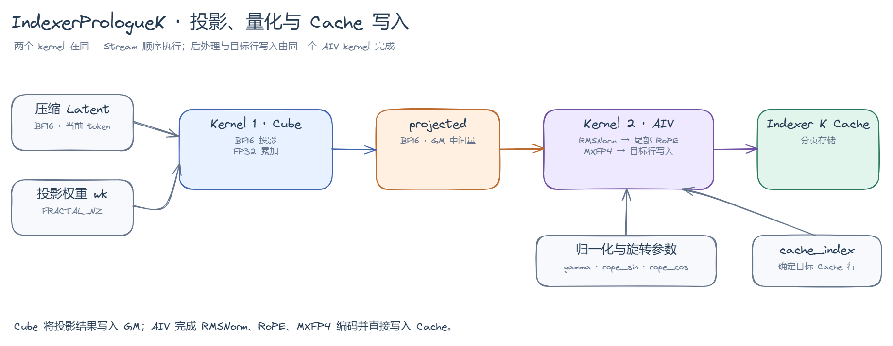

Cube 使用 FP32 累加，将每个 token 的投影结果写为 BF16：

$$
P[t,d]=\operatorname{BF16}\!\left(\sum_h L[t,h]W_{IK}[d,h]\right).
$$

Vector 对每行投影结果执行 RMSNorm，归一化结果舍入为 BF16：

$$
r_t=\left(\frac{1}{D}\sum_d\operatorname{FP32}(P[t,d])^2+\epsilon\right)^{-1/2},\qquad
N[t,d]=\operatorname{BF16}\!\left(\operatorname{FP32}(P[t,d])r_t\gamma[d]\right).
$$

RoPE 只处理最后 $D_r$ 个通道，按相邻偶数和奇数通道配对。设 $x$ 为这段通道内的归一化结果，$c_k$ 和 $s_k$ 为当前 token 的 RoPE 系数，则

$$
\begin{aligned}
x'_{2i}&=x_{2i}c_{2i}-x_{2i+1}s_{2i},\\
x'_{2i+1}&=x_{2i+1}c_{2i+1}+x_{2i}s_{2i+1}.
\end{aligned}
$$

RoPE 运算使用 FP32，随后舍入为 BF16。MXFP4 将每 32 个元素组成一组。设 $z_j$ 为一组中的 BF16 元素，scale 取下式对应的 2 的幂，并编码为 E8M0：

$$
a_g=\max\left(6\cdot2^{-126},\max_{j\in g}|z_j|\right),\qquad
s_g=2^{\lceil\log_2(a_g/6)\rceil}.
$$

组内元素除以 $s_g$ 后编码为 E2M1，两个 4-bit 编码存放在一个字节。每个 token 产生 $D/2$ 字节量化 K 和 $D/32$ 字节 scale。投影、RMSNorm 和 RoPE 后的 BF16 舍入位置保留在流水中，使量化输入与模型计算一致。

### Tiling 设计

Cube 投影采用 `M=16、N=64、K=128` 的矩阵块；当输出维度不能按 64 分块时，N 改为 16；当输入维度不能按 128 分块时，K 改为 16，以满足 `FRACTAL_NZ` 的 16×16 分形边界。输入 Latent 经 ND2NZ 搬入 L1/L0A，权重搬入 L1/L0B；尾块补零，L0C 的 FP32 累加结果舍入后写入 GM。L1 和 L0 数据搬运使用双 Buffer。

投影输出块数为 $\lceil T/16\rceil\lceil D/N_{\mathrm{tile}}\rceil$，Cube 核数取该块数与可用 AIC 数的较小值。各 AIC 循环处理分配到的输出块。$T=72$、$D=128$ 时共有 10 个输出块，使用 10 个 AIC。

Vector kernel 对归属本核的 token 完成整条后处理链。`projected` 通过双 Buffer 的 UB Channel 分段读取；每个 AIV 读取一次归一化权重。Vector 在计算前检查 `cache_index` 和目标行归属，随后执行 RMSNorm、RoPE、量化及 Cache 写入。

### 优化实现

#### 目标行分核与 Cache 写入

`cache_index[t]` 指定 token $t$ 的目标 Cache 行，值为 `-1` 时跳过。分离存储模式按目标行分核；联合记录模式将 $G$ 个 token 存入一条 Cache 记录，按联合记录行分核：

$$
\begin{aligned}
\mathrm{owner}_{0}(t)&=\mathrm{cache\_index}[t]\bmod B_0,
&B_0&=\min(N_{\mathrm{AIV}},T),\\
\mathrm{owner}_{1}(t)&=\left\lfloor\frac{\mathrm{cache\_index}[t]}{G}\right\rfloor\bmod B_1,
&B_1&=\min\left(N_{\mathrm{AIV}},\left\lceil\frac{T}{G}\right\rceil\right).
\end{aligned}
$$

每个 AIV 按 token 输入顺序扫描索引，仅处理归属本核的目标行。相同目标行的多次写入由同一 AIV 依次执行，最终保留最后一个 token 的结果；联合记录中的多个位置也由同一 AIV 写入。每个 AIV 都扫描全部 $T$ 个索引，索引扫描量随 $T\times B$ 增长。

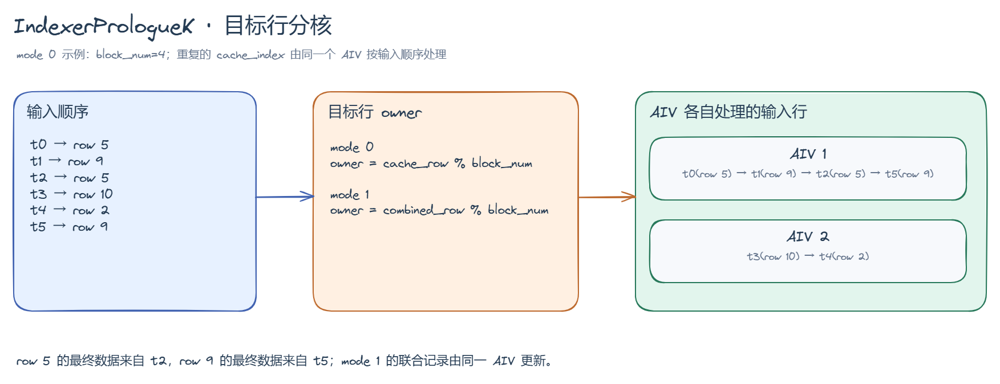

分离存储模式在独立区域保存 K 和可选的 scale。联合记录模式先连续保存 $G$ 个 token 的 E2M1 数据，再保存 $G$ 个 scale；QSLI 使用 $G=8$ 的记录。$D=128$ 时，一条记录包含 512B 量化 K 和 32B scale。Cache 的首维可以采用非连续 stride，编译后的寻址直接使用该 stride。

#### 非对齐数据处理

RoPE 从 $D-D_r$ 通道开始。起点按 8 个元素对齐时，Vector 直接读取并拆分偶数、奇数通道；其余情况先执行非对齐读取，再通过带前缀的临时 Buffer 合并写入数据，最终执行对齐写入。

当 $D\bmod64=32$ 时，FP4 数据行末尾有 16B，Vector 使用 `scalar.vec_store_bypass` 完成逐字节写入，并在写入前执行 `vec_sync_all()`。量化结果先放入 32B 对齐的临时行，随后写入目标 Cache，避免短写覆盖相邻数据。

**完整算子性能。** 以下数据来自 Ascend950DT 上 $T=72$、$H=512$、$D=128$、$D_r=64$ 的五组测试。每组执行 10 次相邻的预热与目标计算，将目标 kernel 的 Task Duration 求和，再取中位数。表中各列来自不同采集会话，单次会话内的样本极差为 17%～32%。

| 场景 | 三 kernel 基线（μs） | 目标行分核（μs） | 融合后处理与写入（μs） | 融合及运行时核数（μs） | 加速比 |
| --- | ---: | ---: | ---: | ---: | ---: |
| `mode0_bs64_scale` | 18.988 | 13.050 | 9.850 | 10.354 | 1.83× |
| `mode0_bs128_noscale` | 20.163 | 12.361 | 9.493 | 8.059 | 2.50× |
| `mode1_bs64_g8` | 12.285 | 12.331 | 10.405 | 10.557 | 1.16× |
| `mode1_bs128_g8` | 12.095 | 12.747 | 10.347 | 10.648 | 1.14× |
| `mode0_bs64_strided` | 19.385 | 12.917 | 9.643 | 9.200 | 2.11× |

`mode0` 基线的散写由单个 AIV 执行，目标行分核缩短了这一步的耗时；`mode1` 基线已按联合记录行分核，后处理与写入融合贡献了主要收益。五组测试的加速比几何平均值约为 1.66×。运行时核数根据设备可用核心及流控配额确定；性能数据对应投影 10 个 AIC、分离存储模式后处理 56 个 AIV，以及联合记录模式后处理 9 个 AIV。

## Quant Lightning Indexer

### 计算流程

QLI 沿全部可见的压缩 Key 位置扫描。Q/K 的打包 MXFP4 数据及分组尺度进入 Cube，FP32 累加结果经 FIXPIPE 转为 BF16，再由 Vector 完成 ReLU、head 权重乘加、head 归约和 TopK。设解码后的量化向量为 $\widehat Q_{q,h,d}$、$\widehat K_{t,d}$，则

$$
\begin{aligned}
A_{q,h,t}&=\sum_{d=0}^{D-1}\widehat Q_{q,h,d}\widehat K_{t,d},\\
s_{q,t}&=\sum_{h=0}^{N_1-1}w_{q,h}\operatorname{ReLU}(A_{q,h,t}),\\
\mathcal I_q&=\operatorname{TopK}_{K_{\mathrm{top}}}
  \{(s_{q,t},t)\mid t\in\mathcal V_q\}.
\end{aligned}
$$

可见集合 $\mathcal V_q$ 由有效长度、因果 mask 和压缩路径的分组大小共同确定；启用压缩时 $r\geq1$，未完成的压缩组不进入选择。有效零分数与无效位置由独立 mask 区分，缺少的索引填 $-1$。TopK 将 BF16 分数转换为保持顺序的 UINT16 排序键，在 Vector 端流式选择。

### Tiling 设计

QLI 的执行组织依次围绕三个环节调整：将连续 256 个 Key 从两轮 N128 合并为一轮 N256，并沿 M 轴拆成两次 M96 以保留 L0C 双缓冲；调整 FIXP→Vector 的 UB 布局和 Channel 供给；最后让分数、直方图与 TopK 的交接减少往返和等待。以下结构实验比较相邻配置，完整实现的 64.709µs 为独立多轮复测，不能将两类结果的差值归因于单项改动。

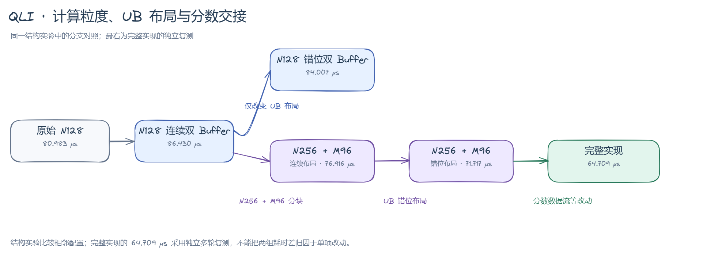

典型 $N_1=32$、每任务六行 Query 时，逻辑计算块为 $M=6\times32=192$、$N=256$、$D=128$。Cube 将 M 轴拆为两次 $96\times256$ 计算，复用同一份 K tile。每份 FP32 L0C 结果占 $96\times256\times4=96$ KiB；两份 L0C 形成双缓冲，使 MAC 和 FIXP 在相邻 tile 上交错。两个 AIV 分别处理三行 Query，分片任务各自产生局部 TopK，必要时再合并。

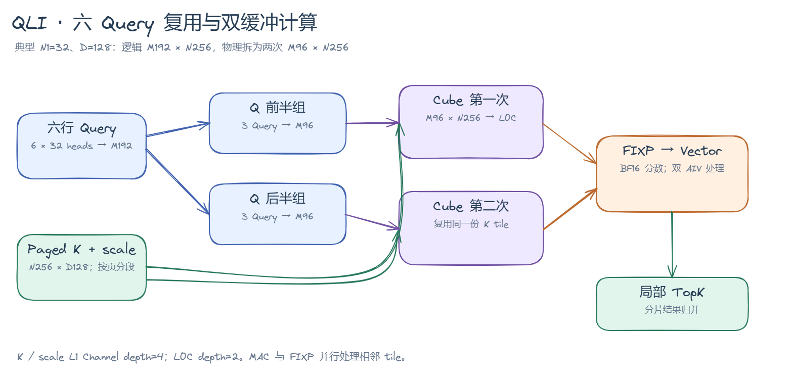

连续 256 个 Key 在 N128 组织下分两轮处理，每轮计算 M192×N128，并重新准备相应的权重与归约状态。N256 将同一范围并入一轮：同一份 K[256,128] 供 Q0～Q2、Q3～Q5 两个 M96 半块复用。若直接采用 M192×N256 的双缓冲，L0C 需求将从 192 KiB 增至 384 KiB。

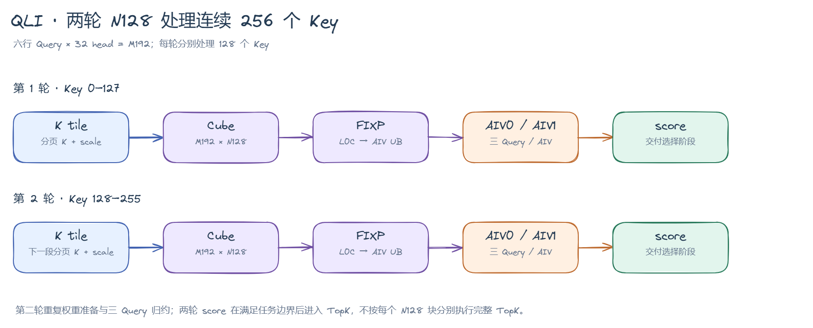

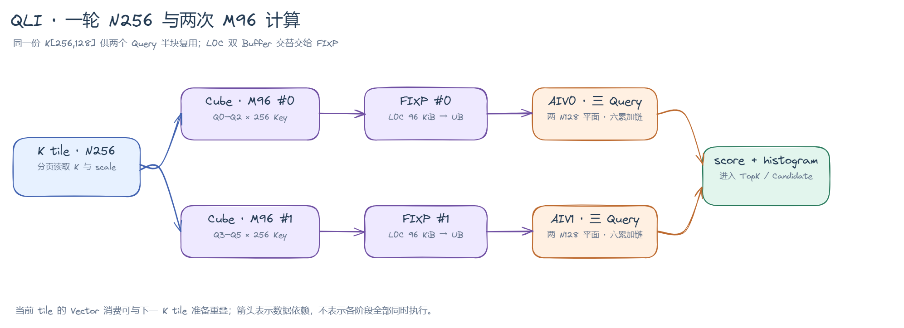

Vector 将 N256 分为两个 128-token 平面。每个 AIV 对三行 Query 的两个平面各维护一条累加链，共六条；同一个 head 权重供两个平面使用。按三行 Query、32 个 head 和 256 个 Key 计，128-lane BF16 乘加次数仍为 192，权重广播或寄存器选择次数由 192 减为 96，head 循环迭代由 64 减为 32。分数在任务边界就绪后进入 TopK，不按每个 N128 块分别执行一次完整 TopK。

在 B12 / S1=6 / S2=64K、Candidate 关闭、相同连续布局和双缓冲条件下，计算基本块的受控对照为：

| 分块配置 | 主 kernel 均值 | 耗时下降 | 加速比 |
| --- | ---: | ---: | ---: |
| 六 Query / N128 | 86.430µs | - | - |
| 六 Query / N256＋M96 分块 | 76.916µs | 11.01% | 1.124× |

该对照同时改变 N、M 分块和 Vector 归约组织；Vector 活跃时间由 66.307µs 降至 44.106µs，下降 33.48%。这些管线活跃时间来自完整 kernel，不能与其他管线时长相加。完整实现的组合收益另见本算子性能表。

对于 Paged K，令物理页长为 $P$，每次搬运的页内段长取 $R=\gcd(256,P)$。第 $i$ 段从逻辑位置 $t_i=t_{\mathrm{tile}}+iR$ 开始，其物理地址为

$$
a_i=\operatorname{block\_table}\!\left[b,\left\lfloor t_i/P\right\rfloor\right]
S_{\mathrm{page}}+(t_i\bmod P)S_{\mathrm{token}}.
$$

K 与 scale 分别使用自身存储步长；$P=128$ 时一个 N256 tile 分两段读取，$P=64$ 时分四段。支持的 PA 页长为不超过 1024 的正 16 倍数，搬运段均按实际页长和 stride 生成；轴 0 非连续时无需预先创建连续副本。`produce()` 与 `consume()` 推进各自通道的生产消费位置，配合 tile 预取维持 Cube 与 FIXP 的供给。

### 优化实现

#### Channel 供给与流水

片上资源按输入复用与计算消费的距离配置。Channel 深度表示同一通道可容纳的在途数据份数；QK UB 使用显式 Buffer 双缓冲。

| 资源 | 当前实现组织 | 流水作用 |
| --- | --- | --- |
| Q / Q scale L1 | 各自 `Channel(depth=2)` | 任务输入准备与复用 |
| K / K scale L1 | 各自 `Channel(depth=4)` | 为连续 N tile 提供预取余量 |
| 两份 L0A | 各为 `Channel(depth=1)`，容纳一个 M96 Query 半块 | 同一逻辑任务内驻留 |
| L0B | `Channel(depth=2)` | 当前计算与下一次加载周转 |
| L0C | `Channel(depth=2)`，每份 M96×N256 FP32 | MAC 与 FIXP 并行消费 |
| QK UB | 显式双缓冲 | FIXP 写入与 Vector 读取交接 |

DSL 通过 Channel 的存储位置、形状和深度描述片上数据通道。QLI 的 K 与 L0C 通道可概括为：

```python
self.k_l1 = Channel(
    MemLoc.L1, (QK_COLUMNS, LOGICAL_D), dtypes.fp4x2_e2m1,
    depth=4, data_format="nz",
)
self.l0c = Channel(
    MemLoc.L0C, (self.tile_m // 2, QK_COLUMNS),
    dtypes.float32, depth=2,
)
```

以下两张时间轴显示性能分析记录中的原始事件。第一组固定 N128 和 L0C 双缓冲，仅改变 QK Channel 深度：depth=3 和 depth=2 的 FIXP 活动跨度分别为 59.178µs、65.582µs，后者出现 5.472µs 间隙。第二组固定数据布局，比较 N128 与 N256＋M96 分块：FIXP 活动跨度由 64.967µs 缩至 54.328µs，间隙由 4.721µs 变为 0。时间轴只用于观察数据供给是否连续，不代表完整算子的平均时长。

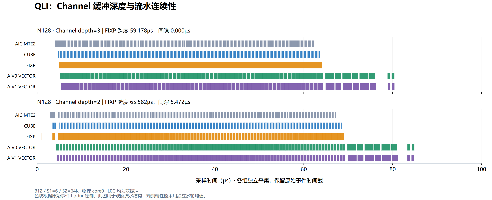

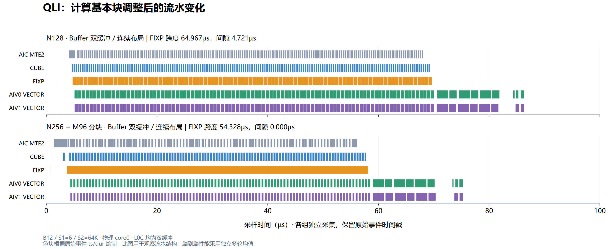

#### QK UB 错位布局

FIXP 向每侧 AIV 的 QK UB 写入 BF16 分数。每行有效数据为 128 个 BF16，即 256 B；布局的行步长设为 256 个 BF16，即 512 B。两份显式 Buffer 的基址分别为 0 B 和 256 B，使相邻 Buffer 的 FIXP 写入与 Vector 读取落在不同的 UB bank 相位。L0C 的 `Channel(depth=2)` 管理结果轮转；QK UB 的地址由算子显式配置，跨核交接仍遵守写入完成后消费、消费结束后才覆盖的就绪与释放关系。

在相同 N256＋M96 分块下，仅改变 QK UB 布局的受控对照为：

| QK UB 布局 | 主 kernel 均值 | FIXP 活跃时间 |
| --- | ---: | ---: |
| 连续双 Buffer | 76.916µs | 54.418µs |
| 错位双 Buffer | 71.717µs | 49.447µs |

主 kernel 下降 6.76%，FIXP 活跃时间下降 9.13%。在 N128 分支上，原始配置、连续双 Buffer 和错位双 Buffer 分别为 80.983µs、86.430µs 和 84.007µs；这组结果表明缓冲布局的收益取决于计算粒度和消费速度。

#### 分数驻留、直方图与选择

QLI 将 BF16 分数编码为可排序的 UINT16 值，并在编码时统计高字节直方图。TopK 直接使用这份统计结果，省去一次全量扫描。Candidate 输出关闭、TopK512 等条件满足时，分数可保留在 UB，避免 `UB→GM→UB`；每行最多容纳 25,600 个 token。是否启用这条路径还取决于 Query 任务是否完整、M 维容量、有效 token 数和内部比较所需的数据；其余任务使用 GM Workspace。

对只包含一个 Key 分段的任务，选择阶段跳过多段任务才需要的历史结果处理。直方图采用独立累加链；生成分数键时同步累计直方图，下一分段的分数读取则提前发出，使加载与当前选择交错。`return_value=False` 时不写出用户未请求的分数，但 TopK 内部仍保留用于比较的分数位。

开启候选输出时，QLI 同时计算位置级 TopK 与八位置块的最大分数：

$$
B_b=\{8b,\ldots,8b+7\},\qquad
c_b=\max_{t\in B_b\cap\mathcal V_q}s_{q,t}
\quad(B_b\cap\mathcal V_q\ne\varnothing).
$$

对有效 $c_b$ 执行块级 TopK，供后续索引层的 QSLI 使用。当前可见位置所在的未满块可通过选择阶段的特殊高分标记保留；完全不可见的块不参与选择，空缺输出填 $-1$。例如可见长度为 8191、块长为 8 时，有效块数为 1024，最后一块仅有七个有效位置；即使输出容量为 2048，也不能将剩余块纳入选择。块级与位置级选择共用一次 QK 分数计算。

**完整算子性能。** 测试配置为 B12 / S1=6 / N1=32 / D128 / PA128 / TopK512、`mask_mode=3`、`cmp_ratio=2`。每组预热 3 次、有效执行 1000 次，三轮测试按主 kernel 均值统计：

| Candidate 输出 | S2 | 优化前 | 当前实现 | 耗时下降 | 加速比 |
| --- | ---: | ---: | ---: | ---: | ---: |
| 关闭 | 64K | 81.285µs | 64.709µs | 20.39% | 1.256× |
| 关闭 | 128K | 153.343µs | 125.163µs | 18.38% | 1.225× |
| 开启 | 64K | 148.389µs | 97.679µs | 34.17% | 1.519× |
| 开启 | 128K | 284.943µs | 184.232µs | 35.34% | 1.547× |

这些数据反映六 Query 任务组织、N256/M96 计算分块、Channel 流水和分数交接的组合效果。

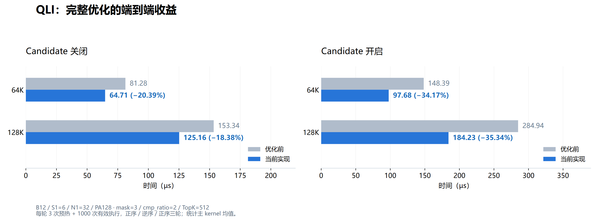

## Quant Sparse Lightning Indexer

### 计算流程

QSLI 接收每行 Query 独立的候选块列表及有效前缀长度，只在候选覆盖的压缩 Key 位置重新计算分数。每个候选块对应八个逻辑 Key；有效前缀之后的填充不参与选择。令第 $q$ 行第 $j$ 个候选块号为 $c_{q,j}$、有效块数为 $L_q$，则

$$
\begin{aligned}
u&=8j+\delta,\quad 0\leq j<L_q,\quad 0\leq\delta<8,\\
t_q(u)&=8c_{q,j}+\delta,\\
\mathcal U_q&=\{u\mid t_q(u)\in\mathcal V_q,\;0\leq u<8L_q\},\\
\mathcal J_q&=\operatorname{TopK}_{K_{\mathrm{top}}}
  \{(s_{q,t_q(u)},u)\mid u\in\mathcal U_q\}.
\end{aligned}
$$

分数 $s$ 与 QLI 使用相同的量化 QK、ReLU 和加权 head 归约语义。选择得到候选内局部位置后，算子映射回逻辑 Key 位置，并在输出阶段应用 `output_idx_offset`。候选有效长度、因果可见性和逻辑位置共同决定有效 mask；成对搬运即使调整物理读取顺序，也须在打分前恢复逻辑对应关系。

### Tiling 设计

典型 $N_1=32$、$D=128$ 配置下，一行 Query 展开为 M32，QK 基本块为 $M32\times N512$，覆盖 64 条八 Key 候选记录。两个 AIV 各收集 32 条记录、负责 256 个 Key；Cube 完成整块矩阵乘后，FIXP 沿 N 轴拆为两份 N256 送往两侧 Vector。两侧完成分数归约并汇合，由 AIV0 执行局部 TopK；拆分任务的结果再归并。

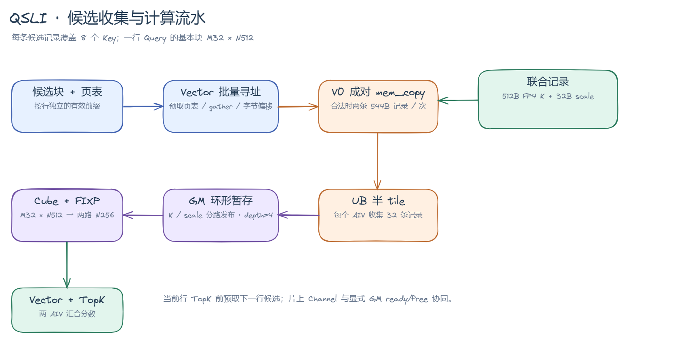

| 缓冲层 | 当前实现容量 | 作用 |
| --- | ---: | --- |
| V0 输入 UB | 每个 AIV 两份 $32\times544$ B，合计 34 KiB | 记录搬入与分路发布 |
| K/scale GM 环形暂存 | 每 worker 四份 $512\times68$ B，合计 136 KiB | V0 与 Cube 任务解耦 |
| K/scale L1、L0B | `Channel(depth=2)` | 下一 tile 加载与当前计算交错 |
| L0C | `Channel(depth=2)`，合计 128 KiB | MAC 与 FIXP 交错 |
| QK UB 交接 | 每个 AIV 两份 $32\times256\times2$ B，合计 32 KiB | FIXP 写入与 Vector 消费交错 |

联合 K 与 E8M0 scale 先写入每个 worker 独立的 GM 环形缓冲，再由 Cube 搬入计算所需的 L1 布局。该版本的 scale BDN 布局转换仍在 UB 完成。GM 缓冲还用于衔接 V0 不规则的 Key 收集和 Cube 连续计算，避免两者必须以相同速度运行。

### 优化实现

#### 联合记录与稀疏搬运

`indexer_prologue_k` 的 combined 模式将八个 Key 的 FP4 数据和尺度存为一条记录。$D=128$ 时，记录宽度为

$$
B_{\mathrm{record}}
=8\times128\times\frac{4}{8}
 +8\times\frac{128}{32}
=512+32=544\ \mathrm{B}.
$$

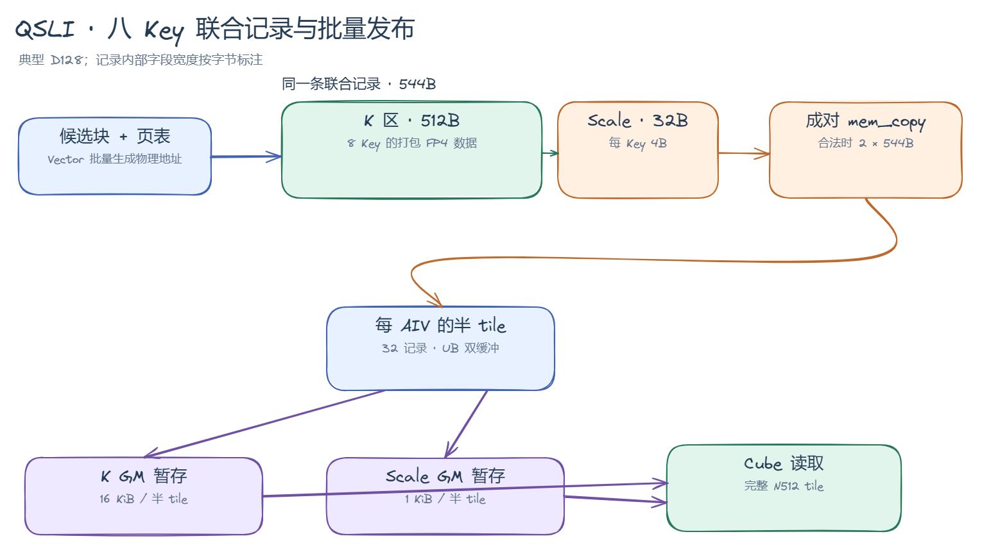

Vector0 对每个候选块定位一条记录。两个源记录满足硬件双 burst 搬运要求时，可用一次 `mem_copy` 将它们搬入 UB，有效载荷为 1088B；若源地址相同或间距不符合要求，则逐条读取。每个 AIV 收集 32 条记录后，分别将 16 KiB K 和 1 KiB scale 写入 GM 缓冲，供 Cube 读取。联合记录减少 K/scale 分开读取时的小块搬运，成对读取进一步减少搬运指令数。

成对搬运用 `mem_copy` 表达两个源切片和一个连续目标：

```python
mem_copy(
    packed_ub_pair,
    (source[first:first + 544], source[second:second + 544]),
)
```

满足配对条件时，每个 AIV 的 32 条记录通过 16 次调用读入；搬运条件或 batch 一致性检查未通过时，改为逐条读取。地址准备阶段记录物理读取顺序与候选顺序的对应关系，确保分数最终映射回正确的候选索引。

#### 地址生成与 Scalar 优化

候选块号为 $c_j$、PA 页长为 $P$、页步长为 $S_{\mathrm{page}}$ 时，记录物理地址为

$$
p_j=\left\lfloor\frac{c_j}{P/8}\right\rfloor,\qquad
r_j=c_j\bmod(P/8),\qquad
a_j=\operatorname{block\_table}[b,p_j]S_{\mathrm{page}}+544r_j.
$$

任务开始前，页表行与候选数组成块进入 UB；Vector 批量计算页号、页表 gather 和字节偏移，搬运循环消费预先生成的地址。

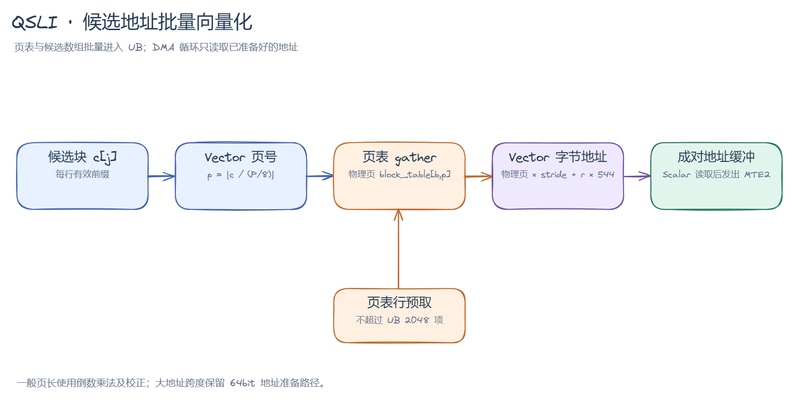

| 地址准备步骤 | 当前实现 | 消除的串行开销 |
| --- | --- | --- |
| 候选索引 | 成块搬入 UB | 逐项 GM 标量读取 |
| 物理页查询 | 页表预取、Vector gather | 每条记录再次访问 GM 页表 |
| 页号与页内位置 | 幂次页长用移位；一般页长用倒数乘法及校正 | 逐项除法与求余 |
| 字节地址 | Vector 乘加并批量输出 | 逐项地址算术 |
| 成对地址 | 32bit 偏移模式下打包读取 | 多次 Scalar load 与地址拼装 |
| 大地址跨度 | 高低位及进位处理 | 避免截断高位地址 |

页表 UB 容量为 2048 项；超过容量时使用通用 Scalar 路径。输入存储跨度不超过 2 GiB 时使用 32bit 偏移准备，更大跨度使用 64bit 地址路径。上述选择不改变候选有效长度或输出索引语义。

#### 多级流水与行间预取

V0 使用两个 UB Buffer 和四份 GM 缓冲，Cube 与 QK 结果也分别使用 Channel 和双缓冲。当前行开始 TopK 前，V0 可提前读取下一行最多四个 tile 的候选 Key；处理下一行时直接使用已就绪的数据。片上 Buffer 由 Channel 管理，跨核 GM 交接通过就绪和释放通知同步。

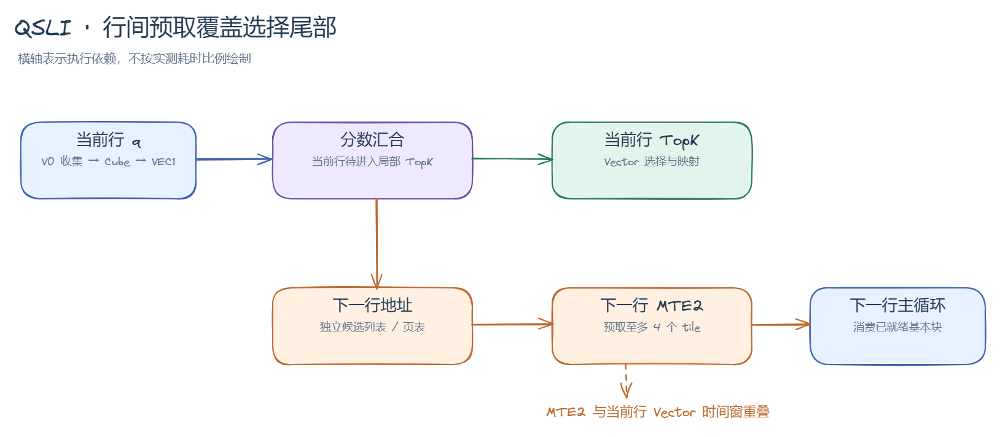

128K 业务用例的时间轴显示，12 个 AIV 的 Vector 活跃时间平均约为 17.3µs，其中约 12.9µs 与各自的 MTE2 搬运同时发生，约 4.4µs 发生在 MTE2 搬运之外。**约 75% 指整个 Vector 流水的重叠比例**，包含 VEC1、TopK、索引映射和结果归并，不能单独解释为 TopK 的隐藏比例。

为估计局部 TopK 对整体耗时的影响，另一组测试保留 V0、Cube、FIXP、搬运和同步，只移除局部 TopK 及相关映射、输出：

| 业务测量 | 主 kernel 中位数 | AIV_MTE2 中位数 |
| --- | ---: | ---: |
| 完整计算 | 87.270µs | 68.160µs |
| 移除局部 TopK 与后续映射/输出 | 82.943µs | 68.131µs |
| 差值 | 4.327µs | 0.029µs |

差值衡量选择及关联尾部工作对完整 kernel 关键路径的影响；最后一行的选择与归并仍需在流水排空阶段完成。普通局部 TopK 由 AIV0 消费汇合分数，AIV1 参与 V0、VEC1 和分数写出。下一行预取始终使用该行自己的候选列表。

**完整算子性能。** 典型业务配置为 B12 / S1=6 / S2=128K / N1=32 / D128 / PA128 / TopK512，每行 2048 个独立随机候选块，`mask_mode=3`、`cmp_ratio=2`、`return_value=False`。完整主 kernel 中位数为 **87.270µs**；AIV_MTE2 均值为 **68.328µs**、中位数为 **68.160µs**。

128K 用例的受控对照分别隔离成对搬运发射和地址生成优化：

| 优化因素与观测指标 | 对照实现 | 优化实现 | 下降 |
| --- | ---: | ---: | ---: |
| 联合记录上的逐条→成对发射；AIV_MTE2 均值 | 118.816µs | 69.346µs | 41.64% |
| 同一成对发射对照；主 kernel 中位数 | 137.838µs | 87.179µs | 36.75% |
| 逐项→批量向量化寻址；AIV Scalar 均值 | 51.381µs | 31.852µs | 38.01% |

两组对照分别改变搬运发射和地址生成，不能将降幅相加；成对发射对照的两组输入均为联合记录，不能据此推断 K/scale 分离存储到联合存储的单独收益。搬运统计覆盖 64 个 AIV 的三次采样，kernel 取三次调用的中位数。

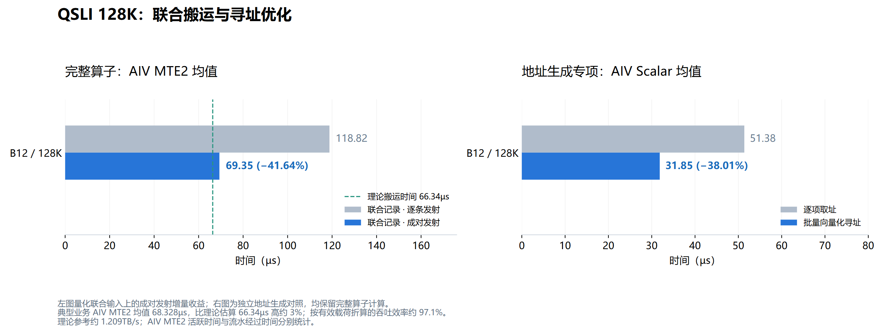

按 B12 / S1=6 / 每行 2048 条、每条 544B 的联合记录计算，名义 K/scale 载荷为 $12\times6\times2048\times544=80{,}216{,}064$ B。以此载荷比较搬运下限的近似模型与业务 AIV_MTE2 均值：

| 指标 | 近似模型 | 当前完整算子 |
| --- | ---: | ---: |
| 搬运时间 / AIV_MTE2 均值 | 66.34µs | 68.328µs |
| 按相同载荷折算的吞吐 | 约 1.209 TB/s | 约 1.174 TB/s |
| 相对模型时间的差额 | - | 1.988µs，约 3.00% |
| 相对模型吞吐的效率 | 100% | 约 97.1% |

表中吞吐由名义有效载荷和 AIV_MTE2 活跃时间换算，**不是硬件带宽计数**。即使活跃时间接近模型下限，流水中仍可能存在等待；完整算子还包含任务切换、跨核交接和 TopK 收尾。

## Mixed Quant Sparse Flash MLA

### 计算流程

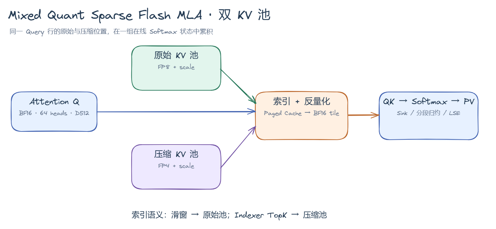

`mixed_quant_sparse_flash_mla` 使用 BF16 Attention Q，按照稀疏索引从 Paged KV Cache 中读取共享 KV。原始 KV 池使用 FP8 E4M3 存储，压缩 KV 池使用 FP4 E2M1 打包存储。计算包含只读取原始 KV 和同时读取原始、压缩 KV 两种路径。Query head 数为 64，逻辑 head dimension 为 512，KV head 数为 1；Query 按 TND 布局组织。每个 KV 向量按 `nope[448] | rope[64]` 排列，反量化后同一向量同时用作 Key 和 Value。

对于同一 Query 行，两侧 KV 产生的有效 Attention 分数共同参与在线 Softmax。Attention Sink 作为额外的归一化项参与最大值与分母更新，不对应需要读取的 Value 行。在线计算保留运行中的最大值、指数和以及未归一化输出；处理完所有有效 KV tile 后再完成归一化与可选 LSE 输出。因此，原始与压缩两侧的贡献可以在同一组 Softmax 状态中累积。

设当前 tile 中的 Attention 分数为 $x_j$、共享 KV 向量为 $v_j$。每个 Query head 的在线状态可写为最大值 $m$、指数和 $l$ 与未归一化输出 $o$。对于新 tile，计算

$$
\begin{aligned}
m'&=\max\left(m,\max_j x_j\right),\\
\alpha&=\exp(m-m'),\\
l'&=\alpha l+\sum_j\exp(x_j-m'),\\
o'&=\alpha o+\sum_j\exp(x_j-m')v_j.
\end{aligned}
$$

处理第一块 KV 前，以 Sink 分数初始化 $m$，并令 $l=1,o=0$；处理完所有 KV 后，输出为 $o/l$，可选的 Log-Sum-Exp 为 $m+\log l$。有效 KV 位置为空时，输出为零，LSE 等于 Sink 分数。如果一个 Query 的 KV 被分给多个计算核，各核的状态分别为 $(m_a,l_a,o_a)$ 和 $(m_b,l_b,o_b)$，按下式合并：

$$
\begin{aligned}
m&=\max(m_a,m_b),\\
l&=e^{m_a-m}l_a+e^{m_b-m}l_b,\\
o&=e^{m_a-m}o_a+e^{m_b-m}o_b.
\end{aligned}
$$

原始 KV、压缩 KV 与不同 S2 分片因此共享一组归一化状态。

### Tiling 设计

以 128 个 KV 位置为一个处理 tile，按照 Query 行与两侧有效稀疏 KV 长度划分任务；一行先处理原始 KV tile，再处理压缩 KV tile。每行覆盖 64 个 Query head，逻辑 head dimension 为 512。Cube 处理 64 个头与 128 个 KV 位置组成的矩阵块；两个 Vector 子核各负责 32 个 Query head。尾块按实际有效长度屏蔽多余位置。

调度阶段根据每行有效长度生成任务范围。常规路径将完整 Query 行分配给一个 Cube 核；启用 Flash Decode 时，一行的 KV tile 可分给多个 Cube 核。各核将局部输出、最大值与指数和写入 Workspace，Vector 核再按在线 Softmax 合并公式归约。Sink 只在该行的第一个分片中初始化，避免重复计入分母。未拆分的行直接完成输出。

### 优化实现

#### 核内流水与片上数据复用

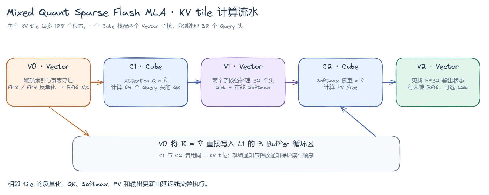

| 阶段 | 执行内容 |
| --- | --- |
| V0 · Vector | 根据稀疏索引和页表读取 KV；原始池每 32 个元素共用 FP8 scale，压缩池每 16 个元素共用 FP4 scale；反量化后生成 BF16 NZ 布局的共享 Key/Value，并直接写入 L1 |
| C1 · Cube | 从 L1 读取反量化的 KV，计算 QK 分数，并将结果交给两个 Vector 子核 |
| V1 · Vector | 按每个子核的 32 个 Query head 更新在线 Softmax 的最大值、指数和与权重 |
| C2 · Cube | 复用 L1 中的共享 Value，计算 PV 分块 |
| V2 · Vector | 将 PV 分块合入 FP32 输出状态；行末归一化，写出 BF16 输出和可选的 FP32 LSE |

V0 在 UB 内完成量化数据解码、scale 读取、缩放与 NZ 布局写入，随后将 BF16 KV 直接写入 L1 的三个循环 Buffer。C1 与 C2 复用同一 KV tile；CANNBot-DSL 的 Channel 与跨核同步控制生产完成、矩阵乘读取和 Buffer 释放的顺序。延迟线记录 Query 行号、KV tile 号以及首尾标志，使相邻 tile 的反量化、QK、Softmax、PV 和输出更新交叠执行。

输出在 FP32 Buffer 中累加并归一化。行末将 BF16 结果打包到该 Buffer 的可复用区域，再搬运至最终输出位置，减少额外的输出缓冲区。

#### 稀疏 KV 寻址

稀疏 KV gather 的源地址必须先由 `sparseIndices` 和存储映射确定，再据此发出 KV 搬运。地址**计算**和地址**取值**是不同的开销：即使批量向量化算出物理行号，V0 若仍逐项从 GM 地址表执行 Scalar `getValue`，后续 KV 搬运就依赖这些取值完成。

在混合量化的分页 Cache 路径中，Vector 可对适合批量处理的布局预先计算稀疏索引对应的物理 KV 行，主循环读取预计算结果。其余布局在主循环中按页表和页内偏移生成地址。批量预计算将页表查询与地址生成移到 KV tile 处理之前。

以下 BF16/TND 独立测试对照三种地址策略；其数据布局与前述分页量化 Cache 路径不同。

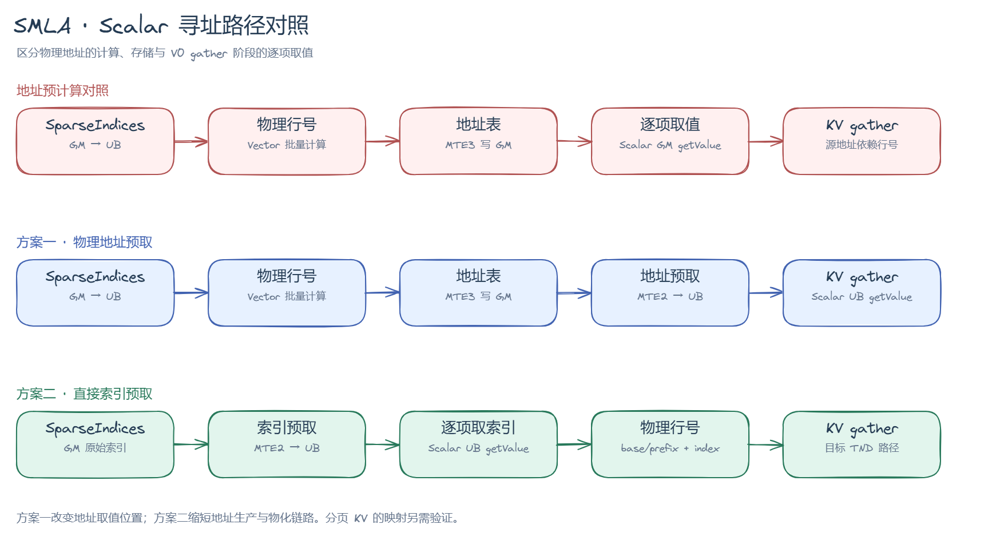

| 路径 | 地址生产与消费 | 保留的主要成本 |
| --- | --- | --- |
| 地址预计算对照 | Vector 从索引和映射计算物理行号，MTE3 写入 GM 地址表；V0 逐项从 GM 取行号 | GM `getValue` 与 KV 搬运之间的串行依赖 |
| 方案一：物理地址预取 | 保留预计算和 GM 地址表；每个 V0 前以 MTE2 批量搬入 UB，再从 UB 取行号 | 地址表的生成、GM 写回与再次搬入 |
| 方案二：直接索引预取 | 在目标 TND 路径上直接将 `sparseIndices` 搬入 UB，消费时结合序列 base/prefix 得到物理行号 | UB 取索引及少量 Scalar 加法 |

对方案二所测的连续 TND 存储，地址关系简化为 $p_{b,j}=\operatorname{base}_b+i_{b,j}$，其中 $i_{b,j}$ 为稀疏索引。分页 Cache 的地址还由 block table、页内偏移和物理行距共同确定。方案二去掉了地址预计算输入搬运、Vector 行号计算、GM 地址表写回与回读，以及相应的中间缓冲和同步链路；地址表原先按 `[row,0]` 交错保存，每个逻辑地址占两个 `int32`，直接索引只需一个 `int32`。

寻址路径用例均为 BF16、Q/KV TND、$B=1$、$S_1=4096$、$S_2=8192$、$N_1=64$、$N_2=1$、$D=512$，原始与压缩侧有效 TopK 分别为 128 和 512。两组只改变 mask 与 TopK 模式：用例一为原始/压缩 mask 模式 4/3、TopK 模式 no/no；用例二为 0/0、fullK/fullK。

| 用例与指标 | 地址预计算对照 | 方案一：物理地址预取 UB | 方案二：直接索引预取 UB | 方案二相对对照 |
| --- | ---: | ---: | ---: | ---: |
| 用例一 · Duration | 1149.348 µs | 1001.230 µs | 910.373 µs | −20.79% |
| 用例一 · MFU | 69.115% | 79.340% | 87.258% | +18.143 个百分点 |
| 用例二 · Duration | 1151.592 µs | 1010.906 µs | 909.477 µs | −21.02% |
| 用例二 · MFU | 68.981% | 78.581% | 87.344% | +18.363 个百分点 |

Pipe time 是各流水线的活跃时间，存在重叠，不能相加为 Duration。从地址预计算对照切换到方案一，用例一/二的 AIV Scalar 分别由 891.627/922.609 µs 降至 364.054/369.481 µs，下降 59.17%/59.95%；Duration 下降 12.89%/12.22%。额外的地址表预取使 AIV MTE2 由 697.760/712.977 µs 增至 805.019/830.688 µs，上升 15.37%/16.51%。这一对照将收益主要定位到地址**取值位置**的变化。

方案二相对方案一，AIV Scalar 为 352.229/367.398 µs，仅再下降 3.25%/0.56%，但 Duration 继续下降 9.08%/10.03%；AIV MTE2 降至 775.190/780.550 µs，Vector 与 MTE3 活跃时间也同步缩短。这与取消地址表生产、写回、重读及同步链路的解释一致。各 Pipe 时间降幅不能相加解释为总时延收益。

该组寻址测试未记录重复次数、统计方法、完整软件环境及 MFU 使用的峰值算力，数值只用于组内路径对照。算子按布局与容量选择 Vector 预计算地址或 Scalar 逐项计算地址的路径；表中的方案二为独立对照路径。

#### 稀疏 KV 搬运：UB 直写 L1

测量对象为 BF16、TND 的稀疏 KV gather 与 Cube 消费链，采用独立于前文 FP8/FP4 Cache 的数据布局。该路径处理 **KV 已进入 UB 后如何送达 Cube 的 L1**；前述寻址路径处理 gather 所需的物理地址。

GM 中转路径由 AIV 按稀疏索引离散读取 KV，在 UB 中形成 ND tile，再经 MTE3 写入 GM 临时缓冲。Cube 随后用 MTE2 将数据从 GM 搬入 L1，并在搬运中完成 ND→NZ 转置，供 BMM1/QK 与 BMM2/PV 使用。

L1 直写路径由 AIV 的 VF 在 UB 中完成转置，再通过 MTE3 直接写入共享 L1 Buffer。Cube 等待跨核就绪通知后从 L1 读取，无需再执行这块 KV 的 GM→L1 搬运。

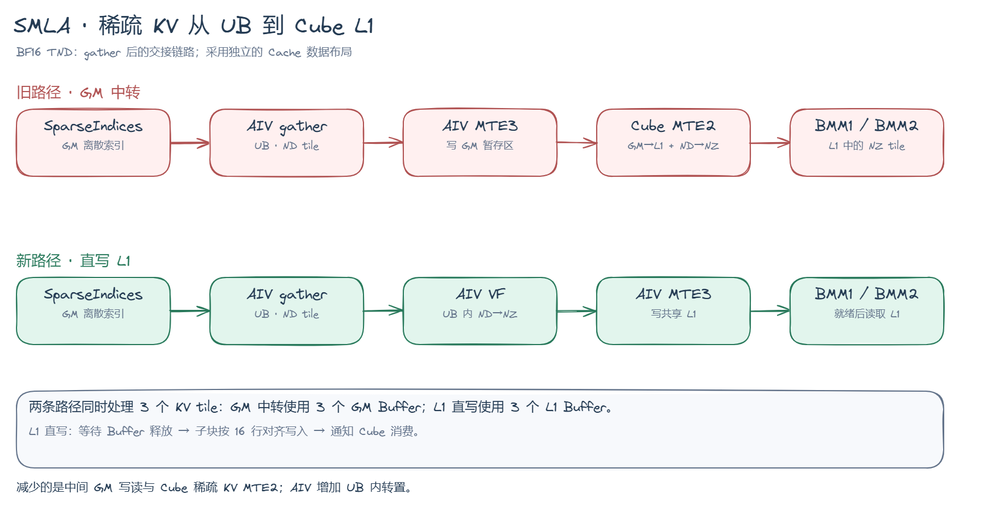

| 环节 | 旧路径：UB→GM→L1 | 新路径：UB→L1 |
| --- | --- | --- |
| gather 后的布局 | UB 中为 ND | UB 中先由 VF 转为 NZ |
| 中间写入 | AIV MTE3 写 GM 临时缓冲 | AIV MTE3 直接写共享 L1 槽 |
| Cube 侧读取 | MTE2 执行 GM→L1 及 ND→NZ | 等待跨核就绪后从 L1 读取 |
| 稀疏 KV 中间数据的 GM 往返 | 一次写入、一次读取 | 无 |
| 同时在途 KV 缓冲区 | 三个 GM Buffer | 三个 L1 Buffer |

若一个已 gather 的稀疏 KV tile 有效载荷为 $P$ 字节，只计这条**中间交接链路**，旧路径额外产生约 $P$ 字节 GM 写入和 $P$ 字节 GM 读取；新路径将这约 $2P$ 的 GM 流量移除，代价是 AIV 额外执行 UB 内转置与直写 L1。这里不计从原始 KV 存储 gather 的读取、其他 Attention 数据以及最终输出流量，因此不能把 $2P$ 当作整个算子的总 IO 降幅。

L1 直写的 d-fractal 行距采用 `Align16(s2RealSize)`，与 Cube 搬入 L0B 时的 `srcStride=Align16(singleN)/16` 配对；非满 tile 的 tail 也按同一规则处理。两个 AIV 子块的写入行区按 16 行边界切分，避免并发更新同一 L1 存储行时覆盖有效数据。AIV 写入前等待 L1 Buffer 释放，写完发出跨核就绪通知；Cube 等待就绪后消费并归还 Buffer。该同步保护“复用前已释放、读取前已写完”两个方向的依赖。

两条路径都允许同时处理三个 KV tile，预取深度相同。GM 中转路径的 AIV 写完 GM 即可继续，Cube 再等待 L1 并执行搬运；L1 直写路径的 AIV 在写入前可能等待 Buffer 释放。测试配置的 L1 为 512 KiB、UB 为 256 KiB，三份 KV Buffer 已占满该轮片上预算。AIV 收集比 Cube 消费提前约两个处理轮次，所测用例中新增的 L1 Buffer 释放等待由这段时间覆盖，未延长关键路径；其他 tile 形状需要重新验证。

4096 Query 用例采用 BF16、TND，$S_1=4096$、$S_2=8192$、$N_1=64$、$N_2=1$、$D=512$，原始/压缩侧有效 TopK 为 128/512，`cmp_ratio=4`。三组测试各采集 300 次 NPU 任务，算子平均时长如下：

| 指标 | GM 中转基线 | L1 直写候选 | 变化 |
| --- | ---: | ---: | ---: |
| Duration | 2.200 ms | 1.318 ms | −40.1% |
| MFU | - | 68.9% | - |

表中 −40.1% 是稀疏 KV 直写 L1 和部分预处理精简共同作用的完整算子结果，不能把全部收益单独归因于直写。正确性测试覆盖全部 4096 个查询，以及 40 条 BF16/FP16 输出与 LSE 用例，包含 tail、Query padding、混合长度、G1/32/64/128、地址缓存回退和宽 64-bit 地址。该组测试未记录与前一寻址路径相同的完整环境及 MFU 分母口径，两张表不能合并比较。

另一组测试中，完整 4096 用例为 927 µs；只保留 Vector、FixPipe 和跨核同步等工作的配置为 864 µs。该测试中 AIC MTE1/MTE2 活跃时间接近零，说明剩余耗时主要在 AIV 侧。这组测试条件不同于上表，927/864 µs 不能用于拆分 2.200→1.318 ms 的收益。L1 直写路径移除了 gather 后的 GM 中转和 Cube 侧的稀疏 KV MTE2；性能结果仅适用于所测 BF16/TND 配置及其布局、同步实现。

## Attention Epilogue

### 计算流程

`attn_epilogue` 将 Attention 结果变回残差流使用的 Hidden 维度：先对每个 head 的旋转部分执行 inverse RoPE，再执行 QuantA、分组矩阵乘 MM1、中间结果量化 QuantY 和输出矩阵乘 MM2。以下测试采用张量并行度 TP=1，测量设备为 Ascend 950DT，使用 32 AIC / 64 AIV，覆盖 $1\le T\le256$。精度与时延结论仅适用于所测配置和输入。

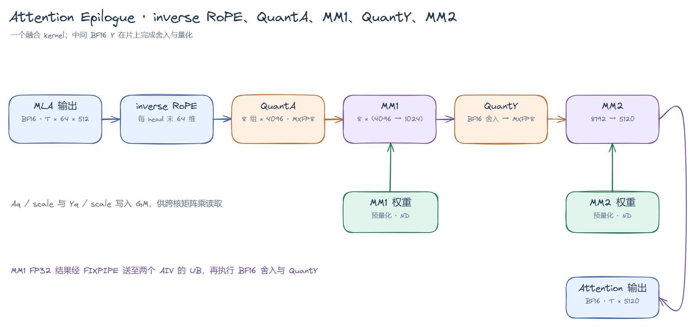

输入为 BF16 `X[T,64,512]`。每个 head 的末 64 维执行 inverse RoPE，随后将 64 个 head 重组为八组、每组 4096 维。QuantA 以 32 元素为一个 MXFP8 量化组，生成 `Aq[8,T,4096]` 和 E8M0 scale。MM1 的每组矩阵乘为 $(T,4096)\times(4096,1024)$，八组结果组成逻辑张量 `Y[T,8192]`。QuantY 按原五算子实现的顺序，先将 MM1 的 FP32 结果舍入至 BF16，再进行 MXFP8 量化。MM2 计算 $(T,8192)\times(8192,5120)$，将输出转换为 BF16 `O[T,5120]`。两组权重及尺度预先量化，以 ND 格式存储。

令 $R^{-1}$ 表示末 64 维的 inverse RoPE，$Q_{\mathrm{MX}}$ 表示每 32 元素产生数据与尺度的 MXFP8 量化，$\operatorname{rnd}_{\mathrm{BF16}}$ 表示 BF16 舍入。数值链可写为

$$
\begin{aligned}
A_g&=\operatorname{reshape}_g(R^{-1}(X)), & (A_g)_{t,:}&\in\mathbb R^{4096},\quad g=0,\ldots,7,\\
(A_{q,g},S_{A,g})&=Q_{\mathrm{MX}}(A_g),
&Y_g&=\operatorname{MM}_{\mathrm{FP32}}(A_{q,g},W_{1,g};S_{A,g},S_{W_1,g}),\\
(Y_q,S_Y)&=Q_{\mathrm{MX}}\!\left(\operatorname{rnd}_{\mathrm{BF16}}[Y_0,\ldots,Y_7]\right),
&O&=\operatorname{rnd}_{\mathrm{BF16}}\!\left(\operatorname{MM}_{\mathrm{FP32}}(Y_q,W_2;S_Y,S_{W_2})\right).
\end{aligned}
$$

MM1 的 FP32 结果经 FIXPIPE 直接送至两个 AIV 的 UB，由 AIV 完成 BF16 舍入与 QuantY，省去 BF16 中间张量 `Y` 的 GM 写回和再次读取。T=72 时，按数据量计算，减少的 GM 读写合计为 2.25 MiB；实际外存流量仍受缓存命中影响。量化后的 `Aq`、`Yq` 及 scale 仍写入 GM，供跨核的 MM1、MM2 读取。

### Tiling 设计

MM1 沿 group、M、N 划分输出 tile，MM2 沿 M、N 划分；AIC 按核号步进领取任务。Tiling 搜索使用实际 $T$、有效核数和片上容量，工作区行步长的补齐值不充当特定配置查表键。L0 基本块的 K 维为 128；L1 操作数采用双缓冲，K 步长优先为 512，容量不足时为 256。32 AIC 配额下的搜索结果为：

| T 范围 | $M_{\mathrm{base}}$ | MM1 $N_{\mathrm{base}}$ | MM2 $N_{\mathrm{base}}$ | L1 K 步长 | L0C 深度 MM1 / MM2 |
| --- | ---: | ---: | ---: | ---: | ---: |
| 1–128 | $\lceil T/16\rceil16$ | 256 | 160 | 512 | 2 / 2 |
| 129–144 | $\lceil T/16\rceil16$ | 256 | 160 | 512 | 1 / 2 |
| 145–192 | $\lceil T/16\rceil16$ | 256 | 160 | 256 | 1 / 2 |
| 193–256 | $\lceil T/16\rceil16$ | 256 | 160 | 256 | 1 / 1 |

候选 tile 满足如下容量上界；其中 $N_{\max}=\max(N_1,N_2)$，L0C 深度取 1 或 2：

$$
\begin{aligned}
2M_{\mathrm{base}}\cdot128&\le64\,\mathrm{KiB} &&(\mathrm{L0A}),\\
2N_{\mathrm{base}}\cdot128&\le64\,\mathrm{KiB} &&(\mathrm{L0B}),\\
d_{\mathrm{L0C}}M_{\mathrm{base}}N_{\mathrm{base}}\cdot4&\le256\,\mathrm{KiB},\\
(M_{\mathrm{base}}+N_{\max})(2K_{\mathrm{L1}}+8192/32)&\le512\,\mathrm{KiB} &&(\mathrm{L1}).
\end{aligned}
$$

搜索时先估计每个候选 Tiling 需要多少轮任务，再结合计算量与搬运量排序。令 $N_{\mathrm{tiles}}$ 为任务数、$N_{\mathrm{AIC}}$ 为可用计算核数，则 $\mathrm{waves}=\lceil N_{\mathrm{tiles}}/N_{\mathrm{AIC}}\rceil$ 表示任务轮数；候选代价采用 $\mathrm{cost}=\mathrm{waves}\,K[2M_{\mathrm{base}}N_{\mathrm{base}}+256(M_{\mathrm{base}}+N_{\mathrm{base}})]$。它只用于排序，不直接预测时延。T=256 时，L0C 深度改为 1 后，$M_{\mathrm{base}}$ 可从 128 增至 256，两次矩阵乘均由两轮任务缩为一轮。

QuantY 对每个 AIV 保留完整 FP32 输出 tile，再按行块完成 BF16 舍入、量化与有效行写回。设 AIV 输出列数为 $N$、完整输出补齐行数为 $p$、量化行块为 $r$、RoPE/QuantA 缓冲占用为 $R$，UB 预算为

$$
R+4pN+\frac{165}{32}rN+32r+512\le262144\ \mathrm{B}.
$$

行块大小在上述预算内优先减少分块次数，输入双缓冲也计入 $R$。图示的 K=2048 指 QuantA 发布给 MM1 的生产消费段，区别于 L1 的 K=256/512 搬运步长。

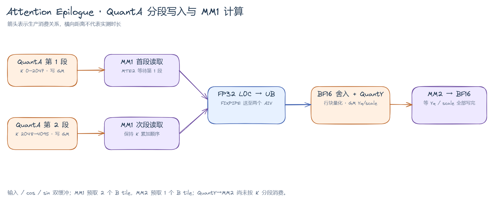

### 优化实现

#### QuantA 分段供数

QuantA 将每组 K=4096 划为两个 K=2048 段。每段的 FP8 数据和 scale 经 MTE3 写回后发布就绪；MM1 的 MTE2 等待对应段，第一段矩阵乘可与第二段 QuantA 重叠。AIV 按 group 分配 token，每批处理 1–4 行；MM1 保持原 K 顺序累加。RoPE/QuantA 的输入、cos、sin 使用 UB 双缓冲，下一批 MTE2 可与当前批的向量计算并行；BF16 输入直接复制后，仅覆盖逆旋转区域。

#### MM1 与 QuantY 的片上交接

MM1 的一个输出 tile 完成全部 K 累加后，就可经 FIXPIPE 送给对应的 AIV，无需等待其他输出 tile。CrossCore Channel 管理数据就绪和 Buffer 复用；同核同步保护 MM1、MM2 共用的 L1/L0 存储。

#### 权重预取

MM1 提前加载两个权重 tile，MM2 提前加载一个；MM2 的权重读取可与 QuantY 重叠。QuantY 写完 GM 中的 `Yq` 和 scale 后才通知 MM2。该版本等待所有相关 `Yq`/scale 就绪后启动 MM2，尚未让 MM2 按 K 分段消费 QuantY 结果。

**完整算子性能。** 测试比较五个独立算子（inverse RoPE、QuantA、MM1、QuantY、MM2）的**单次时长之和**与融合算子的时长。每个 T、每种实现采集 192 次，分别取中位数。每次执行五算子链或融合算子前，先运行 256 MiB ReduceSum 以驱逐缓存；五个小算子之间不再驱逐。输入恢复、缓存驱逐及权重预处理不计时。两种实现分别采集 kernel 的 Device 时长，关闭 AI Core PMU/L2 计数。软件驱逐不等同于硬件 cache invalidate。

测试数据采集于 2026-09-24；环境为 CANN 9.2.0、cannbotdsl 0.6.0+g91e7c8f、PyTorch / torch_npu 2.12.0，TP=1、32 AIC / 64 AIV。五算子链与融合版使用相同输入、cos/sin 和预量化权重。

| T | 五个 kernel 时长之和 / µs | 融合 kernel / µs | 耗时下降 | 加速比 |
| ---: | ---: | ---: | ---: | ---: |
| 1 | 42.749 | 34.120 | 20.19% | 1.253× |
| 16 | 44.843 | 34.198 | 23.74% | 1.311× |
| 72 | 54.445 | 44.287 | 18.66% | 1.229× |
| 128 | 63.427 | 51.939 | 18.11% | 1.221× |
| 160 | 68.560 | 58.806 | 14.23% | 1.166× |
| 192 | 73.685 | 63.736 | 13.50% | 1.156× |
| 224 | 79.802 | 69.744 | 12.60% | 1.144× |
| 256 | 84.492 | 75.409 | 10.75% | 1.120× |

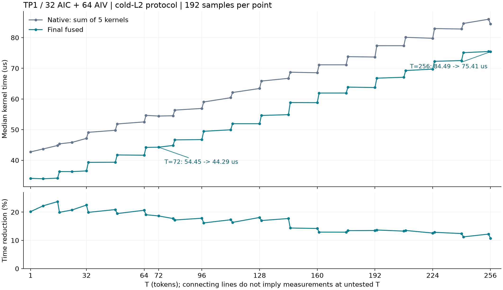

36 个已测 T 点均取得 10.75%–23.74% 的耗时下降；连线只显示趋势，不代表未测 T 的结果。T=256 的自适应 Tiling 诊断中，采样核组 MM1 的 Cube 首尾窗口由 33.649 µs 缩至 24.612 µs，窗口内活跃比例由 62.3% 升至 81.9%；T=72 的输入双缓冲及 MTE3 就绪发布诊断中，MM1 首次 Cube 由 9.416 µs 提前至 8.920 µs。诊断图只覆盖少量冷缓存调用与采样核组，正式时延统计以表中 192 次采样为准。

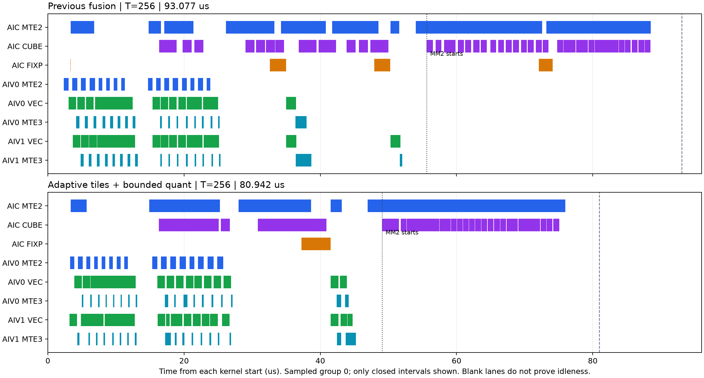

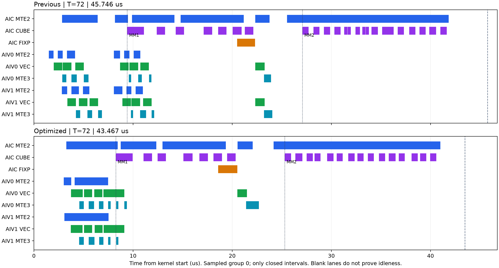

不同优化轮次的受控对照进一步区分了收益来源；各行仅比较同轮旧版与候选版，百分比不能相加：

| 优化组合 | T | 同轮前 / µs | 同轮后 / µs | 耗时下降 |
| --- | ---: | ---: | ---: | ---: |
| MM1→QuantY 片上交付、权重预取、量化精简 | 72 | 49.938 | 47.121 | 5.64% |
| QuantA→MM1 分块流水 | 72 / 128 | 46.623 / 56.357 | 45.850 / 54.047 | 1.66% / 4.10% |
| 自适应 Tiling、QuantY 分块 | 256 | 92.625 | 80.312 | 13.29% |
| 输入双缓冲、MTE3 发布、向量复制 | 72 / 256 | 45.513 / 79.842 | 44.335 / 75.391 | 2.59% / 5.58% |

按权重与尺度、输入与旋转参数各读一次，以及最终输出写一次估算，必要流量为 $B(T)=77{,}856{,}768+76{,}288T$ 字节。以 4 TB/s 名义峰值带宽为分母，T=72、44.287 µs 对应必要流量 83,349,504 B、等效带宽 1.882 TB/s、必要流量带宽效率 47.05%。该模型不含重复加载、padding 和中间张量往返，不能解释为 profiler 实测 HBM 利用率。

已测 117 组输入的 BF16 输出与五算子基线逐比特一致，最大绝对误差为 0；输入覆盖 36 个 T 的三个随机 seed，并在 T=1/72/256 补充零值、极小值和放大值。同输入确定性完成 12,870 次检查，交替输入图回放完成 9,360 次检查；量化数据及尺度、padding、输入不变性和输出生命周期亦通过验证。该结论对应所测的 `vf(mode="raw")` 实现。
