# DeepSeek-V4.1-Flash CANN 优化实践

## 引言

DeepSeek-V4.1-Flash（下文简称 V4.1）是 DeepSeek 推出的新一代多模态混合专家（Mixture of Experts，MoE）大模型：以 552B 骨干参数原生支持图文输入，并把上下文长度扩展到最高 1M token。相比前代 DeepSeek-V4（下文简称 V4），它在模型结构上做了一系列创新——CSA2（Compressed Sparse Attention 2，压缩稀疏注意力 v2）跨层共享 KV Cache（键值缓存）、分层稀疏索引（Hierarchical Sparse Indexer）、FP4 低精度 KV Cache 等——让长序列下 Attention 的计算量与访存量保持在低位，显著降低 KV Cache 存储压力，从而大幅降低推理成本。

CANN 已实现对 DeepSeek-V4.1-Flash 的推理支持，并开源了相关算子与模型参考实现。在`950 PR/DT`平台，提供1M长序列的高性能推理能力。针对新模型结构，本次开源提供了一系列高性能融合算子，主要包括：
- 支持混合精度下的高性能 Window/Sparse/Compress Attention，支持 FP8, FP4 混合 KV Cache 精度下的伪量化计算。
- 针对 LightningIndex (LI) 模块提供高效的 top-k 选取，支持二级召回 candidate 候选 KV 能力。支持 LI prolog cache 计算与更新。
- 高性能 MegaMoE Kernel，通过通算流水并发，大幅提升 prefill 性能。


## 核心亮点

- **高性能推理部署**：基于 Ascend 950DT 单机 16 卡部署，支持最长 1M 序列的高性能推理。兼顾时延与吞吐，叠加 dspark 投机推理实现低于 5 ms 的时延下单卡吞吐 2727 的高性能表现。极低时延性能达成单请求 2.48 ms，[优化实践与推理代码](deepseek_v4.1_low_latency_tp_guide.md)已开源。同时提供基于 vLLM 服务化框架下的高性能推理实践，相关实现和[推理镜像](../../../models/deepseek_v4_1/README.md)已开源。

- **DeepSeek 官方开源高性能 Kernel 实践**：DeepSeek 官方于[TileKernels](https://github.com/deepseek-ai/TileKernels)、[DeepEP](https://github.com/deepseek-ai/DeepEP)、[DeepGEMM](https://github.com/deepseek-ai/DeepGEMM)、[FlashMLA](https://github.com/deepseek-ai/FlashMLA)、[DeepSelect](https://github.com/deepseek-ai/DeepSelect) 等仓库中开源了基于 AscendC 和 Tilelang 的高性能算子仓库，本实践提供了基于 DeepSeek 官方开源算子的使用示例，提升整体性能。

- **高性能融合算子原生支持 FP8/FP4 混合精度**：开源支持稀疏Attention、LightningIndexer、LI_Prolog、MegaMoE等 CANN 原生融合算子，attention 系列融合算子支持 FP8、FP4 混合精度 KV Cache 输入，加速训推性能，并提供应用样例及[技术解析](deepseek_v4.1_cannbotdsl_operator_guide.md)

- **Engram 表 FP8 + 灵衢组网 UB Host Offload**：Engram 表 FP8 量化存储，经灵衢组网 UB 实现 CPU Host offload，多流并行掩盖 Engram 查找与 H2D 传输开销。

- **多模态（ViT + LLM）原生接入**：ViT 编码 + LLM 解码的原生多模态架构，图像不经外部 caption 模型、直接由视觉编码器映射进 LLM 隐层空间，与文本 token 在同一残差流中参与推理。

- **基于PyTorch原生框架的预训练支持**：基于 TorchTitan-NPU 支持 DeepSeek-V4.1-Flash 模型的预训练验证，涵盖长序列和低精度训练。基于 Torchao 构建昇腾 950 低精训练方案。

- **CANN Agent 支持**：提供 CANNBot-DSL、CANNBot-Tilelang 工具实现高性能融合算子的自动生成与性能调优。CANNBot-模型Agent提供模型部署迁移与优化，支持训推精度问题定位。AMCT-Agent支持模型的自动量化与部署。

CANN 社区提供 DeepSeek-V4.1-Flash 在昇腾 950 超节点上的推理部署、训练与 RL 参考实现。低时延推理场景下，基于昇腾 950 超节点和 EP 部署策略，达成低于 5 ms 的性能表现；轻量部署支持 950PR 单卡 CPU 与 NPU 协同执行，将后续提供开发者体验沙箱；面向十万亿参数级模型的训练挑战，系统需要同时应对并行扩展与存储容量约束，CANN 结合 EP / CP / FSDP 多维并行，提供 CPU Offloading 与数据预取，通过计算与数据搬运重叠，探索容量与效率优化；在 Agentic RL 场景中，鲲鹏已完成开源 AgentENV 的适配与优化，为相关任务提供运行环境支持；面向多轮对话，池化 DDR/SSD 与高性能通信参考实现均已合入 kvcache-ai/Mooncake，支持前缀缓存复用，减少重复计算。


## Outline

- [模型结构](#模型结构)
- [融合算子](#融合算子)
- [TileLang 融合算子](#tilelang-融合算子)
- [量化策略](#量化策略)
- [Engram 优化](#engram-优化)
- [DSpark](#dspark)
- [推理并行策略](#推理并行策略)
- [推理部署策略](#推理部署策略)
- [Benchmark](#benchmark)
- [Future Plan](#future-plan)

## 模型结构

### 总体架构

模型主干为 40 层 MoE Transformer 架构，采用因果编码器-解码器（Causal Encoder-Decoder，CED）设计：前 20 层为 Encoder（L0–L19），后 20 层为 Decoder（L20–L39）。每一层都由 mHC + Attention + MoE 三部分组成，残差流以 `hc_mult=4` 路并行副本承载。模型总参数量为 552B 骨干 + 196B Engram，prefill 每 token 近似激活 8B 参数、decode 激活 16B；全局 KV Cache 占用约 890 字节/token，约为前代 V4-Flash 的 1/4。

Attention 部分沿用了 V4 的 SWA（滑窗注意力，`sliding_window=128`）+ 压缩稀疏注意力的设计，但压缩倍率由 V4 的 4 倍 / 128 倍统一为 CSA2 的 2 倍（Encoder）与 1 倍（Decoder）；同时采用分层共享 KV Cache、Index 的方式，大幅降低 KV Cache 存储的内存占用，并减少压缩及稀疏 index 带来的额外计算开销。

整体结构如下图所示：

<p align="center">
  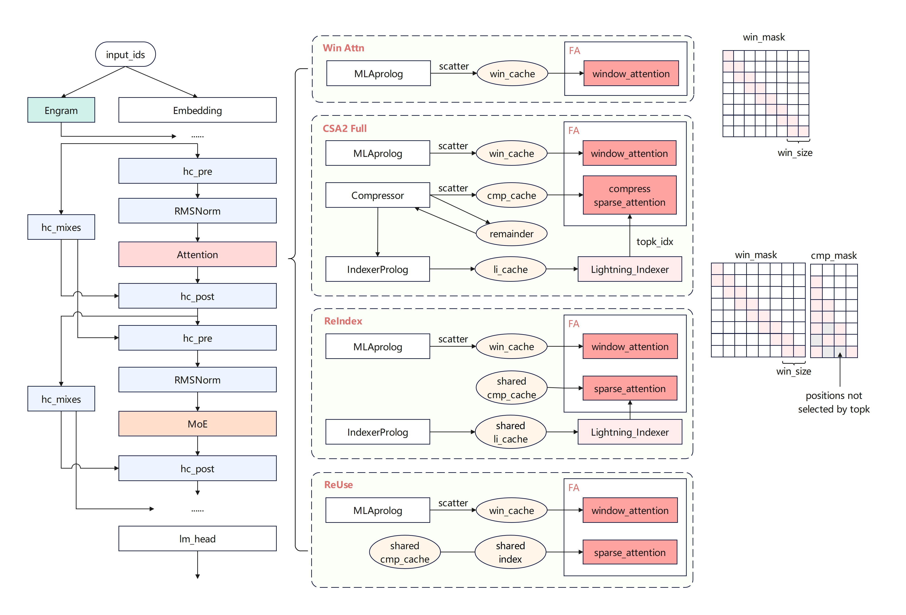
</p>

> 受篇幅所限，图片所呈现的内容简化表达了部分结构。

### mHC 结构

mHC（[Manifold-Constrained Hyper-Connections (Xie et al., 2026)](https://arxiv.org/abs/2512.24880)）把传统残差连接的单一隐藏流扩展为多路残差流。DeepSeek-V4 的 mHC 用三个顺序执行的 kernel 完成「残差更新 + 输入混合 + 系数预测」，激活内存流量是理想下界的 2 倍。DeepSeek-V4.1 引入了 Single-Pass mHC：把输入混合系数**错位一个 block**（每个 block 消费上一个 block 产出的混合系数），消除了系数预测与输入混合之间的数据依赖，从而单次遍历即可完成上述三步；部署侧进一步融合为单 kernel 的 Mega-mHC，把激活内存流量再减半。本模型配置 `hc_mult=4`、`hidden_size=5120`。

<p align="center">
  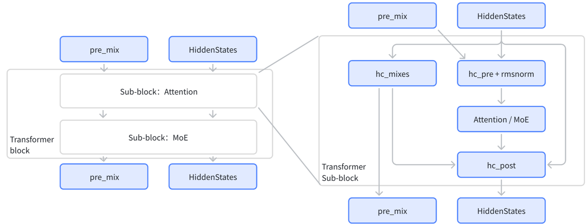
</p>

### 分层结构与 KV Cache 复用

CSA2 层按「main KV / indexer cache / Top-K 索引」三者来源的不同，静态划分为三种模式，据此决定各层的压缩、稀疏与 Cache 复用：

<div align="center">

| 模式 | main KV | indexer cache | Top-K 索引 | 层数 |
|---|---|---|---|---|
| Full（完整） | 自己算 | 自己从 main KV 投影 | 自己跑 indexer 生成 | 4 |
| Reindex（重索引） | 复用前层 | 复用前层 | 用自己的 indexer Q 重打分 → 新 Top-K | 4 |
| Reuse（复用） | 复用前层 | — | 复用最近的 Top-K 索引 | 30 |

</div>

40 层的具体分布如下：

- **L0–L1**：纯 SWA，不压缩；
- **L2–L19（Encoder CSA2，压缩倍率 2）**：分为 3 组、每组 6 层，每组首层为 Full 模式（`[2, 8, 14]`），组内其余层为 Reuse；
- **L20–L39（Decoder CSA2，压缩倍率 1）**：分为 5 组、每组 4 层，L20 为 Full，`[24, 28, 32, 36]` 为 Reindex（复用 L20 的 indexer cache，用自己的 Q 重打分），其余为 Reuse。

Attention 采用 MLA（Multi-head Latent Attention，多头潜在注意力）：查询先压缩到 1280 维 latent 再展开到 64 个 head、每个 head 维度 512；KV 为同一份 512 通道 latent，单 KV head，K、V 复用同一份 tensor。每层 Attention 同时包含 SWA 与 CSA2 两路。

得益于 CED，Decoder 层（L20–L39）的全局 KV 不再由自己层的 hidden state 生成，而是由第 20 层这一 KV 源层（`kv_source_layers` 的最后一个）的 hidden state 经逐层投影得到。因此 Prefill 时前 21 层（L0–L20，含 4 个 KV 源层）全量计算，后 19 层（L21–L39）只消费共享压缩 KV、只需计算 window-size（128）大小的 q，后 19 层计算量从 O(L) 降至 O(W=128)。

共享化同时改变算力分布：V4 的压缩逐层私有（每层都是 KV 生产者），V4.1 的压缩集中在 4 个源层，Compressor 从几乎全层削减到 4 层（减少近 10 倍）；Indexer 也仅在 8 个 index 源层执行（减少近 2.5 倍）。实际参与计算的压缩位置固化为 `topk=512`，实际读取的 KV 量恒为 512 + 窗口 128 = 640 个位置，不随上下文增长。

### 压缩与存储结构

<p align="center">
  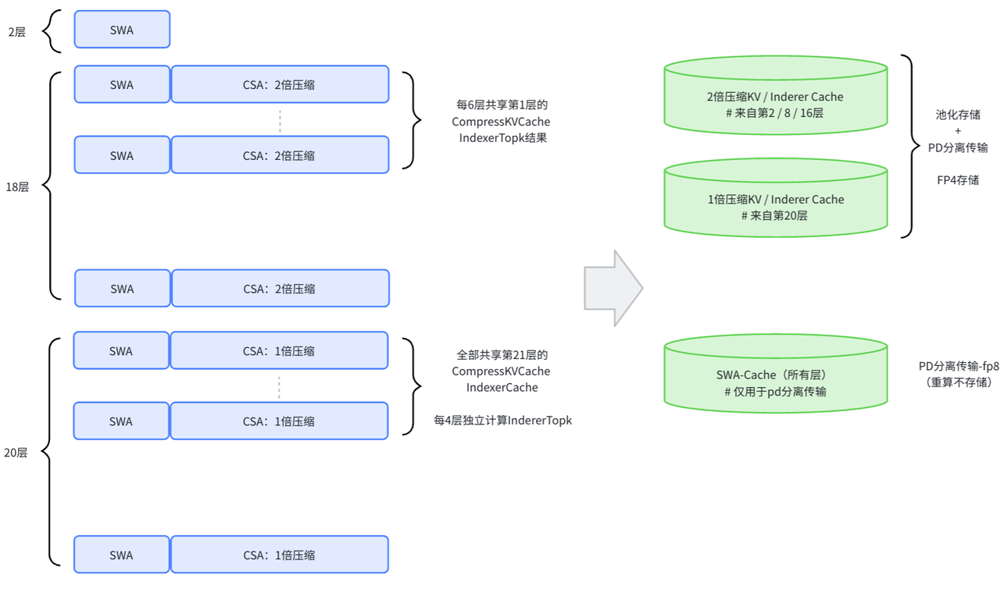
</p>

- **SWA 滑窗缓存**：所有层维护 `sliding_window=128` 的 KV 环形缓存（FP8 量化）。Prefill 整段计算填 ring，Decode 每步写入位置模 128 槽位并回读整个窗口。

- **压缩 KV**：Compressor 在 2 倍压缩时对每组 2 个 token 做 `softmax(score)` 加权求和（全程 FP32）得 1 个 KV latent；1 倍压缩时退化为一次纯投影 + Norm。压缩 KV 仅 4 个源层维护（`[B, L/ratio, 512]`，FP4），其余层只读。

- **Index 缓存**：indexer 层维护量化后的 IndexerCache（FP4），两级召回——一级最多获取 16384 个候选位置，二级在候选块内打分取 `topk=512` 个压缩位置。

KV Cache 按三种精度持久化存储：压缩 KV（FP4，4 源层）、index KV（FP4，同源）、滑窗 KV（FP8，每层固定 64 KiB，不持久化，命中/恢复时向前补算 128 token 重建）。

以 L=1,048,576（1M）序列为例，V4 与 V4.1 的整体差异如下：

<div align="center">

| 对比项 | DeepSeek-V4 | DeepSeek-V4.1-Flash | 说明 |
|---|---|---|---|
| 共享缓存 + FP4 | 21 层 CSA（Compressed Sparse Attention，4× 压缩）、20 层 HCA（Heavily Compressed Attention，128× 压缩）、FP8 存储 ≈ **3.0 GB / 1M 序列** | **640 MB 压缩 KV + 160 MB IndexCache ≈ 0.8 GB / 1M 序列** | 降低约 **3.75× KV 存储**，计算量随 topk 变化 |
| 重计算 SWA | 每存储 Block 需保存 64KB 窗口 Cache | **无需存储，仅用于 PD 传输** | 长期存储历史 Cache 用于 PrefixCache 命中时池化代价极高，**重算代价可控** |
| Engram | — | 基于 host DDR，分布式 offload Engram 记忆 | 与序列长度无关 |

</div>

### MoE 结构

每层都含 MoE，采用标准 DeepSeekMoE：1 个共享专家 + 384 个路由专家，每 token 激活 6 个路由专家，专家中间维度 2304，激活函数为 SwiGLU（clamp 阈值 10）。多模态场景下，MoE 门控为图像 token 维护视觉专属的 bias，路由时文本与图像各自使用独立 bias 选专家。

本次开源中，提供了将量化、token 分发、两次专家 Linear、SwiGLU 与 token 聚合融合为 MegaMoE 算子，详见[融合算子](#融合算子)。

### ViT 结构

视觉侧（ViT 编码器 + Aligner）**与已开源的 DeepSeek-V4-Flash-Vision-Exp 主体保持一致**：ViT 共 32 层、隐藏维度 1024、16 个注意力头、patch size 14；视觉 MLP projector（Aligner）为 2 层、隐藏维度 5120。相比传统 ViT，这里用 2D-RoPE 替换绝对位置编码以支持任意分辨率，并通过 3×3 pixel-unshuffle 把视觉 token 数降低 9 倍。

视觉编码器将预处理后的图像 patch 通过 Patch Embedding 映射到视觉隐层，由 ViT Blocks 执行单图内全双向 Self-Attention 和 SwiGLU MLP 计算，再由 Aligner 通过 MLP 映射到 LLM hidden_state 维度。多图按 token 维拼接计算，Attention 通过各图的序列边界隔离，图片之间不互相注意。

<p align="center">
  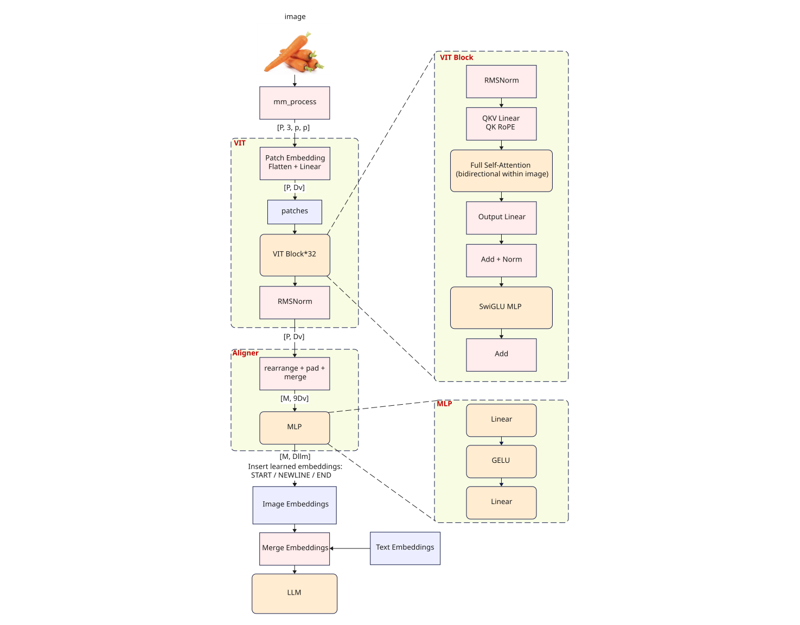
</p>

图像以 token span 形式并入序列，逐行插入换行分隔符保持空间布局语义；图像 token 同时被 Engram 屏蔽（置 DEAD），n-gram 统计不跨越图文边界。视觉侧引入后，LLM 主干注意力**全程保持因果**，这是 V4.1-Flash 相对开源主体的关键差异：视觉内容以 token span 形式并入序列后与文本 token 同等对待，全程无需为图像 span 引入双向 mask；**双向注意力仅存在于 ViT Blocks 内部。** 视觉编码为算力型负载，与文本 Prefill 可解耦执行（见 [EPD 三段分离](#epd-三段分离)）。

## 融合算子

针对 DeepSeek-V4.1 模型的结构特点，CANN 提供了一系列高性能融合算子，并已于 CANN 社区开源。以下为此次开源中关键融合算子的介绍。

### 融合范围
融合算子覆盖 Attention、mHC、MoE 等各模块，主要包含：

- **MLAProlog**：融合 Query、KV 投影与滑窗 KV Cache 写入；
- **IndexerProlog + LightningIndexer**：融合 indexer 的 Q/K 投影、量化与候选检索；
- **Compressor 与 KV Cache 写回**：融合压缩计算与量化写回；
- **SparseAttention**：融合 SWA 与压缩稀疏两路 KV 的混合注意力。

根据 CSA2 的三种层（Full / Reindex / Reuse），Attention 的计算流程分为三种，融合算子的组合也相应不同。三种层均保留各自的 SWA 计算（MLAProlog + 滑窗 Cache），计算流程图如下：

- **Full 层**：走完整链路——MLAProlog（Q/KV 投影 + 滑窗 Cache 写入）→ Compressor（压缩 KV）+ IndexerProlog/LightningIndexer（indexer K 与候选检索）→ SparseAttention；

<p align="center">
  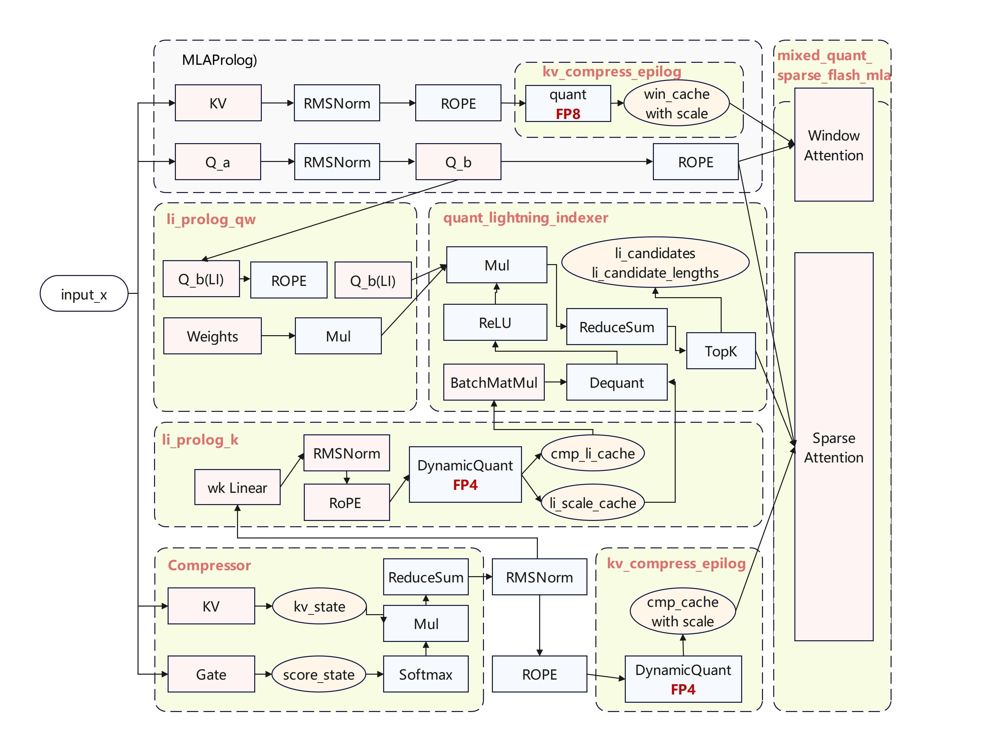
</p>

- **Reindex 层**：复用前层的压缩 KV 与 indexer K，只重跑 IndexerProlog/LightningIndexer（用自己的 Q 重打分）+ SparseAttention；

<p align="center">
  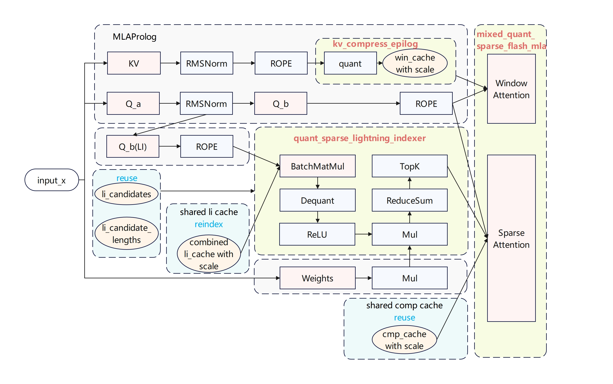
</p>

- **Reuse 层**：直接复用最近的 Top-K 索引，仅执行 SparseAttention。

<p align="center">
  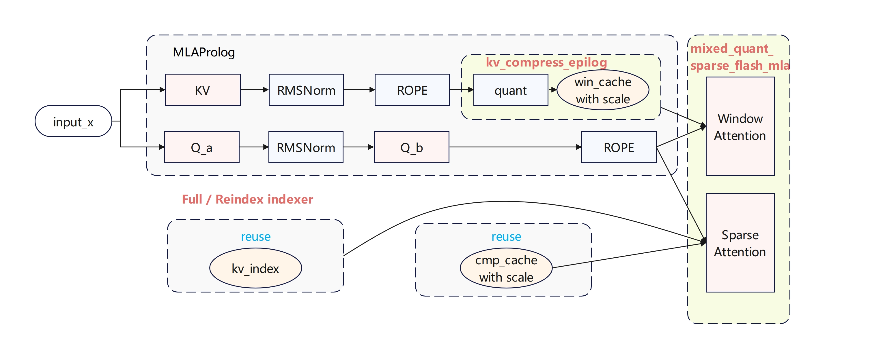
</p>


### MegaMoE 融合算子

常规 MoE 将 token 分发、专家 FFN 计算和结果聚合拆为多个算子执行，存在算子调度、中间数据搬运和通信等待开销。[MegaMoE](https://gitcode.com/cann/ops-transformer/tree/master/mc2/mega_moe) 将量化、token 分发、两次专家 Linear、SwiGLU 和 token 聚合融合，并在算子内部完成 Shared Expert 计算及结果相加，通过通信与计算的流水重叠减少阶段间等待。当前 DeepSeek-V4.1 在 Prefill 阶段接入 MegaMoE，Decode 保持原有 Dispatch / GMM / Combine 路径。

<p align="center">
  
</p>

- **融合范围**：Gate Linear 与 Gate TopK 在算子外执行，输出 `topk_ids` 和 `topk_weights`。MegaMoE 根据专家索引分发 token，执行 Routed Expert 的 Gate + Up → SwiGLU → Down，再将结果回传、按路由权重聚合，并叠加本地 Shared Expert 输出。

- **混合精度与量化复用**：Routed Expert 使用 MXFP4（Microscaling FP4，微缩放 4 位浮点）权重，Shared Expert 使用 MXFP8 权重，两路激活均为 MXFP8 E4M3、scale 为 E8M0。输入只量化一次，随后分叉：Routed 路径发送量化数据和 scale，Shared 路径在本地复用同一份量化结果，无需参与数据通信。

- **通信缓冲区复用**：模型初始化时按 EP 通信域和最大 token 规模创建 `SymmBuffer`，供各 MoE 层及后续 Prefill 调用复用，支撑 token 分发 / 聚合通信，避免逐层、逐步重复申请通信缓冲区。

#### MegaMoE 性能对比

MegaMoE 与 Double Routing 路径的 8 卡耗时对比如下。对照组为关闭 MegaMoE 后的原有 Prefill 路径；横轴为每 rank 输入 token 数，纵轴单位为 ms。

<p align="center">
  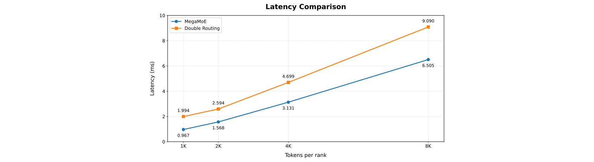
</p>

#### DEEPGEMM MegaMoE

DeepSeek 官方开源了 [DEEPGEMM MegaMoE 融合算子](https://github.com/deepseek-ai/DeepGEMM)，其融合范围与上述的 AscendC 算子有一些差别，需在算子外对输入进行量化，并对权重做了重新排布。

本样例同时接入了上述两种 MegaMoE 后端，可在 kernel_config 进行配置。

### 融合算子实现细节

针对本次开源的融合算子的详细技术解析，请参考[融合算子优化文档](deepseek_v4.1_cannbotdsl_operator_guide.md)。

## TileLang 融合算子

DeepSeek 官方开源的 [TileKernels 库](https://github.com/deepseek-ai/TileKernels)提供了基于 Tilelang 的一系列高性能融合算子，重点优化向量计算、寄存器内规约及访存流水。基于 DeepSeek 官方算子库，本实践提供了 **MoE Gate TopK**、**mHC Post** 以及 **Engram** 等算子的推理应用参考，当前已在 Prefill 阶段使用，提升推理性能。

### MoE Gate TopK

MoE Gate 根据各专家的路由分数，为每个 token 选择 Top 专家。多模态场景下，通过 `image_mask` 标识图像 token，并为其使用视觉专属偏置 `bias_vl`。

**核心优化：**

1. **SIMD 向量化打分**：每个向量寄存器承载 64 个 FP32 元素，支持 `sigmoid`、`identity` 和 `sqrtsoftplus` 打分方式。将打分、偏置处理及 `routed_scaling_factor` 缩放融合到同一计算流程中，减少中间结果搬运。

2. **寄存器级 TopK 规约**：384 个专家的分数恰好覆盖 6 组 64-lane 向量，无需额外 padding。通过树形比较与选择逐轮提取 Top-6，每层使用 `vmax` / `vsel` 更新候选分数及索引；分数相同时优先保留较小索引。每轮选出最大值后，屏蔽已选专家，再执行下一轮规约。

3. **多级缓冲与持久化调度**：利用多级 buffering 重叠数据搬运与计算，并沿 token 维度将任务分配给向量核，由各核循环处理所分配的任务，提高长序列下的核利用率。

**优化收益**：将打分与 TopK 选择集中在 64-lane 向量寄存器中完成，减少标量选择操作及中间候选结果的 GM 读写。

### mHC Post

mHC Post 将子层输出扩展到多路残差流，并与经过混合的残差相加。针对 `hc_mult=4`、`hidden_size=5120` 的模型配置，将广播与残差混合计算展开为向量 FMAC（融合乘加）操作。

**核心优化：**

1. **隐藏维分块**：沿 hidden 维度划分按 64 个元素对齐的数据块，块内进一步拆分为 64-lane 向量片段，将计算映射到 FP32 向量寄存器。

2. **广播与 FMAC 显式展开**：将 `comb_res_mix` 和 `post_layer_mix` 的系数广播到向量寄存器，并对输入、输出残差分支显式展开计算。每个输出分支完成 `post × x` 与各输入残差加权结果的累加，全程采用 FP32，最后统一转换为 BF16，减少中间舍入误差。

3. **多级缓冲与多核并行**：将 `comb`、`residual` 和 `x` 等输入预取至 UB，通过多级缓冲隐藏取数延迟。沿 token 与 hidden 分块构建二维任务空间，并按向量核数量分配任务，充分利用多核并行能力。

**优化收益**：将广播与混合计算映射为显式展开的向量 FMAC，发挥昇腾 950 的 64-lane SIMD 能力，减少标量控制开销和中间结果写回。

### Engram TileLang 融合算子

Engram 当前在 **Prefill** 场景接入三个 TileLang 融合算子，覆盖 Hash、Gate 权重预计算与 Gate 三个阶段。由于当前 TileLang 融合算子不支持 torch compile 入图，Decode 阶段保留原始的 PyTorch 小算子计算流程。

<div align="center">

| TileLang 融合算子 | 功能 |
| --- | --- |
| `tile_kernels.engram.engram_hash`  | 对已移位并完成 mask 的 token ID 批量执行 multiplier 乘法、逐阶 rolling XOR、按各 hash bucket 取模及 offset 累加，生成各 Engram 层、各 head、各 n-gram 阶数对应的 Embedding 查表行号 |
| `tile_kernels.engram.fused_weight`  | 将 `q_weight` 和 `k_weight` 从 BF16 转为 FP32 后逐元素相乘，生成 Gate 点积使用的 `weight_fused`；该算子不读取 WKV 输出，也不包含 WKV MatMul |
| `tile_kernels.engram.engram_gate_fwd` | 融合归一化、点积、signed sqrt、sigmoid、mask 和 value 注入 |

</div>

Prefill 的调用链为：

```
engram_hash
    -> MultiHeadEmbedding
    -> ReplicatedLinear WKV
    -> fused_weight
    -> engram_gate_fwd
```

其中 `engram_hash` 接收上层已构造好的 n-gram token 窗口，将原 PyTorch 路径中的乘法、rolling XOR、取模和 offset 累加合并为一次 TileLang 调用；token 移位、历史拼接和 mask 处理仍在该算子之外。`fused_weight` 只预计算 `q_weight.float() * k_weight.float()`，其结果随后由 `engram_gate_fwd` 使用；它与 WKV 输出之间没有数据依赖，WKV 投影仍由 `ReplicatedLinear` 独立完成。Engram 表采用 FP8 存储，查询结果按行转换为 BF16；量化 scaling factor 常驻 device local memory，由向量路径完成 gather。

#### Engram TileLang 性能对比

Prefill 融合算子性能对比（单位 μs，单次调用）：

<div align="center">

| Prefill tokens | engram_hash<br>TileLang | engram_hash<br>PyTorch | fused_weight<br>TileLang | fused_weight<br>PyTorch | engram_gate_fwd<br>TileLang | engram_gate_fwd<br>PyTorch |
|---:|---:|---:|---:|---:|---:|---:|
| 8K | 25.877 | 1118.970 | 2.856 | 542.804 | 355.302 | 4129.162 |
| 16K | 43.668 | 1989.527 | 3.202 | 1073.346 | 724.430 | 8112.683 |

</div>

## 量化策略

- **权重与激活**：共享专家采用 MXFP8 A8W8 全量化计算，MoE 专家采用 A8W4 伪量化计算，权重使用 MXFP4 存储。

- **KV Cache 分精度存储**：滑窗 KV 用 FP8 E4M3（32 元素一组保存 BF16 scale）、压缩 KV 用 FP4（16 元素一组保存 BF16 scale）、IndexCache 用 MXFP4（32 元素一组保存 E8M0 scale），具体见下述章节。

- **Engram 表**：表本体保持 FP8 存储，查询时按行反量化到 BF16。

### 融合算子的量化边界

下面说明 V4.1 各融合算子的量化边界。图中 `W/A/C` 分别表示矩阵乘的权重、激活和 Cache 存储格式；未标注的 Linear 保持 BF16，scale cache 属于量化元数据。

<p align="center">
  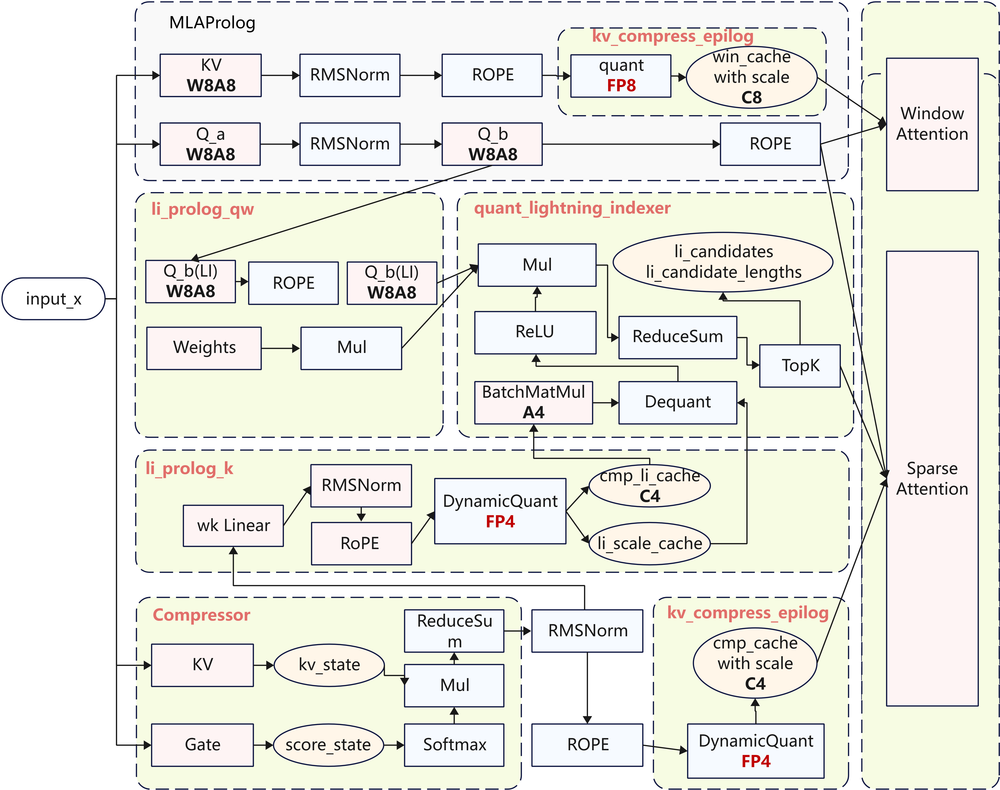
</p>

#### MLAProlog

- `Q_a`、`Q_b` 和 `KV` 投影采用 **W8A8**，对应 MXFP8 权重和激活路径。
- `KV` 经 RMSNorm 和 RoPE 后写入 Window KV Cache。`win_cache` 采用 **C8**，缓存数据为 FP8 E4M3，并按 32 个元素一组保存 BF16 scale，对应代码中的 `mxfp8_bf16` 模式。
- `C8` 表示 Window KV Cache 的存储格式，不表示该写回阶段存在独立的量化权重。

#### IndexerProlog 与 LightningIndexer

- `li_prolog_qw` 中的 `Q_b(LI)` 使用 **W8A8/MXFP8**；`weights_proj` 保持 BF16。融合路径随后对 Query 做 MXFP4 动态量化，输出 Query 及其 scale。
- `li_prolog_k` 中的 `wk Linear` 保持 BF16，K 经 RMSNorm 和 RoPE 后写入 `cmp_li_cache`。该 Cache 使用 **C4/MXFP4**，配套的 `li_scale_cache` 保存 E8M0 scale，量化分组大小为 32。
- `quant_lightning_indexer` 使用带 scale 的 MXFP4 Query/Key 执行候选检索。图中的 `BatchMatMul A4` 表示 Q/K 两个输入均为 MXFP4；`li_candidates` 和 `li_candidate_lengths` 是候选 block 索引及有效长度，不属于 W/A/C 量化算子。

#### Compressor 与 KV Cache 写回

- Compressor 的 `wkv`、`wgate` Linear 明确保持 BF16，不接入量化配置；压缩过程中的状态和归约计算保持浮点路径。
- `kv_compress_epilog` 将压缩后的 KV 写入 `cmp_cache`。该 Cache 使用 **C4/MXFP4**，每 16 个元素共享一个 BF16 scale，量化模式为 `mxfp4_bf16`。

> **注：**
> - `W8A8` 表示 Linear 的权重和激活均采用 MXFP8；`A4` 表示 Lightning Indexer 的 Q/K 输入采用 MXFP4，并配套 E8M0 scale。
> - `C8` 表示 Window KV Cache 采用 FP8 E4M3 存储，按 32 个元素分组保存 BF16 scale。
> - Indexer Cache 的 `C4` 表示 MXFP4 数据配 E8M0 scale，分组大小为 32；Compressed KV Cache 的 `C4` 表示 MXFP4 数据配 BF16 scale，分组大小为 16。
> - `li_candidates` 和 `li_candidate_lengths` 是候选索引元数据，不属于 W/A/C 量化算子；未标注量化格式的 Linear 保持 BF16。

## Engram 优化

Engram 是解耦「记忆」与「计算」的条件记忆模块，以可训练的 n-gram 哈希记忆补充固定上下文之外的语言先验：共 196B 参数，分两个模块注入在 L1、L14 两层，每个模块覆盖 2-gram 至 4-gram、8 个哈希 head、每 head 约 16M 条目的表，embedding 表与 K/V 投影均用 FP8 精度。作为新增模块，其每 token 的哈希查表与查表投影权重的流式读取是 Decode 带宽的新增项，权重读取量与 MoE 激活专家权重读取同量级；384M 行的查表规模对 HBM 容量也提出要求。CANN 侧针对 Engram 的优化主要包括存储 offload 与多流调度两部分（接入的 TileLang 融合算子见 [Engram TileLang 融合算子](#engram-tilelang-融合算子)）。

<p align="center">
  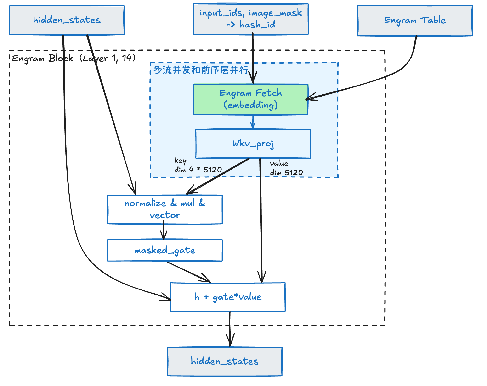
</p>

Engram 表本体两表合计 2 × 384M × 256 × 1 字节 ≈ 197 GB，采用多级多卡切分，并整体 offload 到 host 内存上存储；量化采用 MXFP8，其 scale factor 数据量相对较小，全量存储到 device 内存中，减少小数据量的通信开销。

### 通信实现——灵衢 UB

Engram 表 offload 到 host 侧，通过 UB 能力从分布式的 host memory 中 fetch Engram 表。

<p align="center">
  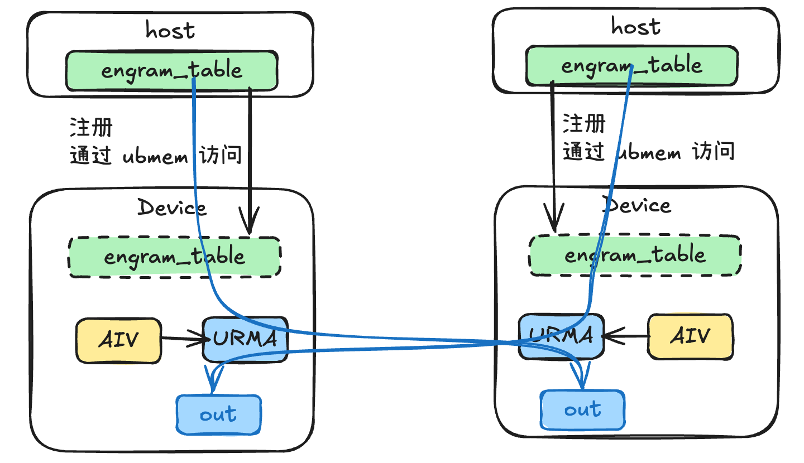
</p>

通过 URMA 转 UBMem 的方式进行互通，获取 Engram 表数据：

1. 将 host memory 注册到 device 侧，获取 device 侧可以访问的地址；
2. 使用 hcomm 的能力建立 URMA 通信连接；
3. 使用 AIV 将组网通信任务放入 URMA 通信队列中，后续 URMA 后台执行，不占用计算核，与计算 overlap。

**支持量化能力**：量化的 scaling factor 参数数据量小很多，当前没有 offload 到 host 侧，全量 Engram 表的 scaling factor 参数都放在 device 的 local memory 中，由 AIV gather 到输出上（后续当 Engram 表非常大时，也考虑将 scaling factor offload 到 host memory 上）。

<p align="center">
  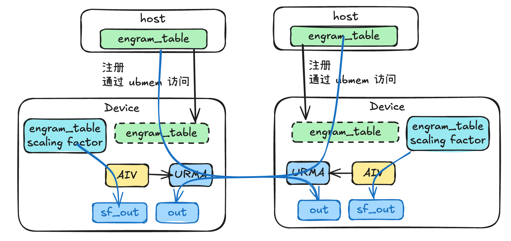
</p>

### Engram 多流调度

#### 阶段划分

从调度角度，Engram 前向过程可以拆分为四个阶段：

<p align="center">
  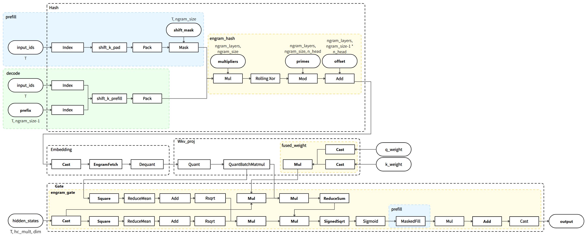
</p>

图中四个阶段表示 Engram 的计算职责和数据依赖；Hash、Embedding 和 WKV Projection 构成可提前计算链，Gate 是依赖当前层 hidden states 的主流汇合阶段。

- **Hash**：Prefill 在一次 forward 开始时对整段输入执行一次 Hash，n-gram 窗口前不足部分用 `pad_id` 补齐；Decode 则将新增 token 与真实 `prefix_input_ids` 拼接，从真实历史中构造 n-gram 窗口。两条路径都只生成一份 `engram_hashes`，Layer1 和 Layer14 按 `layer_hash_index` 复用对应切片，Layer14 不重复执行 Hash；
- **Embedding**：按查表行号读取并拼接 Engram 表向量；
- **WKV Projection**：通过 `ReplicatedLinear` 生成多路 key 和共享 value；
- **Gate**：结合当前层 `hidden_states`、key、value 及 q/k 权重计算门控结果，并将 value 注入残差流。

其中 Hash、Embedding 和 WKV Projection 不读取当前 Decoder Layer 的 `hidden_states`，具备提前计算条件；Gate 必须在对应层主流中执行，因此是多流预计算的汇合点。Prefill 和 Decode 都遵循这一逻辑拆分。

#### 主流/副流调度

当 `enable_engram_multi_stream=True` 时，模型创建 `engram_precompute` 副流。当前实现只将不依赖 `hidden_states` 的预计算阶段放入副流，Gate 仍在对应 Decoder Layer 主流中执行。

<p align="center">
  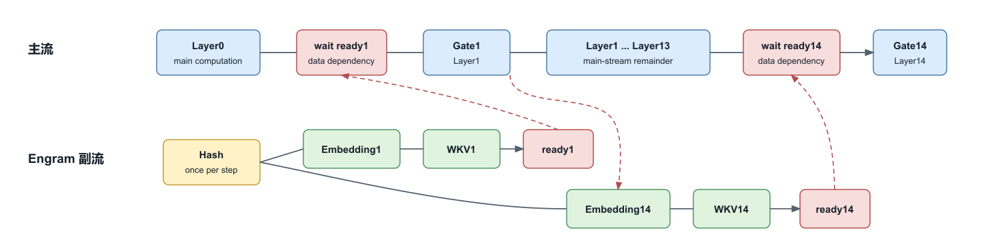
</p>

图中实线箭头表示同一流内的执行或数据流，红色虚线箭头表示跨流依赖。副流先执行 Hash 和 Layer1 Embedding，主流并行执行 Layer0；Layer0 返回后，副流继续执行 WKV1 并记录 `ready1`，主流在进入 Layer1 Gate 前等待该 event。Layer1 主流计算返回后，副流复用已有 Hash 结果提交 Layer14 的 Embedding/WKV，并记录 `ready14`，这部分计算与主流 Layer2 至 Layer13 重叠，主流到达 Layer14 Gate 前再等待 `ready14`。因此，`ready1` / `ready14` 只保证对应 WKV 在 Gate 消费前完成，跨流结果的 Tensor 生命周期由 `record_stream` 维护。当前的 Engram 多流方案中，为不影响模型主干部分的执行性能，暂未配置 Cube/Vector/MTE 控核。

调度逻辑可概括为以下伪代码：

```
Engram side stream: Hash -> Embedding1
Main stream:        Layer0

Engram side stream: WKV1 -> ready1
Main stream:        wait ready1 -> Layer1 Gate

Engram side stream: Embedding14 -> WKV14 -> ready14
Main stream:        Layer2 ... Layer13
Main stream:        wait ready14 -> Layer14 Gate
```

## DSpark

基于 Ascend 950 DT，当前已支持 DeepSeek-V4.1-Flash 的 DSpark 投机推理，在一次草稿模型执行中生成一组 Draft Token，再由主模型批量 Verify。与原生 MTP 逐步生成候选不同，DSpark 使用多级 Proposal Layer 生成 Draft Block，通过 Markov Head 引入块内 Token 的条件依赖、串行生成 Draft Token，并由 Confidence Head 给出候选置信度。

<p align="center">
  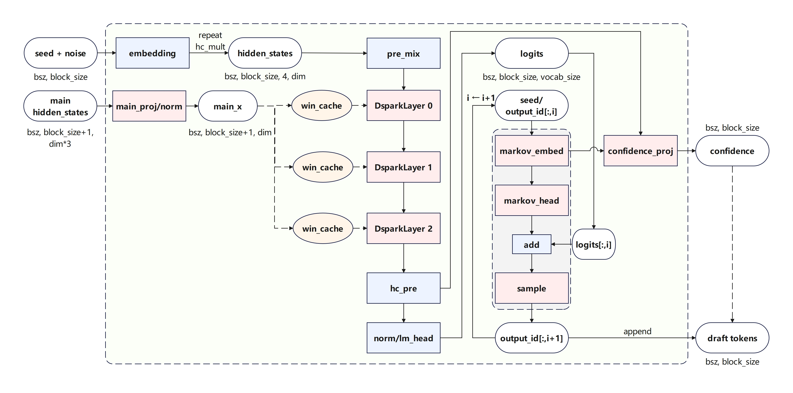
</p>

### Main Model 方案

- **Hidden States 收集**：主模型按 `dspark_target_layer_ids: [37, 38, 39]` 的输入表示，供草稿模型构建历史上下文。
- **Verify 流程**：主模型校验上一轮候选，`DSparkWorker` 根据主、草稿模型的采样概率执行拒绝采样，返回接受前缀和下一个 Token。每条请求的候选 Token、生成概率和有效长度保存在 `DSparkInfo` 中，随 Batch 组装与回写，保证请求间的对应关系。
- **Verify 形状**：设每组候选数为 N，主模型每条请求的 Decode 输入固定为 N+1 个位置。Confidence 截断只改变有效候选前缀，不切换不同宽度的校验图。

### DSpark Spec Model 方案

- **模型结构**：`DeepseekV41DSparkProposalModel` 复用主模型类的公共初始化和输入预处理，`DeepseekV41DSparkModel` 提供 KVCache 申请与前向推理逻辑，并串接多层 `DeepseekV41DSparkProposalLayer` 完成计算。各层使用独立的权重，最后一层包含 Markov Head 和 Confidence Head；Embedding 和 LM Head 与主模型共享。
- **整体流程**：输入带噪输入与辅助 hidden states，分别通过 Embedding 和投影归一化层处理后，送入 3 层 Transformer 生成 logits；随后结合马尔可夫 Embedding 与 Head 进行串行采样，生成 Draft Token，最后计算候选置信度。
- **框架接入**：框架统一提供投机组件，`DSparkWorker` 实现 seed/noise 与候选输入准备、块级候选生成和概率校验等功能。
- **Cache 结构**：`DeepseekV41DSparkModel` 给各层申请 SlidingWindow Cache，由框架 `KVCacheManager` 统一分配和绑定。
- **Attention 范围**：每个 query 读取最近最多 `window_size` 个已确认上下文 KV 和完整 Draft Block。
- **Prefill 流程**：主模型完成 Prefill 计算后，草稿模型将辅助 hidden states 处理后写入 KVCache，预先构建草稿模型的缓存基础。
- **Decode 流程**：根据接受数量，将本轮输入 seed 及已接受 Token 对应的主模型 hidden states 完整执行一次 DSpark 前向，生成一组全新的 Draft Token。
- **采样与截断**：草稿温度默认继承请求 `temperature`，也可通过 `draft_temperature` 单独设置。生成候选与保存概率采用同一采样分布；启用 `confidence_threshold` 时，在首个置信度低于阈值的位置截断有效前缀，阈值为 0 时关闭截断。

## 推理并行策略

针对Decode场景，在`950DT`平台下，可以采用8卡或16卡部署模型推理，获取极低单用户时延。针对Prefill场景，在`950PR`平台下，采用8卡或16卡部署，针对长短序列可以分别选用DP或CP并行，提升TTFT。

### Prefill Context Parallel

Prefill 的算力开销随序列长度线性增长，长序列下单卡 Prefill 成为首 token 时延的瓶颈。V4.1-Flash 在 Prefill 阶段采用 Context Parallel（CP）把单条请求的序列切分到各卡并行计算，Decode 仍按 DP 执行，两阶段的并行方式相互独立。

#### 序列切分与段长

该网络的 LLM 主干注意力全程保持因果（详见 [ViT 结构](#vit-结构)），均匀切分会让靠后的段读到更多上文、各卡负载不均，因此采用 **Zigzag 切分**：序列切成 `2 * cp_size` 段，第 `r` 张卡同时持有第 `r` 段与第 `2 * cp_size - 1 - r` 段，一段靠前、一段靠后互补，各卡注意力计算量相同；序列末段固定落在第 0 张卡。两段的因果范围不同，因此每层按段各执行一次注意力，窗口索引、压缩序列长度与算子 tiling 元数据均按段构建。

如下图所示，每行是一个段，填色格是该段注意力要读到的上文范围，同一颜色的两行由同一张卡持有。

<p align="center">
  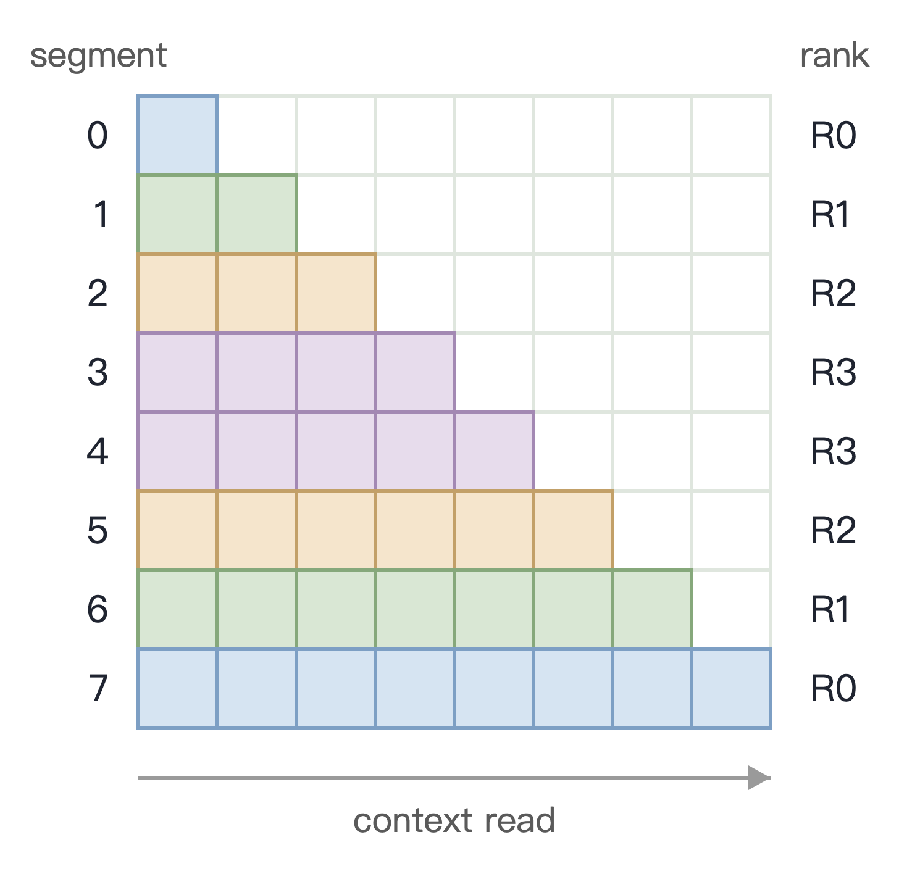
</p>

切分以请求为单位，每条请求先向上对齐到`2 * cp_size * sliding_window`，再将各请求独立切分。段长受滑窗宽度托底，因此短于 `2 * cp_size * sliding_window` 的请求会被补齐到该长度。

#### 跨段依赖与通信路径

切分后每段自身的注意力在本卡完成，跨段依赖分两类：算本段之前要读前序段的数据，包括滑窗 KV 与 2倍压缩CSA 的 `remainder`；本段产出之后要让所有段都能读到，包括压缩 KV 与 index KV。前者只取前序段的一小块，后者需要收齐到全域。

滑窗 KV、压缩 KV 与 index KV 三条路径走同一套流程：一次 AllGather 把本卡产出的行发到全域，收齐结果按槽位散写进本轮 Prefill 读取的临时 Cache；再由该请求 Decode 所属的卡落一份进 Decode 读取的 Cache。Prefill 期间的读写都在临时 Cache 上，Decode 读取的 Cache 只接收交接过去的那一份。

下图以 2倍压缩CSA 的 KV 源层为例，展示 CP 下的通信。

<p align="center">
  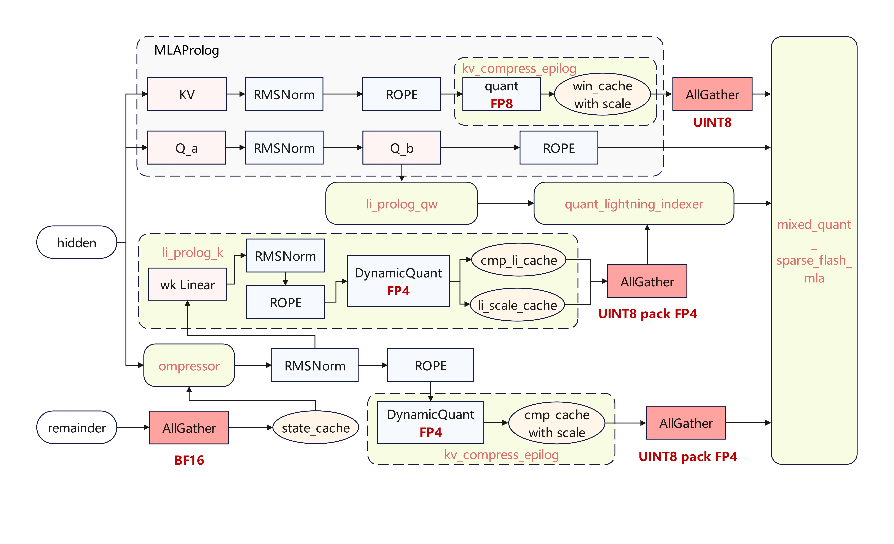
</p>

其余层按前述规则递减：非源层不产出压缩 KV 与 index KV，只保留滑窗一路的交换；1倍压缩CSA 的源层没有 `remainder`，不走 `state_cache` 这条路径。

这三类搬的都是量化后的 Cache 行，以下字节数含 scale（量化格式与分组详见 [量化策略](#量化策略)）。其中压缩 KV 的收齐是通信主项，且随序列长度线性增长；滑窗每层的量与序列长度无关，序列越长占比越低。

#### 滑窗 KV

滑窗注意力仅覆盖最近 128 个 token，每段段首需要访问前序 `sliding_window=128` 大小的 KV Cache。切分后前序 KV Cache 分布在其他卡上，因此每层算完本段 KV 后，把本卡两段尾部各 128 行合并做 1 次 AllGather，各卡从全局结果中按段号取出对应的前序尾窗，写入本卡的临时窗口 Cache。

交换的是 Cache 中已量化的 FP8 行，每行 `512 + 512 / 32 * 2 = 544` byte。滑窗注意力每层都存在，因此每层都需要交换 1 次，单层交换量与序列长度无关。

#### 2倍压缩CSA 的 remainder

2倍压缩CSA 每 2 个 token 压成 1 行。段长不是压缩比整数倍时，前序段末尾会剩下凑不满一组的 token，即 `remainder`，后续段的首组需要它才能完成压缩，而它位于前序卡上，无法经本地压缩状态传递。

因此落在 2倍压缩CSA 的 3 个 KV 源层，在压缩本段之前各多做 1 次 AllGather 取各段最后一个 hidden，投影后按槽位写入 Compressor 的压缩中间状态 Cache，Compressor 依 `start_pos` 从状态 Cache 读取该 token，省去拼到段首时的整段 hidden 拷贝。这条路径让段长不受压缩比约束。

#### 压缩 KV 与 index KV

压缩 KV 与 index KV 由 4 个 KV 源层集中产出、全网共享（详见 [总体架构](#总体架构)）。每段打分要读到它之前的全部压缩位置，而这些位置分散在各卡，因此源层产出后必须收齐到全域。压缩行与 index 行各按 Zigzag 段序做 1 次 AllGather；非源层直接读共享 Cache，不再通信。

两类行都是量化后再通信。通信搬 FP4 行而不是 BF16：压缩行 `512 / 2 + 512 / 16 * 2 = 320` byte，BF16 下为 1024；index 行 `128 / 2 + 128 / 32 = 68` byte，BF16 下为 256。量化只做本卡产出的那一份，不必对收齐后的全量行再算一遍。

#### 向 Decode 交接

同一条请求的 Decode 只在一张卡上执行，而 Prefill 期间每张卡都持有整条序列的压缩 KV 与 index KV。因此由该请求 Decode 所属的卡在产出这些数据的同一步里，顺带把压缩 KV、index KV 与该请求最后一个滑窗各写一份进 Decode 读取的 Cache。

压缩中间状态只存在于该请求结束所在的段，其他卡无法直接获取，因此 2倍压缩CSA 的源层还需对状态 Cache 做一次全域收齐，把最后一段的 `remainder` 状态传递给 Decode；多 Batch 下各请求结束于不同卡，按请求逐条选源。

#### 其他模块的配合

- **视觉输入**：ViT 在 `attn_tp_size * cp_size` 的视觉并行组内按整图并行，编码结果 AllGather 到组内各卡；视觉特征按完整 `input_ids` 定位图像位置，各卡只回填落在本段的部分。`image_mask` 按 Zigzag 顺序切分，供 MoE 门控与 Engram 使用。图像 token 与文本 token 同等切分，不约束段边界。

- **Engram**：n-gram 回看会跨段，因此哈希在完整序列上算完再按 Zigzag 取本卡两段，同样使用切分后的 `image_mask`。

- **DSpark**：草稿模型的 Prefill 不做注意力，每条请求只需最后一个滑窗的 hidden；CP 下这部分按 Zigzag 散开，由主模型在层循环之后单独收齐一次。草稿模型按全局 batch 执行，因为按归属局部执行可能让部分卡无请求可算，而 MoE 的 EP 通信要求各卡都参与。结果再按请求归属交给各自的 Decode 卡。

### Decode 并行（DP+EP）

Decode 阶段沿用 DeepSeek 系列的并行方案：

- **Attention 采用 Data Parallel（DP）并行**；
- **MoE 采用 Expert Parallel（EP）并行**；
- **LM Head 采用 Tensor Parallel（TP）并行**；
- 低时延场景可进一步对 Attention 做 TP 切分（详见[低时延场景推理性能优化实践](deepseek_v4.1_low_latency_tp_guide.md)）。

## 推理部署策略

DeepSeek-V4.1 模型的推理天然分为三个工作负载特征迥异的阶段，工程实现中也显式分离。

### EPD 三段分离

- **VisionEncoder（视觉编码）**：算力密集场景。ViT 编码器对单图执行全双向注意力，经 Aligner 对齐到主干隐层，输出仅在 prefill 首 chunk 的 span 覆盖时被消费（详见 [ViT 结构](#vit-结构)）。

- **Prefill**：算力密集场景。压缩集中于 L0–L20 的 4 个源层，后 19 层可尾部截断只算最后 128 token（详见[分层结构与 KV Cache 复用](#分层结构与-kv-cache-复用)）。可使用 **CP + EP** 的并行方式（详见 [Prefill Context Parallel](#prefill-context-parallel)）。

- **Decode**：带宽密集型。每 token 主要开销为搬运一轮权重，受带宽限制；滑窗 ring buffer 与压缩中间状态槽位按位置模 ratio 递增更新，增量计算开销恒定。

三阶段资源特征（视觉编码算力 / Prefill 算力 / Decode 带宽）不同，可部署在不同硬件配比上。昇腾 950 代际芯片提供 PR/DT 两种形态，支撑灵活部署。


### Prefix Cache 命中

池化 KV Cache 的持久化边界（只存压缩 KV + index KV + 压缩中间状态，不存滑窗 Cache）决定了命中场景的处理方式：

- **命中判定**：新请求 prompt 与既有序列共享前缀时，命中区间直接复用已持久化的压缩 KV 与 index KV，跳过对应区间的压缩计算；命中 hash 判定条件仅需覆盖历史 KV 的 hash，与 SWA 型 LinearCache 无关，易于命中。

- **SWA 感受野补偿**：滑窗注意力仅覆盖最近 128 个 token，命中点之前的滑窗 Cache 未被持久化，因此命中场景需要在命中点**向前补算 128 个 token（window\-size）**，重建各层滑窗 Cache，弥补 SWA 的感受野；其余历史压缩 KV 经 PA 存储直接命中获取，无需回退计算。具体流程为：

    - **调度回退**：Prefix Cache 命中后、进入调度器前，将本轮计算起点向前回退 128 个 token，实际调度长度包含新增 token 与补算的 128 个 token；
    - **缓存复用边界**：补算的 128 个 token 不更新 C1/C2 压缩 KV 与 Indexer Cache，对应缓存直接复用命中数据；超出补算窗口的新增 token 在计算时正常更新上述缓存；
    - **滑窗计算覆盖**：各层滑窗 Cache 的更新与 FA 计算均需纳入补算的 128 个 token；
    - **尾部滑窗持久化**：整个 Prompt Prefill 结束后，将临时滑窗 Cache 尾部 window_size（128 token）部分持久化，供下一个 chunk 及 PD 分离场景下的 Decode 节点使用。

<p align="center">
  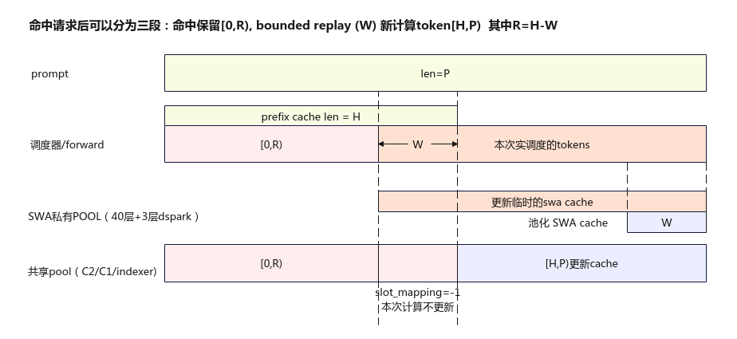
</p>

## Benchmark

**Ascend 950DT Deepseek-V4.1-Flash Benchmark**

[profile_data](https://cann-ai.obs.cn-north-4.myhuaweicloud.com/cann-quantization/DeepSeek/profile_data/trace_view_deepseek_v41_flash_a5_decode.json)

在 `Ascend 950DT` 平台上，本实践使用32卡部署FP8-FP4混合精度模型，部署策略采用 Attention Data Parallel (DP) 和 MoE Expert Parallel (EP) 并行。DeepSeek-V4.1-Flash 128K 序列场景 Decode 单卡吞吐可达5800TPS@13.79ms。低时延推理场景时延可低至 5ms 以内，并实现2727吞吐性能表现，对应的Profile数据已在上方链接开源。不同场景的性能 benchmark 测试如下：

<div align="center">

| Global Batch Size | Chips | Dspark  | Seq Length | TPOT (ms) | Throughput (Tokens/p/s) |
| ----------------- | ----- | ---- | ---------- | --------- | ----------------------- |
| 384              | 32    | 5    | 131072     | 4.40     |   2727                  |
| 1536              | 32    | 5    | 131072     | 9.41     |   5102                  |
| 2560              | 32    | 5    | 131072     | 13.79     |   5800                |

</div>

> 注：性能数据基于 Dspark 投机推理与强制 EPLB 配置采集，Dspark 5场景下平均接受 token 为4.1个，用户可按照数据集的实际接受率自行折算 benchmark 性能。

## Future Plan

- Tilelang 算子将在近期支持 `npugraph_ex` 入图，进一步扩大应用场景，支持高性能训推。
- Prefill CED 独立部署：支持 CED 架构下，encoder-decoder 分离部署，提升端到端性价比。
- SWA Cache pool 独立淘汰机制支持：节省池化内存占用，提升服务性价比。
- MindSpore FxRT + GERT：面向 prefill 动态 shape 短序列长街，提供 MindSpore RxRT + GERT 图执行器，通过 C++ Runtime、符号 shape 机制、运行时 CodeGen 技术解决 host-bound 问题。
