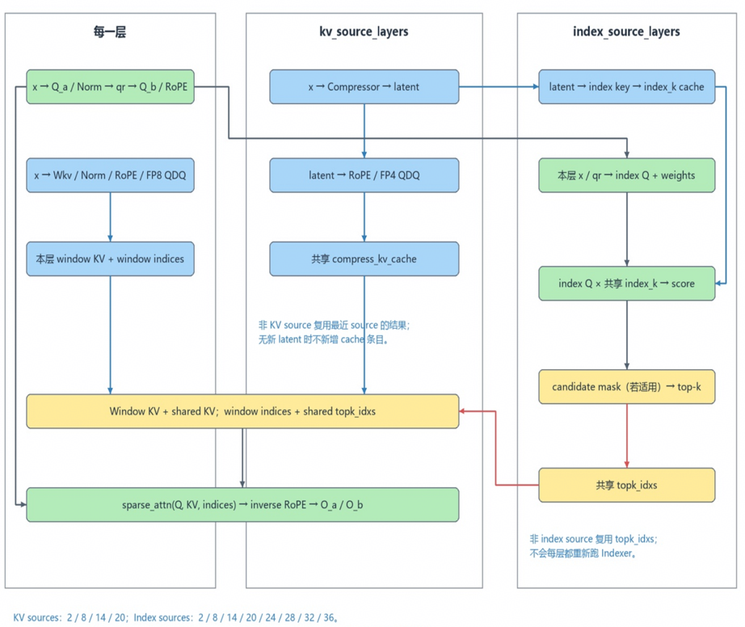
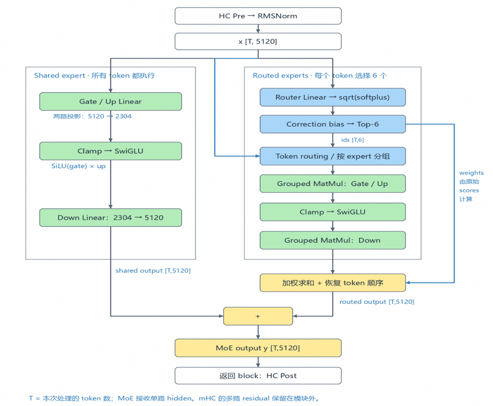
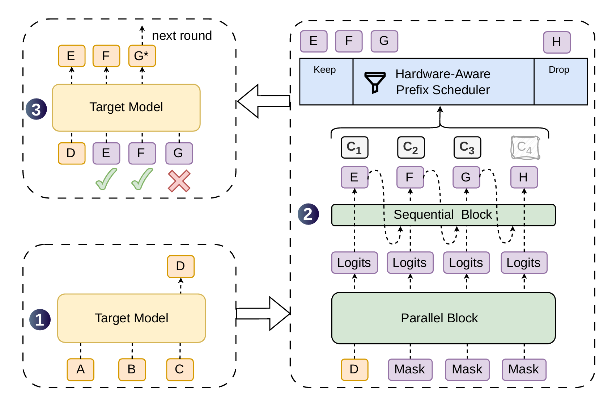
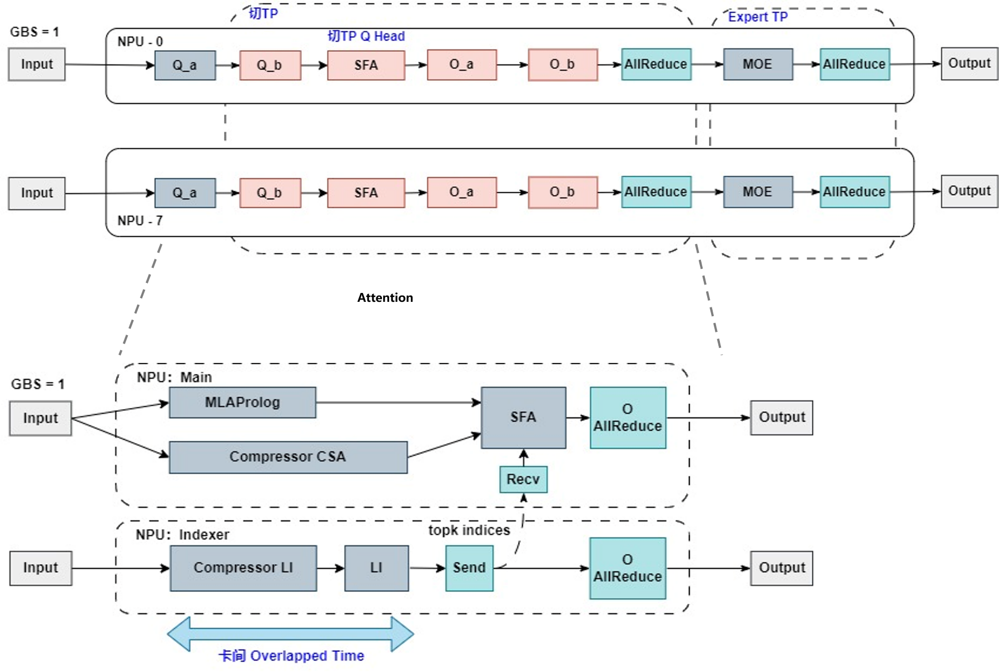
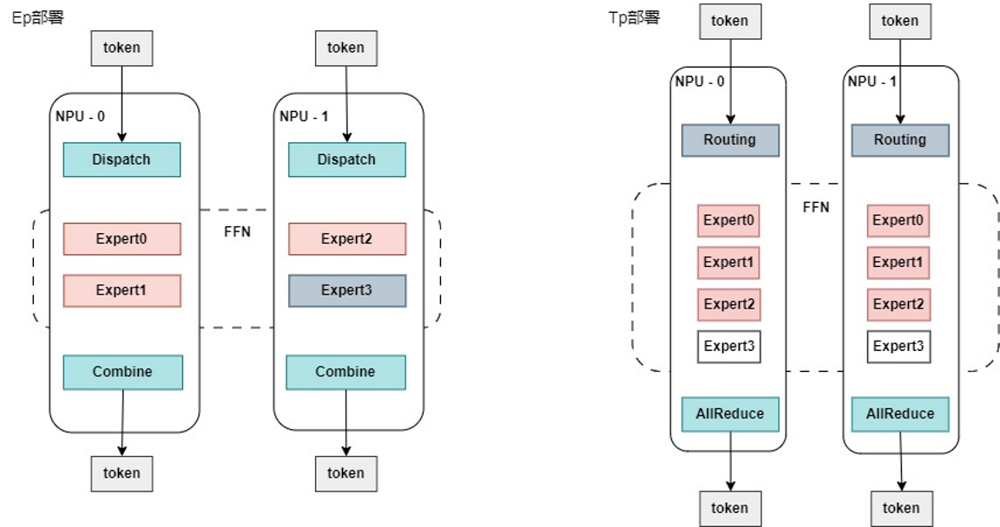
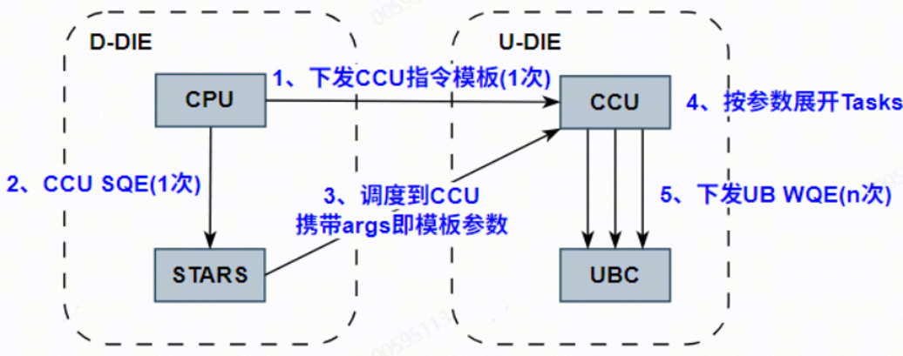
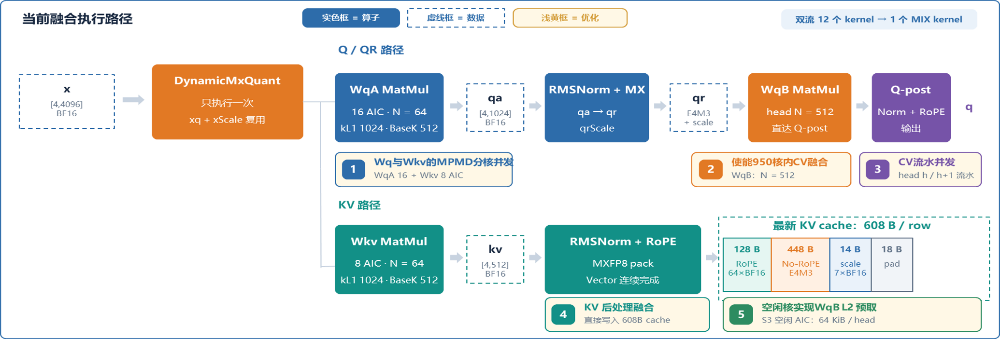

# DeepSeek-V4.1 极低时延场景技术报告

本文针对Ascend 950平台，部署DeepSeek-V4.1 Flash模型Global Batch Size为1（GBS=1）的单请求场景，说明并行部署、Attention/MoE 算子和设备侧调度等低时延优化方案，叠加Dspark投机推理取得Decode 2ms量级的等效时延。

与大Batch的高吞吐场景相比，低时延场景Decode的计算量更小，优化重点在于减少权重搬运，降低算子启动、通信头开销等固有耗时。

## Highlights
- 针对GBS=1场景的Tp部署方式，包括Attention局部Tp和MOE Tp；
- 针对DSv4系列模型的Attention异构分卡部署，充分利用模型结构内的独立数据通路，取得并行收益；
- 针对Tp场景的融合算子优化，MOE模块支持稀疏Group List通路，MLA融合算子优化；
- 针对单机场景的通信策略，高效CCU AllReduce；
- 框架特性优化：Npugraph EX、多流、Superkernel、预取。

## Outline

- [模型结构](#模型结构)
- [部署策略](#部署策略)
- [算子优化](#算子优化)
- [框架执行优化](#框架执行优化)
- [Benchmark](#benchmark)
- [Future Plan](#future-plan)

## 模型结构

本实践的低时延优化围绕Attention和MoE两条主路径展开。

### Attention

DeepSeek-V4.1的Attention路径由压缩、索引、稀疏注意力和输出投影组成：

1. **Compressor** 将历史 KV 压缩到低维表示，并按压缩比写入压缩Cache；
2. **Indexer/LI** 根据压缩表示计算索引权重，选择Sparse Attention所需的Top-K位置；
3. **MLA Prolog** 计算当前 Token 的 Q、QR和压缩KV，同时完成归一化、RoPE及量化相关后处理；
4. **SFA（Sparse Flash Attention）** 使用 Q、压缩KV和Top-K索引完成稀疏注意力；
5. **O Projection** 将注意力结果投影回隐藏维度，并把结果交给后续MoE。

Indexer的输出决定SFA的访存范围，Compressor的输出KV则作为后续Attention阶段的输入。部署设计需要基于数据依赖识别 Compressor、Indexer和MLA Prolog之间的并行窗口；同时在多`stream`并发的片段要注意错开不同流上算子消耗的资源，减少并行争抢带来的劣化。

  

### MoE

MoE模块包含共享专家和路由专家。路由分支依次经过Router、TopK选择、专家分组、FFN和Token复原，最后与共享专家输出相加。GBS=1时，每个专家收到的Token数可能很少，耗时大头在专家权重搬运与Token分发通信。

MoE路径的优化重点是减少无效专家处理、使专家权重分片与执行`rank`对齐，并采用适合低Token数的Grouped MatMul输入格式。共享专家沿本地残差路径计算，与路由专家并行计算，最后与路由专家的局部结果在既定通信点汇合。

  

### DSpark

DeepSeek-V4.1 Flash的[DSpark方案](./deepseek_v4_inference_guide.md#dspark)支持Ascend 950系列，在一次草稿模型执行中生成一组Draft Token，由主模型批量Verify。与原生MTP逐步生成候选不同，DSpark使用多级Proposal Layer生成Draft Block，并通过Markov Head建模块内Token依赖，Confidence Head给出候选置信度。

  

## 部署策略

### Attention 部署策略

**Q Head Tp切分**

在`low_latency_tp`场景下，面向单请求GBS=1场景，Attention模块对Q Head做局部Tp切分。具体计算流程中，`q_a`不变，从`q_b`开始，Prolog与SFA（Sparse Flash Attention）按Q Head做Tp并行；LI和压缩KV保持原有计算方式和数据布局，不进行TP切分。

Epilog/O-Projection延用前序Q Head的切分，在同一TP域内完成局部计算，再通过`all_reduce`通信汇合结果。相较Dp场景下做局部O Projection Tp并行，Tp场景的并行方案只需要在O Projection可以省略一次通信，只在结束后做一次`all_reduce`。

TODO: 当前低时延路径已临时回退为 Q-B 全量计算，待 FA 支持 TP 分片 head 输入后恢复切分（见 Future Plan）。

**Prolog异构分卡部署**

在全局 TP 的基础上，Prolog利用模型结构中固有的Prolog、LI和Compressor多条独立数据通路进行异构分卡部署：一半NPU作为 MLA Worker，执行MLA Prolog、Compressor CSA、SFA 和O Projection计算；其余NPU作为Indexer Worker，执行Compressor LI、LI权重路径和索引计算。MLA Worker和Indexer Worker两两结对。Indexer Worker 生成 `topk_indices` 后将其通过`send\recv`点对点通信传递给结队的MLA Worker，由MLA Worker执行SFA和后续输出路径；利用CANN的多流能力，MLA Worker并行执行自身的计算和与LI Worker之间的通信，使得通信开销可以被掩盖。

  

上图上半部分展示全局GBS=1 TP：Prolog/SFA按Q Head切分，Epilog延续相同分片，Expert TP负责后续MoE。下半部分展示 Prolog 异构分卡：MLA Worker与Indexer Worker分别执行对应链路，并通过Top-K索引传递完成协同。

### MoE 部署策略

**全局采用 GBS=1 的 TP 部署**

MoE模块延续前序模块的TP切分，使同一请求在各`rank`上保持一致的并行部署。与EP部署相比，该TP路径可减少Dispatch/Combine阶段因Token分发产生的通信开销。

MoE 低时延部署包含以下关键策略：

- **延续前序模块的 TP 切分**：Attention模块的输出进入MoE模块后继续使用既有TP域，减少额外的Dispatch通信和Token重排；
- **负载均衡**：TP部署保障各`rank`均有所有专家部分权重，避免负载集中于少数`rank`，并降低最大权重搬运量；
- **搬运亲和的 TP Shape 切分**：结合专家分组、执行Rank和片上Cache容量划分权重，使权重搬运路径与GMM的输入布局匹配，减少重复HBM访问。

GBS=1 场景下，每个专家接收的Token数较少，本实践使能了稀疏Group List表达GMM计算所需要的专家，节省Kernel内专家遍历与匹配的开销。同时TP切分后的权重Shape需要亲和GMM的搬运粒度，使得算子获得更佳的计算性能。

  

上图对比EP和TP两种MOE的部署方式。EP模式通过Dispatch/Combine通信在不同`rank`间交换Token，匹配Token与选择计算的Experts；TP模式在各`rank`保留所有专家的对应偏移分片，本地计算后通过`all_reduce`获得完整计算结果。低时延场景沿用前序模块的TP布局，以减少额外的Token分发。

### Low Latency Tp场景各模块并行策略

| 模块名称 | Tp Size | 作用 |
| --- | ---: | --- |
| `world_size` | `8` | 全局参与计算的Rank数 |
| `q_tp_size` | `1` | Q Head的并行度，影响`q_b`和FA |
| `li_tp_size` | `1` | Indexer/Compressor的Tp度 |
| `o_proj_tp_size` | `4` | O Projection的Tp度 |
| `moe_tp_size` | `8` | MOE计算的Tp度 |

仓库中的统一配置入口为 [`low_latency_tp 8 卡 YAML 配置`](../../../models/deepseek_v4_1/config/deepseek_v4_1_flash_rank_8_1bs_tp_multimodal.yaml)。

## 算子优化

### 稀疏 Grouplist

稀疏 Grouplist 使用二维格式描述 `expert_id` 和Token数，将有效专家排在前部，尾部保留无效或零 Token 项，Grouped MatMul 只处理有效专家。在Token数量较少的极低时延场景，可以减少空专家的冗余遍历，降低Scalar开销。与固定长度专家表相比，该方式还减少专家边界解析和本地专家重排。

### Cache 亲和的专家权重切分

专家权重切分时，让不同`rank`成对上下对齐权重Shape，使切分后的Shape对齐128等亲和Cache Line搬运的Shape，在搬运Bound的场景获取更低的计算时延。

| 切分方式 | Rank0 GMM1 Shape | Rank0 GMM2 Shape | Rank1 GMM1 Shape | Rank1 GMM2 Shape |
| --- | --- | --- | --- | --- |
| 均匀切分 | E=384, K=5120, N=288 | E=384, K=144, N=5120 | E=384, K=5120, N=288 | E=384, K=144, N=5120 |
| 非均匀切分 | E=384, K=5120, N=320 | E=384, K=160, N=5120 | E=384, K=5120, N=256 | E=384, K=128, N=5120 |

## 框架执行优化

### CCU 展开 AllReduce

CCU 展开 AllReduce 将重复的通信任务描述下沉到设备侧，由一次模板提交展开多个底层通信 Task，减少 CPU/SQE 提交开销。Ascend 950 的 HCCL 通信组支持 `hccl_op_expansion_mode=5`，实际启用状态由平台版本和通信组初始化逻辑共同决定。

典型执行流程为：CPU 提交 CCU 指令模板，STARS 提交一次 CCU SQE，CCU 根据运行参数展开多个通信 Task，随后由 UBC 完成底层数据搬运和规约。该机制减少任务组织和队列提交次数，但不减少跨卡数据传输量。部署时需要结合通信组初始化参数检查 `hccl_op_expansion_mode`，并通过通信 Profiling 确认设备侧展开已生效。

  

### Npugraph Ex图

`npugraph_ex` 捕获稳定的Decode图并在后续Step回放，避免Host逐算子下发。固定的算子拓扑、Cache地址和通信域有利于复用编译结果；首次运行仍包含编译开销，输入 guard 变化也可能触发重新编译，因此性能评估需要区分冷启动与稳定Decode。

### 多流与控核

多流通过事件依赖将无直接数据依赖的 MLA、Indexer、Compressor 和共享专家阶段调度到独立 Stream，并在 SFA、O-Projection 或 MoE 汇合前建立同步关系。多流收益取决于计算和核资源是否形成有效重叠；如果并发分支同时占满 Cube/Vector 核，执行时间线仍可能串行或产生拖尾。

配置关系如下：

- `model_config.custom_params.enable_multi_streams: True` 启用多流编排；
- `model_config.custom_params.enable_limit_core: True` 限制并发区域的核预算；
- `model_config.custom_params.cmpr_aic_num` 按压缩比指定 Compressor 的 AIC 预算。

当前实现要求 `cmpr_aic_num` 的预算为正数、小于设备总AIC数，并满足规定的配置粒度。示例值 `{4: 16, 128: 16}` 表示压缩比到 AIC 预算的映射；硬件、压缩路径或核资源配置变化后，需要重新执行 Profiling 并调整预算。

## Benchmark

| Global Batch Size | Chips | DSpark | DataType | Seq Length | TPOT (ms) |
| ----------------- | ---------|----------  | ----- | ----------------- |----------------- |
| 1   | 8  | 7   | Hybrid MXFP8-MXFP4    | 8192     | 2.48      |

> 注：性能数据基于DSpark7采集，平均步长5.7，用户可按照数据集实际接受率自行折算benchmark性能。

## Future Plan

### MLA Prolog 融合

MLA Prolog对量化、Q/KV投影、Norm、RoPE和后处理进行统一编排，减少中间张量落地、Kernel启动和同步边界。Ascend 950路径进一步采用Q/QR与KV的MPMD并发、Q-B片上后处理、按`head`流水，以及KV后处理与压缩Cache写入融合，以缩短矩阵乘和Cache写入之间的等待。

主要融合点包括：

- Q/QR 路径与KV路径使用不同的核资源并行推进；
- Q-B投影和后处理尽量在片上完成，减少中间结果回写；
- 按Attention Head形成流水，使当前Head的后处理与后续Head的投影重叠；
- RMSNorm、RoPE/量化后的KV 后处理直接写入压缩Cache布局，减少中间`buffer`；
- 在满足数据依赖的计算窗口内，为后续矩阵乘准备片上权重数据。

算子融合面向算子内部数据流和核间调度，框架层权重预取面向算子之间的数据搬运，两者的性能收益应分别通过 Profiling 验证。

  

### Q Head 切分

当前 Q-B 在各 MLA rank 全量复制计算。待 FA 支持 TP 分片 head 输入后，可将 Q-B 按 head 切分、FA 仅计算本 rank 的 head 分片，消除跨 rank 的重复计算；需一并评估 Q 与 attn_sink 跨 rank 聚合引入的通信与同步开销，仅在净收益为正时启用。

### SuperKernel

SuperKernel通过合并Decode/MTP `scope`内的小算子，减少Kernel调度边界。该能力适用于算子Shape和执行顺序稳定的路径；存在强数据依赖或资源争用的`scope`可能保留为普通Kernel，实际融合范围以Profiling结果为准。

### 权重预取

框架使用独立预取`stream`和依赖Tensor，将部分HBM权重搬运隐藏在计算间隙中。权重预取适用于目标算子受权重访存限制、依赖Tensor与目标算子处于同一执行路径，且预取数据不挤占当前计算所需片上Cache的场景。对于计算受限或通信受限算子，预取可能增加带宽竞争而无法降低时延。

### Slot Mapping 批量构造

增加Decode图内批量计算KV Cache管理使用的`slot_mappping`映射，减少逐Token构造映射产生的框架开销和小粒度计算。该优化仅调整映射生成方式，不改变 `block_table`、物理 slot、KV Cache 寻址关系、Cache布局或Attention 计算语义。

### A4W4 MoE

后续根据精度测评的结果，将在DSv4.1 Flash模型使能A4W4量化。A8W4量化模式需要在Vector侧对权重反量化到8 Bit、再在Cube进行A8W8计算。Ascend 950支持A4W4的Cube运算，因此MOE A4W4量化可以减少GMM运算中Vector的反量化开销。
