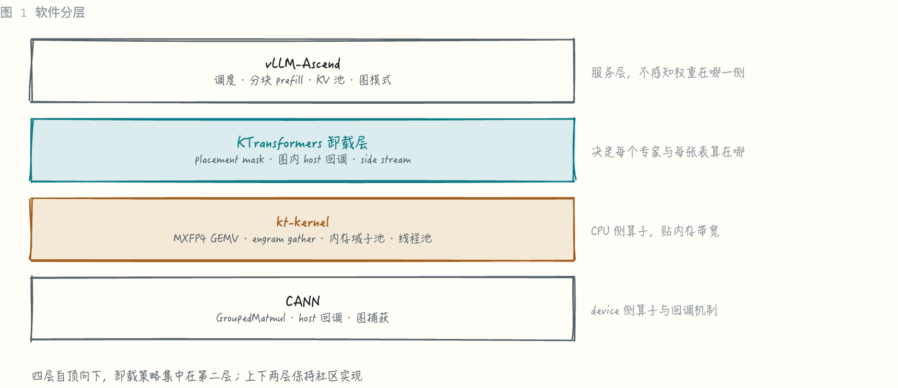
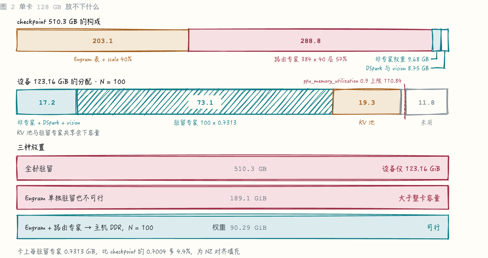
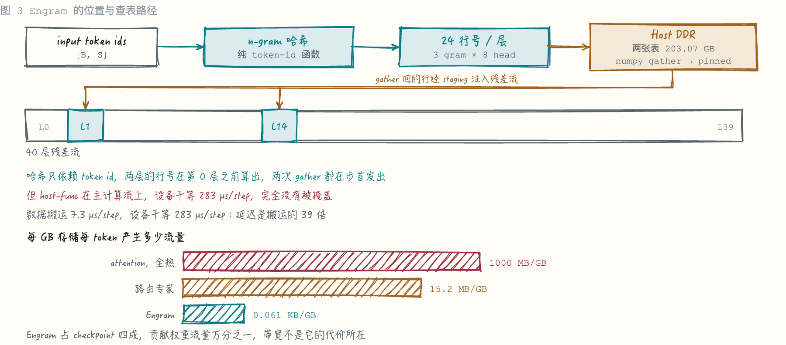
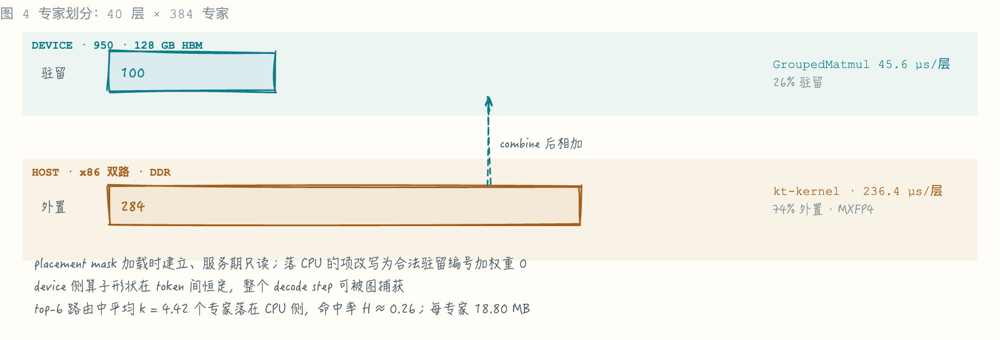
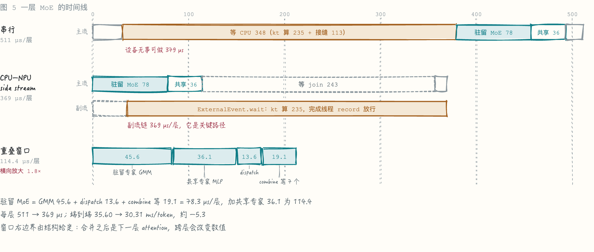
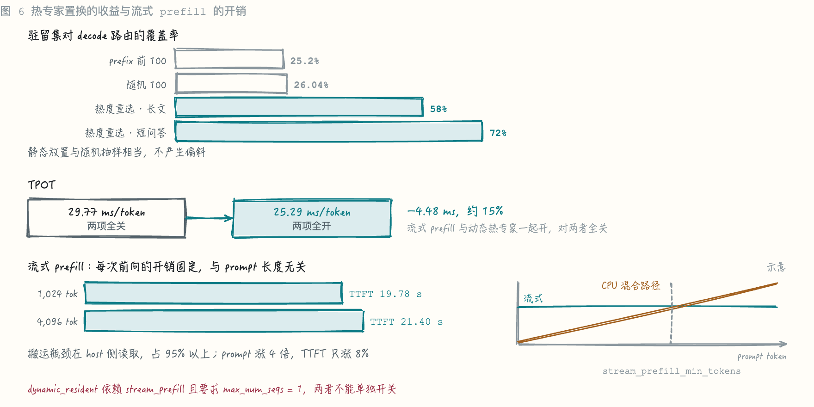

# DeepSeek-V4.1-Flash 昇腾单卡部署：基于 CANN 平台的 vLLM-Ascend + KTransformers 卸载推理实践

**摘要**：本文介绍 DeepSeek-V4.1-Flash 模型在单张昇腾 950（128 GB HBM）上的推理部署实践。模型 checkpoint 510.3 GB，为单卡 HBM 的 4.0 倍，其中 Engram 记忆表 203.07 GB、路由专家 288.78 GB。方案把这两类权重按各自的冷热画像分别卸载至主机 DDR：Engram 走随机 gather，路由专家由 kt-kernel 在 CPU 上计算。40 层中每层 384 个专家、约 100 个常驻 NPU，其余 284 个下放 CPU；device 与 host 的并行由副流加 ACL 外部事件实现，每层可与 CPU 重叠的窗口为 114.4 µs。副流重叠、外部事件等待与共享专家挪进窗口三项使 bs1 的 TPOT 自串行的 35.60 ms 降到 30.31 ms。热专家标定置换在 prefill 期按本次请求的热度重选驻留专家，把驻留集对 decode 路由的覆盖率自 25.2% 提到 58%，单请求配置下 TPOT 自 29.77 ms 降到 25.29 ms（−4.48 ms，约 15%）。

***

## Highlights

* **单卡承载 510 GB 级模型：** Engram 表与路由专家外置至主机 DDR，稳态主机内存 **558 GiB**；die 侧权重 **90.29 GiB**，含 100 个驻留专家 73.13 GiB 与非专家权重 17.16 GiB（含 DSpark 与 vision）

* **MoE Offload：** offload 到 CPU 的这部分为 **8.88 ms/token**，其中两个 GEMM 占 92.3%，实际利用带宽 **352 GB/s**、为本机双路上限 495 GB/s 的 71% —— 已接近带宽上限。

* **CPU 与 NPU 并行：** host 路径挪到副流、设备改在 ACL 外部事件上等待、共享专家挪进重叠窗口，三项把 bs1 的 TPOT 自串行的 35.60 压到 **30.31 ms/token**，约 **−5.3 ms**

* **热专家标定置换：** 通过prefill阶段实测专家温度，将最热专家搬移到卡上进行驻留计算，把对 decode 路由的覆盖率自 **25.2% 提到 58%**；与流式 prefill 一起开启时 TPOT **29.77 → 25.29 ms/token（−4.48，约 15%）**。流式 prefill 每次前向的开销固定、与 prompt 长度无关，prompt 自 1,024 涨到 4,096 时 TTFT 只涨 8%

## 引言

把一个 checkpoint 四倍于显存的模型放上单卡，可行的前提是模型自身的稀疏性。DeepSeek-V4.1-Flash 有两种稀疏性叠在一起：MoE 是稀疏的计算，每 token 只激活 top-6 个专家；Engram 是稀疏的记忆，每 token 每层只读表中的 24 行。两者都意味着权重总量与每 token 必须读取的字节数可以解耦，而后者才是 decode 时延的决定项。

本实践的软件栈自顶向下由 vLLM-Ascend、KTransformers 卸载层、kt-kernel 与 CANN 构成：

* **vLLM-Ascend**：提供调度、分块 prefill、KV 池管理与图模式执行。服务层不感知某个专家的权重在哪一侧。

* **KTransformers 卸载层**：决定每个专家与每张表算在哪，并负责 device 与 host 的协同，包括 placement mask、副流的 fork 与 join、外部事件的放行。

* **kt-kernel**：CPU 侧算子。MXFP4 GEMV、Engram gather、内存域子池与线程池调度都在这一层。

* **CANN**：device 侧算子与 host 回调机制，包括 GroupedMatmul、图捕获期间可投递的 host 函数节点与可由主机线程放行的外部事件。

卸载策略集中在 KTransformers 卸载层，vLLM-Ascend 与 CANN 保持社区实现。下文依次阐述容量划分、两类权重的卸载、device 与 host 的并行，以及热专家标定置换与它所依附的流式 prefill。

## 单卡容量约束与卸载划分

### checkpoint 的构成

510.29 GB 分四块：

| 部分 | 大小 | 占比 | 每 token 读取 |
|---|---|---|---|
| Engram 表 + scale | 203.07 GB | 39.8% | 12.38 KB |
| 路由专家（MXFP4），384 × 40 层 | 288.78 GB | 56.6% | top-6 中未命中驻留的部分 |
| attention / 共享专家 / embed / norm / router | 9.68 GB | 1.9% | 全部 |
| DSpark 7.93 GB、vision 0.82 GB | 8.75 GB | 1.7% | 视是否启用 DSpark 与 vision 而定 |

Engram 与路由专家同时外置后，die 侧放非专家权重（含 DSpark 与 vision），余下容量由驻留专家与 KV 池共享。N = 100 时 die 侧权重 90.29 GiB，KV 池 19.25 GiB。

### 主机侧内存

稳态常驻 **558 GiB**，按 40 层 × 384 个专家算：

| 占用 | 大小 | 形态 |
|---|---|---|
| Engram 表 | 188.83 GiB | `/dev/shm` 上的 tmpfs，占真实内存 |
| w1/w3 权重 | 168.75 GiB | 零拷贝，kt 的 BufferB 直接指向 checkpoint 的只读共享映射 |
| w2 与全部 scale | 100.20 GiB | kt 的 BufferB，匿名内存，按 TP 切片分摊到两个 node |
| w2 与全部 scale 的源页 | 100.20 GiB | 页缓存。流式 prefill 直接从同一映射读它们 |
| 合计 | **557.97 GiB** | |

每专家 18.80 MB 按投影拆开：w1 与 w3 的权重各 5.63 MiB，w2 的权重 5.63 MiB，三个 scale 各 360 KiB。

kt 用 `MPOL_BIND | STRICT` 把每个 worker 线程绑到一个 NUMA node，所以单 node 的容量也要够：
node0 约 134.5 GiB、node1 约 234.7 GiB。

## Engram 的 DDR 卸载

### 机制

Engram 是一张哈希寻址的 key-value 记忆表，挂在第 1 层和第 14 层的入口。token 序列末尾的 2/3/4-gram 被哈希成行号，查出 256 维向量，经 `wkv` 线性层拆成 key 与 value，再用 key 与当前 hidden state 的余弦相似度算出门控系数，把 value 加进残差流。

它是两类卸载对象里更冷的一类。按每 GB 存储每 token 产生的流量算，attention 1000 MB/GB、路由专家 15.2 MB/GB、Engram 0.061 KB/GB，后者占 checkpoint 四成而只贡献权重流量的万分之一。

一步的路径是：device 算出行号，D2H 送到 host，host 按行号 gather 到 pinned，H2D 送回 staging，再由 device 进行反量化。host 侧只做 numpy gather，哈希与反量化都在 NPU。staging 按 `row = token × n_hash_cols + col` 预先摆好，device 端连续读，不再查行号、也不单独 gather scale。

每层每 token 查 `n_hash_cols = (max_ngram_size − 1) × n_heads = 24` 行，每行 256 B 权重加 `1/32` 的 ue8m0 scale，两层合计 12.38 KB。

## MoE 专家的 CPU 卸载

### 专家划分

每层 384 个专家，其中 100 个常驻 NPU 走原本的 GroupedMatmul，284 个下放 CPU 由 kt-kernel 计算。每专家 MXFP4 权重 18.80 MB。

placement mask 在模型加载时建立，服务期只读。非驻留专家跳过 device 侧分配，权重不进 die。昇腾路由算子不接受"不在本 device 计算"的哨兵值，落 CPU 的项改写为合法驻留编号加权重 0，device 侧照常执行且不贡献输出。该改写使 device 侧算子形状在 token 间恒定，整个 decode step 可被图捕获。

top-6 路由中平均 4.42 个专家落在 CPU 侧，命中率 `H ≈ 0.26`，恰等于驻留比例 `100/384`。按请求热度重选驻留集可把它提到 0.58，见后文热专家标定置换。

### 整网时间分解

串行基线下每 token 的时间构成：

| 分项 | 占比 |
|---|---|
| NPU 计算（区间并集） | 50.6% |
| 等 CPU 专家 | 41.2% |
| host 下发与小空隙 | 7.3% |

### Host 开销分解

| 分段 | µs/层 | 详细任务 |
|---|---|---|
| kt 算 284 个专家 | 236.4 | 两个 GEMM 占 92.3% |
| 回调派发加完成通知 | 78 | ACL 报告线程投递回调（含抢 GIL、建参数），回调返回后通知设备。进程内只有一条报告线程，所有流共用 |
| kt 的 Python 前奏 | 19.5 | 每次回调重建 kt 任务对象：查缓冲、取 6 个 data_ptr、建 pybind 对象 |
| worker 唤醒与跨内存域归并写回 | 18.2 | 其中约 10 µs 是任务队列的线程握手 |
| 卸载层自身的 Python | 7.8 | 前置断言、计数、后置记账 |
| host-func 节点前的设备空转 | 30.75 | 仅 host-func 节点有前置空隙 |

按量级，kt 计算约占六成，固定头开销约占四成。CPU 段耗时正比于从 DDR 读的字节数，即与 `(1 − H)` 和位宽成正比。

每层CPU预期加载`6 x 284 / 384 = 4.42`个专家，要从 DDR 读 `4.42 × 18.80 MB = 83.1 MB`，其中每专家 MXFP4 权重 `3 × 5120 × 2304 × 0.53125 B = 18.80 MB`（`0.53125 = 0.5` 的 4 bit 权重加 `1/32` 的 e8m0 scale）。按 236.4 µs 折算等效带宽 352 GB/s，为本机双路上限 495 GB/s 的 71%。

## CPU–NPU 的 side stream 重叠

### 串行实现的问题与三项改动

host 回调与 D2H 按 stream order 排队，驻留专家的 GroupedMatmul 会排在回调往返之后，本该并行的两段退化为串行。串行时每层 MoE 段 511 µs，其中约 379 µs 设备空转。

三项改动依次叠加：

| 改动 | ms/token | 窗口内容 |
|---|---|---|
| 副流重叠 | −3.00 | 驻留 MoE（驻留专家 GMM + dispatch + combine 等 13 个算子）78 µs/层 |
| 外部事件等待 | −0.53 | 窗口不变，缩短副流链上的完成通知，约 13 µs/层 |
| 共享专家挪进窗口 | −1.71 | 窗口自 78 扩到 114.4 µs/层 |

端到端为 35.60 → 30.31 ms/token，约 −5.3 ms。

**副流重叠**把 host 路径整条搬到专用流。fork 记在本层 routing 之后、三次 device fill 之后，因此 dispatch 落在窗口里；join 记在 NPU combine 之后、CPU 结果并入之前。

**外部事件等待**把等待从回调中移出。旧的 host-func 节点提交、等待、返回都在一个节点里完成；新做法是节点只提交立即返回，设备停在 `ExternalEvent.wait` 上，由完成线程在 `cpu_infer.sync(0)` 返回后 `record` 放行。

**共享专家挪进窗口**只改调用顺序。共享专家 MLP 的输入是 MoE 层的输入，与 CPU 结果没有数据依赖，可以提前到窗口内。

### 收益的结构上限

fork 与 join 之间主流能做的工作就是重叠窗口，它封顶副流重叠与共享专家两项的收益：

| 算子 | ops/层 | µs/层 | ms/token |
|---|---|---|---|
| GroupedMatmul（驻留专家） | 2 | 45.6 | 1.82 |
| 共享专家 MLP | 4 | 36.1 | 1.44 |
| MoeInitRoutingV3（dispatch） | 1 | 13.6 | 0.54 |
| Cumsum / MoeFinalizeRoutingV2 / SwigluGroupQuant | 3 | 12.2 | 0.48 |
| Index / Cast / Mul，卸载自身引入 | 4 | 6.9 | 0.28 |
| 合计 | 17 | **114.4** | **4.58** |

`Index` / `Cast` / `Mul` 把逻辑专家号换成 device 侧槽位号，并把下放专家的门控权重清零，这部分开销落在窗口内，被 CPU 计算完全覆盖。

窗口小于副流链的 369 µs/层（D2H 2.5 + 调起前空隙 35.75 + `NOTIFY_WAIT` 329.6），后者是关键路径。窗口的两条边界由结构给定：CPU 要用 routing 的结果，左边界只能在 routing 之后；合并之后即下一层 attention，把 CPU 贡献推迟到下一层会改变数值，右边界止于合并。

端到端的 5.29 ms 由两部分构成：窗口覆盖的 4.58 ms，加上外部事件等待在关键路径上省下的完成通知约 0.52 ms。

## 热专家标定置换与流式 prefill

降低时延的另一条途径是减少 CPU 侧要算的专家数。同一请求中，prompt 激活的专家与 decode 阶段命中的专家高度相关。热专家标定置换据此在 prefill 期统计各层专家的激活热度，在 decode 开始前把最热的专家换入 device，使更多路由命中 NPU，从而降低 CPU 侧 MoE 的时延。

长 prompt 的 prefill 会激活更多 CPU 专家，TTFT 随序列长度快速增长。流式 prefill 把 MoE 整层搬到 NPU 上计算，每次前向的开销固定，在长 prompt 上替代随 token 数增长的 CPU 混合路径；流式搬上卡的专家权重同时也是置换的数据来源。

### 热专家标定置换

prefill 期间以 device 侧 bincount 统计每层专家激活，热度累计自该请求的整个 prefill，驻留集合在最后一个 chunk 上一次性置换。换入复用流式 prefill 已搬上卡的字节：分块缓冲里的 ND 字节在送入 GEMM 的同时，按新槽位顺序拷入一块整层的 staging，整层走完后一次 cast、一次 `copy_memory_` 提交。若不复用，换入任一专家都需再从 host 读取整层。

驻留集合的覆盖率决定了 CPU 侧要算多少：

| 驻留集 | 对 decode 路由的覆盖率 |
|---|---|
| 随机抽 100 个 | 26.04% |
| 按本次 prefill 热度重选 | 58%（长文）、72%（短问答） |

#### 性能收益

`dynamic_resident` 依赖 `stream_prefill`，收益按两项一起开启计：

| 量 | 值 |
|---|---|
| TPOT | 29.77 → 25.29 ms/token |
| 降幅 | **−4.48 ms**，约 15% |

收益来自覆盖率：`NOTIFY_WAIT` 里 kt 纯计算 9.59 ms/token，覆盖率自 25% 升到 58% 使 CPU 侧要算的专家缩到 0.56 倍，预期省约 4.2 ms，与 4.48 ms 的收益吻合。

每请求换入 143.4 MiB，耗时 4.7 ms。

### 流式 prefill

一次 forward 的 token 数超过 `stream_prefill_min_tokens` 时，该层的专家权重自 host 分块流入 HBM，MoE 在 NPU 完成、不经 CPU；低于门限的 forward 仍走混合路径。一次流入 32 个专家，每层 12 块，因为整层 384 个专家需要 13.45 GiB、放不进 11.41 GiB 的可用额度。

HBM 占用：分块缓冲 0.56 GiB，整层 ND staging 1.75 GiB，含换入的路径卡上合计 4.52 GiB。

#### 开销与适用区间

每次前向要把每层全部 384 个专家搬上卡，**与 prompt 长度无关**。搬运的瓶颈在 host 侧从 checkpoint 读取专家权重到 pinned 内存这一步，占流式 I/O 时间的 95% 以上，速率 29.4 GiB/s，为本机 mmap 到 pinned 基准 52.8 GiB/s 的 56%。

TTFT 随 prompt 长度的变化：

| prompt token | 输出 token | TTFT | TPOT |
|---|---|---|---|
| 1,024 | 256 | 19.78 s | 22.99 ms |
| 4,096 | 128 | 21.40 s | 22.57 ms |

这两行用的语料是一段短序列循环拼接成的长序列，只用来体现流式 prefill 的特性，不能作为该序列下吞吐的参考。正常长序列语料的 TPOT 约 26 ms。

prompt 涨 4 倍而 TTFT 只涨 8%。CPU 混合路径的开销随 token 数线性增长，流式的开销固定，两条曲线有一个交叉点：短于它的 prompt 走混合路径更快，长于它的走流式更快。`stream_prefill_min_tokens` 就是这条分界，生产取值应落在交叉点上。

<!-- TODO 流式开关配对 A/B：长短 prompt 各取若干点，TTFT 与 TPOT 交错多轮，实测交叉点并据此设定 stream_prefill_min_tokens -->

## 精度与未来展望

### 精度

| 数据集 | 题数 | 单卡 950 | 多卡基线 |
|---|---|---|---|
| GSM8K | 1319 | 97.27% | 97.12% |
| Math500 | 500 | 97% | 97.4% |
| GPQA-Diamond（non-thinking） | 198 | 76.26% | 76.26% |

### 未来展望

* **decode 阶段的专家预取**。当前标定只在 prefill 期重选驻留集，decode 阶段未触及。两种做法：提前一层预测并预取，需要预测器，预测错误只浪费带宽而不改变输出；按带宽比例把部分 miss 经 H2D 交给 NPU，不需预测，但需先测定 H2D 带宽。

* **host 侧低比特**。先在现有位宽引入校准换精度余量，再用该余量换位宽。按热度分级时冷专家用最小格式，位宽收益与命中率收益相乘。

* **固定头开销的 154 µs/层**。其中回调派发加完成通知 78 µs 由 ACL 单条报告线程串行承担。仅压缩 host 侧只会把时间从等待转为空闲，要获得这部分收益，需要设备在等待期间有其他工作可做。

* **Engram 下沉到 SSD**。Engram 表占主机内存 188.83 GiB，是其中最大的单项，而每 token 只读 48 行、12.38 KB，是 checkpoint 里最冷的数据。把表移到 NVMe 后主机侧降到 **369 GiB**。可行性看三点：
  * **IOPS 与带宽**：每行 264 B，按 4 KB 页随机读，每 token 48 次、约 192 KB。bs1 decode 约 33 token/s，合约 1,600 IOPS、6 MB/s，远低于单块 NVMe 的能力；4,096 token 的 prefill 约 20 万次随机读，单盘零点几秒。
  * **时延**：NVMe 4 KB 随机读约百微秒量级。行号只依赖 token id，每步开头即可在 host 侧算出两层的行号并下发读请求。L14 之前有 13 层计算可覆盖读延时；L1 之前有一层，约 0.75 ms，也大于单次读延时。
  * **热行缓存**：在 DDR 保留小容量的热行缓存吸收高频 n-gram，SSD 只服务长尾，缓存容量按实测命中率确定。
