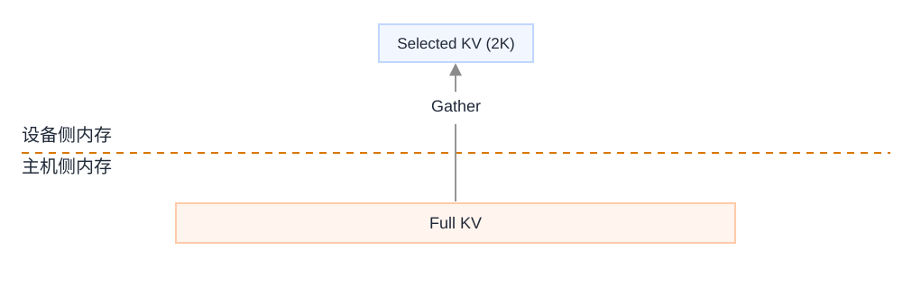
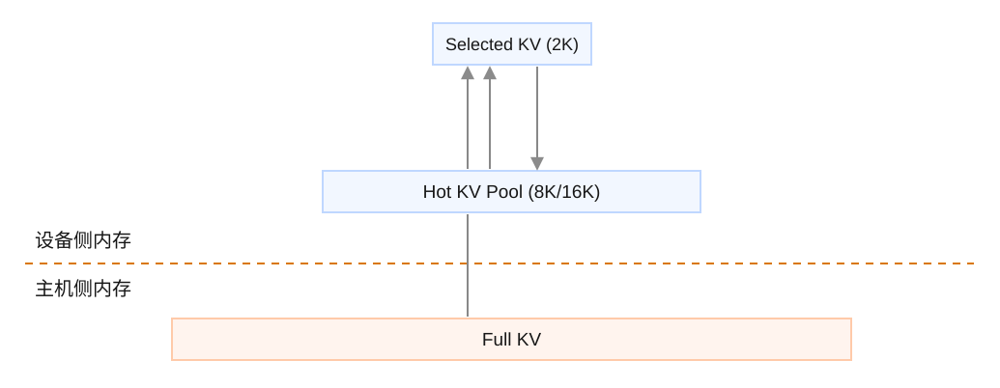
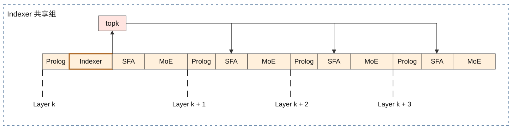
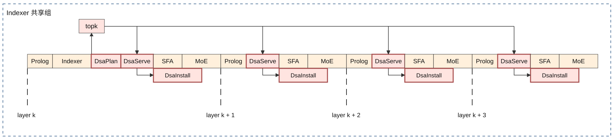
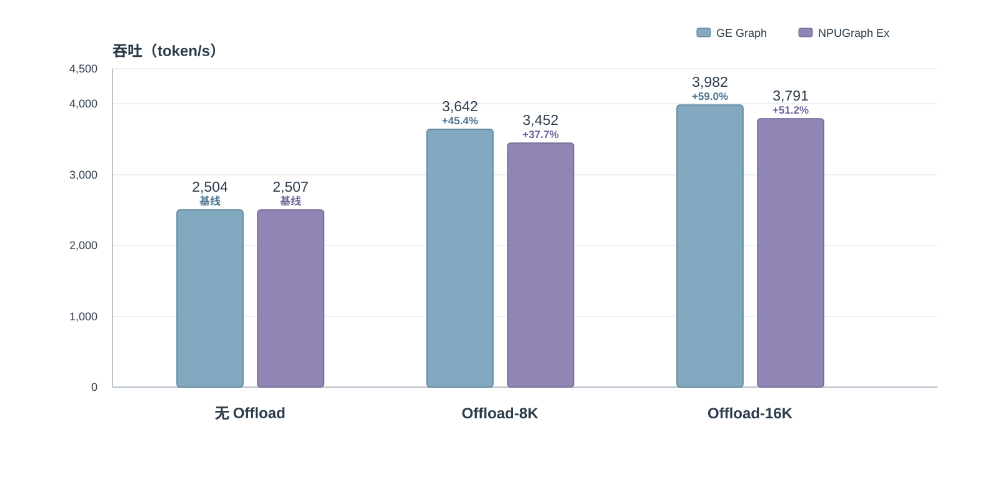

# 从 KV 容量到系统吞吐：面向 GLM-5.2 的共享 Indexer KV Cache Offload

大语言模型的上下文窗口正在持续增长。长文档问答、代码库分析、长时间多轮对话等场景，正将推理服务推向数十 K 乃至上百 K token 的上下文规模。这一趋势给推理系统带来一个结构性的挑战：KV Cache 的显存占用。

在自回归 decode 过程中，每个生成的 token 都会在 HBM 中产生 Key-Value 状态，序列越长、并发请求越多，累积的 KV Cache 就越庞大，且增长是线性的。HBM 容量是固定的。当 KV Cache 占据显存的大半，即便计算单元负载尚低，系统也无法接纳更多并发请求——内存先于计算触及上限。

KV Cache Offload 的思路很直接：将完整的 KV Cache 放到容量更大、成本更低的 Host 内存中，仅在注意力计算真正需要时，将相关数据搬运回 HBM。这打破了 HBM 的容量限制，理论上可以将 batch size 翻倍甚至更高。但在实际部署中，一个问题随之而来：Host 到 Device 的数据搬运（H2D）直接叠加在 decode 延迟上。如果新增的 batch 容量被传输开销抵消，Offload 便只解决了内存容量，却未能转化为吞吐提升。

本文将介绍面向 GLM-5.2 的共享 Indexer KV Cache Offload 方案——它通过更优的缓存设计、跨层规划复用和执行调度，将 Offload 从容量收益真正推进到了吞吐收益。

方案的设计沿一条递进路径展开。其出发点是此前面向 DeepSeek V3.2 实现的基础 KV Offload 方案，相关实现已[开源](../deepseek_v3_2_exp/deepseek_v3.2_exp_inference_guide.md)。该方案基于 `GatherSelectionKvCache` 算子，按需从 Host 加载稀疏注意力选中的 KV 数据，构成了基础的 KV Offload 实现。在此基础上，引入更大的 Device 侧 KV 缓存池，可以将平均命中率从 58.85% 提升至 90.50%，H2D 数据搬运不再是主要瓶颈。此时新的瓶颈出现：逐层执行的缓存查找、命中判定、替换决策等控制面操作成为延迟的主要来源。GLM-5.2 的共享 Indexer 结构——四层复用同一组 Top-K 索引——正好为此提供了解决路径：将控制面开销分摊到多层，配合组相联 FIFO 缓存和延迟回填调度，使剩余开销尽可能与计算重叠。该方案已[开源](../../../models/glm_5_2)。

在双机 Atlas A3（共 16 卡）上运行完整的 GLM-5.2-W8A8 模型。在 64K 输入序列、MTP3 配置下，Offload 将可承载的全局 batch size 上限从 64 提升至 128。搭配 16K KV 缓存池，按实测 MTP 接收长度计算，GE Graph 下吞吐提升 59.0%，NPUGraph Ex 下提升 51.2%。

## 此前方案：面向 DeepSeek V3.2 的按需加载式 KV Offload

### 稀疏注意力的数据加载模型

此前面向 DeepSeek V3.2 实现的 KV Offload 方案是本工作的出发点。其 decode 路径有两个紧密配合的组件：

- **Lightning Indexer**：从全部历史 token 中筛选出与当前 query 最相关的 2048 个位置。
- **Sparse Flash Attention（SFA）**：仅在这 2048 个位置上执行注意力计算。

Indexer 决定哪些 token 参与注意力，SFA 执行实际计算。两者之间有一个数据搬运环节：SFA 所需的 2048 条 KV 数据散布在完整序列的 KV Cache 中，需要被收集到一起。

```text
当前 query
      |
      v
Lightning Indexer ----> Top-K token 位置
                               |
                               v
Host 侧完整 KV Cache -------> 选中的 KV -------> SFA
```

该基础方案将完整 KV Cache 放置在 Host 内存中。Prefill 阶段，模型在 Device 侧逐层生成 KV 后，将其传输至 Host；decode 阶段，`GatherSelectionKvCache` 算子根据 Indexer 的 Top-K 结果，从 Host 侧完整 KV Cache 中加载对应的 KV 数据，并交由 SFA 使用。这一流程释放了完整序列 KV Cache 此前占据的大部分 HBM，腾出的空间可支撑更大的 batch 或更长的上下文。



### 相邻 step 复用

Gather 算子还利用了一个重要的局部性：相邻 decode step 的 Top-K 往往高度重叠。上一个 step 已搬到 Device 侧的 KV 可直接复用，无需再次从 Host 读取。

我们的全模型 Top-K 轨迹分析显示，相邻 step 的平均复用率约为 60%。这意味着每次 decode，约六成 KV 可从 Device 侧直接获得，Host 只需提供剩余约四成。

```text
当前 Top-K = 上一步选集中命中的部分 + 从 Host 侧完整 KV Cache 加载的缺失部分
```

这一复用将 H2D 数据传输量降至全部从 Host 加载的约 40%，但复用范围仅限于上一步的 2048 个位置。仍有近五分之二的选中 token 需要进行离散的 H2D 搬运——每次未命中对应一个独立位置的小段 KV 数据。

### 容量收益与吞吐缺口

该基础方案带来了明确的容量收益：相同上下文长度下，可承载的 batch size 约可翻倍。但 batch 扩大后，每步需要同时处理的请求和数据规模随之增加；叠加剩余的 Gather 搬运开销，decode 延迟显著上升。在端到端评估中，扩展的 batch 容量尚未充分转化为吞吐提升。

这明确了下一步的优化目标：提升缓存命中率，将 H2D 数据搬运移出关键路径。

## 更大的 KV 缓存池：瓶颈从数据搬运转向缓存管理

基础方案的选择缓冲区只有 2048 个条目，因为它的容量等于 SFA 的 Top-K 输入量。如果进一步扩大复用范围，让 Device 侧保留一个更大的 KV 缓存池——例如 8192 或 16384 个条目，下一轮的 Top-K 就能以更高概率命中 Device 侧已有的数据。

我们构建了一个包含 8192 个条目、采用 LRU 策略管理的 Device 侧 KV 缓存池。在相同 Top-K 轨迹下，平均命中率从 58.85% 提升至 90.50%。平均而言，仅有 9.50% 的选中 token 需要从 Host 加载。在这一命中率水平上，H2D 数据搬运已不再是主要开销。



但大容量缓存池改变了开销的构成。每层仍需独立处理自己的 Top-K id：逐条判定数据位于缓存池还是 Host、对重复未命中去重、选定替换槽位、维护缓存元数据。LRU 的细粒度管理还需要维护访问时序和淘汰决策。这些操作多属于 Vector Core 不擅长的标量和控制密集型计算。KV 数据路径虽已通畅，逐层重复的缓存管理操作却形成了新的 decode 瓶颈。

| Device 侧缓存设计 | 平均命中率 | 主导压力 |
| --- | ---: | --- |
| 仅保留上一步的 2K Top-K 选集 | 58.85% | 离散 H2D KV 加载 |
| 8K KV 缓存池 + LRU | 90.50% | 命中分类与缓存管理 |

这一瓶颈迁移指明了后续工作的方向：增大 Device 侧缓存池缓解了数据搬运问题，但将缓存池管理做成高效算子，还需要在控制面上寻找进一步的优化机会。GLM-5.2 的架构恰好提供了这样的切入点。

## GLM-5.2 共享 Indexer：从逐层规划到逐组复用

GLM-5.2 在 attention 设计中引入了一项关键特性：共享 Indexer。默认配置下，一层独立执行 Indexer 生成新的 Top-K，紧接着的三层直接复用这组结果，构成四层一组的 Indexer 共享组。



四层共享同一组 Top-K id，因此也共享了基于这些 id 的缓存决策。某个 token id 在组内任一层命中 Device 侧缓存池，在其余三层也会映射到相同的缓存槽位；某个 token id 未命中，整组也需要执行相同的回填规划。

命中分类和未命中规划是标量最密集、Vector Core 最不擅长的操作。共享 Indexer 结构将它们从逐层执行压缩为逐组执行——规划做一次，四层复用。标量开销被分摊到四层，而各层独立的 KV 数据搬运不受影响。

### 共享规划

规划器（DsaPlan）对共享 Top-K 执行一次性处理：逐条记录数据来自缓存池还是 Host，同时输出一份紧凑的未命中条目列表，用于后续回填。

组内后续层直接沿用同一份规划。各层拥有各自的 KV 和 RoPE 数据，搬运过程独立进行，但命中检测、来源分类、未命中去重和替换位置选择均不再重复计算。

### 组相联 FIFO

大容量缓存池需要配套的替换策略。LRU 能够较好地匹配访问模式，但在 NPU 上高效实现 LRU，需要持续维护条目的最近访问状态和淘汰顺序，执行开销较高。

我们采用组相联 FIFO 组织缓存池。所谓组相联（set-associative），是指先将缓存池划分为若干独立的组。每个 token id 通过哈希映射到唯一一组，但可以存放在该组内任意一个槽位。相比每个 token 只能对应一个固定槽位的直接映射方式，组相联可以降低哈希冲突；相比允许条目存放在整个缓存池任意位置的全相联方式，它又将查找和替换范围限制在较小的组内。

每组包含固定数量的槽位，替换仅发生在组内。每组维护一个 FIFO 指针，仅在装入新条目时推进一次。当组内需要装入新条目时，指针指向的槽位被替换，随后指针移动到下一个槽位；缓存命中不会改变该指针。因此，实现上采用轮转替换，语义上等价于按照装入顺序执行组内 FIFO。

该方案在 NPU 上有三个适配性优势：

- 查找和替换状态被限制在较小的组内，元数据开销可控；
- 不同组之间相互独立，天然支持多核划分与并行处理；
- FIFO 仅在新条目装入时更新，无需在每次命中时维护访问时序。

组相联在降低哈希冲突的同时，将查找和替换范围限制在组内；FIFO 则将替换机制做得足够轻量，适配并行执行的要求。

### SFA 优先，回填后置

当前层注意力计算直接依赖选中的 KV——数据未就绪，SFA 就无法启动。因此执行调度优先准备选中的 KV，数据就绪后立即推进 SFA。

缓存池回填的时限要宽松得多：新装入的条目是供后续 decode step 使用的。回填因此在辅流上发起，与 SFA 和 MoE 并行推进。

```text
共享 Indexer Top-K
        |
        v
   共享规划
        |
        +----> 逐层 KV 准备 ----> SFA ----> MoE
                         |
                         +----> 辅流缓存池回填
```

这一调度将 Offload 的关键阻塞段压缩到“准备选中 KV”这一步，缓存维护开销则尽可能与计算重叠，不单独占用 decode 延迟。

## 实现：三个算子，三条路径

上述设计在代码层面映射为三个定制 AscendC 算子：

| 算子 | 执行频率 | 职责 |
| --- | --- | --- |
| **DsaPlan** | 每个 Indexer 共享组一次 | 分类 Top-K、判定缓存池命中或未命中、生成紧凑的未命中记录 |
| **DsaServe** | 每层一次 | 从缓存池和 Host 侧完整 KV Cache 中准备 SFA 所需的 KV 和 RoPE |
| **DsaInstall** | 每层一次 | 回填未命中条目、执行 FIFO 淘汰、更新缓存池状态 |



`DsaPlan` 承载所有共享的标量工作：将 Top-K id 和缓存池元数据转化为紧凑的执行规划。`DsaServe` 依照规划执行数据搬运，优先交付 SFA 所需的数据。`DsaInstall` 依照未命中记录，在辅流上执行延迟回填。

三个算子的划分形成三条职责分明的执行路径：规划在组级别完成，不随层数放大；数据服务每层独立进行，但不再包含重复的决策逻辑；回填与计算并行，不占用关键延迟。

## 双机 Atlas A3 评测

评测环境为生产级配置：双机 Atlas A3（共 16 卡）、GLM-5.2-W8A8 模型、64K 输入序列、MTP3。针对 64K 输入序列，在相同设备资源约束下，不使用 Offload 时，KV Cache 容量仅能支持全局 batch size 上限为 64；启用 Offload 后，该上限提升至 128。实验分别测试 8K 和 16K 两种 Device 侧 KV 缓存池容量，并覆盖 GE Graph 和 NPUGraph Ex 两种执行模式。

吞吐按两种口径报告：

- **统一假设口径**：为在相同 MTP 接收长度假设下比较不同配置，将 MTP 平均接收长度统一设为 2.7。该数值为经验假设，仅用于归一化估算，不代表各配置的实测接收长度。
- **实测口径**：使用推理过程中实际观测到的 MTP 平均接收长度。

计算方式：

```text
吞吐 = 全局 batch size × MTP 平均接收长度 /（主模型 + MTP3 单步延迟）
```

| 执行模式 | 配置 | 全局 batch | 缓存池容量 | 主+MTP3 延迟 | 吞吐（2.7 假设） | 吞吐（实测） |
| --- | --- | ---: | ---: | ---: | ---: | ---: |
| GE Graph | 无 Offload | 64 | - | 71.21 ms | 2,427 token/s | 2,504 token/s |
| GE Graph | 共享 Indexer Offload | 128 | 8K | 100.55 ms | 3,437 token/s（+41.6%） | 3,642 token/s（+45.4%） |
| GE Graph | 共享 Indexer Offload | 128 | 16K | 92.03 ms | **3,755 token/s（+54.8%）** | **3,982 token/s（+59.0%）** |
| NPUGraph Ex | 无 Offload | 64 | - | 71.59 ms | 2,414 token/s | 2,507 token/s |
| NPUGraph Ex | 共享 Indexer Offload | 128 | 8K | 105.04 ms | 3,290 token/s（+36.3%） | 3,452 token/s（+37.7%） |
| NPUGraph Ex | 共享 Indexer Offload | 128 | 16K | 95.67 ms | **3,612 token/s（+49.6%）** | **3,791 token/s（+51.2%）** |

从数据中可归纳三点：

- **可承载的 batch 上限翻倍，延迟增长可控**。针对 64K 输入序列，Offload 将可承载的全局 batch size 上限从 64 提升至 128。16K 缓存池下，主模型 + MTP3 单步延迟相较无 Offload 配置增长 29.2%（GE Graph）和 33.6%（NPUGraph Ex）。延迟增长幅度远低于 batch 上限的增幅，表明 Offload 的附加开销处于有效控制之下。

- **吞吐净增约 50%**。16K 缓存池下，按统一的 2.7 经验假设估算，GE Graph 和 NPUGraph Ex 的吞吐分别提升 54.8% 和 49.6%；按各配置的实测接收长度计算，吞吐分别提升 59.0% 和 51.2%。batch 容量的扩大切实转化为了系统吞吐收益。



- **16K 缓存池优于 8K 缓存池**。在最终的组相联 FIFO 方案下，缓存池容量从 8K 扩大至 16K 后，平均命中率由约 85% 提升至 90% 以上，需要从 Host 加载并回填的未命中数据随之减少。在相同全局 batch size 128 下，16K 缓存池相较 8K 缓存池，吞吐进一步提升约 9.3%（GE Graph）和 9.8%（NPUGraph Ex，按 2.7 mtp 接受长度经验假设估算）。这表明扩大缓存池容量所带来的命中率提升，可以进一步降低 Offload 的端到端开销。

这些对比印证了 Offload 设计的核心判断：Host 内存用于承载完整 KV Cache，从而提高可支持的全局 batch 上限；Device 侧缓存池、跨层复用和调度优化则用于压低附加开销。两者协同，使 batch 上限翻倍最终转化为约 50% 的吞吐净增。

## 扩展思考

GLM-5.2 的共享 Indexer 为本次 Offload 方案提供了关键的结构性支撑。四层一组的 Top-K 复用使标量规划开销得以分摊，这一点离开了模型的特定架构是无法成立的。换言之，KV Offload 的上限很大程度上由模型结构决定。不同模型的注意力设计、层间关联、计算与带宽的配比各不相同，缓存大小、替换策略和执行调度的最优选择也会随之变化。

从更长远的视角看，KV Cache 的管理最终需要走向一个系统化的方向。Offload 解决了容量问题，但单靠 Offload 还不足以应对上下文持续增长带来的全方位压力。一个更完整的思路是将 KV Cache 视为可分级、可调度的资源：在 Host 内存与 Device HBM 之间建立缓存层次，依据访问热度动态调配数据位置，结合淘汰策略自动适应工作负载变化。与此同时，稀疏注意力压缩每步计算量，投机解码通过并行生成均摊延迟——三者各自有效，但要系统性地应对长上下文下的吞吐和延迟挑战，需要将它们协同部署，每项技术的短板恰可由其他技术补足。