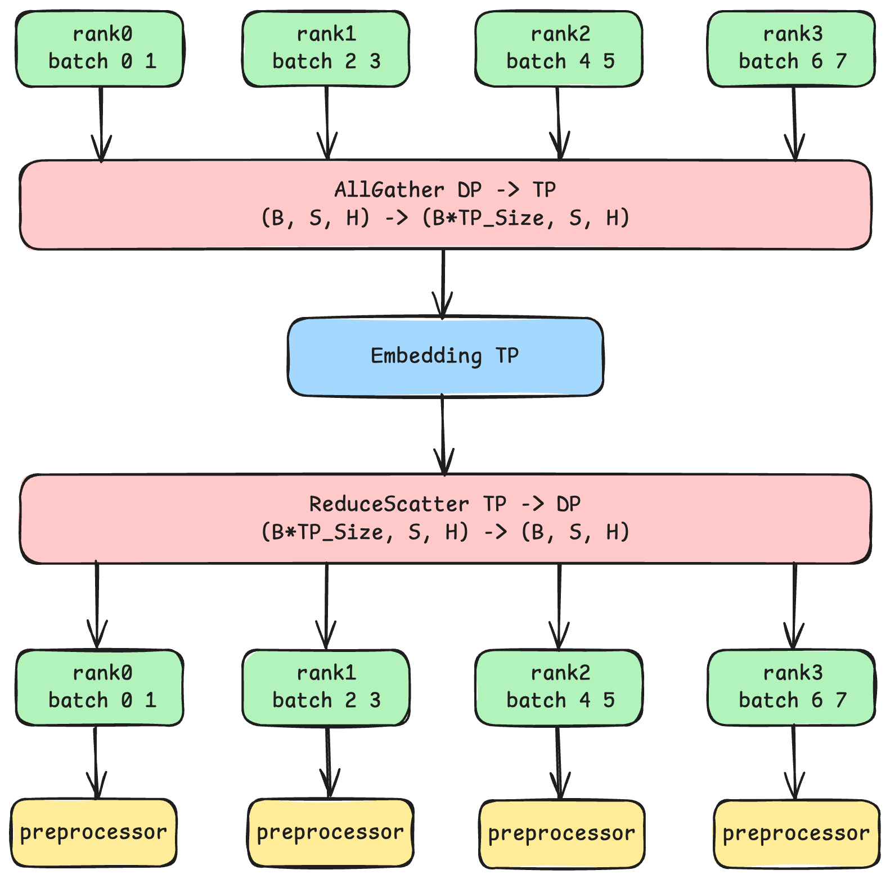
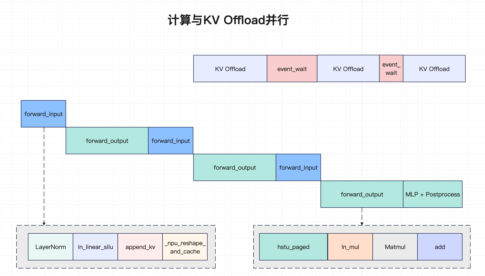
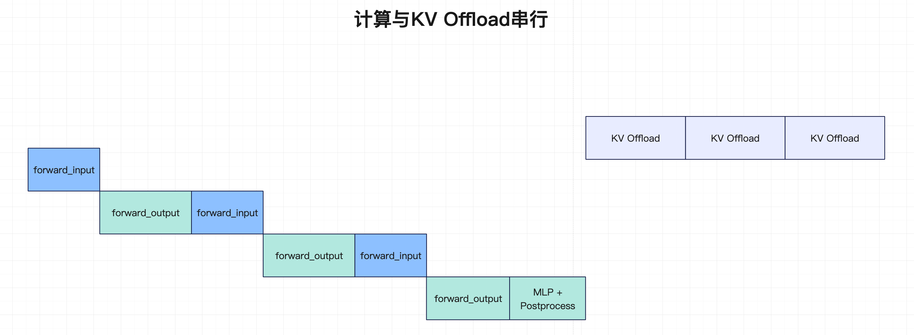

# NPU HSTU 模型推理优化实践

本文档主要介绍HSTU模型基于NPU的推理优化策略。

## NPU 模型适配

我们在Nvidia Recsys-Examples仓库的基础上，实现了GPU算子的Torch小算子替换，以及KV Cache的管理逻辑，实现了NPU的`kv_cache_manager_impl`类，代替了原有的tensorrt-llm框架实现逻辑。

我们实现了kv_cache_manager_impl的`allocate_pools`、`get_primary_pool`、`get_num_free_blocks`、`add_sequence_with_eviction`、`remove_sequence`、`evict_all_sequences`、`get_cached_start_position`、`get_num_tokens_cached`、`get_cache_block_ids`方法，实现代码在`cann-recipes-infer/models/hstu/modules/kv_cache_manager_impl.py`文件中。

在小算子的适配逻辑上，我们适配了`jagged_2D_tensor_concat`、`torch_split_2D_jagged`、`torch_add_position_embeddings`、`torch_add_timestamp_positional_embeddings`等torch算子实现。

此外，涉及到GPU的dynamic embedding我们用nn.Embedding来实现。

##  NPU 算子适配

### NPU hstu融合算子
在hstu attention部分，Nvidia实现了自己的cuda算子，NPU下已经有对应的融合算子，我们基于计算逻辑，实现了`hstu_paged`融合算子适配。

```python
jagged_attn_output = torch.ops.mxrec.hstu_paged(q=query,
    k=key,
    v=value,
    kv_cache=kv_cache_table,
    mask=None,
    attn_bias=None,
    mask_type=2,
    max_seq_len=self._max_seqlen,
    max_seq_len_k=jd.seqlen_k,
    silu_scale=1.0 / self._max_seqlen,
    seq_offset=jd.seqlen_offsets,
    seq_offset_k=kv_cache_metadata.total_history_offsets,
    seq_offset_t=jd.num_candidates_offsets,
    page_offsets=kv_cache_metadata.kv_indptr,
    page_ids=kv_cache_metadata.kv_indices,
    last_page_len=kv_cache_metadata.kv_last_page_len,
    num_target=jd.num_candidates,
    target_group_size=1)
```

###  NPU _npu_reshape_and_cache算子

在kvcache管理方面，原始的kv cache的layout是[num_pages, num_layers, 2, block_size],我们将其修改为[num_layers 2, num_pages, block_size]形式，引入_npu_reshape_and_cache算子加速append_kv_cache的计算。

```python
torch_npu._npu_reshape_and_cache(src_k, src_v, paged_k_cache, paged_v_cache, slot_i32)
```
### NPU concat_nd_jagged算子

我们将 GPU 侧的 Triton 融合算子 triton_concat_2D_jagged 以及 CUDA 融合算子 jagged_2D_tensor_concat 统一替换为 NPU 侧的 concat_nd_jagged，实现同等功能的高效迁移。concat_nd_jagged算子在 RecSDK 团队开发的concat_2d_jagged算子基础上优化衍生，原生算子仅支持 2 个 tensor 的 concat，不能完全满足HSTU模型的场景要求；我们在 Torch 适配层完成增强改造，将能力扩展为支持 n（n≥2） 个 tensor 的 jagged concat 场景，从而覆盖更通用的融合拼接需求并降低算子分裂与维护成本。


##  分布式推理

我们在推理侧新增了分布式推理能力，主要是Embedding Tensor Parallel (TP) 和 Data Parallel (DP) 。生成式推荐与普通LLM任务的最大不同在于：LLM参数主要集中在dense Transformer权重里，输入token来自于相对固定的文本词表；而生成式推荐往往把用户、物品、上下文等离散特征统一建模为token，其模型容量绝大部分来自超大规模的稀疏参数（Embedding Tables），词表规模可达千万甚至上亿。基于此，我们在推理侧引入Embedding TP（如下图），对大表按vocab维度切分到不同NPU上，以减少单卡显存负担，支撑模型推理。同时，在Embedding TP外采用DP进行并行处理，Embedding部分进行DP -> TP -> DP的操作。

<div align="center">
    
</div>

## KV Offload并行

在执行调度上，我们进一步引入 KV Offload 与 HSTU dense 计算并行（如下图）：原仓实现需要等待 HSTU dense 完成后，再逐层执行 KV offload，这样的计算与KV Offload串行的方式并行度不高，导致性能较差；而在 NPU 上，我们将 offload 时机前移到每层 Attention 结束后立即触发该层 KV offload，并放到另一条 NPU stream 异步执行，从而实现计算链路（HSTU dense + MLP + 后处理）与通信链路（KV offload）的重叠，显著降低流水线空泡并大幅提升整体性能。

<div align="center">
    
</div>

<div align="center">
    
</div>

## 其他优化方向

后续将继续尝试优化hstu前后处理的逻辑，使用融合算子对前处理部分的`concat_2d_jagged`进行处理；使能hstu dense模块计算与offload并行；以及完成更多融合算子的开发和接入，以进一步降低推理时延，提升性能。此外，在embedding处理和offload流程上我们也将通过尝试使能shmen等手段进一步提升性能。
