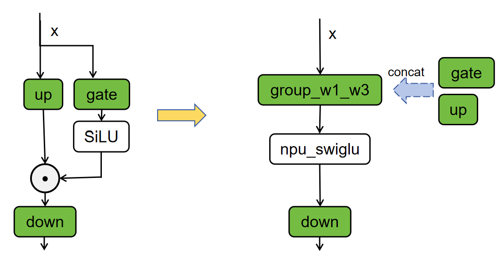
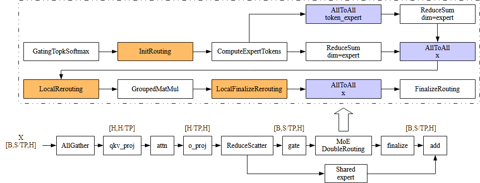
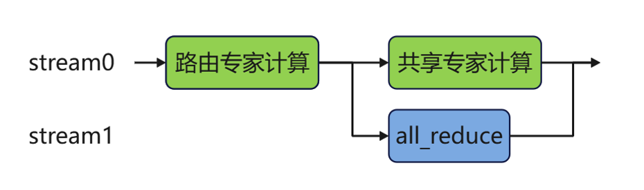
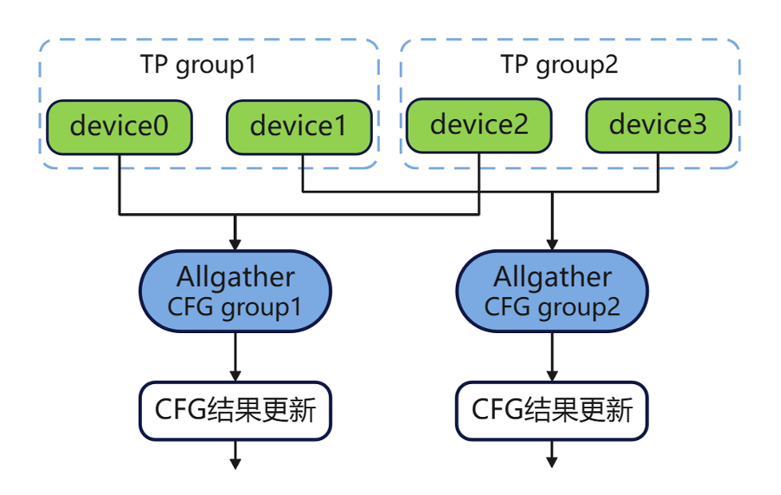

# NPU HunyuanImage-3.0模型推理优化实践

## 概述
本文主要介绍HunyuanImage-3.0模型基于NPU的推理优化策略。本文将介绍如何在Atlas A2/A3 系列产品上进行TP（Tensor Parallel）推理，及其他并行技术和算子融合优化方案。

## 切分策略

### Attention TP优化
#### 切分策略
对Attention的张量切分策略可以分为对QKV头的切分和对线性层的切分。
在对QKV头切分时，attention的多头计算机制可以方便进行张量切分，每个头先独立计算，再将结果concat起来。假设模型的attention层需要对`num_heads`个query按照切分数量`attn_tp_size`进行切分，要求`num_heads`必须能被`attn_tp_size`整除，每张卡放置query头个数为`num_heads_per_rank = num_heads // attn_tp_size`；key和value头数相等，且可能小于等于query头个数（在MQA和GQA的场景下会小于）。为了确保每张卡至少放置一个key和value头，每张卡放置的key或value头数计算方法为
`num_key_value_heads_per_rank = max(num_key_value_heads // attn_tp_size, 1)`。QKV头在多卡上的排布情况如下图所示。


在对线性层`o_proj`进行切分时，按照行切分即可。

#### 计算分解
该优化策略先将Q、K、V的线性层计算合并为一次Matmul计算（图中merged_qkv_proj），提升计算性能。将`merged_qkv_proj`的输出结果按Q、K、V拆分后，对Q和V进行归一化操作并使用旋转位置编码，再计算attention（图中Fused_infer_attention_score），最后通过o_proj层输出。


### MoE TP优化
#### 切分策略
假设模型的MoE层的切分数量为`moe_tp_size`，专家个数为expert_num。对MoE层进行张量切分。具体做法是对`gate_proj`与`up_proj`进行列切分，对`down_proj`进行行切分。同时对`gate_proj`与`up_proj`线性层采用合并计算的优化方式，得到`w13_weight`。

#### 计算分解
每个专家层存在gate_proj、up_proj与down_proj三个matmul运算，具体运算为 x = down( SiLU(gate(x))*up(x) )。本优化将张量切分后的gate_proj和up_proj进行concat操作，再使能[torch_npu.npu_swiglu](https://www.hiascend.com/document/detail/zh/Pytorch/730/apiref/torchnpuCustomsapi/docs/context/overview.md)融合算子接口优化，该算子能完成以下两步计算：
- 将输入的x沿最后一维切分为两块，即x = torch.chunk(x, 2, -1)。
- 计算并返回 SiLU(x[0]) * x[1]。

本优化通过将gate_proj与up_proj合并计算，提升整体计算效率。



### MoE EP优化

在前述TP切分策略下，MoE的routing和finilizing与切分的份数无关，不论RANK数为多少，routing和finilizeing的开销都一致，随着RANK数的增加，这部分的占比逐渐提升、无法优化。

因此，考虑对MoE部分改用EP切分方案，对MoE的gating切分S轴，之后的routing与finalizing计算量均变为原来的`1/ep_size`倍；此时MoE部分需要采用DoubleRouting的方案：
1. 在GatingTopK之后使用InitRouting来确定当前RANK的token都需要分给哪些专家
2. 使用all_to_all通信将tokens_per_expert发送至对应RANK
3. 使用all_to_all通信，将tokens发送至对应的RANK
4. 执行LocalRerouting，在每个RANK内按照专家序对token进行重排
5. 执行GroupedMatMul进行专家计算
6. 执行LocalFinalizeRerouting，排序回第二次all_to_all后的排布
7. 使用all_to_all把计算完的token发送回原本的TP域内对应RANK
8. 执行FinalizeRerouting，对专家计算的结果在TP域内进行累加

为了优化通信量，配合此EP+DoubleRouting方案，在q_proj前使用AllGather对hidden_states进行聚合，o_proj后使用ReduceScatter对Attentiond的结果进行分发，这样可以为通算融合创造机会（AllGather与qkv_proj融合、o_proj与ReduceScatter融合）。




## 并行优化
### MoE多流并行优化
MoE模块中，路由专家采用TP部署。共享专家的计算与路由专家在完成MoE计算后的通信可以通过多流并行机制使二者流水掩盖，使用all_reduce的异步机制实现。排布情况如下图所示。



### VAE并行优化
本样例对模型的VAE并行进行了使能。通过空间并行的方式实现，将大尺寸图像在高度和宽度维度上切分成多个块，分配给不同的NPU进程并行处理，可以加速原模型VAE推理。在`vae_patch_parallel.py`脚本实现此优化。

以下VAE并行流程图展示了空间并行处理的完整执行路径：


1. 首先将输入张量按空间维度切分到多个进程，每个进程处理自己的局部块；
2. 然后在计算过程中根据不同操作的特点采用相应的通信策略——卷积操作通过与邻居交换边界数据来获取上下文，注意力操作通过全局收集所有K,V张量来保证计算完整性，插值操作通过扩展边界、计算后再裁剪来处理上采样；
3. 最后通过两阶段的收集过程将各个进程的局部结果按照原始的空间位置重新拼接成完整的输出张量。

### CFG并行优化
本样例对模型的CFG并行进行了使能。
对于一张图的生成，CFG(Classifier Free Guidance)需要跑一个无条件的生成和一个有条件的生成，相当于网络跑了两个样本，可以把这两个样本拆分到两张卡上去跑，然后通过all_gather通信操作互相获取对方的计算结果，得到最终的预测结果。以TP2+CFGP为例，排布情况如下图所示。


## 使能融合算子

### 通算融合

在当前的EP方案中，attention部分的qkv_proj之前需要先对hidden_states进行AllGather，在o_proj之后又需要对attn_output进行ReduceScatter操作，计算与通信串行执行的情况下会存在大量的性能浪费。查询[Ascend Extension for PyTorch自定义API](https://www.hiascend.com/document/detail/zh/Pytorch/730/apiref/torchnpuCustomsapi/docs/context/overview.md)可以找到合适的通算融合算子以实现掩盖、缩短端到端耗时。

#### AllGatherMM

对于AllGather与qkv_proj，可以考虑使用[torch_npu.npu_all_gather_base_mm](https://www.hiascend.com/document/detail/zh/Pytorch/730/apiref/torchnpuCustomsapi/docs/context/torch_npu-npu_all_gather_base_mm.md)进行替换。须注意的是，该算子仅支持2维tensor作为输入，且只能沿着第0轴切分。因此，调用此算子前需要先将hidden_states的layout由`[b s h]`转为`[(s b) h]`，调用之后再转回`[b s h]`。注意调用时s轴必须在最内侧，否则会出现精度问题。

#### MMReduceScatter

对于o_proj与ReduceScatter，可以考虑使用[torch_npu.npu_mm_reduce_scatter_base](https://www.hiascend.com/document/detail/zh/Pytorch/730/apiref/torchnpuCustomsapi/docs/context/torch_npu-npu_mm_reduce_scatter_base.md)进行替换。须注意的是，该算子仅支持2维tensor作为输入，且只能沿着第0轴切分。因此，调用此算子前需要先将hidden_states的layout由`[b n s d]`转为`[(s b) (n d)]`，调用之后再转回`[b s (n d)]`。注意调用时s轴必须在最内侧，否则会出现精度问题(A2平台下暂未使能该融合算子)。

### GMM使能&&Routing优化
在MoE模块中，如果通过for循环处理每个专家，单独计算`expert_num`个前馈神经网络（FFN），容易导致计算效率较低。CANN提供了`GroupedMatmul`算子，可以同时计算多个专家，从而提高计算和搬运效率。具体实现可参考在`HunyuanMoE`类中的`npu_grouped_matmul`模式下的实现。

- 高效排序和token路由：
    - 使能[torch_npu.npu_moe_init_routing](https://www.hiascend.com/document/detail/zh/Pytorch/710/apiref/torchnpuCustomsapi/context/torch_npu-npu_moe_init_routing.md)融合算子，实现MoE routing计算，获取专家的排序；
    - 使能[torch_npu.npu_moe_compute_expert_tokens](https://www.hiascend.com/document/detail/zh/Pytorch/710/apiref/torchnpuCustomsapi/context/torch_npu-npu_moe_compute_expert_tokens.md)融合算子，获取每个专家需要计算的token数；
    - 使能[torch_npu.npu_moe_finalize_routing](https://www.hiascend.com/document/detail/zh/Pytorch/710/apiref/torchnpuCustomsapi/context/torch_npu-npu_moe_finalize_routing.md)融合算子，将专家计算完成后的token重新排布并加权求和，获得最终输出。
- 高性能专家计算：使能[torch_npu.npu_grouped_matmul](https://www.hiascend.com/document/detail/zh/Pytorch/710/apiref/torchnpuCustomsapi/context/torch_npu-npu_grouped_matmul.md)融合算子，实现多个专家的矩阵乘计算，提高计算和搬运效率。

### RmsNorm算子优化
通过使能[torch_npu.npu_rms_norm](https://www.hiascend.com/document/detail/zh/Pytorch/60RC2/apiref/apilist/ptaoplist_000140.html)算子，能够提升模型的推理性能。RmsNorm是大模型常用的归一化操作，相比LayerNorm，其去掉了减去均值的部分。

## 消除冗余计算
### 消除旋转位置编码冗余cast算子
```
# 将cos, sin转成bfloat16
cos = real_batched_index_select(cos, dim=1, idx=position_ids).to(torch.bfloat16)
sin = real_batched_index_select(sin, dim=1, idx=position_ids).to(torch.bfloat16)

# 旋转位置编码计算使用cos, sin
if self.use_rotary_pos_emb:
    cos, sin = custom_pos_emb
    query_states, key_states = apply_rotary_pos_emb(query_states, key_states, cos, sin)
```
在旋转位置编码计算时，query_states, key_states是实时获取的，数据类型为bfloat16，为了消除cos, sin从float32自动转化成bfloat16的冗余cast算子，在`HunyuanImage3ForCausalMM`类中将cos, sin转成bfloat16。

### 消除gate计算冗余cast算子
```
# 屏蔽外层的`torch.autocast`能力
with torch.npu.amp.autocast(enabled=False):
    if self.wg.weight.dtype == torch.float32:
        hidden_states = hidden_states.float()
    logits = self.wg(hidden_states)
```
由于外部开启了`torch.autocast`且数据类型设置成了bfloat16，即使设置成了float32，在计算时依然会被转成bflat16，出现多个冗余的cast算子，为了保持gate计算的精度，gate计算部分屏蔽外层的`torch.autocast`能力。

### 消除FA中scale的冗余计算

在每次调用FA算子时，默认会计算一次`scale=1/math.sqrt(d)`，这个操作是在CPU进行，会导致下发中断和device的等待，造成性能浪费。由于`d`是一个固定的整数，在config文件中指定，那么完全可以在初始化时将`scale`的值计算出来，并在后续调用FA的地方复用。

在本项目中，对此`scale`的计算被提到`HunyuanImage3Model.__init__()`中，作为一个成员变量存在，后续调用`flash_attn_func_npu`时均直接使用、不再重复计算。

### 消除timestep_index的冗余计算

在DecoderLayer中，计算FA前需要获取`timestep_index`用于确定`casual_len`，其获取方式是`timestep_index = gen_timestep_scatter_index[0, 0].item()`，此处的`item()`操作是一个强同步操作，造成device计算的中断。事实上，`gen_timestep_scatter_index`的值在`HunyuanImage3Text2ImagePipeline.__call__()`的开头即确定下来并不再发生改变，因此可以将timestep_index的初始化提前至`HunyuanImage3Text2ImagePipeline.__call__()`的开头，并透传至`casual_len`的计算处，以避免反复的Host2Device操作，提升总体性能。

## 附录
[环境部署以及样例执行](../../../models/hunyuan-image-3.0/README.md)