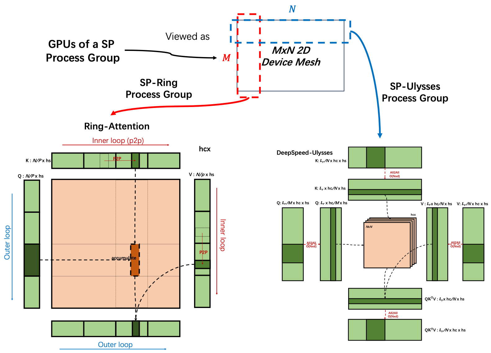

# NPU HunyuanVideo模型推理优化实践

## 优化背景

HunyuanVideo是腾讯发布的一款多模态视频生成模型，是当前开源社区热门的文本视频生成模型。本方案基于昇腾Atlas A2环境优化HunyuanVideo代码，实现了NPU适配和较高的推理性能。

HunyuanVideo基于DiT架构，在生成一个5s的720p视频（共129帧），大约有一个序列长度为119k的3D full Attention计算，attention计算占据模型端到端耗时的81%，DiT占据端到端耗时的95%。为了提高HunyuanVideo的推理性能，本样例做了以下优化。

## 优化总览

本方案中涉及的优化策略如下表所示：

| 优化方案 | 优化角度 | 方案介绍 |
| ------- | -------- | -------- |
| NPU FA融合算子适配 | 融合算子 | 使用CANN内部的[FIA融合算子](https://www.hiascend.com/document/detail/zh/Pytorch/720/apiref/torchnpuCustomsapi/context/torch_npu-npu_fused_infer_attention_score.md)替代transformer中attention计算，算子内部通过tiling策略减少运行时的动态内存，并且加速attention计算。 |
| NPU RMS Norm融合算子适配 | 融合算子 | RMSNorm(Root Mean Square Layer Normalization, 均方根层归一化)是一种更高效的layernorm策略，使用CANN内部的[RMSNorm融合算子](https://www.hiascend.com/document/detail/zh/Pytorch/720/apiref/torchnpuCustomsapi/context/%EF%BC%88beta%EF%BC%89torch_npu-npu_rms_norm.md)替代小算子实现，减少小算子运行时不必要的内部开销（例如搬运、算子头尾开销），实现加速效果。 |
| NPU ROPE融合算子适配 | 融合算子 | Rotary Position Embedding (RoPE) 旋转位置编码，通过对输入特征进行二维平面旋转注入位置信息。使用CANN内部的[npu_rotary_mul融合算子](https://www.hiascend.com/document/detail/zh/Pytorch/720/apiref/torchnpuCustomsapi/context/torch_npu-npu_rotary_mul.md)替代小算子实现，加速原理同上。|
| Ulysses序列并行 | 提高算力 | 将超长序列高效地切分到多个NPU上并行处理，每张卡负责处理自己负责的序列长度。具体在Attention以外的部分，Ulysses序列并行方法切的是序列长度，在Attention计算时改为切head num，以保证attention完整被计算 | 
| Ring Attention序列并行 | 提高算力 | 与Ulysses序列并行类似，但是在attention计算时，每张卡仍然负责处理自己负责的序列长度。为了保证attention完整被计算，需要在卡和卡之间循环传递KV块。 | 
| FBCache | 减少计算量 | DiT生成的原理是将噪声通过多个DiT时间步还原为符合语义的图像或视频。FBCache方法通过缓存两次DiT时间步的残差，在合适的时候用残差代替DiT时间步的实际输出。通过实际上减少推理步数来减少计算量，提高推理性能。FBCache使用第一个DiT Block的输出判断能否复用残差。 |
| TeaCache | 减少计算量 | 与FBCache类似，区别在与TeaCache使用第一个img modulate的输出判断能否复用残差。 |

性能优化结果如下表，其中FBCache使用L1距离作为累加损失，cache阈值为0.05；TeaCache使用L1距离作为累加损失，cache阈值为0.15，这两种cache方法都能保持良好的推理精度。

| NPU数量 | 优化方案 | DiT time(s) | VAE time(s) | E2E time(s) | DiT speedup |
| --- | --- | :---: | :---: | :---: | :---: |
| 单卡 | 开箱（只替换FIA接口） | 3907.32 | 143.63 | 4081.82 | - |
|      | RMSNorm和Rotary融合算子 | 3787.61 | 151.21 | 3953.28 | 1.03x |
|      | FBCache | 1869.50 | 146.17 | 2024.07 | 2.09x |
|      | TeaCache | 1645.26 | 150.76 | 1819.26 | 2.37x |
| 8卡 | Ulysses序列并行 | 480.20 | 159.87 | 698.97 | 8.13x |
|      | Ring Attention序列并行 | 706.07 | 154.82 | 866.60 | 5.53x |


## 具体优化措施

### NPU融合算子适配
#### FIA融合算子适配

使用torch_npu内置的Fused Infer Attention Score(FIA)融合算子替代FlashAttention算子，可见`hyvideo/modules/attention.py`的attention函数（L119）。当attention()的参数`mode=flash`时，启用FIA算子。具体设置可参考[Ascend社区文档](https://www.hiascend.com/document/detail/zh/Pytorch/720/apiref/torchnpuCustomsapi/context/torch_npu-npu_fused_infer_attention_score.md)。

此处将qkv按照序列长度拆分，分别计算图像部分的attention和文本部分的attention，最后进行拼接。

```python
    elif mode == "flash":
        scale = 1.0 / math.sqrt(d)
        if cu_seqlens_q is None:
            x = torch_npu.npu_fused_infer_attention_score(
                q, k, v,
                num_heads=n,
                input_layout="BNSD",
                scale=scale,
            )[0]
        else:
            attn1 = torch_npu.npu_fused_infer_attention_score(
                q[:, :, :cu_seqlens_q[1], :],
                k[:, :, :cu_seqlens_kv[1], :],
                v[:, :, :cu_seqlens_kv[1], :],
                num_heads=n,
                input_layout="BNSD",
                scale=scale,
            )[0]
            attn2 = torch_npu.npu_fused_infer_attention_score(
                q[:, :, cu_seqlens_q[1]:, :],
                k[:, :, cu_seqlens_kv[1]:, :],
                v[:, :, cu_seqlens_kv[1]:, :],
                num_heads=n,
                input_layout="BNSD",
                scale=scale,
            )[0]
            x = torch.cat([attn1, attn2], dim=2)
```

#### RMSNorm融合算子适配

使用torch_npu内置的npu_rms_norm融合算子替代RMS Norm小算子，可见`models/hunyuan-video/hyvideo/modules/norm_layers.py`的forward函数（L55）。小算子实现如下：

```python
    def _norm(self, x):
        """
        Apply the RMSNorm normalization to the input tensor.

        Args:
            x (torch.Tensor): The input tensor.

        Returns:
            torch.Tensor: The normalized tensor.

        """
        return x * torch.rsqrt(x.pow(2).mean(-1, keepdim=True) + self.eps)

    def forward(self, x):
        """
        Forward pass through the RMSNorm layer.

        Args:
            x (torch.Tensor): The input tensor.

        Returns:
            torch.Tensor: The output tensor after applying RMSNorm.

        """
        output = self._norm(x.float()).type_as(x)
        if hasattr(self, "weight"):
            output = output * self.weight
        return output
```

替换成融合算子后仅需一行代码：

```python
    def forward(self, x):
        """
        Forward pass through the RMSNorm layer.

        Args:
            x (torch.Tensor): The input tensor.

        Returns:
            torch.Tensor: The output tensor after applying RMSNorm.

        """
        return torch_npu.npu_rms_norm(x, self.weight, epsilon=self.eps)[0]
```

#### Rotary融合算子适配

使用torch_npu内置的npu_rotary_mul融合算子替代Rope小算子，可见`models/hunyuan-video/hyvideo/modules/posemb_layers.py`的apply_rotary_emb函数（L163）。小算子实现如下：

```python
        xq_out = (xq.float() * cos + rotate_half(xq.float()) * sin).type_as(xq)
        xk_out = (xk.float() * cos + rotate_half(xk.float()) * sin).type_as(xk)
```

融合算子写法如下：

```python
        xq_out = torch_npu.npu_rotary_mul(xq, cos, sin, rotary_mode="interleave")
        xk_out = torch_npu.npu_rotary_mul(xk, cos, sin, rotary_mode="interleave")
```


### 序列并行

假设input的shape为B，S，N，D，分别代表（batch size，sequence，number of head，dimension），序列并行即将input沿着S维度进行切分，在多卡上实现更低的动态显存占用，和更高的DiT性能。

#### Ulysses Sequence Parallelism (SP)：

如图所示，首先将input沿着S维度切分为S/SP，其中SP为序列并行数量，输入模型，直到attn操作。考虑到多头自注意力计算时各个头是并行计算的，在attention以外的地方切分latent的模序列长度，在attn操作时，需要一次AllToAll通讯，交换每张卡存储的数据，等价为将input的shape从（B，S/SP，N，D）reshape为（B，S，N/SP，D）。即从切分序列长度改为切分head num。在attn结束后，由于每张卡实际仅计算1/SP的head的结果，所以需要再一次AllToAll通讯获得完整的attn结果。


#### Ring Attention Sequence Parallelism (SP)：

如图所示，首先将input沿着S维度切分为S/SP，其中SP为序列并行数量，输入模型。当attn计算时，保持本卡的1/SP的Q不动，通过P2P(Peer-To-Peer)，将当前维护的1/SP的KV对传递给下一张卡。每张卡循环接收其他卡的KV对，与本卡的Q计算注意力。


图片来源：[feifeibear](https://github.com/feifeibear/long-context-attention)

### Dit-Cache

DIT-Cache作为扩散模型推理加速的缓存框架，通过复用/预测已有的结果，减少冗余前向计算。其加速逻辑可清晰的分为Step-level和Block-level范式，Step-level通过判断不同采样步数step间的特定特征差异，通过阈值比较，决定是否跳过完整的step计算，直接复用或者预测缓存结果；Block-level以block为粒度（通常是attention模块和mlp模块）判断是否直接复用或者预测缓存结果。

本样例集成了Step-level的Dit-Cache方案，支持[FBCache](https://github.com/chengzeyi/ParaAttention)和[TeaCache](https://github.com/ali-vilab/TeaCache)。

#### TeaCache

TeaCache是一种针对DiT的推理加速优化点，通过缓存相邻DiT step间输出的差值，复用此差值从而跳过当前DiT step，达到加速推理的结果。

首先选取Timestep Embedding Modulated Noisy Input的$\ell_1$距离反应当前timestep和上一步timestep的输出差异。

如果两者的输出差异大于一个阈值（即，累加的$\ell_1$距离>阈值），则代表当前timestep需要完整计算，将$\ell_1$距离清零；如果两者的输出差异小于一个阈值（即，累加的$\ell_1$距离<阈值），则代表当前timestep可以跳过，累加$\ell_1$距离。

除此之外，TeaCache提出了一个多项式scale机制，考虑到不同模型之间模型参数的均值和方差不同，相同input在不同的模型间，Timestep Embedding Modulated Noisy Input可能存在较大的差异，所以TeaCache将累加的$\ell_1$距离经过一个多项式函数放缩，此多项式函数的系数来源于[TeaCache仓库](https://github.com/ali-vilab/TeaCache/blob/main/TeaCache4HunyuanVideo/teacache_sample_video.py#L102)。

TeaCache的核心逻辑如下：
```python
coefficients = [7.33226126e+02, -4.01131952e+02, 6.75869174e+01, -3.14987800e+00, 9.61237896e-02]
rescale_func = np.poly1d(coefficients)
self.accumulated_rel_l1_distance += rescale_func(
    ((modulated_inp - self.previous_modulated_input).abs().mean() /
    self.previous_modulated_input.abs().mean()).cpu().item()
)
if self.accumulated_rel_l1_distance < self.rel_l1_thresh:
    should_calc = False
else:
    should_calc = True
    self.accumulated_rel_l1_distance = 0
```

#### FBCache

与TeaCache类似，FBCache的思想更为简单，通过比较当前时间步和上一个时间步中，DiT的第一个block的输出的相对l1距离，来判断是否可以复用残差。

#### cache config

本方案使用一个配置文件来设置Cache参数，各参数的具体含义如下：
```python
{
    "cache_forward": "NoCache", # 设置Cache方案，可选FBCache和TeaCache，否则不启用Cache。默认不启动Cache。
    "comment": "choose from FBCache/TeaCache, otherwise use NoCache", 
    "FBCache":{
            "cache_name": "FBCache", # Dit-Cache的名字
            "rel_l1_thresh": 0.05,  # FBCache阈值，阈值越大跳过越多，精度损失越大，需要平衡性能和精度
            "latent": "latent", # 缓存的变量
            "judge_input": "cache_latent" # 判断能否复用残差的变量
    },
    "TeaCache":{
            "cache_name" : "TeaCache", # Dit-Cache的名字
            "rel_l1_thresh": 0.1,  # TeaCache阈值，阈值越大跳过越多，精度损失越大，需要平衡性能和精度
            "coefficients": [733.226126,-401.131952,67.5869174,-3.149879,0.0961237896],  #  TeaCache多项式拟合，通过输入输出进行拟合
            "latent": "latent", # 缓存的变量
            "judge_input": "modulated_inp" # 判断能否复用残差的变量
    },
    "NoCache":{
        "cache_name" : "NoCache" # Dit-Cache的名字
    }
}
```