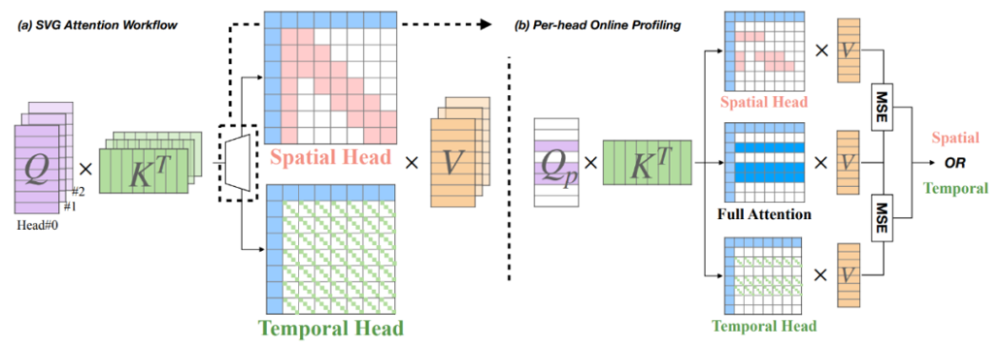
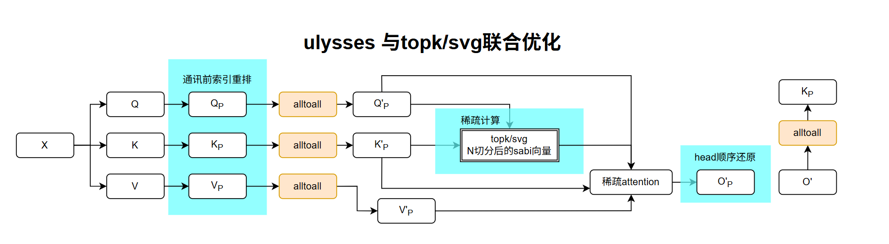

# NPU HunyuanVideo模型推理优化实践

## 优化背景

HunyuanVideo是腾讯发布的一款多模态视频生成模型，是当前开源社区热门的文本视频生成模型。本方案基于昇腾Atlas A2环境优化HunyuanVideo代码，实现了NPU适配和较高的推理性能。

HunyuanVideo基于DiT架构，在生成一个5s的720p视频（共129帧），大约有一个序列长度为119k的3D full Attention计算，attention计算占据模型端到端耗时的81%，DiT占据端到端耗时的95%。为了提高HunyuanVideo的推理性能，本样例做了以下优化。

## 优化总览

本方案中涉及的优化策略如下表所示：

| 优化方案 | 优化角度 | 方案介绍 |
| ------- | -------- | -------- |
| NPU开箱，FA融合算子适配 | 融合算子 | 使用CANN内部的[FIA融合算子](https://www.hiascend.com/document/detail/zh/Pytorch/730/apiref/torchnpuCustomsapi/docs/context/torch_npu-npu_fused_infer_attention_score.md)替代transformer中attention计算，算子内部通过tiling策略减少运行时的动态内存，并且加速attention计算。 |
| NPU RMS Norm融合算子适配 | 融合算子 | RMSNorm(Root Mean Square Layer Normalization, 均方根层归一化)是一种更高效的layernorm策略，使用CANN内部的[RMSNorm融合算子](https://www.hiascend.com/document/detail/zh/Pytorch/730/apiref/torchnpuCustomsapi/docs/context/%EF%BC%88beta%EF%BC%89torch_npu-npu_rms_norm.md)替代小算子实现，减少小算子运行时不必要的内部开销（例如搬运、算子头尾开销），实现加速效果。 |
| NPU ROPE融合算子适配 | 融合算子 | Rotary Position Embedding (RoPE) 旋转位置编码，通过对输入特征进行二维平面旋转注入位置信息。使用CANN内部的[npu_rotary_mul融合算子](https://www.hiascend.com/document/detail/zh/Pytorch/730/apiref/torchnpuCustomsapi/docs/context/torch_npu-npu_rotary_mul.md)替代小算子实现，加速原理同上。|
| Ulysses序列并行 | 提高算力 | 将超长序列高效地切分到多个NPU上并行处理，每张卡负责处理自己负责的序列长度。具体在Attention以外的部分，Ulysses序列并行方法切的是序列长度，在Attention计算时改为切head num，以保证attention完整被计算 | 
| Ring Attention序列并行 | 提高算力 | 与Ulysses序列并行类似，但是在attention计算时，每张卡仍然负责处理自己负责的序列长度。为了保证attention完整被计算，需要在卡和卡之间循环传递KV块。 | 
| FBCache | 减少计算量 | DiT生成的原理是将噪声通过多个DiT时间步还原为符合语义的图像或视频。FBCache方法通过缓存两次DiT时间步的残差，在合适的时候用残差代替DiT时间步的实际输出。通过实际上减少推理步数来减少计算量，提高推理性能。FBCache使用第一个DiT Block的输出判断能否复用残差。 |
| TeaCache | 减少计算量 | 与FBCache类似，区别在与TeaCache使用第一个img modulate的输出判断能否复用残差。 |
| Ulysses Anything Attention | 功能泛化 | 扩展Ulysses序列并行，支持任意头数配置，通过动态填充和对齐机制，突破标准Ulysses要求头数必须被并行度整除的限制。 |
| VAE并行 | 提高算力 | 与序列并行策略相似，每张设备卡仅负责处理分配给自身的序列部分。同时，为解决卷积操作中感受野受限的问题，本样例对每张卡的序列长度进行了补充，使其能够获得相邻设备卡上的部分序列信息。 |
| VAE优化 | 减少计算量 | 使用空间换时间，将需要重复构造的mask缓存在内存，减少重复计算。 |
| 取消VAE offload | 减少搬运 | 开启虚拟内存，可以提高可用内存空间，允许取消CPU-offload，避免频繁地将权重从host搬运到device。 |
| FP8 量化注意力 | 降低显存带宽 | 通过per-block动态量化将注意力计算中的Q/K/V量化为FP8格式，显著降低显存带宽需求，提升推理性能。 |
| MXFP8 矩阵量化 (A8W8) | 降低显存带宽 | 对DiT中的Linear层采用MXFP8量化，实现8-bit激活与8-bit权重的矩阵乘法，降低显存占用和带宽需求，提高推理性能。 |
| 块稀疏 Attention | 减少计算量 | Sparse Attention通过计算分块在注意力计算的重要程度，以此为依据判断需要计算以及跳过哪些分块，通过减少FA计算量从而提升计算效率。 |

性能优化结果如下表，数据来自 Atlas A3。其中 baseline 仅做开箱（FIA 算子替换）；FBCache 使用 L1 距离作为累加损失，cache 阈值为 0.05；TeaCache 使用 L1 距离作为累加损失，cache 阈值为 0.15；Taylor 算 1 跳 3，使用三阶泰勒；这三种 cache 方法都能保持良好的推理精度，对应配置位于 `config/single.yaml`（或 `config/sp8.yaml`）的 `dit_cache.method` 字段——通过切换 `method` 并按 yaml 内注释展开对应 `params` 子块即可使能，字段含义详见 [多模态推理统一拉起设计](../../design/mm_inference_design.md) §5。

注：默认的视频尺寸为`720x1280x129`，在测试**UAA**时，分别评估了保持原始尺寸不变与调整为`730x1300x129`两种配置下的性能表现，见表中`UAA`列为`√`和`730, 1300`的数据。

|      并行     | 融合算子优化 |  ditcache  | vae并行 | vae优化 | 虚拟内存<br>取消VAE offload |    UAA    |  dit(s) | vae(s) |   e2e   | dit speedup | vae speedup | e2e speedup |
| :---------: | :----: | :--------: | :---: | :---: | :-------------------: | :-------: | :-----: | :----: | :-----: | :---------: | :---------: | :---------: |
| 1, **baseline** |    x   |      x     |   x   |   x   |         x        |     x     | 3634.48 | 133.15 | 3768.91 |     1.00    |     1.00    |     1.00    |
|             |    √   |      x     |   x   |   √   |         √        |     x     | 3568.36 |  39.66 |  3612.3 |     1.02    |     3.36    |     1.04    |
|             |    √   |   FBCache  |   x   |   √   |         x        |     x     | 1693.89 |  83.03 | 1778.28 |     2.15    |     1.60    |     2.12    |
|             |    √   |  TeaCache  |   x   |   √   |         x        |     x     | 1737.92 |  88.56 | 1830.75 |     2.09    |     1.50    |     2.06    |
|             |    √   | TaylorSeer |   x   |   √   |         x        |     x     | 1405.68 |  92.85 | 1500.17 |     2.59    |     1.43    |     2.51    |
|   ulysses5  |    √   |      x     |   √   |   √   |         √        |     √     |  769.33 |  40.61 |  811.38 |     4.72    |     3.28    |     4.65    |
|   ulysses8  |    √   |      x     |   √   |   x   |         √        |     x     |  467.67 |  22.78 |  495.94 |     7.77    |     5.85    |     7.60    |
|             |    √   |      x     |   √   |   √   |         √        |     x     |  465.43 |  12.40 |  487.68 |     7.81    |    10.74    |     7.73    |
|             |    √   |      x     |   √   |   √   |         √        |     √     |  477.12 |  13.10 |  482.65 |     7.62    |    10.16    |     7.81    |
|             |    √   |      x     |   √   |   √   |         √        | 730, 1300 |  511.12 |  13.06 |  525.75 |     7.11    |    10.20    |     7.17    |

量化的性能优化结果如下表，数据来自950PR：

| 并行 | 融合算子优化 | matmul量化 | fa量化 | vae并行 | dit(s) | vae(s) | e2e | dit speedup | vae speedup | e2e speedup |
|:---:|:---:|:---:|:---:|:---:|:---:|:---:|:---:|:---:|:---:|:---:|
| 1, **baseline** | √ | x | x | x | 2548.49 | 31.76 | 2580.87 | 1.00 | 1.00 | 1.00 |
|  | √ | √ | x | x | 2392.24 | 31.71 | 2424.52 | 1.07 | 1.00 | 1.06 |
|  | √ | x | √ | x | 1606.29 | 31.70 | 1638.55 | 1.59 | 1.00 | 1.58 |
|  | √ | √ | √ | x | 1539.24 | 31.43 | 1571.24 | 1.66 | 1.01 | 1.64 |
| ulysses8, **baseline** | √ | x | x | √ | 246.29 | 10.27 | 256.92 | 1.00 | 1.00 | 1.00 |
|  | √ | √ | x | √ | 231.55 | 10.33 | 244.47 | 1.06 | 0.99 | 1.05 |
|  | √ | x | √ | √ | 181.85 | 10.50 | 193.96 | 1.35 | 0.98 | 1.32 |
|  | √ | √ | √ | √ | 170.04 | 10.17 | 185.54 | 1.45 | 1.01 | 1.38 |


## 具体优化措施

### NPU融合算子适配
#### FIA融合算子适配

使用torch_npu内置的Fused Infer Attention Score(FIA)融合算子替代FlashAttention算子，可见`hyvideo/modules/attention.py`的attention函数（L119）。当attention()的参数`mode=flash`时，启用FIA算子。具体设置可参考[Ascend社区文档](https://www.hiascend.com/document/detail/zh/Pytorch/730/apiref/torchnpuCustomsapi/docs/context/torch_npu-npu_fused_infer_attention_score.md)。

此处将qkv按照序列长度拆分，分别计算图像部分的attention和文本部分的attention，最后进行拼接。

```python
    elif mode == "flash":
        scale = 1.0 / math.sqrt(d)
        if cu_seqlens_q is None:
            x = torch_npu.npu_fused_infer_attention_score(
                q, k, v,
                num_heads=n,
                input_layout="BNSD",
                scale=scale,
            )[0]
        else:
            attn1 = torch_npu.npu_fused_infer_attention_score(
                q[:, :, :cu_seqlens_q[1], :],
                k[:, :, :cu_seqlens_kv[1], :],
                v[:, :, :cu_seqlens_kv[1], :],
                num_heads=n,
                input_layout="BNSD",
                scale=scale,
            )[0]
            attn2 = torch_npu.npu_fused_infer_attention_score(
                q[:, :, cu_seqlens_q[1]:, :],
                k[:, :, cu_seqlens_kv[1]:, :],
                v[:, :, cu_seqlens_kv[1]:, :],
                num_heads=n,
                input_layout="BNSD",
                scale=scale,
            )[0]
            x = torch.cat([attn1, attn2], dim=2)
```

#### RMSNorm融合算子适配

使用torch_npu内置的npu_rms_norm融合算子替代RMS Norm小算子，可见`models/hunyuan-video/hyvideo/modules/norm_layers.py`的forward函数（L55）。小算子实现如下：

```python
    def _norm(self, x):
        """
        Apply the RMSNorm normalization to the input tensor.

        Args:
            x (torch.Tensor): The input tensor.

        Returns:
            torch.Tensor: The normalized tensor.

        """
        return x * torch.rsqrt(x.pow(2).mean(-1, keepdim=True) + self.eps)

    def forward(self, x):
        """
        Forward pass through the RMSNorm layer.

        Args:
            x (torch.Tensor): The input tensor.

        Returns:
            torch.Tensor: The output tensor after applying RMSNorm.

        """
        output = self._norm(x.float()).type_as(x)
        if hasattr(self, "weight"):
            output = output * self.weight
        return output
```

替换成融合算子后仅需一行代码：

```python
    def forward(self, x):
        """
        Forward pass through the RMSNorm layer.

        Args:
            x (torch.Tensor): The input tensor.

        Returns:
            torch.Tensor: The output tensor after applying RMSNorm.

        """
        return torch_npu.npu_rms_norm(x, self.weight, epsilon=self.eps)[0]
```

#### Rotary融合算子适配

使用torch_npu内置的npu_rotary_mul融合算子替代Rope小算子，可见`models/hunyuan-video/hyvideo/modules/posemb_layers.py`的apply_rotary_emb函数（L163）。小算子实现如下：

```python
        xq_out = (xq.float() * cos + rotate_half(xq.float()) * sin).type_as(xq)
        xk_out = (xk.float() * cos + rotate_half(xk.float()) * sin).type_as(xk)
```

融合算子写法如下：

```python
        xq_out = torch_npu.npu_rotary_mul(xq, cos, sin, rotary_mode="interleave")
        xk_out = torch_npu.npu_rotary_mul(xk, cos, sin, rotary_mode="interleave")
```


### 序列并行

假设input的shape为B，S，N，D，分别代表（batch size，sequence，number of head，dimension），序列并行即将input沿着S维度进行切分，在多卡上实现更低的动态显存占用，和更高的DiT性能。

#### Ulysses Sequence Parallelism (SP)：

如图所示，首先将input沿着S维度切分为S/SP，其中SP为序列并行数量，输入模型，直到attn操作。考虑到多头自注意力计算时各个头是并行计算的，在attention以外的地方切分latent的模序列长度，在attn操作时，需要一次AllToAll通讯，交换每张卡存储的数据，等价为将input的shape从（B，S/SP，N，D）reshape为（B，S，N/SP，D）。即从切分序列长度改为切分head num。在attn结束后，由于每张卡实际仅计算1/SP的head的结果，所以需要再一次AllToAll通讯获得完整的attn结果。


#### Ring Attention Sequence Parallelism (SP)：

如图所示，首先将input沿着S维度切分为S/SP，其中SP为序列并行数量，输入模型。当attn计算时，保持本卡的1/SP的Q不动，通过P2P(Peer-To-Peer)，将当前维护的1/SP的KV对传递给下一张卡。每张卡循环接收其他卡的KV对，与本卡的Q计算注意力。


图片来源：[feifeibear](https://github.com/feifeibear/long-context-attention)

#### Ulysses Anything Attention

标准Ulysses序列并行要求注意力头数（num_heads）必须能被序列并行度（ulysses_degree）整除，这一限制在实际应用中可能导致配置不灵活的问题。Ulysses Anything Attention通过动态填充和分布式对齐机制，打破了这一限制，支持任意头数配置。

**核心原理：**

1. **动态填充（Padding）**：当头数不能被并行度整除时，自动计算需要填充的头数，使填充后的头数能被并行度整除。
   ```python
   h_pad = world_size - (h % world_size)  # 计算填充头数
   new_h_local = (h + h_pad) // world_size  # 每卡本地头数
   ```

2. **分布式对齐**：仅最后一rank需要填充，其他rank保持原始数据，减少不必要的内存开销。

3. **填充约束**：填充头数必须小于每卡本地头数，确保填充不会导致负优化。

**代码实现：**

填充逻辑位于 `module/unified_sp/uaa.py`：

```python
def _maybe_pad_qkv_head(x: torch.Tensor, h: int, world_size: int) -> Tuple[torch.Tensor, int]:
    """Maybe pad the head dimension to be divisible by world_size."""
    h_pad = 0
    if h % world_size != 0:
        h_pad = world_size - (h % world_size)
        new_h_local = (h + h_pad) // world_size
        # 约束：填充头数必须小于每卡本地头数
        if h_pad >= new_h_local:
            raise ValueError(
                f"Padding head num {h_pad} should be less than new local head num {new_h_local}"
            )
        x = F.pad(x, (0, 0, 0, h_pad)).contiguous()
    return x, h_pad
```

**使用方式：**

```python
# 启用 Ulysses Anything 模式
attn = UnifiedSPAttention(
    ulysses_group=ulysses_group,
    ring_group=None,
    ulysses_anything=True  # 关键参数
)
```

**示例：**

| 配置 | 头数 | 并行度 | 填充数 | 每卡头数 |
|------|------|--------|--------|----------|
| 标准Ulysses | 24 | 8 | 0 | 3 |
| Ulysses Anything | 30 | 8 | 2 | 4 |
| Ulysses Anything | 40 | 8 | 0 | 5 |

**视频尺寸约束解除：**

标准Ulysses序列并行对视频尺寸有严格约束：视频的高度H或宽度W必须满足 `H % 16 % ulysses_degree == 0` 或 `W % 16 % ulysses_degree == 0`。这意味着对于不同的并行度配置，需要选择特定的视频分辨率。

Ulysses Anything通过动态序列长度分配机制，解除了这一约束。其核心在于支持各rank的序列长度不一致，通过通信收集各rank的实际序列长度后再进行all-to-all操作：

```python
# 收集各rank的序列长度
output_split_sizes = _gather_size_by_comm(s_local, self.ulysses_pg)
# 使用实际的序列长度分配进行all-to-all
x = fc.all_to_all_single(x, output_split_sizes, input_split_sizes, self.ulysses_pg)
```

这使得任意视频尺寸都能适配任意的Ulysses并行度配置，极大提升了配置灵活性。

### FP8 量化注意力

FP8量化注意力通过将注意力计算中的Q、K、V张量量化为FP8格式，显著降低显存带宽需求，特别适用于显存受限或带宽受限的场景。

#### 量化原理

本方案采用per-block动态量化策略：

1. **Per-block量化**：将张量划分为固定大小的块，每块独立计算缩放因子，相比per-tensor量化具有更高的精度。

2. **差异化量化粒度**：
   - **Query**: 使用 `group_size=128`，较小的块大小保证更高的量化精度，因为Query直接影响注意力分数计算。
   - **Key/Value**: 使用 `group_size=256`，较大的块大小在精度和压缩率之间取得平衡，K/V对量化噪声有更好的容忍度。

3. **FP8 E4M3格式**：采用IEEE FP8 E4M3格式（4位指数，3位尾数），在动态范围和精度之间取得良好平衡。

#### 代码实现

量化核心函数位于 `module/fa_quant/fa_quant.py`：

```python
def npu_group_quant(input, group_size, dst_type=torch.float8_e4m3fn, output_bnsd=True):
    """
    Perform per-block quantization on input tensor for NPU acceleration.
    """
    b, s, n, d = input.shape
    input = input.contiguous().view(b * s, n * d)

    # 使用NPU专用动态块量化算子
    input_quant, input_scale = torch_npu.npu_dynamic_block_quant(
        input,
        row_block_size=group_size,
        col_block_size=d,
        dst_type=dst_type
    )

    input_quant = input_quant.contiguous().view(b, s, n, d)
    input_scale = input_scale.contiguous().view(b, -1, n, 1)

    return input_quant.transpose(1, 2), input_scale.transpose(1, 2)
```

融合注意力计算：

```python
def npu_fp8_attn(q, k, v, dst_type=torch.float8_e4m3fn):
    """Perform FP8 quantized attention computation on NPU."""
    # Q使用group_size=128，K/V使用group_size=256
    q_quant, q_scale = npu_group_quant(q, 128, dst_type, output_bnsd=True)
    k_quant, k_scale = npu_group_quant(k, 256, dst_type, output_bnsd=True)
    v_quant, v_scale = npu_group_quant(v, 256, dst_type, output_bnsd=True)

    # 调用NPU融合注意力算子，内置反量化
    attn_out = torch_npu.npu_fused_infer_attention_score_v2(
        q_quant, k_quant, v_quant,
        num_query_heads=n,
        input_layout="BNSD",
        softmax_scale=1.0 / math.sqrt(d),
        query_quant_mode=7,    # per-block dynamic quantization
        key_quant_mode=7,
        value_quant_mode=7,
        dequant_scale_query=q_scale,
        dequant_scale_key=k_scale,
        dequant_scale_value=v_scale,
    )[0]

    return attn_out.transpose(1, 2).to(torch.bfloat16)
```

#### 使用方式

**独立使用量化注意力：**

```python
from module.fa_quant import npu_fp8_attn

output = npu_fp8_attn(q, k, v, dst_type=torch.float8_e4m3fn)
```

**结合序列并行使用：**

```python
attn = UnifiedSPAttention(
    ulysses_group=ulysses_group,
    ring_group=None,
    fa_perblock_fp8=True  # 启用FP8量化注意力
)
```

#### 量化模式说明

`quant_mode=7` 表示per-block动态量化模式，算子内部处理以下流程：
1. 使用缩放因子对量化值进行反量化
2. 执行注意力计算（Q×K^T）
3. 应用Softmax
4. 执行输出计算（Attn×V）
5. 返回BF16格式的输出

#### 限制说明

- FP8量化注意力当前仅支持Ulysses序列并行，不支持Ring Attention
- 量化精度与group_size相关，较小的group_size精度更高但缩放因子更多
- 建议在精度敏感场景进行对比测试，选择合适的量化参数

### MXFP8 矩阵量化 (A8W8)

MXFP8量化针对DiT中的Linear层（如MLP、投影层）进行量化，实现8-bit激活与8-bit权重的矩阵乘法，进一步降低显存占用和带宽需求。

#### 量化原理

MXFP8（Micro-scaling FP8）是一种基于块量化的FP8格式，采用E4M3FN数据类型（4位指数，3位尾数）：

1. **Per-token量化**：对激活张量按token维度量化，每个token有独立的缩放因子。
2. **Per-group量化**：对权重按组量化，默认组大小为32，平衡精度与压缩率。
3. **E8M0缩放因子**：缩放因子采用E8M0格式（纯指数表示），仅占1字节。

#### 代码实现

量化核心代码位于 `hyvideo/modules/mxfp8_a8w8.py`：

**动态量化Linear层：**

```python
def dynamic_convert_mxfp8_linear(module, original_dtype, params_to_keep=None):
    """Dynamically convert Linear layers to MXFP8 quantized format."""
    for key, layer in module.named_modules():
        # 仅转换transformer块中的Linear层
        if isinstance(layer, nn.Linear) and ('double_blocks' in key or 'single_blocks' in key):
            # 跳过modulation层和1D权重
            if len(layer.weight.shape) == 1 or 'mod' in key:
                continue

            # 动态量化权重为MXFP8格式
            mxfp8_weight, mxfp8_scale = torch_npu.npu_dynamic_mx_quant(
                layer.weight.data,
                dst_type=torch.float8_e4m3fn
            )

            layer.weight.data = mxfp8_weight
            setattr(layer, "weight_scale", mxfp8_scale)
            # 替换forward为量化版本
            setattr(layer, "forward", lambda input, m=layer: mxfp8_linear_forward(m, original_dtype, input))
```

**量化Linear层前向传播：**

```python
def mxfp8_linear_forward(layer, original_dtype, x):
    """Forward pass for MXFP8 quantized linear layer."""
    # 动态量化输入为MXFP8格式
    x_quant, x_scale = torch_npu.npu_dynamic_mx_quant(x, dst_type=torch.float8_e4m3fn)

    # 执行量化矩阵乘法 (A8W8)
    output = torch_npu.npu_quant_matmul(
        x_quant,
        layer.weight.T,
        pertoken_scale=x_scale,           # 输入缩放因子
        bias=layer.bias.to(torch.float32),
        scale=layer.weight_scale.permute(1, 0, 2),  # 权重缩放因子
        output_dtype=original_dtype,      # 输出BF16/FP16
        pertoken_scale_dtype=torch_npu.float8_e8m0fnu,
        scale_dtype=torch_npu.float8_e8m0fnu,
        group_sizes=[1, 1, 32]            # 权重量化组大小
    )
    return output
```

#### 使用方式

```python
from hyvideo.modules.mxfp8_a8w8 import dynamic_convert_mxfp8_linear

# 在模型加载后，转换Linear层为MXFP8格式
dynamic_convert_mxfp8_linear(dit_model, original_dtype=torch.bfloat16)
```

#### 量化范围

| 层类型 | 是否量化 | 说明 |
|--------|----------|------|
| double_blocks中的Linear | ✓ | 双流注意力块的投影层 |
| single_blocks中的Linear | ✓ | 单流注意力块的投影层 |
| Modulation层 (adaLN) | ✗ | 保持原始精度，保证调制精度 |
| 1D权重层 | ✗ | 不适合量化 |

#### 性能收益

- **显存占用**：权重从BF16（2字节）压缩到FP8（1字节），显存占用减半
- **带宽需求**：权重加载带宽降低50%
- **计算效率**：利用NPU的量化矩阵乘法硬件加速

### Dit Cache

DIT-Cache作为扩散模型推理加速的缓存框架，通过复用/预测已有的结果，减少冗余前向计算。其加速逻辑可清晰的分为Step-level和Block-level范式，Step-level通过判断不同采样步数step间的特定特征差异，通过阈值比较，决定是否跳过完整的step计算，直接复用或者预测缓存结果；Block-level以block为粒度（通常是attention模块和mlp模块）判断是否直接复用或者预测缓存结果。

本样例集成了Step-level的dit cache方案，支持[FBCache](https://github.com/chengzeyi/ParaAttention)和[TeaCache](https://github.com/ali-vilab/TeaCache)。

#### TeaCache

TeaCache是一种针对DiT的推理加速优化点，通过缓存相邻DiT step间输出的差值，复用此差值从而跳过当前DiT step，达到加速推理的结果。

首先选取Timestep Embedding Modulated Noisy Input的$\ell_1$距离反应当前timestep和上一步timestep的输出差异。

如果两者的输出差异大于一个阈值（即，累加的$\ell_1$距离>阈值），则代表当前timestep需要完整计算，将$\ell_1$距离清零；如果两者的输出差异小于一个阈值（即，累加的$\ell_1$距离<阈值），则代表当前timestep可以跳过，累加$\ell_1$距离。

除此之外，TeaCache提出了一个多项式scale机制，考虑到不同模型之间模型参数的均值和方差不同，相同input在不同的模型间，Timestep Embedding Modulated Noisy Input可能存在较大的差异，所以TeaCache将累加的$\ell_1$距离经过一个多项式函数放缩，此多项式函数的系数来源于[TeaCache仓库](https://github.com/ali-vilab/TeaCache/blob/main/TeaCache4HunyuanVideo/teacache_sample_video.py#L102)。

TeaCache的核心逻辑如下：
```python
coefficients = [7.33226126e+02, -4.01131952e+02, 6.75869174e+01, -3.14987800e+00, 9.61237896e-02]
rescale_func = np.poly1d(coefficients)
self.accumulated_rel_l1_distance += rescale_func(
    ((modulated_inp - self.previous_modulated_input).abs().mean() /
    self.previous_modulated_input.abs().mean()).cpu().item()
)
if self.accumulated_rel_l1_distance < self.rel_l1_thresh:
    should_calc = False
else:
    should_calc = True
    self.accumulated_rel_l1_distance = 0
```

#### FBCache

与TeaCache类似，FBCache的思想更为简单，通过比较当前时间步和上一个时间步中，DiT的第一个block的输出的相对l1距离，来判断是否可以复用残差。

#### cache config

本方案使用一个配置文件来设置Cache参数，各参数的具体含义如下：
```python
{
    "cache_forward": "NoCache", # 设置Cache方案，可选FBCache和TeaCache，否则不启用Cache。默认不启动Cache。
    "comment": "choose from FBCache/TeaCache, otherwise use NoCache", 
    "FBCache":{
            "cache_name": "FBCache", # dit cache的名字
            "rel_l1_thresh": 0.05,  # FBCache阈值，阈值越大跳过越多，精度损失越大，需要平衡性能和精度
            "latent": "latent", # 缓存的变量
            "judge_input": "cache_latent" # 判断能否复用残差的变量
    },
    "TeaCache":{
            "cache_name" : "TeaCache", # dit cache的名字
            "rel_l1_thresh": 0.15,  # TeaCache阈值，阈值越大跳过越多，精度损失越大，需要平衡性能和精度
            "coefficients": [733.226126,-401.131952,67.5869174,-3.149879,0.0961237896],  #  TeaCache多项式拟合，通过输入输出进行拟合
            "latent": "latent", # 缓存的变量
            "judge_input": "modulated_inp" # 判断能否复用残差的变量
    },
    "NoCache":{
        "cache_name" : "NoCache" # dit cache的名字
    }
}
```

#### cache for sp

本方案支持cache+多卡推理，针对FBCache和TeaCache，需要通过all_reduce收集每张卡的`l1_loss`，每张卡采用相同的cache复用/计算判断。

```python
def _sync_scalar_for_sp(self, value: float) -> float:
    """
    Synchronize a scalar value across all SP ranks.
    Returns the averaged value across all ranks.
    """
    if self.sp_group is None or self.sp_world_size <= 1:
        return value
    tensor = torch.tensor([value], dtype=torch.float32, device='npu')
    dist.all_reduce(tensor, op=dist.ReduceOp.SUM, group=self.sp_group)
    return (tensor.item() / self.sp_world_size)
```


### VAE并行

与序列并行的思想类似，沿着序列长度将latent切分，每张卡处理各自的序列长度。

值得注意的是，VAE阶段涉及卷积操作，简单的chunk会导致边缘感受野不足（部分序列被切分到了相邻卡上），生成出来的视频有明显的拼接现象。为此，本样例为每张卡的序列做了补充，使其能够获得相邻设备卡上的部分序列信息。

### 块稀疏 Attention

稀疏Attention算法的主要思路，是根据一定稀疏度选取注意力分数最高，对结果影响最大的块，而跳过其余块的计算。基于这一前提，这里实现了两种不同的稀疏算法，其原理都是尽可能选取注意力分数更高的块，接下来将依次介绍两种不同的方法。该优化方法基于[blitz_sparse_attention算子](https://gitcode.com/cann/ops-transformer/blob/master/experimental/attention/blitz_sparse_attention/README.md)实现，运行前需要依据参考文档编译算子。编译算子运行命令如下：

```bash
git clone https://gitcode.com/cann/ops-transformer.git
cd ops-transformer

yum install patch # 安装相关依赖
pip install -r requirements.txt

bash build.sh --make_clean --experimental -j96 --pkg --soc=ascend910_93 --ops=blitz_sparse_attention #（--soc，A2：ascend910b，A3：ascend910_93）
./build/cann-ops-transformer-custom_linux-"$(uname -i)".run
cd experimental/attention/blitz_sparse_attention/torch_interface && bash build.sh custom
```

#### TopK

TopK算法分为两个阶段：

1.offline-profiling。`累计注意力覆盖率（Cumulative Attention Score Coverage`表示未被稀疏元素的注意力分数的占比，用于衡量未被稀疏的部分对于注意力计算的重要程度。cac值越高，期望精度越高，稀疏度越低。计算公式为：
$$
CAC = \frac{\sum_{(i,j) \in \text{Top-K}} \text{Softmax}\left(\frac{QK^{T}}{\sqrt{d_{k}}}\right)_{ij}}{\sum_{i,j} \text{Softmax}\left(\frac{QK^{T}}{\sqrt{d_{k}}}\right)_{ij}}
$$
offline-profiling代码存放在`/module/blockwise_sparse/offline_profiling/`，参考以下命令执行。offline-profiling会执行个别样例的推理，对于dit过程中的每个step、layer和head，根据预先设定的CAC阈值，遍历不同的稀疏度，找出满足该CAC的最大稀疏度，并进行记录。在后续的推理中，每次做块稀疏attention时，会根据先前设定好的稀疏度进行计算。offline-profiling的运行命令如下：

```bash
cd /module/blockwise_sparse/offline_profiling/
python offline_profiling_hyvideo.py  --qk_dir_path /path/to/qk_dir --target_dir_path /path/to/target_dir --global_layer_num 60 --head_num 24 --target_coverage 0.66 --step_start 0 --step_end 50
```
需要保存各step和layer的q和k的张量，放置在`/path/to/qk_dir`，结果将被保存在`/path/to/target_dir`。`global_layer_num`和`head_num`表示总层数数和头的个数，`target_coverage`表示目标CAC，`step_start`和`step_end`分别表示开始进行稀疏的step id和结束稀疏的step id。


2.online推理阶段，首先将q，k按行进行分块，池化，得到简化后的q和k。计算该注意力分数。对于每一行根据预先计算得到的稀疏度，选取前k个分数作为需要计算的块，其余的块作为稀疏。最后记录选取q和k中块的id，构造稀疏mask和sabi tensor。

#### SVG
SVG算法的计算过程如下：1.构造得到两种不同的稀疏范式对应的mask，spatial和temporal。每次计算attention前，对于每个头，采样一小部分q，分别计算在两种mask下的稀疏attention，以及full attention，求两种mask的mse值。选取mse误差较小的类别作为该头所属的pattern，并记录对应的mask。2.根据构造好的mask，计算稀疏attention。


图片来源：[svg](https://icml.cc/virtual/2025/poster/43743)

通过在启动 YAML 顶层增加 `sparse:` 段使能 Sparse Attention（无该段或 `method: no_sparse` 即关闭）。`config/single_sparse.yaml` 是单卡 SVG 参考配置（`320*480*65` 规格），`config/sp8_sparse.yaml` 是 8 卡 Ulysses + SVG 参考配置（`720*1280*129` 规格）。**Sparse Attention 支持单卡和 Ulysses 多卡**（详见下文 `Ulysses + TopK/SVG 联合优化`），但**不支持 Ring Attention**——`sample_video.py` 检测到 `ring_degree > 1` 会直接抛 `ValueError`。启用 sparse 后会覆盖 Dit-Cache 的 block forward，二者互斥，所以 sparse YAML 都固定 `dit_cache.method: NoCache`。`sparse:` 段内联了原独立 `sparse_config.yaml` 的全部字段，结构如下：
```yaml
sparse:
  method: "SVG"                      # [no_sparse, TopK, SVG]
  block_size_Q: 128                  # q/k 分块大小
  block_size_K: 512
  model: "HunyuanVideo"
  params:
    TopK:                            # only used when method == TopK
      sparse_time_step: "10-49"      # 应用稀疏的 step
      sparsity_files_path: "./sparsity/320x480x65/v3"  # 离线 profiling 产物路径
      CAC_threshold: 0.66            # CAC 阈值
    SVG:                             # only used when method == SVG
      sparse_time_step: "14-49"
      sparsity: 0.8                  # 稀疏度
      sample_mse_max_row: 5000       # 采样长度
      context_length: 256            # context 长度
```
不同块稀疏 Attention算法的性能数据如下：
| Method   | Sparsity | DiT Time (s) | E2E Time (s) | DiT Speedup | E2E Speedup |
|----------|----------|-------------:|-------------:|------------:|------------:|
| Baseline | –        | 3459.52      | 3577.19      | 1.00×       | 1.00×       |
| TopK     | 76%      | **1839.48**  | **1963.52**  | **1.88×**   | **1.82×**   |
| SVG      | 80%      | 2036.18      | 2167.55      | 1.70×       | 1.65×       |


### Ulysses + TopK/SVG 联合优化

在 HunyuanVideo 的长序列场景下，块稀疏 Attention 需要与 Ulysses 序列并行协同工作，才能同时发挥“多卡并行”和“减少计算量”两方面收益。围绕 `TopK/SVG + Ulysses`，本方案主要做了以下优化：

1. **Ulysses 稀疏链路适配**  
   在 attention 前后复用 Ulysses 的通信逻辑，使 `TopK/SVG` 可以在多卡序列并行下稳定构造完整的稀疏 attention 输入，流程图如下。

2. **UAA（Ulysses Anything Attention）兼容**  
   支持任意 head 数和任意 HW 配置，解除标准 Ulysses 对 head 整除和固定分辨率的限制，使 `TopK/SVG + Ulysses` 能适配更灵活的模型配置与输入尺寸。

3. **稀疏 metadata 构造优化**  
   对 `must_keep`、`move_sink`、`sabi/pattern` 等稀疏元数据进行多卡适配，使 `TopK/SVG` 在 Ulysses 并行下仍能保持稳定的稀疏块选择逻辑。

4. **Head 级负载均衡优化**  
   根据不同 head 的稀疏度和计算量分布，对多卡场景下的 head 分配做重排，减少单卡拖尾，提高多卡并行效率。


#### Ulysses + TopK/SVG 性能数据

以下数据统计了 HunyuanVideo 在稠密 attention 与异构稀疏 attention（TopK/SVG）下的推理耗时，单位为秒（s）。

| 方案 | 单卡 | 无负载均衡（四卡） | 负载均衡（四卡） | 无负载均衡（八卡） | 负载均衡（八卡） |
| ---- | ---- | ------------------ | ---------------- | ------------------ | ---------------- |
| 稠密计算 | 3587 | 904 | 904 | 464 | 464 |
| 异构稀疏 | 2160 | 576 | 564 | 335 | 321 |
| 相较稠密加速比 | 1.66x | 1.57x | 1.60x | 1.39x | 1.45x |

从上述数据可以看出：

1. 相比稠密 attention，异构稀疏在单卡与多卡场景下都能显著降低 DiT 计算耗时，例如单卡从 `3587s` 降至 `2160s`，四卡从 `904s` 降至 `576s`，八卡从 `464s` 降至 `335s`。  
2. 四卡场景下，负载均衡带来的收益较小，仅将异构稀疏耗时从 `576s` 进一步优化到 `564s`，绝对收益约 `12s`，说明此时 head 负载已经相对均衡。  
3. 八卡场景下，负载均衡收益更明显，可将异构稀疏耗时从 `335s` 降低到 `321s`，绝对收益约 `14s`，相对降幅约 `4.2%`，说明并行度提升后，head 级别的计算不均衡更加突出。  
4. Ulysses 与 TopK/SVG 结合后，既能利用多卡序列并行提升吞吐，也能通过块稀疏进一步减少 FA 实际计算量；以八卡为例，相较稠密计算可取得 `1.39x` 到 `1.45x` 的整体加速。
