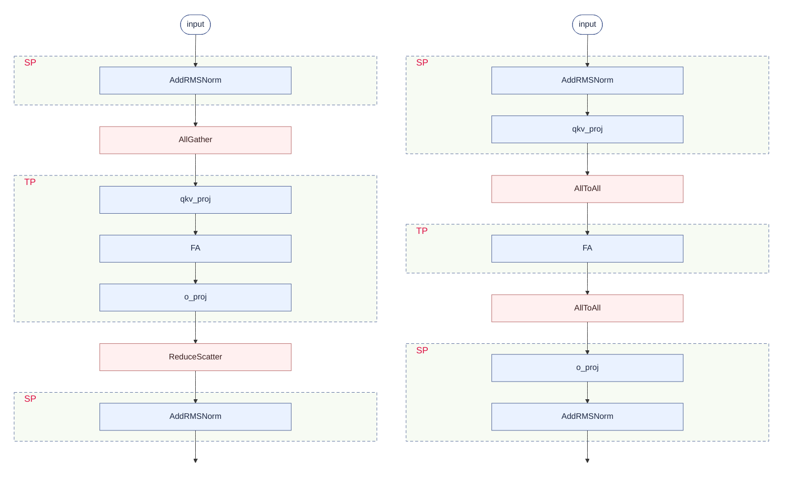
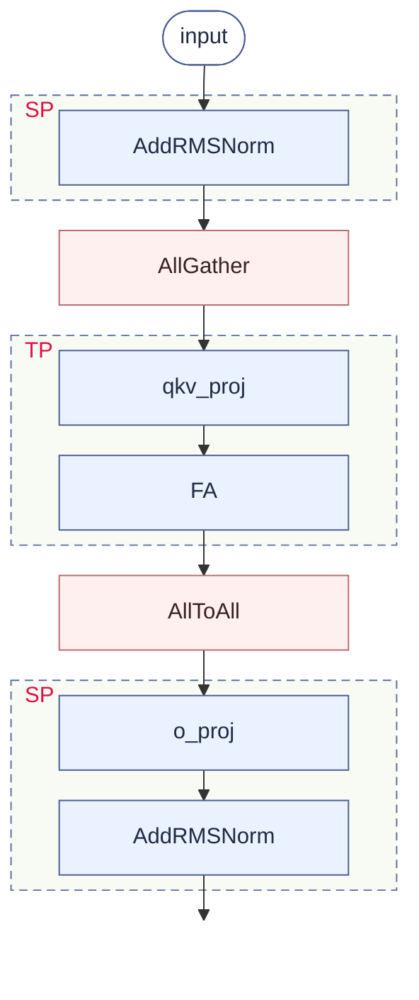
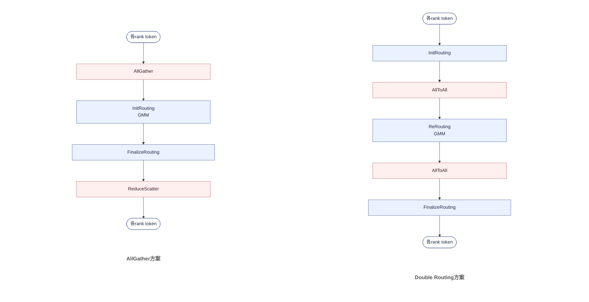
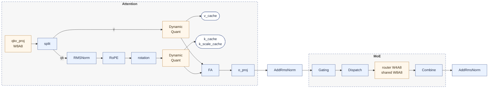
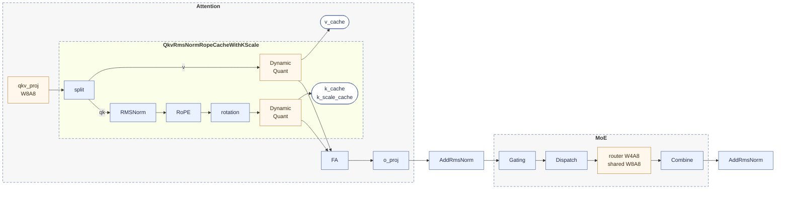
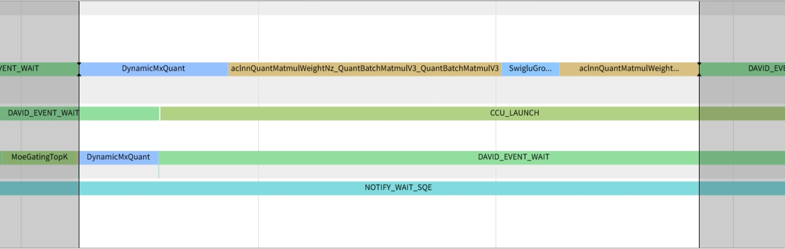

# Hy3 昇腾0day适配： 基于CANN的高性能推理优化实践
Hy3 正式版发布，面向真实业务场景打磨，采用 295B 总参数、21B 激活参数架构，原生支持 256K 上下文，并提供no_think（极速响应）、think_low（快速思考）与 think_high（深度推理） 多档思考模式，兼顾极速响应、复杂推理与调用成本。

Hy3 在 昇腾950PR/DT 与 Atlas A3 两个平台的推理部署样例均已开源。本文主要介绍基于 Ascend950PR 多卡环境的 Hy3 模型 Prefill 推理优化，首先分析了Hy3 模型架构与模型并行策略，并介绍适配昇腾的多卡部署与融合 Kernel 优化方案。基于全套优化方案，本实践 0day 完成 Hy3 模型部署，支持原生 FP8 权重，**并进一步支持昇腾亲和的 MXFP8/MXFP4 量化格式，同时兼容 C8 量化方案**，全套优化模型与融合 Kernel 均已开源。

针对 Hy3 模型 GQA 推理架构，本次重点完成**FA 全 FP8 量化优化**，实现**QKV 前处理融合算子**与**FP8 全量化 GQA**两个融合算子并完成模型适配集成，进一步提升长序列推理吞吐与时延性能。本次开源包含模型部署实现与AscendC高性能实现。

## Highlights

- 设计实现NPU亲和的并行策略，支持`昇腾950PR/DT`和`Atlas-A3`多代际昇腾芯片部署。[模型推理代码](https://gitcode.com/cann/cann-recipes-infer/blob/master/models/hy3/README.md)已在cann-recipes-infer开源。
- 基于AscendC开源发布 QKV 前处理融合算子与 FP8 全量化 GQA 融合算子，高性能计算GQA前处理流程。
- 基于NpuGraphEx后端，叠加dynamo编译缓存、多流并行等特性，释放昇腾算力，实现极致的图模式加速。
- `昇腾950PR/DT`支持原生FP8量化模式，可实现权重无损平滑迁移。同时本实践支持采用MXFP8替代原生FP8计算，并进一步支持MXFP4量化。
- 基于上述优化点，CANN已0day支持Hy3推理部署。

## 模型结构

Hy3 采用GQA+MoE 混合架构，原生支持 256K 上下文。


| 属性 | 值 |
|:---|:---|
| 架构 | 混合专家（MoE） |
| 总参数量 | 295B |
| 激活参数量 | 21B |
| MTP层参数量 | 3.8B |
| 层数（不含MTP层） | 80 |
| MTP层数 | 1 |
| 注意力头 | 64（GQA，8 个 KV 头，head dim 128） |
| 隐藏层维度 | 4096 |
| FFN 中间层维度 | 13312 |
| 上下文长度 | 256K |
| 词表大小 | 120832 |
| 专家数量 | 192 个专家，top-8 激活 |

## 并行策略: Prefill优化（Attention SP+TP, MoE EP）

### 概述

在Prefill推理场景下，模型需要一次性处理完整的输入序列，属于计算密集（compute-bound）场景。为在TTFT时延约束下实现最大吞吐，采用Attention序列并行（SP）+张量并行（TP）与MoE专家并行（EP）的组合策略，结合MXFP8/MXFP4量化与多算子融合，显著降低Prefill阶段的计算与通信开销。同时为了节省LM Head和Embedding Table的内存占用，LM Head和Embedding计算使用TP并行。

### Attention SP+TP优化

#### 并行策略选择

Attention部分可以考虑的并行方式包括DP/TP/SP，由于TTFT的时延要求，Attention的并行策略主要考虑TP/SP。Hy3模型为GQA结构（q_head:kv_head=64:8），因此TP并行是比较自然的选择。在TP的基础上对FA前后的算子增加SP并行，进一步减少整体时延。

整体来说一般采用两种方案：

- **方案一（AllGather + ReduceScatter）**：FA 前用 AllGather 将各 Rank 的序列分片聚合成完整序列参与注意力；FA 后经 o_proj，再由 ReduceScatter 求和并切回序列分片。
- **方案二（AlltoAll + AlltoAll）**：FA 前后均用 AlltoAll 在「序列分片」与「注意力头分片」两种布局间切换；每张卡始终只持有一份分片、无需像 AllGather 那样将完整序列复制到每张卡，因而通信数据量更小。

两种方案的差异如下图所示：

<div style="max-width: 100%; overflow-x: auto;">
<div style="width: 1120px; max-width: 100%; margin: 0 auto;">



</div>
</div>

综合考虑通信数据量、数据类型和融合算子兼容性三个因素，Prefill阶段Attention采用**SP+TP上述两方案的组合**：

- **FA前通信**：使用AllGather将各Rank的子序列聚合成完整序列，配合FP8/MXFP8量化减小通信数据量；
- **FA后通信**：使用AlltoAll将各Rank的注意力输出按序列维度重新分发，相对于纯TP的ReduceScatter进一步减少通信耗时。

注意到，allgather和alltoall通信为量化后的8bit数据格式，有效减少通信总量。

#### 切分策略

最终选择的切分策略如下：

<div style="width: fit-content; max-width: 100%; margin: 0 auto; overflow-x: auto;">



</div>

### MoE EP优化

#### 并行策略选择

MoE部分支持TP和EP两种并行方式。TP并行会将GMM的K或N轴切得过小，导致计算性能下降。EP并行每个Rank持有部分专家，通过InitRouting完成token与专家的路由匹配，在`ep_size`数较小时通信开销可控。

EP并行进一步分为AG-RS（AllGather-ReduceScatter）方案和Double Routing（AlltoAll）方案：

| 并行策略            | 通信算子                  | 通信数据量                | 适用场景                                     |
| ------------------- | ------------------------- | ------------------------- | -------------------------------------------- |
| EP (AG-RS)          | AllGather + ReduceScatter | (B,S,H) × 2               | `ep_size`较小、`top_k > ep_size`时数据量更小 |
| EP (Double Routing) | AlltoAll + AlltoAll       | (BS×top_k/ep_size, H) × 2 | 大EP场景、`ep > top_k`时数据量更小           |

> 注：表中 `S` / `BS` 均指全局全序列长度（AG-RS 中为 AllGather 后每卡持有的完整序列）。

当前模型`top_k=8`，在`ep_size=4`时`top_k > ep_size`，AG-RS方案通信数据量更小，为默认优选方案。

#### AG-RS方案

EP AG-RS 方案：每个 rank 先 AllGather 拿到全序列 token，通过 InitRouting 只路由并计算本地专家，经 GMM 后由 FinalizeRouting 加权收回并将非本地专家 mask 掉，最后 ReduceScatter 求和并切回子序列——以 (B,S,H)×2 的冗余通信换取规整集合通信，适用于小 EP（top_k > ep_size）场景


#### Double Routing方案

EP Double Routing（AlltoAll）方案：每个 rank 先用 InitRouting 将本地 token 按专家展开分组，再通过去程 AlltoAll 把 token 精确投递到目标专家所在 rank，经 ReRouting 重排后做 GMM，GMM 输出经回程 AlltoAll 原路送回来源 rank，最后由 FinalizeRouting 乘路由权重加权收回——以两次 AlltoAll 的精确投递换取零冗余通信与零冗余计算，数据量 (BS×top_k/ep_size,H)×2 随 EP 增大而降，适用于大 EP（ep > top_k）场景。

<div style="max-width: 100%; overflow-x: auto;">
<div style="width: 1120px; max-width: 100%; margin: 0 auto;">



</div>
</div>

## 量化策略

本实践支持了原生FP8量化，同时也支持了使用MXFP8替换原生FP8格式的Linear模块，MoE部分替换MXFP4，可以进一步提高整体性能。
Hybrid MXFP8-MXFP4整体量化策略如下：



- Attention：q_proj, k_proj, v_proj, o_proj 使用W8A8量化，KV Cache采用C8量化；

- MoE：路由专家的Linear使用W4A8量化，共享专家的Linear使用W8A8量化；

- LMHead：不量化。

  注： W8A8：W8和A8指MXFP8量化； W4:W4指MXFP4量化; C8部分 ：QK使用动态Per-Token-Head FP8量化，Scale格式为FP32； V Cache使用动态Per-Head FP8量化，Scale格式为FP32。

## 融合Kernel

如下图所示：



- QKV 前处理融合算子：包含QKV split、RMSNorm、RoPE、rotation、动态量化、Cache写回等操作，拿到访存收益与计算流水收益；
- Flash Attention：包含了FP8 全量化 flash attention计算过程；

目前CANN已实现并在ops-transformer仓开源[**qkv_rms_norm_rope_cache_with_k_scale**](https://gitcode.com/cann/ops-transformer/pull/8093)和GQA FP8全量化版本[**fused_infer_attention_score**](https://gitcode.com/cann/ops-transformer/tree/master/attention/fused_infer_attention_score)。

## 使能图编译缓存
在模型推理场景下，使能图编译缓存可以缓存编译后的静态图，避免每次推理都需要编译模型，从而提高推理性能。

```mermaid
%%{init: {"themeVariables": {"lineColor": "#999999"}}}%%
block-beta
    columns 16
    header_label[" "]:2 header_first["<div style='font-size:18px'>首次执行</div>"]:9 header_sep((" ")) header_second["<div style='font-size:18px'>再次执行</div>"]:4
    original_label["<div style='font-size:18px;line-height:1.2'>原始推理任务执行</div>"]:2 original_compile["<div style='font-size:18px;padding:10px 4px'>Dynamo编译</div>"]:5 original_guards_1["<div style='font-size:17px;padding:10px 2px'>Guards</div>"] original_capture_1["<div style='font-size:17px;line-height:1.2;padding:8px 2px'>aclgraph<br/>Capture</div>"] original_input_1["<div style='font-size:17px;line-height:1.2;padding:8px 2px'>Input<br/>处理</div>"] original_replay_1["<div style='font-size:17px;padding:10px 2px'>Replay</div>"] original_sep((" ")) original_guards_2["<div style='font-size:17px;padding:10px 2px'>Guards</div>"] original_capture_2["<div style='font-size:17px;line-height:1.2;padding:8px 2px'>aclgraph<br/>Capture</div>"] original_input_2["<div style='font-size:17px;line-height:1.2;padding:8px 2px'>Input<br/>处理</div>"] original_replay_2["<div style='font-size:17px;padding:10px 2px'>Replay</div>"]
    cache_label["<div style='font-size:18px;line-height:1.2'>开启模型编译缓存</div>"]:2 cache_save_1["<div style='font-size:18px;padding:10px 4px'>Time save</div>"]:6 cache_capture_1["<div style='font-size:17px;line-height:1.2;padding:8px 2px'>aclgraph<br/>Capture</div>"] cache_input_1["<div style='font-size:17px;line-height:1.2;padding:8px 2px'>Input<br/>处理</div>"] cache_replay_1["<div style='font-size:17px;padding:10px 2px'>Replay</div>"] cache_sep((" ")) cache_save_2["<div style='font-size:17px;line-height:1.2;padding:8px 2px'>Time<br/>save</div>"] cache_capture_2["<div style='font-size:17px;line-height:1.2;padding:8px 2px'>aclgraph<br/>Capture</div>"] cache_input_2["<div style='font-size:17px;line-height:1.2;padding:8px 2px'>Input<br/>处理</div>"] cache_replay_2["<div style='font-size:17px;padding:10px 2px'>Replay</div>"]
    space:11 bottom_sep((" ")) space:4

    header_sep -.- bottom_sep

    style header_label fill:transparent,stroke:transparent,color:transparent
    style header_first fill:transparent,stroke:transparent,color:#202124
    style header_second fill:transparent,stroke:transparent,color:#202124
    style header_sep fill:transparent,stroke:transparent,color:transparent
    style original_label fill:transparent,stroke:transparent,color:#202124
    style cache_label fill:transparent,stroke:transparent,color:#202124
    style original_compile fill:#4d73ff,stroke:#2f4ab3,color:#ffffff
    style original_guards_1 fill:#ffe9b8,stroke:#d0a044,color:#3a2a12
    style original_guards_2 fill:#ffe9b8,stroke:#d0a044,color:#3a2a12
    style original_capture_1 fill:#ffe8e8,stroke:#d28f8f,color:#3a2020
    style original_input_1 fill:#ffe8e8,stroke:#d28f8f,color:#3a2020
    style original_replay_1 fill:#ffe8e8,stroke:#d28f8f,color:#3a2020
    style original_capture_2 fill:#ffe8e8,stroke:#d28f8f,color:#3a2020
    style original_input_2 fill:#ffe8e8,stroke:#d28f8f,color:#3a2020
    style original_replay_2 fill:#ffe8e8,stroke:#d28f8f,color:#3a2020
    style cache_save_1 fill:#a7eee6,stroke:#48a79e,color:#153936
    style cache_save_2 fill:#a7eee6,stroke:#48a79e,color:#153936
    style cache_capture_1 fill:#ffe8e8,stroke:#d28f8f,color:#3a2020
    style cache_input_1 fill:#ffe8e8,stroke:#d28f8f,color:#3a2020
    style cache_replay_1 fill:#ffe8e8,stroke:#d28f8f,color:#3a2020
    style cache_capture_2 fill:#ffe8e8,stroke:#d28f8f,color:#3a2020
    style cache_input_2 fill:#ffe8e8,stroke:#d28f8f,color:#3a2020
    style cache_replay_2 fill:#ffe8e8,stroke:#d28f8f,color:#3a2020
    style original_sep fill:transparent,stroke:transparent,color:transparent
    style cache_sep fill:transparent,stroke:transparent,color:transparent
    style bottom_sep fill:transparent,stroke:transparent,color:transparent
```



相关接口调用形式如下：

```python
if enable_cache_compile:
    compiled = torch.npu.npugraph_ex.inference.cache_compile(model_forward, cache_dir=cache_dir,
                                                             dynamic=True, options=compile_options)
```
## MoE 共享专家多流并行（Prefill）

Hy3 的 MoE 层中，每个 token 除了走 top-8 路由专家，还要过一个共享专家（shared expert）。共享专家只依赖 MoE 输入、不依赖 Gating 结果，与路由专家的 dispatch、分组 GMM 之间没有数据依赖。Prefill 阶段据此把两者拆到两条流：**主流**依次执行 Gating、路由专家路径（默认 AG-RS 方案，即 AllGather → InitRouting → 分组 GMM → FinalizeRouting → ReduceScatter）、最后的 combine 相加。共享专家下发到 **次流**，其启动同步点排在主流 Gating 之后。路由专家路径是 MoE 块的耗时主体，共享专家与之并发、被其掩盖，几乎不额外增加时延。

下图展示共享专家多流的 profiling 时间线。

<div align="center"></div>

## Benchmark

下述Benchmark数据均基于Offline推理模式采集，不包含Serving调度和框架负载均衡影响。

#### **Ascend950PR Hy3 Benchmark**

| Global Batch Size | Chips | Seq Length | TTFT (ms) |
| ----------------- | ----- | ---------- | --------- |
| 1                 | 4     | 32K        | 2330.23   |
| 1                 | 4     | 64K        | 7023.11   |
