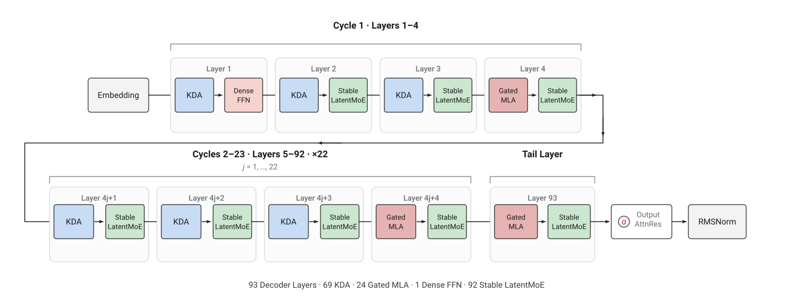
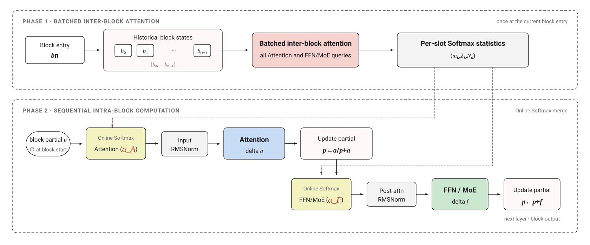
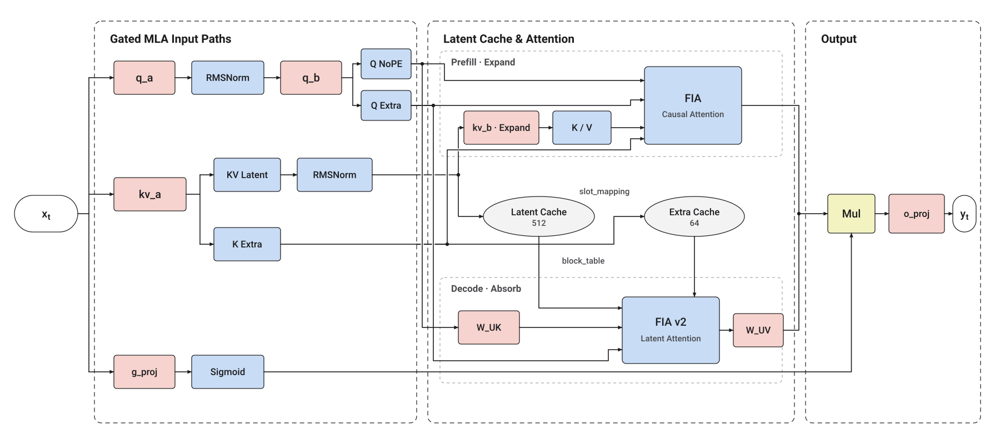

# Kimi K3 昇腾 NPU 推理优化实践

Kimi K3 采用 2.8T 参数的混合注意力 MoE 架构，交错使用 Kimi Delta Attention（KDA）与 Gated MLA，并引入 Attention Residuals（AttnRes）和 Stable LatentMoE，模型原生支持 1M 上下文。KDA 维护固定大小的序列状态，AttnRes 沿网络深度聚合历史表示，Stable LatentMoE 在 latent 空间执行 Routed Expert 计算。

cann-recipes-infer 提供 Kimi K3 在昇腾 950PR/DT 4机 32卡集群上的实现参考，采用 Embedding TP、Attention DP/TP、Dense TP、Prefill SP、Decode DP 与 Routed Expert EP 的组合部署策略。KDA、MLA 与 MoE 均接入融合算子，Mamba Cache 负责 `conv_state` 与 KDA ssm state 的存储分配及请求映射；Stable LatentMoE 支持原生 MXFP4 权重、动态 MXFP8 激活及 Decode Shared Expert 多流。AttnRes 两阶段优化与 Decode `npugraph_ex` 可按需启用。

完整运行方法见[模型 README](../../../models/kimi_k3/README.md)。

## Highlights

- **Block AttnRes**：Attention 与 FFN 各自对跨层表示计算 Softmax 权重，在naive实现的基础上recipes提供两阶段计算策略实现。
- **Stable LatentMoE 与 SiTU**：Routed Expert 在 3584 维 latent 空间计算，Shared Expert 保持 7168 维主干路径，二者均使用 SiTU 激活，recipes提供Routed Expert  EP部署以及Shared Expert TP部署的参考实现，并支持原生MXFP4/MXFP8 Expert 计算。
- **混合并行策略**：recipes采用 Embedding TP、Attention DP/TP、Dense TP、Routed Expert EP、Prefill SP 与 Decode DP部署策略，兼顾模型内存约束/推理性能。
- **融合算子接入**：recipes接入多个KDA/MLA/MoE融合算子，进一步加速推理性能。

## Outline

- [模型结构](#模型结构)
  - [Attention Residuals](#attention-residuals)
  - [混合注意力：KDA 与 Gated MLA](#混合注意力kda-与-gated-mla)
  - [Stable LatentMoE](#stable-latentmoe)
- [并行策略](#并行策略)
- [量化策略](#量化策略)
- [npugraph_ex 图模式](#npugraph_ex-图模式)
- [Future Plan](#future-plan)

## 模型结构

### 整体架构

Kimi K3 采用 93 层 Decoder 主干。前 92 层由 23 组 `KDA - KDA - KDA - Gated MLA` 构成，第 93 层使用 Gated MLA；第 1 层配置 Dense FFN，第 2 至 93 层配置 Stable LatentMoE。每个 Decoder Layer 包含两组 AttnRes，用于构造 Attention 与 FFN 输入；模型输出前再通过独立的 Output AttnRes 聚合深度表示。

  

### 核心参数

| 属性 | Kimi K3 配置 |
|:---|:---|
| 总参数量 | 2.8T（结构统计约 2.78T） |
| 模型原生上下文 | 1M tokens |
| Decoder 层数 | 93 |
| Hidden size | 7168 |
| 词表大小 | 163840 |
| Attention 排布 | 69 层 KDA + 24 层 Gated MLA |
| KDA | 96 heads，head dim 128，ShortConv kernel 4 |
| Gated MLA | Q LoRA rank 1536，KV LoRA rank 512，QK dim `128 + 64`，V dim 128 |
| AttnRes | Block size 12 个 Decoder Layer，共 8 个常驻 block slots |
| Dense FFN | 第 1 层，intermediate size 33792 |
| MoE | 后 92 层，896 Routed Experts，Top-16，sigmoid routing |
| LatentMoE | 主干宽度 7168，routed latent width 3584，expert intermediate size 3072 |
| Shared Expert | 2 个专家 |
| 激活 | SiTU |
| Routed Expert 量化 | MXFP4 weight，group size 32；动态 MXFP8 activation |

### 层型排布

每个 Decoder Layer 串行执行一个 Attention 子层和一个 FFN 子层，顺序为 `Attention → FFN`。Attention 在 KDA 与 Gated MLA 中二选一；第 1 层后接 Dense FFN，第 2 至 93 层后接 Stable LatentMoE。

KDA 与 Gated MLA 采用接近 `3:1` 的周期排布。层号从 1 开始计数时，前 92 层由 23 组 `KDA - KDA - KDA - MLA` 构成，第 93 层再使用一层 MLA：

  

### Attention Residuals

AttnRes 沿网络深度对同一 token 的历史表示进行选择。每个 Attention 和 FFN 子层分别使用独立的可学习 pseudo-query，对候选表示的 RMSNorm 结果打分，沿深度方向执行 Softmax，再对原始候选表示加权求和：

$$
\ell_i=\mathbf{w}^{\mathsf T}\operatorname{RMSNorm}(\mathbf{z}_i),\qquad
\alpha_i=\frac{e^{\ell_i}}{\sum_j e^{\ell_j}},\qquad
\mathbf{h}=\sum_i\alpha_i\mathbf{z}_i
$$

其中 pseudo-query 本身不依赖输入，但候选表示随 token 改变，因此深度权重仍随输入变化。RMSNorm 只用于生成分数，加权求和使用的是未经归一化的原始表示。

#### Block AttnRes 与两阶段计算

Kimi K3 采用 Block AttnRes（分块注意力残差）作为 Full AttnRes 的可扩展变体。该机制按块聚合跨层表示，以块级表示代替全部历史子层输出作为候选状态，从而在保留跨层选择能力的同时，降低候选状态数量及其显存开销。

具体而言，Kimi K3 将 93 个 Decoder Layer 划分为 8 个 Block，每个 Block 包含约 12 层。对于第 $n$ 个 Block，历史块状态集合记为 $\mathcal{B}_n=[\mathbf{b}_0,\mathbf{b}_1,\ldots,\mathbf{b}_{n-1}]$，其中包含初始词嵌入以及此前各 Block 的聚合输出。Block 之间通过 AttnRes 对这些状态进行选择性聚合；Block 内部则采用逐层累加方式维护动态表示 $\mathbf{p}$，下文称为 partial。

进入一个 Block 时，partial 尚未生成，因此第一个 Attention 子层仅对历史块状态集合 $\mathcal{B}_n$ 执行 AttnRes 聚合，并以聚合结果作为子层输入。该子层的输出用于初始化 partial。此后，每个 Attention 或 FFN/MoE 子层均将当前 partial 作为新增候选状态，与 $\mathcal{B}_n$ 拼接为$[\mathbf{b}_0,\mathbf{b}_1,\ldots,\mathbf{b}_{n-1}, \mathbf{p}]$ 共同参与 AttnRes 聚合；子层输出随后累加至 partial。Attention 与 FFN/MoE 分别使用独立的 pseudo-query，因此二者具有相互独立的深度权重。

为减少块内重复计算，Block AttnRes 可等价地拆分为以下两个阶段：

  

- **Phase 1（批量计算块间注意力）**：在 Block 入口处，批量计算块内各子层 pseudo-query 与历史块状态集合 $\mathcal{B}_n$ 之间的分数。对于每个 AttnRes 位置，分别生成 Softmax 所需的最大分数 $m$、归一化指数和 $Z$ 以及未归一化加权和 $\mathbf{N}$。下式中，$\mathbf{b}_i$ 表示第 $i$ 个历史块状态，$\ell_i$ 表示其对应分数：

$$
m=\max_i\ell_i,\qquad
Z=\sum_i e^{\ell_i-m},\qquad
\mathbf{N}=\sum_i e^{\ell_i-m}\mathbf{b}_i
$$

- **Phase 2（顺序计算块内注意力）**：按层执行 Block 内的前向计算。对于每个子层，使用对应的 pseudo-query 计算当前 partial $\mathbf{p}$ 的分数 $r$，再通过 Online Softmax 将 $(\mathbf{p},r)$ 合并到 Phase 1 生成的统计量中，得到该子层的 AttnRes 输出 $\mathbf{h}$：

$$
\begin{aligned}
M &= \max(m,r), \\
Z' &= e^{m-M}Z+e^{r-M}, \\
\mathbf{N}' &= e^{m-M}\mathbf{N}+e^{r-M}\mathbf{p}, \\
\mathbf{h} &= \mathbf{N}'/Z'.
\end{aligned}
$$

以合并后的最大分数 $M$ 为基准平移指数项，可降低指数运算溢出的风险并改善数值稳定性。在精确算术下，两阶段计算与直接对全部候选状态执行 Softmax 聚合严格等价；在有限精度计算中，二者可能因运算顺序不同而产生细微数值差异。各 Block 的统计量相互独立，仅用于对应 Block 的当前次前向计算。

#### 原实现与两阶段优化

- **Kimi 原实现**：AttnRes 随 Decoder Layer 逐层更新，将有效块间历史状态与当前 block 表示进行深度 Softmax 聚合，生成 Attention 与 FFN/MoE 输入；核心聚合由 `KimiDecoderLayer.forward` 中的 `_apply_attn_res` 完成。
- **两阶段优化**：`KimiLinearModel._forward_attn_res_block` 将 block 内复用的块间历史状态计算前移，批量生成统计量，并在层内通过 Online Softmax 合入动态 partial。该路径与 Kimi 原实现数学等价，由 `attn_res_mode: two_phase` 启用；Output AttnRes 保持原实现。
- **融合算子**：`attn_res_mode: fused` 保持相同的两阶段调度，Phase 1/Phase 2 分别调用 `block_attn_res_prepare` 和 `block_attn_res_update`。默认值为 `original`。

### 混合注意力：KDA 与 Gated MLA

#### Kimi Delta Attention

KDA 是带逐 key-channel 衰减的 Delta Rule 线性注意力，输入为 Decoder Layer 的 Input RMSNorm 输出。每个 head 的 Q/K/V 维度均为 128，并维护固定大小的 `128 × 128` KDA SSM State。状态按 token 递推：旧状态先按 key channel 衰减，K 从中读出对当前 V 的预测；β 缩放实际 V 与预测值的差值，并沿 K 对应方向将修正写回状态；Q 最后读取更新后的状态。Q/K 进入 KDA core 前执行 L2Norm，Q 额外按 key 维度的平方根倒数缩放，V 不做归一化。

逐 head、逐 key-channel 的 `gk` 由 `f_a_proj`、`f_b_proj`、`dt_bias` 和所有 heads 共享的 128 维 `A_log` 生成。K3 配置将 `gate_lower_bound` 设为 -5，因此 `gk` 位于 `(-5, 0)`。Prefill 与 Decode 均使用这一 log-decay；Decode 将其作为 `gk` 参数传入融合算子，旧状态乘入其指数对应的保留因子。`b_proj` 经 sigmoid 生成 β。KDA 输出先执行 per-head RMSNorm，再乘逐 value-channel 的 sigmoid 输出门，最后进入 `o_proj`。三类门分别控制状态衰减、状态写入和输出。

KDA 的长期状态大小与序列长度无关；每个请求、每个 KDA 层只需保存：

- `conv_state`：按 Q/K/V 通道拼接，保存三路 ShortConv 最近 3 个 token 的输入；
- KDA SSM State：每个本地 head 保存一个 `128 × 128` 矩阵。

  

`qkv_proj` 按通道生成 Q/K/V。融合 QKV ShortConv 在 Prefill 调用 [`causal_conv1d_fn`](https://gitcode.com/cann/ops-transformer/blob/master/torch_extension/cann_ops_transformer/docs/zh/causal_conv1d_fn.md)，在 Decode 调用 [`causal_conv1d_update`](https://gitcode.com/cann/ops-transformer/blob/master/torch_extension/cann_ops_transformer/docs/zh/causal_conv1d_update.md)，完成逐通道因果卷积与 SiLU 后再拆分三路。三组通道使用各自的卷积权重，共同维护一份拼接的 `conv_state`。

`conv_state` 与 KDA SSM State 分别注册为 `MambaCacheEntry`，由框架统一分配并维护请求到状态块的映射。Prefill 清零对应状态行，`causal_conv1d_fn` 更新 `conv_state`，Torch chunk KDA 按请求计算并写回 KDA SSM State；Decode 复用相同 block id，通过 `causal_conv1d_update` 与 [`npu_recurrent_gated_delta_rule`](https://gitcode.com/Ascend/op-plugin/blob/master/docs/zh/custom_APIs/torch_npu/torch_npu-npu_recurrent_gated_delta_rule.md) 分别原地推进两类状态。

#### Gated MLA

Gated MLA 沿用 MLA 的 Q/KV 低秩投影，并在 Attention 输出后增加逐 head、逐 value-channel 的门控。

  

Recipes 提供 Prefill native、Decode absorb 的实现参考。Prefill 和 Decode 均通过 `npu_kv_rmsnorm_rope_cache_v2`（接口说明参考 [`npu_kv_rmsnorm_rope_cache`](https://gitcode.com/Ascend/op-plugin/blob/26.1.0/docs/context/torch_npu-npu_kv_rmsnorm_rope_cache.md)）融合 KV latent 的 RMSNorm，并依据 `slot_mapping` 将归一化后的 latent 与额外 K 特征写入两份 Paged Cache。

Prefill 通过 `kv_b_proj` 将本轮 latent 临时展开为 per-head K/V，并调用 `npu_fused_infer_attention_score`，以 `NTD_TND` 布局和 `sparse_mode=3` 完成变长序列的 causal Attention。Decode 将 KV up-projection 的 K 矩阵吸收到 Query 侧，再调用 [`npu_fused_infer_attention_score_v2`](https://gitcode.com/Ascend/op-plugin/blob/26.1.0/docs/zh/custom_APIs/torch_npu/torch_npu-npu_fused_infer_attention_score_v2.md)，直接读取 NZ 布局的 latent Paged Cache 完成 absorb Attention；随后通过吸收后的 V 投影将算子输出还原到各 Attention head 的 value 空间。

### Stable LatentMoE

Kimi K3 第 2 至 93 层采用 Stable LatentMoE。输入分别进入 Sigmoid Router、Latent Down 与 Shared Expert 三条分支。Routed 分支在 3584 维 latent 空间计算，聚合结果经 RMSNorm 和 Latent Up 恢复至 7168 维，再与 Shared Expert 分支相加。Decode 启用 `enable_multi_streams` 时，Shared Expert 在独立流执行，与 Routed Expert 的 MC2 路径并行，并在结果相加前同步；Prefill 在主流执行。

  

Router 从 896 个专家中为每个 token 选择 16 个。`correction_bias` 只参与专家选择，聚合权重由未加 bias 的 sigmoid score 在选中专家间归一化后，再乘 `routed_scaling_factor`：

$$
\begin{aligned}
r &= \operatorname{sigmoid}(W_r x), \\
\mathcal{I} &= \operatorname{TopK}(r+b_{\mathrm{corr}},16), \\
p_i &= s\frac{r_i}{\sum_{j\in\mathcal{I}}r_j},\quad i\in\mathcal{I},
\end{aligned}
$$

其中 `s` 表示 `routed_scaling_factor`。

单个 Routed Expert 的结构为 `3584 -> gate/up 各 3072 -> 3584`；Shared Expert 保持在主干宽度计算，结构为 `7168 -> gate/up 各 6144 -> 7168`。

Dense、Shared 和 Routed FFN 均使用 SiTU 作为激活函数。

本次实践中：Router 使用 [`npu_moe_gating_top_k`](https://gitcode.com/Ascend/op-plugin/blob/26.1.0/docs/zh/custom_APIs/torch_npu/torch_npu-npu_moe_gating_top_k.md)，根据 sigmoid routing score 与 `correction_bias` 完成 Top-16 专家选择，并输出后续路由使用的专家索引和聚合权重。

Prefill 采用 AG–EP–RS 路径。Routed latent 先动态量化为 MXFP8，随后 AllGather 汇聚各 SP 分片的激活、scale 和路由结果。[`npu_moe_init_routing_v2`](https://gitcode.com/Ascend/op-plugin/blob/26.1.0/docs/zh/custom_APIs/torch_npu/torch_npu-npu_moe_init_routing_v2.md) 按专家展开并重排激活及其 scale；专家计算使用两次 [`npu_grouped_matmul`](https://gitcode.com/Ascend/op-plugin/blob/26.1.0/docs/zh/custom_APIs/torch_npu/torch_npu-npu_grouped_matmul.md)，分别完成 MXFP4 gate/up 投影和 down 投影。SiTU 后再次执行动态 MXFP8 量化，再进入第二次 GMM。最后由 [`npu_moe_finalize_routing`](https://gitcode.com/Ascend/op-plugin/blob/26.1.0/docs/zh/custom_APIs/torch_npu/torch_npu-npu_moe_finalize_routing.md) 恢复 token 顺序并按路由权重聚合，经 ReduceScatter 返回 SP 布局。

Decode 采用 MC2 EP 路径。[`npu_moe_distribute_dispatch_v2`](https://gitcode.com/Ascend/op-plugin/blob/26.1.0/docs/zh/custom_APIs/torch_npu/torch_npu-npu_moe_distribute_dispatch_v2.md) 根据 Top-16 结果将 token 分发到对应 Expert rank；本地专家继续使用两次 `npu_grouped_matmul` 完成 MXFP4 Expert 计算；[`npu_moe_distribute_combine_v2`](https://gitcode.com/Ascend/op-plugin/blob/26.1.0/docs/zh/custom_APIs/torch_npu/torch_npu-npu_moe_distribute_combine_v2.md) 完成跨 EP 聚合、路由权重加权和 token 顺序恢复。启用多流时，Shared Expert 在独立流执行，并与上述 Routed Expert MC2 路径并行。

## 并行策略

以下并行配置适用于昇腾 950PR/DT 4机 32卡、完整 93 层和 896 Expert。框架级模型副本 DP 为 1；Decoder 层间表示采用 Prefill SP、Decode DP。

### HBM 占用分析

#### 主要 HBM 占用

下表按模块汇总该切分策略下的单卡主要参数占用，不再展开每个投影矩阵的计算过程。其中 Routed Expert 使用 MXFP4 权重与 E8M0 scale，其余主要权重以 BF16 或 FP32 保存。

Routed Expert EP 仅沿 Expert 维度分摊 Routed Expert 参数。Shared Expert 对所有 token 固定激活，不属于 Router 管理的 Expert 集合；KDA/Gated MLA 的 `g_proj/o_proj` 也位于 MoE EP 之外。若这些参数保持复制，Shared Expert 与 93 层 Attention `g_proj/o_proj` 即占约 53.2 GiB/卡，单卡占用约为 110.00 GiB，仍需继续切分。Shared Expert 与首层 Dense FFN 采用 Dense TP，`g_proj/o_proj` 分别采用 Column TP 与 Row TP，将上述主要项的单卡占用降至 58.51 GiB。

| 模块 | 主要内容 | 切分方式 | GiB/卡 |
|:---|:---|:---|---:|
| Embedding + LM Head | 输入与输出词表权重 | Vocab TP | 0.136 |
| Gated MLA（24 层） | Q/KV Low-Rank Projection、Output Gate 与 Output Projection | 部分复制 + Attention TP | 2.752 |
| KDA（69 层） | Q/K/V、门控与输出投影 | Head / Column / Row TP | 1.769 |
| MoE Router（92 层） | Router gating 权重 | Replicated | 2.201 |
| Shared Expert（92 层） | `gate_up_proj` 与 `down_proj` | Dense TP | 0.708 |
| Routed Expert（92 层） | MXFP4 `w13/w2` 权重及 scale | Expert EP | 42.097 |
| Routed latent 投影（92 层） | latent down/up 投影 | Replicated | 8.805 |
| Dense FFN（1 层） | `gate_up_proj` 与 `down_proj` | Dense TP | 0.042 |
| **合计** | — | — | **58.51** |

### Prefill 与 Decode 数据流

本次实践KDA/MLA采用部署策略如下：

  

Prefill 与 Decode 的 Attention / MoE 部署策略如下：

  

- **Prefill**：Attention 前通过 AllGather 汇聚 SP 分片，KDA/Gated MLA 按 Head TP 计算；经输出门和 `o_proj` 后，由 ReduceScatter 恢复 SP 布局。Routed Expert 使用 AG–EP–RS，Shared Expert 使用 AG–TP–RS。
- **Decode**：KDA 采用 DP–TP–DP；Gated MLA 的 Q/KV 投影与 Attention core 保持 DP，Attention 输出和门控输入在输出门前转换为 TP，`o_proj` 后由 ReduceScatter 恢复 DP 布局。Routed Expert 使用 MC2 Dispatch–EP–MC2 Combine，Shared Expert 使用 AG–TP–RS。

KDA SSM State 随 Head TP 切分；Gated MLA latent Cache 在 Prefill 复制，Decode 按 DP 布局读写。第 1 层 Dense FFN 与 Shared Expert 均使用 AG–TP–RS。

## 量化策略

Kimi K3 的 Routed Expert `w13/w2` 使用 MXFP4 权重和动态 MXFP8 激活，其余 checkpoint 权重以 BF16 为主；KDA ShortConv、`A_log`、`dt_bias`、`o_norm` 和 Router correction bias 在 checkpoint 中保留 FP32。加载后，融合的 `qkv_conv1d.weight` 转换为 BF16 参与计算。Routed Expert 的量化格式为：

- 权重元素：MXFP4 E2M1，每两个 4-bit 元素打包为一个 byte；
- 权重 scale：每 32 个输入元素共享一个 E8M0 scale；
- 激活：每 token、每 group 动态量化为 MXFP8 E4M3FN，运行时 scale 为 E8M0FNU；
- SiTU 后重新动态量化，再进入 `down_proj` GMM。

## npugraph_ex 图模式

`npugraph_ex` 用于捕获 Kimi K3 的 Decode 阶段。Prefill 保持 eager，用于处理变长 packed sequence 并建立初始 Cache。Decode 使用固定 token 数、固定 Cache 地址和固定 AttnRes slots 进行 capture/replay。

## Future Plan

- **KDA 融合算子**：提供 Chunk KDA 融合算子，进一步提升 TTFT 性能。
- **AttnRes 融合算子**：围绕两阶段实现，分别融合 Phase 1 的 anchor 打分与统计归约、Phase 2 的 partial 打分与 Online Softmax 合并，减少中间张量读写与调度开销。
- **权重 Prefetch**：针对 Routed Expert GMM 与大线性层的访存瓶颈，评估 MXFP4 专家权重预取收益。
- **MegaMoE支持**：面向 896 expert MoE 大EP 多专家部署场景，支持MegaKernel融合，进一步提升性能与推理稳定性。
