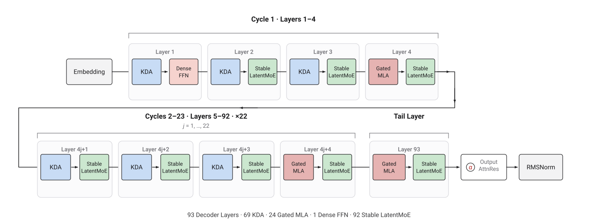
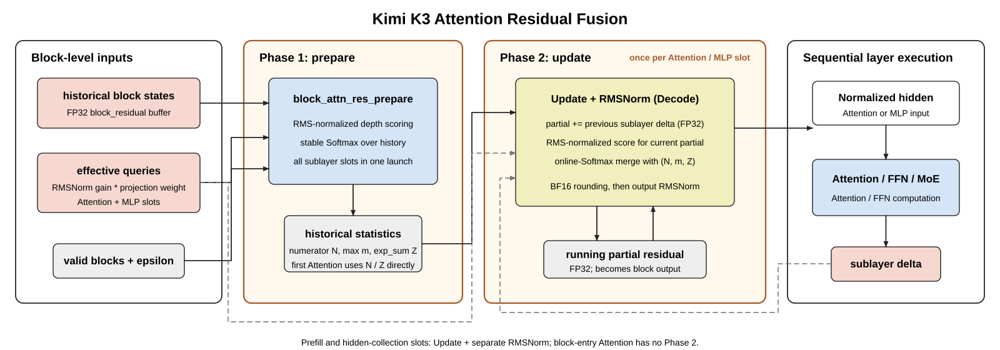
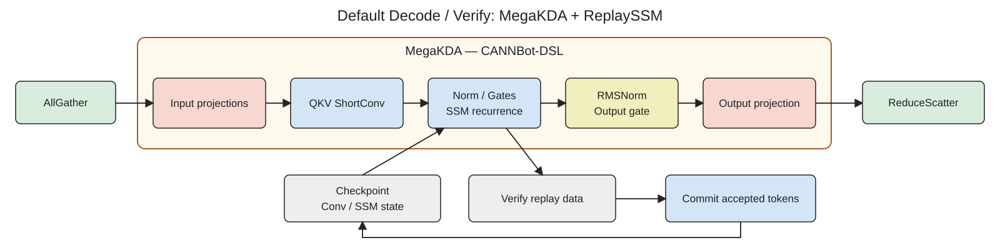
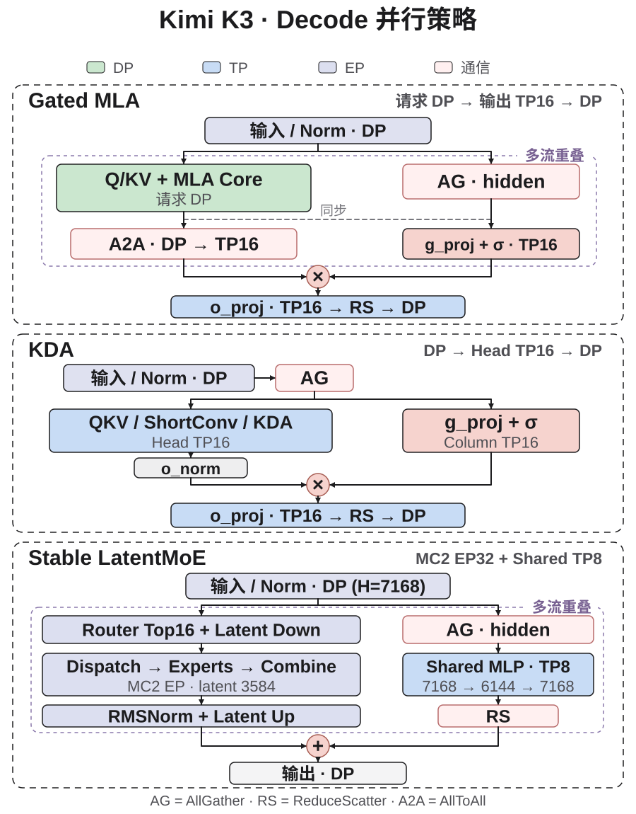
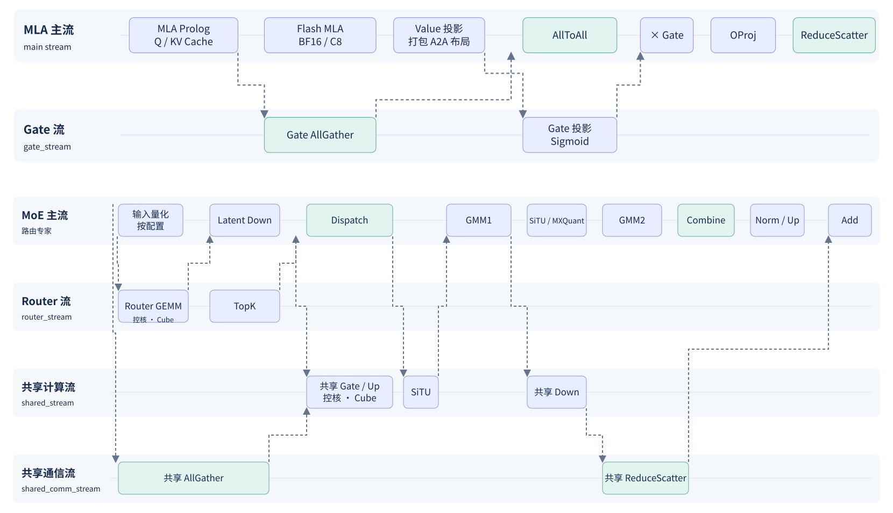
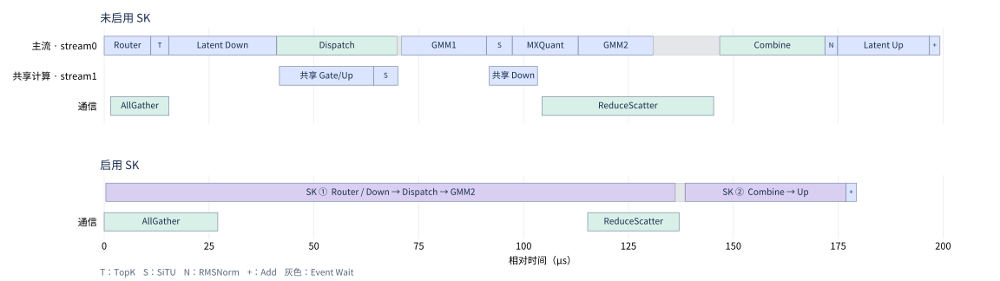
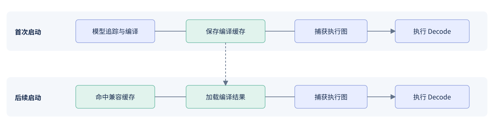
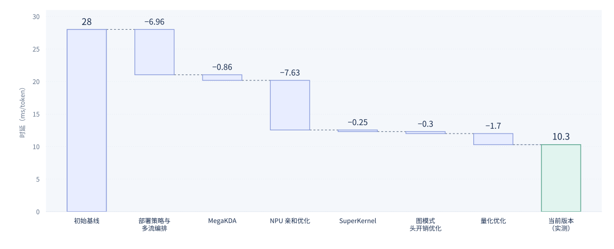

# Kimi K3 昇腾 NPU 推理优化实践

Kimi K3 采用 2.8T 参数的混合注意力 MoE 架构，交错使用 Kimi Delta Attention（KDA）与 Gated MLA，并引入 Attention Residuals（AttnRes）和 Stable LatentMoE，模型原生支持 1M 上下文。KDA 维护固定大小的序列状态，AttnRes 沿网络深度聚合历史表示，Stable LatentMoE 在 latent 空间执行 Routed Expert 计算。

cann-recipes-infer 提供 Kimi K3 在昇腾 950PR/DT 4机 32卡集群上的推理实现参考，采用 Embedding TP、Attention DP/TP、Dense TP、Prefill SP、Decode DP 与 Routed Expert EP 的组合部署策略。KDA、MLA 与 MoE 均接入融合算子。Stable LatentMoE 支持原生 MXFP4 权重、动态 MXFP8 激活及 Decode Shared Expert 多流。AttnRes 两阶段融合、Prefill MegaMoE、MegaKDA/ReplaySSM 和 DSpark 投机推理均提供对应配置路径。

完整运行方法见[模型 README](../../../models/kimi_k3/README.md)。

## Highlights

- **部署优化与多流编排**：组合使用 KDA TP16、MLA DP 与输出 TP16、MoE EP32 与共享专家 TP8，让计算与通信重叠，并通过控核和跨流依赖减少 Cube/vec 资源竞争。
- **MegaKDA 扩大融合范围**：基于 CANNBot-DSL，将输入投影、ShortConv、状态递推和输出处理纳入同一融合算子，减少中间数据搬运与调度开销。
- **DSpark 与 ReplaySSM**：通过草稿生成与批量验证提高解码效率，并在 MegaKDA 基础上支持 ReplaySSM，减少投机验证中的完整状态快照存储。
- **SuperKernel 优化**：扩大 MoE 连续计算的融合范围，结合已有多流编排，减少 Kernel 之间的调度开销。
- **低精度计算**：MLA 采用 MXFP8 W8A8 投影与 FP8 注意力及 KV Cache，latent MoE 采用 MXFP8 W8A8，路由专家采用 MXFP4 权重与动态 MXFP8 激活。
- **NPU 亲和优化**：提前准备 NK/KN 与 NZ 权重布局，接入 AttnRes+RMSNorm、Group SiTU+MXQuant 等融合算子，并按资源需求选择昇腾 CCU/AIV 通信。
- **图模式加速**：采用 PyTorch 图模式与 CANN Aclgraph，结合 Compile Cache 和模型级 Event 复用，缩短编译启动时间并降低调度开销。

## Outline

- [模型结构](#模型结构)
  - [Attention Residuals](#attention-residuals)
  - [混合注意力：KDA 与 Gated MLA](#混合注意力kda-与-gated-mla)
    - [Kimi Delta Attention](#kimi-delta-attention)
      - [KDA 融合算子](#kda-融合算子)
  - [Stable LatentMoE](#stable-latentmoe)
- [并行策略](#并行策略)
- [量化策略](#量化策略)
- [多流编排与 NPU 亲和优化](#多流编排与-npu-亲和优化)
- [npugraph_ex 图模式](#npugraph_ex-图模式)
- [总结](#总结)
- [Future Plan](#future-plan)

## 模型结构

### 整体架构

Kimi K3 采用 93 层 Decoder 主干。前 92 层由 23 组 `KDA - KDA - KDA - Gated MLA` 构成，第 93 层使用 Gated MLA；第 1 层配置 Dense FFN，第 2 至 93 层配置 Stable LatentMoE。每个 Decoder Layer 包含两组 AttnRes，用于构造 Attention 与 FFN 输入；模型输出前再通过独立的 Output AttnRes 聚合深度表示。

  

### 核心参数

| 属性 | Kimi K3 配置 |
|:---|:---|
| 总参数量 | 2.8T（结构统计约 2.78T） |
| 模型原生上下文 | 1M tokens |
| Decoder 层数 | 93 |
| Hidden size | 7168 |
| 词表大小 | 163840 |
| Attention 排布 | 69 层 KDA + 24 层 Gated MLA |
| KDA | 96 heads，head dim 128，ShortConv kernel 4 |
| Gated MLA | Q LoRA rank 1536，KV LoRA rank 512，QK dim `128 + 64`，V dim 128 |
| AttnRes | Block size 12 个 Decoder Layer，共 8 个常驻 block slots |
| Dense FFN | 第 1 层，intermediate size 33792 |
| MoE | 后 92 层，896 Routed Experts，Top-16，sigmoid routing |
| LatentMoE | 主干宽度 7168，routed latent width 3584，expert intermediate size 3072 |
| Shared Expert | 2 个专家 |
| 激活 | SiTU |
| Routed Expert 量化 | MXFP4 weight，group size 32；动态 MXFP8 activation |

### 层型排布

每个 Decoder Layer 串行执行一个 Attention 子层和一个 FFN 子层，顺序为 `Attention → FFN`。Attention 在 KDA 与 Gated MLA 中二选一；第 1 层后接 Dense FFN，第 2 至 93 层后接 Stable LatentMoE。

KDA 与 Gated MLA 采用接近 `3:1` 的周期排布。层号从 1 开始计数时，前 92 层由 23 组 `KDA - KDA - KDA - MLA` 构成，第 93 层再使用一层 MLA：

  

### Attention Residuals

AttnRes 沿网络深度对同一 token 的历史表示进行选择。每个 Attention 和 FFN 子层分别使用独立的可学习 pseudo-query，对候选表示的 RMSNorm 结果打分，沿深度方向执行 Softmax，再对原始候选表示加权求和：

$$
\ell_i=\mathbf{w}^{\mathsf T}\operatorname{RMSNorm}(\mathbf{z}_i),\qquad
\alpha_i=\frac{e^{\ell_i}}{\sum_j e^{\ell_j}},\qquad
\mathbf{h}=\sum_i\alpha_i\mathbf{z}_i
$$

其中 pseudo-query 本身不依赖输入，但候选表示随 token 改变，因此深度权重仍随输入变化。RMSNorm 只用于生成分数，加权求和使用的是未经归一化的原始表示。

#### Block AttnRes 与两阶段计算

Kimi K3 采用 Block AttnRes（分块注意力残差）作为 Full AttnRes 的可扩展变体。该机制按块聚合跨层表示，以块级表示代替全部历史子层输出作为候选状态，从而在保留跨层选择能力的同时，降低候选状态数量及其显存开销。

具体而言，Kimi K3 将 93 个 Decoder Layer 划分为 8 个 Block，每个 Block 包含约 12 层。对于第 $n$ 个 Block，历史块状态集合记为 $\mathcal{B}_n=[\mathbf{b}_0,\mathbf{b}_1,\ldots,\mathbf{b}_{n-1}]$，其中包含初始词嵌入以及此前各 Block 的聚合输出。Block 之间通过 AttnRes 对这些状态进行选择性聚合；Block 内部则采用逐层累加方式维护动态表示 $\mathbf{p}$，下文称为 partial。

进入一个 Block 时，partial 尚未生成，因此第一个 Attention 子层仅对历史块状态集合 $\mathcal{B}_n$ 执行 AttnRes 聚合，并以聚合结果作为子层输入。该子层的输出用于初始化 partial。此后，每个 Attention 或 FFN/MoE 子层均将当前 partial 作为新增候选状态，与 $\mathcal{B}_n$ 拼接为$[\mathbf{b}_0,\mathbf{b}_1,\ldots,\mathbf{b}_{n-1}, \mathbf{p}]$ 共同参与 AttnRes 聚合；子层输出随后累加至 partial。Attention 与 FFN/MoE 分别使用独立的 pseudo-query，因此二者具有相互独立的深度权重。

为减少块内重复计算，Block AttnRes 可等价地拆分为以下两个阶段：

  

- **Phase 1（批量计算块间注意力）**：在 Block 入口处，批量计算块内各子层 pseudo-query 与历史块状态集合 $\mathcal{B}_n$ 之间的分数。对于每个 AttnRes 位置，分别生成 Softmax 所需的最大分数 $m$、归一化指数和 $Z$ 以及未归一化加权和 $\mathbf{N}$。下式中，$\mathbf{b}_i$ 表示第 $i$ 个历史块状态，$\ell_i$ 表示其对应分数：

$$
m=\max_i\ell_i,\qquad
Z=\sum_i e^{\ell_i-m},\qquad
\mathbf{N}=\sum_i e^{\ell_i-m}\mathbf{b}_i
$$

- **Phase 2（顺序计算块内注意力）**：按层执行 Block 内的前向计算。对于每个子层，使用对应的 pseudo-query 计算当前 partial $\mathbf{p}$ 的分数 $r$，再通过 Online Softmax 将 $(\mathbf{p},r)$ 合并到 Phase 1 生成的统计量中，得到该子层的 AttnRes 输出 $\mathbf{h}$：

$$
\begin{aligned}
M &= \max(m,r), \\
Z' &= e^{m-M}Z+e^{r-M}, \\
\mathbf{N}' &= e^{m-M}\mathbf{N}+e^{r-M}\mathbf{p}, \\
\mathbf{h} &= \mathbf{N}'/Z'.
\end{aligned}
$$

以合并后的最大分数 $M$ 为基准平移指数项，可降低指数运算溢出的风险并改善数值稳定性。在精确算术下，两阶段计算与直接对全部候选状态执行 Softmax 聚合严格等价；在有限精度计算中，二者可能因运算顺序不同而产生细微数值差异。各 Block 的统计量相互独立，仅用于对应 Block 的当前次前向计算。

#### 当前融合实现

AttnRes 固定使用 fused 两阶段实现。`KimiLinearModel._forward_attn_res_block` 将 block 内复用的历史状态计算前移，Phase 1 调用 `cann_ops_transformer.ops.block_attn_res_prepare`，Phase 2 调用 `block_attn_res_update`，维护 FP32 residual 和 Online Softmax 统计量。

Decode/Verify 的 Phase 2 融合后续 RMSNorm；每个 block 的首个 Attention 输入及 DSpark 采集归一化前 hidden 的位置仍单独归一化。Prefill 保持 prepare/update 和独立 RMSNorm。最终 Output AttnRes 仍由 `_apply_attn_res` 聚合，再执行输出 RMSNorm。

### 混合注意力：KDA 与 Gated MLA

#### Kimi Delta Attention

KDA 是带逐 key-channel 衰减的 Delta Rule 线性注意力，输入为 Decoder Layer 的 Input RMSNorm 输出。每个 head 的 Q/K/V 维度均为 128，并维护固定大小的 `128 × 128` KDA SSM State。状态按 token 递推：旧状态先按 key channel 衰减，K 从中读出对当前 V 的预测；β 缩放实际 V 与预测值的差值，并沿 K 对应方向将修正写回状态；Q 最后读取更新后的状态。Q/K 进入 KDA core 前执行 L2Norm，Q 额外按 key 维度的平方根倒数缩放，V 不做归一化。

逐 head、逐 key-channel 的 `gk` 由 `f_a_proj`、`f_b_proj`、`dt_bias` 和逐 head 的 `A_log` 生成。K3 配置将 `gate_lower_bound` 设为 -5，因此 `gk` 位于 `(-5, 0)`。Prefill 与 Decode 均使用这一 log-decay；融合算子内部完成衰减激活，旧状态乘入 log-decay 的指数对应的保留因子。`b_proj` 经 sigmoid 生成 β。KDA 输出先执行 per-head RMSNorm，再乘逐 value-channel 的 sigmoid 输出门，最后进入 `o_proj`。三类门分别控制状态衰减、状态写入和输出。

KDA 的长期状态大小与序列长度无关；每个请求、每个 KDA 层只需保存：

- `conv_state`：按 Q/K/V 通道拼接，保存三路 ShortConv 最近 3 个 token 的输入；
- KDA SSM State：每个本地 head 保存一个 `128 × 128` 矩阵。

  

上图展示 Prefill 与非 MegaKDA 的 snapshot 路径。`qkv_proj` 按通道生成 Q/K/V。融合 QKV ShortConv 在 Prefill 调用 [`causal_conv1d_fn`](https://gitcode.com/cann/ops-transformer/blob/master/torch_extension/cann_ops_transformer/docs/zh/causal_conv1d_fn.md)，在 snapshot fused recurrent 路径调用 [`causal_conv1d_update`](https://gitcode.com/cann/ops-transformer/blob/master/torch_extension/cann_ops_transformer/docs/zh/causal_conv1d_update.md)，完成逐通道因果卷积与 SiLU 后再拆分三路。三组通道使用各自的卷积权重，共同维护一份拼接的 `conv_state`。

推理实现由 `models/kimi_k3/models/modules/attention_data.py` 为每层分配 `conv_state` 与 KDA SSM State，并在本地 metadata 字典中维护请求到状态行的映射。Prefill 通过 `causal_conv1d_fn` 更新 `conv_state`，Fused KDA 完成前处理、分块计算和状态递推；在 Decode 和 DSpark Verify 中，模型沿请求已有的状态继续处理新增 token：ShortConv 先更新卷积状态并生成当前 Q/K/V，随后 KDA 按序更新 SSM State，完成递推计算并输出结果。

##### KDA 融合算子

KDA 的 Prefill 与 Decode 阶段分别接入不同的融合算子，将 L2 归一化、gate 激活和 beta sigmoid 等预处理操作融合进 NPU 算子内部，减少中间张量读写和 Python 侧算子调度开销。前文 KDA 结构图中的 Flash / snapshot core 覆盖 Q/K L2Norm、衰减 Gate、Beta 激活、状态递推与输出计算；QKV 投影和 ShortConv 在 Prefill 与 snapshot fused recurrent 路径中单独执行。默认 MegaKDA/ReplaySSM 将融合范围扩大至输入投影、ShortConv、递推、输出 RMSNorm/Gate 和输出投影，TP AllGather/ReduceScatter 位于算子外。

  

KDA 使用外部算子包提供的接口：

| 阶段 | 融合算子 | 接口 |
|:---|:---|:---|
| Prefill | `flash_kda` | `ops.flash_kda.flash_kda` |
| Decode / DSpark Verify（默认配置） | MegaKDA ReplaySSM | `ops.mega_recurrent_kda_replayssm.mega_recurrent_kda_replayssm` + `ops.commit_recurrent_kda_replayssm.commit_recurrent_kda_replayssm` |
| Decode / DSpark Verify（`enable_mega_kda=True`、ReplaySSM 关闭） | MegaKDA snapshot | `ops.mega_recurrent_kda.mega_recurrent_kda` |
| Decode / DSpark Verify（`enable_mega_kda=False`） | snapshot fused recurrent | `ops.fused_recurrent_kda_snapshot.fused_recurrent_kda_op` |

###### Prefill：flash_kda 融合算子

Prefill 固定调用 `ops.flash_kda.flash_kda`，以 TND 布局一次处理 packed batch。`ops.flash_kda_metadata.flash_kda_metadata` 使用 int32 `query_start_loc` 描述各请求边界。模型配置提供非空的 `gate_lower_bound`。

**非对齐长度：** 算子按请求真实长度处理尾块。模型负责 TP/SP 的输入去 padding、输出补齐，以及 chunked Prefill 的初始状态读取与最终状态回写。

###### Decode：MegaKDA、ReplaySSM 与 snapshot fallback

当前配置同时开启 `enable_mega_kda` 和 `enable_mega_kda_replayssm`，Decode/Verify 调用 ReplaySSM 主算子与 Commit 算子。ReplaySSM 为每个请求保存一个可提交 checkpoint，并为 Verify width 内的候选 token 保存 replay 数据；Commit 算子只提交已接受 token 的状态，避免逐候选 token 回滚完整 snapshot。该路径需要 `ops.mega_recurrent_kda_replayssm`、`ops.commit_recurrent_kda_replayssm`，并要求 DSpark、`next_n=7`、本地 batch 不超过 16、local KDA heads 为 6、hidden size 为 7168、head dim 为 128、ShortConv kernel 为 4，以及 full-rank output gate。

关闭 ReplaySSM 但保留 `enable_mega_kda` 时，调用 `ops.mega_recurrent_kda.mega_recurrent_kda`，将投影、卷积、递归与输出处理一起融合；关闭 `enable_mega_kda` 时回退到 `ops.fused_recurrent_kda_snapshot.fused_recurrent_kda_op`。Prefill 始终使用 FlashKDA。

**State 布局：** snapshot 路径的 recurrent state 为 `[pool, H, Dv, Dk]` FP32；ReplaySSM 路径的 recurrent state 为 `[batch_size_per_rank, local_heads, head_dim, head_dim]`，并额外维护 `replay_u/replay_k/replay_decay`，形状均为 `[batch_size_per_rank, verify_size, local_heads, head_dim]`。ReplaySSM 的 commit stream 与主 Decode 流通过事件同步。

#### Gated MLA

Gated MLA 沿用 MLA 的 Q/KV 低秩投影，并在 Attention 输出后增加逐 head、逐 value-channel 的门控。

  

MLA 通过低秩压缩保存 KV 历史，降低长上下文推理的缓存占用。Prefill 支持分块处理长输入，逐块建立历史状态；Decode 按请求分配计算与缓存，在压缩空间完成注意力计算，避免每轮展开完整的历史 K/V。

Decode 将投影、归一化和缓存更新整合到 MLA Prolog，再通过 Flash MLA 计算注意力，随后完成 Value 投影、输出门控和输出投影。该方案支持 BF16 与 W8A8C8 两条路径：C8 结合 MXFP8 投影、FP8 注意力计算与 KV Cache，进一步降低计算和访存开销，具体精度方案见[量化策略](#量化策略)。

### Stable LatentMoE

Kimi K3 第 2 至 93 层采用 Stable LatentMoE。输入分别进入 Sigmoid Router、Latent Down 与 Shared Expert 三条分支。Routed 分支在 3584 维 latent 空间计算，聚合结果经 RMSNorm 和 Latent Up 恢复至 7168 维，再与 Shared Expert 分支相加。Decode 启用 `enable_multi_streams` 时，Shared Expert 在独立流执行，与 Routed Expert 的 MC2 路径并行，并在结果相加前同步；Prefill 在主流执行。

  

Router 从 896 个专家中为每个 token 选择 16 个。`correction_bias` 只参与专家选择，聚合权重由未加 bias 的 sigmoid score 在选中专家间归一化后，再乘 `routed_scaling_factor`：

$$
\begin{aligned}
r &= \operatorname{sigmoid}(W_r x), \\
\mathcal{I} &= \operatorname{TopK}(r+b_{\mathrm{corr}},16), \\
p_i &= s\frac{r_i}{\sum_{j\in\mathcal{I}}r_j},\quad i\in\mathcal{I},
\end{aligned}
$$

其中 `s` 表示 `routed_scaling_factor`。

单个 Routed Expert 的结构为 `3584 -> gate/up 各 3072 -> 3584`；Shared Expert 保持在主干宽度计算，结构为 `7168 -> gate/up 各 6144 -> 7168`。

Dense、Shared 和 Routed FFN 均使用 SiTU 作为激活函数。

Router 使用 [`npu_moe_gating_top_k`](https://gitcode.com/Ascend/op-plugin/blob/26.1.0/docs/zh/custom_APIs/torch_npu/torch_npu-npu_moe_gating_top_k.md)，根据 sigmoid routing score 与 `correction_bias` 完成 Top-16 专家选择，并输出后续路由使用的专家索引和聚合权重。

未启用 MegaMoE 时，Prefill Routed Expert 使用 double routing。Routed latent 先动态量化为 MXFP8，随后 [`npu_moe_init_routing_v2`](https://gitcode.com/Ascend/op-plugin/blob/26.1.0/docs/zh/custom_APIs/torch_npu/torch_npu-npu_moe_init_routing_v2.md) 按专家展开并重排激活及其 scale。通过 `all_to_all_single` 交换专家 token 数、激活和 scale，将数据发送到专家所属 rank；`npu_moe_re_routing` 将接收数据按本地专家重排。专家计算使用两次 [`npu_grouped_matmul`](https://gitcode.com/Ascend/op-plugin/blob/26.1.0/docs/zh/custom_APIs/torch_npu/torch_npu-npu_grouped_matmul.md)，分别完成 MXFP4 gate/up 和 down 投影，中间通过 `grouped_situ_mx_quant` 完成 SiTU 与动态 MXFP8 量化。专家输出恢复接收顺序后，经反向 AllToAll 返回源 rank，最后由 [`npu_moe_finalize_routing`](https://gitcode.com/Ascend/op-plugin/blob/26.1.0/docs/zh/custom_APIs/torch_npu/torch_npu-npu_moe_finalize_routing.md) 按路由权重聚合，恢复本地 token 顺序。

Decode 统一采用 MC2 EP 路径。[`npu_moe_distribute_dispatch_v2`](https://gitcode.com/Ascend/op-plugin/blob/26.1.0/docs/zh/custom_APIs/torch_npu/torch_npu-npu_moe_distribute_dispatch_v2.md) 根据 Top-16 结果将 token 分发到对应 Expert rank；本地专家继续使用两次 `npu_grouped_matmul` 完成 MXFP4 Expert 计算；[`npu_moe_distribute_combine_v2`](https://gitcode.com/Ascend/op-plugin/blob/26.1.0/docs/zh/custom_APIs/torch_npu/torch_npu-npu_moe_distribute_combine_v2.md) 完成跨 EP 聚合、路由权重加权和 token 顺序恢复。启用多流时，Shared Expert 在独立流执行，并与上述 Routed Expert MC2 路径并行。

`enable_prefill_mega_moe` 控制 Prefill 的 Routed Expert 是否使用 [MegaMoE](https://gitcode.com/cann/ops-transformer/tree/master/mc2/mega_moe)，仅在 EP 大于 1 时生效。Decode 使用 `KimiSparseMoeBlock.decode` 的 split MC2 实现；`enable_superkernel` 控制融合，`enable_multi_streams` 独立控制流与事件。普通 SiTU 及 SiTU+MXFP8 量化固定使用自定义算子、`high_precision=False`，Prefill split 聚合固定采用 BF16 mode。

### DSpark 投机推理

为进一步优化 Kimi K3 Decode 阶段的 TPOT，本实践基于 Hugging Face 开源的 [`RadixArk/Kimi-K3-DSpark`](https://huggingface.co/RadixArk/Kimi-K3-DSpark) 完成适配。通过草稿模型生成候选 Token、主模型批量验证并维护两套模型的状态 Cache，减少主模型逐 Token 执行次数，提升长文本和 Agent 场景下的生成效率。

## 并行策略

以下并行配置适用于昇腾 950PR/DT 4机 32卡、完整 93 层和 896 Expert。框架级模型副本 DP 为 1；Decoder 层间表示采用 Prefill SP、Decode DP。

Decode 中，MLA 采用 DP，输出投影 `o_proj` 采用 TP16；KDA 采用 Head TP16；MoE 路由专家采用 EP32，共享专家采用 TP8。

  

### Prefill 与 Decode 数据流

KDA/MLA 的部署策略如下：

  

Prefill 与 Decode 的 Attention / MoE 部署策略如下：

  

- **Prefill**：Attention 前通过 AllGather 汇聚 SP 分片，KDA/Gated MLA 按 Head TP 计算；经输出门和 `o_proj` 后，由 ReduceScatter 恢复 SP 布局。未启用 MegaMoE 时 Routed Expert 使用 AllToAll 分发、EP 专家计算和反向 AllToAll 回传，启用时由 MegaMoE 融合路由、计算和通信；Shared Expert 使用 AG–TP–RS。
- **Decode**：KDA 采用 DP–TP–DP；Gated MLA 的 Q/KV 投影与 Attention core 保持 DP，Attention 输出通过 AllToAll、门控输入通过 AllGather 在输出门前转换为 TP，`o_proj` 后由 ReduceScatter 恢复 DP 布局。Routed Expert 固定使用 MC2 Dispatch–EP–MC2 Combine，Shared Expert 使用 AG–TP–RS；启用多流时 Shared Expert 与 Routed Expert 路径并行。

KDA SSM State 随 Head TP 切分；Gated MLA 常驻合并 `kv_cache` 按请求归属保存在对应 rank，Prefill 写入后由 Decode/Verify 继续读写。Chunked Prefill 的两份专用 BF16 cache 在 Attention TP group 内复制当前 mini batch 的历史。第 1 层 Dense FFN 与 Shared Expert 均使用 AG–TP–RS。

## 量化策略

量化方案按模块设计，在降低计算和访存开销的同时保留必要的高精度计算。

| 模块 | 量化方案 |
|:---|:---|
| MLA | W8A8C8：Q/KV 压缩投影、Q 升维投影和输出投影采用 MXFP8 W8A8；FA 使用 FP8 Query 和 FP8 KV Cache，`kv_b_proj` 保持 BF16。另支持 BF16 MLA 路径。 |
| MoE latent down/up | 采用 MXFP8 W8A8，降低主干与 latent 空间之间的投影开销；另支持 BF16 路径。 |
| Routed Expert | 权重采用 MXFP4，激活采用动态 MXFP8；SiTU 后重新量化，再进入第二次 GMM。 |

MXFP8 使用 E4M3 数据与 E8M0 分组缩放，每 32 个元素共享一个 scale；权重静态量化，激活动态量化。MXFP4 权重使用 E2M1，每两个 4-bit 元素打包为一个 byte，同样按 32 个元素分组缩放。MLA 的 FP8 KV Cache 减少长上下文注意力的数据读取量。

## 多流编排与 NPU 亲和优化

**MLA**：Prolog 完成后，Gate 分支启动 AllGather，与主流的 FA 重叠。FA 输出经 value projection 和 AllToAll 转为 TP 布局，Gate 分支完成投影后再汇合，随后执行输出投影与 ReduceScatter。Gate AllGather 等待 Prolog 完成；AllToAll 等待 Gate AllGather 完成，Gate 投影等待 value projection 完成，再与 AllToAll 重叠。

**MoE**：Shared Expert 的 AllGather 与 Router/latent down 重叠，Dispatch 与 Shared gate/up 投影重叠。Shared SiTU 等待 Dispatch 完成，Routed GMM1 再等待 Shared SiTU，错开对 vec 资源的使用；Shared Down 的 Cube 计算与 Routed SiTU/量化重叠，Shared ReduceScatter 可与后续 Routed GMM2 重叠，最终 Add 等待两个分支完成。多流由 `enable_multi_streams` 独立控制。

MoE 还对 Router GEMM 和 Shared Gate/Up MatMul 使用 `limit_core_num(32, 1)`。针对本次优化的 Decode shape，默认 MatMul 会使用 vec 加速；通过控核使其采用 Cube 路径，减少对 vec 的占用，为并行的量化、激活和通信任务释放 vec 资源。这一调整与跨流等待配合，避免算子各自优化后反而争抢资源。

  

**SuperKernel**：`enable_superkernel=True` 时，MoE Decode 的命名 scope 覆盖 Router、latent down、专家计算、Combine 和 latent up，以及相应 Shared Expert 计算；Shared AllGather、ReduceScatter 和最终 Add 位于 scope 外。它需要 `npugraph_ex`、静态 kernel、多流和 Shared Expert。scope 表示编译融合范围，不等同于范围内全部操作成为一个硬件 kernel。

  

**布局与算子优化**：权重在加载阶段完成转置和 NZ 格式准备，减少运行时 TensorMove。这里 `K` 表示输入维度，`N` 表示输出维度；NK/KN 是逻辑维度顺序，NZ 是物理存储格式。

| 计算路径 | 权重布局 |
|:---|:---|
| KDA MegaKDA / ReplaySSM | 使用 `[N, K]` 的 NZ 权重；Prefill Linear 通过同一存储的 `[K, N]` 转置视图执行 MatMul，避免保存两份权重。 |
| BF16 MLA Prolog | Q/KV 压缩投影与 Q 升维投影复用 Linear 准备好的 `[K, N]` NZ 权重。 |
| C8 MLA Prolog | 将 checkpoint 的 `[N, K]` MXFP8 权重提前打包为 `[N/32, K, 32]`，供融合算子直接读取。 |
| latent down/up、Shared Expert 和 Dense Linear | 加载后将 `[N, K]` 转为 MatMul 使用的 `[K, N]` NZ 权重；例如未切分的 latent down 从 `[3584, 7168]` 转为 `[7168, 3584]`。 |

DSpark 同样在加载后准备 Linear 的 NZ 权重。MLA 将转置与输出布局转换融合进 Value MatMul，直接生成 AllToAll 所需的分片布局，减少单独重排带来的数据搬运。

Decode 接入 AttnRes Update+RMSNorm、Group SiTU+MXQuant 等融合算子，并将 latent up 前的 RMSNorm 与动态 MXFP8 量化融合，减少中间张量读写和算子调度。针对模型实际使用的 Decode shape，进一步调优 FA 与 MLA Prolog 的算子性能，与低精度路径共同缩短注意力计算耗时。

**通信**：Embedding 在与 Attention 分片布局一致时，以 ReduceScatter 替代 AllReduce 后切分，直接生成各卡需要的 token 分片，减少通信量。结合昇腾专用 CCU 通信引擎与 AIV 通信，按并行任务的资源需求选择执行方式。CCU 可减少通信对 vec 计算资源的占用，适合与计算重叠；AIV 使用 vec 执行通信，适合该阶段可独占 vec、不会挤占其他计算的场景。

| 通信位置 | 选择与原因 |
|:---|:---|
| KDA/MLA 的 AllGather、MLA 输出 AllToAll | 使用 CCU，为并行计算保留 vec 资源。 |
| KDA/MLA 输出 ReduceScatter | 使用 AIV；此时本层计算分支已汇合，可利用 vec 完成通信。 |
| Shared Expert 的 AllGather / ReduceScatter | 使用 Dense TP 的 CCU 通信组，减少与 Routed 分支的计算资源竞争。 |

因此，ReduceScatter 不统一采用 AIV：可以独占 vec 时选择 AIV，需要与其他 vec 工作重叠时选择 CCU。当前 Embedding、LMHead 及 MoE EP 组另使用 AIV；MC2 Dispatch/Combine 按融合通信算子路径执行。具体选择落实到各通信组，而非只由全局环境变量决定。

## npugraph_ex 图模式

Kimi K3 的 Decode 支持 `eager` 和 `npugraph_ex` 两种执行模式。设置 `exe_mode=npugraph_ex` 时捕获 Decode 阶段，使用固定 token 数、固定 Cache 地址和固定 AttnRes slots 进行 capture/replay。Prefill 固定保持 eager，用于处理变长 packed sequence 并建立初始 Cache。

主模型和 DSpark 均支持 `enable_cache_compile`，将编译结果写入各自缓存目录；主模型 SuperKernel 使用独立子目录。修改模型形状、算子路径、权重布局或编译选项后，应重新生成对应缓存。缓存用于缩短后续启动时的编译过程，首次运行仍可能产生编译和捕获开销。

  

MLA、MoE 和 ReplaySSM 使用模型级 Context 管理流与可复用 Event，在生产者完成、消费者读取的边界记录和等待事件，减少逐层创建调度对象的开销，并保留跨流依赖。

## 总结

本轮实践结合融合算子、部署与多流编排、量化和图模式优化，减少通信等待、数据搬运与调度开销，将模型等效 Decode 时延从 **28 ms 降至接近 10 ms，约 2.8× 加速**。测试条件为昇腾 950DT 32 卡、KDA TP16、单卡 Batch 1、输入 100K、输出 256、7 个草稿 token，接受长度统一按 4 折算，仅统计大小模型耗时。

  

相关实现见 [Kimi K3 推理样例](../../../models/kimi_k3)，为 Kimi K3 在昇腾上的低时延部署与算子优化提供实践参考，欢迎交流。

## Future Plan

- **高吞吐场景优化**：结合批量规模与并行策略，优化吞吐与资源利用率。
- **Prefill CP 支持**：推进 KDA 序列切分和跨卡状态协同，降低长序列 Prefill 的单卡内存占用。
- **更大范围的 MegaMoE 融合**：基于 CANNBot-DSL 探索通信与专家计算的更大范围融合。
