# NPU LongCat-2.0推理优化实践

美团发布了最新的LongCat-2.0模型。模型结构上，在原先LongCat-Flash的ShortCut MOE(SC-MOE)结构基础上，叠加Sink Sliding Window Attention和DeepSeek Sparse Attention(DSA)，同时支持Over Embedding技术和零专家机制，大幅提升模型对超长上下文的处理能力。相关团队在[LongCat-2.0 NPU Inference](./../../../models/longcat-2.0/README.md)实践支持了基于昇腾Atlas A2的LongCat-2.0的服务化部署，提供长达1M序列的高性能推理能力。

在模型体量上，相较于此前发布的LongCat-Flash, LongCat-2.0模型的层数由28层增加到38层，路由专家个数由512增加到768，隐藏层维度从6144增加到8192，模型的参数量依然达到了1.6T。在MOE部分原生支持Int8量化的前提下，显存占用依然高达2.1TB。模型能力增强的同时，为推理部署与性能优化带来新的挑战，本实践对此做了针对性优化。

- LongCat推理团队采用业界成熟的PD分离部署，Prefill使用64卡，Decode使用128卡，并分别支持Context Parallel(CP)并行，同时PD之间使用分层Cache传输，释放多专家与超长序列带来的内存压力。
- 通过Prefill针对性设计Pipeline Parallel(PP)并行与CP并行，Decode使用融合零专家优化流水的MC2 Dispatch/Combine算子并通过多流并行编排与MLP互相掩盖，减少大实例部署带来的通信开销。
- 在模型执行层面，通过使能Lightning Indexer, MlaProlog, Sparse Flash Attention等融合算子，叠加多流编排与GE静态图，大幅削减调度开销，释放昇腾算力。


## Outline

- [模型结构](#模型结构)
- [融合算子](#融合算子)
- [部署策略](#部署策略)
- [性能优化](#性能优化)
- [Future Plan](#future-plan)


## 模型结构


### Shortcut MOE结构
LongCat-2.0模型保持了LongCat-Flash模型的(SC-MOE)结构，每个Layer包含两轮Attention与FFN计算，并进一步增加MOE专家数量。

<p align="center">
  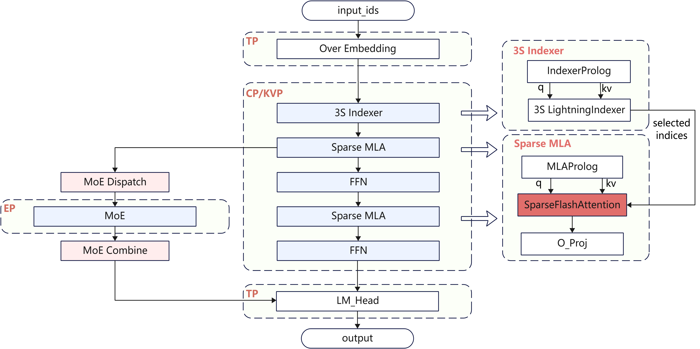
</p>

> 注：受篇幅所限，图片对模型信息和计算流程做了适当简化。


LongCat-2.0的MoE部分模块参数详见下表，总共包括768个路由专家和128个零专家，每个`token`每次激活12个专家，其中平均8个路由专家，4个零专家。本次开源的LongCat-2.0实践，MOE和MLP部分原生使用Int8量化，相较Bfloat16格式有效降低模型存储开销，并提升计算效率。


|模块|专家数量|Intermediate Size|单专家激活参数量|BF16权重大小|Int8权重大小|单Token激活权重大小|
|----|-------|-----------------|---------------|-----------|-----------|--------------|
|MLP|1|12288|288M|42.8GB|21.4GB|21.3GB|
|MOE|768|2048|48M|2.67TB|1.34TB|14.3GB|


### Attention 稀疏与滑窗

- LongCat-2.0模型使能了[DSA稀疏结构](./../deepseek-v3.2-exp/deepseek_v3.2_exp_inference_guide.md)，在Attention计算之前，使用Lightning Indexer为每个`token`选择 `topk=2048`组KV，极大节约了Attention计算耗时。在SC MOE结构下，每层的两个Sparse Flash Attention (SFA)共用一组`topk_indices`。参照[DSA计算量分析](./../deepseek-v3.2-exp/deepseek_v3.2_exp_inference_guide.md#deepseek-v32-exp-vs-v31)分析，本次开源的实践样例的Prefill和Decode都使用了`absorb`模式，亲和DSA的性能。
- 在DSA基础上，LongCat-2.0模型额外叠加了Sink Sliding Window(3S)设计，在预留的 `topk=2048`组KV里，固定选择每段请求的`init 16`（序列维度最前面的16组KV，对应`sink`）和`local 1024`（序列维度最后面的1024组KV，对应`sliding_window`），再从中段选择`top 1008`组KV，进一步提升模型能力。3S LI对KV Pair的筛选方式如下图示例。

<p align="center">
  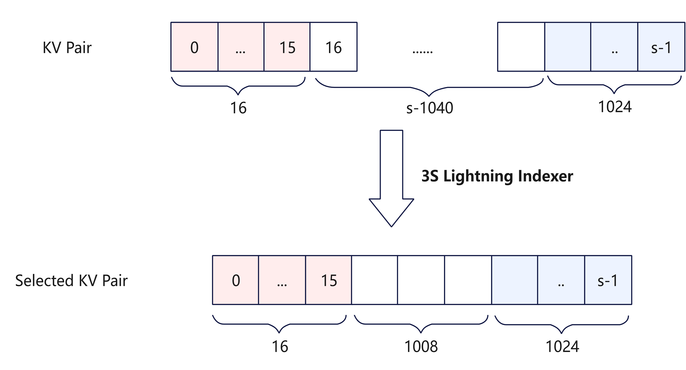
</p>


### Over Embedding

LongCat-2.0模型支持了基于[美团技术报告](https://huggingface.co/meituan-longcat/LongCat-Flash-Lite/blob/main/tech_report.pdf)的Over Embedding实现，可以通过在推理开始时的Embedding计算环节小幅增加计算量，得到模型效果的提升。OE计算的步骤如下图所示。


<p align="center">
  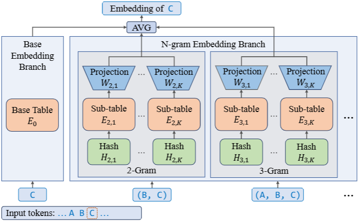
</p>

每个`token`与前序`oe_n - 1`个`token`计算，得到`(oe_n - 1)`个带有前序Token信息的`n-gram`，再对它们分别进行Ngram Embedding计算。Ngram Embedding的计算过程被拆解为`oe_k`张子表，每张子表对应自己的Embedding和Projection，用增加子表个数的方式减少不同`n-gram`映射到词表同一行的概率，并提升`n-gram`表达的自由度。从计算流的视角来看，OE计算为`oe_k`张子表，将每个`token`与前序`oe_n - 1`个`token`通过哈希计算，得到`(oe_n - 1) * oe_k`个`oe_token`，再对`oe_token`做OE Embedding和OE Projection计算。最后将得到的`oe_hidden_states`与原始Embedding计算的`hidden_states`加权平均，做为后续Layer计算的输入。计算步骤可参考下方公式。
$$
e_i =\frac{1}{(N-1)K + 1}\left(E_0(t_i)+\sum_{n=2}^{N}\sum_{k=1}^{K}W_{n,k}E_{n,k}\left(H_{n,k}(t_{i-n+1}, \ldots, t_i)\right)\right)
$$


Ngram的哈希计算参考下方公式，其中$\mathrm{t_i}$指代Token, $\mathrm{V}$指代哈希参数。
$$ \mathrm{H_{nk}} = (\mathrm{\sum_{j=0}^{n-1}} \mathrm{t_{i-j}} * \mathrm{V_{k}^j} ) \% \mathrm{V_n} $$


### MTP投机推理

LongCat-2.0依然提供了原生的Multi-Token Prediction(MTP)机制。MTP机制允许在一次主模型推理过程中同时计算验证多个Token，在未达到计算瓶颈前，可以通过较少的时延增加，有机会获得更多的输出Token，从而降低单Token的平均推理耗时。LongCat-2.0由于采用了新的3S DSA结构，MTP加速相对于LongCat-Flash会更复杂。

- Full Attention场景下，开启MTP几乎不会增加MLA的KV Cache的搬运量，因此MTP能够提高计算访存比，从而提高算力利用率。而对于Sparse Flash Attention算子，每个`q_token`都会选择`topk=2048`组KV，极端情况下`mtp_token`选择的KV与`main_token`不重合，反而增加了离散访存的代价。

- 在长序列场景中Lightning Indexer算子耗时长于SFA算子，其需要的K Cache搬运与稠密MLA相似，可以利用MTP机制提高计算访存比。同时由于DSA稀疏计算显著降低了长序列Attention的计算量，而剩下的算子（如Matmul等）都能在使能MTP后达到更好的计算访存比，因此使用MTP对整个推理有比较可观的加速。

- 本次开源的实践支持了MTP 3，在每次推理Step，MTP模型额外推理三次，有效降低平均每Token的推理时延。


## 融合算子


### Attention

如下图所示,DSA的计算过程可分为MLAProlog、IndexerProlog、Lightning Indexer、Sparse Flash Attention、MLAEpilog五部分。

<p align="center">
  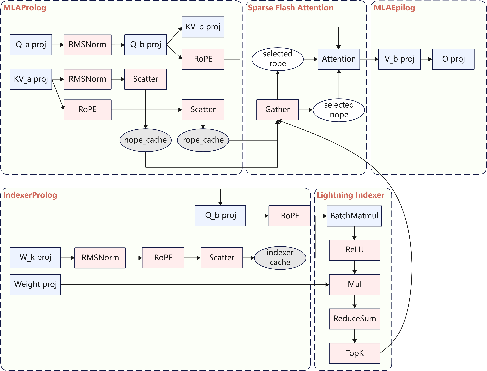
</p>

> 注：受篇幅所限，图片对模型信息做了适当简化，没有体现MLP/MOE和第二组Attention计算。

- Lightning Indexer：包含Score Batchmatmul、ReLU、ReduceSum、TopK等操作，长序列场景TopK操作会成为瓶颈，可用TopK计算耗时流水掩盖掉其他操作的耗时，从而拿到计算流水收益
- Sparse Flash Attention：包含了从完整KVCache里选取TopK相关Token，及计算稀疏Flash Attention操作。此处的耗时瓶颈点主要在于离散聚合访存，可用此耗时掩盖其他操作的耗时，流水并行加速
- MLAProlog和IndexerProlog：包含Q/KV的LoRA、RoPE、Norm、KVCache更新等操作，存在较多Cube/Vector并行的流水空间
- MLAEpilog：包含O_proj及V升维操作

本次开源的样例里，MLAProlog、Lightning Indexer和Sparse Flash Attention使用了NPU融合算子实现，提升计算性能。相关算子已在CANN/ops-transformer仓开源[**lightning_indexer**](https://gitcode.com/cann/ops-transformer/tree/master/attention/lightning_indexer)和量化版本[**quant_lightning_indexer**](https://gitcode.com/cann/ops-transformer/tree/master/attention/quant_lightning_indexer)，以及[**sparse_flash_attention**](https://gitcode.com/cann/ops-transformer/tree/master/attention/sparse_flash_attention)和量化版本[**kv_quant_sparse_flash_attention**](https://gitcode.com/cann/ops-transformer/tree/master/attention/kv_quant_sparse_flash_attention)。


### MOE

针对LongCat系列网络MOE部分包括特殊的零专家这一特点，Decode使用的[**moe_distribute_combine**](https://gitcode.com/cann/ops-transformer/blob/9.0.0/mc2/moe_distribute_combine_v2/docs/aclnnMoeDistributeCombineV3.md)算子支持了零专家功能，可以用融合算子内部流水掩盖零专家计算耗时，提升MOE性能。


### Over Embedding

本次开源的实践针对LongCat-2.0的Over Embedding功能实现了两个融合算子，提升关键步骤的计算效率。

- Update Token Table：Over Embedding功能需要将当前`token`与前序`token`做哈希计算，为了使得Decode阶段可以快速获取历史`token`信息，所有历史`token`都维护在一个Token Table数据结构内。当新请求输入、有新`token`被推导或者接受时，需要将新的`token`信息刷入Token Table。针对多请求场景下的离散刷新动作，本次实践实现了`update_token_table`算子，可以高效将属于多请求的`token`按照指定位置写入Token Table。
- Compute N-Gram Ids：在每个Step内的Embedding计算环节，针对`oe_k`张子表，需要为每个`token`与前序`(oe_n - 1)`个`token`进行哈希计算，生成新的`oe_token`，即为每个`token`生成`(oe_n - 1) * oe_k`个`oe_token`，做为后续OE Embedding计算的输入。本次实践实现的`compute_n_gram_ids`算子实现了生成`oe_token`的动作。计算流程可参考[oe并行](#over-embedding)

相关算子实现已在[LongCat-2.0 NPU Inference](./../../../models/longcat-2.0/README.md)开源。


## 部署策略

本次开源的是一个PD分离的服务化框架样例，Prefill采用64卡Atlas A2部署，Decode采用128卡Atlas A2部署。


### Prefill

LongCat-2.0模型有多达1.6T参数，推理显存占用超过2TB，且通过3S DSA等结构的使能支持1M长序列请求，Prefill阶段设备内存OOM风险较高，而且推理服务部署时TTFT也会面临巨大的挑战，因此优化内存占用和TTFT是并行策略设计的主要目的。为此本次开源的实践做了Context Parallel Pipeline部署，将64卡Atlas A2分隔成`m` x `n`组卡，在`m`维度做Pipeline并行，在`n`维度做Context Parallel (CP)并行。

<p align="center">
  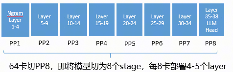
</p>

Pipeline并行如上图示例，将模型按照Layer切分并行。

<p align="center">
  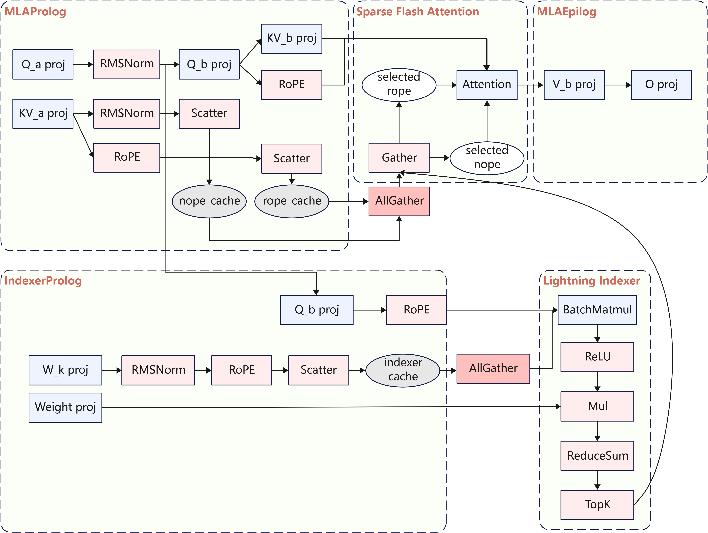
</p>

> 注：受篇幅所限，图片对模型信息做了适当简化，没有体现MLP/MOE和第二组Attention计算。

CP并行如上图所示，对输入请求按照序列维度并行切分。在做Indexer和SFA计算前，需要分别对Indexer Key Cache和KV Cache做`all_gather`通信。进行LI和SFA计算时，每个`rank`有部分`q`和完整Cache。

#### MLA Naive Vs Absorb

在Prefill阶段，以1 Batch 64K推理为例，Lightning Indexer为每个`q_token`选择TopK=2048个`kv_token`，MLA的计算流程可以有三种选择：

  **方案一：** MLA Naive + Sparse Mask，Prefill MLA使用Naive模式。每个`q_token`和所有的历史`kv_token`计算Attention，仅在`softmax`前通过Attention Mask将不属于TopK的`token`过滤掉。Attention中的两个`batch_matmul`的Shape如下：

  |   方案一    | Batch |  M   |  K   |  N   |
  | :---------: | :---: | :--: | :--: | :--: |
  | BMM1(Q*K^T) | 1*128 | 64K  | 192  | 64K  |
  |  BMM2(P*V)  | 1*128 | 64K  | 64K  | 128  |

  该方案计算量和原始的Full Attention一致，但是无法拿到DSA的稀疏计算收益，长序列场景下性能不佳。

  **方案二：** MLA Naive + Sparse Attention，Prefill MLA使用Naive模式，每个`q_token`与TopK=2048个`kv_token`计算Attention。因为每个`q_token`独立选择自己要进行计算的2048组KV，所以序列长度64k要外提到Batch轴，M轴大小为1。

  |   方案二    |   Batch    |  M   |  K   |  N   |
  | :---------: | :--------: | :--: | :--: | :--: |
  | BMM1(Q*K^T) | 1\*64K*128 |  1   | 192  | 2048 |
  |  BMM2(P*V)  | 1\*64K*128 |  1   | 2048 | 128  |

  方案二的优点在于BMM的计算量较小，相对原始的Full Attention计算量降为2048/64K=1/32，但是存在以下问题：

  - BMM的M轴为1，矩阵乘法计算效率较低。
  - BMM对kv的HBM访存量相较原始的Full Attention激增`topk=2048`倍，将会面临访存瓶颈。

  **方案三：** MLA Absorb + Sparse Attention，Prefill MLA使用Absorb模式，与Decode保持一致。同样地，每个`q_token`与TopK=2048个`kv_token`计算Attention。

  |   方案三    | Batch  |  M   |  K   |  N   |
  | :---------: | :----: | :--: | :--: | :--: |
  | BMM1(Q*K^T) | 1\*64K | 128  | 576  | 2048 |
  |  BMM2(P*V)  | 1\*64K | 128  | 2048 | 512  |

  方案三与方案二对比如下：

  - 方案三的计算量增加了3倍左右，体现在BMM1的K轴和BMM2的N轴。但其BMM的M轴为128，对于矩阵乘法更为友好。

  - 方案三享受Absorb模式本身相对于Naive模式的访存量下降，KV的HBM访存量相对方案二降低几十倍，耗时更低。


综合考虑计算和访存耗时，以及长序列应用场景，本实践选择基于方案三(MLA Absorb + Sparse Attention)来完成Prefill部署，从而Prefill和Decode的MLA计算流可以归一。


### Decode

LongCat-2.0的3S DSA使用Lightning Indexer为每个`token`选择 `topk=2048`组KV，使得后续SFA的计算不再成为瓶颈。长序列场景下，Lightning Indexer(LI)算子成为新的计算瓶颈。在Decode的DP背景下，实际业务场景里不同请求的序列长度不一样，需要再对KV做并行切分，才能有效针对LI计算实现Rank间的负载均衡。为此本次开源的实践做了KV Parallel部署，将不同请求的Indexer Key Cache和KV Cache存放在不同`rank`，每个`rank`用完整的`q`与部分Cache进行计算，再通过`all_gather`汇总计算结果，完整计算流程如下图所示。

<p align="center">
  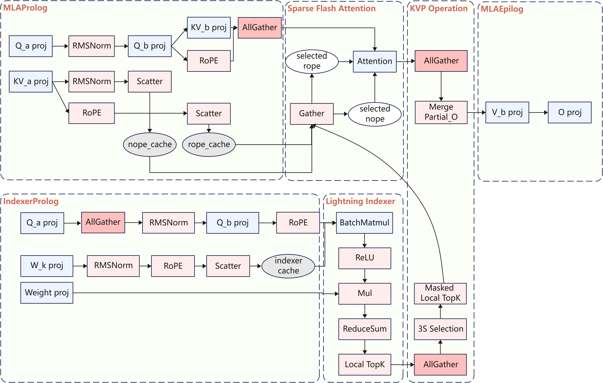
</p>

> 注：受篇幅所限，图片对模型信息做了适当简化，没有体现MLP/MOE和第二组Attention计算。


### MOE

考虑到Atlas A2集群节点内通信带宽高于节点间带宽，本次实践对传统的Attention DP - AllToAll - MOE EP - AllToAll方案进行了针对性优化，将节点间低带宽通信的范围限制在进行`topk=12`扩展前的原始Token（模型此处每个Token对应一个`hidden_states`，本节使用Token指代）。新方案步骤如下。
- 在进行MOE计算前，在不同节点间，`local_rank_id`相同的卡间做`all_gather`汇集Token，使得每个节点内都有全部的Token。
- 对汇集后的Token做`topk_gating`后，再在各自节点内做EP域的`all_to_all`通信和专家计算。每个节点内只有局部的专家。
- 在MOE计算完成后，在不同节点间，`local_rank_id`相同的卡间做`reduce_scatter`，汇聚不同节点的专家信息，并返还各自Token。

假设4个Rank共同组成一个完整的EP域，每个Rank部署一个专家。`rank_1`和`rank_2`在一个节点内，`rank_3`和`rank_4`在一个另一个节点，通信、计算流程如下图示例。
<p align="center">
  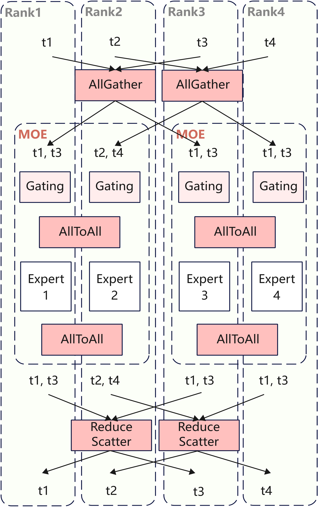
</p>

> 注：受篇幅所限，图片对模型信息和计算流程做了适当简化。


### Over Embedding

为了节省Over Embedding Table的内存占用，Over Embedding计算使用TP并行，其余计算不做并行。因此，需要在通过`compute_n_gram_ids`算子得到`oe_token`后，做`all_gather`通信汇总各个DP Rank的`oe_token`。因为Over Embedding权重切了TP份，所以在完成Over Embedding计算后，需要对`oe_hidden_states`做`reduce_scatter`汇总Over Embedding信息、并还原请求的DP分布。

以`oe_n=5`，`oe_k=4`，`n_gram=(oe_n - 1) * oe_k=16`为例，计算流如下图所示。
<p align="center">
  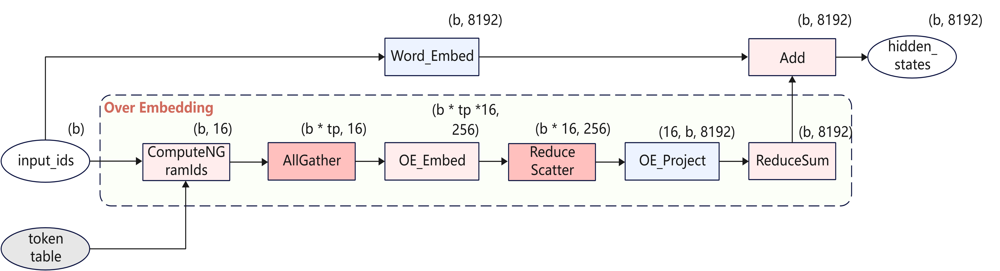
</p>


## 性能优化


### 使能图模式
通过在进行`torch.compile`时指定`backend`使用静态图`ge_graph`可以削减Decode阶段的算子下发开销，获得更好的推理性能。GE是CANN平台的图模式实现，对标的是Torch-TensorRT，其核心优势在于对静态计算图的编译优化。即代码不会立即执行，而是先将所有计算步骤（操作、变量依赖）定义为一个“静态的计算图”（类似流程图），然后由框架对整个图进行优化（如算子融合、内存规划），最后再将优化后的图提交给NPU执行。


#### 使能图编译缓存
`torch.compile`是一种即时编译器（Just-In-Time compiler），成图首次编译时间通常较长，在时延敏感的模型推理场景下，使能图编译缓存可以缓存编译后的静态图，有效缩短服务启动后的首次推理时延，从而提高推理性能。可参考下方示例，配置完缓存路径后，下次编译时会默认从配置路径下加载，无额外调用动作。

```python
if self.enable_cache_compile:
    case_name = "compile_cache/" + os.getenv("CASE_NAME")
    cache_model = self.model.decode
    if self.is_mtp:
        case_name += "_spec"
        cache_model = self.model.mtp_compile_decode
    cache_dir = os.path.join(os.path.dirname(os.path.abspath(__file__)), case_name)
    self.model.decode = tng.inference.cache_compile(cache_model, cache_dir=cache_dir,
                        config=compiler_config, dynamic=False, fullgraph=True, ge_cache=True)
```
主模型缓存默认路径为`./compile_cache/CASE_NAME`，mtp模型缓存默认路径为`./compile_cache/CASE_NAME_spec`。


### 多流并行与控核
大模型推理场景下，对于一些可并行的场景，可以划分多个stream做并行计算，多个stream上的计算形成overlap，从而降低整体计算耗时。多流并行技术的详细介绍，请参考[官方文档](https://www.hiascend.com/document/detail/zh/Pytorch/720/modthirdparty/torchairuseguide/torchair_00026.html)

多流场景下，会出现所有核（Core）都被一个流占用的情况，导致算子执行并行度降低，因此需要把核分给不同的流用，从而保证算子并行执行的收益。控核技术的详细介绍，请参考[官方文档](https://www.hiascend.com/document/detail/zh/Pytorch/720/modthirdparty/torchairuseguide/torchair_00044.html)

原始的[LongCat-Flash模型](https://arxiv.org/pdf/2509.01322)在论文中提供了四阶段的并行策略，其方案图如下所示。

<div align="center">
    
</div>

我们对并行策略进行了调整，调整后的多流并行和控核方案图如下所示。将第二段Attention和FFN专家提前执行，并通过控制多流上的Cube核和Vector核数量，使得双流的计算时间接近，无明显拖尾，提升性能。其中Stage1不做控核，默认占用全部的Cube核和Vector核，Stage2里的`stream0`和`stream1`都采用`c12v24`控核方案。

<div align="center">
    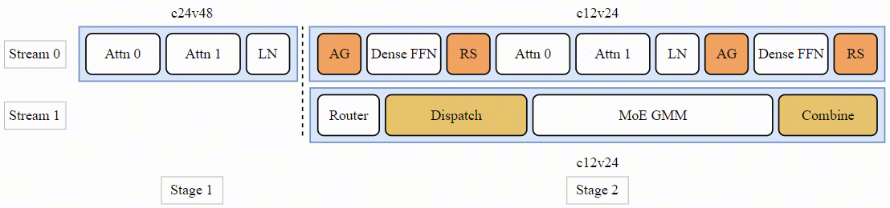
</div>

实现多流并行和控核可以参考以下伪代码。
```python
attn
layernorm
with npu_stream_switch(True, "1"):
    with limit_core_num(True, "12", "24"):
        router
        dispatch
        gmm
        combine
with limit_core_num(True, "12", "24"):
    dense
    attn
    layernorm
    dense
```


### 权重预取
该优化提供网络Weight预取功能，在前序算子计算的同时，利用空闲的带宽，提前将一些访存Bound算子的权重从HBM搬运到L2 Cache中，提升算子性能。`npu_prefetch`技术的详细介绍，请参考[官方文档](https://www.hiascend.com/document/detail/zh/Pytorch/730/apiref/torchnpuCustomsapi/docs/context/torch_npu-npu_prefetch.md)。

以下图为例，Matmul的权重有20 MB，前序的算子RmsNorm对内存带宽的需求较小，执行时间为10us，此时可以通过预取技术，将Matmul的权重提前写入到L2 Cache中，理想情况下，最大可预取的大小为 `HBM_bandwidth * time_available`，实际可预取大小因网络与前序算子对带宽的占用程度而异。假设此时可预取的大小为10 MB，与RmsNorm并行执行，则在Matmul算子执行时，只需要再额外读10 MB权重，访存的耗时开销减少明显。
<div align="center">
    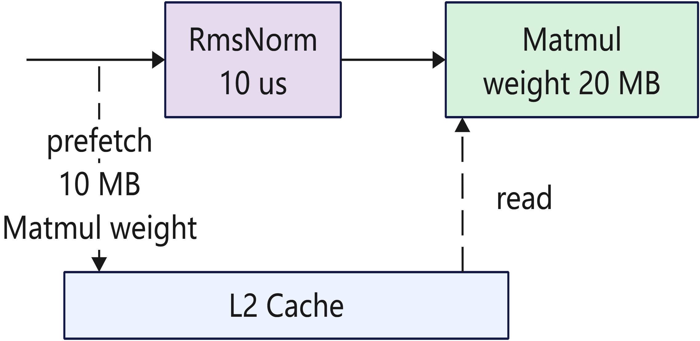
</div>

可以通过Profiling分析预取的大小和位置是否合理.如果与预取并行的算子性能有明显劣化，则需要进一步调整预取的位置（可以将预取的位置提前开始，或与劣化算子错开），如没有可调整的位置，则需要减少预取的大小使得并行算子尽量不劣化。如果想要获取最大化的预取收益，可以通过实验对比调整。如果前序算子是访存密集型，如Matmul等，则不适合并行，避免带宽抢占导致劣化。

预取分析和调试的通用流程如下：

<div align="center">

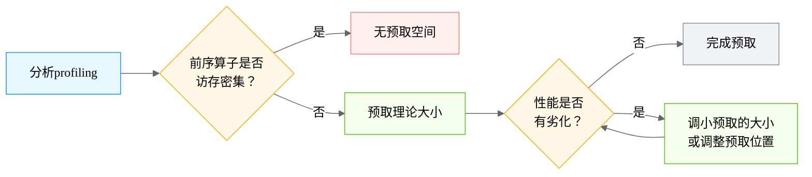

</div>

> 注：各模型的预取情况可能有所不同，可按需调整上述流程。


## Future Plan


- [**KV Offload**](./../deepseek_v3_2_exp/deepseek_v3.2_exp_inference_guide.md#kvcache-offload)： 通过将KV Cache部分存储在CPU，释放NPU内存压力，轻松支持长序列推理。
- [**SuperKernel**](https://www.hiascend.com/document/detail/zh/CANNCommunityEdition/850alpha001/opdevg/Ascendcopdevg/atlas_ascendc_10_00029.html)：使能Super Kernel进一步降低算子启动开销与调度间隙，提升计算执行效率。