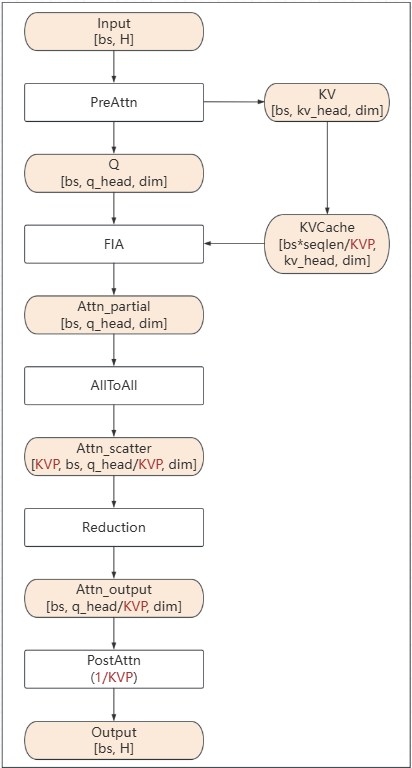
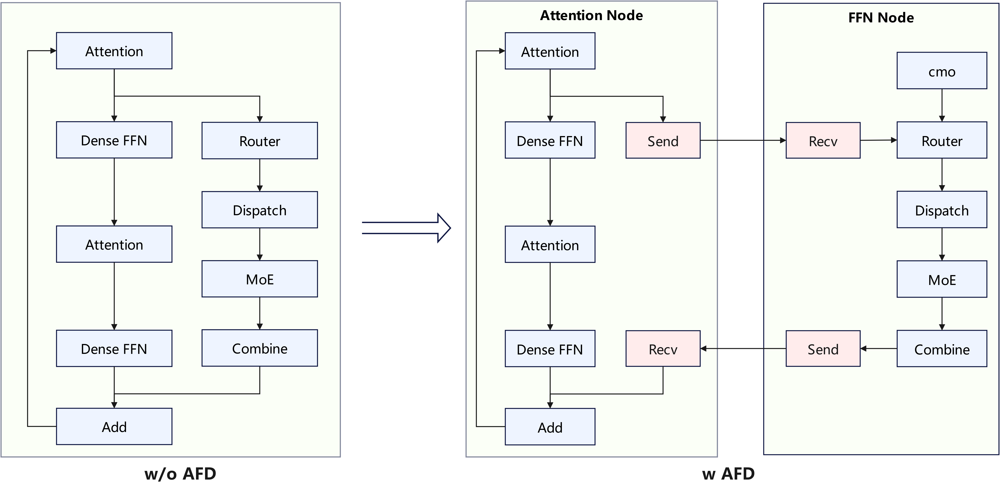
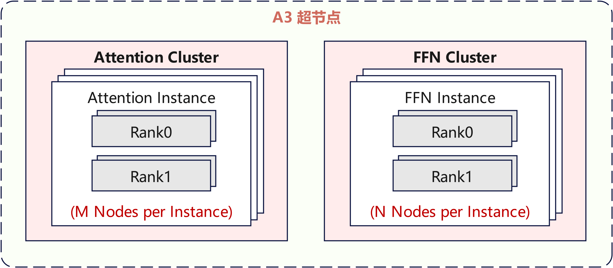
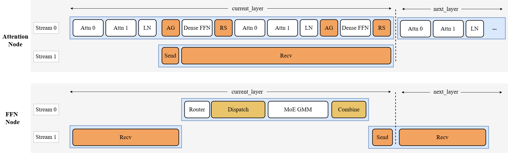
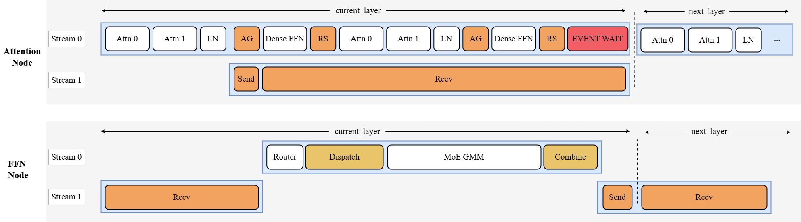
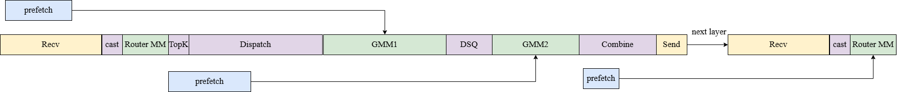

# 基于Atlas A3集群的LongCat-Flash模型推理性能优化实践
## 概述
本文主要介绍基于Atlas A3系列产品的LongCat-Flash模型的优化方式。

## 性能优化

### 通用优化
LongCat-Flash结构中的与Llama类似的部分，可参考通用优化点[Llama](https://gitcode.com/Ascend/torchair/tree/master/npu_tuned_model/llm/llama)的改动，如固定KV Cache大小、cos/sin优化、AddRMSNorm融合等。

### 使能图模式
使用静态图可以获得更好的推理性能。`LongcatFlashRunner`通过覆写`executor/model_runner.py`中的`ModelRunner`的`graph_compile`函数，将模型编译为静态图，当前暂不支持acl_graph。

#### 使能图编译缓存
torch.compile是一种即时编译器（Just-In-Time compiler），成图首次编译时间通常较长，在时延敏感的模型推理场景下，使能图编译缓存可以缓存编译后的静态图，有效缩短服务启动后的首次推理时延，从而提高推理性能。可参考`LongcatFlashRunner`中`graph_compile`函数中的使用：

```python
if self.enable_cache_compile:
    case_name = "compile_cache/" + os.getenv("CASE_NAME")
    cache_model = self.model.decode
    if self.is_mtp:
        case_name += "_spec"
        cache_model = self.model.mtp_compile_decode
    cache_dir = os.path.join(os.path.dirname(os.path.abspath(__file__)), case_name)
    self.model.decode = tng.inference.cache_compile(cache_model, cache_dir=cache_dir,
                        config=compiler_config, dynamic=False, fullgraph=True, ge_cache=True)
```
主模型缓存默认路径为`./compile_cache/CASE_NAME`，mtp模型缓存默认路径为`./compile_cache/CASE_NAME_spec`。

### 多流并行与控核
大模型推理场景下，对于一些可并行的场景，可以划分多个stream做并行计算，多个stream上的计算形成overlap，从而降低整体计算耗时。多流并行技术的详细介绍，请参考[官方文档](https://www.hiascend.com/document/detail/zh/Pytorch/720/modthirdparty/torchairuseguide/torchair_00026.html)

多流场景下，会出现所有核（Core）都被一个流占用的情况，导致算子执行并行度降低，因此需要把核分给不同的流用，从而保证算子并行执行的收益。控核技术的详细介绍，请参考[官方文档](https://www.hiascend.com/document/detail/zh/Pytorch/720/modthirdparty/torchairuseguide/torchair_00044.html)

原始的[LongCat-Flash模型](https://arxiv.org/pdf/2509.01322)在论文中提供了四阶段的并行策略，其方案图如下所示。

<div align="center">
    
</div>

我们对并行策略进行了调整，调整后的多流并行和控核方案图如下所示。将第二段attention和FFN专家提前执行，并通过控制多流上的ai core和vector core核数，使得双流的计算时间接近，无明显拖尾，提升性能。其中stage1不做控核，默认占用全部的ai core和vector core核数，stage2里的stream0采用c16v32控核方案，stream1采用c8v16。

<div align="center">
    
</div>

实现多流并行和控核可以参考以下伪代码。
```python
attn
layernorm
with npu_stream_switch(True, "1"):
    with limit_core_num(True, "8", "16"):
        router
        dispatch
        gmm
        combine
with limit_core_num(True, "16", "32"):
    dense
    attn
    layernorm
    dense
```


### 权重预取
该优化提供网络weight预取功能，在算子计算的同时，利用空闲的带宽，提前将一些访存bound算子的权重搬运到L2 Cache中，提升算子性能。npu_prefetch技术的详细介绍，请参考[官方文档](https://www.hiascend.com/document/detail/zh/Pytorch/720/apiref/torchnpuCustomsapi/context/torch_npu-npu_prefetch.md)。npu_prefetch优化功能可通过`enable_prefetch`开关使能。下图为LongCat-Flash模型的预取位置。我们针对访存bound的算子如QuantBatchMatmul (QBMM)、MLA_Prolog、matmul等算子提前预取了对应的权重。其中MLA_Prolog算子包含了多个matmul，搬运bound较大，因此我们提前预取了前置的QBMM的权重，为MLA_Prolog提供了更大的预取空间，获取较大的性能收益。具体的预取大小及预取位置，可在`models/modeling_longcat_flash.py`中搜索`npu_prefetch`接口查看。

<div align="center">
    
</div>


### 使能SuperKernel
SuperKernel优化功能在decode启用`ge_graph`图模式的场景下，根据用户定义的范围对模型的计算图进行优化。SuperKernel技术的详细介绍，请参考[官方文档](https://www.hiascend.com/document/detail/zh/Pytorch/710/modthirdparty/torchairuseguide/torchair_00035.html)。SuperKernel优化功能将通过`enable_superkernel`开关使能，可将部分算子优化在一个SuperKernel scope内，从而实现对任务调度的等待时间和调度开销的优化，提升整体性能。由于我们在不同流上采取了不同的分核策略，按照分核、分流的范围标定各SuperKernel scope的范围即可。下图为针对Longcat-Flash模型标定的SuperKernel范围。

<div align="center">
    
</div>


### MLA (Multi-Head Latent Attention)低秩压缩优化
Decode阶段参考[Deepseek论文](https://arxiv.org/pdf/2405.04434)中提及的低秩压缩方法，可以减少KV Cache占用的内存，提升推理效率，相关实现可以参考`LongcatFlashAttention`类中的 `forward_page_attention_absorb`函数。MLA整体采用Data Parallelism (DP) 数据并行，并针对o_proj matmul单独采用Tensor Parallelism (TP)切分提升性能。

#### 融合算子优化
- MLA前置计算性能优化：使能[npu_mla_prolog_v3]融合kernel，替换attention计算前的计算，其中包含Q、K、V的线性层计算、旋转位置编码 (ROPE)、RmsNorm计算及KV Cache更新等计算处理；
- Attention性能优化：使能[npu_fused_infer_attention_score](https://www.hiascend.com/document/detail/zh/Pytorch/720/apiref/torchnpuCustomsapi/context/torch_npu-npu_fused_infer_attention_score.md)融合kernel，实现对MLA计算的加速。

#### o_proj Tensor Parallelism K轴切分
对线性层o_proj进行行切分处理，o_proj的输入维度为`num_heads * v_head_dim`，输出维度为`hidden_size`。在进行o_proj TP时，将这一输入维度按照`o_proj_tp_size`进行切分，要求`num_heads * v_head_dim`能被`o_proj_tp_size`整除，每个rank上只保存一部分输入通道对应的权重。在推理过程中，`attn_output`先经过`all_to_all`，使得每个rank只拿到自己负责的那一段输入特征，然后每个rank对局部张量执行线性层变换，得到局部输出，最后通过`reduce_scatter`对各rank的局部输出按元素求和，并在batch维度切分，得到各rank的输出。

<div align="center">
    
</div>

### MLA (Multi-Head Latent Attention) KVP切分优化
- KVP特性旨在面向长序列推理场景，通过将KV Cache沿S维度切分到多个rank上，缓解单rank的KV Cache访存压力，从而降低时延。KVP特性暂未支持Multi-Token Prediction投机推理。
- Prefill阶段使能KVP切分优化，将根据`kvp_size`和`kvp_rank`对slot_mapping进行切分，并将slot_mapping作为`npu_kv_rmsnorm_rope_cache`算子的index参数，将完整的KV Cache分片轮转写入到各个kvp_rank上，每个kvp_rank上存储`1/kvp_size`长度的KV Cache；此外，Prefill阶段在计算Attention时复用了`kvp_size`，同时约束`attn_tp_size = 1`，对`npu_fused_infer_attention_score`算子的输入Q、K、V按头维度进行TP切分。
- Decode阶段使能KVP切分优化，启用`npu_fused_infer_attention_score`算子的`softmax_lse_flag`功能，输入Q、K、V头维度保持完整，与各个`kvp_rank`上存储的部分KV Cache进行Attention计算，并输出相应的softmax lse，每个`kvp_rank`拿到完整`num_heads_per_rank`个Q head对部分KV Cache的计算结果`attn_partial`和`lse_partial`；通过`_all_to_all_along_headdim`从各个`kvp_rank`拿到`kvp_size`份`num_heads_per_rank // kvp_size`个Q head对各个部分KV Cache的计算结果`attn_scatter`和`lse_scatter`，并通过`npu_attention_update`算子对`attn_scatter`和`lse_scatter`执行归约操作。Decode阶段`actual_seq_lengths_kv`表示当前`kvp_rank`实际存储的KV Cache长度，因此需要根据`kvp_size`和`kvp_rank`进行调整。
- 使能KVP特性的场景下（`kvp_size > 1`）新增了`o_proj_tp_size = kvp_size`约束，在`o_proj_forward`中配合执行o_proj TP切分并后续执行`all_reduce`通信。

<div align="center">
    
</div>


### MoE (Mixture of Experts)模块实现Expert Parallel (EP)及使能融合算子
MoE计算阶段采用EP (Expert Parallelism)切分策略，将路由专家和零计算专家均匀分布到每张卡上。

#### Router使能融合算子
使用[torch_npu.npu_moe_gating_top_k](https://www.hiascend.com/document/detail/zh/Pytorch/720/apiref/torchnpuCustomsapi/context/torch_npu-npu_moe_gating_top_k.md)算子，对router计算的结果排序，并选取前top-k个专家。

#### Prefill阶段优化
Prefill阶段路由专家采用**Double-Routing**的计算策略完成计算,具体计算步骤可参见[基于Atlas A3集群的DeepSeek-R1模型prefill阶段推理性能优化实践](../deepseek-r1/deepseek_r1_prefill_optimization.md)的MoE部署策略优化章节。

#### Decode阶段优化
- 高性能专家计算：使用[torch_npu.npu_grouped_matmul](https://www.hiascend.com/document/detail/zh/Pytorch/720/apiref/torchnpuCustomsapi/context/torch_npu-npu_grouped_matmul.md)算子，可以同时处理多个专家的计算，提高计算和搬运效率；
- 多卡间高性能通信路由：使能[torch_npu.npu_moe_distribute_dispatch_v2](https://www.hiascend.com/document/detail/zh/Pytorch/720/apiref/torchnpuCustomsapi/context/torch_npu-npu_moe_distribute_dispatch_v2.md) 和[torch_npu.npu_moe_distribute_combine_v2](https://www.hiascend.com/document/detail/zh/Pytorch/720/apiref/torchnpuCustomsapi/context/torch_npu-npu_moe_distribute_combine_v2.md)算子，实现EP并行下多卡间的通信。通过传入参数`copy_expert_num`使能dispatch_v2和combine_v2算子支持零专家处理，计算公式为：`MoE(ori_x) = ori_x`。在使用前可参考上述的算子文档，检查`HCCL_BUFFSIZE`等环境变量的配置是否合理，了解该算子的使用场景和约束。

### MLP线性层优化
#### MLP线性层计算合并
原始`LongCatFlashMLP`实现中，存在`gate_proj`、`up_proj`与`down_proj`三个matmul运算，可通过将`gate_proj`与`up_proj`进行合并计算，得到`gate_up_proj`提升整体计算效率。

#### MLP线性层TP切分
在MLP的计算中，`gate_up_proj`和`down_proj`需要全量存储到每一个device上，造成device内存压力，本优化将`gate_up_proj`沿N轴切分、`down_proj`沿K轴切分到`dense_tp`域内的不同device上，以完成MLP线性层的TP切分，降低单个device的内存使用，并减少matmul矩阵运算时的权重搬运开销。需要注意的是，MLP阶段采用TP切分，但前后的Attention模块采用的是DP切分，在MLP计算之前和之后需要分别进行AllGather和ReduceScatter，完成DP -> TP -> DP的并行方式转化。虽然有额外的通信开销，但整体仍有较好的性能收益。在当前的优化实践中，Dense FFN专家采用TP8切分。

<div align="center">
    
</div>

### 支持Multi-Token Prediction (MTP)
实现了MTP投机推理，在未达到计算bound的场景下，MTP计算可以实现较好的推理加速效果。可通过`next_n`参数使能MTP。当前支持了MTP1，MTP2。

### Attention-FFN Disaggregation(AFD)优化
#### 优化出发点
在非分离场景中，Attention 模块和 MoE 模块部署在同一个卡上，由于 ScMoE 结构的固有特性，为了获取最佳的性能，在 [多流并行与控核](###多流并行与控核) 小节中对 Stage2 设计了多流并行策略，通过分配不同的核数将 Attention 计算流和 MoE 计算流进行了并行流水，达到最佳性能。

然而，对 Stage2 通过控核后，由于两条计算流在计算时只能使用部分 Cube 和 Vector 核，算子执行时会受到算力的约束。在 Atlas A3 环境上实测对比发现，在不控核情况下，MLA_Prolog/FA/MM/TBMM/QBMM算子耗时相比控核时均有所下降，耗时对比如下表格。
<table style="width:99%; border-collapse:collapse; margin:20px 0;">
    <tr>
        <th style="border:1px solid #ddd; padding:10px; text-align:center;"> Cube_Vector核数</th>
        <th style="border:1px solid #ddd; padding:10px; text-align:center;">MLA_Prolog（us）</th>
        <th style="border:1px solid #ddd; padding:10px; text-align:center;">FA（us）</th>
        <th style="border:1px solid #ddd; padding:10px; text-align:center;">MM（us）</th>
        <th style="border:1px solid #ddd; padding:10px; text-align:center;">TBMM（us）</th>
        <th style="border:1px solid #ddd; padding:10px; text-align:center;">QBMM1（us）</th>
        <th style="border:1px solid #ddd; padding:10px; text-align:center;">QBMM2（us）</th>
    </tr>
    <tr>
        <td style="border:1px solid #ddd; padding:10px; text-align:center;">12C_24V</td>
        <td style="border:1px solid #ddd; padding:10px; text-align:center;">68.1</td>
        <td style="border:1px solid #ddd; padding:10px; text-align:center;">118</td>
        <td style="border:1px solid #ddd; padding:10px; text-align:center;">18</td>
        <td style="border:1px solid #ddd; padding:10px; text-align:center;">19.6</td>
        <td style="border:1px solid #ddd; padding:10px; text-align:center;">18.7</td>
        <td style="border:1px solid #ddd; padding:10px; text-align:center;">20.1</td>
    </tr>
    <tr>
        <td style="border:1px solid #ddd; padding:10px; text-align:center;">24C_48V</td>
        <td style="border:1px solid #ddd; padding:10px; text-align:center;">45.2</td>
        <td style="border:1px solid #ddd; padding:10px; text-align:center;">91.8</td>
        <td style="border:1px solid #ddd; padding:10px; text-align:center;">14.2</td>
        <td style="border:1px solid #ddd; padding:10px; text-align:center;">12.5</td>
        <td style="border:1px solid #ddd; padding:10px; text-align:center;">14.6</td>
        <td style="border:1px solid #ddd; padding:10px; text-align:center;">16.3</td>
    </tr>
</table>

> 以上数据除了核数不同，其他都在相同的配置情况下从整网中采集拆解得到的。

根据以上分析，针对 LongCat-Flash-560B 模型，为了在 Decode 阶段进一步降低 TPOT 耗时，可采用 Attention-FFN Disaggretation(AFD) 技术方案，它将 MoE 模块从整网中剥离出来进行独立部署，也即 Attention 模块 和 MoE 模块单独部署在不同的节点上，中间通过 Send/Recv 算子进行节点间的数据交互，使能 AFD 技术前后的网络结构示意图如下。
<p align="center">
  
</p>

Attention 和 MoE 独立部署后的示意图如下：

<p align="center">
  
</p>

#### 计算流图
使能 AFD 之后， Send/Recv 算子跨节点通信走 SDMA 不占用 Vector 核，Attention 模块中计算算子和 Send/Recv 并行时不再受控核的约束。

计算流上，如下图所示 Attention 节点上，第一个 LayerNorm(LN) 算子的结果，一方面通过 Send 算子发送到 FFN 节点上；另外一方面，同时送给下一个算子完成后续的计算操作。在 Send 算子完成发送动作后，会同时通过 Recv 算子等待并接收从 FFN 节点发送回来的数据。Attention 节点上的 Send/Recv 算子在 Stream1 上和主流 Stream0 上的计算算子进行 overlap，达到通信计算隐藏的目的。

<p align="center">
  
</p>

同理，FFN 节点作为服务端，任务执行时图上第一个是 Recv 算子，它一直等待直到 Attention 节点通过 Send 算子发数据过来。当前 FFN 节点接收到数据后，会进行 Router/Dispatch/MoE-GMM/Combine 等操作，最后再通过 Send 算子将数据发回 Attention 节点。

#### FFN 权重预取
非分离场景中，对 QuantBatchMatmul (QBMM)、MLA_Prolog、matmul 进行权重预取后，一方面由于 Stage2 里 Stream0 上算子的计算耗时与Stream1 上 Router/Dispatch/MoE-GMM/Combine 算子耗时相当，另一方面也没有较好的时间窗口对 MoE-GMM 进行权重预取，故对 MoE-GMM 算子没有采取权重预取。

但使能 AFD 之后，Attention 侧再不控核后，MLA_Prolog/FA/MM/TBMM/QBMM 算子耗时降低，可能出现 FFN 侧计算瓶颈，导致 Attention 侧的 Recv 算子长时间没能收到 FFN 侧发来的数据，在计算流上出现 EVENT_WAIT 间隙的拖尾现象，如下图所示。
<p align="center">
  
</p>

针对 FFN 侧计算瓶颈问题，可对 GMM/MatMul 访存 Bound 类算子在通信间隙时提前预取对应的权重，从而降低 FFN 侧的整体耗时，示意图如下。
<p align="center">
  
</p>

> AFD场景下，Attention 侧的权重预取保持和非分离场景时一样，可参看[权重预取](###权重预取)小节。


## Benchmark

基于 Atlas A3 环境，本实践对 Longcat-Flash W8A8量化版本进行了性能 Benchmark 测试。在使能 AFD 特性后，模型的 TPOT 迈入了 10 ms 之内, 并且相比于同样卡数和 global batch size 的不分离场景，拥有更优的 TPOT 和吞吐。
|Enable AFD|Quant Mode| Global Batch Size | Seq Length | Chips | TPOT (ms) | Throughput (tokens/p/s) |
|---|-------| ----------------- | ---------- | ----- | --------- | ----------------------- |
| N |  W8A8 |    512            | 4608       | 64    | 10.37     |   771.46                |
| N |  W8A8 |    256            | 4608       | 32    | 10.64     |   751.88                |
| N |  W8A8 |    256            | 4608       | 64    | 9.95      |   402.01                |
| Y |  W8A8 |    256            | 4608       | 64    | 9.5       |   421.05                |


> 1. 性能数据基于 MTP2 与 perfect eplb 配置采集。
> 2. 当前 CANN 软件版本（CANN 8.5.0）下，SuperKernel 标记范围内的部分算子尚不支持完全融合。该限制将在后续社区版本中得到解决，以进一步提升模型性能。
> 3. 由于当前 Send/Recv 算子单次通信只支持1:1的发送/接收模式，不支持 M:N 模式，所以 AFD 场景部署时 Attention Instance 的 Node 个数 和 FFN Instance 的 Node 个数是一样，也即 M == N；后续会计划支持 M:N 的部署模式。
---
## 附录
[环境部署以及样例执行](../../../models/longcat-flash/README.md)