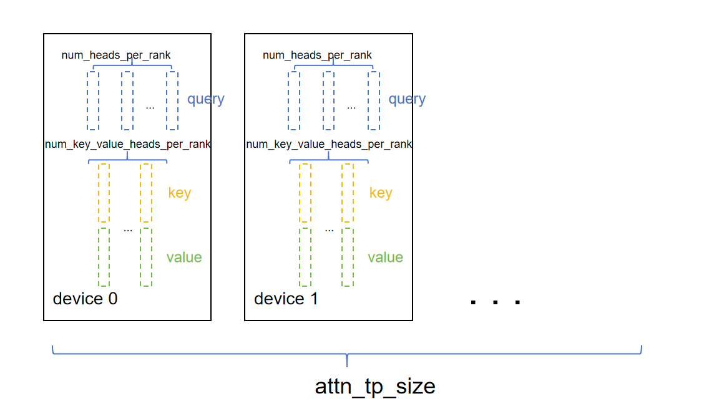
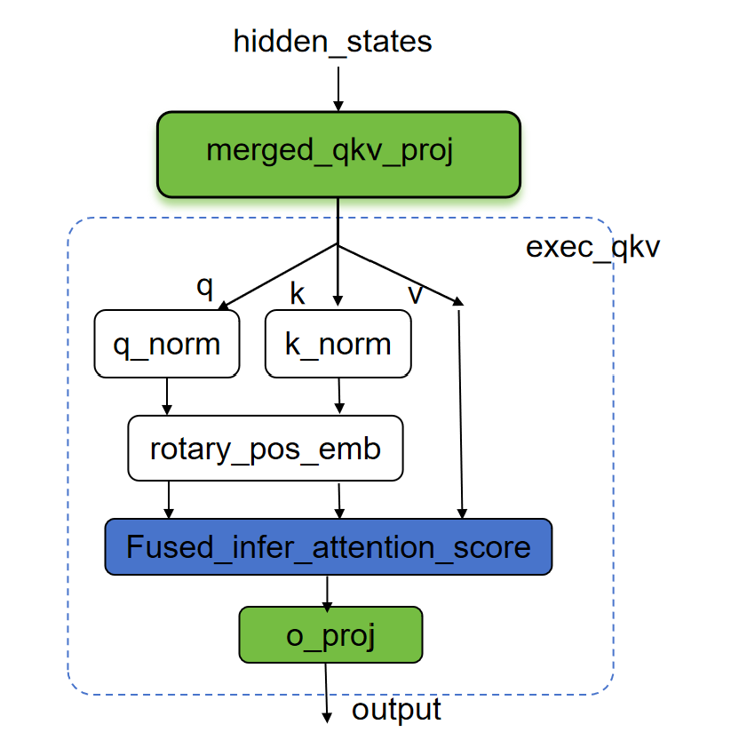
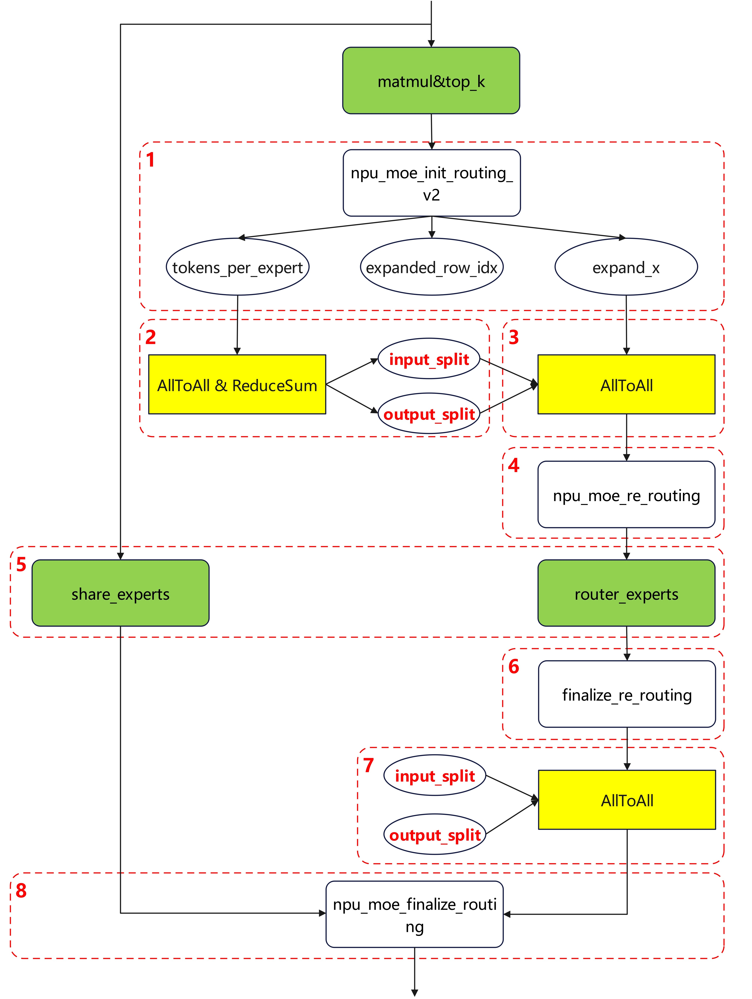

# Qwen3.5-MoE模型推理性能优化实践

## 概述

本文主要介绍Qwen3.5-MoE模型基于NPU的推理优化策略。Qwen3.5-MoE模型同时包含full attention、linear attention和MoE结构，推理链路中既需要优化Attention与MLP类矩阵计算，也需要降低MoE路由、EP通信和归一化等小算子带来的开销。

本文按融合算子、TP/EP并行、图模式、计算逻辑和矩阵融合几个维度展开说明。

## 使能融合算子

### RoPE融合算子优化

Qwen3.5-MoE的full attention层使用MRoPE位置编码。原始实现通常会通过切分、旋转、拼接等多个Tensor算子完成RoPE计算，算子数量较多，且会引入额外的数据搬运开销。

本样例在`Qwen3_5MoeAttention`中使用`torch_npu.npu_rotary_mul`完成query和key的旋转位置编码计算。该算子即RoPE部分的核心融合算子。由于Qwen3.5-MoE只对head维度中的一部分应用RoPE，代码先将query/key拆分为旋转部分和透传部分，仅对旋转部分调用融合算子，最后再与透传部分拼接：

```python
q_rot = torch_npu.npu_rotary_mul(q_rot, cos_4d, sin_4d, rotary_mode='half')
k_rot = torch_npu.npu_rotary_mul(k_rot, cos_4d, sin_4d, rotary_mode='half')
```

该优化为通用优化，在Prefill和Decode阶段均可使用，用于减少RoPE计算中的小算子数量并提升位置编码计算效率。

### FlashAttention融合算子优化

Qwen3.5-MoE的full attention层同时覆盖Prefill全量计算和Decode增量计算。若直接使用PyTorch原生attention实现，需要展开为QK矩阵乘、mask、softmax和PV矩阵乘等多个算子，显存访问和小算子调度开销较高。

本样例使用`npu_fused_infer_attention_score_v2`作为推理场景下的FlashAttention融合算子。full attention层将Q/K/V组织为TND layout，并在写入block化KV cache后，通过`block_table`、`block_size`以及实际序列长度信息传入FA v2算子：

```python
attn_output, _ = fa_ops.npu_fused_infer_attention_score_v2(
    query_states,
    k_cache_fa,
    v_cache_fa,
    num_query_heads=self.num_heads_per_rank,
    num_key_value_heads=self.num_key_value_heads_per_rank,
    softmax_scale=self.scale_fa,
    input_layout="TND",
    sparse_mode=sparse_mode,
    atten_mask=forward_metadata.attention_mask if is_prefill else None,
    actual_seq_qlen=actual_seq_qlen,
    actual_seq_kvlen=actual_seq_kvlen,
    block_table=block_table,
    block_size=self.block_size,
)
```

Prefill阶段通过`sparse_mode=3`和attention mask表达因果掩码；Decode阶段先将当前token的K/V写入KV cache，再通过`actual_seq_kvlen`控制可见的cache范围。图模式Decode场景下，代码切换到`torchair.ops.npu_fused_infer_attention_score_v2`路径，普通eager场景下使用`torch.ops.npu.npu_fused_infer_attention_score_v2`路径。

### ChunkGDR融合算子优化

Qwen3.5-MoE的linear attention层使用Gated DeltaNet结构。Prefill阶段需要对整段序列进行chunk计算，原始PyTorch实现通过多次矩阵乘、decay mask构造、下三角求解等操作完成块内递推，涉及较多中间Tensor搬运和小算子调度。

本样例在`Qwen3_5MoeGatedDeltaNet`中使用`torch_npu.npu_chunk_gated_delta_rule`作为Prefill阶段Gated DeltaNet的融合算子。启用条件为：

- 当前为Prefill阶段。
- `torch_npu`支持`npu_chunk_gated_delta_rule`接口。

融合路径中，算子接收TND格式的query、key、value输入，以及beta门控参数、initial_state递推状态、actual_seq_lengths序列长度信息和decay参数g，一次性完成chunk内的L2归一化、decay计算、下三角求解和递推状态更新：

```python
core_attn_out, last_recurrent_state = torch_npu.npu_chunk_gated_delta_rule(
    query.to(torch.bfloat16),
    key.to(torch.bfloat16),
    value.to(torch.bfloat16),
    beta=beta.to(torch.bfloat16),
    initial_state=initial_state,
    actual_seq_lengths=actual_seq_lens.to(torch.int32),
    scale=scale,
    g=g.to(torch.float32),
)
```

该融合算子将原始PyTorch实现中的以下操作合并：

- chunk decay的cumsum和指数计算。
- 块内注意力矩阵的下三角求解（替代逐行循环更新）。
- 块间递推状态更新和输出计算。

算子输出`core_attn_out`和`last_recurrent_state`，前者为当前chunk的attention输出，后者用于后续chunk计算或传递给Decode阶段。该优化主要用于Linear Attention Prefill场景，减少Gated DeltaNet块内递推计算中的小算子数量并提升计算效率。

### RMSNorm融合算子优化

RMSNorm是Qwen3.5-MoE中高频出现的归一化操作，分布在attention前后、linear attention模块以及最终输出norm中。若使用PyTorch原生算子展开，通常包含平方、均值、rsqrt、乘权重等多个操作，推理时会带来较多小算子调度开销。

本样例在`Qwen3_5MoeRMSNorm`中使用`torch_npu.npu_rms_norm`替换展开计算：

```python
return torch_npu.npu_rms_norm(x, self.norm_weight, self.eps)[0]
```

对于带残差输入的场景，样例使用`torch_npu.npu_add_rms_norm`融合残差相加与RMSNorm计算：

```python
y, _, residual = torch_npu.npu_add_rms_norm(residual, x, self.norm_weight, self.eps)
```

在Gated DeltaNet中，`Qwen3_5MoeRMSNormGated`同样使用`torch_npu.npu_rms_norm`完成归一化，再与门控分支相乘。RMSNorm相关优化属于通用优化，在TP、EP以及不同batch配置下均可使用。

### Matmul AllReduce融合优化

在TP并行场景下，部分线性层计算后需要执行`all_reduce`汇聚各卡结果。常规实现会先执行Matmul，再单独执行集合通信。对于通信和计算开销都比较敏感的场景，可以使用`torch_npu.npu_mm_all_reduce_base`将矩阵乘与all reduce融合，以减少中间结果搬运和通信调度开销。

本样例封装了`qwen3_5_prefill_mm_all_reduce`，在满足条件时对需要TP汇聚的RowParallelLinear输出投影启用Matmul AllReduce融合，包括full attention的`o_proj`、linear attention的`out_proj`以及dense MLP的`down_proj`：

```python
return torch_npu.npu_mm_all_reduce_base(input_, layer.weight.data, hcom, reduce_op="sum")
```

该融合当前只在满足以下条件时启用：

- 开启`enable_mm_all_reduce_base`。
- 当前为Prefill阶段。
- 线性层TP切分数大于1，且输入已经按TP切分。
- 线性层无bias，且不使用`skip_bias_add`。
- 当前线性层为非量化计算路径。
- 能够获取对应通信组的HCCL group name。

该优化主要用于A3等支持该融合能力且通信收益明显的部署场景。若条件不满足，代码会回退到常规线性层计算，再按需执行`dist.all_reduce`。

### MoE Dispatch/Combine融合优化

Qwen3.5-MoE包含大量专家，Decode阶段每个token只激活部分专家。纯EP部署时，token需要按照专家归属在EP组内分发，专家计算完成后再按原token顺序聚合。如果使用普通`all_to_all`配合多次重排、索引和combine操作，会产生较多通信和小算子开销。

本样例在纯EP Decode场景下提供`torch_npu.npu_moe_distribute_dispatch_v2`与`torch_npu.npu_moe_distribute_combine_v2`融合路径。启用条件为：

- 开启`enable_decode_moe_dispatch_combine_v2`。
- 当前为Decode阶段。
- `moe_ep_size > 1`。
- `moe_tp_size == 1`，即纯EP场景。

融合路径中，`npu_moe_distribute_dispatch_v2`根据top-k专家选择结果完成token分发，并输出专家计算所需的辅助信息；专家计算完成后，`npu_moe_distribute_combine_v2`根据dispatch阶段生成的辅助信息完成跨EP聚合、权重加权和原序恢复：

```python
output = torch_npu.npu_moe_distribute_dispatch_v2(**dispatch_args)
...
return torch_npu.npu_moe_distribute_combine_v2(**combine_args)
```

该优化减少了纯EP Decode链路中的手写重排、`all_to_all`和finalize routing开销，更适合Decode阶段小batch、低时延场景。

## TP和EP优化

Qwen3.5-MoE样例通过`parallel_config`分别控制不同模块的并行策略。`attn_tp_size`控制full attention和linear attention的张量并行，`moe_tp_size`控制MoE专家内部矩阵的张量并行，`moe_ep_size = world_size // moe_tp_size`用于控制专家并行规模。Embedding、LM Head、dense MLP和`o_proj`也分别提供独立TP配置，便于根据模型结构和卡数做更细粒度切分。

### Attention TP优化

#### 切分策略

Qwen3.5-MoE的full attention按照head维度进行TP切分。假设attention层的query头数为`num_heads`，切分数量为`attn_tp_size`，则每张卡上的query头数为`num_heads_per_rank = num_heads // attn_tp_size`；key/value头数为`num_key_value_heads`，每张卡上的key/value头数为`num_key_value_heads_per_rank = max(num_key_value_heads // attn_tp_size, 1)`。每张卡只计算本rank负责的Q/K/V head，attention输出后再通过`o_proj`和all reduce完成跨TP汇聚。



Qwen3.5-MoE还包含linear attention层。该模块同样使用`attn_tp_size`切分`linear_num_key_heads`和`linear_num_value_heads`，每张卡计算本rank负责的Gated DeltaNet head。代码中会校验`linear_num_key_heads`和`linear_num_value_heads`必须能被`attn_tp_size`整除，避免切分后head分布不均。

#### 计算分解

full attention层先通过`merged_qkv_proj`一次Matmul完成Q、K、V投影，其中Q投影同时输出attention gate。随后将投影结果拆分为query、key、value，对query和key执行RMSNorm，再对RoPE维度调用`npu_rotary_mul`完成位置编码。K/V写入block化KV cache后，Prefill和Decode阶段统一调用`npu_fused_infer_attention_score_v2`完成attention计算；Decode阶段通过实际KV长度控制当前token可访问的cache范围。attention结果与gate相乘后进入`o_proj`，最后通过all reduce或`npu_mm_all_reduce_base`完成TP汇聚。



linear attention层的计算链路为`in_proj_fused`投影、depthwise conv、Gated DeltaNet核心计算、RMSNormGated以及`out_proj`。其中Q/K/V/Z/B/A投影通过一次`MergedColumnParallelLinear`完成，并按`attn_tp_size`切分；Prefill阶段使用chunk Gated DeltaNet计算整段序列，Decode阶段使用`npu_recurrent_gated_delta_rule`更新递推状态；`out_proj`输出后同样执行TP汇聚。

### MoE TP优化

#### 切分策略

MoE TP用于切分单个专家内部的FFN矩阵计算。假设MoE层的切分数量为`moe_tp_size`，专家个数为`num_experts`，每个专家都按照MLP的TP方式切分：`gate_proj`和`up_proj`按列切分，`down_proj`按行切分。同时，`gate_proj`和`up_proj`在权重加载后合并为`w13_weight`，减少专家计算中的Matmul次数。

#### 计算分解

每个专家层的原始计算为`down_proj(SiLU(gate_proj(x)) * up_proj(x))`。如下图所示，本样例将`gate_proj`和`up_proj`合并为一次GroupedMatmul计算，输出结果通过`npu_swiglu`完成`SiLU(gate) * up`，再通过第二次GroupedMatmul完成`down_proj`计算。专家输出经过`npu_moe_finalize_routing`恢复token顺序并按路由权重聚合；当`moe_tp_size > 1`时，最后通过`moe_tp_group`执行all reduce汇聚各TP分片结果。


该方式适合专家权重较大、需要降低单卡显存占用的场景；当`moe_tp_size == world_size`时，`moe_ep_size`为1，所有专家在TP组内切分计算，不发生EP维度的专家分发。

### MoE EP优化

MoE EP用于将路由专家均匀分布到不同rank上。代码中每张卡只加载本rank负责的专家范围：

```python
experts_per_rank = num_experts // moe_ep_size
local_expert_start = moe_ep_rank * experts_per_rank
local_expert_end = local_expert_start + experts_per_rank
```

普通EP路径采用Double-Routing方式完成token分发、专家计算和结果恢复。该流程如下图所示，图中编号与下方步骤一一对应。



主要计算步骤如下：

1. 调用`npu_moe_init_routing_v2`，对本rank上的token按照top-k专家进行展开和排序，得到`expanded_x`，同时获取每个专家需要计算的token数量`tokens_per_expert`以及用于恢复原始token顺序的`expanded_row_idx`。

2. 对`tokens_per_expert`执行EP组内AlltoAll，计算当前rank需要发送给其他rank的`input_splits`，以及当前rank需要从其他rank接收的`output_splits`。

3. 调用`dist.all_to_all_single`，按照`input_splits`和`output_splits`在`moe_ep_group`内分发token，使每张卡获取本地专家需要处理的token。

4. 调用`npu_moe_re_routing`，对接收到的token按照本地专家重新排序，得到`hidden_states_ordered_by_experts`、`tokens_per_local_expert`以及用于恢复本地接收顺序的`gathered_ids_unsort`。

5. 调用专家计算模块，使用GroupedMatmul完成本rank本地专家的FFN计算。

6. 使用`torch.index_select`按照`gathered_ids_unsort`恢复本地接收token顺序。

7. 再次调用`dist.all_to_all_single`，将专家计算结果从本地专家rank发送回原始token所在rank。

8. 调用`npu_moe_finalize_routing`，根据第1步保存的`expanded_row_idx`恢复token原始顺序，并按照router权重聚合top-k专家输出。

在纯EP Decode场景，即`moe_ep_size > 1`且`moe_tp_size == 1`时，普通Double-Routing链路还可以替换为`npu_moe_distribute_dispatch_v2`和`npu_moe_distribute_combine_v2`融合路径，进一步减少Decode阶段通信路由开销。

## 图模式

Qwen3.5-MoE在Decode阶段以单token增量推理为主，算子粒度较小，在NPU上容易出现Host-bound问题。为减少CPU到NPU的逐算子下发与同步开销，样例结合`torch_npu`的TorchAir图模式编译能力，将Decode阶段尽可能编译为整图执行，从而降低调度开销并提升低时延推理性能。（当前图模式仅支持TP并行配置）

针对图模式的核心处理是：Prefill阶段仍使用普通`model.forward`完成整段输入计算和状态初始化；Decode阶段进入单token生成后，如果`exe_mode`为`ge_graph` (`npugraph_ex`模式暂未验证)，则调用编译后的`model_compiled`执行。

```python
if self.exe_mode in ["ge_graph", "npugraph_ex"] and not is_prefill:
    logits = self.model_compiled(**model_inputs)
else:
    logits = self.model(**model_inputs)
```

图编译在warm-up阶段触发。执行器先运行一次Prefill初始化KV cache和linear attention状态，再使用单token输入触发Decode图编译，保证正式推理时可以直接使用已编译的Decode图。

```python
if self.exe_mode in ["ge_graph", "npugraph_ex"]:
    self.main_worker.compile_model()
```

对于固定配置反复启动的推理任务，可以通过`enable_cache_compile`开启图编译缓存，减少后续启动时的编译等待时间。

## 计算逻辑优化

### Gated DeltaNet三角求解优化

Qwen3.5-MoE的linear attention层使用Gated DeltaNet。Prefill阶段的chunk计算需要构造块内递推关系，原始实现通过`for`循环逐行更新下三角注意力矩阵：

```python
for i in range(1, chunk_size):
    row = attn[..., i, :i].clone()
    sub = attn[..., :i, :i].clone()
    attn[..., i, :i] = row + (row.unsqueeze(-1) * sub).sum(-2)
```

当前样例在`torch_chunk_gated_delta_rule`中增加`torch.linalg.solve_triangular`路径，将逐行循环更新改为三角矩阵求解：

```python
attn = torch.linalg.solve_triangular(
    torch.eye(chunk_size, device=attn.device, dtype=attn.dtype) - attn,
    attn,
    upper=False,
)
```

该优化通过`enable_gdn_solve_triangular`控制，仅在使用PyTorch chunk Gated DeltaNet路径时生效。对于Qwen3.5-35B模型2p场景，可以降低Prefill阶段GDN块内递推计算开销。

## 矩阵融合优化

### Gated DeltaNet输入投影融合

Qwen3.5-MoE的linear attention层包含Gated DeltaNet结构。原始实现中，`in_proj_qkv`、`in_proj_z`、`in_proj_b`和`in_proj_a`是多次独立线性层计算：

```python
mixed_qkv = self.in_proj_qkv(hidden_states)
z = self.in_proj_z(hidden_states)
b = self.in_proj_b(hidden_states)
a = self.in_proj_a(hidden_states)
```

当前样例将上述输入投影合并为`in_proj_fused`，通过一次`MergedColumnParallelLinear`同时计算Q/K/V分支、Z门控分支以及B/A分支，再按输出维度拆分：

```python
fused_proj = self.in_proj_fused(hidden_states)
mixed_qkv, z, b, a = torch.split(
    fused_proj,
    [self.key_dim * 2 + self.value_dim, self.value_dim, self.num_v_heads, self.num_v_heads],
    dim=-1,
)
```

该优化减少了Gated DeltaNet输入侧的Matmul次数，也让`mixed_qkv`、`z`、`b`和`a`走同一套TP切分、量化和输出dtype路径，避免多路独立投影在量化或并行切分场景下出现dtype不一致。随后`mixed_qkv`进入depthwise conv和Gated DeltaNet核心计算，`z`作为RMSNormGated的门控输入参与输出归一化，`b`和`a`用于生成Gated DeltaNet中的递推参数。
