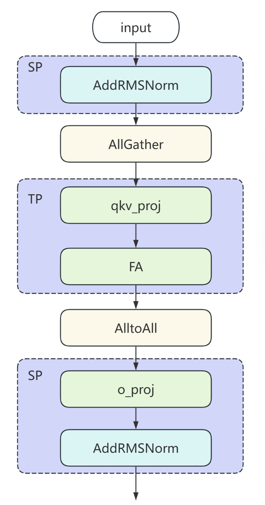

# 基于Atlas A3、950训练/推理集群的Qwen3-MoE模型低时延推理性能优化实践
## 概述
本文主要介绍Qwen3-MoE模型基于NPU的低时延推理优化策略。
- 基于Atlas A3 训练/推理系列产品，decode采用8卡部署，实现BF16场景下单batch推理时延小于20ms。
- 基于Atlas 950 PR 训练/推理系列产品，decode采用4卡部署，实现W4A8混精推理4K场景下单batch Prefill时延小于280ms,Decode时延小于24ms。


## 低时延场景Tensor Parallel (TP)优化
### Attention TP优化
#### 切分策略
对Attention的张量切分策略可以分为对QKV头的切分和对线性层的切分。
在对QKV头切分时，attention的多头计算机制可以方便进行张量切分，每个头先独立计算，再将结果concat起来。假设模型的attention层需要对`num_heads`个query按照切分数量`attn_tp_size`进行切分，要求`num_heads`必须能被`attn_tp_size`整除，每张卡放置query头个数为`num_heads_per_rank = num_heads // attn_tp_size`；key和value头数相等，且可能小于等于query头个数（在MQA和GQA的场景下会小于）。为了确保每张卡至少放置一个key和value头，每张卡放置的key或value头数计算方法为
`num_key_value_heads_per_rank = max(num_key_value_heads // attn_tp_size, 1)`。QKV头在多卡上的排布情况如下图所示。


在对线性层`o_proj`进行切分时，按照行切分即可。

#### 计算分解
该优化策略先将Q、K、V的线性层计算合并为一次Matmul计算（图中merged_qkv_proj），提升计算性能。将`merged_qkv_proj`的输出结果按Q、K、V拆分后，对Q和K进行归一化操作并使用旋转位置编码，再计算attention（图中Fused_infer_attention_score），最后通过o_proj层输出。


### MoE TP优化
#### 切分策略
假设模型的MoE层的切分数量为`moe_tp_size`，专家个数为`expert_num`。对MoE层进行张量切分，每个专家相当于一个mlp层，切分方法与mlp的张量切分方法相似。具体做法是对`gate_proj`与`up_proj`进行列切分，对`down_proj`进行行切分。同时对`gate_proj`与`up_proj`线性层采用合并计算的优化方式，得到`w13_weight`。

#### 计算分解
每个专家层存在gate_proj、up_proj与down_proj三个matmul运算，具体运算为 x = down( SiLU(gate(x))*up(x) )。本优化将张量切分后的gate_proj和up_proj进行concat操作，再使能[torch_npu.npu_swiglu](https://www.hiascend.com/document/detail/zh/Pytorch/710/apiref/torchnpuCustomsapi/context/%EF%BC%88beta%EF%BC%89torch_npu-npu_swiglu.md)融合算子接口优化，该算子能完成以下两步计算：
- 将输入的x沿最后一维切分为两块，即x = torch.chunk(x, 2, -1)。
- 计算并返回 SiLU(x[0]) * x[1]。

本优化通过将gate_proj与up_proj合并计算，提升整体计算效率。


## 使能融合算子
### GMM使能和Routing优化
在MoE模块中，如果通过for循环处理每个专家，单独计算`expert_num`个前馈神经网络（FFN），容易导致计算效率较低。CANN提供了`GroupedMatmul`算子，可以同时计算多个专家，从而提高计算和搬运效率。具体实现可参考在`Qwen3MoeSparseMoeBlock`类中的`moe_infer_tp`和`moe_infer_fusion`函数。

- 快速选择专家：在计算专家和token之间的路由分数时，可以使用[torch_npu.npu_moe_gating_top_k_softmax](https://www.hiascend.com/document/detail/zh/Pytorch/710/apiref/torchnpuCustomsapi/context/torch_npu-npu_moe_gating_top_k_softmax.md)融合算子，代替原来先topk再softmax多算子操作，可以更快速地计算出token和专家的分数。
- 高效排序和token路由：
    - 使能[torch_npu.npu_moe_init_routing](https://www.hiascend.com/document/detail/zh/Pytorch/710/apiref/torchnpuCustomsapi/context/torch_npu-npu_moe_init_routing.md)融合算子，实现MoE routing计算，获取专家的排序；
    - 使能[torch_npu.npu_moe_compute_expert_tokens](https://www.hiascend.com/document/detail/zh/Pytorch/710/apiref/torchnpuCustomsapi/context/torch_npu-npu_moe_compute_expert_tokens.md)融合算子，获取每个专家需要计算的token数；
    - 使能[torch_npu.npu_moe_finalize_routing](https://www.hiascend.com/document/detail/zh/Pytorch/710/apiref/torchnpuCustomsapi/context/torch_npu-npu_moe_finalize_routing.md)融合算子，将专家计算完成后的token重新排布并加权求和，获得最终输出。
- 高性能专家计算：使能[torch_npu.npu_grouped_matmul](https://www.hiascend.com/document/detail/zh/Pytorch/710/apiref/torchnpuCustomsapi/context/torch_npu-npu_grouped_matmul.md)融合算子，实现多个专家的矩阵乘计算，提高计算和搬运效率。

### RmsNorm算子优化
通过使能[torch_npu.npu_rms_norm](https://www.hiascend.com/document/detail/zh/Pytorch/60RC2/apiref/apilist/ptaoplist_000140.html)算子，能够提升模型的推理性能。RmsNorm是大模型常用的归一化操作，相比LayerNorm，其去掉了减去均值的部分。

### flash attention融合算子优化
通过使能[torch.ops.npu.npu_fused_infer_attention_score](https://www.hiascend.com/document/detail/zh/Pytorch/710/modthirdparty/torchairuseguide/torchair_00086.html)推理场景下支持图模式的FlashAttention算子，既可以支持全量计算场景，也可支持增量计算场景。

## 使能图模式
使用静态图可以获得更好的推理性能。`Qwen3MoeRunner`通过覆写`executor/model_runner.py`中的`ModelRunner`的`graph_compile`函数，将模型编译为静态图。

## 使能图编译缓存
在模型推理场景下，使能图编译缓存可以缓存编译后的静态图，避免每次推理都需要编译模型，从而提高推理性能。可参考`Qwen3MoeRunner`中`graph_compile`函数中的使用：

```python
if self.enable_cache_compile:
    case_name = "compile_cache/" + os.getenv("CASE_NAME")
    cache_dir = os.path.join(os.path.dirname(os.path.abspath(__file__)), case_name)
    self.model.decode = tng.inference.cache_compile(self.model.decode, cache_dir=cache_dir, 
                    config=compiler_config, dynamic=True, fullgraph=True, ge_cache=True)
```
缓存默认路径为`./compile_cache/CASE_NAME`。

## 集合通信使能AIV展开
利用Device的Vector Core计算单元来加速通信操作的执行，可参考[HCCL_OP_EXPANSION_MODE环境变量](https://www.hiascend.com/document/detail/zh/CANNCommunityEdition/83RC1alpha002/maintenref/envvar/envref_07_0096.html)：

```shell
export HCCL_OP_EXPANSION_MODE=AIV
```
## 高吞吐场景Prefill优化（Attention SP+TP, MoE EP）
### 概述
在Prefill推理场景下，模型需要一次性处理完整的输入序列，计算密集度高。为在TTFT时延约束下实现最大吞吐，采用Attention序列并行（SP）+张量并行（TP）与MoE专家并行（EP）的组合策略，结合MXFP8/MXFP4量化与多算子融合，显著降低Prefill阶段的计算与通信开销。

### Attention SP+TP优化
#### 并行策略选择
Prefill阶段算子多为计算bound，TP并行在切分后每卡的序列长度缩短，但AllReduce通信量与完整序列成正比。SP并行沿序列维度切分，每卡仅处理`seq_len // attn_tp_size`长度的子序列，通信算子采用AlltoAll，通信数据量更小且可配合低bit量化。

综合考虑通信数据量、数据类型和额外引入算子三个因素，Prefill阶段Attention采用**SP+TP混合并行**：
- **FA前通信**：使用AllGather将各Rank的子序列聚合成完整序列，配合MXFP8量化减小通信体积；
- **FA后通信**：使用AlltoAll将o_proj的输出按序列维度重新分发到各Rank，配合MXFP8量化。

#### 切分策略
输入序列沿token维度按`attn_tp_size`均分，每个Rank处理`seq_len // attn_tp_size`个token。要求输入序列长度能被`attn_tp_size`整除，不足时进行padding对齐。

```
Rank 0: [token_0, ..., token_{S/P-1}]
Rank 1: [token_{S/P}, ..., token_{2S/P-1}]
...
Rank P-1: [token_{(P-1)S/P}, ..., token_{S-1}]
```

其中`S`为序列长度，`P`为`attn_tp_size`。

#### 计算分解
Prefill阶段的Attention计算流程如下：

1. **序列切分与Embedding**：输入`input_ids`按`attn_tp_size`切分，每个Rank仅对自身持有的子序列做Embedding；
2. **AllGather聚合**：通过`dist.all_gather_into_tensor`将各Rank的`hidden_states`聚合为完整序列，若使能MXFP8量化则同时聚合`hidden_states_scale`；
3. **merged_qkv_proj**：对聚合后的完整序列执行QKV线性层计算；
4. **FlashAttention**：使用`npu_fused_infer_attention_score_v2`完成注意力计算；
5. **o_proj + AlltoAll**：o_proj使用`ReplicatedLinear`（每卡持有完整权重），输出经MXFP8量化后通过AlltoAll按序列维度重新分发，每个Rank仅保留自身负责的子序列部分；
6. **MoE输入准备**：AlltoAll后的输出shape为`(seq_len // attn_tp_size, hidden_size)`，直接作为MoE层的输入。



### MoE EP优化
#### 并行策略选择
MoE部分支持TP和EP两种并行方式。TP并行会将GMM的K或N轴切得过小，导致计算性能下降。EP并行每个Rank持有部分专家，通过通信完成token与专家的路由匹配，在`ep_rank`数较小时通信开销可控。

EP并行进一步分为AllGather方案和Double Routing（AlltoAll）方案：

| 并行策略 | 通信算子 | 通信数据量 | 适用场景 |
|---|---|---|---|
| EP (AllGather) | AllGather + ReduceScatter | (B,S,H) × 2 | `ep_rank`较小、`top_k > ep_rank`时数据量更小 |
| EP (Double Routing) | AlltoAll + AlltoAll | (BS×top_k/ep_rank, H) × 2 | 大EP场景、`ep > top_k`时数据量更小 |

当前Qwen3-MoE模型`top_k=8`，在`ep_rank=4`时`top_k > ep_rank`，AllGather方案通信数据量更小，为默认优选方案。

#### 计算分解（AllGather方案，W4A8量化）
当使能W4A8（MXFP4）量化且`attn_tp_size == moe_ep_size`时，MoE EP采用AllGather + ReduceScatter通信模式，具体流程如下：

1. **MXFP8量化**：对输入`hidden_states`执行`npu_dynamic_mx_quant`，得到MXFP8量化数据及scale；
2. **AllGather**：通过`dist.all_gather_into_tensor`聚合各Rank的量化数据、scale、`topk_ids`和`topk_weight`，得到完整序列的token信息；
3. **Routing**：使用`npu_moe_init_routing_v2`对聚合后的token进行专家路由，仅筛选属于本Rank的专家范围内的token；
4. **GMM计算**：通过`npu_grouped_matmul`（封装在`FusedMoEGMM`中）完成多专家并行矩阵乘计算；
5. **Finalize Routing**：使用`npu_moe_finalize_routing`将专家计算结果按路由信息重新排布并加权求和；
6. **ReduceScatter**：通过`dist.reduce_scatter_tensor`将各Rank的部分结果归约并分发，每个Rank获得自身负责的子序列输出。


#### 计算分解（Double Routing方案）
当未使能W4A8量化时，MoE EP采用Double Routing（AlltoAll）通信模式，具体流程如下：

1. **Routing**：使用`npu_moe_init_routing_v2`对token进行初始路由和排序；
2. **Dispatch（AlltoAll）**：通过`dist.all_to_all_single`将token按专家归属分发到对应Rank，同时交换`tokens_per_expert`信息用于确定接收数量；
3. **Re-routing**：使用`npu_moe_re_routing`对接收到的token进行二次排序；
4. **GMM计算**：通过`npu_grouped_matmul`完成专家计算；
5. **Combine（AlltoAll）**：将专家计算结果通过`dist.all_to_all_single`回传到原始Rank；
6. **Finalize Routing**：使用`npu_moe_finalize_routing`完成最终的结果归约。

### 融合算子优化
Prefill场景下，为减少量化引入的额外算子开销，将归一化、残差加法与量化操作进行融合：

#### 融合RMSNorm + MX量化
通过使能`torch_npu.npu_add_rms_norm_dynamic_mx_quant`融合算子，将残差加法、RMSNorm归一化和MXFP8动态量化合并为一次计算，避免中间结果的反复读写：

```python
hidden_states_mx, residual, hidden_states_scale, _ = \
    torch_npu.npu_add_rms_norm_dynamic_mx_quant(
        hidden_states, past_residual,
        norm_weight, beta=None,
        epsilon=variance_epsilon,
        round_mode='rint',
        dst_type=torch.float8_e4m3fn
    )
```

当残差为None时（首层），使用`torch_npu.npu_rms_norm_dynamic_mx_quant`完成RMSNorm + MX量化融合。

#### 融合RMSNorm + Cast
MoE前的归一化需要同时输出FP32（用于gate计算）和BF16（用于专家计算）两种精度，通过使能`torch_npu.npu_add_rms_norm_cast`融合算子，将残差加法、RMSNorm和数据类型转换合并：

```python
hidden_states_fp32, hidden_states_bf16, _, residual = \
    torch_npu.npu_add_rms_norm_cast(
        hidden_states, residual,
        norm_weight, epsilon
    )
```

### 配置说明
在YAML配置文件中设置Prefill SP+TP与MoE EP相关参数：

```yaml
parallel_config:
  attn_tp_size: 4     # Attention SP/TP并行度，Prefill时同时作为序列并行度
  moe_tp_size: 1      # MoE TP大小，EP场景下设为1
  moe_ep_size: 4      # MoE EP大小，需与attn_tp_size相等以启用SP优化路径
```

参数约束：

| 参数 | 约束条件 | 说明 |
|---|---|---|
| `attn_tp_size` | `world_size % attn_tp_size == 0` | Attention并行度 |
| `moe_ep_size` | `world_size % moe_ep_size == 0` | MoE专家并行度 |
| `attn_tp_size == moe_ep_size` | 推荐相等 | 启用Prefill SP优化路径（`prefill_opt`） |
| `seq_len` | 需能被`attn_tp_size`整除 | 不足时自动padding对齐 |

## 附录
[环境部署以及样例执行](../../../models/qwen3_moe/README.md)
