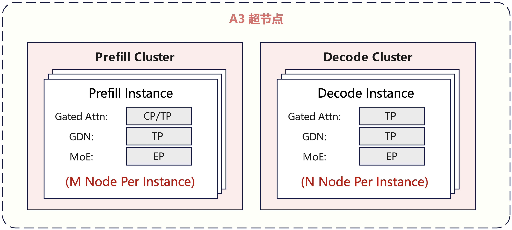
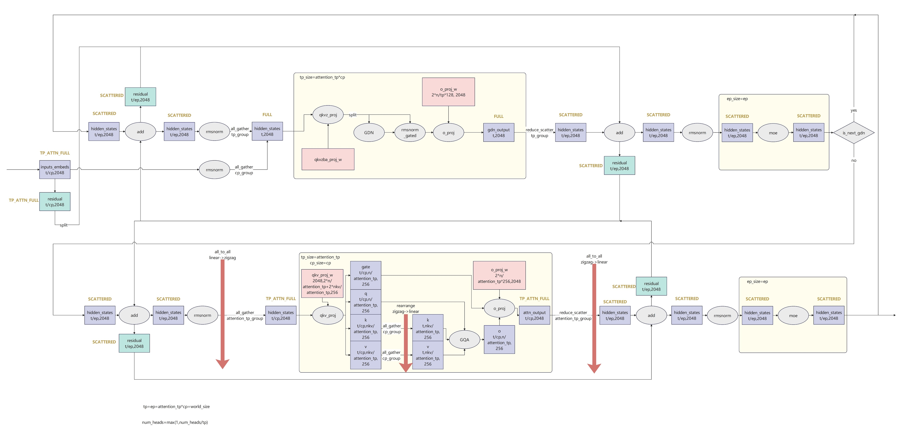
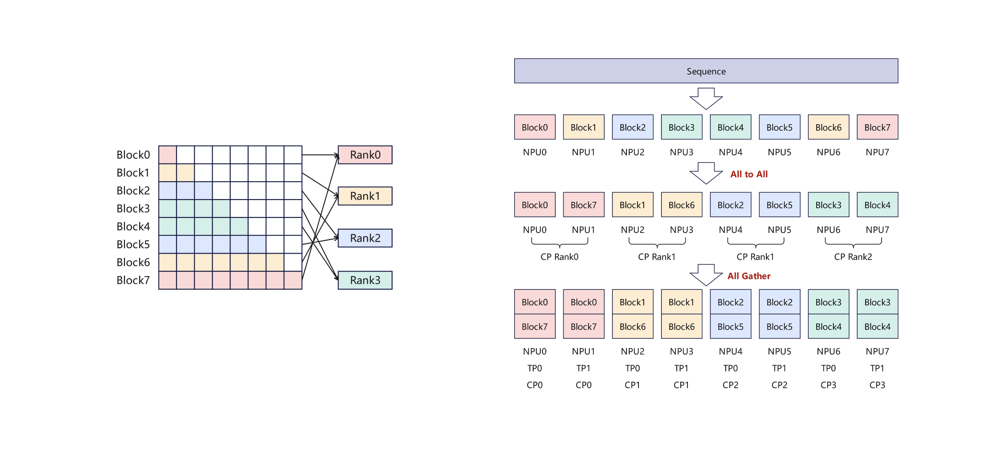
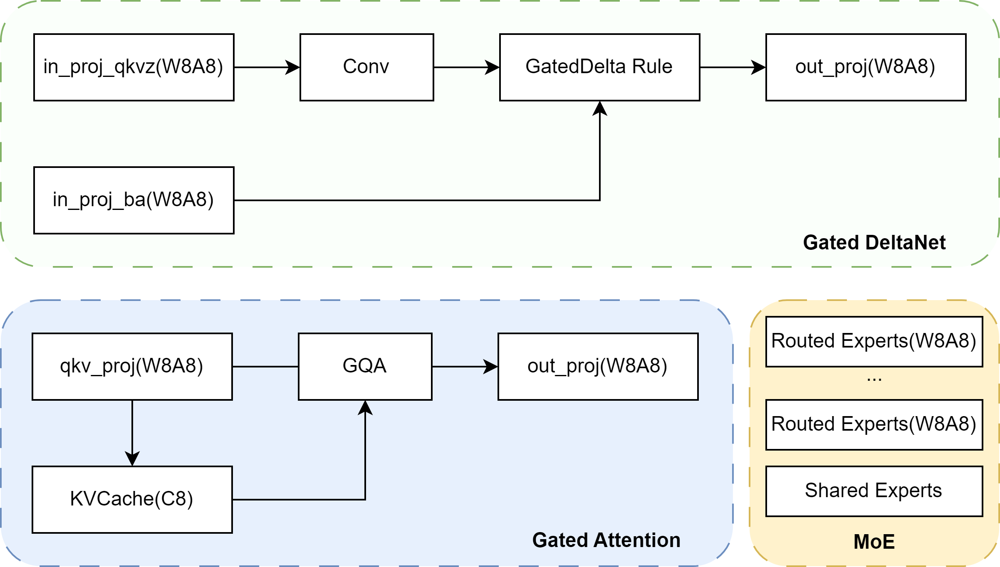

# NPU Qwen3-next推理优化实践

阿里千问团队发布了 Qwen3-Next 模型，使用混合注意力架构，结合GatedAttention和GatedDeltaNet模块，实现超长上下文长度的有效上下文建模。
## 概述
本文旨在分享 Qwen3-Next 模型在昇腾 NPU 上的推理优化实践，重点介绍针对混合注意力架构设计的并行策略、高性能融合算子、MTP 投机推理及 W8A8C8 量化方案，以实现长序列场景下的高性能表现。
## Highlights
- 整体部署策略大EP并行方案，针对GatedAttention采用TP部署策略，叠加实现长序列亲和的CP并行策略，兼顾时延和吞吐。
- 使用AscendC实现的NPU RecurrentGDN融合Kernel，提升decode linear attention性能。
- 基于自研PyPTO框架实现NPU ChunkGDN融合Kernel，提高融合算子编程易用性。
- 支持Int8 W8A8C8量化，MTP1的投机推理。

## 并行策略

Atlas A3推荐部署策略如下图所示，Prefill使用M个节点部署，Decode使用N个节点部署，每个节点包含8卡。其中BF16场景下，推荐根据资源数量、SLA等约束，启用CP并行时，推荐M=1 N=1部署。

  

### Prefill并行策略

Qwen3-Next引入的Gated Attention结构显著增强了长序列上下文的捕捉能力，但在Prefill阶段，随序列长度平方级增长的激活值内存占用使得OOM风险急剧上升，同时如何在超长Context下维持低TTFT是部署的关键挑战。

若使用纯TP策略，在处理超长序列时，TP通信组内将产生巨大的All-Reduce开销。同时Qwen3-Next的Attention Head数为16，这限制了纯TP并行下最大16TP的部署规模。此外，单纯依赖TP切分Head维度，无法从根本上解决Sequence维度带来的OOM风险。

针对Gated Attention与GDN模块计算特性的差异，Qwen3-Next在prefill阶段采取分层异构的并行策略：
1. Gated Attention层采用 CP + TP 混合并行：Gated Attention模块计算复杂度接近$O(S^2)$。我们在此处引入Context Parallel (CP) 配合 Tensor Parallel (TP)。CP将Sequence维度切分到不同Rank，显著降低了单卡的激活值内存占用。
2. GDN层采用 TP 并行： GDN模块涉及沿Sequence的卷积操作，不适合对Sequence轴的切分，且num_head足够TP切分，因此使用纯TP并行。

Prefill的并行策略可以设计为下图形式：

  

- Gated Attention并行策略

  Gated Attention使用mCP * nTP并行，CP复用SGLang框架的DP通信域。以m=4，n=2，64K输入推理为例，每个CP rank处理64K/cp_size=16K个token，每个CP rank内的qkv_proj基于TP2计算，在计算完kv之后，对所有CP域的kv token进行AllGather，得到完整的kv结果。每个rank拿到64K/cp_size的q token和完整的kv token，进行后续的Attention计算。完成Attention计算之后，将输出在TP组内进行Reduce-Scatter，得到MoE输入需要的Scattered排布的数据。

- ZigZag负载均衡

  Attention计算需要遵循因果注意力，如果CP简单按照rank顺序进行切片可能会面临计算负载均衡问题。如第一个rank关注到的历史kv token很少，计算量较小；最后一个rank关注到的历史kv token较多，计算量较大。为了降低负载不均带来的影响，需要将Sequence切分成cp_size*2个block，如下图所示，在prepare_attn阶段，通过All-to-All通信将因果顺序排布的blocks转换为ZigZag排布，每个rank负责计算头尾对称的两个切片，每层Gated Attention计算前通过Token重排将kv还原回因果顺序。Gated Attention计算结束后，在prepare_mlp阶段再次通过All-to-All通信将ZigZag排布的blocks转换为因果顺序排布，

  

### Decode并行策略

Decode阶段使用SGLang框架原生提供的并行能力，在Gated Attention和GDN使用TP并行，MoE使用EP并行。

- Gated Attention/GDN

  在prepare_attn阶段，通过All-Gather通信将上一层MoE输出的Scattered形式排布的数据拼接为完整hidden state。

- MoE

  在prepare_mlp阶段，对Gated Attention/GDN输出的hidden state进行Reduce-Scatter通信，得到MoE输入需要的Scattered排布的数据。

## Multi-Token Prediction(MTP)
MTP机制允许在一次主模型推理过程中同时推理多个Token，在相似的数据搬运下，进行更多的计算，来充分利用芯片的算力，提升模型等效时延和吞吐。需注意，在主模型进行target_verify推理后，需要根据接收情况来更新linear attention结构中的`mamba_cache`，为下一轮计算提供正确的状态矩阵`conv_state`和`ssm_state`。

## 融合Kernel
- 使能npu_recurrent_gated_delta_rule融合算子，替换decode阶段的GDN模块计算，其中包含计算注意力分数和计算并更新`ssm_state`操作。

## 量化策略

相对于BF16推理，Int8量化可以有效降低端到端时延，提升系统吞吐。目前本实践已经支持W8A8C8量化。量化架构如下：

  

- Gated DeltaNet: 除conv外采用W8A8量化；
- Gated Attention: 采用W8A8量化，KVCache使用C8量化。
- MoE: 路由专家使用W8A8量化；
- LM_Head: 暂不量化。

**注: 
W8A8: W8指权重使用静态Per-Channel Int8量化，A8指数据使用动态Per-Token Int8量化；
KVCache C8: 表示KVCache 使用动态Per-Tensor Int8量化；**

**量化模型精度表现**

| 模型 | MMLU | GPQA | DROP | MGSM |
| ---- | ---- | ---- | ---- | ---- |
| BF16 | 89.9 | 73.6 | 88.9 | 92.4 |
| W8A8C8 | 89.8 | 74 | 88.4 | 92 |

## Future Plan

- conv1d_update融合算子AscendC支持
- MegaKernel：Decode阶段仍然存在较多融合算子并行空间，可通过PyPTO实现更大范围的MegaKernel，完成多核MPMD并行调度，提升计算效率
- 线性Attention的序列并行支持：Prefill阶段在256K-1M长序列场景下TTFT耗时较长，但linear attention的TP并行存在上限（num_kv_head），因此进一步并行加速需要支持linear attention层的序列并行减少TTFT耗时

