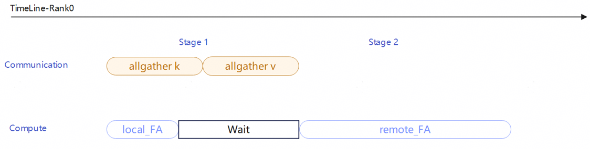

## NPU Wan2.2-I2V模型推理优化实践

本文档主要介绍Wan2.2-I2V模型基于NPU的推理优化策略和实现。
###  NPU npu_fused_infer_attention_score算子适配
首先需要`import torch_npu`以及相关package，在`generate.py`(L30)后加上：
```
import torch_npu
torch_npu.npu.set_compile_mode(jit_compile=False)
torch.npu.config.allow_internal_format=False
from torch_npu.contrib import transfer_to_npu
```
本样例使用torch_npu内置的npu_fused_infer_attention_score融合算子替代FlashAttention算子，该算子详细可见[Ascend社区文档](https://www.hiascend.com/document/detail/zh/Pytorch/720/apiref/torchnpuCustomsapi/context/torch_npu-npu_fused_infer_attention_score.md)。在`wan/modules/attention.py`(L69)的npu_fused_attention函数中，使能fused_infer_attention_score算子：
```
    attention_out, _ = torch_npu.npu_fused_infer_attention_score(
        q, k, v,
        actual_seq_lengths=actual_seq_lengths,
        actual_seq_lengths_kv=actual_seq_lengths_kv,
        num_heads=N,
        scale=float(softmax_scale),
        input_layout="BNSD",
        num_key_value_heads=num_key_value_heads,
        pre_tokens=65535,
        next_tokens=65535 if not causal else 0,
        sparse_mode=0,
        inner_precise=0,
    )
    
    attention_out = attention_out.transpose(1, 2).contiguous()
    return attention_out.to(out_dtype)
```


###  NPU rotary_mul算子适配
本样例使用torch_npu内置的npu_rotary_mul融合算子替换源代码中的小算子实现，npu_rotary_mul详细可见[Ascend社区文档](https://www.hiascend.com/document/detail/zh/Pytorch/710/apiref/torchnpuCustomsapi/context/torch_npu-npu_rotary_mul.md)。在`/wan/modules/model.py`(L58)的rope_apply函数中，使能npu_rotary_mul融合算子：
```
@torch.amp.autocast('cuda', enabled=False)
def rope_apply(x, grid_sizes, freqs_list):
    s, n, c = x.size(1), x.size(2), x.size(3)
    output = []
    for i, (f, h, w) in enumerate(grid_sizes.tolist()):
        x_i = x[i, :s].reshape(1, s, n, c)
        if not x_i.is_contiguous():
            x_i=x_i.contiguous()
        
        cos, sin = freqs_list[i]

        if cos.dim() == 3:
            cos = cos.unsqueeze(0)
            sin = sin.unsqueeze(0)

        cos = cos.to(dtype=x_i.dtype, device=x_i.device)
        sin = sin.to(dtype=x_i.dtype, device=x_i.device)
        
        x_i = torch_npu.npu_rotary_mul(
            input=x_i,
            r1=cos,
            r2=sin,
            rotary_mode="interleave"
        )

        output.append(x_i)
```

###  NPU rms_norm算子适配
本样例使用torch_npu内置的npu_rms_norm融合算子替换源代码中的小算子实现。npu_rms_norm详细可见[Ascend社区文档](https://www.hiascend.com/document/detail/zh/Pytorch/710/apiref/torchnpuCustomsapi/context/%EF%BC%88beta%EF%BC%89torch_npu-npu_rms_norm.md)。

在`/wan/modules/model.py`(L87)的WanRMSNorm.forward中使能了npu_rms_norm融合算子：
```
class WanRMSNorm(nn.Module):

    def __init__(self, dim, eps=1e-5):
        super().__init__()
        self.dim = dim
        self.eps = eps
        self.weight = nn.Parameter(torch.ones(dim))

    def forward(self, x):
        r"""
        Args:
            x(Tensor): Shape [B, L, C]
        """
        return torch_npu.npu_rms_norm(x, self.weight, epsilon=self.eps)[0]
```
###  NPU layer_norm_eval算子适配

本样例使用torch_npu内置的npu_layer_norm_eval融合算子替换源代码中的小算子实现。npu_layer_norm_eval详细可见[Ascend社区文档](https://www.hiascend.com/document/detail/zh/Pytorch/710/apiref/torchnpuCustomsapi/context/%EF%BC%88beta%EF%BC%89torch_npu-npu_layer_norm_eval.md)。

在`/wan/modules/model.py`(L103)的WanLayerNorm.forward中使能了npu_layer_norm_eval融合算子：
```
class WanLayerNorm(nn.LayerNorm):

    def __init__(self, dim, eps=1e-6, elementwise_affine=False):
        super().__init__(dim, elementwise_affine=elementwise_affine, eps=eps)
        self.dim = dim

    def forward(self, x):
        r"""
        Args:
            x(Tensor): Shape [B, L, C]
        """
        return torch_npu.npu_layer_norm_eval(
            x, normalized_shape=[self.dim], weight=self.weight, bias=self.bias, eps=self.eps
        )
```
另外，本样例对部分layer norm(LN)和modulate操作进行了融合，同样使用npu_layer_norm_eval融合算子，在`/wan/modules/model.py`(L119)的FusedLayerNormModulate.forward中使能了相关融合操作：
```
class FusedLayerNormModulate(nn.Module):

    def __init__(self, dim, eps=1e-6):
        super().__init__()
        self.dim = dim
        self.eps = eps

    def forward(self, x, weight, shift):
        r"""
        Args:
            x(Tensor)
        """
        weight = 1.0 + scale
        bias = shift
        return torch_npu.npu_layer_norm_eval(
            x, normalized_shape=[self.dim], weight=weight, bias=bias, eps=self.eps
        )
```
模型每个block内有4个LN操作，其中3个LN操作的gemma和beta都是固定的初始1和0，那么通过(x-mean)/var*1+0)*(scale+1)+shift，调用NPU融合算子npu_layer_norm_eval将3个LN和对应的modulate步骤融合。

###  8卡VAE并行
本样例对模型的VAE并行进行了使能。通过空间并行的方式实现，将大尺寸图像在高度和宽度维度上切分成多个块，分配给不同的NPU进程并行处理，可以加速原模型VAE推理。在`wan/vae_patch_parallel.py`脚本实现此优化。

以下VAE并行流程图展示了空间并行处理的完整执行路径：


1. 首先将输入张量按空间维度切分到多个进程，每个进程处理自己的局部块；
2. 然后在计算过程中根据不同操作的特点采用相应的通信策略——卷积操作通过与邻居交换边界数据来获取上下文，注意力操作通过全局收集所有K,V张量来保证计算完整性，插值操作通过扩展边界、计算后再裁剪来处理上采样；
3. 最后通过两阶段的收集过程将各个进程的局部结果按照原始的空间位置重新拼接成完整的输出张量。

###  CFG并行
本样例对模型的CFG并行进行了使能。在`/wan/iamge2video.py`(L432)实现：
```
for step_idx, t in enumerate(tqdm(timesteps)):
    latent_model_input = [latent.to(self.device)]
    timestep = [t]
    timestep = torch.stack(timestep).to(self.device)
    
    model = self._prepare_model_for_timestep(t, boundary, offload_model)
    sample_guide_scale = guide_scale[1] if t.item() >= boundary else guide_scale[0]
    
    extra_kwargs = {'t_idx': step_idx} if hasattr(self, 'use_sp') and self.use_sp else {}
    
    if get_classifier_free_guidance_world_size() == 2:
        noise_pred = model(
            latent_model_input, t=timestep, **arg_all, **extra_kwargs)[0].to(
                torch.device('cpu') if offload_model else self.device)
        noise_pred_cond, noise_pred_uncond = get_cfg_group().all_gather(
            noise_pred, separate_tensors=True
        )
        if offload_model:
            torch.cuda.empty_cache()
    else:
        noise_pred_cond = model(
            latent_model_input, t=timestep, **arg_c, **extra_kwargs)[0]
        if offload_model:
            torch.cuda.empty_cache()
        noise_pred_uncond = model(
            latent_model_input, t=timestep, **arg_null, **extra_kwargs)[0]
        if offload_model:
            torch.cuda.empty_cache()
    
    noise_pred = noise_pred_uncond + sample_guide_scale * (
        noise_pred_cond - noise_pred_uncond)
```

当检测到CFG并行环境时，它会将条件生成和无条件生成这两个任务分配到两个不同的进程上同时执行，每个进程只需要运行一次模型推理，然后通过all_gather通信操作让两个进程互相获取对方的计算结果，最后使用CFG公式将条件预测和无条件预测按照引导系数混合，得到最终的噪声预测结果，如果没有启用并行环境则会退化到传统模式顺序执行两次模型推理。


###  Ring Attention Overlap

在多卡Ring Attention中，通过异步启动AllGather收集其他卡的KV数据，同时立即使用本地KV计算第一个FA，让NPU计算与网络通信并行执行以掩盖通信延迟；待AllGather完成后，将其他多个远程chunks合并为一个长序列一次性计算第二个FA，最后用LSE（Log-Sum-Exp）算法正确合并两次attention输出，[达成将通信时间隐藏在本地计算中](https://gitcode.com/weixin_45381022/cann-recipes-infer_wan_overlap/blob/master/module/unified_sp/core.py)。


=======
### Dit-Cache

DIT-Cache作为扩散模型推理加速的缓存框架，通过复用/预测已有的结果，减少冗余前向计算。其加速逻辑可清晰的分为Step-level和Block-level范式，Step-level通过判断不同采样步数step间的特定特征差异，通过阈值比较，决定是否跳过完整的step计算，直接复用或者预测缓存结果；Block-level以block为粒度（通常是attention模块和mlp模块）判断是否直接复用或者预测缓存结果。

本样例集成了Step-level的Dit-Cache方案，支持[FBCache](https://github.com/chengzeyi/ParaAttention) 以及 [TeaCache](https://liewfeng.github.io/TeaCache/)。


**Step-level典型方法：** 在Step-level加速范畴内，[FBCache](https://arxiv.org/pdf/2411.19108)的原理是基于First Block L1误差，比较第一个Block输出残差与上一步的第一个Block输出残差之间的差异，如果首块输出误差与上一轮首块输出误差差异小于指定阈值，就跳过当前步计算，复用残差，对当前步的输出进行估计。

[TeaCache](https://liewfeng.github.io/TeaCache/) 利用模型输入与输出的强相关性，通过Timestep Emebdding（输入）来估计输出差异：先利用该输入粗估输出变化，再通过多项式拟合修正缩放偏差，最终以累积差异作为判断标准，动态决定是否复用上一步被Cache的输出，避免冗余计算。由于WAN2.2具有CFG串行的特点，因此本项目采用teacache官方实现的cond/uncond分别管理的 [TeaCache](https://github.com/ali-vilab/TeaCache/tree/main/TeaCache4Wan2.1)。在本代码中详情见[`module/dit_cache_step/cache_step`](../../../module/dit_cache_step/cache_step.py)。

**启动方式：** 本代码模块通过修改cache_config.json文件决定是否使用Cache，Cache范式，Cache相关参数均在[`models/wan2.2-i2v/wan/cache/cache_config.json`](../../../models/wan2.2-i2v/wan/cache/cache_config.json) 中直接修改，同时，在run.sh里面使用如下指令可以自定义cache_config.json位置。
```python
--cache_config './wan/cache/cache_config.json'  #cache_config.json位置。
```      
其中参数意义如下：
```python
{
    "cache_forward": "NoCache",# 直接设置Cache方案，目前支持FBCache/TeaCache,默认启动NOCache，也就是无Dit-Cache方法，只需按照下面的提示将FBCache/TeaCache_double代替NoCache即可启动。
    "comment": "choose from FBCache/TeaCache, otherwise use NoCache", 
    "enable_separate_cfg": true,# CFG适配开关，如果启动CFG分离，需要true开启，进行cond/uncond分开管理。
    "FBCache":{
            "cache_name": "FBCache",
            "rel_l1_thresh": 0.05,  # FBCache阈值，阈值越大跳过越多，精度损失越大，需要平衡性能和精度。
            "latent": "latent",
            "judge_input": "cache_latent"
    },
    "TeaCache":{
            "cache_name" : "TeaCache",
            "rel_l1_thresh": 0.1,  # TeaCache阈值，阈值越大跳过越多，精度损失越大，需要平衡性能和精度
            "coefficients": [733.226126,-401.131952,67.5869174,-3.149879,0.0961237896],  #  TeaCache多项式拟合，通过输入输出进行拟合。
            "latent": "latent",
            "warmup": 2, # 预热步骤，由于部分视频模型在step的开始和结束阶段变换剧烈，因此设置warmup可以强制在开始前和最后的N个阶段计算。
            "judge_input": "modulated_inp"
    },
    "NoCache":{
        "cache_name" : "NoCache"
}
}
```
- **框架位置：** 使用dit_cache_step作为自定义库，在模型forward处导入，具体如下：
```  
    cann-recipes-infer
        +--- models #模型目录
            +--- wan2.2-i2v
                +--- set_env.sh # 激活module环境
                +--- wan
                    +--- cache # cache适配模型接口
                        +--- cache_block.py # dit-cache适配双流模块
                        +--- cache_config.json # 默认cache参数位置
        +--- module
            +--- dit_cache_step # step_level实现逻辑
 ```